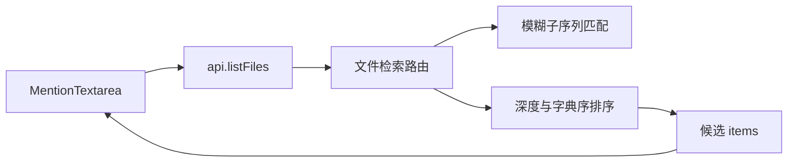
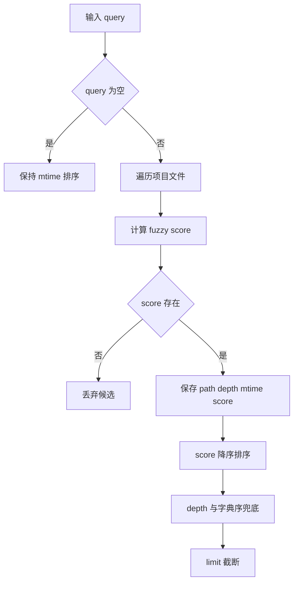

# 260725.feat.file-completion-fzf-sort

## 1. 背景

既有 spec `@.yorz/specs/260703.feat.at-mention-file-completion/spec.md` 已完成 `@` mention 交互与文件路径补全能力。当前用户在 `@src/gui/src/components/MentionTextarea.tsx` 中触发文件补全时，候选结果虽然经过模糊匹配筛选，但排序仍偏粗糙：更贴近输入的路径可能排在较后位置，影响补全效率。

## 2. 需求

1. 对文件路径候选项进行排序优化，让匹配度更高的路径排在更前。
2. 当前逻辑不应只列出所有匹配项；需要引入匹配评分后再排序。
3. 排序机制可参考 fzf 的 Scoring Scheme，但应按项目现有实现做轻量落地。

## 3. 现状分析

当前补全数据流是前端输入 `@<query>` 后调用服务端文件检索接口，前端组件只渲染接口返回的顺序。排序职责已经集中在服务端文件检索路由内，若在前端二次排序，会让不同调用方承担重复逻辑，也会让 `limit` 截断前后的候选优先级不一致。

精确层：现有实现位置

- `src/gui/src/components/MentionTextarea.tsx:115` 的 `debouncedSearch(query)` 调用 `api.listFiles(pid, query)`。
- `src/gui/src/components/MentionTextarea.tsx:121-124` 直接把 `result.items` 写入 `items`，没有排序逻辑。
- `src/service/routes/project-files.ts:42-51` 的 `fuzzyMatch(query, target)` 只返回是否命中，不返回匹配质量。
- `src/service/routes/project-files.ts:179-183` 在有 query 时按 `depth` 再按 `path.localeCompare` 排序，未考虑连续匹配、路径边界、起始位置、大小写等匹配质量。
- `src/service/routes/project-files.ts:188` 排序后再按 `limit` 截断返回，因此服务端排序直接决定用户看到的候选优先级。

现有模糊匹配已经支持 query 字符按顺序出现在路径中，但命中项之间没有质量差异。以 `mts` 为例，`src/gui/src/components/MentionTextarea.tsx` 与 `some/deep/matched-target-source.ts` 都可能命中；现有深度优先排序未必能把更符合路径片段边界和连续性的结果提前。

## 4. 技术实现方案

### 4.1 排序职责放在服务端

服务端 `project-files.ts` 继续作为候选筛选、排序、截断的唯一来源。前端 `MentionTextarea` 保持只消费 `items`，不新增 UI 文案，不触碰 i18n 配置。

### 4.2 用评分函数替代布尔匹配

新增内部评分函数，例如 `scoreFuzzyPath(query, target): number | null`：返回 `null` 表示不匹配，返回数字表示匹配质量。遍历文件时用它同时完成筛选和评分，避免先布尔匹配再重复扫描。

评分参考 fzf 的核心思想做轻量实现：

- 连续匹配加分：相邻字符连续命中时大幅加分。
- 路径边界加分：命中位于 `/`、`-`、`_`、`.` 后或字符串开头时加分。
- 大小写精确加分：字符大小写完全一致时小幅加分。
- 起始位置惩罚：越靠后的首个命中得分越低。
- 间隔惩罚：匹配字符跨度越大，得分越低。
- 路径长度惩罚：相同匹配质量下更短、更聚焦的路径更靠前。

### 4.3 排序规则

有 query 时按以下顺序排序：

1. `score` 降序。
2. `depth` 升序，保持浅层路径在同分时更靠前。
3. `path.localeCompare`，保证结果稳定。

空 query 保持现有 `mtime` 降序逻辑，不改变无输入时的最近文件采样体验。

### 4.4 测试策略

优先为评分函数补充直接单元测试，覆盖连续匹配、路径边界、靠前位置、间隔惩罚、不匹配返回 `null`、排序兜底等行为。若当前路由私有函数不便测试，可将评分函数导出为项目内部工具级函数；不改变 HTTP 响应结构。

### 4.5 兼容性与影响范围

本次方案只改变有 query 时的候选顺序，不改变接口路径、请求参数、响应字段、前端显示结构，也不改变空 query 的最近文件排序。影响范围为服务端排序逻辑与对应测试。

精确层：实施点

- 修改 `src/service/routes/project-files.ts` 的匹配函数与 `CollectedFile` 结构。
- 修改 `src/service/routes/project-files.ts` 的 `walk` 文件收集逻辑，记录 score。
- 修改 `src/service/routes/project-files.ts` 有 query 时的排序比较器。
- 查找项目测试约定后新增或更新 `project-files` 相关测试。

## 5. 待确认项

_暂无_

## 6. 任务清单

- [x] 在 `src/service/routes/project-files.ts` 新增可测试的 fuzzy path 评分函数（验收：不匹配返回 `null`，匹配返回数值分数）
- [x] 更新 `src/service/routes/project-files.ts` 文件收集与有 query 排序逻辑，按 score 降序并保留 depth/path 兜底（验收：返回 items 顺序体现匹配质量优先）
- [x] 新增或更新文件补全排序测试，覆盖连续匹配、路径边界、靠前位置、间隔惩罚、排序兜底（验收：相关测试命令通过）
- [x] 执行 TypeScript 与相关测试验证（验收：`tsc --noEmit` 与目标测试通过，或记录无法执行原因）

## 7. 执行记录

1. 新建 spec，并完成 `现状分析`、`技术实现方案`、`待确认项` 的 plan 内容。
2. 完成 tasks 拆解，待进入 execute 实施。
3. `src/service/routes/project-files.ts` 新增 `scoreFuzzyPath(query, target)`，用分数表达模糊匹配质量；不匹配返回 `null`，匹配返回数值分数。
4. `project-files` 路由收集文件时记录 score，有 query 时按 score 降序、depth 升序、path 字典序排序；空 query 保持 mtime 排序。
5. 新增 `src/service/__tests__/project-files.test.ts`，覆盖评分函数与接口返回顺序；验证：`pnpm vitest run src/service/__tests__/project-files.test.ts` 通过，6 个测试通过。
6. 执行验证：`pnpm typecheck` 通过；`pnpm test` 通过，39 个测试文件、339 个测试全部通过。
7. 非 manual 任务全部完成，待确认项为 `_暂无_`，无 `！！！` 批注，收尾标记 `done`。
