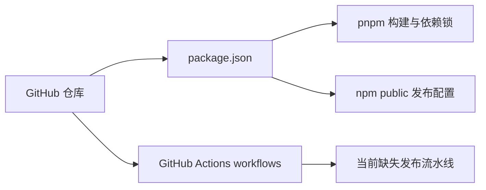
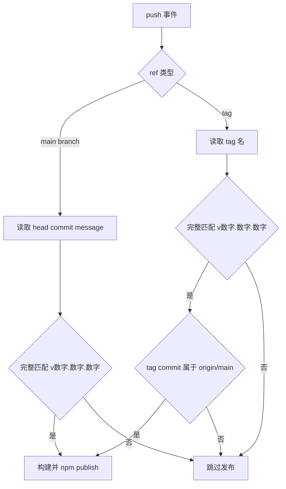
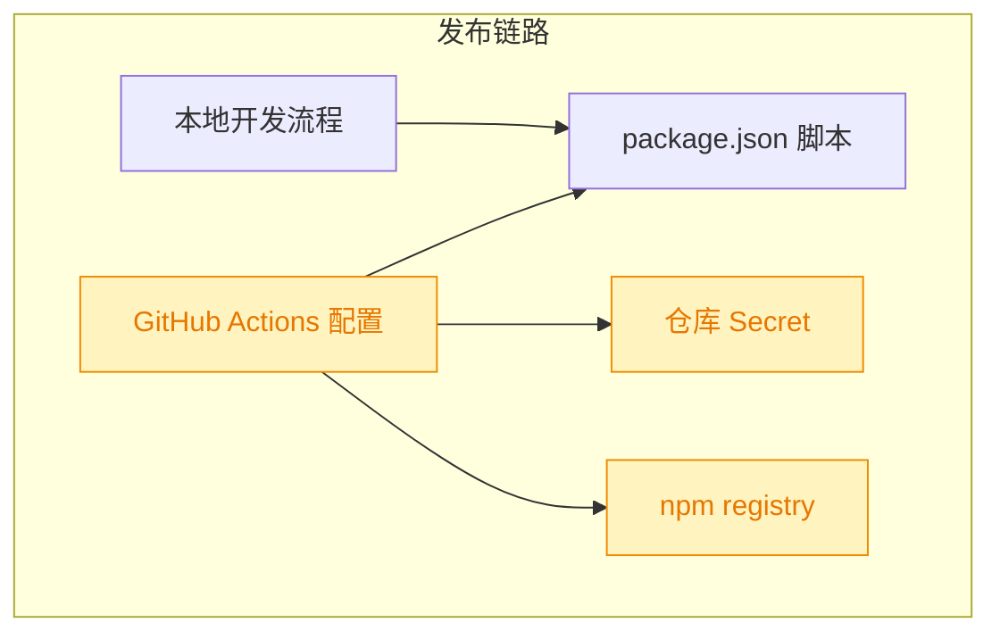

# 260725.feat.github-action-npm-publish

## 1. 背景

当前项目是 npm 包 `@yorz/cli`，包管理器使用 `pnpm`，`package.json` 已配置 `prepublishOnly: pnpm run build` 与 `publishConfig.access: public`，但仓库内没有 `.github/workflows`，还没有自动 npm 发布流水线。

## 2. 需求

配置 GitHub Action，希望检测到 `main` 分支有 `vA.B.C` 格式的 tag 或 commit message 时自动发布 npm。

本 spec 将 `va.b.c` 解释为语义化版本触发格式 `v<major>.<minor>.<patch>`，例如 `v0.3.1`。触发范围限定为 `main`：普通 push 到 `main` 时检查 head commit message；tag push 时要求 tag 名匹配版本格式，且 tag 指向的 commit 已包含在 `origin/main` 中。

## 3. 现状分析

项目已经具备 npm 包发布所需的核心元数据和构建脚本：`name` 为 scoped public 包，`files` 限定发布 `dist` 与 `README.md`，`bin` 指向 CLI 入口，`prepublishOnly` 会在 `npm publish` 前执行构建。缺口集中在 GitHub Actions 自动化：需要新增 workflow 负责安装依赖、验证版本触发条件、构建并调用 `npm publish`。

精确层：现有发布相关配置

- `package.json` 包名为 `@yorz/cli`，当前版本为 `0.3.0`。
- `package.json` 使用 `pnpm` 脚本：`build`、`build:cli`、`build:gui`、`typecheck`、`test`。
- `package.json` 已设置 `publishConfig.access: public`。
- `package.json` 已设置 `prepublishOnly: pnpm run build`，因此 `npm publish` 会再次触发构建。
- 仓库根目录存在 `pnpm-lock.yaml`，未发现 `.github/workflows`。

## 4. 技术实现方案

新增 `.github/workflows/npm-publish.yml`，监听：

1. `push.branches: [main]`，用于处理 commit message 触发。
2. `push.tags: ['v*.*.*']`，用于处理 tag 触发。

发布 job 先通过 shell step 计算 `should_publish`：

1. 分支 push：仅当 `${{ github.ref_name }}` 为 `main` 且 `${{ github.event.head_commit.message }}` 完整匹配 `^v[0-9]+\.[0-9]+\.[0-9]+$` 时发布。
2. tag push：仅当 tag 名完整匹配同一版本正则，且当前 tag commit 可被 `origin/main` 包含时发布。
3. 其它情况正常退出 workflow，不执行发布步骤。

版本正则采用严格整行匹配，不支持 `v1.2.3-beta`、`release v1.2.3` 或多行提交信息中附带版本号，避免普通说明文字误触发发布。

### 4.1 Workflow 执行环境

使用 `actions/checkout@v4` 并设置 `fetch-depth: 0`，让 workflow 能判断 tag commit 是否包含于 `origin/main`。Node 使用 `actions/setup-node@v4`，版本取项目 `engines.node >=20` 对应的 Node 20，并启用 npm registry 配置。

依赖安装使用 `pnpm/action-setup@v4` 与 `pnpm install --frozen-lockfile`，保持和仓库锁文件一致。发布前执行 `pnpm run typecheck`、`pnpm test`、`pnpm run build`，再执行 `npm publish`。

### 4.2 npm 凭据与幂等性

`npm publish` 使用 `NODE_AUTH_TOKEN: ${{ secrets.NPM_TOKEN }}`。仓库需要预先配置 npm automation token 到 GitHub Actions secret `NPM_TOKEN`。

为降低重复触发风险，发布前校验触发 marker 中的版本号必须等于当前 `package.json` 版本；若不一致则失败退出，避免标记 `v0.3.1` 但实际发布 `0.3.0`。随后用 `npm view "$PACKAGE_NAME@$PACKAGE_VERSION" version` 检查当前版本是否已发布。若 npm 上已存在同版本，workflow 输出跳过发布；若不存在则继续发布。

### 4.3 兼容性与影响范围

本次变更只新增 CI 配置，不改变运行时代码、GUI 文案、CLI 行为或 package 发布元数据。直接影响范围是 GitHub Actions 发布链路；外部前置条件是仓库必须配置 `NPM_TOKEN` secret。

精确层：实施点

- 新增 `.github/workflows/npm-publish.yml`。
- workflow 使用 `permissions.contents: read`。
- workflow 通过 `github.ref_type`、`github.ref_name` 与 `github.event.head_commit.message` 判断触发来源。
- tag 触发时执行 `git fetch origin main:refs/remotes/origin/main --prune`，并用 `git merge-base --is-ancestor "$GITHUB_SHA" origin/main` 判断 tag commit 是否包含于 `origin/main`。
- 发布步骤使用 `NODE_AUTH_TOKEN` 读取 `secrets.NPM_TOKEN`。

## 5. 待确认项

_暂无_

## 6. 任务清单

- [x] 新增 `.github/workflows/npm-publish.yml`，覆盖 main commit message 与 vX.Y.Z tag 两类触发路径（验收：workflow 存在且 push branches/tags 配置正确）
- [x] 在 workflow 内实现发布条件判定，确保 tag 必须匹配版本格式且 commit 属于 `origin/main`（验收：shell 条件写入 `should_publish` 并跳过非匹配事件）
- [x] 在 workflow 内配置 Node 20、pnpm 安装、typecheck/test/build 与 npm publish（验收：发布步骤使用 `NODE_AUTH_TOKEN: ${{ secrets.NPM_TOKEN }}`）
- [ ] [manual] 在 GitHub 仓库配置 npm automation token 到 Actions secret `NPM_TOKEN`（验收：仓库 Settings 中存在可用于发布的 secret）
- [x] 执行格式与静态验证（验收：spec lint 通过，workflow YAML 可被格式工具解析）

## 7. 追加任务

- [open] [fix] 2026-07-25 16:19:17 | 我在 codex cli 发送 “hello”， Thread 名称是 "hello"；
  - 描述：我在 codex cli 发送 “hello”， Thread 名称是 "hello"；
在 GUI  chat 中发送 “hello”, 会话名称显示 “未命名会话”；

仍然没有按期望显示总结性名称（codex 为 Thread name）

## 8. 执行记录

1. 新建 spec，并完成 `现状分析`、`技术实现方案`、`待确认项` 的 plan 内容。
2. 完成 tasks 拆解，待进入 execute 实施。
3. 新增 `.github/workflows/npm-publish.yml`，监听 `main` 分支 push 与 `v*.*.*` tag push；发布前用严格 semver marker 正则判断是否继续。
4. workflow 对 tag 触发执行 `git merge-base --is-ancestor "$GITHUB_SHA" origin/main`，确保 tag 指向的 commit 已包含于 `origin/main`。
5. workflow 配置 Node 20、pnpm 9、冻结锁文件安装、`typecheck`、`test`、`build` 与 `npm publish`；发布步骤通过 `secrets.NPM_TOKEN` 注入 `NODE_AUTH_TOKEN`。
6. 执行验证：`npx prettier --check .github/workflows/npm-publish.yml .yorz/specs/260725.feat.github-action-npm-publish/spec.md` 通过；`ruby -e 'require "yaml"; YAML.load_file(ARGV.fetch(0))' .github/workflows/npm-publish.yml` 通过；`git diff --check -- .github/workflows/npm-publish.yml .yorz/specs/260725.feat.github-action-npm-publish/spec.md` 通过；`yorz lint .yorz/specs/260725.feat.github-action-npm-publish/spec.md --format json` 通过。本机未安装 `actionlint`，未执行 Actions 专用 lint。
7. 非 manual 任务全部完成，待确认项为 `_暂无_`，无 `！！！` 批注，收尾标记 `done`。人工任务保留：在 GitHub 仓库配置 npm automation token 到 Actions secret `NPM_TOKEN`。
