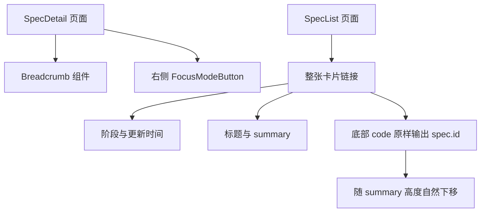
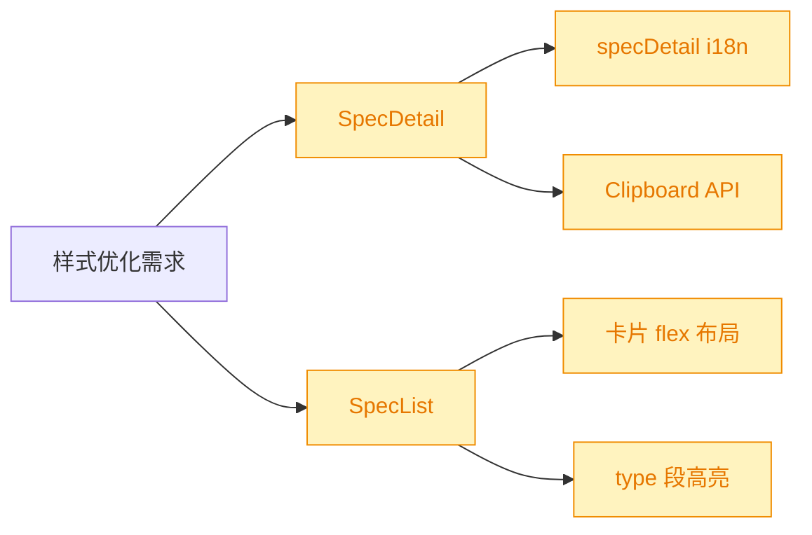
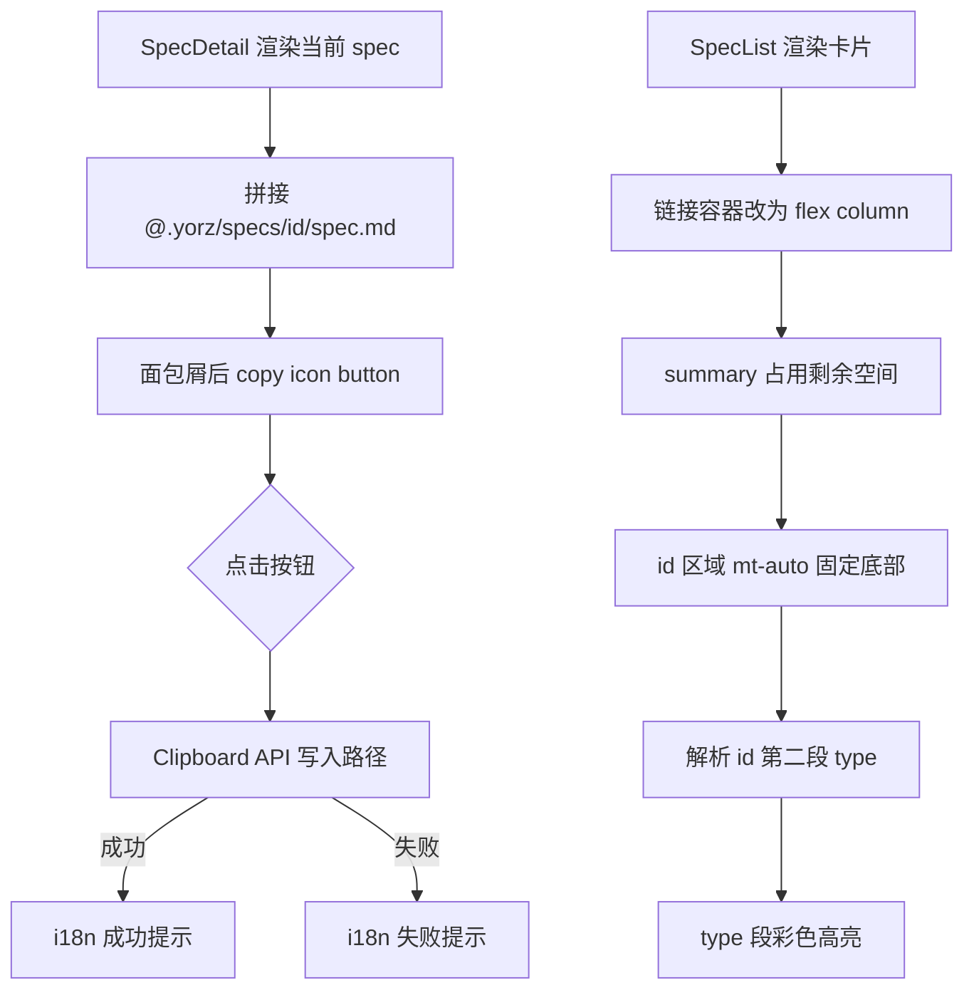
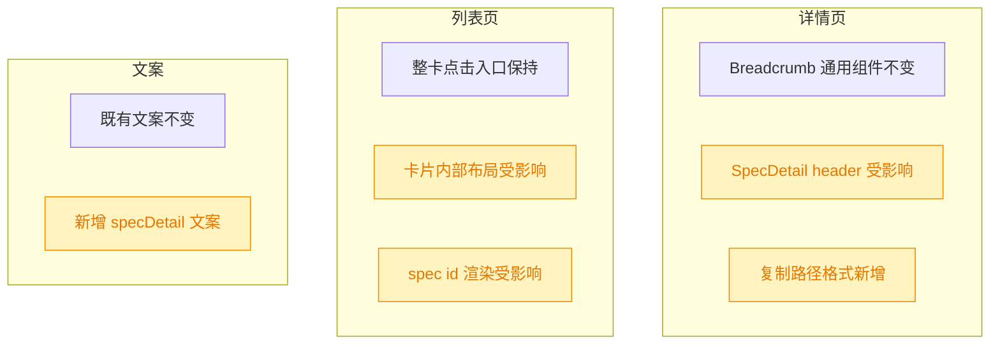

# Spec UI 样式优化

## 1. 背景

Spec 详情页与列表页已有基础浏览能力，但部分信息的操作入口和视觉稳定性仍不够直接：

- 详情页面包屑展示当前 spec id，但用户无法在该位置一键复制对应 spec 文件路径。
- 列表页卡片中的 spec id 跟随 summary 文本自然流布局，summary 长短不一时底部 id 的纵向位置不一致。
- 列表页 spec id 中的类型段 `feat` / `refct` / `fix` 没有视觉区分，扫列表时不易快速识别需求类型。

## 2. 需求

原始需求：

> spec 样式优化：
>
> 1. `@src/gui/src/pages/SpecDetail.tsx` 面包屑组件后面添加一个 copy icon，点击复制 spec 文件路径，如 `需求列表 260722.fix.chat-file-link-copy <copy icon>`，复制内容： `@.yorz/specs/260722.fix.chat-file-link-copy/spec.md`
> 2. `@src/gui/src/pages/SpecList.tsx` 每个卡片中的名称（如 `260722.fix.chat-file-link-copy`）应该固定中卡片底部，避免 summary 内容长短不同导致名称位置不同；
> 3. 卡片底部 spec 名称类型（`feat` `refct` `fix`）字符串使用不同颜色进行高亮，方便肉眼区分。

需求整理：

- 在 SpecDetail 面包屑末尾提供复制按钮，按钮使用 copy 图标，点击后复制当前 spec 文档的项目相对路径，格式为 `@.yorz/specs/<spec-id>/spec.md`。
- 复制成功或失败反馈必须使用 `src/gui/src/i18n/` 中的国际化文案。
- SpecList 卡片整体改为稳定的纵向布局，让 spec id 区域固定在卡片底部。
- SpecList 卡片底部的 spec id 仍完整展示，但其中 type 段按 `feat` / `refct` / `fix` 使用不同颜色高亮。

## 3. 现状分析

当前详情页在 header 第一行使用 `Breadcrumb` 展示“需求列表 / spec id”，同一行右侧是 `FocusModeButton`。该位置适合追加一个小尺寸 icon button，与用户描述的“面包屑组件后面添加 copy icon”一致。项目中已经在 ChatPanel 中使用 Clipboard API 和 toast 完成本地文件路径复制反馈，可复用相同交互风格。

当前列表页每个卡片是 `li > A.block.p-4`，卡片内部依次渲染阶段 badge、标题、summary、`code` spec id。由于链接容器不是 flex column，且 summary 没有占用剩余空间，spec id 会紧跟 summary，导致不同 summary 长度下底部信息不对齐。

现状精确层

- `src/gui/src/pages/SpecDetail.tsx`：已引入 `Breadcrumb`、`FocusModeButton`、`Button`、`Badge`、`t`，尚未引入 copy 图标或 toast。
- `src/gui/src/components/Breadcrumb.tsx`：组件只负责渲染 items，不适合把当前 spec 文件路径复制逻辑塞入通用面包屑组件。
- `src/gui/src/pages/SpecList.tsx`：`SpecListItem` 暴露 `id`、`stage`、`updated_at`、`summary` 等字段；type 可从 `spec.id` 的第二段解析。
- `src/gui/src/components/ChatPanel.tsx`：已有 `navigator.clipboard.writeText` + `toast.success/error` + `t('chat.filePathCopied')` 的复制反馈模式，可作为交互参考。
- `src/gui/src/i18n/zh-CN.ts` / `src/gui/src/i18n/en.ts`：`specDetail` 命名空间已有详情页按钮文案，适合新增复制路径相关文案。

影响面集中在两个页面与 i18n 文案：

## 4. 技术实现方案

技术决策：

- 不修改通用 `Breadcrumb` 组件。复制路径是 SpecDetail 的页面级行为，直接在 `SpecDetail.tsx` 中把 `Breadcrumb` 与 copy icon button 包在同一个 flex 容器内，避免让通用面包屑承担业务路径拼接。
- 复制内容按用户指定格式拼接为 `@.yorz/specs/${s().id}/spec.md`。当前项目配置的 `specsDir` 为 `.yorz/specs`，本需求也明确指定该格式；本轮不扩展为动态读取项目配置，避免引入前端 API 字段变更。
- 使用 `lucide-solid` 的 `Copy` 图标，按钮用现有 `Button variant="ghost" size="icon"`，`title` / `aria-label` 使用 `t('specDetail.copySpecPath')`。
- 复制反馈新增到 `specDetail` i18n：`copySpecPath`、`specPathCopied`、`specPathCopyFailed`。成功/失败通过 `toast.success/error` 展示。
- SpecList 卡片链接改为 `flex h-full min-h-* flex-col`，summary 区域加 `flex-1`，spec id 区域加 `mt-auto`，让 id 固定在卡片底部。
- SpecList 新增 `SPEC_TYPE_TEXT` 或等价映射，为 `feat` / `refct` / `fix` 分别提供不同 text color；渲染 spec id 时拆分 `YYMMDD`、`type`、剩余 slug，保持完整 id 文本可读。

实现精确层

- `src/gui/src/pages/SpecDetail.tsx`：
  - import `Copy` from `lucide-solid`。
  - import `toast` from `../components/ui/sonner.jsx`。
  - 新增 `specPath = createMemo(() => \`@.yorz/specs/${params.id}/spec.md\`)` 或局部函数。
  - 新增 `copySpecPath(path: string)`，调用 `navigator.clipboard?.writeText(path)` 并显示本地化 toast。
  - 在 `Breadcrumb` 后追加 icon button，位置在左侧面包屑组内，右侧 `FocusModeButton` 保持不变。
- `src/gui/src/pages/SpecList.tsx`：
  - 新增 `type SpecKind = 'feat' | 'refct' | 'fix'` 与 `SPEC_TYPE_TEXT` 映射，或直接以字符串映射实现。
  - 新增 `specIdParts(id: string)` 辅助函数，返回 `{ prefix, type, suffix }`；不符合标准格式时整段按 muted code 回退展示。
  - `li` 增加 `overflow-hidden` / `h-full`，`A` 增加 `flex h-full min-h-36 flex-col p-4`，summary 使用 `flex-1`。
  - spec id 渲染仍使用 `code.font-mono.text-sm`，type 子 span 追加高亮 class。
- `src/gui/src/i18n/zh-CN.ts` 与 `src/gui/src/i18n/en.ts`：
  - 新增详情页复制按钮标题和 toast 文案。

兼容性与影响范围：

本方案不改变后端 API、spec 文件结构、路由结构或列表排序逻辑。主要风险是 Clipboard API 在非安全上下文或浏览器限制下失败；现有 ChatPanel 复制逻辑已经接受该模式，失败时展示错误 toast 即可。

## 5. 待确认项

_暂无_

## 6. 任务清单

- [x] 更新 `src/gui/src/pages/SpecDetail.tsx` 的面包屑旁复制按钮与 Clipboard/toast 交互（验收：点击 copy icon 复制 `@.yorz/specs/<id>/spec.md`，按钮文案来自 i18n）
- [x] 更新 `src/gui/src/i18n/zh-CN.ts` 与 `src/gui/src/i18n/en.ts` 的 spec 详情页复制路径文案（验收：新增用户可见文字均可通过 `t('specDetail.*')` 获取）
- [x] 更新 `src/gui/src/pages/SpecList.tsx` 卡片布局与 spec id 渲染（验收：卡片链接为纵向 flex 布局，id 区域固定底部，`feat` / `refct` / `fix` 类型段颜色不同）
- [x] 运行格式化、typecheck 或相关测试验证本次 GUI 改动（验收：可用验证命令通过并记录结果）

## 7. 执行记录

- 2026-07-25 14:43:56：新建 spec，完成需求整理、现状分析与技术实现方案；待确认项为空。
- 2026-07-25 14:45:21：待确认项为空，已生成任务清单并进入 execute 阶段。
- 2026-07-25 14:46:18：完成 SpecDetail 面包屑旁 copy icon button，点击复制 `@.yorz/specs/<id>/spec.md`，复制成功/失败通过 `specDetail` i18n toast 反馈。
- 2026-07-25 14:46:18：完成 `zh-CN` / `en` 的 spec 文件路径复制文案补充，新增展示给用户的文案均来自 i18n 配置。
- 2026-07-25 14:47:34：完成 SpecList 卡片纵向 flex 布局，summary 占用剩余空间，spec id 区域固定在卡片底部；同时拆分 spec id 并按 `feat` / `refct` / `fix` 高亮 type 段。
- 2026-07-25 14:48:11：验证通过：`npx prettier --write src/gui/src/pages/SpecDetail.tsx src/gui/src/pages/SpecList.tsx src/gui/src/i18n/zh-CN.ts src/gui/src/i18n/en.ts`、`pnpm tsc -b`、`pnpm run build:gui`。`build:gui` 仅输出 Vite chunk size warning。
- 2026-07-25 14:48:11：任务全部完成，待确认项为空，标记 done。
