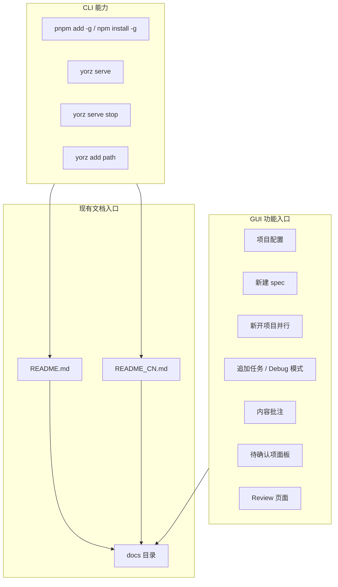
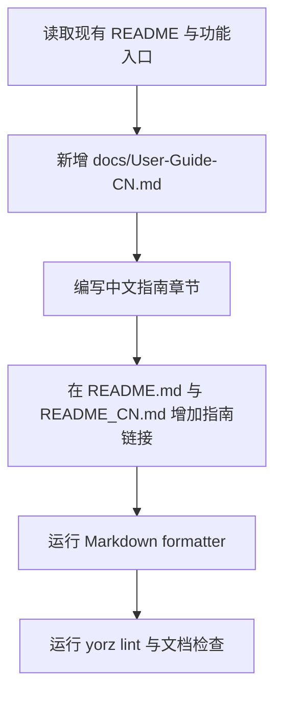
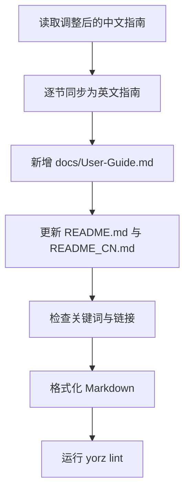

# 中文使用指南文档

## 1. 背景

当前仓库已有 `README.md` 与 `README_CN.md`，覆盖 YorZ 的动机、功能概览、安装、启动服务、停止服务、添加项目和命令参考。用户希望新增一份更完整的中文使用指南，放在 `docs` 目录下，并在 README 文档中插入链接，让新用户能从仓库首页进入指南。

原始需求：

> 编写一份使用指南文档，放在docs目录下，先写中文版本，在readme文档中插入链接。  
> 期望指南文档中主要包含的内容有：
>
> - 安装、启动服务、停止服务、配置目录说明；
> - GUI中的功能介绍：项目配置默认 Agent 方法；新建spec、新开项目并行、追加任务、Debug模式、内容批注、plan 决策待确认项、review 功能

## 2. 需求

新增中文使用指南文档，内容面向 YorZ 使用者，覆盖 CLI 基础使用、配置目录与 GUI 核心功能。

验收目标：

- `docs` 目录下新增中文使用指南文档。
- 指南包含安装、启动服务、停止服务和配置目录说明。
- 指南包含 GUI 功能介绍：项目配置默认 Agent 方法、新建 spec、新开项目并行、追加任务、Debug 模式、内容批注、plan 决策待确认项、review 功能。
- `README.md` 与 `README_CN.md` 中补充指南入口链接。

## 3. 现状分析

当前项目文档入口和功能实现分布如下：

精确层：相关文件与依据

- `README.md`：已有英文安装、启动、停止、添加项目和命令参考。
- `README_CN.md`：已有中文安装、启动、停止、添加项目和命令参考。
- `src/cli/index.ts`：定义 `yorz add <path>`、`yorz serve`、`yorz serve stop`、`yorz lint` 等命令。
- `src/cli/serve.ts`：`yorz serve` 默认后台启动，前台模式支持 `--foreground`，停止命令通过 `yorz serve stop`。
- `src/cli/add.ts`：`yorz add` 会准备项目目录、处理 git 初始化确认、注册项目并确保 `.yorz/tmp` 被忽略。
- `src/gui/src/i18n/zh-CN.ts`：GUI 已有中文文案，包含项目配置、新建 spec、新开项目并行、追加任务、Debug、批注、待确认项和 Review。
- `src/gui/src/components/ProjectConfigDialog.tsx`：项目配置支持选择 `ClaudeCode`、`OpenCode`、`Codex` 或自定义命令，并配置 spec 文档目录。
- `src/gui/src/pages/NewSpec.tsx`：新建 spec 支持选择类型、输入需求、附件和“新开项目并行”。
- `src/gui/src/components/AppendTaskDialog.tsx`：追加任务支持 `feat`、`refct`、`fix`；`fix` 类型可勾选 Debug 模式。
- `src/gui/src/pages/SpecDetail.tsx`：spec 详情页提供追加任务、Review、Debug、阶段状态、内容选区批注和待确认项面板。
- `src/gui/src/pages/SpecReview.tsx`：Review 页面支持生成 review 报告、选择文件、提交、丢弃、暂存。

关键结论：

- 本需求是文档能力补齐，不需要修改运行时代码。
- README 已经有 Quick Start，新增指南链接应放在 Quick Start 或功能介绍附近，降低入口查找成本。
- GUI 文案已通过 `src/gui/src/i18n/` 管理；本次只新增 Markdown 文档，不引入新的 GUI 展示文案，因此不需要改动 i18n 配置。
- 首轮已按“先写中文版本”完成 `docs/User-Guide-CN.md`；追加任务要求将用户调整后的中文内容同步翻译为英文版本，并更新 README 链接。
- 当前 `README.md` 仅链接中文指南；`README_CN.md` 也仅链接中文指南。追加任务完成后，两个 README 应同时提供中英文指南入口。
- 当前 `docs` 目录尚无英文使用指南；新增文件应沿用既有 `docs/` Pascal/Title 风格命名，并与中文指南成对维护。

## 4. 技术实现方案

总体方案：

追加任务方案：

精确层：拟变更文件

- `docs/User-Guide-CN.md`：新增中文使用指南。
- `docs/User-Guide.md`：新增英文使用指南，按当前中文指南逐节同步翻译。
- `README_CN.md`：在中文 README 中插入“使用指南”链接。
- `README.md`：在英文 README 中插入中英文指南链接。
- `.yorz/specs/260726.feat.usage-guide-docs/spec.md`：记录本次 spec 状态、任务与执行记录。

文档结构决策：

- 指南文件名使用 `docs/User-Guide-CN.md`。理由：现有 `docs` 下文档多为英文 Pascal/Title 风格文件名，例如 `Architecture.md`、`Prod-Design.md`，新增指南沿用该风格，同时用 `CN` 明确中文版本。
- 指南内容采用“安装与运行 → 项目与配置目录 → GUI 功能 → 常见工作流”的顺序。理由：先解决用户启动和目录认知，再解释界面功能，符合首次使用路径。
- README 只增加入口链接，不复制指南正文。理由：README 保持快速开始定位，详细说明放入独立指南，避免重复维护。
- 不修改 GUI 代码和 i18n。理由：本次用户要求是仓库文档；没有新增应用内可见文字。
- 英文指南文件名使用 `docs/User-Guide.md`。理由：它是默认英文版，中文版本继续使用 `docs/User-Guide-CN.md`，与 `README.md` / `README_CN.md` 的语言配对一致。
- 英文内容以当前 `docs/User-Guide-CN.md` 为来源逐节翻译，保留同等章节、命令、路径和 GUI 功能点。理由：追加任务明确“将调整后的内容同步翻译”，不能从旧执行记录或旧初稿重新生成。
- `README.md` 的文档区增加英文指南主链接并保留中文指南入口；`README_CN.md` 的使用指南入口补充英文版本链接。理由：两个首页入口都应能跨语言跳转，避免只在英文 README 暴露英文版。

待写入指南章节：

- 安装：`pnpm add -g @yorz/cli` 与 `npm install -g @yorz/cli`。
- 启动服务：`yorz serve`，默认后台运行，默认访问 `http://localhost:7423`。
- 停止服务：`yorz serve stop`。
- 添加项目：`yorz add <path>`，说明 `.yorz/` 初始化、Service 注册和 `.yorz/tmp` gitignore。
- 配置目录说明：项目 `.yorz/config.json`、spec 目录默认 `.yorz/specs`、临时目录 `.yorz/tmp`、全局运行时配置目录承担项目列表和 Service 运行状态。
- GUI 功能：项目配置默认 Agent、新建 spec、新开项目并行、追加任务、Debug 模式、内容批注、plan 决策待确认项、Review 功能。
- 常见工作流：首次接入项目、处理新需求、并行开发、追加缺陷并用 Debug、生成 Review 并处理变更。

## 5. 待确认项

_暂无_

## 6. 任务清单

- [x] 新增 `docs/User-Guide-CN.md` 中文使用指南，覆盖安装、启动服务、停止服务、配置目录说明和指定 GUI 功能（验收：文档存在且 `rg` 能检索到所有指定功能关键词）
- [x] 更新 `README.md` 与 `README_CN.md` 插入使用指南入口链接（验收：两个 README 均包含指向 `docs/User-Guide-CN.md` 的链接）
- [x] 格式化并验证 Markdown 文档与 spec 结构（验收：prettier 成功，`yorz lint .yorz/specs/260726.feat.usage-guide-docs/spec.md --format json` errorCount 为 0）
- [x] 新增 `docs/User-Guide.md` 英文使用指南，并按当前 `docs/User-Guide-CN.md` 同步章节、命令、路径和 GUI 功能点（验收：英文指南存在，且 `rg` 能检索到 Installation、Start the Service、Stop the Service、Configuration Directories、Debug mode、Review）
- [x] 更新 `README.md` 与 `README_CN.md` 的使用指南入口，提供中英文指南链接（验收：两个 README 均包含 `docs/User-Guide.md` 与 `docs/User-Guide-CN.md` 链接）
- [x] 格式化并验证 Markdown 文档与 spec 结构（验收：prettier 成功，`yorz lint .yorz/specs/260726.feat.usage-guide-docs/spec.md --format json` errorCount 为 0）

## 7. 追加任务

- [fixed] [feat] 2026-07-26 16:08:49 | 我对内容进行了一些调整，请将调整后的内容同步翻译至英文版本，并更新 readme 链接。
  - 描述：我对内容进行了一些调整，请将调整后的内容同步翻译至英文版本，并更新 readme 链接。

## 8. 执行记录

- 2026-07-26 15:56:45：创建 spec 并完成 plan 阶段分析，待进入 tasks 阶段拆解执行项。
- 2026-07-26 15:57:41：待确认项为空，生成任务清单并准备进入 execute。
- 2026-07-26 15:59:05：新增 `docs/User-Guide-CN.md`，并用 `rg` 验证安装、启动服务、停止服务、配置目录说明和指定 GUI 功能关键词均已覆盖。
- 2026-07-26 15:59:05：更新 `README.md` 与 `README_CN.md`，并用 `rg` 验证两个 README 均包含 `docs/User-Guide-CN.md` 链接。
- 2026-07-26 15:59:29：运行 `npx prettier --write docs/User-Guide-CN.md README.md README_CN.md .yorz/specs/260726.feat.usage-guide-docs/spec.md` 成功；运行 `yorz lint .yorz/specs/260726.feat.usage-guide-docs/spec.md --format json`，`errorCount` 为 0。
- 2026-07-26 15:59:29：非 manual 任务全部完成，待确认项为空，标记 done。
- 2026-07-26 16:11:39：新增 `docs/User-Guide.md` 英文使用指南；运行 `rg` 验证 Installation、Start the Service、Stop the Service、Configuration Directories、Debug Mode、Review 均已覆盖。
- 2026-07-26 16:12:04：更新 `README.md` 与 `README_CN.md` 的文档入口；运行 `rg` 验证两个 README 均包含 `docs/User-Guide.md` 与 `docs/User-Guide-CN.md` 链接。
- 2026-07-26 16:12:34：运行 `npx prettier --write docs/User-Guide.md docs/User-Guide-CN.md README.md README_CN.md .yorz/specs/260726.feat.usage-guide-docs/spec.md` 成功；运行 `npx prettier --check docs/User-Guide.md docs/User-Guide-CN.md README.md README_CN.md .yorz/specs/260726.feat.usage-guide-docs/spec.md` 通过；运行 `yorz lint .yorz/specs/260726.feat.usage-guide-docs/spec.md --format json`，`errorCount` 为 0。
- 2026-07-26 16:12:34：追加任务已由 `[open]` 标记为 `[fixed]`；非 manual 任务全部完成，待确认项为空，标记 done。
