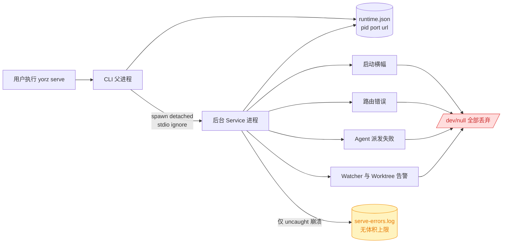
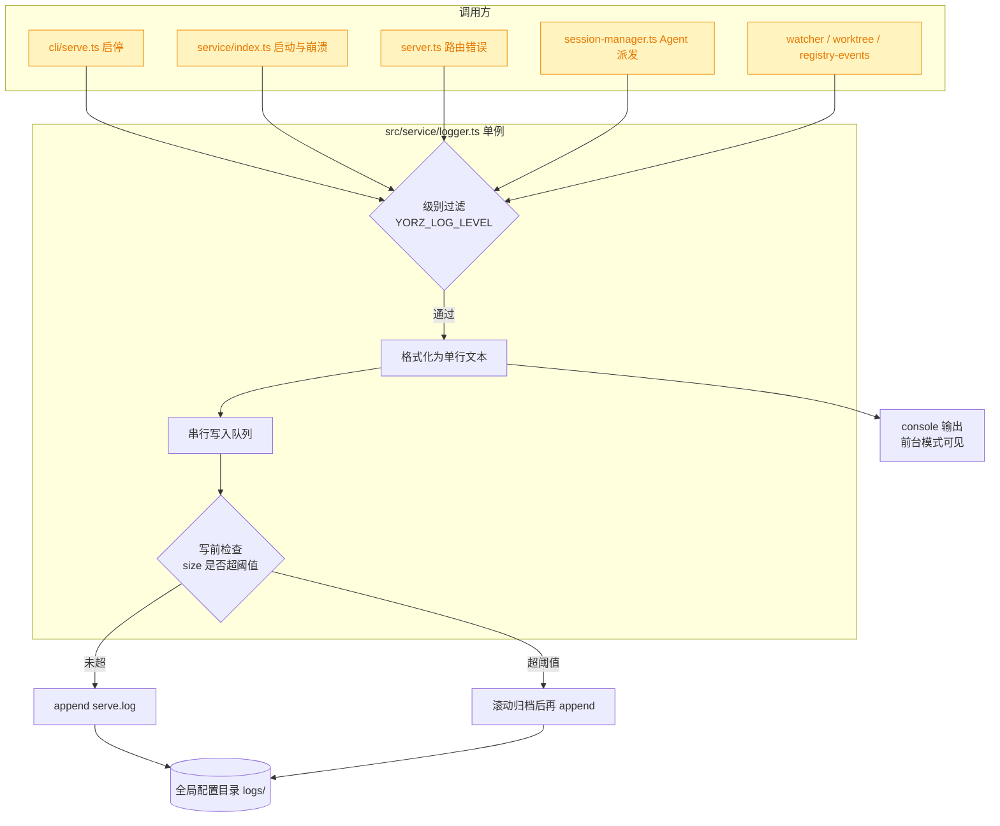
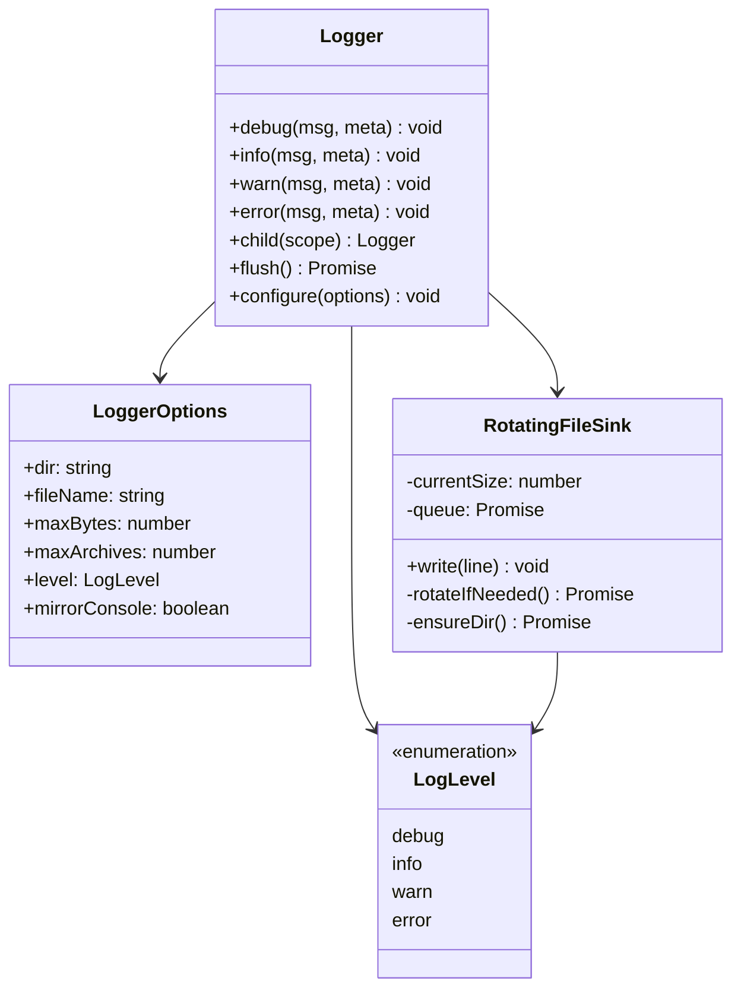
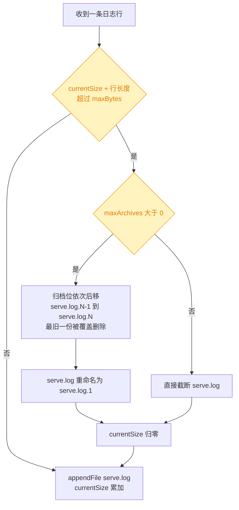
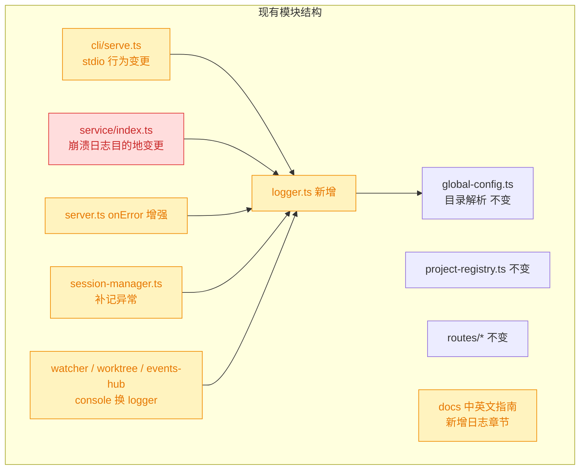

# yorz serve 关键路径日志与滚动日志文件

## 1. 背景

`yorz serve` 默认以后台守护进程方式长期运行。当前后台子进程以 `stdio: 'ignore'` 启动，服务运行期间产生的启动信息、路由错误、Agent 派发失败、Watcher 异常等输出**全部被丢弃**，用户在反馈问题时无法提供任何运行证据，维护者也无法定位。

唯一落盘的信号是 `uncaughtException` / `unhandledRejection` 的崩溃行，写入 `<全局配置目录>/logs/serve-errors.log`，且该文件**无任何体积上限**，长期运行存在无限增长风险。

## 2. 需求

原始需求：

> yorz serve 会启动进程在后台长期运行，期望在服务的路径添加关键日志并写入文件，方便用户分析反馈问题；
> 期望日志文件保持滚动更新，最大不超过 5Mb；
> 日志路径更新到指南文件中 `docs/User-Guide-CN.md`、`docs/User-Guide.md`

拆解为三个目标：

- **目标 A**：在 serve 服务的关键路径上补齐结构化日志埋点。
- **目标 B**：日志写入文件，并按 5MB 上限滚动，避免磁盘无限增长。
- **目标 C**：把日志文件路径与查看方式写入中英文使用指南。

## 3. 现状分析

### 3.1 日志在何处丢失

后台模式下 CLI 父进程 `spawn` 出 detached 子进程时使用 `stdio: 'ignore'`，子进程的 stdout/stderr 直接指向 `/dev/null`；服务内部所有 `console.*` 输出因此在后台模式下等价于「不存在」。

### 3.2 现有可观测性资产盘点

| 能力         | 现状                                                 | 缺口                                        |
| ------------ | ---------------------------------------------------- | ------------------------------------------- |
| 日志抽象层   | **不存在**，全仓 31 处裸 `console.*`（非测试非 GUI） | 无统一格式、无级别、无文件目的地            |
| 文件落盘     | 仅崩溃行写 `logs/serve-errors.log`                   | 仅覆盖 uncaught，正常运行路径零覆盖         |
| 体积控制     | 无                                                   | 无滚动、无上限                              |
| 日志级别开关 | 无（无 `YORZ_LOG` / `DEBUG` 等环境变量）             | 无法按需提高排查粒度                        |
| 第三方日志库 | 无（`pino` / `winston` / `debug` 均未引入）          | 需自研或新增依赖                            |
| 后台 stdio   | `stdio: 'ignore'`                                    | 依赖库直接打印、Node 致命错误栈无法兜底捕获 |

### 3.3 关键路径与 console 调用点分布

精确层：关键文件、行号与现有 console 调用点

**CLI 侧**

- `src/cli/index.ts:117-156` — `serve` 命令与 `serve stop` 子命令注册；`:158-161` 顶层错误兜底。
- `src/cli/serve.ts:47` `runServe()`；`:89` `startBackgroundServe()`；`:109-113` **`spawn(..., { detached: true, stdio: 'ignore' })` ← 日志黑洞根因**；`:131` `backgroundArgs()`；`:156` `runStopServe()`；`:236` `runtimePath()`；`:244` `withStartLock()`；`:307`/`:374` runtime.json v1/v2 读写。
- `src/cli/serve.ts` 现有 `console.log`：`:71, 74, 94, 95, 96, 118, 119, 120, 147, 149, 151`（均为面向用户的 CLI 前台输出，**不应改为文件日志**）。

**Service 侧**

- `src/service/index.ts:34-78` `start()`：`:51,53,56,58` 启动横幅四处 `console.log`；`:60` `installGlobalErrorHandlers()`。
- `src/service/index.ts:138-167` 现有崩溃日志实现：`ensureErrorLogDir()`（`logs/serve-errors.log`）、`logCrash()`、`installGlobalErrorHandlers()`。
- `src/service/server.ts:60-63` `app.onError` → `console.error('[yorz] route error:', err)`。
- `src/service/server.ts:34` worktree 冲突 Agent 启动失败 `console.warn`。
- `src/service/session-manager.ts:219` `send()`；`:238-242` **catch 块把异常转成 SSE `{type:'error'}` 事件后即丢弃，从不落盘 ← Agent 失败的主要盲区**。
- `src/service/events-hub.ts:231` SSE emit 错误 `console.error`。
- `src/service/worktree-manager.ts:300` `console.warn`。
- `src/service/registry-events.ts:53` `console.warn`。
- `src/service/watcher.ts` — chokidar 事件，当前无任何日志。

**全局配置目录解析**

- `src/service/global-config.ts:31-36` `resolveGlobalConfigDir(env = process.env)`：`YORZ_HOME` > `XDG_CONFIG_HOME/yorz` > `~/.config/yorz`。日志目录应复用该函数。

**打包与测试**

- `vite.config.ts` lib 模式打包 `src/cli/index.ts` → 单文件 `dist/cli/index.js`；`:20-40` externals 白名单（未列出的依赖会被内联进 bundle）。
- 单测 Vitest，`include: ['src/**/*.test.ts']`；`src/cli/__tests__/serve.test.ts` 覆盖 `backgroundArgs()` 与 `runStopServe()`，含 `withYorzHome()` 临时目录助手（`:100-111`）；**无测试覆盖真实 spawn 路径**。
- E2E Playwright `webServer` 已依赖 `--foreground` + `stdout:'pipe'`（`playwright.config.ts:38-48`）。

## 4. 技术实现方案

### 4.1 总体设计

新增 `src/service/logger.ts` 作为进程级单例日志器：**自研轻量实现，不引入第三方日志库**。

> 决策说明：不引入 `pino`。`vite.config.ts` 以 lib 模式产出单文件 bundle，`pino` 依赖 worker_threads 与运行时 transport 解析，必须加入 externals 并成为真实运行时依赖，与当前「单文件分发」的打包形态冲突；而本需求只要求「级别 + 文件 + 滚动」三项能力，自研约 120 行即可覆盖。被否决备选：`winston`（体积大、依赖多）、`debug`（只解决开关，不落盘不滚动）。

### 4.2 Logger 模块设计

要点：

- **日志目录**：复用 `resolveGlobalConfigDir()` → `<globalConfigDir>/logs/`，天然遵循 `YORZ_HOME` / `XDG_CONFIG_HOME` 覆盖，测试可用临时目录隔离。
- **主文件**：`serve.log`。
- **单行格式**：`[<ISO 时间戳>] [<级别>] [<scope>] <消息> <meta JSON>`，一条一行，便于 `grep` / `tail -f`。
- **`child(scope)`**：为各模块生成带前缀的子 logger（`serve`、`http`、`agent`、`watcher`、`worktree`、`sse`），避免每个调用点手写前缀。
- **级别**：默认 `info`；`YORZ_LOG_LEVEL=debug|info|warn|error` 覆盖。
- **console 镜像**：`mirrorConsole` 默认开启，前台模式下用户仍能在终端直接看到；后台模式镜像输出落 `/dev/null`，无副作用。
- **写入串行化**：内部维护单条 Promise 链，保证多处并发调用时行不交错、size 计数准确。
- **失败静默**：磁盘写入异常一律 `catch` 吞掉，**日志系统永不影响主流程**。
- **懒初始化**：首次写入时 `mkdir -p` 并 `stat` 现有文件以恢复 `currentSize`，避免进程重启后误判体积。

### 4.3 滚动策略

写入前检查 `currentSize + line.length > maxBytes`：超过则先滚动再写。

默认取值（已定稿）：

| 常量          | 默认值                     | 含义                          |
| ------------- | -------------------------- | ----------------------------- |
| `maxBytes`    | `5 * 1024 * 1024`（5 MiB） | 单个 `serve.log` 的体积上限   |
| `maxArchives` | `1`                        | 仅保留 `serve.log.1` 一份归档 |
| 磁盘峰值      | 约 10 MiB                  | `serve.log` + `serve.log.1`   |

即：`serve.log` 写满 5MB 后重命名为 `serve.log.1`（覆盖上一份归档），随后新建空的 `serve.log` 继续写入，滚动后仍保留上一段完整历史。模块实现按可配置参数编写，上述取值仅作为默认常量。

> 决策记录：「日志文件最大不超过 5MB」口径 —— 用户选择「单文件上限 5MB，保留 1 个归档 `serve.log.1`，磁盘峰值 10MB」，理由：滚动后仍保留上一段完整历史，避免滚动瞬间丢失全部排查线索。

### 4.4 关键路径埋点清单

| scope      | 位置                                     | 级别        | 记录内容                                                           |
| ---------- | ---------------------------------------- | ----------- | ------------------------------------------------------------------ |
| `serve`    | `service/index.ts` `start()`             | info        | 启动完成：pid、port、url、项目数、Node 版本、CLI 版本              |
| `serve`    | `service/index.ts` `listen()`            | warn        | 端口被占用重试、最终绑定失败                                       |
| `serve`    | `cli/serve.ts` 后台拉起 / `runStopServe` | info / warn | spawn pid、等待 runtime 超时、停止时 SIGTERM/SIGKILL、清理陈旧记录 |
| `serve`    | `service/index.ts` `logCrash()`          | error       | uncaughtException / unhandledRejection（含堆栈）                   |
| `http`     | `server.ts` `app.onError`                | error       | method、path、status、错误消息与堆栈                               |
| `http`     | 新增轻量中间件                           | warn/debug  | 非 2xx 响应与慢请求（阈值 1s）；debug 级记录全部请求               |
| `agent`    | `session-manager.ts` `send()`            | info        | 派发开始/结束：sessionId、runId、prompt **长度**、耗时             |
| `agent`    | `session-manager.ts` catch 块            | error       | **当前被吞掉的异常**，补记错误消息与堆栈                           |
| `agent`    | `session-manager.ts` `reconcile()`       | debug       | sessionId 重写前后值                                               |
| `sse`      | `events-hub.ts:231`                      | warn        | emit 失败的 topic 与错误                                           |
| `watcher`  | `watcher.ts`                             | debug       | spec 文件 add/change/unlink 事件路径                               |
| `worktree` | `worktree-manager.ts`                    | info/warn   | worktree 创建/合并/删除结果、冲突 Agent 拉起失败                   |
| `registry` | `registry-events.ts:53`                  | warn        | projects.json 监听异常                                             |

> 决策说明：**日志中不写入 prompt / Agent 输出正文**，仅记录长度、sessionId、耗时等元信息。理由：用户可能把日志直接贴到 issue 中反馈，正文可能含业务代码与私密信息；被否决备选是「debug 级记录 prompt 全文」，因为滚动上限仅 5MB，单条 prompt 即可能冲掉全部历史，收益远低于风险。

> 决策说明：`cli/serve.ts` 中 11 处面向用户的 `console.log`（启动提示、skill 安装提示、stop 结果）**保持 console 不变**，仅额外补 logger 调用。理由：这些是 CLI 交互输出而非服务日志，改为 logger 会破坏用户在前台看到的终端体验。

> 决策说明：`serve-errors.log` **合并进 `serve.log`** 并停止写入旧文件。理由：两份日志会让用户在反馈时贴错文件；崩溃行以 `error` 级别进入统一文件后仍可 `grep uncaughtException` 定位，且立即获得滚动保护（旧文件本就无上限）。旧的 `serve-errors.log` 若已存在则保留不删，避免误删用户现场。

### 4.5 后台 stdio 兜底

`cli/serve.ts:109-113` 的 `stdio: 'ignore'` 改为把子进程 stdout/stderr 定向到 `<logs>/serve-stdio.log` 的文件描述符：

- 以 `'w'` 模式 `openSync`，**每次启动覆盖**，因此天然有界，不需要滚动逻辑。
- 用途是兜底捕获 logger 之外的输出：第三方依赖直接 `console.log`、Node 级致命错误栈、OOM 提示。
- stdin 仍为 `'ignore'`。
- 打开失败（如目录不可写）时回退到原 `'ignore'` 行为，**不阻断服务启动**。

> 决策说明：不把子进程 stdio 直接指向 `serve.log`。理由：滚动时 `rename` 会让子进程持有的 fd 继续指向已改名的旧 inode，写入将「消失」在归档文件里，破坏滚动语义。拆成两个文件是保证滚动正确性的必要代价。

### 4.6 兼容性与影响范围

- 🔴 **breaking**：`serve-errors.log` 停止写入，改由 `serve.log` 承载。任何依赖旧文件名的外部脚本需同步调整（仓库内无此类引用）。
- 🟡 **affected**：后台子进程 stdio 由 `/dev/null` 改为文件；`session-manager` 异常路径新增落盘；多处 `console.*` 替换为 logger（前台可见输出格式变化，内容不减）。
- 无 API / 路由 / 数据结构变更，GUI 侧零改动。
- 打包无新增外部依赖，`vite.config.ts` externals 不变。

### 4.7 文档更新方案

两份指南同步新增独立章节，并更新目录（TOC）与「全局配置目录」的文件清单：

- `docs/User-Guide-CN.md`：在「3. 停止服务」与「4. 添加项目」之间插入 **「4. 查看服务日志」**（后续章节顺延），内容含日志目录路径（含 `YORZ_HOME` / `XDG_CONFIG_HOME` 三种解析结果）、`serve.log` 与 `serve-stdio.log` 的分工、滚动策略与体积上限、`YORZ_LOG_LEVEL` 用法、`tail -f` 查看示例、反馈问题时建议附带哪个文件。
- `docs/User-Guide.md`：镜像同一章节 **"4. View Service Logs"**，术语与现有英文行文保持一致。
- 两份文档「全局配置目录 / Global Configuration Directory」小节的文件清单补 `logs/` 条目。

### 4.8 测试方案

- **新增** `src/service/__tests__/logger.test.ts`：级别过滤、单行格式、`child(scope)` 前缀、达到阈值触发滚动（归档文件生成 + 主文件重置）、归档数量上限（最旧被淘汰）、目录不可写时静默不抛、并发写入不交错。
- **扩展** `src/cli/__tests__/serve.test.ts`：断言后台 spawn 的 stdio 由文件描述符构成、`serve-stdio.log` 被创建、打开失败时回退 `'ignore'`。
- **扩展** `src/service/__tests__/service.test.ts`（或新增用例）：`start()` 后 `serve.log` 存在且含启动行；触发路由错误后含 `[error] [http]` 行。
- 回归：`pnpm typecheck` + `pnpm test` 全绿；E2E 因仍走 `--foreground` + `stdout:'pipe'`，不受影响。

## 5. 待确认项

_暂无_

## 6. 任务清单

- [x] 新增 `src/service/logger.ts`：实现 `LogLevel`、`RotatingFileSink`、`Logger` 单例与 `child(scope)`，日志目录复用 `resolveGlobalConfigDir()` → `<globalConfigDir>/logs/`，主文件 `serve.log`，默认 `maxBytes=5*1024*1024`、`maxArchives=1`、`level=info`、`mirrorConsole=true`（验收：`pnpm typecheck` 通过，模块导出 `getLogger`/`configureLogger`/`resolveLogDir`）
- [x] 在 `src/service/logger.ts` 中实现写入串行化与懒初始化：单条 Promise 链串行 append、首次写入前 `mkdir -p` 并 `stat` 恢复 `currentSize`、所有磁盘异常静默 catch（验收：写入失败不向调用方抛出异常）
- [x] 在 `src/service/logger.ts` 中实现滚动逻辑：写前判断 `currentSize + 行长度 > maxBytes`，超阈值时 `serve.log` → `serve.log.1`（覆盖旧归档）后重置 `currentSize`；`maxArchives=0` 时直接截断（验收：logger 单测中滚动用例通过）
- [x] 新增 `src/service/__tests__/logger.test.ts`：覆盖级别过滤、单行格式、`child(scope)` 前缀、达阈值滚动生成 `serve.log.1` 且主文件重置、归档数量上限淘汰最旧、目录不可写静默不抛、并发写入不交错（验收：`pnpm test` 中该文件全绿）
- [x] 改造 `src/service/index.ts` 崩溃日志：将 `ensureErrorLogDir()`/`logCrash()` 改为通过 logger 以 `error` 级写入 `serve.log`，停止写入 `serve-errors.log`（不删除已有旧文件）（验收：uncaught 处理路径不再引用 `serve-errors.log` 写入）
- [x] 在 `src/service/index.ts` `start()` 补 `serve` scope 埋点：info 记录 pid/port/url/项目数/Node 版本/CLI 版本；`listen()` 端口占用重试与最终绑定失败记 warn（验收：前台启动后 `serve.log` 含启动行）
- [x] 在 `src/service/server.ts` 增强 `app.onError`：以 `http` scope error 级记录 method/path/status/错误消息与堆栈，替换 `console.error('[yorz] route error:', err)`（验收：触发路由错误后日志含 `[error] [http]` 行）
- [x] 在 `src/service/server.ts` 新增轻量请求中间件：非 2xx 响应与超过 1s 的慢请求记 warn，debug 级记录全部请求（验收：debug 级下每个请求产生一行 `[debug] [http]`）
- [x] 将 `src/service/server.ts:34` worktree 冲突 Agent 启动失败的 `console.warn` 改为 `worktree` scope warn 日志（验收：无残留 `console.warn`）
- [x] 在 `src/service/session-manager.ts` `send()` 补 `agent` scope 埋点：info 记录派发开始/结束的 sessionId、runId、prompt 长度、耗时（验收：日志中不出现 prompt 正文）
- [x] 在 `src/service/session-manager.ts:238-242` catch 块补 error 级日志：记录被吞掉异常的消息与堆栈，保持原有 SSE `{type:'error'}` 行为不变（验收：Agent 派发失败时 `serve.log` 含 `[error] [agent]` 行）
- [x] 在 `src/service/session-manager.ts` `reconcile()` 补 debug 级日志：记录 sessionId 重写前后值（验收：debug 级下可见重写记录）
- [x] 将 `src/service/events-hub.ts:231` 的 `console.error` 改为 `sse` scope warn 日志，记录 emit 失败的 topic 与错误（验收：无残留 `console.error`）
- [x] 在 `src/service/watcher.ts` 补 `watcher` scope debug 日志：记录 spec 文件 add/change/unlink 事件路径（验收：debug 级下 spec 变更产生日志行）
- [x] 将 `src/service/worktree-manager.ts:300` 的 `console.warn` 改为 `worktree` scope 日志，并补 worktree 创建/合并/删除结果的 info 记录（验收：无残留 `console.warn`）
- [x] 将 `src/service/registry-events.ts:53` 的 `console.warn` 改为 `registry` scope warn 日志，记录 projects.json 监听异常（验收：无残留 `console.warn`）
- [x] 改造 `src/cli/serve.ts:109-113` 后台 spawn 的 stdio：以 `'w'` 模式 `openSync` `<logs>/serve-stdio.log` 并作为 stdout/stderr 的 fd，stdin 保持 `'ignore'`，打开失败时回退整体 `'ignore'` 不阻断启动（验收：后台启动后 `serve-stdio.log` 被创建）
- [x] 在 `src/cli/serve.ts` 补 `serve` scope 日志：后台 spawn pid、等待 runtime 超时、`runStopServe` 的 SIGTERM/SIGKILL 与清理陈旧记录；保留现有 11 处面向用户的 `console.log` 不变（验收：`console.log` 数量不减，日志文件含对应行）
- [x] 扩展 `src/cli/__tests__/serve.test.ts`：断言后台 spawn 的 stdio 由文件描述符构成、`serve-stdio.log` 被创建、打开失败时回退 `'ignore'`（验收：新增用例通过）
- [x] 扩展 `src/service/__tests__/service.test.ts`：断言 `start()` 后 `serve.log` 存在且含启动行、触发路由错误后含 `[error] [http]` 行（验收：新增用例通过）
- [x] 在 `docs/User-Guide-CN.md` 的「3. 停止服务」与「4. 添加项目」之间插入「4. 查看服务日志」章节并顺延后续编号，内容含日志目录三种解析结果、`serve.log` 与 `serve-stdio.log` 分工、5MB/1 归档滚动策略、`YORZ_LOG_LEVEL` 用法、`tail -f` 示例、反馈建议附带文件（验收：TOC 与正文章节编号一致）
- [x] 在 `docs/User-Guide.md` 镜像新增 "4. View Service Logs" 章节并顺延后续编号，术语与现有英文行文保持一致（验收：TOC 与正文章节编号一致）
- [x] 在两份指南的「全局配置目录 / Global Configuration Directory」文件清单中补 `logs/` 条目（验收：两处清单均含 `logs/`）
- [x] 运行回归验证：`pnpm typecheck` 与 `pnpm test` 全绿（验收：两条命令退出码为 0，结果记入执行记录）

## 7. 执行记录

- 新增 `src/service/logger.ts`（约 250 行，零新增依赖）：`LogLevel`/`LoggerOptions`/`Logger`/`RotatingFileSink`，导出 `createLogger`/`getLogger`/`configureLogger`/`resetLogger`/`resolveLogDir`/`resolveLogLevel`。日志目录复用 `resolveGlobalConfigDir()` → `<globalConfigDir>/logs/`，主文件 `serve.log`，默认 `maxBytes=5*1024*1024`、`maxArchives=1`、`level=info`（`YORZ_LOG_LEVEL` 可覆盖）、`mirrorConsole=true`。
- 写入串行化与懒初始化：`RotatingFileSink.queue` 单条 Promise 链串行 append；首次写入前 `mkdir -p` 并 `stat` 恢复 `currentSize`；`writeNow`/`write`/`flush` 全链路 catch 吞异常，调用方永不感知磁盘错误。
- 滚动逻辑：写前判断 `currentSize > 0 && currentSize + Buffer.byteLength(line) > maxBytes`；超阈值时归档位由 `.N-1` 依次后移到 `.N`（最旧被 rename 覆盖）再 `serve.log` → `serve.log.1`，`currentSize` 归零；`maxArchives=0` 时改为 `writeFile('')` 直接截断。
- 新增 `src/service/__tests__/logger.test.ts`（18 个用例）：默认常量、日志目录/级别解析、级别过滤、单行格式与 Error meta 序列化、`child(scope)` 前缀与嵌套、达阈值滚动、归档上限淘汰最旧、`maxArchives=0` 截断、重启后由 `stat` 恢复体积、目录不可写静默不抛、200 条并发写入不交错、`configure` 重定向与级别热更新。验证：`npx vitest run src/service/__tests__/logger.test.ts` → 18 passed。
- 改造 `src/service/index.ts`：移除 `ensureErrorLogDir()` 与 `serve-errors.log` 写入路径，`logCrash()` 改为 `serve` scope `error` 级写入统一的 `serve.log`（旧文件不删除）；`start()` 新增 `service ready` info 行（pid/port/url/projects/node/cli/logFile）；`listen()` 端口占用重试记 warn、最终绑定失败记 error。
- 改造 `src/service/server.ts`：新增 `app.use('*')` 请求中间件（≥400 记 warn `request failed`、≥1s 记 warn `slow request`、其余记 debug `request`，均含 method/path/status/durationMs）；`app.onError` 改为 `http` scope error 并附 method/path/status/message/stack；worktree 冲突 Agent 启动失败改为 `worktree` scope warn。
- 改造 `src/service/session-manager.ts`：`send()` 增加 `dispatch start` / `dispatch end` info（sessionId、runId、promptLength、durationMs）；原先被吞掉的 catch 块补 `dispatch failed` error（message + stack），SSE `{type:'error'}` 行为保持不变；`reconcile()` 补 debug 记录 sessionId 重写前后值。全部仅记录元信息，不写 prompt / Agent 输出正文。
- 替换剩余裸 console：`events-hub.ts` → `sse` scope warn（topic + err）、`registry-events.ts` → `registry` scope warn（dir + message）、`worktree-manager.ts` → `worktree` scope；并补 worktree 创建/合并/冲突/删除四处生命周期日志。
- 改造 `src/service/watcher.ts`：`handle()` 新增 raw 事件参数，spec 文件 add/change/unlink 记 `watcher` scope debug（event/specId/path）；start 后记 debug、chokidar 运行期 error 记 warn。
- 改造 `src/cli/serve.ts`：新增导出 `backgroundStdio()`，以 `'w'` 模式 `openSync` `<logs>/serve-stdio.log` 作为后台子进程 stdout/stderr 的 fd（stdin 保持 `'ignore'`），异常时整体回退 `'ignore'` 不阻断启动；补 spawn pid、runtime 等待超时、SIGTERM/SIGKILL 升级、陈旧记录清理等 `serve` scope 日志；11 处面向用户的 `console.log` 全部保留（`grep -c` 校验为 11）。
- 额外修正（端到端验证发现）：`startBackgroundServe()` 与 `runStopServe()` 开头调用 `silenceConsoleMirror()`。这两条是纯 CLI 路径、本进程不承载服务，若继续镜像内部日志会污染用户终端，与「保持前台终端体验不变」的决策冲突；前台模式不走这两条路径，console 镜像保持开启。
- 新增 `vitest.setup.ts` 并接入 `vite.config.ts` 的 `setupFiles`：单测启动时把进程级 logger 重定向到临时目录并关闭 console 镜像，避免 `pnpm test` 往开发者真实的 `~/.config/yorz/logs/serve.log` 追加内容、以及日志刷屏测试报告。
- 扩展 `src/cli/__tests__/serve.test.ts`（+3 用例）：后台 stdio 由文件描述符构成且 stdout/stderr 共用同一 fd、`serve-stdio.log` 每次启动被截断、日志目录不可写时回退 `'ignore'`；`withYorzHome` 助手改为向回调传入 home 路径。
- 扩展 `src/service/__tests__/service.test.ts`（+4 用例，新增 `service logging` describe）：`start()` 后 `serve.log` 含 `[info] [serve] service ready` 及 pid/port；POST 触发的路由异常产出 `[error] [http] route error` 且含 path 与错误消息；非 2xx 记 warn、成功请求记 debug；Agent 派发日志只含 `promptLength` 不含 prompt 正文。
- 文档：`docs/User-Guide-CN.md` 在「3. 停止服务」后插入「4. 查看服务日志」，原 4~8 章顺延为 5~9 章，TOC 与正文锚点同步更新；`docs/User-Guide.md` 镜像新增 "4. View Service Logs" 并同样顺延 5~8 章。两章均含日志目录三种解析结果、`serve.log`/`serve-stdio.log` 分工表、5MB + 1 归档滚动策略与约 10MB 上限、单行格式说明、`tail -f` 示例、`YORZ_LOG_LEVEL` 用法、反馈建议附带文件与「不落 prompt 正文」的隐私声明。两份指南的全局配置目录文件清单均补 `logs/` 条目。`npx prettier --check` 通过。
- 回归验证：`pnpm typecheck` 通过（修复 `MergeBackResult` 联合类型下 `conflictSpecId` 的窄化）；`pnpm test` → 41 个测试文件 / 370 个用例全绿；`pnpm build` 成功，externals 与打包形态未变（无新增运行时依赖）。
- 端到端实跑（构建产物 + 临时 `YORZ_HOME`）：`yorz serve` 后台启动 → `logs/serve.log` 与 `logs/serve-stdio.log` 均生成；`serve.log` 含 CLI 的 `background service spawned` 与服务侧的 `service ready`；`curl` 404 请求产出 `[warn] [http] request failed`；`yorz serve stop` 产出 `sent SIGTERM`；终端可见输出仅剩原有的用户提示行。
- 收尾：任务清单全部完成，待确认项为 `_暂无_`，无 `！！！` 批注与 `[open]` 追加任务，stage 置为 `done`。
