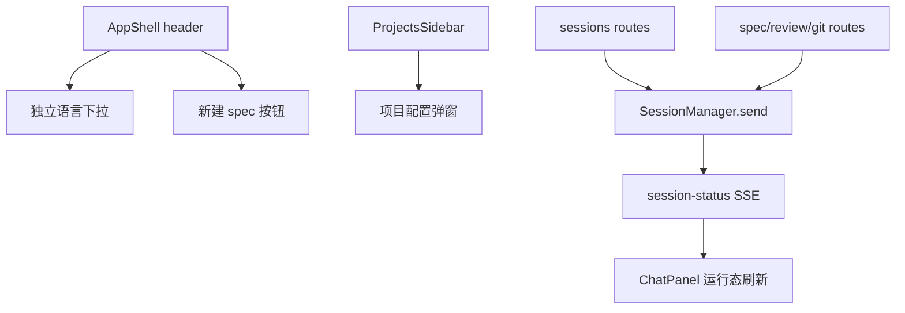
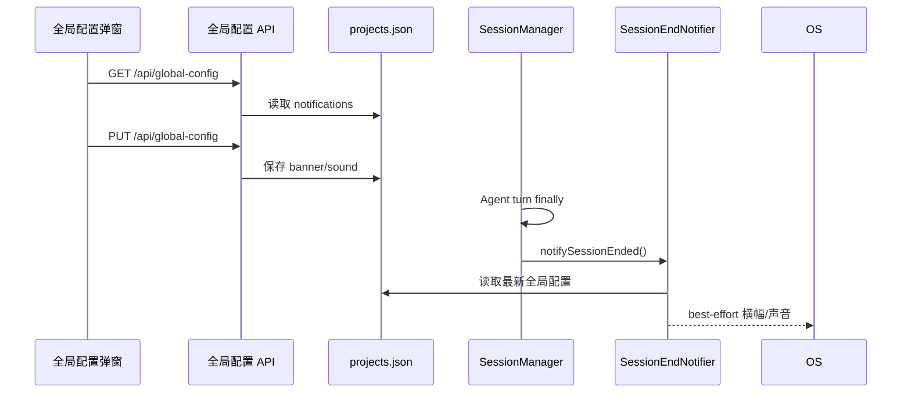
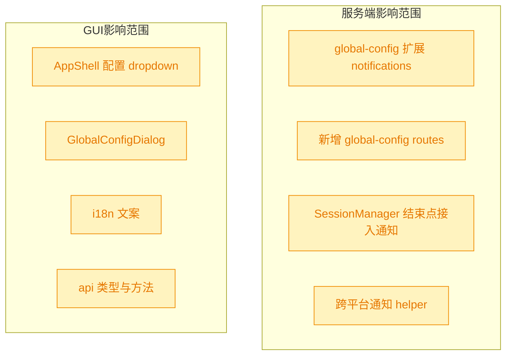
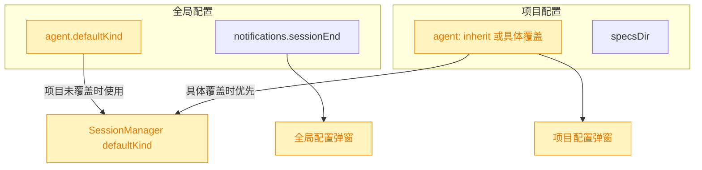
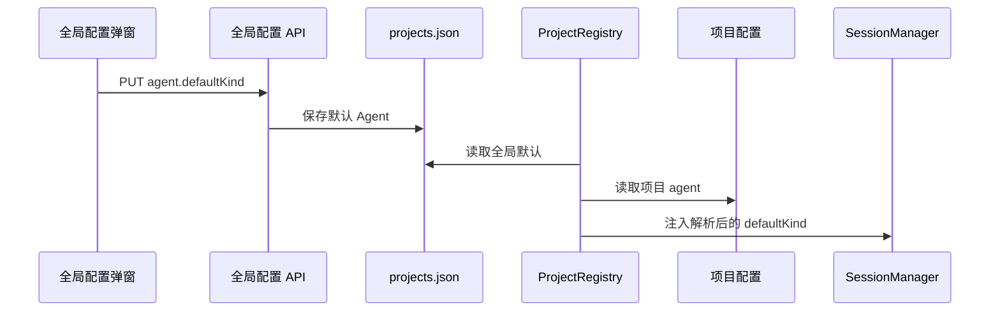
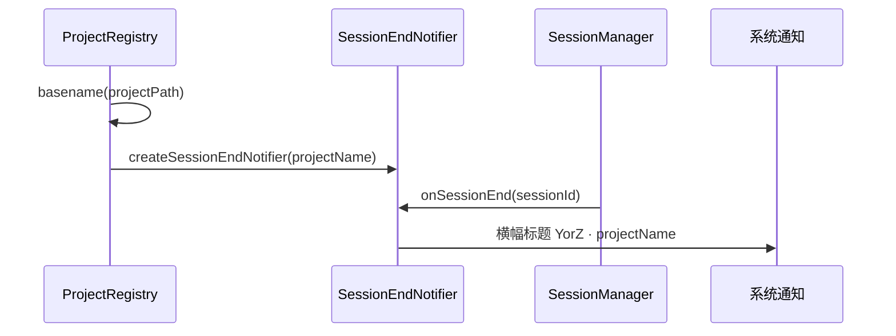

# 会话结束横幅与声音提醒

## 1. 背景

`yorz serve` 运行在 Node 后台服务中，用户希望 Agent 会话结束时能用可配置的横幅或声音提示完成状态，并尽量兼容不同操作系统。

原始需求：

```text
yorz serve 是在 node 后台环境运行的服务，我希望当一个会话结束时能配置横幅或声音（两个 checkbox box）提示，兼容不同操作系统。
@src/service/routes/sessions.ts

配置入口在 header 最右侧新增一个 配置 icon（三横），dropdown：
- 语言切换（当前已实现）
- 全局配置

新增一个 全局配置弹窗
```

## 2. 需求

- 会话结束时支持两个独立的全局开关：横幅提示、声音提示。
- 提示逻辑在服务端触发，覆盖 GUI 普通会话、spec 执行、review/git 等复用 session 的后台 Agent 轮次。
- 横幅与声音以 best-effort 方式兼容 macOS、Linux、Windows；缺少系统命令或运行环境不支持时不影响会话结束流程。
- header 最右侧新增三横配置图标，点击后展示 dropdown。
- dropdown 内包含语言切换入口和全局配置入口；语言切换复用现有实现。
- 新增全局配置弹窗，使用两个 checkbox 配置会话结束横幅和声音。
- 展示给用户的 GUI 文案必须写入 `src/gui/src/i18n/`。

## 3. 现状分析



当前实现具备以下基础：

- `AppShell` 已实现 header 右侧的语言切换下拉，但入口是 `Languages` 独立 icon，不是统一配置 dropdown。
- `ProjectConfigDialog` 与项目级 `.yorz/config.json` 已存在，配置项包括 Agent 类型和 specsDir；它从侧边栏项目行触发，不是全局配置。
- `SessionManager.send()` 是所有 Agent 轮次的统一结束点。无论入口来自 `src/service/routes/sessions.ts`、spec run、review 还是 git ops，最终都会进入 `finally`，触发 `store.touch()`、`running=false` 状态和 `done` 事件。
- `EventsHub` 已把 `SessionManager.subscribeStatus()` 暴露为 `project:<pid>:sessions` 的 `session-status` SSE，GUI 可用它刷新运行态；但目前没有服务端结束提醒副作用。
- 全局配置文件 `src/service/global-config.ts` 目前只持久化 projects 列表，适合扩展一个全局 `notifications` 配置对象。
- 追加任务处理前，`GlobalConfigDialog` 的两个会话结束提示 checkbox 是纵向排列；`ProjectConfig` 的 `agent` 字段总是持久化具体 Agent，缺少“继承全局默认”的表达。
- Agent 默认值读取有两条路径：Service runtime 由 `ProjectRegistry.materialize()` 调 `resolveAgentKind(input.path)` 注入 `SessionManager`；保留的 CLI spawn 路径由 `resolveAgentCmd()` 同步读取项目配置。两条路径当前都在项目配置缺失时回退 `claude`。
- 横幅提醒标题目前在 `session-end-notifier` 内固定为 `YorZ`；`SessionManager` 的 `onSessionEnd` 回调只传递 `sessionId`，而项目名已可在 `ProjectRegistry.materialize()` 中由项目路径 basename 得到，适合作为 notifier 创建参数注入。

<details>
<summary>现状精确层</summary>

- `src/gui/src/AppShell.tsx`：header 右侧包含新建 spec 按钮和语言切换 `DropdownMenu`。
- `src/gui/src/components/ProjectConfigDialog.tsx`：项目配置弹窗只读写项目级配置 API。
- `src/service/routes/sessions.ts`：普通聊天消息发送后调用 `p.sessions.send()`。
- `src/service/session-manager.ts`：`send()` 的 `finally` 是会话轮次结束的统一收口。
- `src/service/global-config.ts`：`GlobalConfig` 当前结构为 `{ version, projects }`。
- `src/service/routes/project-config.ts`：已有项目配置 API，可作为新增全局配置 API 的风格参考。
- `src/service/agent-config.ts`：`resolveAgentKind()` 与 `resolveAgentCmd()` 直接读取 `.yorz/config.json`，默认 `claude`。
- `src/gui/src/components/GlobalConfigDialog.tsx`：通知 checkbox 使用同一个纵向 `fieldset`。
- `src/service/session-end-notifier.ts`：macOS / Linux / Windows 横幅命令当前标题均为固定 `YorZ`。
- `src/service/project-registry.ts`：`materialize()` 已持有项目绝对路径，可通过既有 `basename()` helper 计算 `projectName`。

</details>

## 4. 技术实现方案





### 4.1 配置模型

在全局配置中新增：

- `notifications.sessionEnd.banner: boolean`
- `notifications.sessionEnd.sound: boolean`

默认值均为 `false`，避免升级后突然弹系统通知或发声。`normalizeConfig()` 需要兼容旧的 `projects.json`，缺失 `notifications` 时补默认值；`saveGlobalConfig()` 继续通过 normalize 写入标准结构。

### 4.2 服务端 API

新增 `src/service/routes/global-config.ts`，提供：

- `GET /api/global-config`：返回全局配置中 GUI 需要展示的通知配置。
- `PUT /api/global-config`：校验两个 checkbox 值并保存；不接受任意扩展字段。

`src/service/server.ts` 挂载该 route。API 命名与现有 `/api/projects/:projectId/config` 区分，避免误解为项目级配置。

### 4.3 会话结束通知

新增服务端 helper，例如 `src/service/session-end-notifier.ts`：

- 读取全局配置，两个开关都关闭时直接返回。
- 横幅提示：
  - macOS：`osascript -e 'display notification ...'`。
  - Linux：优先 `notify-send`，命令不存在或失败时忽略。
  - Windows：使用 PowerShell 调用 Toast/通知能力；失败时忽略。
- 声音提示：
  - macOS：`afplay` 播放系统声音。
  - Linux：优先尝试 `paplay`、`canberra-gtk-play` 或 `aplay`。
  - Windows：PowerShell `[console]::beep()` 作为最低依赖方案。
- 所有命令使用 `spawn`/`execFile` 参数数组，超时后终止，错误只记录到 debug log 或静默降级，不能影响 `send()` 的 finally 收尾。

`SessionManager` 通过构造参数接收可选 `onSessionEnd` 回调，在 `finally` 中 `setRunning(false)` 后异步触发。`ProjectRegistry` 创建 `SessionManager` 时注入读取全局配置路径的 notifier。这样 `src/service/routes/sessions.ts` 无需把通知逻辑写在路由内，但该路由触发的普通会话仍会被覆盖。

### 4.4 GUI 入口与弹窗

`AppShell` 将现有语言切换 icon 替换为 header 最右侧 `Menu` 三横 icon dropdown：

- dropdown 第一组为语言切换，继续展示中文/English 和当前语言 `Check`。
- dropdown 第二组为 `全局配置` 菜单项，点击打开 `GlobalConfigDialog`。

新增 `src/gui/src/components/GlobalConfigDialog.tsx`：

- 打开时调用 `api.getGlobalConfig()`。
- 使用现有 `Checkbox` UI 组件渲染两个 checkbox。
- 保存时调用 `api.updateGlobalConfig()`。
- 保存成功用 toast 提示。
- 所有可见文本写入 `zh-CN.ts` / `en.ts`。

### 4.5 追加任务实现方案





追加任务采用“全局默认 + 项目显式覆盖”的模型：

- `GlobalConfig` 新增 `agent.defaultKind`，默认值为 `claude`；与现有通知配置同属全局配置 API 返回体。
- `ProjectConfig.agent` 扩展出 `{ kind: 'inherit' }`，作为项目级默认值，表示项目未显式覆盖时继承全局默认 Agent。旧项目配置中的 `claude` / `opencode` / `codex` / `custom` 继续兼容。
- `loadProjectConfig()` 的默认结果改为 `agent: { kind: 'inherit' }`；需要执行 Agent 时由 `ProjectRegistry` 结合 `loadGlobalConfig()` 解析出最终 `AgentKind` 后传入 `SessionManager`。
- `resolveAgentKind()` / `resolveAgentCmd()` 保持无全局配置参数的旧调用兼容：缺少项目级配置或项目级为 inherit 时仍回退 `claude`。Service runtime 使用新的异步解析，才能继承全局默认。
- 全局配置弹窗新增 Agent 配置区，保存时一次性提交 `agent.defaultKind` 与 `notifications`。两个会话结束提示 checkbox 在同一个横向 flex 容器中并排展示，小屏可换行。
- 项目配置弹窗 Agent 选项新增“继承全局默认”，默认选中；保存为 `inherit` 时不会把全局默认值固化到项目配置。

<details>
<summary>追加任务精确层</summary>

- 修改 `src/service/global-config.ts`：新增 `GlobalAgentConfig`、默认值、normalize 与保存兼容。
- 修改 `src/service/routes/global-config.ts`：GET/PUT 返回和校验 `agent.defaultKind`。
- 修改 `src/service/project-config.ts` 与 `src/service/routes/project-config.ts`：允许 `ProjectConfig.agent.kind === 'inherit'`。
- 修改 `src/service/project-registry.ts`：materialize 时读取全局配置并解析项目最终 Agent。
- 修改 `src/gui/src/lib/api.ts`、`GlobalConfigDialog.tsx`、`ProjectConfigDialog.tsx`、`src/gui/src/i18n/`：同步类型、UI 与文案。

</details>

### 4.6 测试与验收

- 服务端单元测试覆盖全局配置 normalize、GET/PUT API、会话结束回调触发且不阻断 `send()`。
- GUI 类型检查覆盖新增 API 类型、弹窗组件和 i18n key。
- 至少运行 `pnpm run typecheck`；若时间允许运行相关 vitest。
- 追加任务需补充测试覆盖全局 Agent 默认 normalize、全局配置 API 保存默认 Agent、项目配置 `inherit` 解析，以及 registry 对“项目继承全局默认”的最终 Agent 注入。

### 4.7 横幅提醒标题追加方案



本次追加任务采用创建 notifier 时注入项目名的方案：

- 新增 `SessionEndNotifierOptions.projectName?: string`，标题统一格式化为 `YorZ · ${projectName}`；项目名为空时回退 `YorZ`，避免测试或异常路径生成空标题。
- `ProjectRegistry.materialize()` 使用既有 `basename(input.path)` 作为 `projectName` 注入，不扩大 `SessionManager` 的回调签名；这样普通 GUI 会话、spec 执行、review/git 复用 session 的结束通知都沿同一 notifier 生效。
- `showBanner()` 改为接收 `title` 参数，macOS、Linux、Windows 三个平台的横幅命令共用同一标题；声音提示不变。
- 补充 `session-end-notifier` 测试，验证 macOS / Linux 横幅命令使用 `YorZ · <projectName>`，并保留禁用配置、命令失败吞错等既有行为。

## 5. 待确认项

_暂无_

## 6. 任务清单

- [x] 扩展全局配置模型与 API，支持读取/保存会话结束横幅和声音开关（验收：服务端配置测试通过）
- [x] 在 SessionManager 结束收口接入跨平台 best-effort 通知（验收：会话结束回调测试通过且发送流程不被通知失败阻断）
- [x] 在 GUI header 新增三横配置 dropdown 与全局配置弹窗（验收：前端类型检查通过且所有新增可见文案来自 i18n）
- [x] 运行项目验证命令并记录结果（验收：`pnpm run typecheck` 通过，相关测试尽量通过）
- [x] 调整 `GlobalConfigDialog` 的会话结束提示 checkbox 为并排布局（验收：两个 checkbox 在同一行容器中展示且窄屏可换行）
- [x] 扩展全局配置模型与 `/api/global-config`，支持保存全局默认 Agent（验收：global-config 与 service API 测试通过）
- [x] 扩展项目配置模型、API 与 registry，支持项目 Agent 继承全局默认（验收：项目配置 inherit 测试和 registry 默认 Agent 测试通过）
- [x] 更新 GUI API 类型、全局配置弹窗、项目配置弹窗与中英文 i18n 文案（验收：新增可见文案均来自 i18n 且前端类型检查通过）
- [x] 运行项目验证命令并记录追加任务结果（验收：`pnpm run typecheck` 与相关 vitest 通过或记录不可执行原因）
- [x] 调整 `session-end-notifier` 横幅标题为 `YorZ · ${projectName}` 并保留空项目名回退（验收：macOS/Linux/Windows 横幅命令均使用同一格式化标题）
- [x] 在 `ProjectRegistry` 创建会话结束 notifier 时注入项目名（验收：项目路径 basename 被作为 `projectName` 传入 notifier）
- [x] 补充并运行横幅标题相关验证（验收：`session-end-notifier` 相关 vitest 通过，必要时运行 `pnpm run typecheck`）

## 7. 追加任务

- [fixed] [feat] 2026-07-28 21:19:30 | 1. 两个提示配置 checkbox 元素应该并排在一行
  - 描述：1. 两个提示配置 checkbox 元素应该并排在一行

2. 全局配置弹窗新增 Agent 配置项（默认 claude），期望项目级的配置，默认值继承全局配置

- [fixed] [feat] 2026-07-31 11:37:32 | 优化横幅提醒内容，期望格式： YorZ · ${projectName}
  - 描述：优化横幅提醒内容，期望格式： YorZ · ${projectName}

## 8. 执行记录

- 2026-07-28 20:55:15：创建 spec，完成 plan 阶段现状分析、技术实现方案和待确认项自检；当前无待确认项。
- 2026-07-28 20:56:16：完成 tasks 阶段拆解，进入 execute 阶段。
- 2026-07-28 21:01:36：完成全局配置模型、`/api/global-config` API、会话结束通知 helper 与 `SessionManager` 结束回调注入；服务端配置与通知测试覆盖通过。
- 2026-07-28 21:01:36：完成 header 三横配置 dropdown、全局配置弹窗、GUI API 类型与中英文 i18n 文案；`pnpm run typecheck` 通过。
- 2026-07-28 21:01:36：验证 `pnpm exec vitest run src/service/__tests__/global-config.test.ts src/service/__tests__/session-end-notifier.test.ts src/service/__tests__/service.test.ts` 通过，35 个测试通过。
- 2026-07-28 21:01:36：任务全部完成，标记 done。
- 2026-07-28 21:26:26：完成追加任务 plan/tasks/execute：全局配置新增 `agent.defaultKind`，项目配置新增 `agent.kind = inherit`，`ProjectRegistry` 支持项目继承全局默认 Agent，`GlobalConfigDialog` 的横幅/声音 checkbox 调整为并排可换行布局。
- 2026-07-28 21:28:00：完成 GUI API 类型、全局配置弹窗、项目配置弹窗与中英文 i18n 文案更新；新增可见文案和 Agent label 均来自 `src/gui/src/i18n/`。
- 2026-07-28 21:28:00：验证 `pnpm run typecheck` 通过。
- 2026-07-28 21:28:00：验证 `pnpm exec vitest run src/service/__tests__/global-config.test.ts src/service/__tests__/service.test.ts src/service/__tests__/project-registry.test.ts src/service/__tests__/session-end-notifier.test.ts` 通过，41 个测试通过。
- 2026-07-28 21:28:00：追加任务全部完成，标记 done。
- 2026-07-31 11:39:05：完成追加任务 plan/tasks：横幅提醒标题改为 `YorZ · ${projectName}`，项目名由 `ProjectRegistry` 注入，无待确认项，进入 execute。
- 2026-07-31 11:41:01：完成 `session-end-notifier` 标题格式化与 macOS/Windows 命令字符串转义，Linux/macOS/Windows 横幅命令共用 `YorZ · ${projectName}`，空项目名回退 `YorZ`。
- 2026-07-31 11:41:01：完成 `ProjectRegistry` 注入项目路径 basename 作为 notifier 的 `projectName`；验证 `pnpm exec vitest run src/service/__tests__/session-end-notifier.test.ts` 通过，6 个测试通过。
- 2026-07-31 11:41:37：完成最终验证：`pnpm exec vitest run src/service/__tests__/session-end-notifier.test.ts` 通过，6 个测试通过；`pnpm run typecheck` 通过。
- 2026-07-31 11:41:37：追加任务 `[open]` 已标记为 `[fixed]`，任务全部完成，标记 done。
