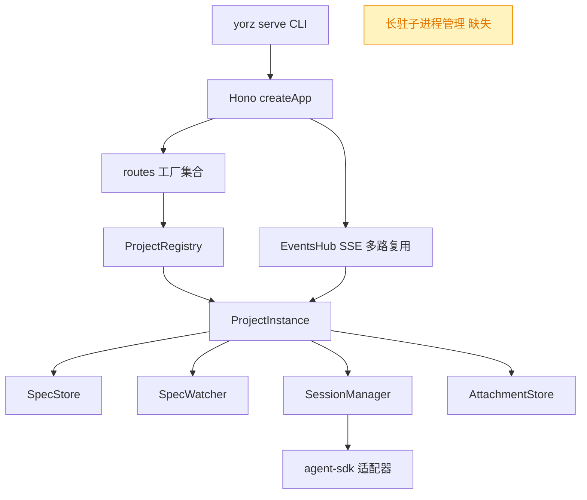
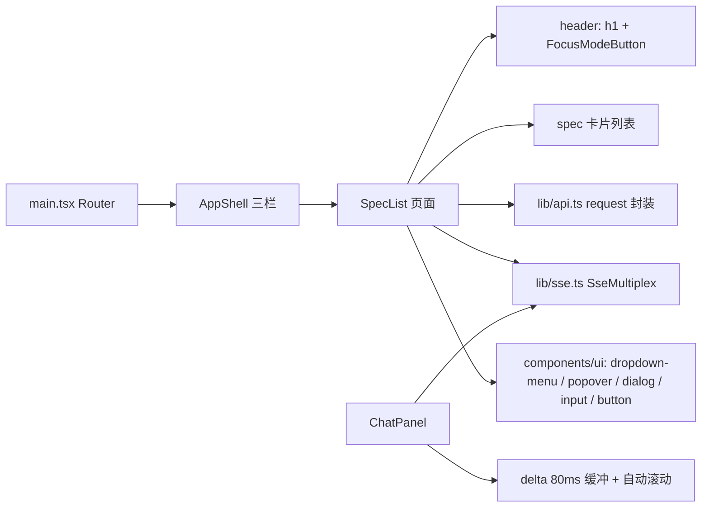
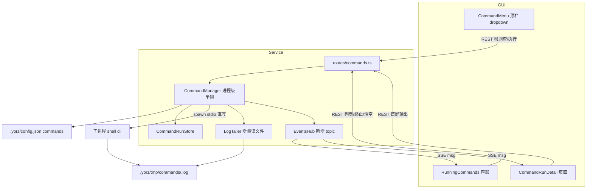
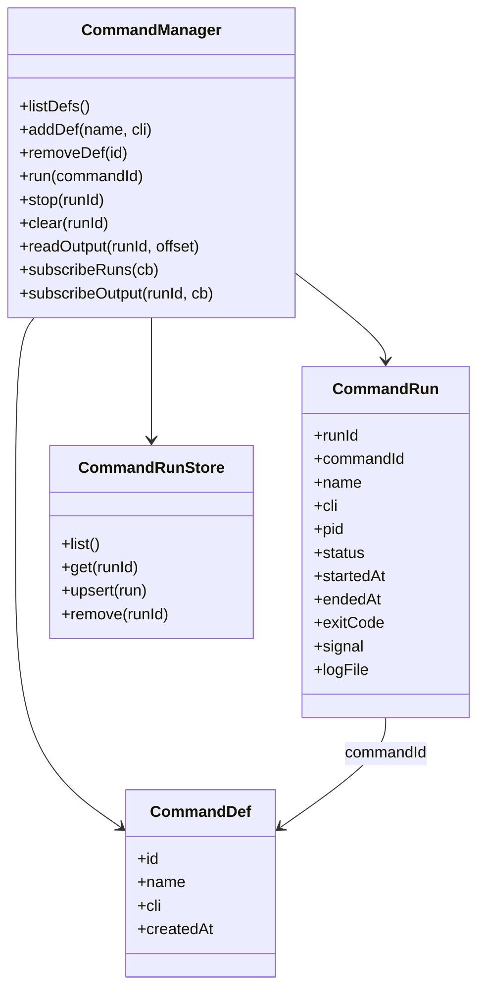
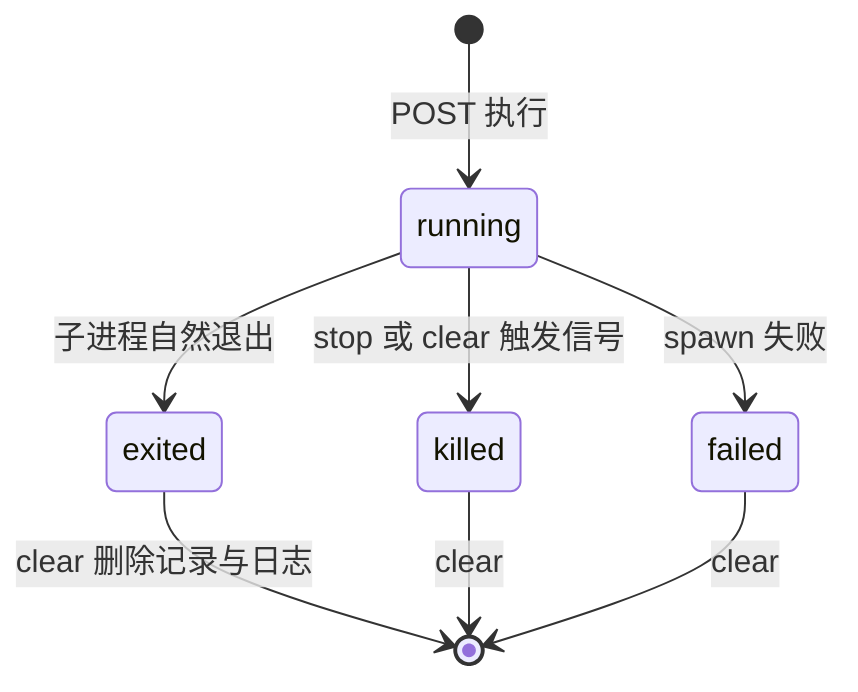
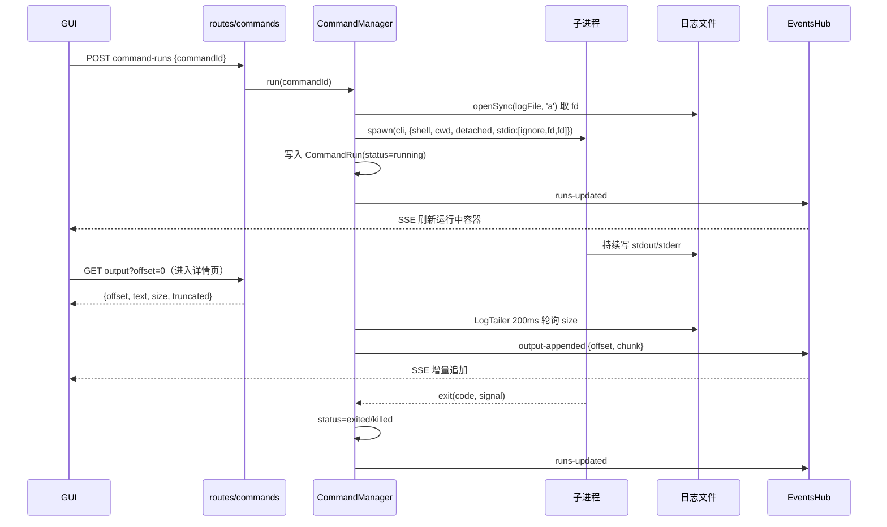
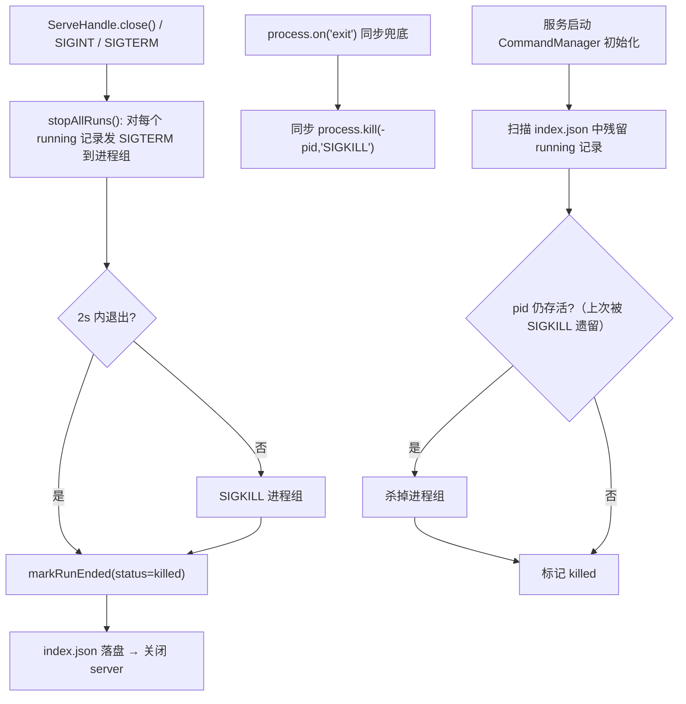
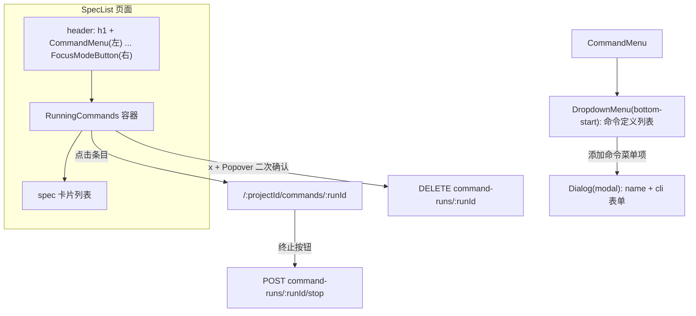
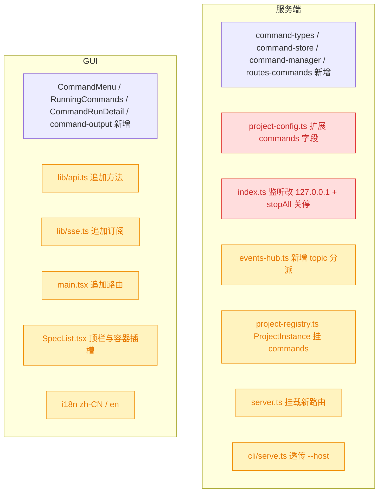

# 命令（脚本）管理与执行

## 1. 背景

Agent 使用 worktree 并发执行任务时，验收/调试往往需要手动打开终端启动服务。若 YorZ 服务能代理执行用户配置的命令，并把 stdout 采集到文件，则：

- 用户可直接在 GUI 中启动服务进行调试与验收，无需切换到传统终端；
- Agent 可读取该 stdout 日志，据此自动分析、定位问题。

原始需求：

```text
需要在项目中实现一个命令（脚本）管理功能，用户配置脚本后，可在页面中触发执行；
执行后脚本 stdout 的内容输出到临时文件，在 GUI 中可以查看输出内容。

期望使用该功能解决的问题：
- Agent 使用 worktree 并发执行任务时，可以在页面中启动服务进行调试、验收，从而避免打开传统终端输入命令启动服务
- 使用 yorz 服务代理执行命令（启动服务）后，stdout 输出的内容理论上可以获取到，用于 Agent 根据日志自动 debug 分析问题

期望 GUI 中的功能描述：
1. 在 @src/gui/src/pages/SpecList.tsx 顶栏新增一个， 命令行 dropdown，dropdown 中两个 icon，选中选中 cli 命令和添加命令
2. 添加命令，Popover 弹窗中两个输入字段： name，cli
3. 执行命令，在 SpecList.tsx header 下方（Spec 卡片列表上方）新增一个运行中的命令容器，显示正在执行中的命令
     - 执行中的命令需要持久化，刷新 GUI 页面需要能加载到当前正在执行的命令
     - 执行中命令列表右侧一个 x icon，点击 Popover 二次确认终止命令，并清空该条目的执行记录信息
4. 点击正在执行命令，进入信息详情页，实时更新 cli 命令执行的 stdout
     - 命令执行详情页，可以终止命令，但不清空该命令执行记录信息
```

## 2. 需求

- 支持在项目维度配置命令条目（`name` + `cli`），持久化保存。
- 支持在 GUI 中触发执行已配置命令，由 YorZ 服务代理 spawn 子进程。
- 命令 stdout/stderr 输出写入临时日志文件，供 GUI 查看与 Agent 读取。
- 运行中的命令状态需持久化：GUI 刷新后仍能加载当前正在执行的命令列表。
- `SpecList` 顶栏新增命令行 dropdown，含「选择执行命令」与「添加命令」两类入口；dropdown 左对齐并紧邻页面标题一侧，不额外提供独立的「添加」icon 入口。
- 添加命令使用全局 Dialog 弹窗（modal），包含 `name`、`cli` 两个输入字段。
- `SpecList` header 下方、Spec 卡片列表上方新增运行中命令容器，条目宽度与 spec 卡片列表一致，采用同一套弹性网格（列数随视口动态变化）。
- 运行中条目右侧 `x` icon，Popover 二次确认后终止命令并清空该条执行记录。
- 点击运行中条目进入命令执行详情页，实时增量展示 stdout。
- 详情页可终止命令，但保留执行记录信息。
- 所有面向用户的 GUI 文案写入 `src/gui/src/i18n/`。
- 命令子进程跟随 `yorz serve` 生命周期：服务退出即终止全部运行中命令，不留孤儿进程。
- `yorz serve` 默认仅监听本机回环地址，命令执行通道不暴露到局域网。

## 3. 现状分析

### 3.1 服务端现状



要点：

- 路由采用「工厂函数返回 Hono 子应用」的统一形态，在 `createApp` 中集中挂载到 `/api` 前缀下；project 级路由通过闭包注入 `resolveProject`，并在文件内用私有 `need(c)` helper 解析 `projectId` 与 404。
- SSE 全量走 `EventsHub` 的**单连接多路复用**：wire 事件只有 `ready` / `server-heartbeat` / `msg` 三种，业务事件封装在 `msg` 的 `{topic, event, data}` 里；topic 用 `project:<pid>:<rest>` 正则解析，`attachTopic` 是新增订阅类型的唯一扩展点。
- 项目级持久化已有稳定范式：`.yorz/config.json` 存项目配置（tmp+rename 原子写、`normalizeConfig` 白名单化字段），`.yorz/tmp/**` 存运行期数据（`.gitignore` 已忽略 `.yorz/tmp`）；`SessionStore` 给出了「内存 cache + Promise 串行写链」的索引文件写法。
- **没有任何长驻子进程管理能力**：现有 `git.ts` / `session-end-notifier.ts` 用 `promisify(execFile)` 跑一次性短命令，`cli/serve.ts` 的后台 spawn 是一次性入口且不可复用；Agent 执行走 SDK 而非 spawn。stdout 的**流式采集、持久化、终止、重启恢复**全部为空白。
- `ProjectRegistry.reload(id)` 会 `close()` 并丢弃 `ProjectInstance`（保存项目配置后必然触发），因此**长驻进程状态不能挂在 ProjectInstance 生命周期上**。
- `logger.ts` 的 `RotatingFileSink` 是现成的「串行队列 + 体积轮转」写文件实现，但服务于全局 serve 日志，与「子进程 stdout 直写文件」不是同一形态。
- **服务当前监听 `0.0.0.0`** 并在启动时打印 LAN 地址；关停链路是完备的：`ServeHandle.close()` → `registry.closeAll()` + `server.close()`，前台模式由 `SIGINT`/`SIGTERM` 触发，后台模式由 `yorz serve stop` 发 `SIGTERM`（2s 未退升级 `SIGKILL`）。因此「子进程跟随服务生命周期」有现成的挂载点。

<details>
<summary>现状精确层：关键文件与符号</summary>

- `src/service/server.ts:70-80` — 路由挂载顺序，新增路由需在此追加一行 `api.route('/', createCommandsRoutes(resolveProject))`。
- `src/service/events-hub.ts:250-268` — `attachTopic()`，topic 正则 `/^project:([^:]+):(.+)$/`，新增 topic 在此分派。
- `src/service/events-hub.ts:222-236` — `emit()`，未 attach stream 时帧进 `s.queue` 缓冲，`attachStream` 时 flush。
- `src/service/project-registry.ts:175-226` — `materialize()` 组装 `ProjectInstance`；`:144-153` `reload()` 会关闭实例。
- `src/service/project-config.ts:83-120` — `normalizeConfig()` 白名单，未知字段会被**丢弃**，新增 `commands` 必须同步扩展。
- `src/service/session-store.ts:31-38` — `persist()` 的 writeChain 串行写范式。
- `src/service/global-config.ts:82-90` — `saveGlobalConfig()` 的 tmp+rename 原子写范式。
- `src/service/logger.ts:70-144` — `RotatingFileSink`。
- `src/service/index.ts:103` — `serve({..., hostname: '0.0.0.0'})`；`:54-56` 打印 LAN URL；`:80-88` `close()` 关停流程。
- `src/cli/serve.ts:123-135` — 前台 `SIGINT`/`SIGTERM` shutdown hook；`:253-281` `runStopServe()` 的 SIGTERM→SIGKILL 升级语义。
- `.gitignore` 已含 `.yorz/tmp` 与 `*.log`；`.yorz/config.json` **在 git 跟踪中**（`git ls-files .yorz` 可验证）。

</details>

### 3.2 GUI 现状



要点：

- 路由集中声明在 `main.tsx`，新增页面 = 加一行 `<Route>` + 一个 `pages/*.tsx`；`projectHref(sub)` 负责拼接 `/:projectId/...`。
- `lib/api.ts` 是单一对象字面量 `api`，统一走私有 `request<T>()`（非 2xx 抛 `Error`，message 形如 `404 not found`）；`projectBase(pid)` 拼 `/api/projects/<pid>`。
- `lib/sse.ts` 每个 topic 一个 `subscribeXxx()` 包装函数，返回取消函数；新增 topic 只需加包装函数，无需改多路复用内核。
- `components/ui/popover.tsx` 已存在但**当前无人使用**（现有 AnnotatePopover 是手写定位），本次是它的首个使用方；`dropdown-menu` 的菜单项回调是 `onSelect` 而非 `onClick`。
- `ChatPanel` 已沉淀出可复制的**流式渲染范式**：高频 delta 用 80ms 定时器批量 flush、`isNearMessagesBottom()` 阈值 96px 的「贴底才自动滚动」；`ChatToolBlock` 的 `max-h-* + overflow-auto + <pre>` 是现成的终端式输出样式。无 xterm.js 依赖。
- i18n 为 `zh-CN.ts` / `en.ts` 两份严格对称的嵌套对象，`t('ns.key')` 非响应式（切语言靠 reload）。
- 单测只覆盖 `lib/*.ts` 纯函数（vitest，node 环境），`.tsx` 不做单测，交互靠 Playwright E2E。**因此可测逻辑必须放进 `lib/`**。

## 4. 技术实现方案

### 4.1 总体架构



关键设计：**子进程 stdout/stderr 直接重定向到日志文件的 fd，服务端不持有管道**。这样「实时推送」与「服务重启后恢复」收敛为同一条链路——都通过增量 tail 同一个日志文件实现，不存在两套代码路径。

### 4.2 数据模型



`status` 状态机：



<details>
<summary>数据模型精确层：类型全文与存储路径</summary>

```ts
// src/service/command-types.ts
export interface CommandDef {
  id: string // nanoid 风格短 id，由服务端生成
  name: string
  cli: string
  createdAt: number
}

export type CommandRunStatus = 'running' | 'exited' | 'killed' | 'failed'

export interface CommandRun {
  runId: string
  commandId: string
  /** 执行瞬间的快照，定义被删除后记录仍可读 */
  name: string
  cli: string
  pid: number
  status: CommandRunStatus
  startedAt: number
  endedAt?: number
  exitCode?: number | null
  signal?: string | null
  /** 相对项目根的 POSIX 路径，便于写进 prompt 给 Agent 读 */
  logFile: string
}
```

存储位置：

- 命令定义：`.yorz/config.json` 的 `commands: CommandDef[]`（用户已确认，见 4.9 决策记录）。
- 运行记录索引：`.yorz/tmp/commands/index.json`（`CommandRun[]`）。
- 日志文件：`.yorz/tmp/commands/<runId>.log`。

</details>

### 4.3 进程模型与生命周期



服务关停与启动时的生命周期收敛（用户决策：命令跟随服务生命周期）：



决策说明：

- **`shell: true` 执行整条 cli 字符串**。用户配置的是 `pnpm dev` 这类完整命令行，需要 shell 解析管道/环境变量；不做 argv 拆分。
- **`detached: true` + `child.unref()`**，子进程自成进程组；终止时对进程组发信号 `process.kill(-pid, 'SIGTERM')`，2s 后未退出升级 `SIGKILL`（复用 `cli/serve.ts` 的 `runStopServe` 语义）。理由：`pnpm dev` 这类命令会派生孙进程，只杀直接子进程会留下真正占端口的那个。`unref()` 的作用仅是**不让子进程句柄阻塞服务进程的事件循环退出**，生命周期归属由下一条的显式 shutdown hook 保证，而非靠句柄引用。
- **子进程跟随服务生命周期**（用户决策，见决策记录）：`CommandManager` 暴露 `stopAll()`，在 `ServeHandle.close()` 中于 `server.close()` 之前 await 调用；同时注册 `process.on('exit')` 同步兜底（只能发 `SIGKILL`，不可 await）。服务被 `SIGKILL` / 硬崩溃时仍可能遗留孤儿，故 **`CommandManager` 初始化时执行一次 reap**：把 `index.json` 中残留的 `running` 记录逐条探活（`process.kill(pid, 0)`），存活的杀掉进程组，全部改写为 `killed`。这样「启动即无残留」是幂等保证，不依赖上次是否优雅退出。
- **不持有 stdio 管道**，`stdio: ['ignore', fd, fd]`（stdout 与 stderr 合流到同一文件，保持时序）。理由与生命周期无关：避免服务端在内存里缓冲高吞吐 dev server 日志，且让 REST 首屏与 SSE 增量收敛到「读同一个文件」的单一代码路径。
- **存活判定只靠 child `exit` 事件**（可拿到精确 `exitCode`/`signal`）。由于子进程必然由本服务进程 spawn 且不跨重启存活，无需 5s 轮询探活——轮询仅保留在启动 reap 这一处。被否决的备选：常驻 `process.kill(pid, 0)` 轮询（在跟随生命周期的模型下是纯冗余）。
- **`env` 继承 `process.env`**，`cwd` 取项目根（worktree 项目即 worktree 目录，天然隔离）。
- **同一命令定义同时最多一个 `running` 记录**：重复触发直接返回既有 run（幂等），GUI 直接跳转详情页，避免误开多个 dev server 抢端口。
- **CommandManager 必须是「按项目路径」的进程级单例**（仿 `events-hub.ts` 里 `changesWatchers` 的做法），`ProjectInstance` 只持有引用，`close()` **不**销毁它——否则保存项目配置触发的 `registry.reload()` 会连带丢掉运行中命令的管理权。销毁只发生在 `registry.closeAll()`（服务关停）这一处。

### 4.4 服务监听地址收敛（安全硬约束）

用户否决了「维持 `0.0.0.0` 监听」并补充硬约束：服务仅限本机访问。

- `src/service/index.ts` 的 `serve({hostname})` 默认改为 `127.0.0.1`；启动日志不再无条件打印 LAN 地址。
- 保留显式逃生阀 `ServeOptions.host` / CLI `yorz serve --host <addr>`：仅当用户显式传入非回环地址时才绑定该地址，并打印 LAN 地址 + 一条 `warn` 级安全提示。理由：局域网访问 GUI（如手机端查看）是既有可用能力，硬编码回环会静默破坏；默认安全 + 显式 opt-in 同时满足「默认仅本机」与「不砍既有能力」。被否决的备选：硬编码 `127.0.0.1` 无逃生阀（对已有 LAN 用户是无提示的破坏性变更）。
- `--host` 需透传到后台模式：`backgroundArgs()` 追加 `--host`，否则 `yorz serve`（后台）会丢掉该选项。

### 4.5 日志采集与增量推送

- `LogTailer` 按 `runId` 建立，内部 `setInterval(200ms)` 比较文件 `size` 与已读 `offset`，增量 `read` 后 emit `{offset, chunk}`；**引用计数管理**：仅在有 SSE 订阅者时运行，订阅者归零即停止定时器。
- 首屏走 REST：`GET .../output?offset=N`，返回 `{offset, text, size, truncated}`。`offset` 缺省时只返回**尾部 256 KiB**并置 `truncated: true`，避免长跑服务的巨大日志打爆响应与浏览器内存。
- GUI 侧维护 `nextOffset`：SSE chunk 的 `offset === nextOffset` 才追加，不连续（丢帧/重连）则重新拉一次 REST 全量。该合并逻辑放进 `src/gui/src/lib/command-output.ts` 纯函数以便单测。
- 「GUI 刷新后恢复」由此链路天然满足：刷新即重新 `GET /command-runs` + `GET .../output`，服务端内存状态未变。
- **日志体积策略（决策，不做轮转）**：轮转会破坏 offset 语义，且子进程持有 fd、rename 后会继续写旧 inode（`cli/serve.ts` 已踩过这个坑并留有注释）。改为：单文件不轮转；读取侧尾部截断；`clear` 时删除日志文件；`CommandManager` 初始化时（reap 同一步）清理「已结束且 `endedAt` 超过 7 天」的记录与日志。被否决的备选：复用 `RotatingFileSink`（需服务端持有管道，与 4.3「不持有 stdio 管道」冲突）。

### 4.6 REST 与 SSE 契约

<details>
<summary>接口精确层：路径、入参、返回</summary>

REST（均在 `/api/projects/:projectId` 下，新增 `src/service/routes/commands.ts`）：

| 方法   | 路径                          | 入参          | 返回                                   |
| ------ | ----------------------------- | ------------- | -------------------------------------- |
| GET    | `/commands`                   | —             | `CommandDef[]`                         |
| POST   | `/commands`                   | `{name, cli}` | `CommandDef`                           |
| DELETE | `/commands/:commandId`        | —             | `{ok: true}`                           |
| GET    | `/command-runs`               | —             | `CommandRun[]`（按 `startedAt` 倒序）  |
| POST   | `/command-runs`               | `{commandId}` | `CommandRun`                           |
| GET    | `/command-runs/:runId`        | —             | `CommandRun`                           |
| GET    | `/command-runs/:runId/output` | `?offset=`    | `{offset, text, size, truncated}`      |
| POST   | `/command-runs/:runId/stop`   | —             | `{ok: true, run: CommandRun}`          |
| DELETE | `/command-runs/:runId`        | —             | `{ok: true}`（终止 + 删记录 + 删日志） |

SSE topic（在 `events-hub.ts` 的 `attachTopic()` 中分派）：

| topic                           | event             | data                   |
| ------------------------------- | ----------------- | ---------------------- |
| `project:<pid>:commands`        | `runs-updated`    | `{runs: CommandRun[]}` |
| `project:<pid>:command:<runId>` | `output-appended` | `{offset, chunk}`      |
| `project:<pid>:command:<runId>` | `run-updated`     | `{run: CommandRun}`    |

`src/gui/src/lib/sse.ts` 对应新增 `subscribeCommandRuns(pid, onUpdate)` 与 `subscribeCommandOutput(pid, runId, handlers)`。

</details>

### 4.7 GUI 改动



- `CommandMenu.tsx`（新增）：`Terminal` icon 作为唯一 `DropdownMenuTrigger`（`placement="bottom-start"`，左对齐紧邻 `h1`）；菜单上半部分为命令定义列表（`onSelect` 触发执行并 toast），`DropdownMenuSeparator` 之下是「添加命令」项，点击打开全局 `Dialog` 表单（`name` / `cli` 两个 `Input` + 提交）。
- **添加表单必须用 `Dialog` 而非 `Popover`（决策）**：`Popover` 依附触发元素定位，而点击 dropdown 菜单项会关闭 dropdown、连带卸载其内部 anchor，导致 Popover 刚打开即隐藏。`Dialog` portal 到 body、不依赖 anchor，是唯一能与「入口在 dropdown 内」共存的形态。被否决的备选：为 Popover 单独保留一个常驻可见的 `+` icon 作为 anchor——多出一个与 dropdown 重复的入口，交互冗余。
- `RunningCommands.tsx`（新增）：置于 `SpecList` 的 `<header>` 与 spec 卡片 `<ul>` 之间；列表为空时整块不渲染。条目展示 name / status 徽标 / 运行时长；**已结束但未清理的记录同样显示**（带状态徽标），使详情页「终止但保留记录」后仍有清理入口。右侧 `x` 用 `Popover` 做二次确认（此处 anchor 常驻，不存在上述问题）。列表容器复用 spec 卡片列表的弹性网格 `[grid-template-columns:repeat(auto-fill,minmax(min(100%,400px),1fr))]`，使两块区域列宽对齐、列数随视口一致变化。
- `CommandRunDetail.tsx`（新增页面，路由 `/:projectId/commands/:runId`）：顶部展示 cli / 状态 / 日志文件路径（供 Agent 引用）；正文 `<pre>` 复用 `ChatToolBlock` 的等宽样式；沿用 `ChatPanel` 的贴底自动滚动阈值（96px）与批量 flush（80ms）思路；底部「终止」按钮调 stop 接口，不清空记录。
- `lib/command-output.ts`（新增，纯函数 + 单测）：`appendChunk(state, {offset, chunk})` 返回新文本与 `nextOffset`，offset 不连续时返回 `{needsRefetch: true}`。
- i18n 新增 `commands.*` 命名空间，`zh-CN.ts` / `en.ts` 同步。

> 决策说明：需求未提「删除命令定义」，但缺少该入口会导致配置写错后只能手改文件。本方案在 dropdown 条目 hover 时提供删除 icon + `DELETE /commands/:commandId`，作为最小可用闭环；被否决的备选是「本期不做、让用户手改 `.yorz/config.json`」，可用性代价过大。

### 4.8 影响范围



- 🔴 `project-config.ts`：`normalizeConfig()` 是白名单实现，**不扩展就会静默丢弃** `commands` 字段（每次 `saveProjectConfig` 都会抹掉），必须同步更新 `GET/PUT /projects/:pid/config` 路由与 GUI 的 `ProjectConfig` 类型，避免项目配置弹窗保存时清空命令定义。
- 🔴 `index.ts` 监听地址由 `0.0.0.0` 改为 `127.0.0.1`：**对既有依赖局域网访问 GUI 的用户是破坏性变更**，逃生阀是显式 `--host`；同时启动日志需相应调整（默认不再打印 LAN 地址）。
- 🟡 其余均为纯增量扩展：`events-hub.ts` 增加两个 topic 分支、`project-registry.ts` 的 `ProjectInstance` 增加 `commands` 字段（`close()` 不销毁）、`server.ts` 增加一行挂载、`cli/serve.ts` 透传 `--host`、GUI 侧新增文件与追加导出。
- 无数据迁移：老配置无 `commands` 字段时归一化为 `[]`；`.yorz/tmp/commands/` 不存在时按空列表处理。

### 4.9 验证方式

- 单测（vitest）：`command-store.test.ts`（索引读写/串行写链）、`command-manager.test.ts`（用 `node -e` 起真实短命令验证 spawn/日志/exit/终止/`stopAll` 关停/启动 reap）、`commands-route.test.ts`（REST 契约与 404）、`project-config` 扩展后的归一化用例、GUI 侧 `command-output.test.ts`。
- 构建与类型：`pnpm typecheck`、`pnpm test`。
- 手动验收：`pnpm dev` 起服务，配置一条 `node -e "setInterval(()=>console.log(Date.now()),500)"`，验证执行 → 容器出现 → 刷新页面仍在 → 详情页实时滚动 → 终止保留记录 → x 二次确认清空 → Ctrl-C 关停服务后该子进程已不存在。

> 决策记录：待确认项「命令定义存储在哪个文件？」—— 用户选择「项目配置 `.yorz/config.json` 新增 `commands` 字段」，理由：该文件已被 git 跟踪，worktree 检出同分支即天然继承主项目命令定义，最契合 worktree 并发调试场景；接受「命令进入版本库并被团队共享」的代价。

> 决策记录：待确认项「子进程是否独立于 `yorz serve` 生命周期存活？」—— 用户选择「跟随服务生命周期」，理由：服务退出即终止全部命令、不留孤儿；接受「重启服务会杀掉正在调试的 dev server、恢复能力退化为仅满足 GUI 刷新后恢复」的代价。方案按此重算，见 4.3。

> 决策记录：待确认项「新增的命令执行接口会扩大服务的远程执行面」—— 用户否决·补约束，理由：接受方案，但 `yorz serve` 监听 `0.0.0.0` 须改为监听本地端口，仅限本机访问。已作为硬约束重算方案，见 4.4。

## 5. 待确认项

_暂无_

## 6. 任务清单

- [x] 新增 `src/service/command-types.ts`，定义 `CommandDef` / `CommandRunStatus` / `CommandRun`（验收：`pnpm typecheck` 通过，字段与 4.2 精确层一致）
- [x] 扩展 `src/service/project-config.ts` 的 `normalizeConfig()` 白名单支持 `commands: CommandDef[]`，缺省归一化为 `[]`，逐条校验 `id`/`name`/`cli`/`createdAt` 并丢弃非法项（验收：新增归一化单测覆盖「无 commands 字段」「含非法项」两例）
- [x] 新增 `src/service/command-store.ts`：`.yorz/tmp/commands/index.json` 的 `list/get/upsert/remove`，复用 `session-store.ts` 的「内存 cache + Promise 串行写链」与 tmp+rename 原子写（验收：`command-store.test.ts` 覆盖读写、并发 upsert 不丢数据、文件不存在返回空列表）
- [x] 新增 `src/service/command-manager.ts` 的进程模型：`run(commandId)` 以 `shell:true` + `detached:true` + `stdio:['ignore',fd,fd]` spawn 到 `.yorz/tmp/commands/<runId>.log`，监听 `exit` 收敛 `markRunEnded()`，同一 `commandId` 已有 `running` 记录时幂等返回既有 run（验收：`command-manager.test.ts` 用 `node -e` 短命令验证日志落盘与 exit 状态、重复 run 返回同一 runId）
- [x] 在 `command-manager.ts` 实现 `stop(runId)` / `clear(runId)`：对进程组发 `SIGTERM`，2s 未退升级 `SIGKILL`；`stop` 保留记录标记 `killed`，`clear` 额外删除记录与日志文件（验收：单测断言 stop 后记录仍在且 status=killed、clear 后记录与日志文件均不存在）
- [x] 在 `command-manager.ts` 实现 `readOutput(runId, offset)` 与 `LogTailer`：200ms 轮询文件 size 增量读取并按引用计数启停；`offset` 缺省时只返回尾部 256 KiB 且置 `truncated:true`（验收：单测断言增量 chunk 的 offset 连续、订阅者归零后定时器停止、超长日志被尾部截断）
- [x] 在 `command-manager.ts` 实现生命周期收敛：进程级单例注册表（按项目路径）、`stopAll()`、初始化 reap（残留 `running` 记录探活并杀进程组后标记 `killed`）、清理 `endedAt` 超 7 天的记录与日志（验收：单测断言 reap 后无 `running` 残留、`stopAll()` 后子进程已退出）
- [x] 新增 `src/service/routes/commands.ts` 并在 `src/service/server.ts` 挂载，实现 4.6 表中 9 个 REST 端点，沿用 `need(c)` 解析 `projectId` 与 404 语义（验收：`commands-route.test.ts` 覆盖增删查/执行/停止/清空与未知 projectId、未知 runId 的 404）
- [x] 在 `src/service/events-hub.ts` 的 `attachTopic()` 新增 `project:<pid>:commands` 与 `project:<pid>:command:<runId>` 两个 topic 分派，转发 `runs-updated` / `output-appended` / `run-updated`（验收：service 层测试订阅 topic 后能收到 run 状态变更帧）
- [x] 在 `src/service/project-registry.ts` 的 `ProjectInstance` 挂载 `commands` 引用，`close()` 不销毁单例、`closeAll()` 触发 `stopAll()`（验收：`project-registry.test.ts` 断言 `reload()` 后运行中记录仍可访问）
- [x] 将 `src/service/index.ts` 的 `serve({hostname})` 默认改为 `127.0.0.1`，新增 `ServeOptions.host` 逃生阀，仅在显式非回环地址时打印 LAN 地址并输出 `warn` 安全提示（验收：`service.test.ts` 断言默认 hostname 为 `127.0.0.1`）
- [x] 在 `ServeHandle.close()` 中于 `server.close()` 前 await `stopAllCommandManagers()`，并注册 `process.on('exit')` 同步 `SIGKILL` 兜底（验收：单测断言 `handle.close()` 后由命令启动的子进程 pid 已不存活）
- [x] 在 `src/cli/index.ts` 的 `serve` 命令新增 `--host <addr>` 选项，并在 `src/cli/serve.ts` 的 `backgroundArgs()` 中透传（验收：`backgroundArgs({host:'0.0.0.0'})` 输出包含 `--host 0.0.0.0`）
- [x] 在 `src/gui/src/lib/api.ts` 追加命令相关方法（`listCommands` / `createCommand` / `deleteCommand` / `listCommandRuns` / `getCommandRun` / `runCommand` / `readCommandOutput` / `stopCommandRun` / `clearCommandRun`），并扩展 `ProjectConfig` 类型的 `commands` 字段（验收：`pnpm typecheck` 通过，`ProjectConfigDialog` 保存不再丢弃 commands）
- [x] 在 `src/gui/src/lib/sse.ts` 新增 `subscribeCommandRuns(pid, onUpdate)` 与 `subscribeCommandOutput(pid, runId, handlers)` 包装函数（验收：返回取消函数，形态与既有 `subscribeXxx` 一致）
- [x] 新增 `src/gui/src/lib/command-output.ts` 纯函数 `appendChunk(state, {offset, chunk})`，offset 不连续时返回 `{needsRefetch:true}`（验收：`command-output.test.ts` 覆盖连续追加、乱序丢帧、重连三种情形）
- [x] 新增 `src/gui/src/components/CommandMenu.tsx`：`Terminal` icon 触发 `DropdownMenu`，上半部为命令定义列表（`onSelect` 执行并跳转详情）、hover 显示删除 icon，分隔线下为「添加命令」打开 `Popover` 的 `name`/`cli` 表单（验收：GUI 构建通过，新增命令后 dropdown 立即刷新）
- [x] 新增 `src/gui/src/components/RunningCommands.tsx`：展示运行中与已结束未清理记录（name / 状态徽标 / 时长），右侧 `x` 用 `Popover` 二次确认后调 `DELETE /command-runs/:runId`，列表为空时整块不渲染（验收：空列表不占位、清空后条目消失）
- [x] 新增 `src/gui/src/pages/CommandRunDetail.tsx` 并在 `src/gui/src/main.tsx` 注册路由 `/:projectId/commands/:runId`：首屏 REST 拉取 + SSE 增量、80ms 批量 flush、贴底 96px 自动滚动，顶部展示 cli/状态/日志路径，底部「终止」按钮调 stop 且不清空记录（验收：实时输出滚动、终止后记录仍在）
- [x] 在 `src/gui/src/pages/SpecList.tsx` 顶栏接入 `CommandMenu`（置于 `h1` 与 `FocusModeButton` 之间），并在 `<header>` 与 spec 卡片列表之间插入 `RunningCommands`（验收：布局符合 4.7 图示，spec 列表功能无回归）
- [x] 在 `src/gui/src/i18n/zh-CN.ts` 与 `en.ts` 同步新增 `commands.*` 命名空间，覆盖菜单/表单/状态徽标/二次确认/详情页全部文案（验收：两份文件 key 严格对称，GUI 无硬编码中文）
- [x] 运行 `pnpm typecheck` 与 `pnpm test` 并修复全部失败（验收：两条命令均退出码 0）
- [x] 将 `RunningCommands.tsx` 的 `<ul>` 改用 spec 卡片列表同款弹性网格 `[grid-template-columns:repeat(auto-fill,minmax(min(100%,400px),1fr))]`，li 内部样式保持不变（验收：窄视口单列、宽视口多列，且列宽与下方 spec 卡片对齐）
- [x] 移除 `CommandMenu.tsx` 中独立的 `+` icon `PopoverTrigger` 入口，添加命令入口收敛为 dropdown 内的「添加命令」菜单项（验收：顶栏只剩一个 `Terminal` icon，无多余 `+` 按钮）
- [x] 将 `CommandMenu.tsx` 的添加表单由 `Popover` 改为全局 `Dialog`（modal），复用 `ui/dialog.jsx` 的 `DialogHeader/Title/Footer` 结构（验收：点击 dropdown 菜单项后弹窗正常打开并保持可见，不再因 dropdown 关闭而隐藏）
- [x] 将 `CommandMenu` 移到 `SpecList` header 左侧紧邻 `h1`，`DropdownMenu` 的 `placement` 改为 `bottom-start`，`FocusModeButton` 保持右侧（验收：菜单左对齐展开，不溢出容器）
- [ ] [manual] 手动验收：起服务后配置 `node -e "setInterval(()=>console.log(Date.now()),500)"`，走通「执行 → 容器出现 → 刷新页面仍在 → 详情页实时滚动 → 终止保留记录 → x 二次确认清空 → Ctrl-C 关停后子进程消失」（验收：人工确认全流程无异常）

## 7. 追加任务

- [fixed] [feat] 2026-07-31 23:16:26 | 1. 运行中的命令元素（ul > li） 宽度参考下方的 spec 卡片，弹性布局动态列数量；其他样式内容不变
  - 描述：1. 运行中的命令元素（ul > li） 宽度参考下方的 spec 卡片，弹性布局动态列数量；其他样式内容不变

2. 取消新增命令icon + ，入口使用 dropdown 中的添加命令菜单项
3. 添加命令使用全局弹窗（modal），因为点击 dropdown菜单项之后，会关闭掉 dropdown 导致 Popover 自动隐藏
4. 命令入口 dropdown 靠左对齐，靠近 spec 列表这一侧

## 8. 执行记录

- 服务端数据层：新增 `command-types.ts`（类型与常量）、`command-store.ts`（`.yorz/tmp/commands/index.json` 索引，内存 cache + 串行写链 + tmp/rename 原子写）。扩展 `project-config.ts` 的 `normalizeConfig()` 白名单支持 `commands`，非法/重复条目丢弃。验证：`command-store.test.ts`(7) + `project-config.commands.test.ts`(4) 通过。
- **修复并发写丢数据缺陷**：`CommandRunStore.load()` 原实现在并发 `upsert` 下各自安装独立 cache 数组，20 并发写只落盘 1 条。改为 memoize in-flight load promise，使并发调用共享同一数组。由 `command-store.test.ts` 的并发用例发现并回归覆盖。
- 服务端进程层：新增 `command-manager.ts`。`shell:true` + `detached:true` + `stdio:['ignore',fd,fd]` 直写日志文件；`stop`/`clear` 对进程组 SIGTERM→2s→SIGKILL；`LogTailer` 200ms 轮询增量读、按引用计数启停；`readOutput` 尾部 256 KiB 截断；进程级单例注册表 + `stopAll()` + 启动 reap + 7 天过期清理。验证：`command-manager.test.ts`(18) 通过。
- **修复瞬时退出记录卡在 running 的缺陷**：子进程若在 `run()` 完成首次 `upsert` 前退出（shell 语法错误、命令不存在），`exit` 事件先于记录落盘触发，`markRunEnded` 找不到记录而静默返回，随后的 upsert 又把状态写回 `running`，记录永久卡死。该缺陷由真实服务端到端驱动时暴露（`bad substitution` 命令显示 `status=running, exitCode=null`）。修复：新增 `pendingEnds`/`persisted` 暂存竞态退出结果，落盘后补偿应用；新增 2 条回归用例。
- 服务端接口层：新增 `routes/commands.ts`（9 个端点，沿用 `need(c)` 与 404 语义）并在 `server.ts` 挂载；`events-hub.ts` 新增 `commands` 与 `command:<runId>` 两个 topic 分派。`ProjectInstance` 挂 `commands` 引用且 `close()` 不销毁单例。验证：`commands-route.test.ts`(8) + `commands-sse.test.ts`(5) 通过。
- 安全硬约束落地：`index.ts` 默认监听 `127.0.0.1`，新增 `ServeOptions.host` 与 CLI `--host` 逃生阀（非回环时打印 WARNING 并记 warn 日志），`cli/serve.ts` 的 `backgroundArgs()` 透传。`ServeHandle.close()` 中先 `stopAllCommandManagers()` 再关服务，并注册 `process.on('exit')` 同步 SIGKILL 兜底。
- **修复配置弹窗抹除命令定义的破坏性缺陷**：`PUT /projects/:pid/config` 原样重建 `ProjectConfig`，会丢弃 `commands`。改为读取现有配置并原样带回，回归用例覆盖。
- GUI：`lib/api.ts` 追加 9 个方法与 `CommandDef`/`CommandRun` 类型（`ProjectConfig` 补 `commands`）；`lib/sse.ts` 新增两个订阅包装；新增纯函数 `lib/command-output.ts`（按**字节**而非 UTF-16 长度推进 offset，避免中文输出错位）。新增 `CommandMenu.tsx` / `RunningCommands.tsx` / `CommandRunDetail.tsx`，接入 `SpecList.tsx` 与 `main.tsx` 路由，i18n 双语对称新增 `commands.*`。验证：`command-output.test.ts`(11) 通过。
- 真实端到端验收（`yorz serve` + curl/SSE 实跑，非仅单测）：① 监听套接字确认为 `127.0.0.1:7999`，局域网 IP `192.168.3.70:7999` 不可达；② 命令定义落入 `.yorz/config.json`；③ 中文输出的增量 offset 连续（140 字节处衔接正确）；④ 重复执行返回同一 runId；⑤ SSE 收到 7 帧 `output-appended` 且 offset 连续、`run-updated` 正常；⑥ stop 后进程消失但记录保留；⑦ clear 后记录 404 且日志文件删除；⑧ 服务关停后子进程一并终止（无孤儿）；⑨ 模拟 SIGKILL 遗留后重启，残留 `running` 记录被 reap 为 `killed`，无卡死条目。
- 全量校验：`tsc -b --force` 通过；`vitest run` 48 文件 / 436 用例全绿（本 spec 新增 46 条）；`pnpm run build` CLI 与 GUI 均构建成功。
- 追加任务（4 项 GUI 调整）：① `RunningCommands` 的 `<ul>` 改用与 spec 卡片列表相同的弹性网格 `[grid-template-columns:repeat(auto-fill,minmax(min(100%,400px),1fr))]`，li 内部样式未动；② 移除 `CommandMenu` 中独立的 `+` icon 入口，添加入口收敛为 dropdown 菜单项；③ 添加表单由 `Popover` 改为 `Dialog`（modal）；④ `CommandMenu` 移至 header 左侧紧邻 `h1`，`placement` 改 `bottom-start`。
- **③ 的根因确认**：`Popover` 依附触发元素定位，而点击 dropdown 菜单项会关闭 dropdown 并卸载其内部 anchor，弹窗随即隐藏——上一轮为规避该问题保留了一个常驻可见的 `+` anchor，属于错误的妥协设计。改用 portal 到 body 的 `Dialog` 后，入口得以收敛回 dropdown（同时解决 ②）。
- 新增 `src/gui/src/__e2e__/command-menu.spec.ts`（3 条 Playwright 用例，真实浏览器驱动）：断言顶栏仅一个命令入口且紧邻标题、dropdown 为 start 对齐而非 end 对齐、**点击菜单项后 modal 保持可见（③ 的回归锁）**、以及新增→执行→详情页实时输出→返回→清空的完整闭环；并逐像素断言运行中条目与 spec 卡片的 `x`/`width` 完全一致（实测均为 x=776 / width=496）。
- 修正 `playwright.config.ts` 中已过期的注释（服务监听地址已由 `0.0.0.0` 改为 `127.0.0.1`）。
- 全量校验：`tsc -b --force` 通过；`vitest run` 48 文件 / 436 用例全绿；`playwright test` 18 条 e2e 全绿（含既有 15 条无回归）；`pnpm run build` 成功。
- 收尾：任务清单中非 `[manual]` 项全部完成，`## 待确认项` 为 `_暂无_`、无 `！！！` 批注、追加任务已全部 `[fixed]`，`stage` 置为 `done`。剩余 1 项 `[manual]` 为人工 GUI 点选验收，不阻塞收尾。
