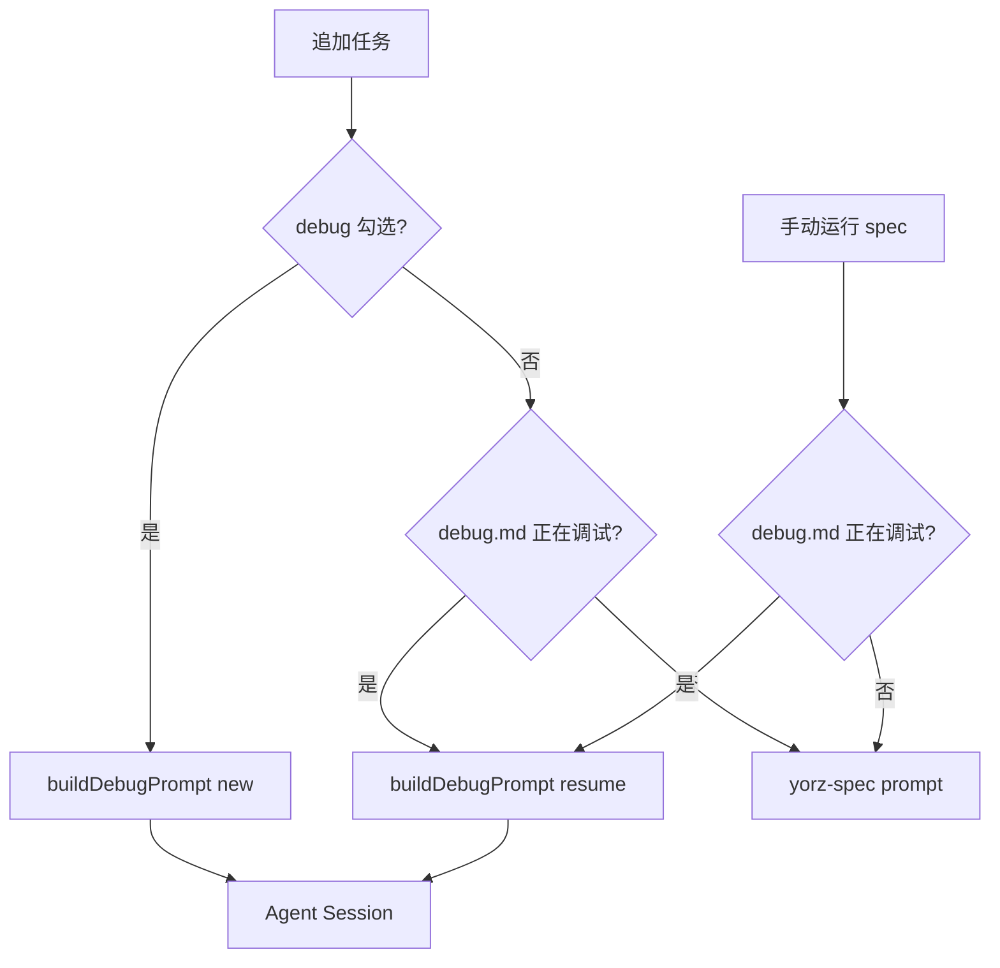
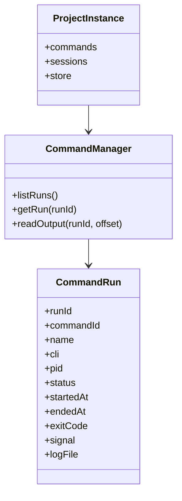
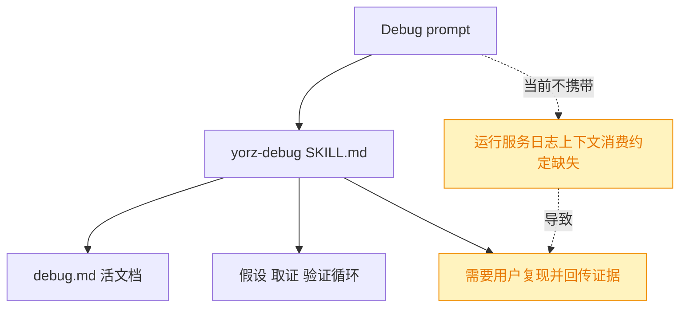
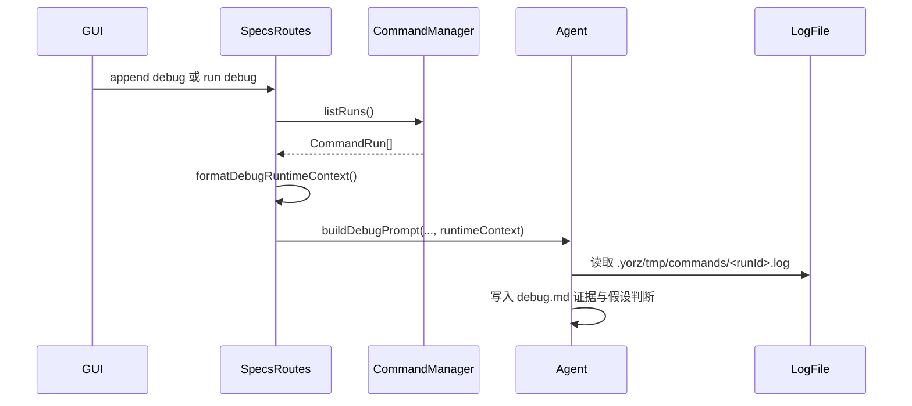
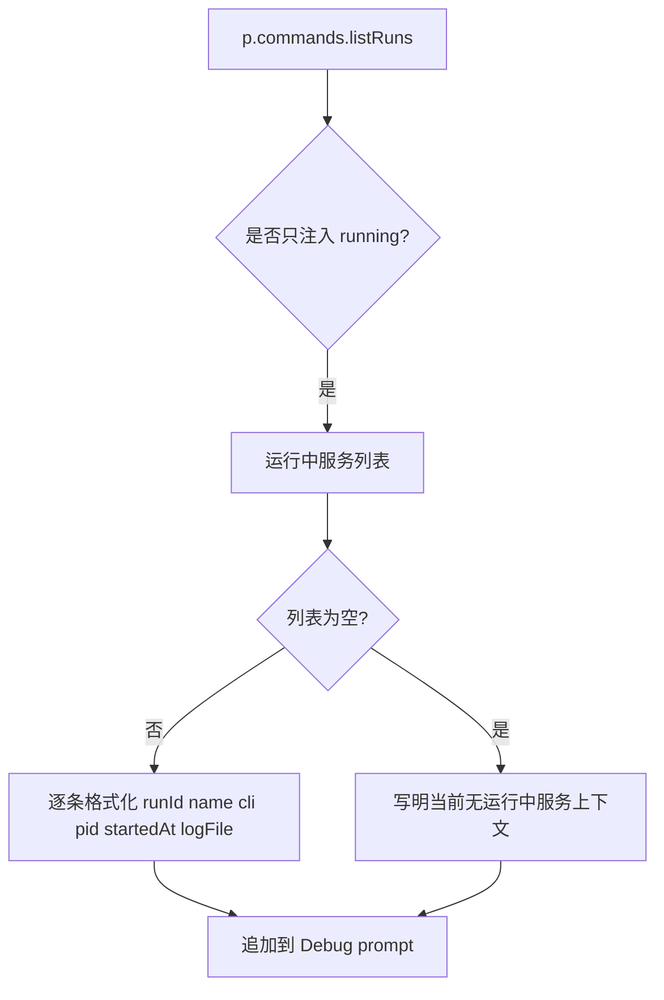
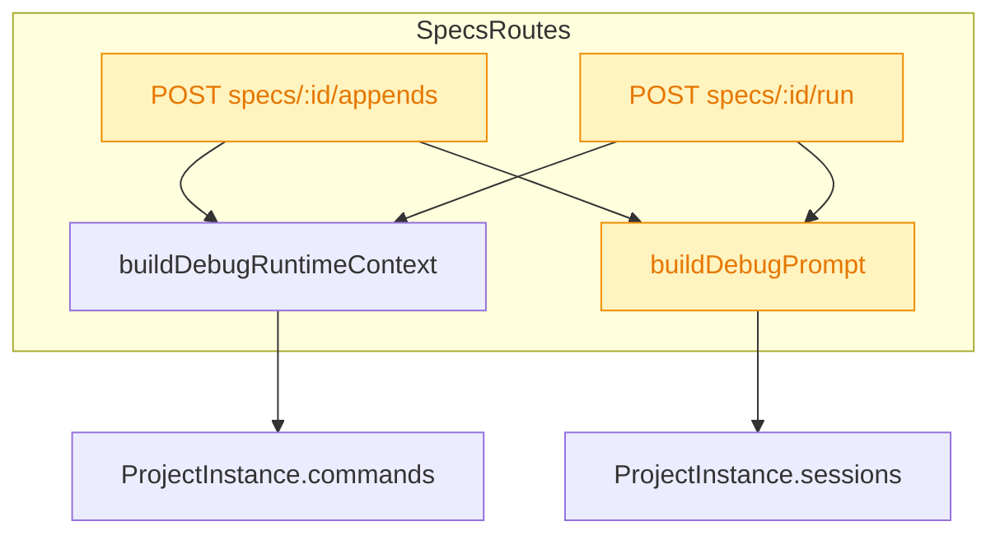
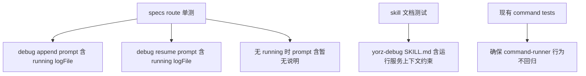

# Debug 模式注入运行服务上下文

## 1. 背景

`260731.feat.command-runner` 已实现项目级命令管理与运行服务代理：用户可在 GUI 中启动项目服务，服务端将 stdout/stderr 写入 `.yorz/tmp/commands/<runId>.log`，GUI 可查看运行详情与实时输出。

原始需求：

```text
@.yorz/specs/260731.feat.command-runner/spec.md 这个spec实现了在 yorz 中管理项目运行服务的功能
我希望实现在 debug （chat 中 通过 /yorz-debug 指令或 spec 追加任务勾选 “debug” 启动）功能中，Agent 能访问到运行中相关服务信息；

比如在上下文中注入 正在运行的服务信息及日志文件路径，现在 Agent 已经能主动添加日志代码，期望能主动分析日志，更智能地调试分析问题。

相关代码： @src/skill/yorz-debug/SKILL.md  @src/service/routes/specs.ts:L305-L324
```

## 2. 需求

- 当 spec 追加任务勾选 `debug` 进入 Debug 模式时，Agent prompt 需要携带当前项目运行中的命令服务信息。
- 当 spec 已存在 `debug.md` 且通过 run/append 重入 Debug 模式时，Agent prompt 同样需要携带当前项目运行中的命令服务信息。
- 注入内容至少包含运行服务的 `runId`、命令名称、命令行、状态、PID、启动时间、日志文件相对路径。
- `yorz-debug` skill 需要明确要求 Agent 优先读取这些日志文件，作为复现、取证、验证链路的一部分。
- 无运行中服务时不阻塞 Debug 模式，prompt 应明确说明“当前无运行中服务上下文”。
- 该能力优先覆盖有 spec 上下文的 Debug 入口；无 spec 场景的 `/yorz-debug` 若不经过 YorZ Service prompt 构造，则不强行解决。

## 3. 现状分析

### 3.1 Debug 入口现状



当前 `src/service/routes/specs.ts` 的 `buildDebugPrompt()` 只拼接 spec 目录、`spec.md`、`debug.md` 以及 new/resume 语义。它没有读取 `ProjectInstance.commands`，也没有把命令运行记录或日志路径写入 prompt。

<details>
<summary>Debug 入口精确层</summary>

- `src/service/routes/specs.ts:169-184`：追加任务自动运行时，根据 `parsed.debug` 与 `debugActive` 选择 Debug prompt 或 spec prompt。
- `src/service/routes/specs.ts:194-203`：手动运行 spec 时，若 `debug.md` 仍为 `debugging`，继续使用 Debug prompt。
- `src/service/routes/specs.ts:305-324`：`buildDebugPrompt(specsDirRelative, specId, mode)` 当前是同步纯字符串函数，无法访问项目运行命令。
- `src/service/routes/specs.ts:276-296`：`readDebugMdStatus()` 只读 `debug.md` frontmatter，不提供运行服务上下文。

</details>

### 3.2 命令运行服务现状



`CommandRun.logFile` 已被设计为“相对项目根的 POSIX 路径，便于写进 prompt 给 Agent 读”。这与本需求天然契合：Debug prompt 不需要新增日志 API，也不需要读取日志正文，只需把可读路径和运行元数据交给 Agent。

<details>
<summary>命令运行服务精确层</summary>

- `src/service/command-types.ts:19-36`：`CommandRun` 已包含 `runId`、`name`、`cli`、`pid`、`status`、`startedAt`、`endedAt`、`exitCode`、`signal`、`logFile`。
- `src/service/command-types.ts:64-68`：`runLogRelPath(runId)` 生成 `.yorz/tmp/commands/<runId>.log`。
- `src/service/command-manager.ts:194-201`：`listRuns()` / `getRun()` 可获取运行记录。
- `src/service/command-manager.ts:205-219`：同一命令定义已有运行中实例时，`run()` 返回既有记录，避免重复服务争抢端口。
- `src/service/command-manager.ts:345-350`：`readOutput()` 通过日志文件读取输出；Agent 更适合直接读取 `logFile`，GUI 继续走 API。
- `src/service/routes/commands.ts:54-89`：REST 已暴露 command-runs 列表、单条记录与 output。

</details>

### 3.3 Skill 消费现状



`yorz-debug` 已要求 Agent 加日志后停下等待用户回传，但没有规定“若 prompt 已提供正在运行服务的日志路径，则 Agent 应主动读取日志并分析”。这会让 command-runner 的日志能力没有进入 Debug 调试纪律，Agent 容易继续依赖人在环路回传证据。

## 4. 技术实现方案

### 4.1 总体方案



在 `src/service/routes/specs.ts` 中新增一个小型 formatter，把 `p.commands.listRuns()` 的结果转换为 Debug prompt 附加段落。`buildDebugPrompt()` 保持作为 Debug prompt 的统一入口，但签名扩展为接收可选 `runtimeContext` 字符串。

### 4.2 Prompt 注入内容



决策：只注入 `status === 'running'` 的服务。需求强调“运行中相关服务信息”，已结束记录可能保留旧日志，但不代表当前复现环境。若后续需要历史运行记录，可作为追加需求扩展，不在本次默认注入中混入，避免 Agent 误读陈旧日志。

建议 prompt 段落格式：

```text

当前项目运行服务上下文：
- runId: <runId>
  name: <name>
  cli: <cli>
  status: running
  pid: <pid>
  startedAt: <ISO 或本地时间>
  logFile: <相对项目根路径>

调试要求：优先读取上述 logFile，结合日志内容更新 debug.md 的「证据」和「假设看板」；若日志不足，再按 yorz-debug 日志纪律添加验证性日志并请用户复现。
```

无运行中服务时：

```text

当前项目运行服务上下文：暂无运行中的命令服务。若复现需要服务，请根据项目脚本自行启动或请用户在 GUI 命令菜单启动后重试。
```

<details>
<summary>Prompt 注入精确层</summary>

- 新增 helper：`async function buildDebugRuntimeContext(p: ProjectInstance): Promise<string>`。
- helper 内部调用：`const runs = (await p.commands.listRuns()).filter((r) => r.status === 'running')`。
- 输出字段：`runId` / `name` / `cli` / `status` / `pid` / `startedAt` / `logFile`。
- `startedAt` 可用 `new Date(r.startedAt).toISOString()`，避免引入本地化格式依赖。
- formatter 不读取日志正文，避免 prompt 体积膨胀；日志正文交给 Agent 通过 `logFile` 主动读取。
- `buildDebugPrompt(specsDirRelative, specId, mode, runtimeContext = '')` 在返回字符串末尾拼接 `runtimeContext`。

</details>

### 4.3 接入点



仅在真正选择 Debug prompt 的分支调用 `buildDebugRuntimeContext(p)`：

- `parsed.debug === true`：新建 Debug 记录块前注入当前运行服务上下文。
- `debugActive === true`：重入活跃 Debug 记录块前注入当前运行服务上下文。
- 非 Debug 的 yorz-spec prompt 不注入，避免污染普通 spec 流程。

### 4.4 yorz-debug skill 更新

在 `src/skill/yorz-debug/SKILL.md` 增加“运行服务上下文”小节，约束 Agent 行为：

- 若 prompt 提供运行服务上下文，进入 Debug 后先把服务列表和日志路径写入当前 `debug.md` 记录块的“Bug 现象与复现”或“证据”章节。
- 在添加新日志代码前，优先读取已有 `logFile`，用日志内容验证或证伪初始假设。
- 若日志文件不存在、被清空或内容不足，把该事实写入“证据”，再决定是否添加临时日志或请用户复现。
- 不把日志全文大段复制进 `debug.md`，只摘录关键片段、时间点、错误栈和判断结论。

### 4.5 验证策略



优先补服务端单测，拦截 `p.sessions.send()` 的 prompt 或通过现有 route test fixture 验证 202 响应前的 session 输入。若当前测试结构难以直接断言 prompt，可把 formatter 设计为导出纯函数并单测其输出。

## 5. 待确认项

_暂无_

## 6. 任务清单

- [x] 扩展 `src/service/routes/specs.ts` 的 Debug prompt 构造，注入当前运行中命令服务信息与日志路径（验收：debug new/resume prompt 可包含 running command 的 logFile）
- [x] 更新 `src/skill/yorz-debug/SKILL.md`，要求 Agent 优先读取注入的运行服务日志并写入证据链（验收：skill 文档包含运行服务上下文消费规则）
- [x] 补充服务端测试覆盖运行服务上下文 prompt（验收：相关 vitest 用例通过）
- [x] 运行 formatter、`yorz lint` 与相关测试，并按结果修正（验收：lint 无 error，测试通过或记录不可执行原因）

## 7. 执行记录

- 2026-08-01 11:15:05：新建 spec 文档并完成 plan 阶段现状分析、技术方案与待确认项自检；暂无待确认项，下一阶段可拆解任务。
- 2026-08-01 11:16:29：进入 tasks 阶段并拆解 4 项可执行任务；无待确认项，自动衔接 execute。
- 2026-08-01 11:18:24：完成 Debug prompt 运行服务上下文注入、`yorz-debug` skill 运行日志消费约定与 `debug-runtime-context` 单测；验证通过 `pnpm vitest run src/service/__tests__/debug-runtime-context.test.ts`、`pnpm run typecheck`、`yorz lint .yorz/specs/260801.feat.debug-service-context/spec.md --format json`，任务全部完成并标记 done。
