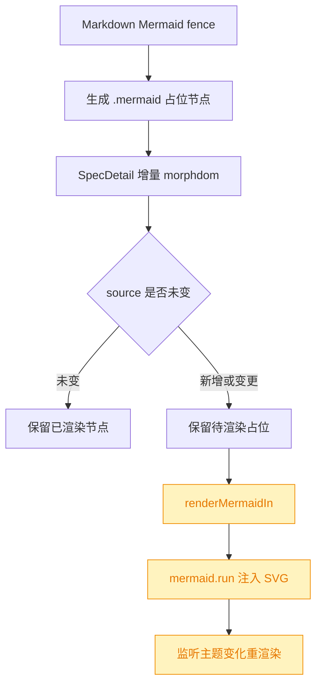
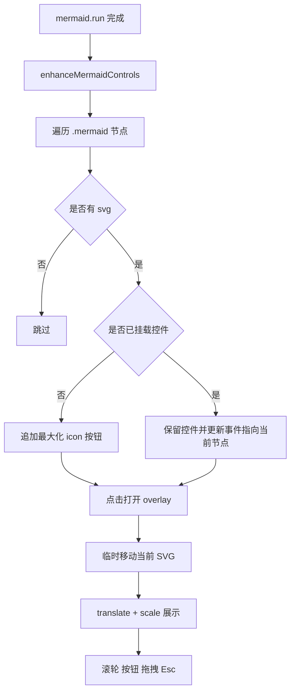
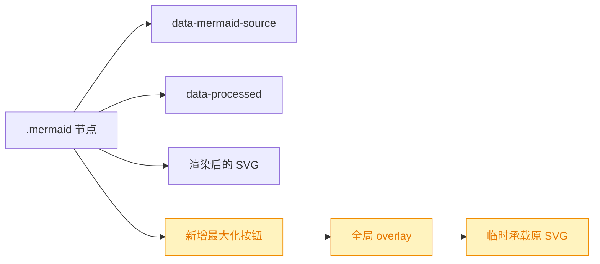
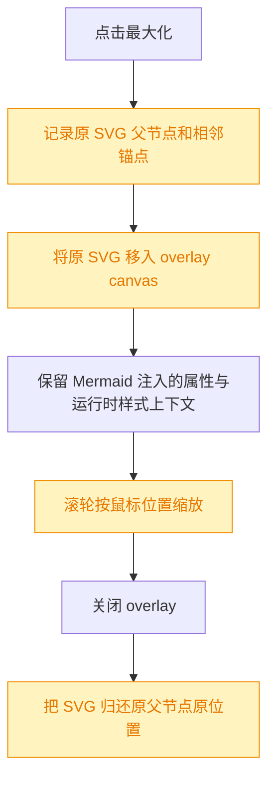
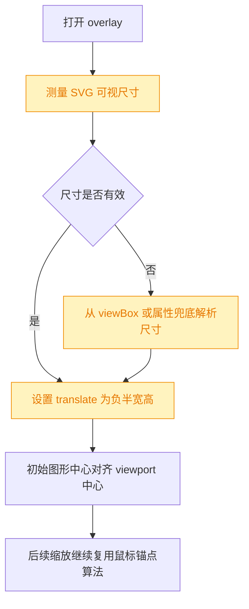
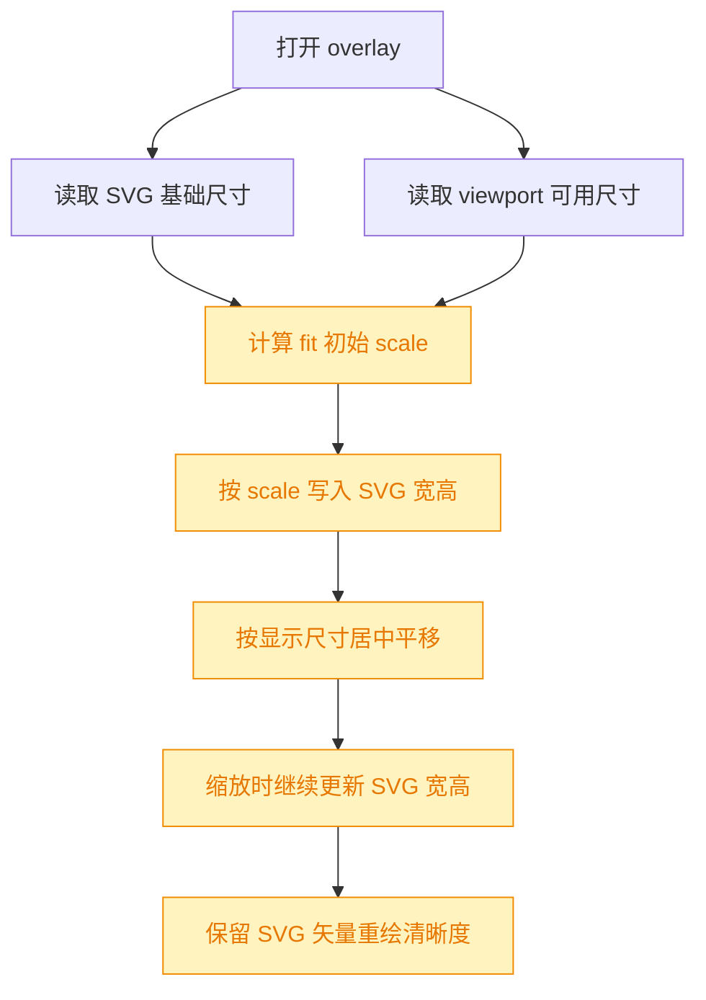
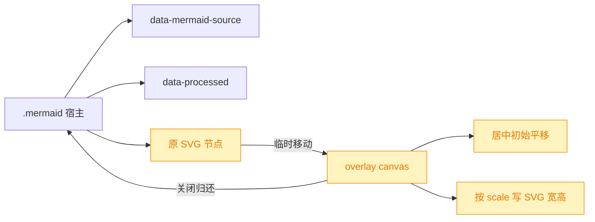

# Mermaid 图形最大化交互增强

## 1. 背景

部分 Mermaid 图渲染后尺寸过小，阅读细节困难。当前需求希望在 `renderMermaidIn()` 的 `mermaid.run()` 之后，为每个 `.mermaid` 节点挂载交互增强：

- 不破坏 `.mermaid` 节点自身的 `data-mermaid-source` 与 `data-processed`，避免影响当前 morphdom 保留逻辑。
- 新增 `enhanceMermaidControls(container)`，给 `.mermaid` 加最大化 icon。
- 点击最大化当前 Mermaid 图形。
- 将当前 SVG 临时移动到 overlay 中展示，关闭后归还原位。
- overlay 内部通过 `transform: translate(...) scale(...)` 支持滚轮缩放、按钮缩放、拖拽平移、Esc 关闭。

## 2. 需求

类型：feat

目标：提升 Mermaid 图的可读性，在不改变 Markdown 源渲染与增量 DOM 保留语义的前提下，为已渲染 Mermaid SVG 添加可放大查看的 overlay 交互。

验收重点：

- 每个成功渲染出 SVG 的 `.mermaid` 节点可见最大化入口。
- 点击入口后在 overlay 中展示当前 SVG，关闭后归还原 `.mermaid` 节点。
- overlay 支持滚轮缩放、按钮缩放、拖拽平移、Esc 关闭。
- `data-mermaid-source` 与 `data-processed` 保留策略不被破坏。
- GUI 展示文案走 `@src/gui/src/i18n/` 国际化配置。

## 3. 现状分析

当前 Mermaid 渲染链路已经把「Markdown 转占位节点」「morphdom 保留未变化图」「Mermaid 异步渲染」拆开处理。`SpecDetail` 的 `onBeforeElUpdated` 会在 `.mermaid` 的 `data-mermaid-source` 未变时跳过更新，避免已渲染 SVG 被替换回原始源码占位。

精确层：相关实现位置

- `@src/gui/src/lib/markdown.ts`：Mermaid fence 默认输出 `.mermaid` 占位节点，并写入 `data-mermaid-source`。
- `@src/gui/src/pages/SpecDetail.tsx`：通过 morphdom 增量更新 spec 正文，并在 source 未变时保留 `.mermaid` 节点。
- `@src/gui/src/lib/mermaid.ts`：`renderMermaidIn(container)` 加载 Mermaid、清理待渲染节点的 `data-processed`、写回源码文本，并调用 `mermaid.run({ nodes })`。
- `@src/gui/src/app.css`：已有 `.markdown .mermaid` 的居中、边框、背景与横向滚动样式。
- `@src/gui/src/__e2e__/mermaid-preserve.spec.ts` 与 `@src/gui/src/lib/__tests__/mermaid.test.ts`：已有保留逻辑与渲染队列相关测试。

主要约束：

- 增强逻辑必须发生在 Mermaid 渲染完成之后，否则目标 SVG 可能尚不存在。
- 控件不能通过改写 `.mermaid` 的关键属性实现状态记录；应只追加附属 DOM、事件监听与清理逻辑。
- 主题变化会触发全量 Mermaid 重渲染，增强逻辑需要可重复执行且避免重复挂载按钮或泄漏监听。
- overlay 是 GUI 可见交互面，按钮 aria-label、title 等展示文字需要补充国际化键。

## 4. 技术实现方案

实现决策：

- 在 `@src/gui/src/lib/mermaid.ts` 内新增并导出 `enhanceMermaidControls(container)`，由 `renderMermaidIn()` 在 `await mermaid.run({ nodes: currentNodes })` 之后调用。
- 增强函数以容器为作用域查找 `.mermaid`，只对内部存在 `svg` 的节点挂载最大化按钮；按钮使用独立 class 与 `data-mermaid-enhanced` 或内部 WeakMap 去重，不修改 Mermaid 依赖的 `data-mermaid-source` 与 `data-processed`。
- `.mermaid` 节点设置相对定位，按钮绝对定位在图区域右上角。按钮文案使用 i18n 键，例如最大化、放大、缩小、关闭、重置视图等。
- 打开 overlay 时记录当前 SVG 的父节点和相邻锚点，然后将原 SVG 临时移动到 overlay viewport；关闭时按锚点归还。overlay 的可视状态、缩放值、平移坐标仅保存在增强模块内部的闭包状态中。
- overlay 通过 `transform: translate(${x}px, ${y}px) scale(${scale})` 操作 SVG 的包裹层；滚轮按鼠标位置缩放，按钮缩放按视口中心缩放，拖拽只更新平移坐标。
- `renderMermaidIn()` 返回的 cleanup 需要同时清理主题监听与增强交互监听。推荐让 `enhanceMermaidControls(container)` 返回 cleanup，并在 `renderMermaidIn()` 的返回函数中调用。
- CSS 放在 GUI 样式层，避免影响 Markdown HTML 安全策略；overlay 使用固定定位和高 z-index，不依赖 Markdown 允许额外 HTML。
- 测试覆盖单元与 e2e 两层：单元验证重复增强、关键 data 属性保留、cleanup 移除监听；e2e 验证最大化、滚轮或按钮缩放、拖拽、Esc 关闭。

兼容性与影响范围：

- `.mermaid` 的关键属性不改名、不删除、不作为增强状态载体，因此不改变 morphdom 的保留判定。
- overlay 打开时原 SVG 临时移出 `.mermaid`，关闭 overlay 后归还原位；`.mermaid` 宿主属性和 Mermaid 渲染状态不受影响。
- 重复调用增强函数时不能追加多个按钮；主题重渲染后按钮仍可打开最新 SVG。
- 新增 i18n 文案需覆盖项目已有语言文件，避免 GUI 出现硬编码用户可见文字。

追加 fix 方案：

- 将 overlay 展示策略从 `cloneNode(true)` 调整为「临时移动原 SVG，关闭时归还」。原因是 clone 后 SVG 可能脱离 Mermaid 生成时的 scoped CSS、id 引用、`currentColor` 上下文或其它运行时属性，导致最大化视图和原图视觉不一致；移动原节点能最大限度复用实际渲染结果，同时不改写 `.mermaid` 宿主的关键 data 属性。
- 打开 overlay 时记录 `parentNode` 与 `nextSibling` 作为恢复锚点。关闭 overlay、Esc、cleanup 或重复打开时都走同一恢复路径；若原父节点已断开，则只移除 overlay，不强行写回失效 DOM。
- overlay 内的 SVG 包裹层继续使用 `translate + scale`；滚轮缩放必须以 `event.clientX/clientY` 映射到 viewport 内坐标为锚点，按钮缩放沿用视口中心。
- 不新增用户可见文案，现有最大化、缩放、关闭、重置 i18n 键继续复用。
- 测试补充最大化使用原 SVG 节点、关闭后归还，以及滚轮缩放中心随鼠标位置改变平移量的断言。

追加初始居中 fix 方案：

- 当前 `.mermaid-overlay__canvas` 使用 `top: 50%; left: 50%; transform-origin: 0 0`，`resetView()` 将 `translateX/Y` 置 0 时，实际效果是 SVG 左上角位于 viewport 中心。
- 修复策略是在 SVG 移入 overlay 后计算其显示尺寸，并把初始/重置平移设置为 `-width / 2` 与 `-height / 2`，让 SVG 中心落在 viewport 中心。
- 尺寸读取优先使用 SVG 的 `getBoundingClientRect()`；测试环境或未完成布局时兜底解析 `viewBox`，再兜底解析 `width` / `height` 属性。
- 滚轮缩放锚点算法保持不变，但它的初始平移基线从 `0,0` 改为居中值；按钮缩放依旧以 viewport 中心为锚点。

追加初始尺寸与清晰缩放 fix 方案：

- 初始尺寸不再固定 `scale = 1`；打开 overlay 时按 viewport 可用宽高和 SVG 基础尺寸计算 fit scale，使图形尽量占据可读区域，同时保留边距并设置上限，避免小图被放到过大。
- 缩放实现从 `transform: translate(...) scale(...)` 调整为：canvas 只负责 `translate(...)` 平移，SVG 本身通过 `style.width/style.height = baseSize * scale` 改变显示尺寸。这样浏览器按 SVG 矢量内容重新排布/绘制，避免外层合成纹理被 CSS scale 放大后出现模糊。
- 缩放锚点数学仍以 `screen = viewportCenter + translate + local * scale` 为模型；区别是 `scale` 只参与计算与 SVG 显示尺寸，不再写进 canvas transform。
- 打开 overlay 时记录 SVG 原有 inline `width` / `height` 样式，关闭时恢复，避免临时查看状态污染原图。
- 单元测试覆盖 fit 初始尺寸、SVG 宽高随按钮/滚轮缩放变化、canvas transform 不再包含 CSS `scale(...)`。

精确层：预计改动位置

- `@src/gui/src/lib/mermaid.ts`：新增增强函数、overlay 创建/关闭、缩放平移事件、cleanup 聚合。
- `@src/gui/src/app.css` 或 GUI 现有样式入口：新增 Mermaid 控件与 overlay 样式。
- `@src/gui/src/i18n/`：新增最大化、放大、缩小、关闭、重置等用户可见文案。
- `@src/gui/src/lib/__tests__/mermaid.test.ts`：补充增强函数与属性保留测试。
- `@src/gui/src/__e2e__/mermaid-preserve.spec.ts` 或新增 e2e：补充交互验证。

## 5. 待确认项

_暂无_

## 6. 任务清单

- [x] 在 `@src/gui/src/lib/mermaid.ts` 新增 `enhanceMermaidControls(container)` 并接入 `renderMermaidIn()`（验收：渲染后 `.mermaid` 存在最大化入口，关键 data 属性未被增强逻辑改写）
- [x] 在 GUI 样式与 `@src/gui/src/i18n/` 中补齐 Mermaid overlay 控件样式和文案（验收：无硬编码用户可见文案，overlay 支持关闭、缩放、重置按钮视觉状态）
- [x] 补充 Mermaid 单元测试与 e2e 交互测试（验收：覆盖重复增强、cleanup、data 属性保留、打开 overlay、缩放与 Esc 关闭）
- [x] 运行相关测试、类型检查和 spec lint（验收：命令通过，执行记录写明结果）
- [x] 修复 `@src/gui/src/lib/mermaid.ts` 的 overlay 展示策略，改为临时移动原 SVG 并关闭归还（验收：最大化视图不因 clone 脱离上下文导致颜色/样式漂移，`data-mermaid-source` 与 `data-processed` 不被改写）
- [x] 修正 Mermaid overlay 滚轮缩放锚点计算（验收：滚轮缩放中心跟随鼠标位置，按钮缩放仍以视口中心缩放）
- [x] 补充 Mermaid overlay 回归测试（验收：覆盖原 SVG 移动/归还、滚轮鼠标锚点缩放、Esc 关闭）
- [x] 运行相关测试和 spec lint（验收：命令通过，执行记录写明结果）
- [x] 修复 `@src/gui/src/lib/mermaid.ts` 的 overlay 初始/重置平移，按 SVG 尺寸居中显示（验收：最大化打开后 SVG 中心位于 viewport 中心，而不是左上角位于中心）
- [x] 补充 Mermaid overlay 初始居中回归测试（验收：viewBox 尺寸可作为测试环境兜底，初始 transform 为负半宽高）
- [x] 运行相关测试和 spec lint（验收：命令通过，执行记录写明结果）
- [x] 修复 `@src/gui/src/lib/mermaid.ts` 的 overlay 初始 fit scale 计算（验收：最大化后图形按 viewport 可用尺寸得到合适初始大小并居中）
- [x] 将 Mermaid overlay 缩放从 canvas CSS scale 改为更新 SVG 显示宽高（验收：放大后 canvas transform 不含 `scale(...)`，SVG 仍按矢量尺寸显示）
- [x] 补充 Mermaid overlay fit 与清晰缩放回归测试（验收：覆盖初始 fit、按钮缩放、滚轮锚点缩放、关闭后恢复 SVG inline 尺寸）
- [x] 运行相关测试和 spec lint（验收：命令通过，执行记录写明结果）

## 7. 追加任务

- [fixed] [fix] 2026-08-01 21:26:54 | 1. svg 最大化之后，样式错乱，比如继承了全局的 color（黑色），视觉效果有很大差异；可能需要采用比克隆节点更优的实现方案
  - 描述：1. svg 最大化之后，样式错乱，比如继承了全局的 color（黑色），视觉效果有很大差异；可能需要采用比克隆节点更优的实现方案
    html,
    body {
    background-color: hsl(var(--background));
    }

2. 最大化之后，滚轮缩放中心期望是鼠标位置

- [fixed] [fix] 2026-08-01 21:35:47 | 图形最大化之后，初始状态未能居中；
  - 描述：图形最大化之后，初始状态未能居中；
    目前看到的初始状态应该是图形左上角在容器中点。
- [fixed] [fix] 2026-08-03 16:32:02 | 1. 最大化图形之后，初始状态可能相对页面太小，需要计算一个合适的初始图形尺寸
  - 描述：1. 最大化图形之后，初始状态可能相对页面太小，需要计算一个合适的初始图形尺寸

2. 放大之后图形会变模糊，理论上 svg 能保持高清缩放

## 8. 执行记录

- 2026-08-01 21:07:23：新建 spec，并完成 plan 阶段现状分析与技术实现方案。
- 2026-08-01 21:08:42：待确认项为空，生成任务清单并进入 execute 阶段。
- 2026-08-01 21:16:59：完成 `@src/gui/src/lib/mermaid.ts` 增强实现；`renderMermaidIn()` 在 Mermaid 渲染后刷新控件，overlay 使用克隆 SVG 支持缩放、拖拽平移与 Esc 关闭，未改写 `data-mermaid-source` / `data-processed`。
- 2026-08-01 21:16:59：完成 `@src/gui/src/app.css` 与 `@src/gui/src/i18n/` 更新；新增最大化入口、overlay 工具栏、viewport/canvas 样式与中英文文案。
- 2026-08-01 21:16:59：完成 Mermaid 单元测试与 e2e 补充；覆盖重复增强、cleanup、属性保留、overlay 打开、按钮缩放、拖拽平移与 Esc 关闭。
- 2026-08-01 21:16:59：验证通过：`pnpm build:gui`、`pnpm vitest run src/gui/src/lib/__tests__/mermaid.test.ts`、`pnpm typecheck`、`pnpm playwright test src/gui/src/__e2e__/mermaid-preserve.spec.ts`。
- 2026-08-01 21:16:59：任务全部完成，待确认项为空，标记 done。
- 2026-08-01 21:29:26：完成 `@src/gui/src/lib/mermaid.ts` overlay 展示策略修复；最大化时临时移动原 SVG，关闭或 cleanup 时归还原位，避免 clone 脱离样式上下文导致视觉漂移。
- 2026-08-01 21:29:26：完成滚轮缩放锚点修正；缩放计算纳入 viewport 中心偏移，滚轮以鼠标位置为中心，按钮缩放保持视口中心。
- 2026-08-01 21:29:26：完成 Mermaid overlay 回归测试；覆盖原 SVG 移动/归还、Esc 关闭、按钮缩放与滚轮鼠标锚点缩放。
- 2026-08-01 21:29:44：验证通过：`pnpm vitest run src/gui/src/lib/__tests__/mermaid.test.ts`、`pnpm typecheck`、`pnpm playwright test src/gui/src/__e2e__/mermaid-preserve.spec.ts`、`pnpm build:gui`。
- 2026-08-01 21:30:37：追加 fix 任务全部完成，追加任务标记 `[fixed]`，待确认项为空，标记 done。
- 2026-08-01 21:31:47：补充主题重渲染边界保护；Mermaid 重新写入宿主节点前会先清理控件并关闭 overlay，避免临时移出的 SVG 在重渲染后重复归还。重新验证通过：`pnpm vitest run src/gui/src/lib/__tests__/mermaid.test.ts`、`pnpm typecheck`、`pnpm playwright test src/gui/src/__e2e__/mermaid-preserve.spec.ts`、`pnpm build:gui`。
- 2026-08-01 21:37:37：完成 Mermaid overlay 初始居中修复；`resetView()` 按 SVG 渲染尺寸、`viewBox` 或宽高属性计算负半宽高平移，使最大化初始状态居中。补充单测覆盖初始 transform 与滚轮锚点新基线。验证通过：`pnpm vitest run src/gui/src/lib/__tests__/mermaid.test.ts`、`pnpm typecheck`、`pnpm playwright test src/gui/src/__e2e__/mermaid-preserve.spec.ts`、`pnpm build:gui`。
- 2026-08-01 21:37:37：追加初始居中 fix 任务全部完成，追加任务标记 `[fixed]`，待确认项为空，标记 done。
- 2026-08-03 16:35:55：完成 Mermaid overlay 初始 fit scale 与清晰缩放修复；打开时按 viewport 可用尺寸计算初始 scale 并居中，缩放时改为更新 SVG `style.width/style.height`，canvas transform 仅保留平移，关闭后恢复 SVG 原 inline 尺寸。验证通过：`pnpm vitest run src/gui/src/lib/__tests__/mermaid.test.ts`、`pnpm typecheck`、`pnpm playwright test src/gui/src/__e2e__/mermaid-preserve.spec.ts`、`pnpm build:gui`。
- 2026-08-03 16:35:55：追加初始尺寸与清晰缩放 fix 任务全部完成，追加任务标记 `[fixed]`，待确认项为空，标记 done。
