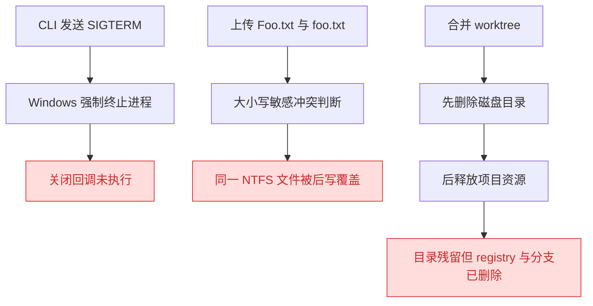

# Windows P0 运行时安全修复

## 1. 背景

Windows 实机排查发现，YorZ 当前在 Service 停止、附件落盘和 worktree 清理三个关键链路上存在平台语义差异。此前结论主要来自静态分析，本次先通过隔离临时环境构造可重复用例，确认风险真实存在后再设计修复。

调试基线为 `864ff801a9b74468c6e97fffc8e93db92956a174`；进入复现前工作区干净。临时验证脚手架已删除，未进入最终变更。

## 2. 需求

- Windows 执行 `yorz serve stop` 时必须先触发 Service 自身的优雅关闭流程，释放 watcher、Agent SDK 和 HTTP 连接，再结束进程。
- 附件名称仅大小写不同时不得覆盖已有文件，命名结果在 Windows、macOS 和 Linux 上保持确定性。
- merge 或删除 worktree 前必须先停止该项目的活动 Agent 并释放 watcher；删除失败时不得报告成功、删除分支或丢失 registry 恢复信息。
- 不改变 macOS/Linux 现有信号停止语义，不扩大到本轮 P1/P2 风险。

## 3. 现状分析

三个风险均已在 Windows 本机稳定复现，不再属于理论风险。

### 3.1 停服链路

Windows 上对目标 Node 进程执行 `process.kill(pid, 'SIGTERM')` 后，进程以退出码 `1` 结束，目标进程注册的 `SIGTERM` 回调没有输出执行标记。当前停服命令因此绕过 `ServeHandle.close()` 和 runtime 自清理路径。

### 3.2 附件链路

连续写入 `Foo.txt=first` 和 `foo.txt=second` 后，NTFS 上只剩一个 `Foo.txt`，内容为 `second`。当前 `uniquify()` 使用大小写敏感的 `Array.includes()`，与默认大小写不敏感的 Windows 文件系统语义不一致。

### 3.3 Worktree 链路

复现中让一个 Node 子进程以 worktree 为当前目录，再执行真实 `mergeBackToMain()`：返回状态为 `merged`，registry 删除已发生，分支也已删除，但 worktree 目录仍存在。当前实现忽略两次 `git worktree remove` 和分支删除的返回码。

进一步调用链核实表明，项目关闭最终进入 `SessionManager.dispose()`，但该方法没有 abort `live` 会话，也不等待后台 `send()` 任务完成；即使简单交换清理顺序，活动 Claude/Codex 子进程仍可能占用 worktree。

复现证据与精确代码位置

- 停服证据：`{"code":1,"signal":null,"handled":false,"output":"READY"}`。
- 附件证据：`{"names":["Foo.txt"],"content":"second"}`。
- Worktree 证据：`{"result":"merged","worktreeExists":true,"branchStillExists":false,"registryRemoved":true}`。
- `@src/cli/serve.ts:214`：`runStopServe()` 直接向 runtime PID 发送 `SIGTERM`。
- `@src/cli/serve.ts:118`：优雅关闭逻辑只挂在当前进程的信号回调上。
- `@src/service/attachment-store.ts:362`：`uniquify()` 使用大小写敏感的 `includes()`。
- `@src/service/worktree-manager.ts:189`：先删 worktree，之后才调用 registry 移除。
- `@src/service/session-manager.ts:323`：`dispose()` 只释放 adapter，不 abort 或等待活动会话。

## 4. 技术实现方案

```mermaid
flowchart TB
    subgraph StopFix[停服修复]
      StopCmd[serve stop] --> HasToken{runtime 有关闭令牌}
      HasToken -->|是| LocalRequest[向 localhost 发送鉴权关闭请求]
      LocalRequest --> Graceful[Service 执行统一 shutdown]
      HasToken -->|否 旧版本| LegacyKill[兼容旧 runtime 强制终止]
    end
    subgraph FileFix[附件修复]
      Candidate[候选文件名] --> Fold[统一大小写折叠]
      Fold --> Collision{是否已占用}
      Collision -->|是| Suffix[追加序号]
      Collision -->|否| Persist[安全落盘]
    end
    subgraph WorktreeFix[Worktree 修复]
      CloseProject[停止会话并释放 watcher] --> RemoveGit[删除 Git worktree]
      RemoveGit --> VerifyDisk{目录确已消失}
      VerifyDisk -->|否| KeepState[抛出错误并保留 registry]
      VerifyDisk -->|是| DeleteBranch[删除分支]
      DeleteBranch --> DropRegistry[最后删除 registry]
    end
    classDef breaking fill:#ffdddd,stroke:#e03131,color:#c92a2a
    classDef affected fill:#fff3bf,stroke:#f08c00,color:#e67700
    class LegacyKill breaking
    class LocalRequest,Graceful,Fold,Suffix,CloseProject,RemoveGit,VerifyDisk,KeepState,DeleteBranch,DropRegistry affected
```

### 4.1 Service 优雅关闭

- 每个 Service runtime 生成高熵随机关闭令牌，并写入对应 runtime 记录；令牌禁止进入日志和控制台。
- Service 增加内部关闭入口，仅接受携带正确令牌的请求；响应发出后异步进入现有统一 `shutdown()`，确保 `handle.close()`、runtime 移除和退出顺序一致。
- Windows `serve stop` 优先向 `127.0.0.1:<port>` 发送带令牌请求并等待进程退出；macOS/Linux 保持现有 `SIGTERM` 路径。
- 对升级前已运行、没有令牌的旧 runtime 保留一次强制终止兼容，避免新 CLI 无法停止旧 Service。
- 关闭入口虽然随主 Service 监听，但没有令牌时返回拒绝，不暴露令牌值或进程信息。

### 4.2 附件唯一命名

- 将现有文件名和候选名统一转换为小写比较键，再执行冲突检测；实际展示名称仍保留用户输入大小写。
- `Foo.txt` 已存在时，`foo.txt` 必须分配为 `foo-1.txt`，并保留两份内容。
- 重命名路径复用同一比较规则，避免重命名覆盖已有的不同大小写文件。
- 跨平台统一采用大小写不敏感的逻辑，避免同一个草稿在不同系统间出现不同命名结果。

### 4.3 Worktree 资源释放与事务边界

- 为 registry 提供“仅释放缓存实例、不删除全局配置”的明确操作，供 merge/delete 在磁盘清理前调用；现有 reload 复用该能力。
- `SessionManager.dispose()` 先 abort 所有 live 会话，再等待已启动的发送任务结束，最后释放 adapter 并清空事件资源。
- merge/delete worktree 先释放项目实例，再执行 Git 与磁盘删除；Git 命令失败或目录仍存在时抛出可识别错误并保留 registry。
- 只有 worktree 路径确认消失后才删除分支和 registry；主项目 reload 仍在合并成功后执行。
- 对 Git 元数据已移除但残留目录仍存在的状态，删除流程允许跳过 dirty 检查并继续清理，保留失败后的再次恢复入口。

### 4.4 兼容性与影响范围

- 停服协议只改变 Windows 新 runtime 的首选路径；旧 runtime 和非 Windows 行为有明确兼容分支。
- 附件分配在大小写敏感文件系统上会更保守地添加后缀，但不会覆盖或删除已有文件。
- Worktree 清理会从“尽力而为且可能假成功”改为“失败即保留恢复状态”，调用方可能收到明确错误，这是预期的安全收紧。

预计修改范围与定向验证

- `@src/cli/serve.ts`：runtime 令牌、Windows 关闭请求、统一 shutdown 入口及单元测试。
- `@src/service/index.ts`、`@src/service/server.ts`：受令牌保护的内部关闭回调。
- `@src/service/attachment-store.ts`：大小写不敏感唯一命名及附件回归测试。
- `@src/service/session-manager.ts`、`@src/service/project-registry.ts`：活动会话等待与项目实例释放。
- `@src/service/worktree-manager.ts`：清理顺序、结果校验与失败恢复测试。
- 验证仅运行上述修改文件的关联测试，不执行全仓 lint、typecheck 或 test。

## 5. 待确认项

_暂无_

## 6. 任务清单

- [x] 为 Windows 停服协议补充失败回归测试，覆盖令牌请求、旧 runtime 回退和统一 shutdown（验收：现有实现下测试因缺少优雅关闭协议而失败）
- [x] 实现带随机令牌的 Windows 优雅关闭协议并保持非 Windows 信号语义（验收：停服相关测试通过且日志不包含令牌）
- [x] 为附件大小写冲突补充失败回归测试（验收：现有实现下第二个文件未获得 `-1` 后缀，测试按预期失败）
- [x] 实现跨平台大小写不敏感的附件唯一命名（验收：`Foo.txt` 与 `foo.txt` 内容均保留，附件测试通过）
- [x] 为 SessionManager 关闭活动会话补充失败回归测试（验收：现有实现下 dispose 未 abort 或未等待活动任务，测试按预期失败）
- [x] 实现活动会话 abort 与在途任务等待（验收：dispose 返回前活动任务结束，session-manager 测试通过）
- [x] 为 worktree 删除失败保留 registry 补充失败回归测试（验收：现有实现仍在残留目录存在时删除 registry，测试按预期失败）
- [x] 重排 worktree 清理事务并校验 Git/磁盘结果（验收：先释放项目资源，失败保留 registry，成功才删除分支与 registry）
- [x] 运行所有修改模块的定向测试并核对快照差异（验收：关联测试零失败，`git diff` 仅包含合法修复、测试和本 spec）
- [x] 同步 CodeGraph 并完成 spec 收尾（验收：`codegraph status` 为最新且 spec lint `errorCount=0`）

## 7. 执行记录

- 2026-08-01 14:27:14：完成三个 Windows P0 隔离复现；临时脚手架已删除，证据写入现状分析。
- 2026-08-01 14:32:00：plan 文档经仓库 CLI lint 验证，`errorCount=0`、`warnCount=0`；本机 Bash/全局 yorz 不可用，使用 `node dist/cli/index.js lint` 等价回退。
- 2026-08-01 14:33:27：完成方案拆解，进入 TDD execute 阶段。
- 2026-08-01 14:39:11：Windows 停服 RED 验证成立；CLI 测试因未生成清理标记失败，Service 测试因关闭入口返回 404 失败。
- 2026-08-01 14:40:52：实现 runtime 随机令牌、受保护关闭入口与 Windows 优雅请求；定向运行 10 个测试全部通过，并覆盖无令牌旧 runtime 回退。
- 2026-08-01 14:41:40：附件 RED 验证成立；新增与重命名的大小写碰撞分别得到 `foo.txt`、`TARGET.txt`，均未分配 `-1` 后缀。
- 2026-08-01 14:42:00：唯一命名改为跨平台大小写不敏感比较；附件模块 19 个定向测试全部通过，两份文件内容均保留。
- 2026-08-01 14:42:49：SessionManager RED 验证成立；旧 `dispose()` 返回后活动会话未收到 abort。
- 2026-08-01 14:43:30：实现 live 会话 abort、在途派发等待及 resume/dispose 竞态处理；SessionManager 模块 10 个定向测试全部通过。
- 2026-08-01 14:46:09：worktree RED 验证成立；旧实现未先释放项目、目录残留仍返回成功，并在失败边界提前删除 registry。
- 2026-08-01 14:47:11：实现先 release、目录存在性确认、Git 返回码校验和失败保留 registry；worktree 清理事务 3 个定向测试全部通过。
- 2026-08-01 14:48:09：定向运行 8 个关联测试文件共 71 个用例，全部通过；`git diff --check` 通过。仓库未安装本地 ESLint，未执行 ESLint。
- 2026-08-01 14:49:30：停服边界调整后复跑 10 个相关用例全部通过；`codegraph sync/status` 显示 199 个文件、2583 个节点且索引为最新。
- 2026-08-01 14:50:01：任务清单全部完成、无待确认项和批注，spec 标记为 `done`。
