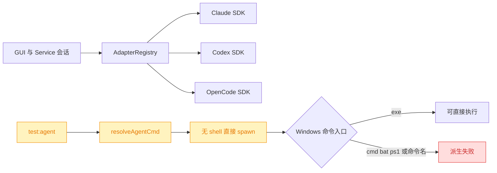
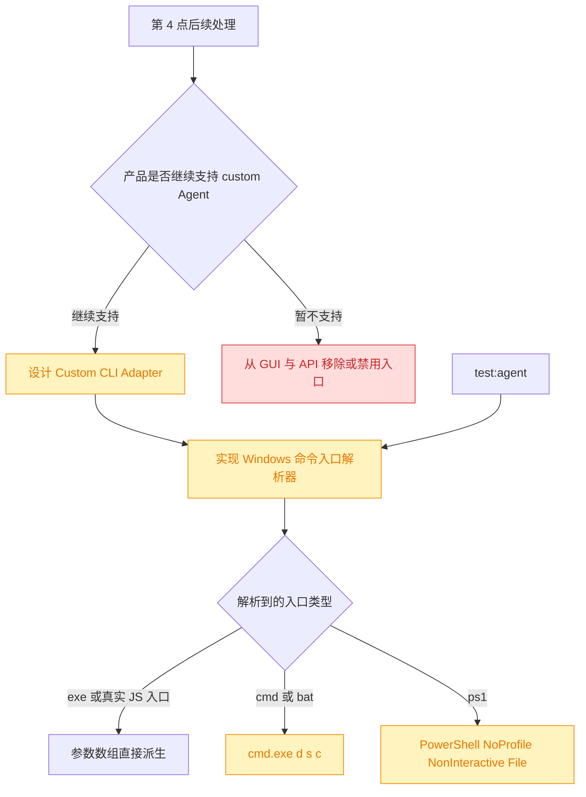

# Windows P1 Agent 运行时兼容分析

## 1. 背景

P0 运行时安全问题完成后，本轮只复核原风险清单中的第 4、5、6 点，不实施生产代码。分析基线为 `864ff801a9b74468c6e97fffc8e93db92956a174`，工作区同时保留上一轮尚未提交的 P0 修复，本轮未修改或覆盖这些文件。

原编号与当前文档的对应关系：

- 第 4 点：Windows `.exe`、`.cmd`、`.bat`、`.ps1` Agent 命令入口。
- 第 5 点：Claude、Codex、OpenCode 三套 Agent SDK 的 Windows 实机兼容矩阵。
- 第 6 点：全局配置、runtime 与日志是否迁移到平台规范目录。

## 2. 需求

- 用当前生产调用链重新判断第 4、5 点是否是真实风险，不沿用已经漂移的历史描述。
- 区分“已复现产品 Bug”“只影响测试工具”“第三方 SDK 覆盖缺口”，避免把三者混成同一优先级。
- 第 6 点按用户决策维持现有跨平台统一目录设计，不再纳入 Windows 兼容修复。
- 本轮只输出分析和后续实施边界，不生成开发任务或修改代码。

## 3. 现状分析

### 3.1 第 4 点结论：风险存在，但原范围已过时

当前生产 Service 的 Claude、Codex、OpenCode 会话全部通过 `AdapterRegistry` 进入 SDK adapter，不再调用 `resolveAgentCmd()`。`resolveAgentCmd()`、`YORZ_AGENT_CMD` 和直接 `spawnWithoutWindow(command)` 只剩 `test:agent` 测试执行器使用。因此，“内置三种 Agent 的生产会话都会被 Windows shim 阻断”不成立。

Windows 本机验证确认测试执行器的入口问题真实存在：

- `opencode` 实际安装为 `opencode.ps1`、`opencode.cmd` 和无扩展 shim；直接 `spawn('opencode')` 返回 `ENOENT`。
- 直接派生 `opencode.cmd` 返回 `EINVAL`，派生 `opencode.ps1` 返回 `EFTYPE`；解析到真实 `opencode.exe` 后 `--version` 成功并返回 `1.18.3`。
- 本机没有 `claude` 全局命令，因此测试执行器选择 Claude 时返回 `ENOENT`；但 Claude SDK 自带 `claude.exe`，版本为 `2.1.207`，生产链路不依赖全局命令。
- 本机 `codex` 命令解析到受 WindowsApps 权限控制的 Codex App 路径，直接派生返回 `EPERM`；Codex SDK 自带的 `codex.exe` 可执行并返回 `0.144.1`，生产链路同样不依赖 App 命令。

另有一个比 shim 更前置的跨平台功能缺口：GUI 和项目配置 API 允许保存 `{ kind: "custom", cmd, args }`，但生产 `resolveProjectAgentKind()` 会把 `custom` 映射为 `claude`，`SessionManager` 也只接受三种 SDK `AgentKind`。因此自定义 Agent 当前不是“在 Windows 上可能启动失败”，而是所有平台都不会进入自定义命令链路，配置会静默使用 Claude。

第 4 点精确代码证据

- `@src/service/agent-config.ts:44`：源码注释明确 `resolveAgentCmd` 只保留给 `test:agent` harness。
- `@src/skill/yorz-spec/__tests__/runner.ts:156`：测试执行器解析命令后直接调用 `spawnWithoutWindow()`。
- `@src/service/process.ts:60`：`spawnWithoutWindow()` 只添加 `windowsHide`，不会解析 `.cmd/.bat/.ps1`。
- `@src/gui/src/components/ProjectConfigDialog.tsx:76`：GUI 可以保存 `kind: custom`。
- `@src/service/routes/project-config.ts:92`：API 接受并持久化 custom command。
- `@src/service/project-registry.ts:234`：运行时只识别 inherit/codex/opencode，其余统一返回 claude。

### 3.2 第 5 点结论：未发现统一 SDK Bug，但发布前矩阵仍未闭环

三套 SDK 的 Windows 支持程度不同，不能用一个公共 launcher 修复：

| SDK                | 当前本机证据                            | Windows 子进程策略                                                                              | 当前判断                           |
| ------------------ | --------------------------------------- | ----------------------------------------------------------------------------------------------- | ---------------------------------- |
| Claude `0.3.207`   | 随包 `claude.exe 2.1.207` 存在且可执行  | 默认 spawn 显式设置 `windowsHide: true`；AbortController 先走约 2 秒优雅关闭再强制结束          | 暂未发现入口或弹窗 Bug             |
| Codex `0.144.1`    | 随包 `codex.exe 0.144.1` 存在且可执行   | SDK 按 Windows target triple 解析原生 exe；spawn 未设置 `windowsHide`，取消直接交给 AbortSignal | 入口正常；窗口与取消需真实会话验证 |
| OpenCode `1.17.18` | `createOpencode()` 本地 server 启停成功 | `cross-spawn` 经 `cmd.exe` 启动 shim；Windows 停止使用 `taskkill /T /F`                         | 本机未复现弹窗或残留进程           |

OpenCode 本机隔离验证中，SDK 派生了 `cmd.exe → opencode.exe`；两个进程的 `MainWindowHandle` 均为 `0`，server 关闭后两个 PID 均消失。因此“OpenCode SDK 一定弹出 cmd 窗口”在当前版本和当前 Service 类似的无窗口父进程环境下未复现。

尚未闭环的是需要真实 Agent 身份和模型调用的行为矩阵：新会话、恢复会话、工具调用、用户取消、异常退出、Service 停止。本机环境没有 `ANTHROPIC_API_KEY`、`OPENAI_API_KEY` 或 `OPENCODE_API_KEY`，本轮没有擅自使用可能存在的应用登录态发起付费或外部模型请求。因此第 5 点应保留为“发布验证缺口”，不能表述为已经确认的代码缺陷。

第 5 点精确依赖证据

- `@src/service/agent-sdk/claude-adapter.ts`：通过 SDK `query()` 派发，AbortController 负责取消。
- `@node_modules/@anthropic-ai/claude-agent-sdk/sdk.mjs`：默认本地派生参数包含 `windowsHide: true`。
- `@src/service/agent-sdk/codex-adapter.ts`：通过 `runStreamed(..., { signal })` 派发和取消。
- `@node_modules/@openai/codex-sdk/dist/index.js`：按 `x86_64-pc-windows-msvc` 选择随包 `codex.exe`，spawn 只传 `env` 与 `signal`。
- `@src/service/agent-sdk/opencode-adapter.ts`：通过 SDK 创建本地 server，并调用 session abort API。
- `@node_modules/@opencode-ai/sdk/dist/server.js`：使用 cross-spawn 启动 `opencode serve`；未显式传 `windowsHide`。
- `@node_modules/@opencode-ai/sdk/dist/process.js`：Windows 关闭使用 `taskkill /pid <pid> /T /F` 且 `windowsHide: true`。

### 3.3 第 6 点结论：不是问题，维持现有设计

用户确认跨平台统一使用 `~/.config/yorz` 是合理设计。YorZ 还提供 `YORZ_HOME` 作为显式覆盖，因此不需要为了遵循 `%APPDATA%` / `%LOCALAPPDATA%` 惯例引入配置拆分、数据迁移和多进程迁移锁。

第 6 点从 Windows 风险范围移除：不迁移现有文件、不增加兼容读取、不拆分配置/runtime/log 路径。后续只需保证文档准确描述当前目录规则。

## 4. 技术实现方案

### 4.1 第 4 点后续边界

第 4 点应拆成两个独立问题，不能继续以“统一所有 Agent launcher”实施：

- 先决定 custom Agent 的产品语义，再决定是否为它实现 CLI adapter；不能只修 shim 后继续让生产 runtime 静默回退 Claude。
- Windows launcher 只服务 `test:agent` 和未来可能的 Custom CLI Adapter，不接管三套 SDK 内部派生。
- 优先解析真实 `.exe` 或 JS 入口；只有明确的 `.cmd/.bat` 才通过 `cmd.exe`，`.ps1` 显式通过 PowerShell。
- `YORZ_AGENT_CMD` 不能继续用空白正则拆分，否则带空格路径和引号会损坏；应改成结构化 command + args，或仅接受一个可执行文件路径并把参数放到独立配置。
- 非 Windows 继续直接派生命令，不启用全局 `shell: true`。

### 4.2 第 5 点后续边界

- 不修改 Claude SDK 派生；当前版本已有随包原生 exe、`windowsHide` 和 Windows 优雅取消处理。
- 不因 Codex SDK 未显式设置 `windowsHide` 就先行 monkey patch；先用真实会话观察子进程窗口、取消退出码和残留进程，再决定是否需要向 SDK 上游补充 spawn options。
- OpenCode 当前版本保留不动；本机启动、隐藏窗口状态和关闭均已通过。真实 prompt/cancel 矩阵若失败，再依据 SDK API 与进程证据定位。
- 三套 SDK 的真实矩阵必须分别记录安装来源、SDK/CLI 版本、新建/恢复/工具/取消/异常/停服结果；单元测试 mock 只能覆盖 YorZ adapter 映射，不能替代此矩阵。
- 真实矩阵可能使用应用登录态或产生模型费用，执行前必须获得用户明确授权；不得把未执行的外部调用写成已验证。

### 4.3 第 6 点决策记录

> 决策记录：第 6 点不构成 Windows 风险。继续统一使用 `~/.config/yorz`，保留 `YORZ_HOME` 覆盖，不实施平台目录迁移。

### 4.4 兼容性与影响范围

- 第 4 点未来若实现，只影响测试 harness 与 custom Agent 配置；三套内置 SDK 不应经过新 launcher。
- 移除 custom 配置入口会构成 GUI/API breaking change；实现 Custom CLI Adapter 则会扩大 session/history/cancel 的设计范围。
- 第 5 点当前优先补验证，不预设需要代码变更，避免因第三方 SDK 内部实现差异制造全局补丁。
- 第 6 点无代码影响，不产生旧数据迁移风险。

## 5. 待确认项

### 5.1 [choice] Custom Agent 配置后续采用哪种产品策略？

1. 保留 GUI/API 的 custom 配置，并设计具备派发、取消与会话能力的 Custom CLI Adapter （推荐）
2. 暂时移除或禁用 custom 配置入口，直到明确支持完整会话语义

## 6. 任务清单

_待用户确认 Custom Agent 产品策略后生成。_

## 7. 执行记录

- 2026-08-01 15:00:17：完成第 4、5 点静态调用链与 Windows 本机隔离验证；第 4 点确认只直接影响测试 harness，并发现 custom 配置静默回退 Claude；第 5 点确认三套 SDK 均具备 Windows 原生路径，但真实 Agent 行为矩阵尚未授权执行。
- 2026-08-01 15:00:17：按用户决策排除第 6 点，保留 `~/.config/yorz` 与 `YORZ_HOME` 现有设计。
