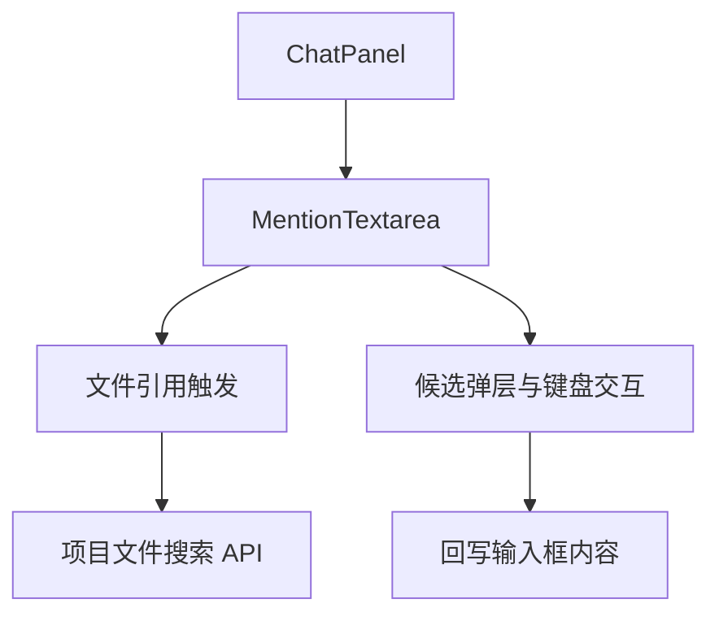
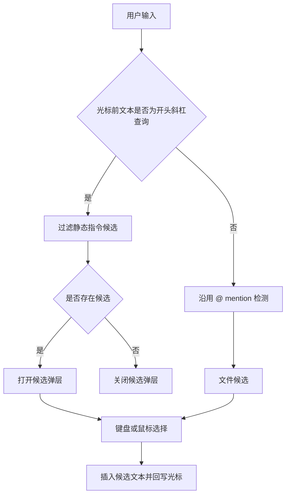
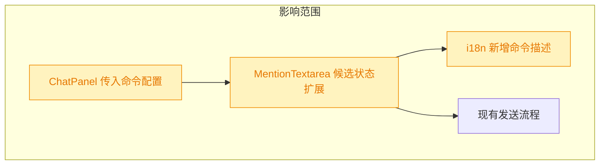

# Chat Slash Commands

## 1. 背景

用户希望在 Chat 输入框中支持快捷指令功能，入口是在输入框起始位置输入斜杠 `/` 后显示快捷指令候选列表，交互参考现有 mention 体验。

原始需求：

```text
希望在chat的输入框中支持快捷指令功能 @src/gui/src/components/ChatPanel.tsx
入口： 在输入框起始位置输入斜杠 ‘/’符号，显式快捷指令候选列表，参考 mention 交互
指令列表：/yorz-debug  /yorz-spec，对应 yorz debug 和 yorz spec 两个 Skill
```

## 2. 需求

- Chat 输入框仅在文本起始位置输入 `/` 时展示快捷指令候选。
- 候选列表包含 `/yorz-debug` 与 `/yorz-spec`。
- 候选项需要能通过键盘方向键切换，Enter/Tab 选择，Escape 关闭，并支持鼠标点击。
- 选择候选后将对应指令插入输入框，供用户继续补充参数或直接发送。
- 新增展示给用户的文字必须进入 `@src/gui/src/i18n/` 国际化配置。

## 3. 现状分析



当前 Chat 输入框使用 `MentionTextarea`。该组件已经承担文本域自适应高度、`@` 文件补全、候选弹层、方向键导航、Enter/Tab 选择、Escape 关闭、blur 延迟关闭与 IME Enter 保护。ChatPanel 的 `onKeyDown` 会在 `MentionTextarea` 自身处理之后运行，并通过 `e.defaultPrevented` 避免候选选择时误触发送。

斜杠指令的交互与 mention 高度相似，区别是候选来源为静态列表，触发位置限定为输入框开头，且插入文本不带文件搜索 API。将该能力扩展进 `MentionTextarea` 可以保留现有交互细节，并避免 ChatPanel 重复维护第二套弹层状态。

<details>
<summary>精确层：相关文件与现有职责</summary>

- `@src/gui/src/components/ChatPanel.tsx`：Chat 面板输入框调用 `MentionTextarea`，负责发送、附件、会话状态。
- `@src/gui/src/components/MentionTextarea.tsx`：实现 textarea、`@` 文件候选、候选弹层、键盘与鼠标选择。
- `@src/gui/src/i18n/zh-CN.ts` / `@src/gui/src/i18n/en.ts`：Chat 输入框相关可见文案的国际化配置。

</details>

## 4. 技术实现方案



方案是在 `MentionTextarea` 增加可选的静态斜杠命令候选配置，并复用现有候选弹层 UI 与选择逻辑：

- 新增候选类型，让弹层既能渲染文件路径字符串，也能渲染斜杠命令对象。
- 新增 props，例如 `slashCommands?: SlashCommand[]`，由 ChatPanel 传入 `/yorz-debug` 与 `/yorz-spec`。
- 在输入事件中优先检测斜杠命令：只有光标前文本匹配 `^/[\\w-]*$` 时打开命令候选；该条件保证触发点位于输入框起始位置。
- 斜杠候选按当前查询前缀过滤，选择后插入命令文本并追加一个空格，便于继续输入参数。
- 若不是斜杠命令场景，则继续走现有 `@` mention 检测和文件搜索。
- 弹层显示命令 label 与描述，描述文案通过 `chat.slashCommandYorzDebug`、`chat.slashCommandYorzSpec` 等 i18n key 提供。
- ChatPanel 只负责定义 Chat 输入框支持的命令列表，不改变发送流程；用户最终发送的仍是普通 prompt 文本。



兼容性决策：不改动 `MentionTextarea` 现有 `@` mention API 的必填参数与默认行为；未传 `slashCommands` 的页面，如 NewSpec，保持仅支持 `@` 文件引用。斜杠候选只在起始位置触发，因此不会影响普通正文中的 `/` 字符。

<details>
<summary>精确层：建议改动点</summary>

- `@src/gui/src/components/MentionTextarea.tsx`：新增 `SlashCommand` 类型、候选 union 状态、斜杠检测与选择逻辑。
- `@src/gui/src/components/ChatPanel.tsx`：构造静态命令列表并传给 `MentionTextarea`。
- `@src/gui/src/i18n/zh-CN.ts`、`@src/gui/src/i18n/en.ts`：新增 `/yorz-debug`、`/yorz-spec` 的描述文案。
- 验证命令：优先运行 `pnpm run typecheck`；如需要覆盖交互，再补充针对输入框斜杠候选的 e2e 或组件测试。

</details>

## 5. 待确认项

_暂无_

## 6. 任务清单

- [x] 扩展 `@src/gui/src/components/MentionTextarea.tsx` 支持起始斜杠静态命令候选（验收：`/`、`/yorz` 可显示并筛选候选，选择后插入命令文本）
- [x] 在 `@src/gui/src/components/ChatPanel.tsx` 接入 `/yorz-debug` 与 `/yorz-spec` 命令候选（验收：Chat 输入框传入两条命令，发送流程不变）
- [x] 更新 `@src/gui/src/i18n/zh-CN.ts` 与 `@src/gui/src/i18n/en.ts` 的命令描述文案（验收：新增可见文案不硬编码在组件中）
- [x] 运行格式化、lint/typecheck 验证（验收：spec lint 与 `pnpm run typecheck` 通过，若失败记录原因）

## 7. 执行记录

- 2026-08-03 14:59:38：新建 spec 并完成 plan 阶段现状分析、技术实现方案与待确认项自检。
- 2026-08-03 15:01:01：待确认项为空，生成 execute 阶段任务清单。
- 2026-08-03 15:02:47：扩展 `MentionTextarea` 支持起始斜杠静态候选，复用现有候选弹层、键盘导航、鼠标选择与 IME 保护；选择命令后插入命令文本并追加空格。
- 2026-08-03 15:02:47：在 `ChatPanel` 接入 `/yorz-debug` 与 `/yorz-spec`，发送流程保持普通 prompt 文本不变。
- 2026-08-03 15:02:47：补齐中英文 i18n 命令描述文案，避免组件内硬编码可见文字。
- 2026-08-03 15:02:47：已运行 `npx prettier --write` 与 `pnpm run typecheck`，类型检查通过。
- 2026-08-03 15:02:47：非 manual 任务全部完成、待确认项为空，标记 done。
