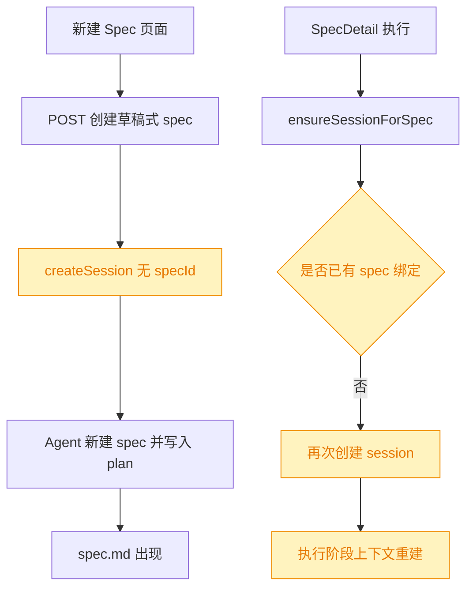
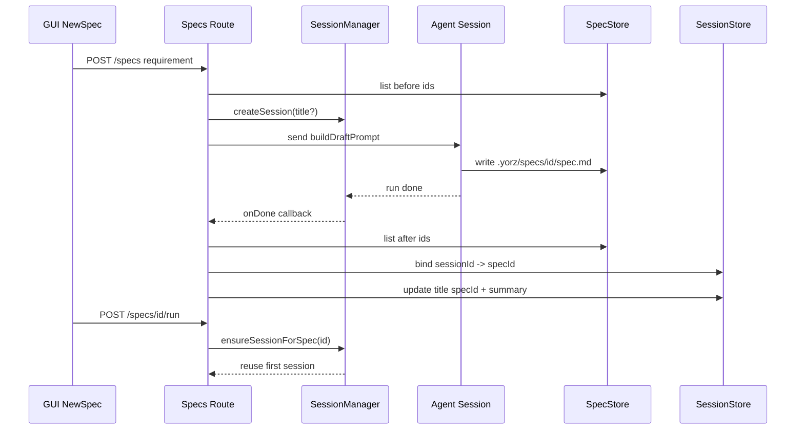
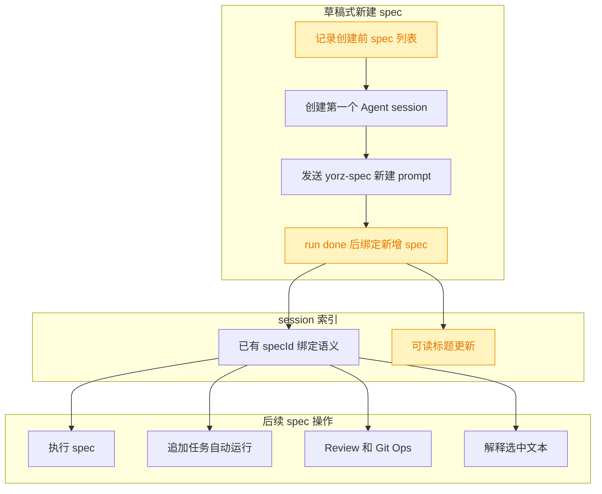

# 复用新建 spec 的 Agent session

## 1. 背景

GUI 中点击新建 spec 后，会启动一个 Agent session 执行 yorz-spec 的新建与 plan 分析，并由 Agent 写入 spec 文档。用户在 GUI 确认待确认项后，再执行 spec 时，当前期望是在第一次 plan 所在的 session 中继续，而不是新建第二个 Agent session。

复用第一个 session 可以保留大模型上下文与 cache，避免重复加载项目背景、spec 需求和前序分析，同时让 Chat 面板里的上下文链路更连续。为了提升会话列表可读性，第一个 session 可使用 spec 名称加 summary 进行重命名。

## 2. 需求

原始需求：

"""
在GUI中点击新建spec之后会创建一个 Agent session进行 plan 分析并写入 spec 文档，确认完问题之后执行 spec 会再次新建 Agent session 进行代码实施；
期望确认问题之后，第二次不要创建新的 Agent session 而是在前一个 session 中继续，避免大模型 cache 失效，同时提升性能；

可以使用 spec 名称加summary去重命名第一个 session，优化可读性。
"""

目标：

- 新建 spec 的 Agent session 在 spec 文件创建完成后绑定到该 spec。
- 用户确认待确认项并触发执行时，复用上述已绑定 session。
- 绑定后的 session 标题用 spec id 或名称加 frontmatter.summary 更新，便于在 Chat 会话列表中识别。
- 保持现有 `/specs/:id/run`、追加任务、review、git-ops、explain 等 per-spec session 复用语义不破坏。

## 3. 现状分析

当前后端已经存在“每个 spec 复用专属 session”的基础能力：`SessionStore` 支持 `specId` 字段，`SessionManager.ensureSessionForSpec(specId)` 会优先通过 `findSessionForSpec` 找到已绑定 session，找不到时才创建新 session。`/projects/:projectId/specs/:id/run`、追加任务自动运行、解释、review 和 git-ops 路径都已调用 `ensureSessionForSpec`。

真正的断点出现在新建 spec 的草稿式流程：`POST /projects/:projectId/specs` 在收到 `requirement` 且没有 `title` 时会调用 `p.sessions.createSession()`，发送新建 spec prompt，并返回 `{ draft: true, sessionId }`。此时 spec id 尚不存在，因为 id 是 Agent 按 yorz-spec 新建流程写入 `.yorz/specs/<id>/spec.md` 后才产生。该 session 因此没有 `specId` 绑定。后续用户从 SpecDetail 点击执行时，`ensureSessionForSpec(specId)` 查不到绑定关系，只能再创建一个新的 session。

现有 GUI 新建页通过轮询 spec 列表找到新增 spec 并跳转详情页；这证明“新建 session 结束后，系统可通过新增 spec 识别实际 spec id”这一思路已经在前端存在。更稳妥的绑定位置应放在服务端：服务端在新建 Agent turn 结束后，根据创建前后的 spec 列表差异识别新增 spec，并把草稿 session 绑定到该 spec，避免依赖前端页面是否仍打开。

精确层：相关实现位置

- `src/service/routes/specs.ts`：草稿式新建 spec 路由、`buildDraftPrompt`、`/specs/:id/run` 复用入口。
- `src/service/session-manager.ts`：`createSession`、`findSessionForSpec`、`ensureSessionForSpec`、session 标题更新与 id reconcile。
- `src/service/session-store.ts`：session 索引元数据，当前支持 `specId` 和 `updateTitle`，但缺少为既有 session 绑定 spec 的公开方法。
- `src/gui/src/pages/NewSpec.tsx`：前端通过新增 spec 列表差异导航到 Agent 创建出的 spec。

## 4. 技术实现方案

采用“草稿 session 完成后服务端回填绑定”的方案，不改变 yorz-spec 新建 prompt 的主流程，也不要求 Agent 显式回传 spec id。具体做法是：在 `POST /projects/:projectId/specs` 的草稿式新建分支中，发送 Agent 前记录当前 spec id 集合；Agent run done 后重新读取 spec 列表，找出本轮新增 spec；如果能唯一识别，则把当前 session 绑定到该 spec，并更新 session 标题。

### 4.1 Session 绑定机制

为 `SessionStore` 增加可测试的小方法，例如 `bindSpec(id, specId)` 或 `updateSpecId(id, specId)`，只修改索引中的既有 session 元数据，并更新 `updatedAt`。`SessionManager` 对外提供同名包装方法，避免路由直接依赖 store 细节。

绑定时需要考虑 Codex 的 provisional id：`SessionManager.send` 已在收到 `session-started` 时通过 `reconcile(oldSid, newSid)` 更新 store id。`onDone` 回调如果只拿路由返回的原始 `sessionId`，可能在 Codex 下已经失效。方案应使用 run handle 的最终 session id，或在 `SessionManager` 暴露一个“绑定时可解析已 reconcile id”的能力。更简单稳妥的实现是让 `SessionRunHandle.onDone` 支持回传最终 `sessionId`，或新增 `bindSpecForSession(sessionId, specId)` 内部先尝试原 id，失败时通过 live/reconcile 映射或 store 查询处理。

### 4.2 新增 spec 识别策略

草稿式新建前读取 `beforeIds`，run done 后读取 `after`，过滤出 `beforeIds` 不包含的 spec。正常情况下新增项应唯一；若存在并发新建导致多个新增项，则按 `updated_at`/mtime 最新且 summary/需求相关性最高的项选择。为了避免误绑定，首版可以在多个新增项时跳过自动绑定并记录日志，不阻塞 spec 创建。

这个策略不需要改变 Agent prompt，也不要求 yorz-spec skill 输出机器可解析结果，兼容当前“文件系统为单一真相”的工作流。

### 4.3 Session 标题优化

绑定成功后，读取新增 spec 的 `id` 与 `frontmatter.summary`，生成标题：`<specId> · 
`，长度沿用现有 `TITLE_MAX_LENGTH` 或在 `SessionManager` 层截断。标题更新只影响 `.yorz/tmp/sessions/index.json` 中的本地索引，不影响 Agent 原生 transcript 内容。

如果 Agent adapter 原生会话列表返回更可读的 title，当前 `listSessions` 合并逻辑只在 indexed title 不透明时用 native title 覆盖。新标题是语义化标题，不会被 native 不透明标题覆盖。若 native title 更好，仍可保留现有优先级策略。

### 4.4 GUI 与 i18n

该需求主要是服务端行为修复，GUI 现有 `requestChatSession(resp.sessionId)` 与 SpecDetail 的 `GET /specs/:id/session` 可继续工作。若需要在 GUI 中展示新的提示文案或错误文案，必须写入 `src/gui/src/i18n/`，但本方案暂不新增用户可见字符串。

### 4.5 兼容性与影响范围

影响面为可控的后端行为扩展：只新增绑定逻辑与测试，不改变现有 API response 结构。并发新建无法唯一识别 spec 时应安全降级为现状行为，即后续 run 仍可创建新 session，不能误绑到其它 spec。

## 5. 待确认项

_暂无_

## 6. 任务清单

- [x] 为 `SessionStore`/`SessionManager` 增加既有 session 绑定 spec 与标题更新能力（验收：session manager 单测覆盖绑定后 `ensureSessionForSpec` 复用）
- [x] 在草稿式 `POST /projects/:projectId/specs` run 完成后识别新增 spec 并绑定第一个 session（验收：服务端路由单测覆盖确认后 `/run` 返回同一 session）
- [x] 为 session 标题生成与并发无法唯一识别时的安全降级补充测试（验收：相关 vitest 用例通过）
- [x] 运行后端相关单测、typecheck 与 spec lint，并更新执行记录（验收：命令通过或记录不可执行原因）

## 7. 执行记录

- 2026-08-03 10:50:37：新建 spec 并完成 plan 分析；待进入 tasks 阶段拆解实施任务。
- 2026-08-03 10:51:58：生成 execute 任务清单；开始实施 session 绑定与复用。
- 2026-08-03 10:54:22：完成 `SessionStore.bindSpec` 与 `SessionManager.bindSessionToSpec`，并让 `SessionRunHandle.onDone` 回传 reconcile 后的最终 session id。
- 2026-08-03 10:54:22：完成草稿式新建 spec 的 run-done 绑定逻辑；唯一新增 spec 时绑定并重命名 session，多新增时安全跳过。
- 2026-08-03 10:54:22：新增 session manager 与 draft route 单测；`npx vitest run src/service/__tests__/session-manager.test.ts src/service/__tests__/spec-draft-session-binding.test.ts src/service/__tests__/build-draft-prompt.test.ts` 通过。
- 2026-08-03 10:54:22：`pnpm run typecheck` 通过；全部非 manual 任务完成，标记 done。
