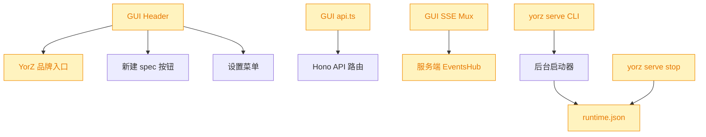
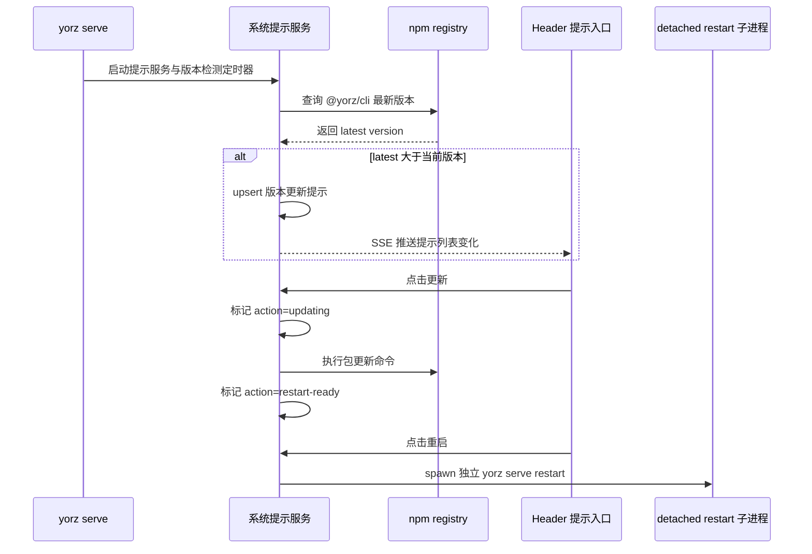
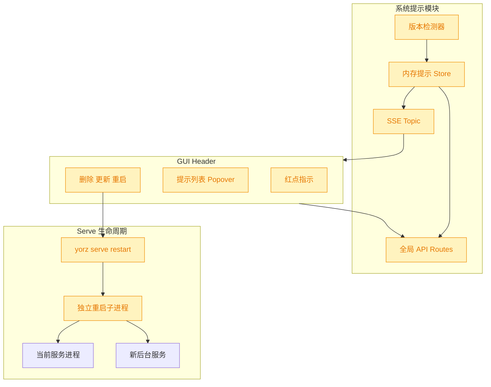
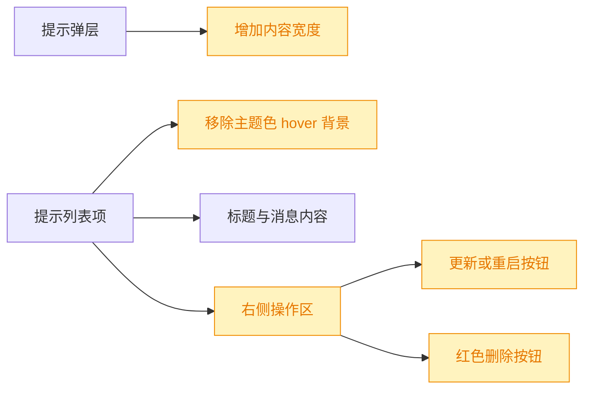
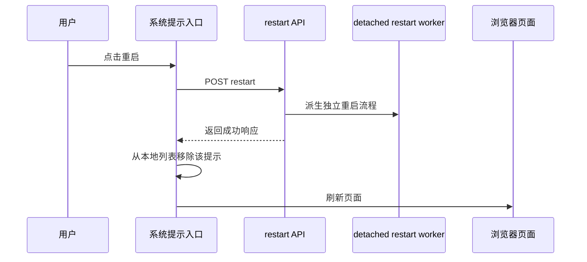

# 系统提示与版本更新提示

## 1. 背景

当前需求希望在 YorZ GUI 顶部显式承载系统级提示：当存在新系统提示时，在页面 Header 的 `YorZ` 品牌旁展示小红点；点击后展开提示列表；用户可删除列表项。

同时需要在 `yorz serve` 启动后执行版本检测，并每 12 小时检测一次。检测到新版本时，系统新增一条提示。用户点击提示内容中的“更新”按钮后按钮进入 loading 状态；更新完成后按钮变成“重启”；点击重启执行 `yorz serve restart` 命令。`restart` 命令必须有独立生命周期，避免被当前服务进程关闭流程中断。

## 2. 需求

类型：`feat`

原始需求：

```text
新增系统提示功能，如果存在新系统提示，在 页面 Header YorZ 旁边新增小红点，点击展开提示列表，用户可以直接删除提示列表项。

添加版本检测，如果检测到新版本（yorz serve 启动后，12小时检测一次），新增一条系统提示，用户可以点击提示内容中的“更新“按钮，变成 loading 状态；
更新完成之后， 按钮变成“重启“；
点击重启，执行 yorz serve restart 命令；注意 restart 命令需要独立声明周期，避免 restart 被中断。
```

## 3. 现状分析



当前 Header 的品牌文字在 `AppShell` 内直接渲染为 `YorZ` 链接，右侧已有新建 spec 与设置菜单；新增红点与提示弹层应贴近此组件实现，避免分散到页面级组件。

现有 GUI 已有统一 `api.ts` 请求封装与 `sse.ts` 多路复用订阅机制。服务端 API 使用 Hono routes 组合到 `/api`，系统提示可作为全局服务能力挂载，不应绑定到某个项目 ID；版本检测也属于当前服务实例级状态。

`yorz serve` 当前具备后台启动、runtime 记录、停止后台服务能力，但 `serve` 子命令尚未声明 `restart`。后台服务进程由 detached child 承载，停止逻辑会读取全局 `runtime.json` 并向记录的进程发信号；如果 GUI 直接让当前服务进程同步执行 stop/start，重启流程容易被当前进程退出打断。

追加 fix 取证显示，系统提示列表项、版本提示按钮和删除按钮均集中在 Header 提示入口组件内实现。当前列表项使用 `hover:bg-accent`，会在鼠标悬停时出现主题色背景；版本更新按钮位于消息下方，删除按钮位于右侧顶部；提示弹层宽度为 `w-80`，内容横向空间偏窄。该 fix 不涉及服务端状态、API、SSE 或 i18n 文案语义变更。

第二个追加 fix 取证显示，重启按钮触发 `api.restartSystemNotification(id)` 后仅清理 `busyId`，不会移除本地提示，也不会刷新页面。服务端 `SystemNotificationCenter.restart()` 在校验 `restart-ready` 后只派生 detached restart worker，并返回当前提示项；由于 restart worker 独立生命周期，HTTP 请求无法也不应该等待新服务完全启动后再回传“真正重启成功”。

<details>
<summary>精确层：相关现状定位</summary>

- `src/gui/src/AppShell.tsx:48` Header 容器；`src/gui/src/AppShell.tsx:49` 渲染 `YorZ` 品牌入口。
- `src/gui/src/lib/api.ts:64` 统一 `request<T>` 封装；适合补充系统提示 API 客户端方法与类型。
- `src/gui/src/lib/sse.ts:35` 单标签页 SSE mux；可增加全局 `system-notifications` topic 订阅。
- `src/service/server.ts:71` 开始挂载 API routes；适合新增全局系统提示 route。
- `src/service/routes/events.ts:19` topic 订阅入口；`src/service/events-hub.ts:127` 根据 topic 绑定推送源。
- `src/cli/serve.ts:95` `runServe`；`src/cli/serve.ts:226` `runStopServe`；`src/cli/index.ts` 中 `serve` 仅有 `stop` 子命令。
- `package.json` 暴露当前版本 `0.4.2`，可作为本地版本比较基准。
- `src/gui/src/components/SystemNotifications.tsx` 提示列表 UI；列表项 hover、弹层宽度、版本按钮位置和删除按钮颜色均在该文件内可控。
- `src/gui/src/components/SystemNotifications.tsx` 的 `restart(id)` 是重启成功响应后的前端收尾点；`src/service/system-notifications.ts` 的 `restart(id)` 保持 detached worker 触发语义。

</details>

## 4. 技术实现方案





### 4.1 系统提示数据与服务边界

新增服务端系统提示模块，作为进程内状态管理：提示至少包含 `id`、`kind`、`title`、`message`、`createdAt`、`updatedAt`、`action`、`metadata`。系统提示先采用内存 Store；需求只要求“存在新系统提示”和用户删除列表项，未要求跨服务重启持久化，因此避免引入新配置文件。版本更新提示通过固定 id 或 `kind=version-update` 做 upsert，避免每 12 小时重复堆叠。

新增全局 API：

- `GET /api/system-notifications`：返回当前提示列表。
- `DELETE /api/system-notifications/:id`：删除提示项。
- `POST /api/system-notifications/:id/update`：触发该提示对应的更新动作，仅版本更新提示允许。
- `POST /api/system-notifications/:id/restart`：触发该提示对应的重启动作，仅更新完成后的版本更新提示允许。

新增 SSE topic `system-notifications`，列表变化时向已订阅 Header 推送 `updated` 事件；Header 收到事件后重新拉取列表，沿用现有 SSE mux 模式。

### 4.2 GUI Header 交互

在 `AppShell` 的 `YorZ` 品牌旁新增一个轻量提示入口组件。存在提示时显示小红点；点击后用现有 `Popover`/`Button` 风格展示提示列表。列表项提供删除按钮；版本更新提示在内容区域展示“更新”按钮，点击后按钮文案进入 `common.loading` 或新增 i18n key 表示更新中；更新完成后按钮变为“重启”。

所有新增用户可见文案必须写入 `src/gui/src/i18n/zh-CN.ts` 与 `src/gui/src/i18n/en.ts`，组件只通过 `t(...)` 引用。删除、关闭、loading 可优先复用 `common` key；系统提示、更新、重启、新版本提示需新增 `systemNotifications` 命名空间。

### 4.3 版本检测与更新动作

在服务启动时创建版本检测器：启动后立即检测一次，然后 `setInterval` 每 12 小时检测一次；timer 需 `unref()`，服务关闭时由 `ServeHandle.close()` 清理。检测源使用 npm registry 的 `https://registry.npmjs.org/@yorz/cli/latest`，用 `package.json` 当前版本与 latest 做 semver 比较。项目当前未引入 `semver` 依赖，可实现小范围数字段比较，覆盖当前 `x.y.z` 包版本；无法解析或网络失败时只记录日志，不新增错误提示，避免干扰用户。

更新动作由服务端执行，按钮状态由提示 action 字段驱动：`idle -> updating -> restart-ready`，失败则回到可重试状态并在提示 message 或 metadata 中记录错误。更新命令建议使用当前运行环境下的包管理器无关路径：优先通过 `npm install -g @yorz/cli@latest` 执行；如果后续发现安装来源不是全局 npm，再在执行阶段通过代码取证调整为更适合当前 CLI 的自更新策略。

### 4.4 restart 独立生命周期

新增 `yorz serve restart` CLI 子命令，内部不依赖当前 HTTP 请求生命周期完成完整重启。GUI 调用 restart API 后，服务端只 spawn 一个 detached restart worker 并立即返回；worker 执行顺序为：等待短延迟让 HTTP 响应返回，调用已有停止逻辑终止当前后台服务，等待 runtime 清理后重新调用后台启动逻辑。该 worker 的 stdio 使用独立日志文件或现有后台 stdio 策略，且 `unref()`，确保当前服务进程收到 SIGTERM 后不会连带杀掉重启流程。

为避免递归重启，`serve restart` 可支持内部隐藏参数或环境变量区分 worker 模式；用户可见命令保持 `yorz serve restart`。API 端只负责触发命令，不直接串行执行 stop/start。

### 4.5 兼容性与影响范围

本变更新增能力，不改变现有 spec、session、command、project API 的语义。受影响范围主要是 Header 布局、全局 SSE topic、服务启动/关闭生命周期和 CLI serve 子命令；`stop` 逻辑可复用但需要暴露给 restart worker 组合使用。风险点集中在更新命令失败处理、版本比较边界，以及 restart 子进程是否真正脱离当前服务进程生命周期。

### 4.6 验证策略

服务端测试覆盖：系统提示 CRUD、版本检测 upsert、版本检测定时器启动/关闭、更新动作状态流转、restart API 只派生 detached worker。CLI 测试覆盖：`serve restart` 子命令存在、restart worker 参数构造、worker 复用 stop/start 顺序且不会被当前进程同步等待。GUI 测试覆盖：有提示时品牌旁出现红点、点击展开列表、删除项调用 API、版本提示按钮从更新中变为重启。

### 4.7 追加 fix：提示列表视觉调整



本次追加 fix 只调整 `SystemNotifications` 组件的布局 class。提示弹层宽度从窄面板扩展到更适合版本提示文案的宽度；列表项保持无主题色 hover 背景；版本更新/重启按钮改为无色 ghost 风格，hover 时使用主题色反馈，并与删除按钮并排放在内容右侧。删除按钮保持 icon-only，使用 `text-destructive` 和 destructive hover 色，操作区整体用 `items-center` 保证垂直居中。

该方案保留现有 i18n key、API 调用和忙碌态逻辑，仅改变视觉布局，不需要新增待确认项。

### 4.8 追加 fix：重启后移除提示并刷新页面



本次追加 fix 不改变服务端 restart 的 detached 设计。前端将 `restart(id)` 的成功响应视为“重启流程已成功触发”：先从当前 `items` signal 中过滤掉该提示，避免刷新前仍看到旧版本提醒；随后调用 `window.location.reload()` 重新加载页面。若 restart API 抛错，则保留原提示和按钮状态，沿用现有错误路径，不新增用户可见文案。

该行为只适用于用户点击版本更新提示的“重启”按钮；普通删除仍继续调用 delete API，版本检查与更新状态流转不受影响。

## 5. 待确认项

_暂无_

## 6. 任务清单

- [x] 新增服务端系统提示 Store、API route 与 SSE topic（验收：服务端测试可创建/列出/删除提示并收到列表更新事件）
- [x] 新增版本检测器并在 serve 启动/关闭中接入 12 小时检测生命周期（验收：测试可注入 latest 版本并 upsert 单条版本更新提示，close 后 timer 清理）
- [x] 新增版本更新动作状态流转 API（验收：测试覆盖 idle、updating、restart-ready、失败可重试状态）
- [x] 新增 `yorz serve restart` 独立生命周期命令与 restart worker（验收：CLI 测试覆盖参数构造、detached 派生和 stop/start 编排不依赖当前服务进程存活）
- [x] 新增 GUI Header 系统提示入口、红点、列表删除、更新/重启按钮状态（验收：组件或 e2e 测试验证有提示显示红点、点击展开、删除/更新/restart 调用 API）
- [x] 新增系统提示相关 i18n 文案（验收：新增用户可见文案均来自 `src/gui/src/i18n/`）
- [x] 运行类型检查与相关测试并更新执行记录（验收：`pnpm run typecheck` 与相关 vitest 通过，若环境不可执行需记录原因）
- [x] 调整系统提示列表项视觉与操作区布局（验收：列表项无主题色 hover 背景，更新/重启按钮与红色删除按钮并排位于内容右侧且垂直居中，提示内容宽度增加）
- [x] 调整版本更新提示重启成功后的前端收尾行为（验收：restart API 成功后本地提示项被移除并触发页面刷新；restart API 失败时提示项保留）

## 7. 追加任务

- [fixed] [fix] 2026-08-03 17:18:16 | 1. 系统提示列表项不需要，鼠标hover时的主题色背景
  - 描述：1. 系统提示列表项不需要，鼠标hover时的主题色背景

2. 更新提示：更新按钮使用无色，hover时主题色；更新按钮跟删除按钮并排显示在内容右侧；增加内容宽度
3. 删除icon应该是红色，垂直方向居中对齐

- [fixed] [fix] 2026-08-03 17:27:02 | 新版本提醒提示，重启成功之后应该删除提示项，刷新页面
  - 描述：新版本提醒提示，重启成功之后应该删除提示项，刷新页面

## 8. 执行记录

- 2026-08-03 16:21:50：新建 spec，并完成 plan 阶段现状分析与技术实现方案。
- 2026-08-03 16:23:39：完成 tasks 阶段拆解，因无待确认项进入 execute。
- 2026-08-03 16:27:28：完成系统提示 Store、全局 API、SSE topic、版本检测、更新动作、`yorz serve restart` 独立 worker、Header 提示入口与 i18n 文案实现。
- 2026-08-03 16:27:28：验证通过：`pnpm run typecheck`、`pnpm vitest run src/service/__tests__/system-notifications.test.ts src/cli/__tests__/serve.test.ts`、`pnpm test`。
- 2026-08-03 16:27:28：全部非 manual 任务已完成，无待确认项，标记 done。
- 2026-08-03 17:21:04：完成追加 fix：系统提示列表项移除主题色 hover 背景，弹层宽度增加，更新/重启按钮改为无色并与红色删除按钮并排居中。
- 2026-08-03 17:21:04：验证通过：`pnpm run typecheck`、`pnpm vitest run src/service/__tests__/system-notifications.test.ts src/cli/__tests__/serve.test.ts`。
- 2026-08-03 17:21:04：追加任务已标记 fixed，全部非 manual 任务已完成，无待确认项，标记 done。
- 2026-08-03 17:28:53：完成追加 fix：版本更新提示点击重启且 restart API 成功后，前端先移除该提示项再刷新页面；失败时保留提示项。
- 2026-08-03 17:28:53：验证通过：`pnpm run typecheck`、`pnpm vitest run src/service/__tests__/system-notifications.test.ts src/cli/__tests__/serve.test.ts`。
- 2026-08-03 17:28:53：追加任务已标记 fixed，全部非 manual 任务已完成，无待确认项，标记 done。
