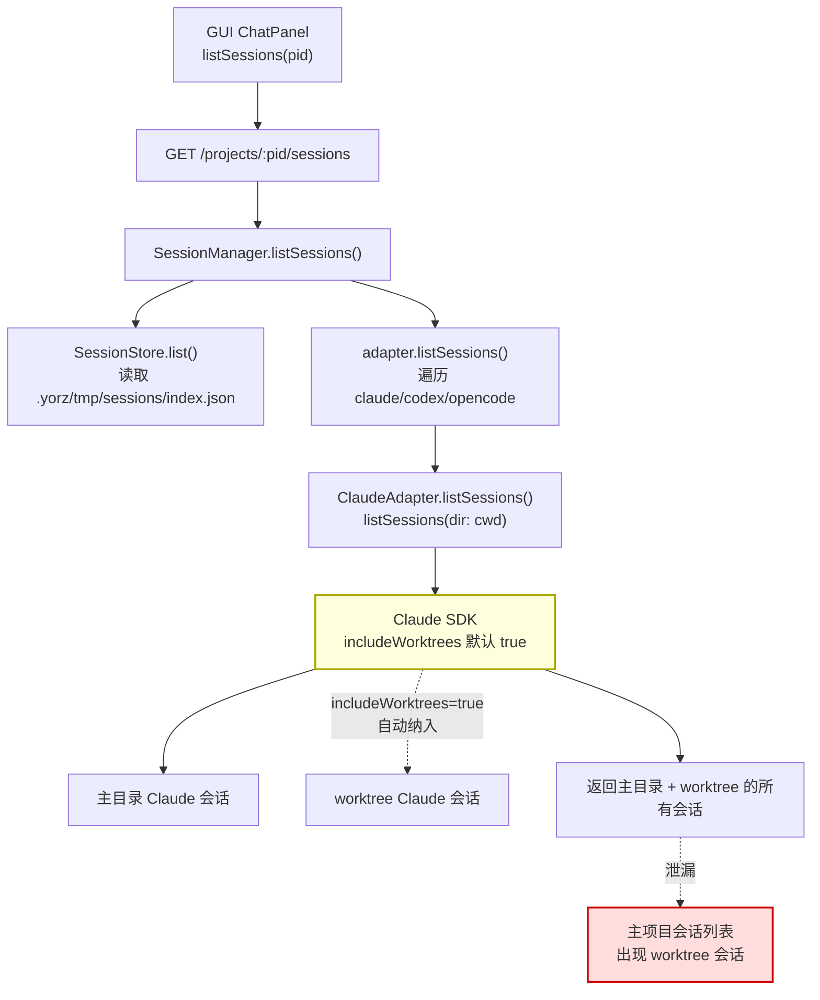
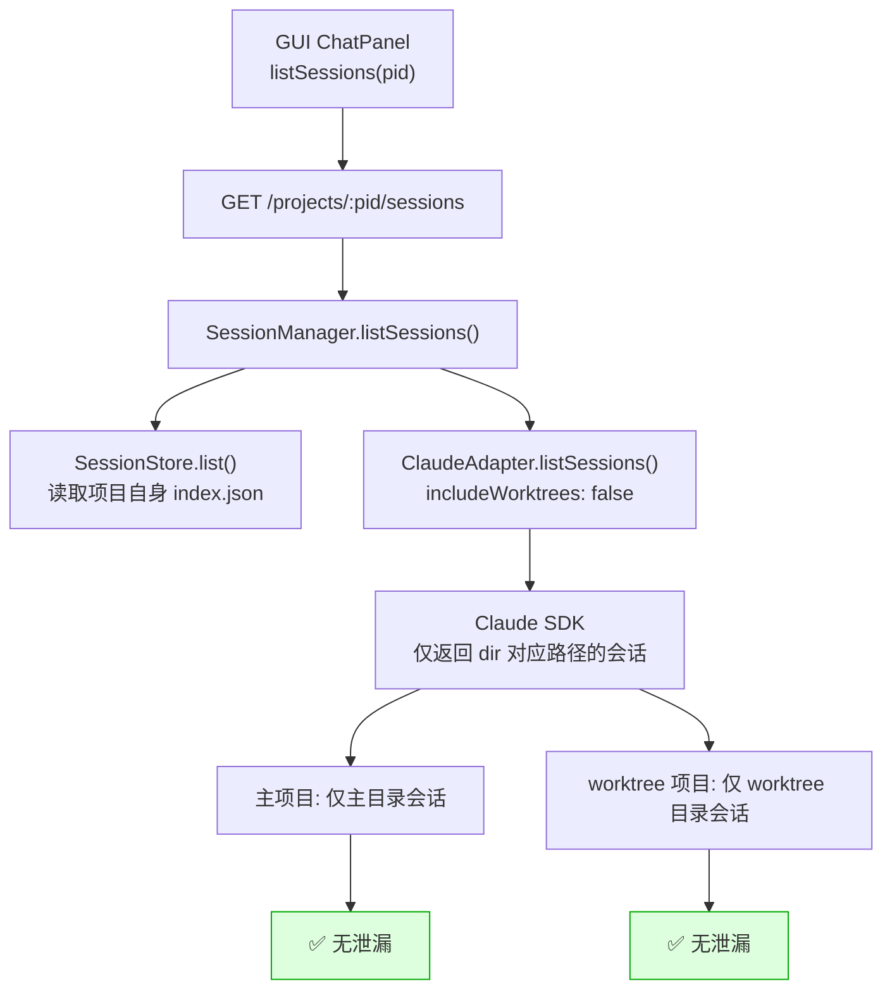
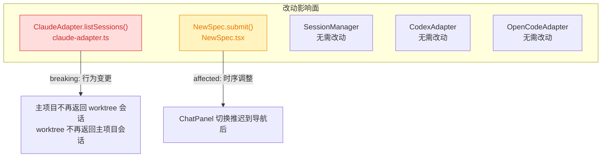

# 260804.fix.worktree-session-pollution

## 1. 背景

用户在 yorz 中新建 spec 时选择了「新开项目并行」（worktree）选项，系统自动创建了 `wt__yorz-add` worktree。处理过程中用户发现主目录的会话列表中出现了一条与 worktree 中会话内容一致的条目，疑虑工作是否污染了主目录。

经排查确认：**实际工作（spec 文件、agent 进程、会话存储）均在 worktree 中执行，未污染主目录**。问题出在会话列表的 **展示层**：Claude Agent SDK 的 `listSessions({ dir })` 函数有 `includeWorktrees` 选项，默认为 `true`，当 `dir` 指向主仓库目录时会自动包含所有 git worktree 路径下的会话，导致 worktree 会话泄漏到主项目的会话列表。

## 2. 需求

修复 worktree 会话泄漏到主项目会话列表的问题，确保每个项目（含 worktree 项目）的会话列表只展示属于该项目目录的会话。

## 3. 现状分析

### 3.1 会话存储架构

会话在两个层面存储：

| 层级       | 存储位置                                     | 隔离情况                                      |
| ---------- | -------------------------------------------- | --------------------------------------------- |
| YorZ 索引  | `<projectDir>/.yorz/tmp/sessions/index.json` | ✅ 主目录与 worktree 各自独立，无交叉         |
| Claude SDK | `~/.claude/projects/<encoded-path>/`         | ✅ 主目录与 worktree 各自独立（路径编码不同） |

实测数据：

- 主目录 `.yorz/tmp/sessions/index.json`：13 条会话，0 条与 worktree 重复
- Worktree `.yorz/tmp/sessions/index.json`：2 条会话，0 条与主目录重复
- `~/.claude/projects/-vol1-1000-projects-yorz-demo/`：主目录 Claude 会话文件
- `~/.claude/projects/-vol1-1000-projects-yorz-demo-wt-wt--yorz-add/`：worktree Claude 会话文件

**结论：底层存储完全隔离，问题仅在列表查询层。**

### 3.2 会话列表查询链路



### 3.3 根因定位

`claude-adapter.ts` 第 147 行调用 SDK `listSessions` 时未传 `includeWorktrees: false`，SDK 默认 `true`。

<details>
<summary>SDK ListSessionsOptions 类型声明（精确层）</summary>

```typescript
// @anthropic-ai/claude-agent-sdk sdk.d.ts
export declare type ListSessionsOptions = {
  /** Directory to list sessions for. */
  dir?: string
  /**
   * When `dir` is provided and the directory is inside a git repository,
   * include sessions from all git worktree paths. Defaults to `true`.
   */
  includeWorktrees?: boolean
  // ... limit, offset, etc.
}
```

```typescript
// src/service/agent-sdk/claude-adapter.ts:146
async listSessions(): Promise<SessionInfo[]> {
  const infos = await listSessions({ dir: this.cwd })
  // includeWorktrees 未传，SDK 默认 true -> 聚合 worktree 会话
  return infos.map(...)
}
```

</details>

SDK 在 `dir` 指向 git 仓库目录时，会自动发现所有 `git worktree list` 中的 worktree 路径，并将其下的 Claude 会话一并返回。主项目调用 `listSessions({ dir: mainDir })` 时，SDK 返回了主目录 + worktree 目录的所有会话，`SessionManager.listSessions()` 将 SDK 返回的会话与索引合并后返回给 GUI，导致 worktree 会话出现在主项目的会话列表中。

### 3.4 各适配器对比

| 适配器          | listSessions 实现                                                          | 是否受影响 |
| --------------- | -------------------------------------------------------------------------- | ---------- |
| ClaudeAdapter   | 调用 SDK `listSessions({ dir })`，`includeWorktrees` 默认 `true`           | 🔴 是      |
| CodexAdapter    | 遍历 `~/.codex/sessions`，严格匹配 `meta.cwd !== this.cwd` 过滤            | ✅ 否      |
| OpenCodeAdapter | 调用 `client.session.list({ query: { directory: this.cwd } })`，服务端过滤 | ✅ 否      |

### 3.5 用户观察到的现象解释

1. **会话列表出现 worktree 会话**：`listSessions({ dir: mainDir })` 因 `includeWorktrees: true` 返回了 worktree 的会话。
2. **点进去内容一致**：`getSessionMessages(sessionId, { dir: mainDir })` 按 sessionId 全局查找，SDK 能跨 worktree 路径找到会话文件并返回内容。
3. **实际工作未污染**：agent 进程的 cwd、spec 文件、`.yorz/tmp/sessions/index.json` 均在 worktree 目录，主目录无任何工作产物残留。

## 4. 技术实现方案

### 4.1 核心修复：Claude adapter 传入 `includeWorktrees: false`

**文件**：`src/service/agent-sdk/claude-adapter.ts`

在 `listSessions()` 调用中显式传入 `includeWorktrees: false`，关闭 SDK 的 worktree 会话聚合行为。

**决策说明**：YorZ 的项目管理模型已经将 worktree 注册为独立项目（有独立 `projectId`、独立 `SessionManager`、独立 `cwd`）。worktree 项目的会话由其自身的 `SessionManager` 负责列表，不需要主项目的 `listSessions` 代为聚合。SDK 的 `includeWorktrees: true` 默认行为适用于「单一目录视图」的 IDE 场景，与 YorZ 的多项目管理模型冲突。

被否决的备选：在 `SessionManager.listSessions()` 层过滤 worktree 会话--这需要在 YorZ 侧维护 worktree 路径列表并逐条比对 sessionId 的来源路径，复杂且脆弱；直接在 adapter 层关闭 SDK 的聚合行为更干净。

修复后链路：



<details>
<summary>claude-adapter.ts 改动精确 diff</summary>

文件：`src/service/agent-sdk/claude-adapter.ts` 第 146–157 行

```diff
   async listSessions(): Promise<SessionInfo[]> {
-    const infos = await listSessions({ dir: this.cwd })
+    const infos = await listSessions({ dir: this.cwd, includeWorktrees: false })
     return infos.map((s) => ({
```

</details>

### 4.2 `getSessionMessages` 无需改动

`getSessionMessages(id, { dir: this.cwd })` 按 sessionId 查找会话文件。修复 4.1 后 worktree 会话不再出现在主项目列表中，用户无法从列表点击进入，因此不会触发跨项目 `getMessages` 调用。`requestChatSession` 的时序问题（见 4.3）修复后也不会产生此路径。

### 4.3 次要修复：`requestChatSession` 时序问题

**文件**：`src/gui/src/pages/NewSpec.tsx`

**现状**：`submit()` 在 worktree 模式下先调用 `api.createWorktree()` 获得 worktree `pid`，再调用 `api.createSpec(pid, body)` 获得 sessionId，随后立即调用 `requestChatSession(resp.sessionId)`。但此时用户尚未导航到 worktree 项目页面，ChatPanel 仍绑定主项目，会尝试用主项目 ID 加载 worktree session 的消息。

**改动**：将 `requestChatSession` 调用推迟到导航完成后。在 `pollForNewSpec` 成功导航时再触发 `requestChatSession`。

<details>
<summary>NewSpec.tsx 改动伪代码</summary>

```typescript
// submit() 中：不再立即调用 requestChatSession
let pendingSessionId = ''

// 原：requestChatSession(resp.sessionId)
// 改：pendingSessionId = resp.sessionId

// pollForNewSpec() 中导航成功后：
if (fresh) {
  navigated = true
  navigate(target)
  if (pendingSessionId) {
    requestChatSession(pendingSessionId)
    pendingSessionId = ''
  }
}
```

</details>

**影响**：🟡 affected - 仅影响 worktree 新建 spec 时的 ChatPanel 切换时序，不影响功能正确性。

### 4.4 影响面与兼容性



### 4.5 验证方案

1. 在主项目会话列表中确认不再出现 worktree 的会话
2. 在 worktree 项目会话列表中确认仍能正常列出 worktree 自身的会话
3. 新建 worktree spec 时确认 ChatPanel 不会在主项目视图下短暂显示 worktree 会话内容
4. 确认非 worktree 场景的会话列表不受影响

## 5. 待确认项

_暂无_

## 6. 任务清单

- [x] 在 `src/service/agent-sdk/claude-adapter.ts` 的 `listSessions()` 中添加 `includeWorktrees: false` 参数（验收：grep 确认改动，tsc --noEmit 通过）
- [x] 在 `src/gui/src/pages/NewSpec.tsx` 中将 `requestChatSession` 调用从 `submit()` 推迟到 `pollForNewSpec` 导航成功后（验收：grep 确认 requestChatSession 不再在 submit 中直接调用）
- [x] 运行构建验证无编译错误（验收：nr build 或 tsc --noEmit 通过）

## 7. 执行记录

- **claude-adapter.ts**：在 `listSessions()` 中将 `listSessions({ dir: this.cwd })` 改为 `listSessions({ dir: this.cwd, includeWorktrees: false })`。验证：grep 确认 `includeWorktrees: false` 存在于第 147 行。
- **NewSpec.tsx**：新增 `pendingSessionId` 变量（第 40 行），将 `submit()` 中的 `requestChatSession(resp.sessionId)` 改为 `pendingSessionId = resp.sessionId`（第 113 行），在 `pollForNewSpec` 导航成功后调用 `requestChatSession(pendingSessionId)` 并清空（第 65–67 行）。验证：grep 确认 `requestChatSession` 不再在 `submit()` 中直接调用。
- **构建验证**：`tsc -b` 通过，exit code 0，无编译错误。
- 收尾：全部任务完成，无待确认项、无批注、无追加任务，标记 done。
