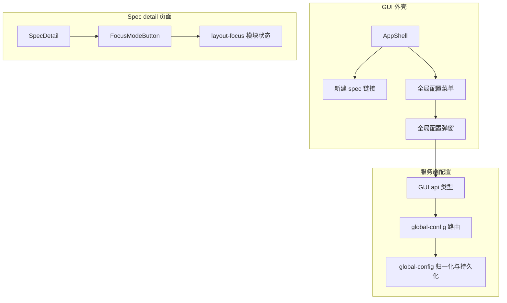
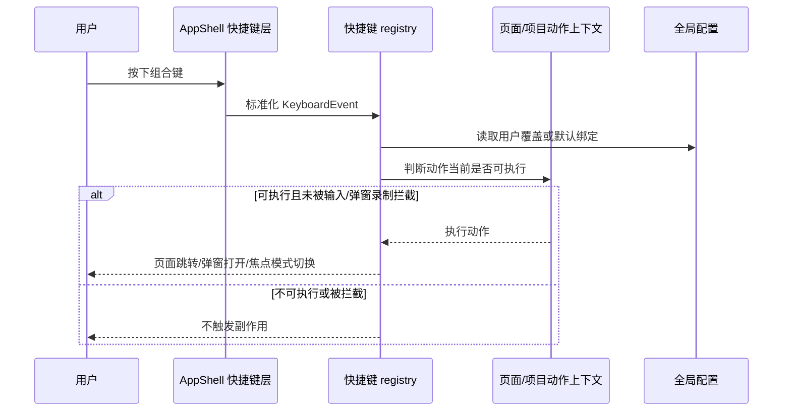
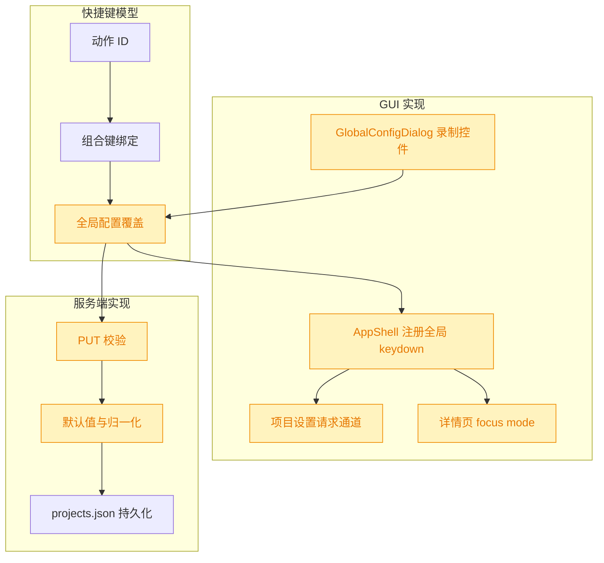

# 快捷键模块

## 1. 背景

类型：feat

原始需求：

> 新增快捷键模块，给高频操作内置快捷键：
>
> - 新建 spec： ctrl-shift-N
> - spec detail 页面的最大化功能：ctrl-shift-f
> - 项目设置：ctrl-shift-s
>   全局配置弹窗中新增快捷键配置展示及支持重新录制替代内置默认快捷键 @src/gui/src/AppShell.tsx

## 2. 需求

新增一套可持久化的快捷键配置能力：

- 内置三个高频操作默认快捷键：新建 spec、spec detail 页面的最大化/退出最大化、项目设置。
- 快捷键应在应用层统一注册，避免散落在页面组件中。
- 全局配置弹窗新增快捷键配置区，展示当前绑定，并支持重新录制以覆盖默认快捷键。
- 展示给用户的新增文案必须通过 `src/gui/src/i18n/` 配置。

## 3. 现状分析

当前 GUI 顶层外壳负责三类入口中的两类：`AppShell` 顶栏通过 `<A>` 提供“新建 spec”入口，通过下拉菜单打开全局配置弹窗；`SpecDetail` 页面通过 `FocusModeButton` 调用 `layout-focus` 中的 `toggleFocusMode()` 实现详情页最大化。项目设置入口在 `ProjectsSidebar` 中按项目项打开 `ProjectConfigDialog`，当前没有可跨组件触发“当前项目设置”的公共请求通道。

全局配置链路已经存在：`src/service/global-config.ts` 定义 `GlobalConfig`、默认值与归一化；`src/service/routes/global-config.ts` 暴露 `/api/global-config` GET/PUT；`src/gui/src/lib/api.ts` 定义 GUI 侧 `GlobalConfig` 类型与请求；`src/gui/src/components/GlobalConfigDialog.tsx` 在打开时加载配置并在保存时整体 PUT。现有配置只包含默认 Agent 与 session end 通知。

快捷键相关现状是局部的：`layout-focus.ts` 只处理 focus mode 下的 `Escape` 退出；`AppendTaskDialog`、`MentionTextarea`、`mermaid.ts` 等模块各自处理特定输入场景。仓库中没有统一的快捷键注册、序列化、冲突处理或录制组件。

精确层：关键文件与职责

- `src/gui/src/AppShell.tsx`：顶栏“新建 spec”与全局配置菜单；适合作为全局快捷键注册入口。
- `src/gui/src/pages/SpecDetail.tsx`：详情页容器，已调用 `useFocusModePage()`；可在页面挂载期间声明 spec detail 最大化动作可用。
- `src/gui/src/components/FocusModeButton.tsx`：按钮调用 `toggleFocusMode()`，快捷键应复用同一状态模块而不是模拟点击。
- `src/gui/src/lib/layout-focus.ts`：持有 `focusMode`、`toggleFocusMode()`、`exitFocusMode()`，也是详情页最大化动作的核心 API。
- `src/gui/src/components/ProjectsSidebar.tsx`：项目列表项中的项目设置入口目前是组件局部 state，需要新增跨组件触发方式。
- `src/gui/src/components/GlobalConfigDialog.tsx`：全局配置弹窗，新增快捷键展示/录制 UI 的主落点。
- `src/service/global-config.ts` 与 `src/service/routes/global-config.ts`：全局配置持久化与 API 校验需要扩展快捷键字段，保持旧配置兼容。
- `src/gui/src/i18n/zh-CN.ts`、`src/gui/src/i18n/en.ts`：新增所有用户可见文案。

## 4. 技术实现方案

整体采用“默认快捷键 + 全局配置覆盖 + 运行时注册”的方案。快捷键模块放在 GUI lib 层，定义稳定动作 ID、默认组合键、组合键标准化、格式化展示、冲突检测和输入场景拦截规则；服务端只负责存储和校验配置，不参与执行动作。

动作 ID 建议定义为三项稳定枚举：`newSpec`、`toggleSpecDetailFullscreen`、`projectSettings`。默认绑定分别为 `Ctrl+Shift+N`、`Ctrl+Shift+F`、`Ctrl+Shift+S`。标准化时同时兼容 `event.ctrlKey`，不把 `metaKey` 自动等同为 Ctrl，避免需求指定的 Ctrl 组合键在 macOS 上被隐式改义；后续如需 Cmd 支持可通过用户录制覆盖。

AppShell 负责加载全局配置并注册唯一的 `window keydown` 监听。监听执行前应跳过以下场景：事件已 `defaultPrevented`、录制模式正在捕获快捷键、焦点位于可编辑输入控件、组合键不完整或未命中配置。命中后通过动作上下文执行：新建 spec 使用现有 `projectHref('specs/new')` 路由逻辑；项目设置通过新增的项目设置请求通道通知 `ProjectsSidebar` 打开当前项目的 `ProjectConfigDialog`；spec detail 最大化只在详情页声明动作可用时调用 `toggleFocusMode()`，其它页面命中该快捷键不执行。

全局配置弹窗新增“快捷键”区块。每行展示动作名称、当前组合键、默认值标识或重置按钮、录制按钮。点击录制后捕获下一次有效组合键，保存到弹窗本地草稿；保存弹窗时随其它全局配置一起 PUT。录制应拒绝单独修饰键、`Escape` 取消录制、`Backspace/Delete` 可清空覆盖并回退默认，重复绑定要在弹窗内展示错误并禁止保存。

服务端扩展 `GlobalConfig` 为 `shortcuts` 字段，结构保持扁平，便于兼容和校验，例如以动作 ID 为 key、值为标准化 binding 字符串或 null。`loadGlobalConfig()` 对旧配置补默认空覆盖；`saveGlobalConfig()` 写入归一化后的字段；`PUT /api/global-config` 校验只接受已知动作 ID 和合法 binding，防止脏数据进入持久化文件。GUI `api.ts` 同步类型。

验证策略分三层：服务端单元测试覆盖默认值、旧配置兼容、PUT 校验与 roundtrip；GUI lib 单元测试覆盖组合键标准化、格式化、冲突检测和可编辑元素拦截；E2E 覆盖默认快捷键可打开新建 spec、在 spec detail 中切换最大化、`Ctrl+Shift+S` 打开当前项目配置，以及在全局配置弹窗重新录制后新绑定生效。

精确层：实现落点

- 新增 `src/gui/src/lib/shortcuts.ts`：动作 ID、默认绑定、标准化、格式化、冲突检测、可编辑元素判断。
- 可选新增 `src/gui/src/lib/shortcut-actions.ts` 或在现有模块扩展信号：保存当前页面可用动作与项目设置打开请求，避免 AppShell 直接依赖深层组件状态。
- 修改 `src/gui/src/AppShell.tsx`：加载全局配置、注册 keydown、执行新建 spec/项目设置/详情页最大化动作；把配置传递给 `GlobalConfigDialog` 或让弹窗继续自行加载但保存后通知 AppShell 刷新。
- 修改 `src/gui/src/components/GlobalConfigDialog.tsx`：新增快捷键配置展示、录制、冲突校验和保存字段。
- 修改 `src/gui/src/pages/SpecDetail.tsx` 或 `layout-focus.ts`：在详情页挂载期间注册 `toggleSpecDetailFullscreen` 动作可用，离开页面清理。
- 修改 `src/gui/src/components/ProjectsSidebar.tsx`：监听“打开当前项目设置”请求并打开对应项目的 `ProjectConfigDialog`。
- 修改 `src/gui/src/lib/api.ts`、`src/service/global-config.ts`、`src/service/routes/global-config.ts`：扩展 `GlobalConfig.shortcuts` 类型、默认值、归一化、API 响应和 PUT 校验。
- 修改 `src/gui/src/i18n/zh-CN.ts`、`src/gui/src/i18n/en.ts`：补齐快捷键区块、动作名、录制状态、错误提示、重置等文案。
- 新增/更新测试：`src/service/__tests__/global-config.test.ts`、`src/service/__tests__/service.test.ts`、`src/gui/src/lib/__tests__/shortcuts.test.ts`、`src/gui/src/__e2e__/shortcut-config.spec.ts`。

### 4.1 决策说明

采用服务端持久化而非 `localStorage`：全局配置弹窗已有服务端配置模型和保存入口，快捷键属于跨项目全局偏好，应与现有 `projects.json` 同源持久化。

采用 AppShell 单点监听而非各页面分别监听：三个动作中两个是全局外壳能力，一个是页面能力；单点监听可以统一输入框拦截、录制冲突与默认绑定，页面只声明动作可用性。

采用 binding 字符串作为配置存储而非完整 KeyboardEvent 字段对象：需求规模只有组合键配置，字符串更利于展示、校验、JSON diff 和手工修复；运行时可解析为结构后比对。

## 5. 待确认项

_暂无_

## 6. 任务清单

- [x] 扩展服务端全局配置快捷键字段与 API 校验（验收：global-config/service 相关测试覆盖默认值、旧配置兼容、PUT roundtrip 与非法 binding 拒绝）
- [x] 新增 GUI 快捷键模型与动作请求通道（验收：快捷键标准化、格式化、冲突检测、输入场景拦截有单元测试）
- [x] 在 AppShell、SpecDetail、ProjectsSidebar 串联默认快捷键动作（验收：Ctrl+Shift+N 打开新建 spec、Ctrl+Shift+F 仅在 spec detail 切换最大化、Ctrl+Shift+S 打开当前项目设置）
- [x] 在全局配置弹窗新增快捷键展示与录制覆盖（验收：新增文案走 i18n，重复绑定阻止保存，录制/重置后的配置随全局配置保存）
- [x] 补充并运行验证（验收：typecheck、相关 vitest 与快捷键 e2e 通过或记录环境阻塞）

## 7. 执行记录

- 2026-08-05 19:53:28：新建 spec 并完成 plan 阶段现状分析、技术实现方案、图形化补充与待确认项自检。
- 2026-08-05 19:54:59：生成 execute 阶段任务清单，待开始代码实现。
- 2026-08-05 20:03:56：扩展全局配置 `shortcuts` 字段、默认值、归一化与 `/api/global-config` 校验；验证 `src/service/__tests__/global-config.test.ts`、`src/service/__tests__/service.test.ts` 通过。
- 2026-08-05 20:03:56：新增 GUI 快捷键模型 `src/gui/src/lib/shortcuts.ts` 与动作通道 `src/gui/src/lib/shortcut-actions.ts`；验证 `src/gui/src/lib/__tests__/shortcuts.test.ts` 通过。
- 2026-08-05 20:03:56：在 `AppShell` 注册全局快捷键，在 `SpecDetail` 注册详情页最大化动作，在 `ProjectsSidebar` 响应项目设置请求；新增 E2E 覆盖三条默认快捷键。
- 2026-08-05 20:03:56：全局配置弹窗新增快捷键展示、录制、重置与重复绑定阻止保存；新增文案已写入 `src/gui/src/i18n/zh-CN.ts` 与 `src/gui/src/i18n/en.ts`。
- 2026-08-05 20:03:56：验证通过：`pnpm run typecheck`、`pnpm vitest run src/service/__tests__/global-config.test.ts src/service/__tests__/service.test.ts src/gui/src/lib/__tests__/shortcuts.test.ts`、`pnpm run build`、`pnpm playwright test src/gui/src/__e2e__/shortcut-config.spec.ts`。
- 2026-08-05 20:03:56：任务全部完成，标记 done。
