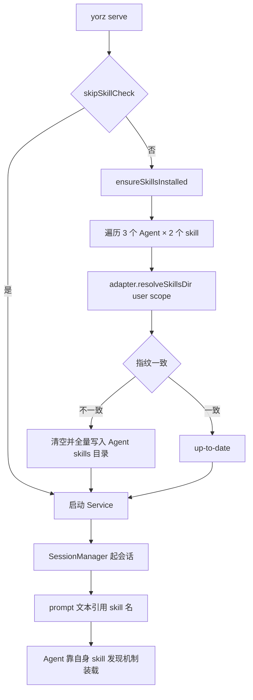
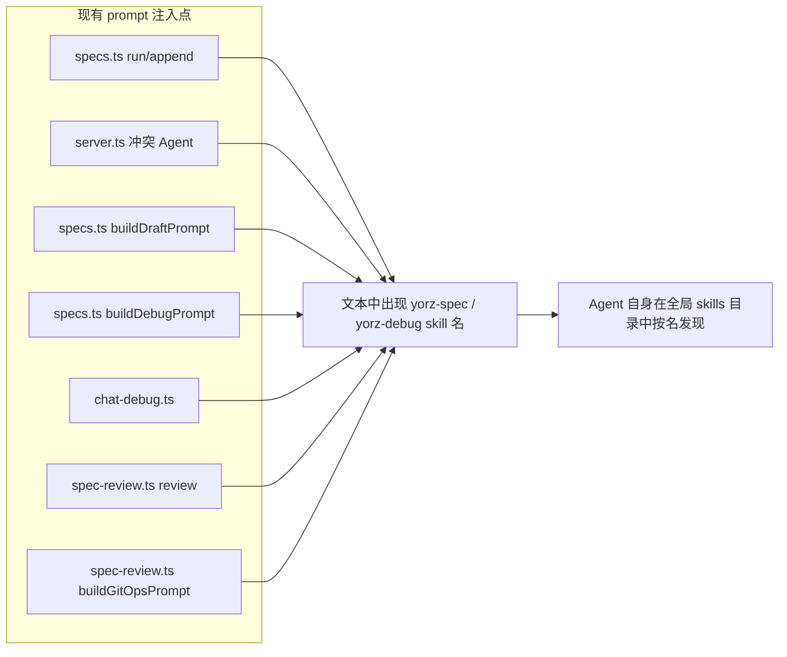
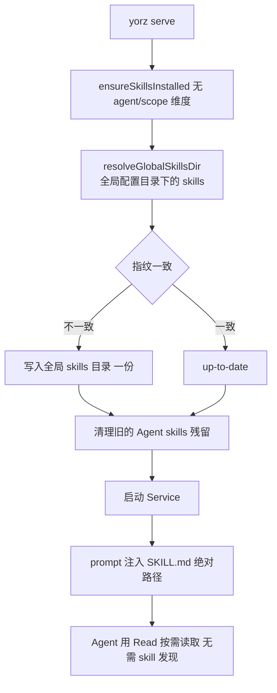
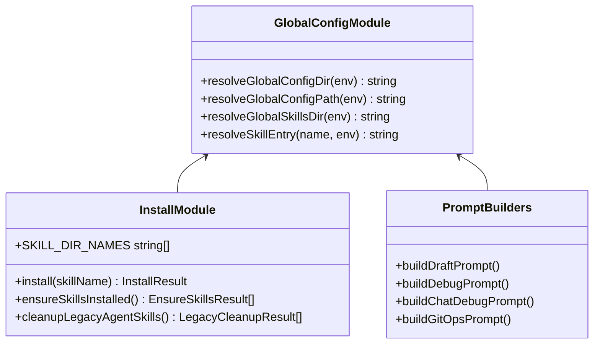
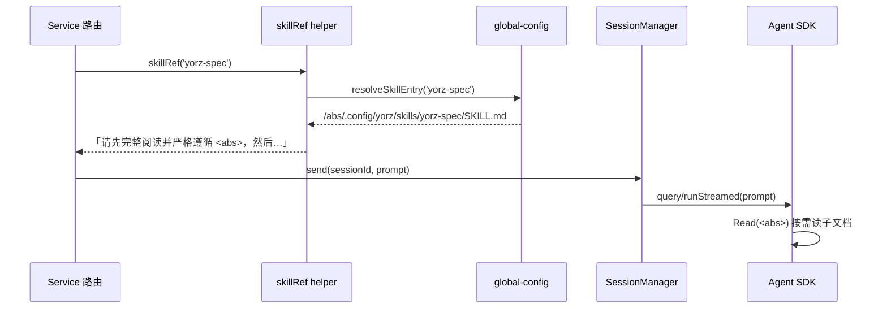
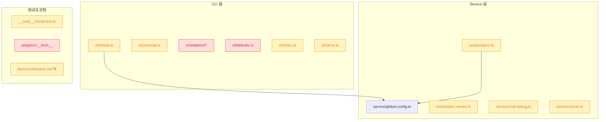

# Spec: 内置 skills 改为 yorz 全局目录共享安装

## 1. 背景

当前 `yorz serve` 启动时会把内置 skills（`yorz-spec` / `yorz-debug`）全量写入三个 Agent 的 **user scope** skills 目录：

- `~/.claude/skills/`
- `~/.config/opencode/skills/`
- `~/.codex/skills/`

这会污染用户各 Agent 的全局 skill 空间：用户即使不使用 YorZ，打开任意项目的 Claude Code / OpenCode / Codex 会话，都会看到 `yorz-spec` / `yorz-debug` 出现在 skill 列表里，占用上下文预算并干扰模型的 skill 选择。

前置调研已确认三家 SDK 的 skill 加载能力差异：Claude Agent SDK 支持 `plugins` + `skills` 参数在会话级加载（方案 A）；OpenCode 只有 `instructions` 这类无条件注入；Codex 的 `ThreadOptions` 完全没有 skill 相关入口，其 skill 只从 `$CODEX_HOME/skills` 发现。因此**跨三家统一**的唯一低成本路径是方案 B。

## 2. 需求

采用**方案 B**：不再向任何 Agent 的 skills 目录安装内置 skills，改为：

1. 内置 skills 安装到 **yorz 全局配置目录** `~/.config/yorz/skills/`（遵循既有的 `YORZ_HOME` / `XDG_CONFIG_HOME` 解析规则），**所有 yorz 项目共享同一份**，不落在任何 `<cwd>` 下。
2. Service 构造 prompt 时，把 skill 名替换为**绝对路径引用**，让 Agent 用 Read 工具按需读取 `SKILL.md`。
3. 三家 Agent（claude / opencode / codex）行为一致，不依赖任何 SDK 的 skill 发现能力。

## 3. 现状分析

### 3.1 当前安装链路

`yorz serve` 在 `runServe` 开头做 skill 检查，按 `AUTO_INSTALL_AGENTS × SKILL_DIR_NAMES` 笛卡尔积逐一比对 SHA-256 指纹并写盘。



<details>
<summary>关键代码位置（精确层）</summary>

- `src/cli/serve.ts:103-105` —— `runServe` 中 `if (!opts.skipSkillCheck) await ensureSkillsInstalledWithLog(...)`
- `src/cli/serve.ts:248-259` —— `ensureSkillsInstalledWithLog`，打印 `[skill][<agent>] <skill> installed/updated/is up to date`
- `src/cli/install.ts:16` —— `SKILL_DIR_NAMES = ['yorz-spec', 'yorz-debug']`
- `src/cli/install.ts:19` —— `AUTO_INSTALL_AGENTS = ['claude', 'opencode', 'codex']`
- `src/cli/install.ts:24-28` —— `import.meta.glob('../skill/**/*.{md,json}', { eager: true, query: '?raw' })`，构建期内联进 CLI bundle
- `src/cli/install.ts:71-103` —— `install()`：`rm -rf <baseDir>/<skill>` → `mkdir` → 逐文件 `writeFile`，并调 `ensureTmpIgnored(cwd)`
- `src/cli/install.ts:168-193` —— `ensureSkillsInstalled()`，`scope` 硬编码 `'user'`
- `src/cli/uninstall.ts:21-36` —— `uninstall()`
- `src/cli/adapters/claude.ts:6-9` / `codex.ts:6-9` / `opencode.ts:6-9` —— 三个 `resolveSkillsDir`
- `src/cli/index.ts:45-67` —— `yorz uninstall skills --agent --scope`
- `src/service/global-config.ts:52-57` —— `resolveGlobalConfigDir()`（`YORZ_HOME` > `XDG_CONFIG_HOME` > `~/.config`，末级固定 `yorz`）

</details>

### 3.2 skill 的实际调用方式

skill 从来不是通过 SDK 参数装载的，三个 agent-sdk adapter 传给 SDK 的 options 里没有任何 skill 字段（`claude-adapter.ts:67-74`、`codex-adapter.ts:23-30`、`opencode-adapter.ts:39-43`）。真正的"调用"发生在 Service 拼装的**自然语言 prompt 文本**里。



<details>
<summary>7 处 prompt 注入点（精确层）</summary>

| 位置                                       | 现有文案片段                                                          |
| ------------------------------------------ | --------------------------------------------------------------------- |
| `src/service/server.ts:69`                 | `请使用 yorz-spec skill 处理 spec：…`                                 |
| `src/service/routes/specs.ts:193`          | `请使用 yorz-spec skill 处理 spec：…`（append autoRun 分支）          |
| `src/service/routes/specs.ts:211`          | `请使用 yorz-spec skill 处理 spec：…`（run 分支）                     |
| `src/service/routes/specs.ts:259`          | `请按 yorz-spec skill 的「新建 spec」流程…`（`buildDraftPrompt`）     |
| `src/service/routes/specs.ts:367,374`      | `请使用 yorz-debug skill …`（`buildDebugPrompt` resume / new）        |
| `src/service/chat-debug.ts:21`             | `请使用 yorz-debug skill 进入 Debug 模式。`（`buildChatDebugPrompt`） |
| `src/service/routes/spec-review.ts:40,216` | `请使用 yorz-spec skill 的 "Review / Git Ops 阶段" 流程…`             |

`src/service/worktree-manager.ts:453,461` 提到的 `merge-worktree skill` 不在 `SKILL_DIR_NAMES` 内，属于 spec 正文措辞，本次不改。

</details>

### 3.3 问题归纳

- **污染面**：三个 Agent 的 user scope 全局目录被写入，影响用户所有非 YorZ 项目。
- **抽象错位**：`AgentAdapter.resolveSkillsDir` / `InstallScope` 这套「按 agent × scope 安装」的抽象，在方案 B 下整体失去意义。
- **无迁移**：历史版本已写入的 `~/.claude/skills/yorz-*` 等目录不会被自动清理，升级后会与新机制并存，导致 Agent 同时看到「全局 skill」和「prompt 里的文件路径」两份同名内容。

## 4. 技术实现方案

### 4.1 目标形态



核心变化：安装目标从「3 个 Agent 目录 × N 个 skill」收敛为「1 个 yorz 全局目录 × N 个 skill」；prompt 从「按名引用」改为「按绝对路径引用」。

### 4.2 全局 skills 目录解析

复用既有的 `resolveGlobalConfigDir()`，在 `src/service/global-config.ts` 新增两个纯函数，供 CLI 与 Service 共同引用（CLI bundle 已经 import 了 `src/service/*`，无新增依赖方向）：



<details>
<summary>新增函数签名与返回值（精确层）</summary>

```ts
// src/service/global-config.ts
export function resolveGlobalSkillsDir(env: NodeJS.ProcessEnv = process.env): string {
  return join(resolveGlobalConfigDir(env), 'skills')
}

export function resolveSkillEntry(skillName: string, env: NodeJS.ProcessEnv = process.env): string {
  return join(resolveGlobalSkillsDir(env), skillName, 'SKILL.md')
}
```

默认解析结果：`~/.config/yorz/skills/yorz-spec/SKILL.md`；`YORZ_HOME` / `XDG_CONFIG_HOME` 生效时同步偏移。

</details>

### 4.3 install / uninstall 改造

- `InstallOptions` 去掉 `agent` / `scope`，只保留 `home`（保留以便测试注入）与 `cwd`（`ensureTmpIgnored` 仍需要）。
- `install()` 的 `baseDir` 由 `resolveGlobalSkillsDir()` 给出，不再走 `getAdapter().resolveSkillsDir()`。
- `ensureSkillsInstalled()` 只遍历 `SKILL_DIR_NAMES`，`EnsureSkillsResult` 去掉 `agent` 字段；`serve.ts` 的日志从 `[skill][claude] yorz-spec installed` 改为 `[skill] yorz-spec installed: <path>`。
- `uninstall()` 同步去掉 `agent` / `scope`，删除全局 skills 目录下的对应子目录。
- `src/cli/adapters/` 整个目录连同 `AgentAdapter` / `InstallScope` / `AdapterContext` 与 `defaults.ts` 的 `INSTALL_SCOPE_DEFAULT` / `installScopeTip` 一并删除（CLI 侧再无 per-agent 安装概念）。
- `yorz uninstall skills` 移除 `--agent` / `--scope` 选项，新增 `--legacy` 用于单独清理旧的 Agent skills 残留。

### 4.4 prompt 注入改造

新增单一 helper 生成 skill 引用文案，替换全部 7 处硬编码：



<details>
<summary>文案改写对照（精确层）</summary>

- 旧：`请使用 yorz-spec skill 处理 spec：<rel>`
- 新：`请先完整阅读并严格遵循 <abs>/SKILL.md（YorZ 内置 yorz-spec skill 规则），然后处理 spec：<rel>`
- Debug 同理，`yorz-debug skill` → `<abs>/skills/yorz-debug/SKILL.md`。
- Review / Git Ops 的 `yorz-spec skill 的 "Review / Git Ops 阶段" 流程` → 保留章节名，前缀改为绝对路径引用。
- spec 内的相对路径（`.yorz/specs/<id>/spec.md`）**保持不变**，仍相对项目 cwd；只有 skill 路径改为绝对。

</details>

### 4.5 旧安装的迁移清理

新增 `cleanupLegacyAgentSkills({ home, cwd })`：在 `ensureSkillsInstalled` 之后执行，尝试删除历史版本写入的 6 个（3 agent × 2 skill）user scope 目录 + 3 个 project scope 目录，删除结果打日志。删除前校验目标目录下 `SKILL.md` 的 frontmatter `name` 与内置 skill 名一致，避免误删用户同名自建 skill。

### 4.6 影响范围



- 🔴 breaking：`src/cli/adapters/` 整目录与 `defaults.ts` 的 scope 相关导出被删除，`adapters.test.ts` 与 `install.test.ts` 中 scope/agent 相关用例整体失效；`yorz uninstall skills` 的 `--agent` / `--scope` 选项消失。
- 🟡 affected：`install.ts` / `uninstall.ts` / `serve.ts` / `index.ts` 签名与日志变更；7 处 prompt 文案变更；`docs/Architecture.md:168-177`、`docs/User-Guide.md`、`docs/User-Guide-CN.md:64` 描述过时需同步。
- 不受影响：三个 `agent-sdk` adapter（本方案不动 SDK options）、GUI、lint、spec 数据结构。

### 4.7 决策说明

- **prompt 给路径而非内联 SKILL.md 全文**：skill 本身是分层设计（`SKILL.md` 按需 Read `stages.md` / `review.md` / `mermaid.md`），内联全文会一次性灌入大量 token 并破坏渐进披露；给绝对路径由 Agent 自行 Read 更省上下文。
- **落在全局配置目录而非项目内**：用户明确要求所有 yorz 项目共享一份，避免每个仓库出现一份重复的 skill 副本与 `.gitignore` 噪音。
- **仍保留指纹机制与 `ensureSkillsInstalled` 的自动更新**：全局单副本让指纹比对成本从 6 次降到 2 次，无需改算法。
- **不实现方案 A（Claude 的 `plugins` + `skills`）**：用户本次只要方案 B；方案 A 属于后续可叠加的增强，本 spec 不纳入。
- **`ensureTmpIgnored(cwd)` 保留**：它写的是项目 `.gitignore` 的 `.yorz/tmp`，与 skill 安装位置无关，不随本次改造迁移。
- **skillRef helper 落在 `src/service/skill-ref.ts`**：`global-config.ts` 只负责路径解析（纯粹的配置定位职责），文案拼装属于 prompt 层关注点，单独成文件避免两者耦合；CLI 与 Service 都可 import。

> 决策记录：5.1 [confirm] 自动删除历史版本写入的 Agent skills 目录 —— 用户确认，按此推进，理由：未提供。接受对用户 home 目录下 yorz 自身写入目录的不可逆删除代价，删除前以 `SKILL.md` frontmatter `name` 校验兜底。

## 5. 待确认项

_暂无_

## 6. 任务清单

- [x] 在 `src/service/global-config.ts` 新增 `resolveGlobalSkillsDir(env)` / `resolveSkillEntry(name, env)` 两个纯函数并导出（验收：`pnpm typecheck` 通过；新增单测断言默认解析为 `<configDir>/skills/<name>/SKILL.md`，且 `YORZ_HOME` / `XDG_CONFIG_HOME` 生效时同步偏移）
- [x] 改造 `src/cli/install.ts`：`InstallOptions` 去掉 `agent` / `scope` 仅保留 `home` / `cwd`，`install()` 的 `baseDir` 改用 `resolveGlobalSkillsDir()`，删除 `AUTO_INSTALL_AGENTS` 与 `getAdapter` 引用，`EnsureSkillsResult` 去掉 `agent` 字段（验收：`pnpm typecheck` 通过；`grep -n "adapters" src/cli/install.ts` 无结果）
- [x] 在 `src/cli/install.ts` 新增 `cleanupLegacyAgentSkills({ home, cwd })`：遍历 3 agent × 2 skill 的 user + project scope 共 12 个历史目录，删除前读取 `SKILL.md` frontmatter `name` 并与内置 skill 名比对，一致才 `rm -rf`，返回每个目录的 `{ path, removed, reason }`（验收：新增单测覆盖「已安装的旧 yorz skill 被删除」与「同名但 frontmatter 不符的用户自建 skill 不被删除」两条）
- [x] 改造 `src/cli/uninstall.ts`：`UninstallOptions` 去掉 `agent` / `scope`，改为删除 `resolveGlobalSkillsDir()` 下的 `SKILL_DIR_NAMES` 子目录（验收：`pnpm typecheck` 通过；install.test.ts 的 uninstall 用例改写后通过）
- [x] 删除 `src/cli/adapters/` 整目录（`types.ts` / `index.ts` / `claude.ts` / `codex.ts` / `opencode.ts` / `__tests__/adapters.test.ts`）与 `src/cli/defaults.ts` 中的 `INSTALL_SCOPE_DEFAULT` / `installScopeTip`（若 defaults.ts 清空则整文件删除）（验收：`grep -rn "adapters/\|InstallScope\|installScopeTip" src --include='*.ts'` 无结果）
- [x] 更新 `src/cli/index.ts`：`uninstall skills` 移除 `--agent` / `--scope` 选项与 `parseAgents` / `parseScope` / `CliOpts`，新增 `--legacy` 选项单独触发 `cleanupLegacyAgentSkills`，日志改为 `[skill] <name> removed: <path>`（验收：`node dist/cli/index.js uninstall skills --help` 输出中无 `--agent` / `--scope`，含 `--legacy`）
- [x] 更新 `src/cli/serve.ts` 的 `ensureSkillsInstalledWithLog`：日志去掉 `[<agent>]` 段改为 `[skill] <skill> installed/updated/is up to date: <path>`，并在 `ensureSkillsInstalled` 之后调用 `cleanupLegacyAgentSkills` 且逐条打印清理日志（验收：`pnpm typecheck` 通过；`grep -n "r.agent" src/cli/serve.ts` 无结果）
- [x] 新增 `src/service/skill-ref.ts`，导出 `skillRef(name, env?)` 返回 `请先完整阅读并严格遵循 <abs>（YorZ 内置 <name> skill 规则）` 形式的绝对路径引用文案（验收：新增单测断言返回值含绝对路径且 `YORZ_HOME` 生效）
- [x] 用 `skillRef` 替换全部硬编码 skill 名文案：`src/service/server.ts:69`、`src/service/routes/specs.ts:193,211,259,367,374`、`src/service/chat-debug.ts:21`、`src/service/routes/spec-review.ts:40,216`；spec / debug 的相对路径保持不变（验收：`grep -rn "yorz-spec skill\|yorz-debug skill" src/service --include='*.ts' | grep -v __tests__` 无结果）
- [x] 改写 `src/cli/__tests__/install.test.ts`：删除 scope/agent 相关用例与 `installScopeTip` / `INSTALL_SCOPE_DEFAULT` 描述块，改为断言安装到全局 skills 目录、`ensureSkillsInstalled` 返回 2 条结果（验收：`pnpm test src/cli` 通过）
- [x] 同步更新受影响的 Service 侧测试（`build-draft-prompt.test.ts` / `debug-runtime-context.test.ts` / `chat-debug.test.ts`）对新文案的断言（验收：`pnpm test src/service` 通过）
- [x] 更新文档：`docs/Architecture.md:168-177`（skill 安装目标路径改为 `~/.config/yorz/skills/`）与 `:252`、`docs/User-Guide.md:63`、`docs/User-Guide-CN.md:64` 的 per-agent 安装描述（验收：`grep -rn "\.claude/skills/yorz\|\.codex/skills/yorz" docs/*.md` 仅出现在「历史残留清理」语境）
- [x] 全量回归：运行 `pnpm typecheck` 与 `pnpm test`（验收：两条命令均退出码 0）

## 7. 执行记录

- **全局 skills 目录解析**：`src/service/global-config.ts` 新增 `resolveGlobalSkillsDir(env)` / `resolveSkillEntry(name, env)`，复用既有 `resolveGlobalConfigDir` 的 `YORZ_HOME` > `XDG_CONFIG_HOME` > `~/.config` 规则。验证：`global-config.test.ts` 新增 4 条用例（默认 / YORZ_HOME / XDG / SKILL.md 拼接）全绿。
- **install 改造**：`InstallOptions` 由 `{ agent, scope, home, cwd }` 收敛为 `{ skillsDir?, cwd }`（`skillsDir` 供测试注入，缺省从环境解析）；`install()` 与 `ensureSkillsInstalled()` 均改走 `resolveGlobalSkillsDir()`，删除 `AUTO_INSTALL_AGENTS` 与 `getAdapter` 引用，`EnsureSkillsResult` 去掉 `agent` 字段。指纹比对次数由 6 降到 2。
- **新增 `cleanupLegacyAgentSkills`**：遍历 6 个历史 base dir（3 agent × user/project）× 2 skill 共 12 个目录，读取 `SKILL.md` frontmatter `name` 与内置 skill 名比对，一致才 `rm -rf`，返回 `reason: 'removed' | 'absent' | 'foreign'`。验证：新增 4 条单测，覆盖「旧 yorz skill 被删除」「同名用户自建 skill 保留为 foreign」「未安装报 absent」「不触碰共享目录」。
- **uninstall 改造**：`UninstallOptions` 收敛为 `{ skillsDir? }`，删除共享目录下的 `SKILL_DIR_NAMES` 子目录。
- **删除 per-agent 安装抽象**：`src/cli/adapters/`（6 个文件含 `adapters.test.ts`）与 `src/cli/defaults.ts` 整体删除。验证：`grep -rn "adapters/|InstallScope|installScopeTip|AUTO_INSTALL_AGENTS" src` 无结果。
- **CLI 选项调整**：`yorz uninstall skills` 移除 `--agent` / `--scope`，新增 `--legacy`。验证：`node dist/cli/index.js uninstall skills --help` 输出仅含 `--legacy` 与 `-h`。
- **serve 日志与迁移清理**：`ensureSkillsInstalledWithLog` 日志去掉 `[<agent>]` 段，并在安装检查后调用 `cleanupLegacyAgentSkills` 逐条打印。
- **prompt 注入改造**：新增 `src/service/skill-ref.ts` 导出 `skillEntryPath` / `skillRef`；`server.ts`、`routes/specs.ts`（5 处）、`chat-debug.ts`、`routes/spec-review.ts`（2 处）共 9 处调用点全部改为绝对路径引用，spec / debug 的项目相对路径保持不变。验证：`grep -rn "yorz-spec skill|yorz-debug skill" src/service`（排除测试）无结果。
- **测试同步**：改写 `src/cli/__tests__/install.test.ts`（去掉 scope/agent 与 `installScopeTip` 用例，改为共享目录断言 + legacy 清理用例）；`build-draft-prompt.test.ts` / `chat-debug.test.ts` / `debug-runtime-context.test.ts` 补充「含绝对 SKILL.md 路径、不含旧文案」断言；新增 `skill-ref.test.ts` 4 条。
- **文档同步**：`docs/Architecture.md`（命令表、Skill 安装目标路径、Skill 位置三处）、`docs/User-Guide.md:63`、`docs/User-Guide-CN.md:64` 改写为共享目录 + 绝对路径注入 + 历史残留清理说明。
- **端到端验证**：在隔离的 `HOME` / `YORZ_HOME` 临时目录下实际启动 `yorz serve` 三轮——首轮输出 `[skill] yorz-spec installed: <YORZ_HOME>/skills/yorz-spec/SKILL.md`，并 `removed` 掉预置的 `~/.claude/skills/yorz-spec` 与 `~/.codex/skills/yorz-spec`，同时把 frontmatter 为 `my-own-helper` 的 `~/.claude/skills/yorz-debug` 判为 `kept (not a YorZ skill)` 保留；`yorz uninstall skills` 正确移除共享目录两个 skill；第三轮输出 `is up to date` 验证指纹幂等。
- **全量回归**：`pnpm typecheck` 退出码 0；`pnpm test` 52 个测试文件 / 462 条用例全部通过。
- **范围收敛**：`pnpm run format` 曾波及 40+ 个与本 spec 无关的历史文件，已用 `git checkout --` 全部回退，最终 diff 仅含本 spec 相关的 24 个文件。
- **收尾**：任务清单 13 项全部完成，待确认项为 `_暂无_`，无 `！！！` 批注，标记 `stage: done`。
