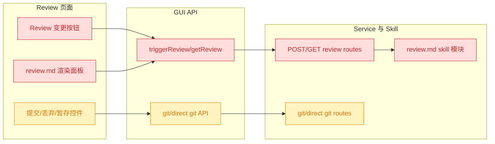
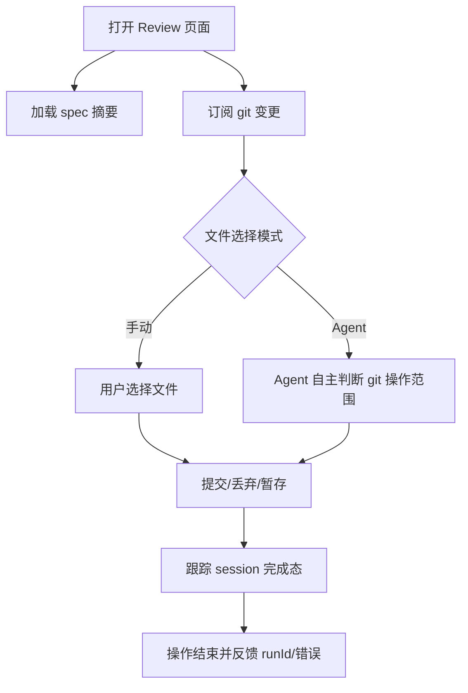

# 移除 Review 报告链路

## 1. 背景

用户原始需求：

> 移除 review 页面的 “Review 变更” 操作按钮，移除 review.md 文档文档渲染相关逻辑，以及相关 skill 内容，这个功能没啥用
> @src/gui/src/pages/SpecReview.tsx @src/skill/yorz-spec/SKILL.md

类型：refct。

## 2. 需求

1. Review 页面不再提供“Review 变更”操作按钮。
2. Review 页面不再读取、渲染或展示 `review.md` 报告内容。
3. 移除 yorz-spec skill 中与 `review.md` 报告生成相关的内容。
4. 保留 Review 页面已有的提交、丢弃、暂存等 git 操作能力。

## 3. 现状分析

当前 Review 页同时承载两类能力：一类是“Review 变更”触发 Agent 生成 `review.md` 报告并在页面右侧渲染；另一类是提交、丢弃、暂存 git 变更。用户需求只否定前者，后者仍是 Review 页的主要操作价值。

现状定位

- `src/gui/src/pages/SpecReview.tsx` 定义 `ActionKind = 'review' | GitOpsAction`，维护 `review` resource、`reviewHtml`、`lastReviewTime`、`shouldShowReviewPane`，并在按钮区渲染“Review 变更”按钮。
- `src/gui/src/lib/api.ts` 暴露 `triggerReview` 与 `getReview`，分别调用 `POST /review` 与 `GET /review`。
- `src/service/routes/spec-review.ts` 提供 `POST /projects/:projectId/specs/:id/review` 生成报告、`GET /projects/:projectId/specs/:id/review` 读取 `review.md`。
- `src/skill/yorz-spec/SKILL.md` 明确按需读取 `review.md`，并声明 `mode=review / mode=git-ops` 独立路径。
- `src/skill/yorz-spec/review.md` 同时描述报告生成与 git-ops 约束；`src/skill/yorz-spec/index.json` 登记了 `review` 模块。
- `src/gui/src/i18n/en.ts` 与 `src/gui/src/i18n/zh-CN.ts` 中存在 `reviewChanges`、`reviewing`、`noReport`、`lastReview`、`reviewHint` 等报告链路文案。
- `src/service/__tests__/spec-review.test.ts` 覆盖了 `POST /review` 与 `GET /review`；`src/gui/src/__e2e__/spec-task-list.spec.ts` 中存在 review.md 渲染相关用例。

## 4. 技术实现方案

方案是删除“报告生成/读取/渲染”链路，保留 git 操作链路。Review 页面降级为 git 操作页：顶部仍展示 spec 摘要和焦点模式按钮，主体保留 commit message、选择模式、文件列表与提交/丢弃/暂存按钮，不再展示最近 review 时间、报告右栏、报告 loading 或“Review 变更”按钮。

技术改动细节

1. 前端页面：
   - 在 `src/gui/src/pages/SpecReview.tsx` 中将 `ActionKind` 收窄为 `GitOpsAction`，删除 `review` resource、Markdown 渲染、最近 review 时间、报告面板、`extractLastReviewTime` 与“Review 变更”按钮。
   - `trackRound` 不再因为 review 完成刷新报告，只负责清理运行状态。
   - `lastRun` 展示逻辑只使用 `ACTION_LABEL_KEY`。
2. GUI API 与国际化：
   - 删除 `api.triggerReview` 与 `api.getReview`。
   - 删除不再展示给用户的 `review.reviewChanges`、`review.reviewing`、`review.noReport`、`review.lastReview`、`review.reviewHint` 文案。
3. Service：
   - 在 `src/service/routes/spec-review.ts` 删除 `POST /review` 与 `GET /review`，删除 `existsSync`、`readFile`、`join` 等只为报告读取服务的导入。
   - `buildGitOpsPrompt` 不再传入或引用 `review.md`，改为要求 Agent 基于 spec 文档与 `git status/diff` 自主判断相关文件。
4. Skill：
   - 删除 `src/skill/yorz-spec/SKILL.md` 对 `review.md` 的读取说明和 `mode=review` 描述，保留 git-ops 独立路径说明。
   - 将 `src/skill/yorz-spec/review.md` 改为 `git-ops.md` 或等价内容，仅保留 commit/discard/stash 的 git 安全约束。
   - 更新 `src/skill/yorz-spec/index.json` 模块登记，移除 `review` 模块或替换为 `git-ops` 模块。
5. 测试：
   - 删除 `POST/GET /review` route 用例，保留并调整 `POST /git` 用例断言。
   - 删除或改写 review.md 渲染 e2e 用例，保留“无报告面板”类断言时应改为页面上不存在报告面板。
   - 安装测试中预期 skill 子文档列表不再包含 `review.md`，若新增 `git-ops.md` 则改为对应文件名。

决策说明：`mode=git-ops` 当前依赖同一个 `review.md` skill 文档承载安全规则，但用户要移除的是报告生成和渲染价值，而不是 git 操作能力。因此将 skill 内容拆成纯 git-ops 指引最小化风险；不删除 Review 页入口，也不删除提交/丢弃/暂存 direct API。

## 5. 待确认项

_暂无_

## 6. 任务清单

- [x] 精简 `src/gui/src/pages/SpecReview.tsx` 的 review 报告状态、按钮和渲染面板（验收：文件内无 `triggerReview`、`getReview`、`review-report-pane`、`extractLastReviewTime` 残留）
- [x] 删除 GUI API 与 i18n 中未使用的 review 报告接口和文案（验收：`src/gui/src/lib/api.ts` 无 `triggerReview/getReview`，i18n 无“Review 变更”报告入口文案）
- [x] 删除 service 的 `POST/GET /review` 报告路由并调整 git-ops prompt（验收：`src/service/routes/spec-review.ts` 不再读写 `review.md` 且 `/git` 路由仍保留）
- [x] 将 yorz-spec skill 的 review 报告文档替换为纯 git-ops 指引（验收：`src/skill/yorz-spec/SKILL.md` 与 `index.json` 不再引用 `review.md`）
- [x] 更新相关测试与安装预期（验收：不再存在 review.md 渲染或 `/review` route 正向用例）
- [x] 运行格式化、lint 与可用测试（验收：命令结果写入执行记录）

## 7. 执行记录

- 2026-08-05 execute：精简 `src/gui/src/pages/SpecReview.tsx`，删除 review 报告 resource、Markdown 渲染、最近 review 时间、“Review 变更”按钮、报告面板和报告时间解析函数；保留提交、丢弃、暂存与 direct/Agent 两种文件选择模式。
- 2026-08-05 execute：删除 `src/gui/src/lib/api.ts` 的 `triggerReview/getReview`；清理中英文 i18n 中报告生成相关文案；同步 `docs/User-Guide.md` 与 `docs/User-Guide-CN.md`，不再描述 review 报告。
- 2026-08-05 execute：删除 `src/service/routes/spec-review.ts` 的 `POST /review` 与 `GET /review` 报告路由；`/git` prompt 改为基于 spec 文档与 `git status/diff` 自主判断相关文件，不再引用 `review.md`。
- 2026-08-05 execute：删除 `src/skill/yorz-spec/review.md`，新增 `src/skill/yorz-spec/git-ops.md`；更新 `SKILL.md`、`index.json`、`src/service/skill-ref.ts` 和安装测试预期。
- 2026-08-05 execute：更新 `src/service/__tests__/spec-review.test.ts`、`src/gui/src/__e2e__/spec-task-list.spec.ts` 与 e2e seed，移除 `/review` route 正向用例和 review.md 渲染 fixture。
- 2026-08-05 execute 验证：`pnpm exec tsc --noEmit --pretty false` 通过；`pnpm exec vitest run src/service/__tests__/spec-review.test.ts src/cli/__tests__/install.test.ts` 通过（2 files / 27 tests）；`pnpm run build` 通过；`pnpm exec playwright test src/gui/src/__e2e__/spec-task-list.spec.ts` 通过（2 tests）。残留搜索：目标源码、service、skill、用户指南中无 `triggerReview/getReview/review.md` 报告链路残留；e2e 测试中仅保留“按钮不存在”的断言。
- 2026-08-05 execute 收尾：无待确认项、无未完成非 manual 任务、无 `！！！` 批注，标记 done。
