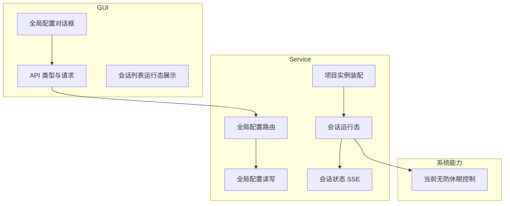
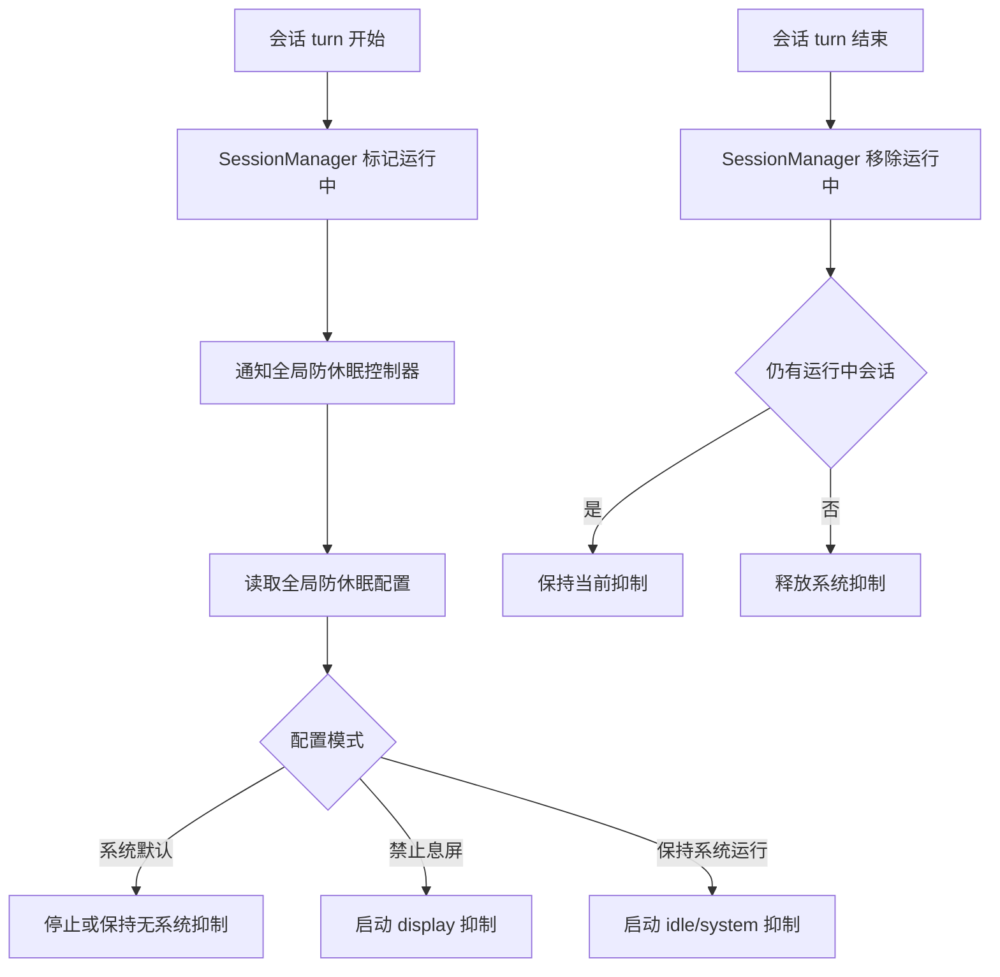
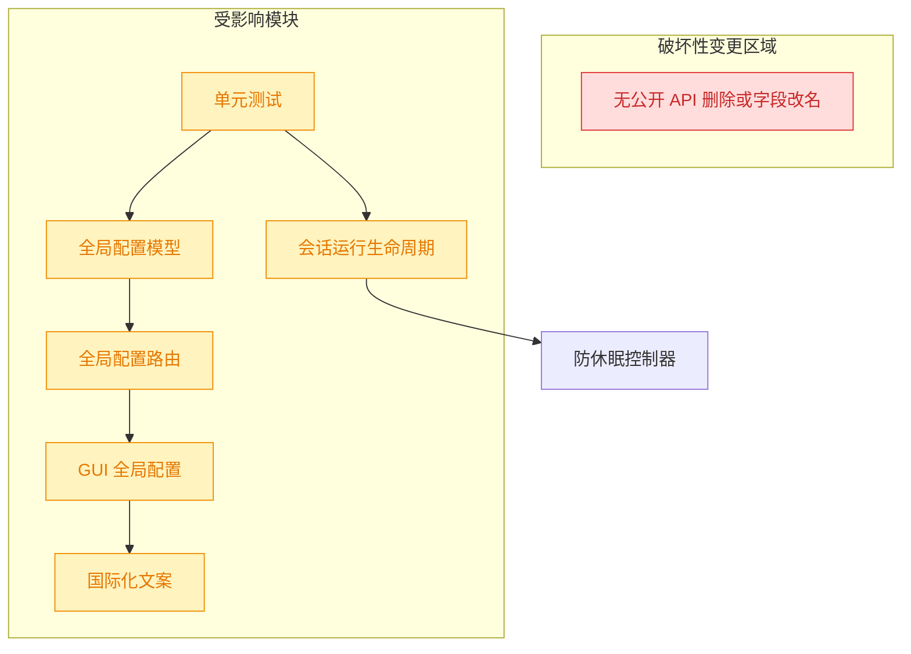

# prevent-system-sleep

## 1. 背景

Agent 任务经常长时间运行；如果系统在任务期间息屏、休眠或断网，会中断会话执行。需要提供一个全局配置，让 YorZ 在存在运行中的 Agent 会话时按用户偏好阻止系统进入对应低功耗状态。

## 2. 需求

原始需求：

> Agent的任务经常要长时间运行，如果系统休眠会导致断网，中断任务；
> 我需要一个全局配置，当有任务正在运行时（运行中的 会话），阻止系统息屏或休眠；
> 配置 UI radio：禁止息屏，保持系统运行，系统默认

整理后的需求：

- 增加全局配置项，作用范围为所有项目。
- 仅当至少存在一个运行中的 Agent 会话时启用防休眠；所有会话结束后恢复系统默认行为。
- GUI 全局配置中以 radio 展示三种模式：
  - 系统默认：不干预系统电源策略。
  - 禁止息屏：任务运行中阻止显示器进入睡眠。
  - 保持系统运行：任务运行中阻止系统 idle sleep，尽量保证网络与任务不中断。
- 所有新增用户可见文案使用 `src/gui/src/i18n/` 国际化配置。

## 3. 现状分析

当前项目已经具备本需求的关键接入点：

- 全局配置定义在 `src/service/global-config.ts`，当前包含 `agent`、`notifications`、`shortcuts`，通过 `~/.config/yorz/projects.json` 或 `YORZ_HOME` 下的 `projects.json` 持久化。
- 全局配置 API 在 `src/service/routes/global-config.ts`，`GET /api/global-config` 返回 GUI 所需配置，`PUT /api/global-config` 做结构校验后覆盖保存相关字段。
- GUI 全局配置对话框在 `src/gui/src/components/GlobalConfigDialog.tsx`，当前已有默认 Agent、会话结束提示、快捷键配置，并通过 `src/gui/src/lib/api.ts` 的 `GlobalConfig` 类型往返。
- Agent 会话运行态由 `src/service/session-manager.ts` 的 `running: Set<string>` 维护；`send()` 开始时 `setRunning(sid, true)`，结束、失败、abort 后进入 `finally` 并 `setRunning(currentSid, false)`。
- 项目级会话状态已通过 `events-hub.ts` 的 `session-status` 主题广播给 GUI，但后端自身目前没有基于“全局是否存在运行中会话”的生命周期控制器。

精确层：相关文件与职责

- `src/service/global-config.ts`：`GlobalConfig`、默认值、normalize、load/save。
- `src/service/routes/global-config.ts`：全局配置 REST API 的输入校验与保存。
- `src/service/project-registry.ts`：创建 `SessionManager`，适合注入会话运行态副作用。
- `src/service/session-manager.ts`：最可靠的 Agent 会话运行开始/结束事件源。
- `src/gui/src/components/GlobalConfigDialog.tsx`：新增 radio UI 的落点。
- `src/gui/src/lib/api.ts`：前端 `GlobalConfig` 类型需补充新字段。
- `src/gui/src/i18n/zh-CN.ts`、`src/gui/src/i18n/en.ts`：新增所有 UI 文案。

## 4. 技术实现方案

总体方案是在后端引入一个进程级 `PowerInhibitController`，由所有项目的 `SessionManager` 共享。它不替代现有 SSE 运行态，只订阅 `SessionManager` 的运行状态变化，用全局运行中会话数决定是否持有系统防休眠能力。

### 4.1 全局配置模型

新增类型：

- `PowerInhibitMode = 'system-default' | 'prevent-display-sleep' | 'keep-system-awake'`
- `GlobalPowerConfig = { inhibitWhenRunning: PowerInhibitMode }`

`GlobalConfig` 增加 `power: GlobalPowerConfig`，默认值为 `{ inhibitWhenRunning: 'system-default' }`。`normalizeConfig()` 对缺失或非法旧配置回退默认值，保证老用户配置无迁移成本。`saveGlobalConfig()` 继续通过现有 normalize 流程写出稳定结构。

### 4.2 后端防休眠控制

新增 `src/service/power-inhibit.ts`：

- 维护 `runningSessions: Set<string>` 和当前抑制进程句柄。
- 暴露 `setSessionRunning(sessionId, running)`，被 `SessionManager` 的状态变化回调调用。
- 每次运行态变化时读取全局配置，计算目标模式；没有运行中会话或模式为 `system-default` 时释放抑制。
- macOS 优先用系统自带 `caffeinate`：
  - `prevent-display-sleep` 使用 `caffeinate -d`。
  - `keep-system-awake` 使用 `caffeinate -i`。
- 非 macOS 平台先安全降级为 no-op，并记录 debug 日志；不阻塞 Agent 执行。该需求当前的主要目标是避免本地运行任务时 macOS 休眠导致断网，跨平台增强可后续追加。
- 若用户在全局配置 UI 中切换模式，`PUT /api/global-config` 保存后调用控制器 `refresh()`，让正在运行的会话立即应用新模式。

### 4.3 SessionManager 接入

给 `SessionManagerOptions` 增加可选回调：

- `onSessionStatusChange?: (event: SessionStatusEvent) => Promise<void> | void`

`setRunning()` 在更新本地 `running` 集合并广播 SSE 后调用该回调。`project-registry.ts` 创建 `SessionManager` 时注入全局控制器实例的 `setSessionRunning`，从而覆盖所有项目和所有会话。

### 4.4 GUI 全局配置

`GlobalConfigDialog.tsx` 增加一组 radio：

- 系统默认
- 禁止息屏
- 保持系统运行

状态随 `api.getGlobalConfig()` 初始化，并随 `api.updateGlobalConfig()` 提交。新增文案全部写入 `src/gui/src/i18n/zh-CN.ts` 与 `src/gui/src/i18n/en.ts` 的 `globalConfig` 命名空间。

### 4.5 测试与验证

计划补充测试：

- `global-config.test.ts` 覆盖 `power.inhibitWhenRunning` 默认值、非法值 normalize、保存回读。
- `session-manager.test.ts` 覆盖 `setRunning()` 触发 `onSessionStatusChange`，以及 Codex reconcile 后旧 id false、新 id true 的回调顺序。
- 新增 `power-inhibit.test.ts`，通过注入 fake spawn / fake platform 验证 macOS 不同模式的命令参数、无运行会话时释放、非 macOS no-op。

精确层：实施文件清单

- `src/service/global-config.ts`：新增 power 类型、默认值、normalize。
- `src/service/routes/global-config.ts`：GET/PUT body 与 parse 校验补充 power 字段；保存后刷新防休眠控制器。
- `src/service/server.ts` 或 `src/service/project-registry.ts`：创建并传入进程级控制器。
- `src/service/session-manager.ts`：新增状态变化回调。
- `src/service/power-inhibit.ts`：新增防休眠控制器。
- `src/gui/src/lib/api.ts`：补充 `GlobalConfig.power` 类型。
- `src/gui/src/components/GlobalConfigDialog.tsx`：新增 radio UI。
- `src/gui/src/i18n/zh-CN.ts`、`src/gui/src/i18n/en.ts`：新增用户可见文案。
- `src/service/__tests__/global-config.test.ts`、`src/service/__tests__/session-manager.test.ts`、`src/service/__tests__/power-inhibit.test.ts`：新增/更新验证。

## 5. 待确认项

_暂无_

## 6. 任务清单

- [x] 更新全局配置模型与路由，新增 `power.inhibitWhenRunning` 的默认值、normalize、GET/PUT 校验与保存后刷新能力（验收：全局配置单元测试覆盖默认值、保存回读、非法值回退与 API 校验）
- [x] 新增后端防休眠控制器并接入 SessionManager 运行态变化（验收：单元测试覆盖运行中计数、macOS `caffeinate` 参数、释放逻辑、非 macOS no-op）
- [x] 在 GUI 全局配置对话框增加防休眠 radio，并同步 API 类型与国际化文案（验收：所有用户可见文案来自 `src/gui/src/i18n/`，typecheck 通过）
- [x] 执行项目验证命令并记录结果（验收：`pnpm test` 与 `pnpm typecheck` 通过，或记录不可执行原因）

## 7. 执行记录

- 2026-08-06 11:42:50：新建 spec 并完成 plan 阶段分析；待确认项为空，准备进入 tasks。
- 2026-08-06 11:44:08：生成任务清单；待确认项为空，继续进入 execute。
- 2026-08-06 11:49:40：完成全局配置模型与 API 扩展，新增 `power.inhibitWhenRunning` 默认值、normalize、GET/PUT 返回与保存逻辑；相关测试覆盖默认值、保存回读和服务路由。
- 2026-08-06 11:49:40：新增 `PowerInhibitController` 并接入 `SessionManager` 运行态变化；macOS 使用 `caffeinate -d` / `caffeinate -i`，非 macOS 安全 no-op；相关单元测试通过。
- 2026-08-06 11:49:40：全局配置对话框新增防休眠 radio，并补充 API 类型、中文与英文 i18n 文案。
- 2026-08-06 11:49:40：验证通过：`pnpm vitest run src/service/__tests__/global-config.test.ts src/service/__tests__/power-inhibit.test.ts src/service/__tests__/session-manager.test.ts`、`pnpm test`、`pnpm typecheck`。
- 2026-08-06 11:49:40：任务全部完成，标记 done。
