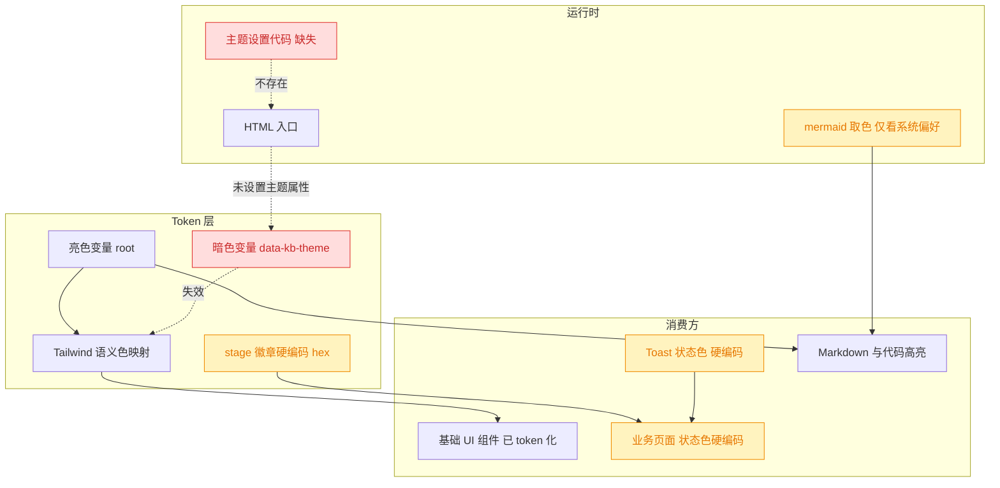
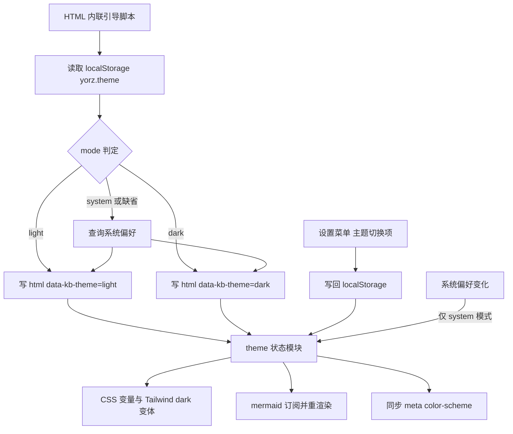
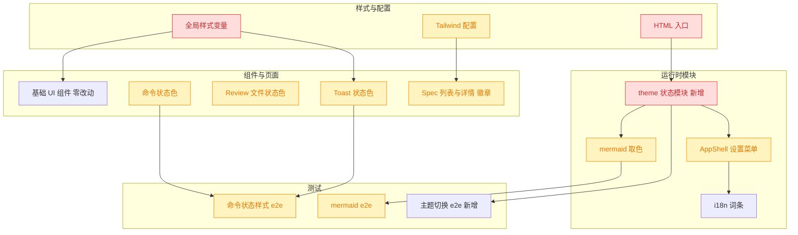
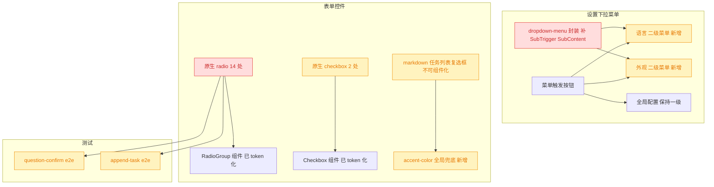

# UI 主题统一与暗色模式重构

## 1. 背景

类型：refct

原始需求：

> 当前系统 UI 比较丑陋，主题颜色不统一（比如有蓝色和黄色的按钮），不支持深色模式；
>
> 请使用 web-design-engineer 重构 UI，提升美感，不破坏现有功能，新增暗色模式。

追加需求（范围扩展，触发变更重开流程）：

> 本次可以不受限制地改变风格，除了调整色系，也可以做一些非功能性的外观优化，达到提升美感与第一印象的目标。要求：符合工具属性，科技风、极简风。
> 先输出一个风格选择器 HTML 到 spec 文档目录下供选择。

## 2. 需求

- **统一主题色**：建立一套语义化 design token（品牌轴 / 中性轴 / 状态轴 / 阶段轴），消除页面中同时出现蓝色实心按钮与琥珀黄按钮的割裂感。
- **消除硬编码颜色**：GUI 源码中的调色板类名（`text-yellow-600`、`text-emerald-600` 等）与 hex 字面量全部改为 token 驱动。
- **新增暗色模式**：支持 `light / dark / system` 三态切换，持久化、无首屏闪烁，Markdown / 代码高亮 / mermaid 全部联动。
- **风格重塑（范围扩展）**：允许整体改变视觉风格，不限于色系——字体、圆角、描边、阴影、留白、密度、微动效均可调整。方向锁定 **科技风 + 极简风**，须符合开发者工具属性。
- **风格选择器先行**：先产出可交互的风格选择器 HTML 供人工选型，选定后再落地实现。
- **不破坏现有功能**：信息架构、交互流程、DOM 结构、既有单测与 e2e 用例保持通过；仅做非功能性的外观变更。
- 新增用户可见文案必须走 `@src/gui/src/i18n/`。

## 3. 现状分析

现状可以概括为三句话：

**一、Token 骨架已经搭好，但语义被用错了。** 全局样式表已按 shadcn 约定定义了完整的 HSL 变量组，Tailwind 配置也把 `background/foreground/primary/secondary/muted/accent/...` 全部映射到了 `hsl(var(--x))`；`components/ui/` 下 15 个基础组件除 Toast 外已 100% 使用语义类名，不含任何调色板硬编码。真正的问题出在 `--accent` 的取值：shadcn 体系中 `--accent` 是**中性的悬浮底色**（ghost/outline 按钮 hover、下拉项 focus、Select 项 focus 都用它），而当前它被设成了琥珀黄 `38 92% 50%`。于是用户看到的「蓝色按钮」是 `--primary`（实心主行动按钮），「黄色按钮」是同一批按钮在 hover 时被 `--accent` 染成的亮黄——两者不是两套设计，而是一套 token 被误配置的结果。这也意味着：**只改变量值就能一次性消掉绝大部分割裂感，无需改动组件代码。**

**二、暗色变量是"死代码"。** 样式表里已经写了一整块 `[data-kb-theme='dark']` 变量覆盖，代码高亮甚至已经写好了 GitHub Dark 配色分支，Tailwind 也配置了对应的 `darkMode` 选择器——但全仓没有任何一行 TS/TSX/HTML 去设置 `data-kb-theme` 属性。因此暗色变量块、以及散落在源码中的 `dark:` 变体类全部永不生效。缺的不是样式，而是**运行时开关**：主题状态模块、HTML 入口的初始属性与防闪烁脚本、以及切换入口。

**三、硬编码颜色集中在"状态语义"这一类。** 内联 hex 在 TSX 中为零，问题集中在两处：一是把状态映射成调色板类名的几张查找表（Toast 的 success/info/warning、Git 文件状态的 M/A/D/??/R、命令运行状态、spec 类型着色），其中 Git 文件状态那张表**完全没有 `dark:` 变体**，暗色下会过暗到几乎不可读；二是 stage 徽章的四个 hex 直接写在 Tailwind 配置里，不随主题变化，且药丸固定用白色前景，在浅色 stage 底上对比度不足。此外 mermaid 只读 `prefers-color-scheme`，一旦引入手动开关就会与页面主题脱节；聊天区文件链接还存在一处被硬编码蓝色覆盖的样式声明。

精确层：关键文件、行号与硬编码清单

**样式与配置**

- `@src/gui/src/app.css`（559 行，全仓唯一 CSS 文件）
  - `:6-36` `:root` 亮色变量：`--primary: 221 83% 53%`（蓝）、`--accent: 38 92% 50%`（琥珀黄，误用）、`--radius: 0.625rem`
  - `:38-66` `[data-kb-theme='dark']` 暗色变量：`--accent` 与亮色同为 `38 92% 50%`，`--accent-foreground: 220 14% 89%`（浅前景压亮黄底，对比度不合格）
  - `:97-199` `.markdown`、`:463-558` `.chat-md` 容器样式（基本已 token 化）
  - `:201-278` hljs GitHub Light、`:280-350` hljs GitHub Dark（共 34 处 hex，已按 `[data-kb-theme='dark']` 分支好，主题属性一旦生效即自动切换）
  - `:352-460` mermaid 容器与工具条（已用 `hsl(var(--card))` / `hsl(var(--border))` / `hsl(var(--accent))`）
  - `:535-536` **缺陷**：`color: hsl(var(--foreground))` 紧接着被 `color: #1f6feb` 覆盖，聊天区文件链接固定为硬编码蓝
- `@tailwind.config.cjs`
  - `:3` `darkMode: ['class', '[data-kb-theme="dark"]']`（与 CSS 选择器一致，无需改）
  - `:4` `content: ['./src/gui/src/**/*.{ts,tsx}']`（**不含 `.css` 与 `index.html`**，新增类名时需留意）
  - `:7-40` 语义色映射（全部指向 `hsl(var(--x))`）
  - `:41-44` stage 硬编码 hex：`stage-plan #6366f1`、`stage-tasks #f59e0b`、`stage-execute #10b981`、`stage-done #16a34a`
- `@src/gui/index.html`（13 行）：无 `data-kb-theme`、无 `<meta name="color-scheme">`、无防闪烁脚本；`lang="zh-CN"` 写死。服务端 `@src/service/static.ts:28-29` 直接读文件返回，不做模板注入，故主题必须在客户端设置

**硬编码调色板类（TSX 共 31 个 token / 5 个文件）**

- `@src/gui/src/components/ui/toast.tsx:53-60`：`success` = emerald 系、`info` = sky 系、`warning` = amber 系（各含 `dark:` 变体），仅 `error` 用了 `text-destructive`
- `@src/gui/src/pages/SpecReview.tsx:54-60`：`M: text-yellow-600`、`A: text-green-600`、`D: text-red-600`、`??: text-blue-600`、`R: text-purple-600`——**全部无 `dark:` 变体**
- `@src/gui/src/components/CommandStatusText.tsx:13-18`：`running` emerald、`killed` amber、`failed` rose、`exited` 已语义化
- `@src/gui/src/pages/SpecList.tsx:52-56`：spec 类型着色 `feat` emerald / `refct` sky / `fix` rose；`:47` STAGE_BG；`:252` 药丸固定 `text-white`
- `@src/gui/src/pages/SpecDetail.tsx:42-47` STAGE_BG；`:405` 药丸固定 `text-white`

**「蓝 / 黄」按钮的实际来源**

- 蓝：`--primary` → `@src/gui/src/components/ui/button.tsx:15`（`variant="default"`），使用处如 `AppShell.tsx:148`（新建 spec）、`NewSpec.tsx:155`、`ChatPanel.tsx:891`、`MentionTextarea.tsx:294`
- 黄：`--accent` → `button.tsx:17-18`（outline hover）、`button.tsx:20`（ghost hover）、`dropdown-menu.tsx:58`、`select.tsx:95`，使用处如 `ProjectsSidebar.tsx:290,318,370`、`SpecDetail.tsx:428,435`、`QuestionConfirmPanel.tsx:203,248,395`、`ChatPanel.tsx:1027`、`app.css:396,432`

**运行时**

- `@src/gui/src/lib/mermaid.ts:34-36` `getTheme()` 读 `window.matchMedia('(prefers-color-scheme: dark)')`；`:371-372` `mermaid.initialize({ theme })`；`:409-414` 监听 media query 变化后 `rerenderAll()`；`:416-419` cleanup
- `@src/gui/src/AppShell.tsx:164-182` 设置下拉菜单（已有语言切换项，是主题切换项的天然邻位）；`:37-51` `DEFAULT_GLOBAL_CONFIG`
- `@src/gui/src/components/GlobalConfigDialog.tsx:34-48` `DEFAULT_CONFIG`
- localStorage 既有先例：i18n 用 `yorz.lang`（`@src/gui/src/i18n/config.ts:15`）；`ProjectsSidebar.tsx:42,51,71,83`、`ChatPanel.tsx:112,123,131`

**i18n**

- `@src/gui/src/i18n/{config.ts,index.ts,zh-CN.ts,en.ts}`，两份词条顶层 25 个命名空间完全对齐；`shell` 块（`zh-CN.ts:21-27` / `en.ts:21-27`）已有 `languageSwitch/langZh/langEn`

**测试**

- vitest：`@src/gui/src/lib/__tests__/`（9 个纯逻辑单测，无组件渲染、无样式断言）、`@src/service/__tests__/global-config.test.ts`
- playwright：`@src/gui/src/__e2e__/`（13 个 spec）。其中 `command-status-style.spec.ts:46,60` 断言状态文本背景为 `rgba(0, 0, 0, 0)`/`transparent`，改 `CommandStatusText` 时必须回归；`mermaid-*.spec.ts` 覆盖 mermaid 渲染与 morphdom 增量下的 SVG 保留

**追加轮补充现状（对应 `## 追加任务` 的 `[open]` 条目）：**

首轮把「蓝黄割裂」归因到 `--accent` 误配置，但漏了一条：**原生表单控件根本不走 CSS token**。`<input type="radio">` 由浏览器绘制，选中态取 `accent-color`，而该属性从未设置，于是回落到系统默认蓝——这就是主题已改成磷光绿、可 radio 仍是蓝色的原因。仓库里其实早就有完全 token 化的 `RadioGroup` / `Checkbox` 组件，却只有 `ChatPanel` 一处在用，其余 6 个文件共 14 处仍是裸 `<input>`。

另一条是菜单信息层级：语言与外观都属于低频偏好，却和高频的「全局配置」平铺在同一层下拉里，把菜单撑长、稀释了主项。Kobalte 的 `DropdownMenu` 已支持 `Sub`/`SubTrigger`/`SubContent`，但本仓的封装只导出了 `Sub`，缺后两者。

精确层：原生控件分布与菜单封装缺口

**原生 `<input type="radio">`（14 处 / 6 个文件），形态高度一致——均为 `<label><input checked onChange />…</label>`**

- `@src/gui/src/components/QuestionConfirmPanel.tsx:240,261,292,303,329,354`（6 处，最复杂：choice 候选 + 自由项、confirm 的 accept/reject、reject 下的子选项）
- `@src/gui/src/components/GlobalConfigDialog.tsx:186,228`（默认 Agent、防休眠策略）
- `@src/gui/src/pages/SpecReview.tsx:349,359`（手动选文件 / Agent 选文件）
- `@src/gui/src/components/ProjectConfigDialog.tsx:135`（项目 Agent）
- `@src/gui/src/components/AppendTaskDialog.tsx:113`（追加任务类型 feat/refct/fix）
- `@src/gui/src/pages/NewSpec.tsx:159`（新建 spec 类型）

**原生 `<input type="checkbox">`（2 处可组件化 + 1 处不可）**

- 可改：`@src/gui/src/components/AppendTaskDialog.tsx:128`（调试模式）、`@src/gui/src/pages/SpecReview.tsx:386`（文件勾选）
- 不可改：markdown 渲染出的任务列表复选框——由 `markdown-it-task-lists` 生成，`@src/gui/src/lib/markdown.ts:29` 的白名单正则写死了 `<input class="task-list-item-checkbox" disabled type="checkbox">`，样式落在 `@src/gui/src/app.css:276`。它不经过 Solid 组件树，只能靠 CSS 控制

**现成但闲置的 token 化组件**

- `@src/gui/src/components/ui/radio-group.tsx`：`RadioGroupItemControl` 已用 `data-[checked]:bg-primary` + `ring-primary/20`，完全跟随主题；仅 `ChatPanel` 使用
- `@src/gui/src/components/ui/checkbox.tsx`：`CheckboxControl` 同样已 token 化，当前无人使用

**菜单封装缺口**

- `@src/gui/src/components/ui/dropdown-menu.tsx:15` 只导出了 `DropdownMenuSub`；`@kobalte/core` 的 `dist/dropdown-menu/index.d.ts` 确认 `SubTrigger` / `SubContent` 可用，需补两个带样式的封装
- `@src/gui/src/AppShell.tsx:164-200` 当前把「语言切换」标题项 + 2 个语言项 + 「外观」标题项 + 3 个主题项 + 「全局配置」共 8 项平铺

**e2e 对原生 radio 的依赖（改造必须同步）**

- `@src/gui/src/__e2e__/question-confirm.spec.ts:24` `panel.locator('input[type="radio"]')`、`:62` `.check()`
- `@src/gui/src/__e2e__/append-task.spec.ts:64` `input[type="radio"][value="fix"]` + `.check()`

## 4. 技术实现方案

### 4.1 风格选型（选择器已产出）

范围扩展后，"改哪些变量"这件事必须先于"怎么改"确定。已在 spec 目录产出可交互风格选择器 `style-selector.html`：把真实的 YorZ 布局（顶栏 / 项目侧栏 / spec 卡片网格 / Agent 执行流 / 组件状态走查 / Token 色板）分别套上 5 套完整风格，每套含亮暗两版，并附 Tweaks 面板可实时调整圆角、信息密度、stage 徽章形态、背景纹理与动效开关。

五套风格沿"安全 → 大胆"排布，均满足科技风 + 极简风的硬要求，差异不只在配色，而在**字体、圆角、描边强度、阴影语言、标签排印**的整体组合：

| 风格           | 视觉主张                                             | 气质 / 风险                                  |
| -------------- | ---------------------------------------------------- | -------------------------------------------- |
| 石墨 Graphite  | 无色中性灰阶，主行动近黑/近白，彩色只留给状态语义    | 噪音最低、连续性最好；风险最小               |
| 纸感 Paper     | 暖白纸底 + 墨黑正文 + 朱砂焦点，细线分隔、近乎无影   | 长文阅读最舒适；科技感相对最弱               |
| 信号 Signal    | 瑞士国际主义：黑白高对比、直角、硬投影、单一荧光信号 | 第一印象最锐利；对排版纪律要求最高           |
| 蓝图 Blueprint | 深靛底 + 工程网格纹理 + 青色荧光，focus 带轻微辉光   | 科技感最直接；纹理需克制到几乎察觉不到       |
| 终端 Terminal  | 全等宽字体 + 磷光绿 + 扫描线，GUI 作为 CLI 的延伸    | 工具属性最强；等宽字体损伤长段中文摘要可读性 |

选择器同时承担**设计走查**职能：每套风格下都能直接检视按钮四态（主/次/幽灵/危险/禁用）、输入框 focus 环、三类 toast、stage 徽章三种形态与完整 token 色板，避免"配色好看但组件状态崩坏"。

### 4.2 设计系统声明

无论选中哪套风格，下列**结构性决策不变**——风格只替换 token 取值与字体/圆角/描边参数，不改 token 拓扑。整体调性对标 Linear / Vercel / GitHub Primer 这类开发者工具：**冷静中性底 + 单一强调色 + 克制的语义色**，避免多主色并置造成的花哨感。

| 维度   | 决策                                                                                                                                                    |
| ------ | ------------------------------------------------------------------------------------------------------------------------------------------------------- |
| 中性轴 | 单一中性灰阶承载 background / card / popover / muted / secondary / **accent** / border / input；亮暗两套各自校准明度台阶（色温由所选风格决定）          |
| 品牌轴 | 单一 `--primary`，仅用于主行动按钮、链接、focus ring、选中态；具体取值随 5.1 选定的风格确定                                                             |
| 字体轴 | 新增 `--font-sans` / `--font-mono` 两个变量并接入 Tailwind `fontFamily`，使字体随风格切换；正文与等宽的分工由所选风格决定                               |
| 语义轴 | 新增 `--success` / `--warning` / `--danger` / `--info`，每个含 `-foreground`（文本可读色）与 `-subtle`（低饱和底色）两级，亮暗各一套                    |
| 阶段轴 | `stage-plan/tasks/execute/done` 从 Tailwind 硬编码 hex 改为 CSS 变量驱动，并补 `-foreground`，药丸不再固定白字                                          |
| 圆角   | 保持 `--radius` 单一源驱动 `lg / md / sm` 三级（Tailwind 已有映射），药丸类元素用 `rounded-full`；具体基值随风格确定                                    |
| 阴影   | 建立 elevation 1–3；**暗色下弃用黑色投影**，改以 `border` 提亮 + 极弱内高光表达层级，避免"糊成一片"                                                     |
| 动效   | 统一 `150ms cubic-bezier(0.2, 0, 0, 1)`，仅过渡 color / background-color / border-color / box-shadow；补 `@media (prefers-reduced-motion: reduce)` 降级 |
| 无障碍 | 正文与状态文本在亮暗两套下均需满足 WCAG AA（≥ 4.5:1），药丸/徽章等大字号元素 ≥ 3:1                                                                      |

**核心修正（一次性消除"蓝黄割裂"）**：`--accent` 回归 shadcn 语义，改为中性悬浮底色；原先的琥珀黄迁移到 `--warning`，只在真正表达"警告/修改中"语义处使用。此项零组件改动，仅改变量值。

### 4.3 主题运行时

要点：

- **防首屏闪烁**：主题属性必须在样式生效前写入 `<html>`，因此在 HTML 入口 `<head>` 内放一段**同步内联脚本**读 localStorage 并落属性；模块脚本加载后再由状态模块接管。
- **单一真相**：新建 `theme` 状态模块持有 `mode`（`light|dark|system`）与解析后的 `resolved`（`light|dark`），对外暴露 signal + `setMode()`；所有消费方订阅它，不各自读 `matchMedia`。
- **持久化选型**：只用 localStorage（key `yorz.theme`），**不落全局配置**。理由：全局配置需异步 GET，会引入首屏主题闪烁；主题是端侧偏好而非项目配置；且与 i18n 的 `yorz.lang` 保持同一模式，用户心智一致。被否决的备选是扩展 `global-config` 的 `theme` 字段（需改服务端类型/归一化/路由校验/两处前端默认值共 5 处，收益仅为跨设备同步，与本次目标无关）。
- **切换入口**：放在设置下拉菜单中语言切换的邻位（三态子项），与既有交互模式一致，不新增顶栏按钮。
- **mermaid 联动**：取色源从 `prefers-color-scheme` 改为订阅 theme 状态模块；原 media query 监听换成对状态变化的订阅，重渲染逻辑与 cleanup 保持不变。
- **原生控件**：入口补 `<meta name="color-scheme" content="light dark">`，并在暗色下让滚动条、表单原生部件跟随。

### 4.4 改造范围与影响面

- 🔴 **变更核心**：全局样式变量（重写亮暗两套 token 并新增语义/阶段变量）、HTML 入口（新增引导脚本与属性）、theme 状态模块（新增文件）。
- 🟡 **受影响**：Tailwind 配置的 stage 色改为变量驱动；mermaid 取色源替换；设置菜单新增三态子项与 i18n 词条；四处状态色查找表改 token 类名；两个 e2e 用例需回归、并新增主题切换用例。
- ✅ **零改动**：`components/ui/` 下除 Toast 外的 14 个组件、Tailwind `darkMode` 配置、hljs 亮暗样式块（属性一生效即自动切换）、所有业务交互逻辑与 DOM 结构。

### 4.5 实施顺序与验证

1. **风格落地**：把 5.1 选定风格的 token（含字体、圆角、描边、阴影参数）从选择器移植进全局样式表，先亮后暗；每套完成后做对比度检查确认 AA。
2. **运行时接入**：引导脚本 → theme 模块 → 菜单入口 → mermaid 订阅。此步完成后暗色即可整体预览。
3. **硬编码清理**：四处状态色查找表 + stage 变量化 + 聊天区文件链接硬编码蓝，逐处替换为新语义 token。
4. **打磨**：圆角/阴影/过渡统一，hover / focus-visible / active / disabled 四态在亮暗下逐一走查；按 Tweaks 中确认的密度与徽章形态定稿。
5. **验证**：`pnpm typecheck` → `pnpm test` → `pnpm test:e2e`；并新增一个 e2e 断言切换后 `<html data-kb-theme>` 与页面背景计算值变化、mermaid 重绘。

> 决策说明（主题持久化）：采用 localStorage 而非扩展全局配置，理由与被否决备选见 4.3。
>
> 决策说明（风格选型方式）：先产出可交互选择器再实现，而非直接给一套方案。理由是风格属于主观取向，用 5 套完整可比对的实景 demo 收敛决策，比文字描述的返工成本低一个量级；选择器同时充当组件状态走查台。
>
> 决策说明（`--accent` 语义）：回归 shadcn 的"中性悬浮底色"约定，黄色迁至 `--warning`。被否决的备选是保留黄色 accent 并逐个组件改写 hover 类名——需要触碰 10+ 处使用点，风险更高且违背 token 体系设计意图。
>
> 决策说明（切换入口位置）：放入既有设置下拉菜单而非顶栏独立按钮或全局配置弹窗，避免增加顶栏视觉噪音，并与语言切换形成一致的"端侧偏好"分组。
>
> 决策记录：5.1 整体视觉风格 —— 用户选择「终端 Terminal」，理由：工具属性最强、与 CLI 形态同源。
>
> 决策记录：5.2 自托管 Web 字体 —— 用户确认，按此推进，理由：YorZ 为本地 CLI 工具须离线可用，接受产物体积增加。
>
> 决策说明（等宽字体的应用边界）：Terminal 风格若把等宽字体铺到所有文本，长段中文摘要中的英文会因等宽而过宽、行内节奏破碎（此风险已在 5.1 候选描述中标注）。故实施时按 4.7 的排印分工落地——UI 层用等宽、长文正文用比例字体。被否决的备选是全站等宽，视觉更纯粹但牺牲 spec 摘要与 markdown 正文的可读性，与"不破坏现有功能"的体验底线冲突。

### 4.6 Terminal 风格 Token 取值

亮色是"磷光纸"（暖白底 + 深墨绿字 + 深绿主色），暗色是"磷光屏"（近黑绿底 + 浅绿字 + 亮绿主色）。`--accent` 在两套中都是**中性 hover 底色**（亮色 `60 19.1% 90.8%`、暗色 `144 18.5% 10.6%`），彻底移除琥珀黄误用；黄色仅存活在 `--warning` 与 `--stage-tasks`。

精确层：完整 HSL 变量表（亮 / 暗）

| 变量                     | 亮色              | 暗色              |
| ------------------------ | ----------------- | ----------------- |
| `--background`           | `60 23.1% 94.9%`  | `135 15.4% 5.1%`  |
| `--foreground`           | `150 23.1% 10.2%` | `110 30% 84.3%`   |
| `--card` / `--popover`   | `60 38.5% 97.5%`  | `132 14.3% 6.9%`  |
| `--secondary`/`--muted`  | `60 19% 91.8%`    | `130 13% 9%`      |
| `--muted-foreground`     | `140 7.6% 38.6%`  | `107 9.8% 52.2%`  |
| `--accent`（中性 hover） | `60 19.1% 90.8%`  | `144 18.5% 10.6%` |
| `--primary`              | `148 67.2% 23.9%` | `142 69.2% 58%`   |
| `--primary-foreground`   | `120 33.3% 97.6%` | `141 58.6% 5.7%`  |
| `--border`               | `60 15.7% 83.7%`  | `126 14.3% 13.7%` |
| `--input`                | `60 11.3% 70.4%`  | `125 12.6% 20.2%` |
| `--ring`                 | `148 67.2% 23.9%` | `142 69.2% 58%`   |
| `--success`              | `148 67.2% 23.9%` | `142 69.2% 58%`   |
| `--warning`              | `41 79.2% 30.2%`  | `42 74.3% 57.3%`  |
| `--destructive`          | `5 72.3% 38.2%`   | `4 81.7% 67.8%`   |
| `--info`                 | `203 48.8% 32.2%` | `212 100% 73.7%`  |
| `--stage-plan`           | `203 48.8% 32.2%` | `212 100% 73.7%`  |
| `--stage-tasks`          | `41 79.2% 30.2%`  | `42 74.3% 57.3%`  |
| `--stage-execute`        | `148 67.2% 23.9%` | `142 69.2% 58%`   |
| `--stage-done`           | `166 72% 21%`     | `165 65.5% 54.5%` |
| `--radius`               | `0.25rem`         | 同左              |

### 4.7 排印分工

| 层                                                                 | 字体                                    |
| ------------------------------------------------------------------ | --------------------------------------- |
| UI 标签：stage 徽章、面板标题、面包屑、计数、按钮、spec id、时间戳 | `--font-mono`（JetBrains Mono）         |
| 代码、日志、Agent 执行流                                           | `--font-mono`                           |
| 长文正文：spec 摘要、markdown 正文、chat 消息                      | `--font-sans`（比例字体，中文走系统栈） |

字体自托管走 `@fontsource/jetbrains-mono` 的 latin 子集（400/500/700 三档 woff2），由 Vite 打包进产物，不引入任何外网请求。

### 4.8 追加轮：菜单二级化与原生控件统一

**菜单二级化**：补 `DropdownMenuSubTrigger`（复用 Item 的样式 + 右侧 `ChevronRight`）与 `DropdownMenuSubContent`（复用 Content 样式，走 Portal），然后把 `AppShell` 里平铺的 8 项收成 3 项——「语言 →」「外观 →」两个二级菜单 + 一级的「全局配置」。二级菜单内保留现有勾选态与图标，交互语义不变。

**原生控件统一**：14 处 radio 全部换成 `RadioGroup` + `RadioGroupItem` + `RadioGroupItemControl` + `RadioGroupItemLabel`。当前写法是"每个 input 各自 checked/onChange"，Kobalte 是受控 group 模型（`value` + `onChange` 提到 group 上），改造时按 `name` 分组归并即可，每组的 state 变量都已存在。2 处可组件化的 checkbox 同步换成 `Checkbox` + `CheckboxControl`。

**兜底**：markdown 任务列表复选框由 `markdown-it-task-lists` 生成、经白名单正则放行，不进 Solid 组件树，无法组件化。给 `:root` 补 `accent-color: hsl(var(--primary))`，让它以及未来任何漏网的原生控件都自动跟随主题——这是一行成本的"防回归网"，与组件化不是二选一。

> 决策说明（二级菜单形态）：「语言」与「外观」各自成为独立二级菜单，而非合并为一个「偏好设置」二级菜单。理由是两者语义正交、都需要展示当前选中值，独立入口能在收起时仍保持可预期的路径深度（两级），合并则会变成三级。
>
> 决策说明（组件化 + accent-color 双管）：不只用 `accent-color` 一行了事。该属性只能改选中色，控件的尺寸、边框、圆角、focus 环仍由操作系统绘制，macOS 与 Windows 形态不一致，与 Terminal 风格的直角细边不匹配；组件化才能真正统一。反过来也不只做组件化——markdown 生成的复选框够不着组件树，必须留 CSS 兜底。
>
> 决策说明（checkbox 一并处理）：追加需求只点名了 radio，但 `AppendTaskDialog` 与 `SpecReview` 的原生 checkbox 是同一成因（原生控件不吃 token）的同类缺陷，且与被替换的 radio 相邻共存；只换 radio 会留下更刺眼的不一致。故一并纳入本轮最小范围。
>
> 决策说明（e2e 适配）：Kobalte 的 `RadioGroupItemInput` 仍渲染真实 `<input type="radio">`，但视觉隐藏，Playwright 的 `.check()` 对不可见元素会超时。故 3 处断言改为点击可见的 `RadioGroupItemLabel`/控件本身，而非继续定位隐藏 input。

## 5. 待确认项

_暂无_

## 6. 任务清单

- [x] 引入自托管字体：安装 `@fontsource/jetbrains-mono` 并在 `@src/gui/src/app.css` 顶部 import latin 400/500/700 woff2（验收：`pnpm build:gui` 产物含 woff2，页面无 fonts.googleapis.com 外链请求）
- [x] 重写 `@src/gui/src/app.css` 的 `:root` 与 `[data-kb-theme='dark']` 为 Terminal 风格 token，含新增 `--success/--warning/--info` 与 `--stage-*` 及其 `-foreground`、`--font-sans/--font-mono`、`--radius: 0.25rem`（验收：两套变量齐全，`--accent` 为中性 hover 色而非黄）
- [x] 更新 `@tailwind.config.cjs`：`stage-*` 由硬编码 hex 改为 `hsl(var(--stage-*))`，新增 `success/warning/info` 语义色映射，`fontFamily.sans/mono` 改为读 `var(--font-sans/--font-mono)`（验收：`pnpm build:gui` 通过且无残留 hex）
- [x] 改造 `@src/gui/index.html`：`<html>` 补 `data-kb-theme` 初值、`<head>` 加同步防闪烁内联脚本与 `<meta name="color-scheme">`（验收：首屏无亮→暗闪烁）
- [x] 新建 `@src/gui/src/lib/theme.ts`：导出 `themeMode/resolvedTheme` signal、`setThemeMode()`、`initTheme()`，持久化 key `yorz.theme`，system 模式订阅 `matchMedia`（验收：新增单测覆盖三态解析与持久化）
- [x] 在 `@src/gui/src/main.tsx` 早期调用 `initTheme()`（验收：切换后 `<html data-kb-theme>` 随之变化）
- [x] 在 `@src/gui/src/AppShell.tsx` 设置菜单语言项下方新增主题三态子项（跟随系统 / 亮色 / 暗色）并加分隔线（验收：点击即时生效且勾选态正确）
- [x] 在 `@src/gui/src/i18n/zh-CN.ts` 与 `en.ts` 的 `shell` 命名空间新增 `themeSwitch/themeSystem/themeLight/themeDark` 四条文案（验收：两份词条键完全对齐）
- [x] 改造 `@src/gui/src/lib/mermaid.ts`：`getTheme()` 改读 `resolvedTheme()`，media query 监听换成对 theme 变化的订阅并同步 cleanup（验收：手动切暗色后图表重绘为 dark）
- [x] 语义化 `@src/gui/src/components/ui/toast.tsx` 的 `typeClasses`，改用 `--success/--info/--warning/--destructive` token（验收：四类 toast 在亮暗下均达 AA）
- [x] 语义化 `@src/gui/src/pages/SpecReview.tsx` 的 `STATUS_COLOR`（M/A/D/??/R）为语义 token（验收：暗色下五种状态文本可读，不再是 `text-yellow-600` 等裸调色板类）
- [x] 语义化 `@src/gui/src/components/CommandStatusText.tsx` 的状态色映射（验收：`command-status-style.spec.ts` 的透明背景断言仍通过）
- [x] 语义化 `@src/gui/src/pages/SpecList.tsx` 与 `SpecDetail.tsx` 的 stage 徽章与 spec 类型着色，药丸前景改 `text-stage-*-foreground` 不再固定白字（验收：四个 stage 徽章在亮暗下对比度 ≥ 3:1）
- [x] 修正 `@src/gui/src/app.css` 中被 `#1f6feb` 覆盖的聊天区文件链接色，并把 hljs 亮暗主题的强调色对齐 Terminal 色板（验收：全文件除 hljs 语法色外无裸 hex）
- [x] 新增 e2e `@src/gui/src/__e2e__/theme-switch.spec.ts`：断言切换后 `html[data-kb-theme]`、`body` 背景计算值变化与 mermaid 重绘（验收：`pnpm test:e2e` 通过）
- [x] 全量验证：`pnpm typecheck` → `pnpm test` → `pnpm test:e2e` 全绿（验收：三条命令退出码为 0）
- [x] 在 `@src/gui/src/components/ui/dropdown-menu.tsx` 补 `DropdownMenuSubTrigger`（含右侧 ChevronRight）与 `DropdownMenuSubContent`（走 Portal）两个封装（验收：`pnpm typecheck` 通过且样式与既有 Item/Content 一致）
- [x] 在 `@src/gui/src/AppShell.tsx` 把平铺的 8 个菜单项收成「语言 →」「外观 →」两个二级菜单 + 一级「全局配置」（验收：一级菜单仅 3 项，二级内勾选态与图标保持不变）
- [x] 在 `@src/gui/src/app.css` 的 `:root` 补 `accent-color: hsl(var(--primary))` 作为原生控件兜底（验收：markdown 任务列表复选框选中色跟随主题，不再是系统蓝）
- [x] 用 `RadioGroup` 组件替换 `@src/gui/src/components/AppendTaskDialog.tsx:113` 与 `@src/gui/src/pages/NewSpec.tsx:159` 的原生 radio（验收：选中态为 primary 色，键盘方向键可切换）
- [x] 用 `RadioGroup` 组件替换 `@src/gui/src/components/GlobalConfigDialog.tsx:186,228` 与 `@src/gui/src/components/ProjectConfigDialog.tsx:135` 的原生 radio（验收：默认 Agent 与防休眠策略的保存行为不变）
- [x] 用 `RadioGroup` 组件替换 `@src/gui/src/pages/SpecReview.tsx:349,359` 的原生 radio（验收：手动/Agent 选文件模式切换行为不变）
- [x] 用 `RadioGroup` 组件替换 `@src/gui/src/components/QuestionConfirmPanel.tsx` 的 6 处原生 radio，按 `name` 归并为受控 group（验收：choice 候选、自由项、confirm accept/reject 及 reject 子选项的提交 payload 与改造前一致）
- [x] 用 `Checkbox` 组件替换 `@src/gui/src/components/AppendTaskDialog.tsx:128` 与 `@src/gui/src/pages/SpecReview.tsx:386` 的原生 checkbox（验收：调试模式与文件勾选行为不变）
- [x] 适配 e2e：`@src/gui/src/__e2e__/question-confirm.spec.ts:24,62` 与 `append-task.spec.ts:64` 改为操作可见的 label/控件而非隐藏 input（验收：两个 e2e 文件通过）
- [x] 追加轮全量验证：`pnpm typecheck` → `pnpm test` → `pnpm test:e2e` 全绿，并实机截图复核菜单二级化与 radio 选中色（验收：三条命令退出码为 0，截图中无系统蓝控件）

## 7. 追加任务

- [fixed] [feat] 2026-08-07 21:46:58 | 1. header dropdown 菜单项：语言、外观选项 改成二级菜单吧，非高频选项
  - 描述：1. header dropdown 菜单项：语言、外观选项 改成二级菜单吧，非高频选项

2. 全局设置、项目设置、追加任务中的 radio 是原生样式（蓝色），检查所有 radio 统一使用 radio 组件

## 8. 执行记录

- **字体自托管**：装 `@fontsource/jetbrains-mono`，在 `app.css` 顶部 import latin 400/500/700。产物 3 个 woff2 共 **72KB**（落在 5.2 预估的 40–120KB 内），`grep` 确认 `dist/gui` 无 fonts.googleapis / gstatic 外链。
- **Token 重写**：`app.css` 亮暗两套按 4.6 表落地，新增 `--success/--warning/--info` 及 `-foreground`、`--stage-*` 与 `--stage-foreground`、`--font-sans/--font-mono`，`--radius` 由 0.625rem 收到 0.25rem。`--accent` 由琥珀黄 `38 92% 50%` 改为中性 hover 底色，蓝黄割裂一次性消除且零组件改动。
- **风格增补**：`body::before` 加不可察觉级扫描线（前景色 2.2% 透明度），补 `prefers-reduced-motion` 全局降级，`time/code/kbd/samp` 统一等宽——长文正文仍走比例字体，按 4.7 排印分工执行。
- **Tailwind 配置**：`stage-*` 四个硬编码 hex 改为 `hsl(var(--stage-*))`，新增 `success/warning/info` 映射，`fontFamily.sans/mono` 改读 CSS 变量。
- **主题运行时**：`index.html` 加 `data-kb-theme` 初值、`<meta name="color-scheme">` 与同步内联引导脚本；新建 `lib/theme.ts`（`themeMode`/`resolvedTheme` signal + `setThemeMode` + `initTheme`，key `yorz.theme`）；`main.tsx` 早于渲染调用 `initTheme()`；`AppShell` 设置菜单新增三态子项（跟随系统/亮色/暗色）+ i18n 四条文案（zh-CN 与 en 同步）。
- **mermaid 联动**：`getTheme()` 改读 `resolvedTheme()`；订阅方式由 media query 换成对 `<html data-kb-theme>` 的 `MutationObserver`——属性是所有主题变更路径的共同终点。首次实现用了裸全局 `MutationObserver`，导致 4 个既有 mermaid 单测报 `ReferenceError`（jsdom 只在 window 上挂该 API），改为 `window.MutationObserver` 后与本模块其余浏览器 API 取用方式一致，测试恢复。
- **硬编码清理**：`toast.tsx`（12 token）、`SpecReview.tsx`（5 token，原先完全无 dark 变体）、`CommandStatusText.tsx`（6 token）、`SpecList.tsx`/`SpecDetail.tsx`（类型着色 + stage 药丸改 `text-stage-foreground`，不再固定白字）全部改为语义 token；修正 `app.css` 中被 `#1f6feb` 覆盖的聊天区文件链接色为 `hsl(var(--primary))`。
- **hljs 决策**：语法高亮的 GitHub 亮/暗双主题予以保留、不强行并入单色绿板——语法色的价值就在于色相区分度，染成同色系会直接削弱代码可读性；且该块早已按 `[data-kb-theme='dark']` 分支好，主题属性一生效即自动切换。
- **视觉走查发现并修复**：实机截图暗色列表页后发现 `EXECUTE` 与 `DONE` 两枚药丸同为绿系、几乎无法区分。按注意力层级重设——execute（进行中）保持饱和磷光绿抢注意，done（已归档终态）降权为中性灰绿（亮 `150 9% 38%` / 暗 `140 12% 52%`）；连带把 `SpecReview` 的 `R`（renamed）从 `text-stage-done` 改为 `text-primary`，避免复用降权色。
- **测试**：新增 `lib/__tests__/theme.test.ts`（三态解析、非法值回落、storage key 与内联脚本绑定）与 `__e2e__/theme-switch.spec.ts`（属性/背景/color-scheme 同步、`waitUntil:'commit'` 断言引导脚本先于渲染生效即无闪烁、主题翻转后 mermaid 重绘）。e2e 首版选择器 `getByTitle('配置')` 与侧栏项目配置按钮冲突，限定到 `header` 后解决；第三项改为复用已 seed 的 mermaid 密集 spec，不在用例内造数据。
- **验证**：`pnpm typecheck` 通过；`pnpm test` 55 文件 / **484 用例全绿**；`pnpm test:e2e` **25 项全绿**（含既有 `command-status-style` 与两个 mermaid 用例，无回归）；`pnpm build:gui` 构建成功。实机截图复核亮暗两套的列表页与详情页，控制台零报错。
- **收尾**：任务清单 16 项全部完成，无待确认项、无批注、无 `[open]` 追加任务，标记 `done`。

### 8.1 追加轮：菜单二级化与原生控件统一

- **菜单二级化**：`dropdown-menu.tsx` 补 `DropdownMenuSubTrigger`（复用 Item 样式 + 右侧 ChevronRight + `data-[expanded]` 态）与 `DropdownMenuSubContent`（复用 Content 样式，走 Portal）。`AppShell` 由平铺 8 项收成 3 项——「语言 →」「外观 →」两个二级菜单 + 一级「全局配置」，勾选态与图标不变。
- **原生控件统一**：14 处 `<input type="radio">` 全部替换为 `RadioGroup`——`AppendTaskDialog`(1)、`NewSpec`(1)、`GlobalConfigDialog`(2)、`ProjectConfigDialog`(1)、`SpecReview`(2)、`QuestionConfirmPanel`(6，按 `name` 归并为 choice / confirmTop / intent / drop 四个受控 group)。2 处原生 checkbox 换成 `Checkbox` 组件。业务源码现已无任何裸 `<input type="radio|checkbox">`。
- **顺带修复可访问性**：`NewSpec` 的卡片式 radio 原先用 `class="hidden"` 藏 input，会把它移出 tab 序导致键盘完全不可达；`RadioGroupItemInput` 是 clip 隐藏（1px + `clip-path`），既不可见又可聚焦，并自带方向键导航。
- **兜底**：`:root` 补 `accent-color: hsl(var(--primary))`，覆盖 markdown 任务列表复选框等够不着组件树的原生控件，同时充当未来新增原生控件的防回归网。
- **发现并修复两处首轮漏网的 token 缺陷**：`QuestionConfirmPanel:203` 的未答计数用 `text-accent`——首轮把 `--accent` 从琥珀黄改为中性 hover 底色后，这个强调数字会变成几乎不可见的中性灰，改为语义正确的 `text-warning`；`impactAccent()` 的 🟡 分支残留硬编码 `border-l-amber-500`，改为 `border-l-warning`。
- **发现并修复测试可靠性陷阱**：`test:e2e` 直接跑 `dist/cli/index.js serve` 且不重新构建，导致改完 GUI 源码后跑 e2e 会**静默测到旧产物**。本轮一度因此得到假阳性「25 passed」，重新构建后 `question-confirm` 立刻暴露失败。已把 `test:e2e` 改为 `pnpm run build && playwright test`，让 e2e 结论恒定可信。这是仓库既有缺陷，非本次引入，但直接影响本轮验收可信度，故纳入最小必要修复。
- **e2e 适配**：`question-confirm.spec.ts` 的 `label.qcp-option-freeform > input` 父子关系随组件化断开（input 与 label 变为兄弟节点），改为直接点击可见 label；`theme-switch.spec.ts` 的 `openThemeMenu` 补一步 hover `[data-submenu="theme"]` 以展开二级菜单。`append-task.spec.ts` 无需改动——Kobalte 的 clip 隐藏保留了 1px 非空盒，Playwright 仍判定可见，`.check()` 照常工作。
- **验证**：`pnpm typecheck` 通过；`pnpm test` 484 用例全绿；`pnpm test:e2e` 25 项全绿（构建后跑，结论可信）。实机截图复核：二级菜单一级收敛为 3 项、二级勾选态正确；选中 radio 的实测背景色暗色 `rgb(74,222,128)` / 亮色 `rgb(20,102,58)`，即 primary 磷光绿，系统蓝已彻底消除；控制台零报错。
- **追加任务收尾**：`## 追加任务` 的 `[open]` 条目已置为 `[fixed]`，任务清单 26 项全部完成，无待确认项、无批注，标记 `done`。
