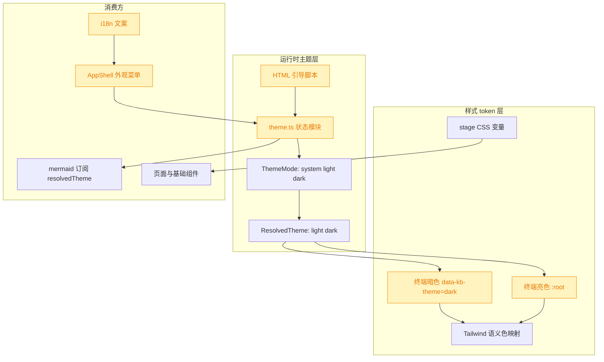
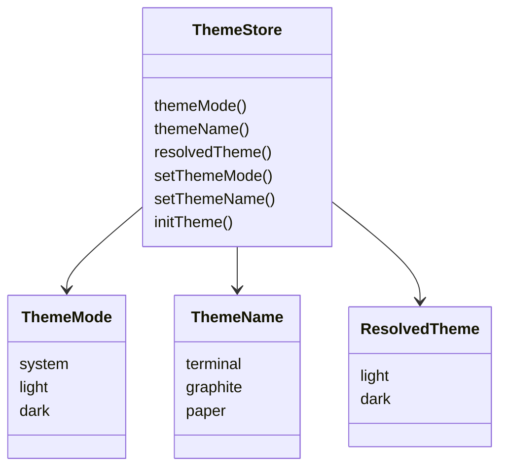
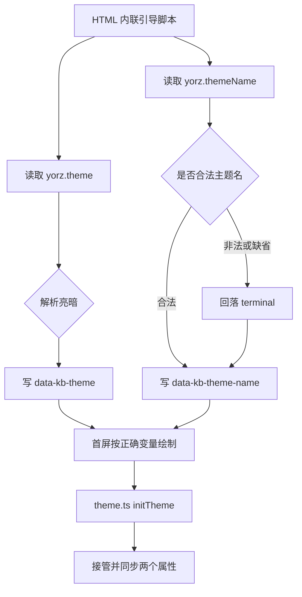

# 主题选择功能

## 1. 背景

类型：feat

原始需求：

> `@.yorz/specs/260807.refct.ui-theme-unify-dark-mode/spec.md` 这个 spec 实现了暗色模式，并默认采用了终端风格配色；
>
> 现在希望实现主题选择功能，参考设计稿：`@.yorz/specs/260807.refct.ui-theme-unify-dark-mode/spec.md`
>
> 默认主题：终端，其他可选：石墨、纸感
>
> 实现“终端”风格时有以下问题，我进行优化，你可以参考：
>
> 1. 设计稿中亮色模式对比度太弱，我调亮了文字区域的背景色，增强了对比度
> 2. 设计稿中暗色模式背景太暗、文字太亮，对比度太强，我稍微调亮了背景、调暗了文字
> 3. spec 四个状态之间的色彩对比度太弱，我进行了调整
>    对应的 git commit `52039a7 * refct/ui feat: 重构主题色，支持暗色模式`

## 2. 需求

- 在现有 `light / dark / system` 色彩模式基础上，新增视觉主题选择维度。
- 支持三套主题：`终端 Terminal`、`石墨 Graphite`、`纸感 Paper`。
- 默认视觉主题为 `终端 Terminal`，并保留当前已优化过的终端亮暗配色作为默认值。
- 主题选择必须持久化，刷新后保持用户选择；首屏加载不得出现从默认主题闪烁到用户主题的明显跳变。
- 主题切换应联动全局 CSS token、Tailwind 语义色、stage 状态色、原生控件 accent-color、Markdown、代码块与 mermaid 容器。
- 新增用户可见文案必须走 `@src/gui/src/i18n/`。
- 不引入与本需求无关的视觉重构；石墨、纸感按既有 token 拓扑补齐变量值，不改变现有页面信息架构。

## 3. 现状分析

当前主题能力已经完成两件关键铺垫：一是 `src/gui/src/lib/theme.ts` 提供了色彩模式的唯一真相源，负责读取 `yorz.theme`、解析系统偏好、写入 `<html data-kb-theme>` 与 `colorScheme`；二是 `src/gui/index.html` 在样式加载前同步运行引导脚本，避免亮暗模式首屏闪烁。新需求不需要重写这条链路，而是在它旁边增加“视觉主题族”状态。

CSS token 层目前只有一套视觉风格：`Terminal`。亮色变量写在 `:root`，暗色变量写在 `[data-kb-theme='dark']`，同时包含 `--primary`、`--accent`、`--success`、`--warning`、`--info`、`--stage-*`、`--font-*`、`--radius` 与 `accent-color`。这套终端变量已包含用户在 commit `52039a7` 中提到的优化：亮色文字区域背景更亮、暗色背景和文字对比更柔和、四个 spec stage 色相被拉开。

交互入口在 `AppShell` 的设置下拉菜单中，“外观”二级菜单目前只承载 `跟随系统 / 亮色 / 暗色` 三个色彩模式选项。把视觉主题放在同一个二级菜单下最符合现有信息架构：主题族和亮暗模式都属于低频外观偏好，不需要新增顶栏按钮。

精确层：相关文件与现有实现

- `@src/gui/src/lib/theme.ts`：已有 `ThemeMode = 'system' | 'light' | 'dark'`、`ResolvedTheme = 'light' | 'dark'`、`THEME_STORAGE_KEY = 'yorz.theme'`、`initTheme()`、`setThemeMode()`。
- `@src/gui/index.html`：内联脚本读取 `localStorage.yorz.theme` 并设置 `data-kb-theme` 与 `style.colorScheme`。
- `@src/gui/src/app.css`：当前 `:root` 与 `[data-kb-theme='dark']` 都是终端主题变量；没有 `data-kb-theme-name` 或等价主题族选择器。
- `@src/gui/src/AppShell.tsx`：`THEME_OPTIONS` 只包含色彩模式；外观二级菜单已有 `data-submenu="theme"` 与 `data-theme-option` 供 e2e 使用。
- `@src/gui/src/i18n/zh-CN.ts`、`@src/gui/src/i18n/en.ts`：已有 `shell.themeSwitch/themeSystem/themeLight/themeDark`，缺少主题族文案。
- `@src/gui/src/__e2e__/theme-switch.spec.ts`：覆盖亮暗切换、持久化、防闪烁、mermaid 重渲染，后续可扩展主题族断言。
- `@src/gui/src/lib/__tests__/theme.test.ts`：覆盖色彩模式解析与 localStorage key 绑定，可补充主题族合法值与默认值。

## 4. 技术实现方案

### 4.1 主题状态模型

在 `theme.ts` 中新增 `ThemeName = 'terminal' | 'graphite' | 'paper'`，并把现有状态模块扩展为双维度：

- `themeMode`：继续表示亮暗选择，沿用 `yorz.theme`，保持现有用户偏好与测试兼容。
- `themeName`：表示视觉主题族，新增 localStorage key `yorz.themeName`，默认 `terminal`。
- `resolvedTheme`：仍只解析为 `light | dark`，供 mermaid 等只关心亮暗的消费方继续使用。
- DOM 属性：继续写 `data-kb-theme="light|dark"`，新增 `data-kb-theme-name="terminal|graphite|paper"`。

这样可以避免破坏现有 `data-kb-theme` 的 Tailwind dark 选择器、mermaid 订阅逻辑和 e2e 断言。视觉主题族只通过 CSS 变量选择器影响外观。

### 4.2 首屏引导与持久化

`index.html` 的同步脚本需要同时处理两个 localStorage key。`yorz.themeName` 缺失或损坏时回落 `terminal`，并在模块加载后的 `initTheme()` 中继续保持同一默认值。由于 CSS 的默认 `:root` 也仍是终端变量，即使脚本失败，默认主题也正确。

### 4.3 CSS token 组织

保留当前 `:root` 和 `[data-kb-theme='dark']` 作为终端主题的默认变量，不搬动已经调优过的终端 token。新增主题族选择器覆盖同一组变量：

- `:root[data-kb-theme-name='graphite']`：石墨亮色。
- `:root[data-kb-theme-name='graphite'][data-kb-theme='dark']`：石墨暗色。
- `:root[data-kb-theme-name='paper']`：纸感亮色。
- `:root[data-kb-theme-name='paper'][data-kb-theme='dark']`：纸感暗色。

石墨主题采用低饱和中性灰阶，主行动近黑/近白，状态语义保持克制色相；目标是信息密度高、视觉噪音低。纸感主题采用暖白纸底、墨黑正文、朱砂/赭色主强调，暗色用暖墨底而不是纯黑，目标是长文 spec 阅读舒适。两套主题都复用现有语义 token，不新增 Tailwind 颜色名。

### 4.4 UI 入口与 i18n

在 `AppShell` 的“外观”二级菜单内拆成两个分组：

- 色彩模式：`跟随系统 / 亮色 / 暗色`，沿用现有选项与 `data-theme-option`。
- 主题：`终端 / 石墨 / 纸感`，新增 `data-theme-name-option`，点击调用 `setThemeName()`。

新增中文与英文词条集中放入 `shell` 命名空间，例如 `themeModeGroup`、`themeNameGroup`、`themeTerminal`、`themeGraphite`、`themePaper`。所有用户可见文字不在 TSX 中硬编码。

### 4.5 验证策略

扩展单测覆盖 `isThemeName()`、默认 key、非法 localStorage 回落；扩展 e2e 覆盖主题族切换后：

- `<html data-kb-theme-name>` 同步更新。
- `localStorage.yorz.themeName` 持久化。
- 刷新早期阶段即可读到正确主题属性，证明引导脚本先于渲染生效。
- 不同主题下 body/card 的计算颜色发生变化，避免只更新状态不更新 token。

`mermaid` 只依赖亮暗模式，主题族切换不必强制重渲染；它的容器、工具条与页面色彩会通过 CSS 变量自然变化。

## 5. 待确认项

_暂无_

## 6. 任务清单

- [x] 扩展 `src/gui/src/lib/theme.ts` 与 `src/gui/index.html` 的主题状态模型，新增 `terminal/graphite/paper` 主题族持久化和 DOM 属性同步（验收：非法值回落默认终端，刷新前后属性一致）
- [x] 在 `src/gui/src/app.css` 增补石墨、纸感亮暗两套 CSS token 覆盖，并保留当前终端 token 作为默认主题（验收：三套主题切换时关键计算颜色不同，stage token 均存在）
- [x] 更新 `src/gui/src/AppShell.tsx` 与 `src/gui/src/i18n/` 的外观菜单，新增主题族选择入口且所有新增文案走 i18n（验收：菜单可选择终端/石墨/纸感，选中项有勾选状态）
- [x] 补充 `src/gui/src/lib/__tests__/theme.test.ts` 与 `src/gui/src/__e2e__/theme-switch.spec.ts` 覆盖主题族合法值、持久化与首屏引导（验收：新增测试断言覆盖 `yorz.themeName`）
- [x] 运行格式化、lint、类型检查与相关测试，并根据结果收尾 spec（验收：命令通过或在执行记录中写明不可执行原因）

## 7. 执行记录

- 2026-08-08 15:08:12：新建 spec，按用户指定类型 `feat` 生成路径 `.yorz/specs/260808.feat.theme-selection/spec.md`，并完成 plan 阶段分析与方案设计。
- 2026-08-08 15:11:30：完成主题选择实现：`theme.ts` 新增 `ThemeName`、`yorz.themeName`、`setThemeName()` 与 DOM 属性同步；`index.html` 引导脚本同步写入 `data-kb-theme-name`。
- 2026-08-08 15:11:30：完成 CSS token 扩展：保留终端主题默认值，新增石墨、纸感亮暗变量覆盖，覆盖品牌色、中性色、状态色、stage 色、字体和圆角。
- 2026-08-08 15:11:30：完成外观菜单与 i18n：在外观二级菜单内增加色彩模式/主题分组，新增终端、石墨、纸感选择项与中英文词条。
- 2026-08-08 15:11:30：完成测试补充：单测覆盖 `isThemeName()` 与 `THEME_NAME_STORAGE_KEY`，e2e 覆盖主题族持久化、首屏引导和非法值回落。
- 2026-08-08 15:12:47：完成验证：`npx prettier --write ...`、`yorz lint .yorz/specs/260808.feat.theme-selection/spec.md --format json`、`pnpm exec vitest run src/gui/src/lib/__tests__/theme.test.ts`、`pnpm run typecheck`、`pnpm run build`、`pnpm exec playwright test src/gui/src/__e2e__/theme-switch.spec.ts` 均通过。
- 2026-08-08 15:12:47：所有非 manual 任务完成，`## 待确认项` 为空，标记 spec 为 `done`。
