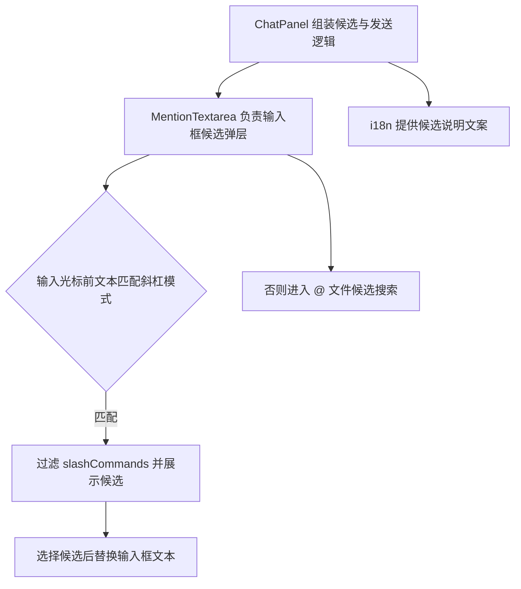
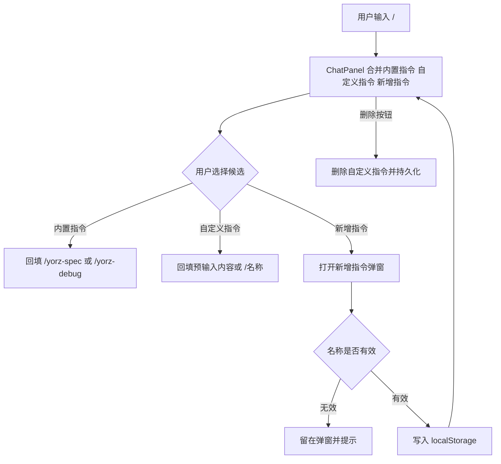
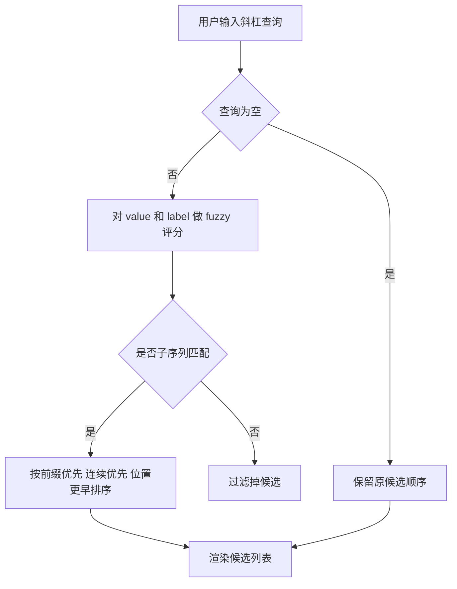
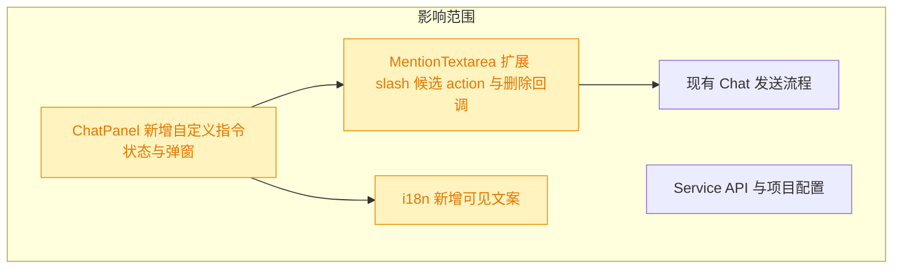

# 自定义斜杠指令候选

## 1. 背景

当前 `@src/gui/src/components/ChatPanel.tsx` 中的 Chat 输入框已支持输入 `/` 触发指令候选，并内置 `yorz-spec`、`yorz-debug` 两个指令。现在需要在候选列表中加入自定义指令管理能力，让用户能新增、选择并删除自定义指令。

## 2. 需求

类型：feat

原始需求：

```text
@src/gui/src/components/ChatPanel.tsx 中的输入框支持斜杠 / 触发指令候选；
当前已经内置 yorz-spec  yorz-debug 指令；

期望指令候选列表，支持自定义选项：
- 在候选列表新增一个 “新增指令” 选项
- 点击/选择 “新增指令” 回车，打开新增指令弹窗
- 新增指令弹窗输入项：名称 （必填）、说明、系统提示词、预输入内容
- 预输入内容 是当用户选择该指令时，回填到输入框的内容
- 自定义指令可被删除

用法举例：
名称： git-commit，说明： 提交当前会话相关的变更文件，系统提示词：使用 git 提交当前会话相关的变更文件，预输入内容：<空>
```

## 3. 现状分析



现有 `/` 指令候选由 `ChatPanel` 通过 `createMemo<SlashCommand[]>` 静态构造，只有 `value` 与 `description`，再传入 `MentionTextarea`。`MentionTextarea` 根据输入框从开头到光标的文本匹配 `/[\w-]*`，过滤候选并渲染弹层；选择候选时总是用 `${item.value} ` 替换开头的斜杠查询。

<details>
<summary>现有实现精确位置</summary>

- `src/gui/src/components/ChatPanel.tsx:160` 构造 `/yorz-debug` 与 `/yorz-spec`。
- `src/gui/src/components/ChatPanel.tsx:631` 发送时读取 `input().trim()`，因此自定义指令选择后只需回填输入框内容即可进入现有发送链路。
- `src/gui/src/components/MentionTextarea.tsx:23` 定义 `SlashCommand`。
- `src/gui/src/components/MentionTextarea.tsx:145` 检查并过滤 `/` 候选。
- `src/gui/src/components/MentionTextarea.tsx:202` 统一处理候选选择并替换输入框内容。
- `src/gui/src/i18n/zh-CN.ts` 与 `src/gui/src/i18n/en.ts` 已包含 `chat.slashCommandYorzDebug`、`chat.slashCommandYorzSpec` 文案，新增可见文案也应继续放入该目录。

</details>

现有能力缺口：

- 候选项没有 action 类型，无法表示“新增指令”这类不回填文本、而是打开弹窗的操作。
- `SlashCommand` 没有区分内置指令与自定义指令，也没有删除入口所需的 id。
- Chat 面板没有自定义指令的持久化状态、弹窗表单和删除处理。
- 当前候选弹层只有纯按钮行，缺少自定义指令删除按钮的事件隔离。
- 追加要求：新增指令候选项需要在前方展示 `+` icon，用于与可直接选择使用的普通指令区分。现有候选渲染集中在 `MentionTextarea`，且已使用 lucide 图标体系，可在 action 类型候选行中渲染 `Plus` 图标。
- 追加修正：`+` icon 当前位于标题行内部，说明文字从图标左侧开始，造成“新增指令”标题与说明文字左边界不齐。应将 icon 作为候选行左侧独立列，并用 `items-center` 在整行高度内垂直居中。
- 追加任务 `[open]`：指令名称当前使用 `startsWith` 前缀匹配，输入 `/gc` 无法匹配 `/git-commit` 这类非连续缩写。`MentionTextarea` 的 slash 候选过滤集中在 `checkSlashCommand`，只需替换该处过滤和排序逻辑。

## 4. 技术实现方案







方案决策：

1. 自定义斜杠指令先以浏览器 `localStorage` 持久化，key 建议为 `yorz.chat.customSlashCommands`。理由：需求限定在 `ChatPanel.tsx` 输入框自定义候选，没有要求跨设备、跨浏览器或写入项目配置；现有 Chat 面板已有多个 localStorage 偏好，最小实现可避免服务端 schema 与 API 变更。
2. `SlashCommand` 扩展为可承载 `kind` 或 `action` 的结构：普通指令选择后回填文本，`add` 类型选择后调用 `onSlashCommandSelect` 打开弹窗。若普通自定义指令的 `prefill` 为空，则回填 `/${name} `，否则回填 `prefill`；这样示例中的 `git-commit` 空预输入仍能将指令名放入输入框，便于发送给 Agent。
3. 自定义指令数据结构建议包含 `id`、`name`、`description`、`systemPrompt`、`prefill`、`createdAt`。当前执行链路只发送输入框文本，`systemPrompt` 暂作为自定义指令元数据保存和展示，不注入发送 API；要真正作为系统提示词影响 Agent 需要后续扩展会话 API 或消息协议。
4. 候选展示顺序保持内置指令在前，自定义指令随后，“新增指令”固定在末尾。删除按钮只展示在自定义指令行，使用 `onMouseDown` 阻止冒泡，避免点击删除时同时选择候选。
5. 新增弹窗字段为名称（必填）、说明、系统提示词、预输入内容；名称规范化为不带开头 `/` 的 `[\w-]+`，保存时按名称去重，重复名称覆盖或阻止提交均可实现。为降低误删风险，删除自定义指令使用行内删除按钮直接删除，不删除内置指令。
6. 所有用户可见文案新增到 `@src/gui/src/i18n/zh-CN.ts` 与 `@src/gui/src/i18n/en.ts` 的 `chat` 命名空间，满足项目国际化要求。
7. 追加决策：在 `SlashCommand` 结构中增加可选 `icon: 'plus'` 标记，由 `ChatPanel` 仅给“新增指令”候选设置该标记，`MentionTextarea` 根据标记在候选标题前渲染 lucide `Plus`。理由：图标是展示属性，放在通用候选模型里可避免用 label 文本判断，后续如需扩展其他 action icon 也更稳定。
8. 追加对齐方案：`MentionTextarea` 的候选行布局调整为“图标列 + 文本列 + 删除列”。图标列只在 `icon === 'plus'` 时渲染，文本列内部继续垂直展示标题和说明，因此“新增指令”与说明文字共享同一左边界；图标列在外层 `items-center` 下垂直居中。
9. 追加 fuzzy 方案：在 `MentionTextarea` 内增加轻量 `scoreFuzzySlashCommand(query, command)`。查询为空时保持原顺序；查询非空时对不带 `/` 的 `value` 和 `label` 分别评分，取最高分。评分规则为子序列匹配，前缀命中加权最高，连续命中加权，字符位置越早越优先，最后按原始顺序稳定排序。理由：slash 指令数量很小，前端本地评分足够；服务端 `scoreFuzzyPath` 偏向路径分隔符和路径长度，不直接复用可避免把路径语义引入指令名称排序。

<details>
<summary>拟改动文件与验收重点</summary>

- `src/gui/src/components/MentionTextarea.tsx`：扩展 `SlashCommand` 和 completion item；选择 slash 候选时支持回调/action；候选行支持可选删除按钮。
- `src/gui/src/components/ChatPanel.tsx`：维护自定义指令列表、读写 localStorage、提供新增弹窗和删除行为；传入扩展后的 slashCommands。
- `src/gui/src/i18n/zh-CN.ts`、`src/gui/src/i18n/en.ts`：新增“新增指令”、弹窗字段、校验错误、删除等文案。
- 追加验收：`新增指令` 候选标题前展示 `Plus` 图标，内置指令和自定义可用指令不展示该图标。
- 追加验收：输入 `/gc` 能匹配 `/git-commit`，输入 `/ys` 能匹配 `/yorz-spec`；空查询 `/` 仍保持原候选顺序。
- 验收：输入 `/` 能看到内置指令、自定义指令和“新增指令”；键盘回车选择“新增指令”能打开弹窗；保存后候选出现；选择自定义指令能回填预输入内容；自定义指令可删除；`pnpm run typecheck` 通过。

</details>

## 5. 待确认项

_暂无_

## 6. 任务清单

- [x] 扩展 `src/gui/src/components/MentionTextarea.tsx` 的 slash 候选模型与选择逻辑，支持普通回填、action 候选和自定义指令删除回调（验收：键盘 Enter/Tab 与鼠标选择仍可工作，删除按钮不触发候选选择）。
- [x] 更新 `src/gui/src/components/ChatPanel.tsx` 的自定义指令状态、localStorage 持久化、新增指令弹窗和删除行为（验收：输入 `/` 可新增、保存、选择、删除自定义指令，并按预输入内容回填）。
- [x] 在 `src/gui/src/i18n/zh-CN.ts` 与 `src/gui/src/i18n/en.ts` 补齐新增指令相关可见文案（验收：新增 UI 不出现硬编码展示文案）。
- [x] 执行类型检查或可用测试验证本次改动（验收：`pnpm run typecheck` 或等价命令通过；若环境失败，在执行记录说明原因）。
- [x] 为“新增指令”slash 候选增加 `Plus` 图标展示能力（验收：只有“新增指令”候选标题前显示加号图标，`pnpm run typecheck` 通过）。
- [x] 调整“新增指令”候选行的 `Plus` 图标与文本列对齐方式（验收：`Plus` 图标垂直居中，标题与说明文字左边界对齐，`pnpm run typecheck` 通过）。
- [x] 将 `src/gui/src/components/MentionTextarea.tsx` 的 slash 指令过滤从前缀匹配改为 fuzzy 评分匹配（验收：`/gc` 可匹配 `/git-commit`，空查询保持原顺序，`pnpm run typecheck` 通过）。

## 7. 追加任务

- [fixed] [feat] 2026-08-11 15:00:57 | 指令名称支持 fuzzy 模糊匹配，当前必须从起始位置完全匹配
  - 描述：指令名称支持 fuzzy 模糊匹配，当前必须从起始位置完全匹配

## 8. 执行记录

- 2026-08-11 14:38:10：新建 spec 并完成 plan 阶段现状分析与技术实现方案；待确认项为空，可继续进入 tasks 阶段。
- 2026-08-11 14:39:12：生成任务清单；待确认项为空，进入 execute 阶段。
- 2026-08-11 14:42:36：完成 `MentionTextarea` slash 候选扩展，支持 action 候选、可配置 replacement 和自定义指令删除回调；删除按钮会阻止候选选择并即时移除弹层行。
- 2026-08-11 14:42:36：完成 `ChatPanel` 自定义斜杠指令本地持久化、新增弹窗、保存校验、候选合并和删除行为；选择“新增指令”会打开弹窗，选择自定义指令会回填预输入内容或指令名。
- 2026-08-11 14:42:36：完成中英文 i18n 文案补充，新增 UI 可见文本均通过 `@src/gui/src/i18n/` 配置。
- 2026-08-11 14:42:36：运行 `npx prettier --write src/gui/src/components/MentionTextarea.tsx src/gui/src/components/ChatPanel.tsx` 与 `pnpm run typecheck`，均通过。
- 2026-08-11 14:42:36：任务清单全部完成，待确认项为空，标记 done。
- 2026-08-11 14:51:24：收到扩展需求“新增指令候选项前方应该添加一个 + icon”；变更重开流程，完成 plan 分析，待确认项为空。
- 2026-08-11 14:52:00：生成追加任务；待确认项为空，进入 execute 阶段。
- 2026-08-11 14:52:49：完成 `MentionTextarea` 的 `icon: 'plus'` 候选展示能力，并在 `ChatPanel` 中仅为“新增指令”候选设置该图标；运行 `npx prettier --write src/gui/src/components/MentionTextarea.tsx src/gui/src/components/ChatPanel.tsx` 与 `pnpm run typecheck`，均通过。
- 2026-08-11 14:52:49：追加任务完成，待确认项为空，标记 done。
- 2026-08-11 14:56:10：收到追加修正“+ icon 垂直居中，新增指令与说明文字对齐”；变更重开流程，生成对齐任务并进入 execute。
- 2026-08-11 14:56:58：完成 `MentionTextarea` 候选行布局调整，将 `Plus` 图标移为文本列左侧独立元素；标题与说明文字左边界对齐，图标在整行内垂直居中。运行 `npx prettier --write src/gui/src/components/MentionTextarea.tsx` 与 `pnpm run typecheck`，均通过。
- 2026-08-11 14:56:58：追加任务完成，待确认项为空，标记 done。
- 2026-08-11 15:01:40：消费 `[open]` fuzzy 追加任务进入 plan；完成现状分析和技术方案，待确认项为空。
- 2026-08-11 15:02:14：生成 fuzzy 匹配执行任务；待确认项为空，进入 execute 阶段。
- 2026-08-11 15:03:09：完成 `MentionTextarea` slash 候选 fuzzy 评分匹配：空查询保持原顺序，非空查询按子序列匹配、前缀优先、连续优先和原始顺序稳定排序；将追加任务标记为 `[fixed]`。运行 `npx prettier --write src/gui/src/components/MentionTextarea.tsx` 与 `pnpm run typecheck`，均通过。
- 2026-08-11 15:03:09：任务清单全部完成，待确认项为空，标记 done。
