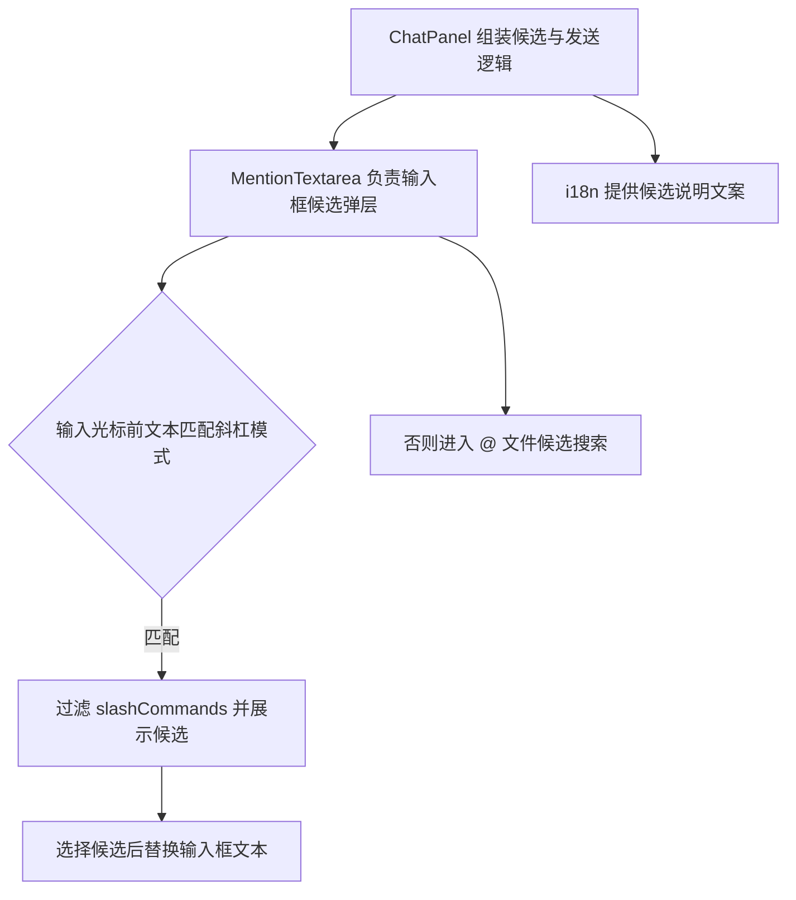
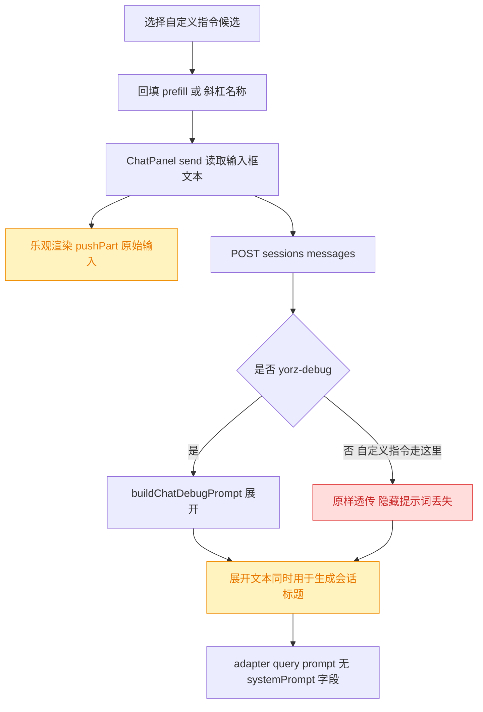
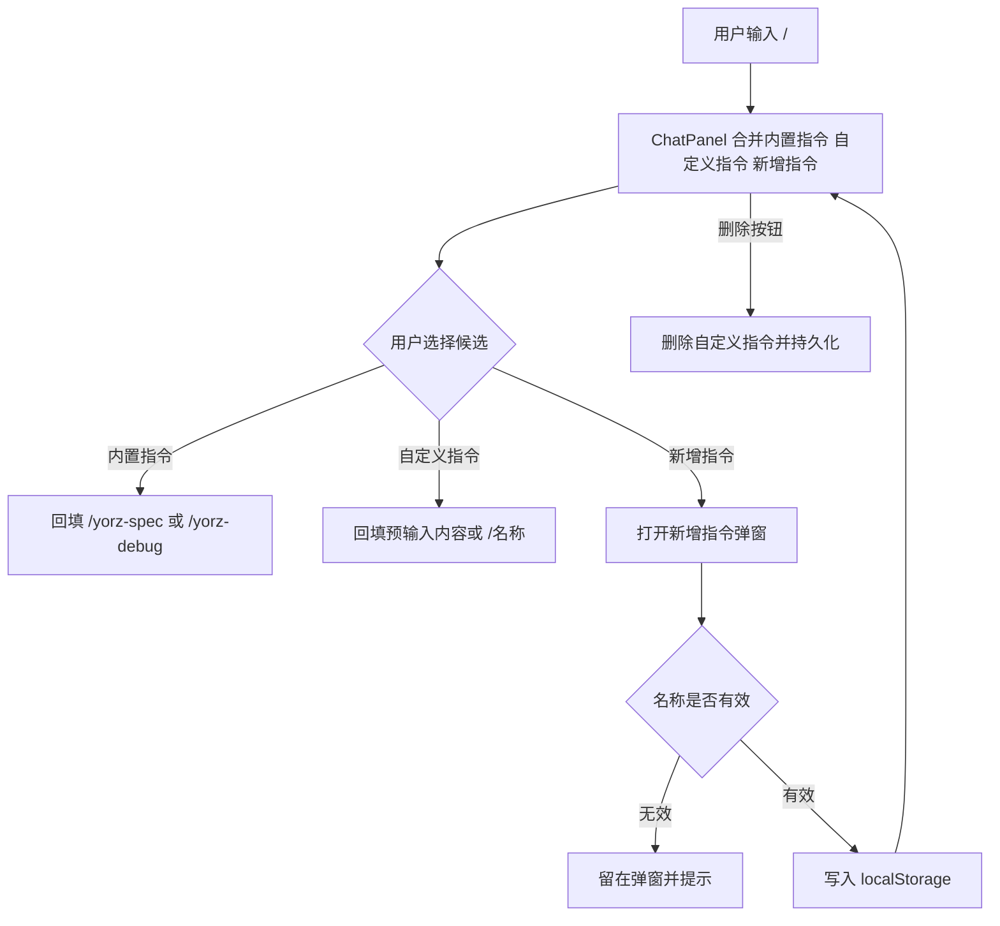
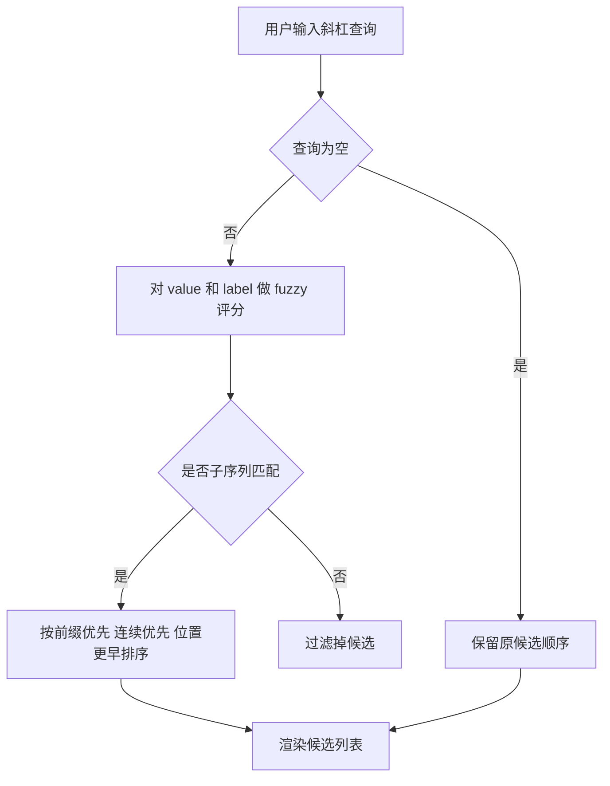
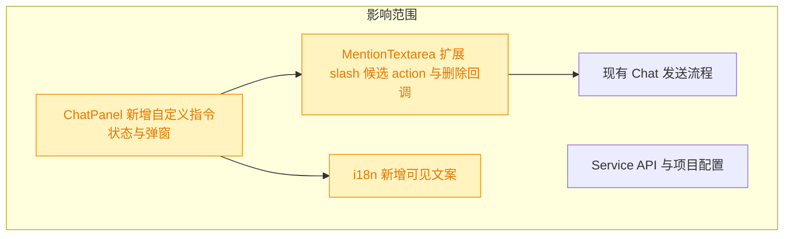
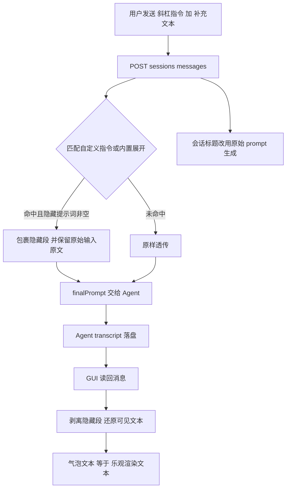
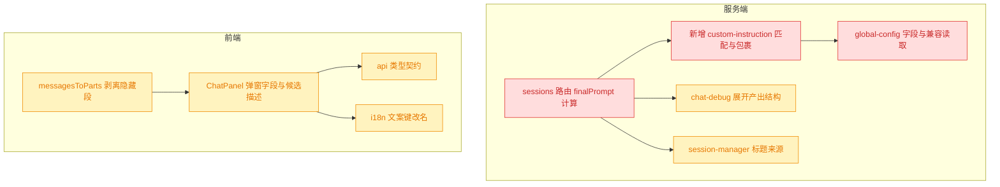

# 自定义斜杠指令候选

## 1. 背景

当前 `@src/gui/src/components/ChatPanel.tsx` 中的 Chat 输入框已支持输入 `/` 触发指令候选，并内置 `yorz-spec`、`yorz-debug` 两个指令。现在需要在候选列表中加入自定义指令管理能力，让用户能新增、选择并删除自定义指令。

## 2. 需求

类型：feat

原始需求：

```text
@src/gui/src/components/ChatPanel.tsx 中的输入框支持斜杠 / 触发指令候选；
当前已经内置 yorz-spec  yorz-debug 指令；

期望指令候选列表，支持自定义选项：
- 在候选列表新增一个 “新增指令” 选项
- 点击/选择 “新增指令” 回车，打开新增指令弹窗
- 新增指令弹窗输入项：名称 （必填）、说明、系统提示词、预输入内容
- 预输入内容 是当用户选择该指令时，回填到输入框的内容
- 自定义指令可被删除

用法举例：
名称： git-commit，说明： 提交当前会话相关的变更文件，系统提示词：使用 git 提交当前会话相关的变更文件，预输入内容：<空>
```

## 3. 现状分析



现有 `/` 指令候选由 `ChatPanel` 通过 `createMemo<SlashCommand[]>` 静态构造，只有 `value` 与 `description`，再传入 `MentionTextarea`。`MentionTextarea` 根据输入框从开头到光标的文本匹配 `/[\w-]*`，过滤候选并渲染弹层；选择候选时总是用 `${item.value} ` 替换开头的斜杠查询。

<details>
<summary>现有实现精确位置</summary>

- `src/gui/src/components/ChatPanel.tsx:160` 构造 `/yorz-debug` 与 `/yorz-spec`。
- `src/gui/src/components/ChatPanel.tsx:631` 发送时读取 `input().trim()`，因此自定义指令选择后只需回填输入框内容即可进入现有发送链路。
- `src/gui/src/components/MentionTextarea.tsx:23` 定义 `SlashCommand`。
- `src/gui/src/components/MentionTextarea.tsx:145` 检查并过滤 `/` 候选。
- `src/gui/src/components/MentionTextarea.tsx:202` 统一处理候选选择并替换输入框内容。
- `src/gui/src/i18n/zh-CN.ts` 与 `src/gui/src/i18n/en.ts` 已包含 `chat.slashCommandYorzDebug`、`chat.slashCommandYorzSpec` 文案，新增可见文案也应继续放入该目录。

</details>

现有能力缺口：

- 候选项没有 action 类型，无法表示“新增指令”这类不回填文本、而是打开弹窗的操作。
- `SlashCommand` 没有区分内置指令与自定义指令，也没有删除入口所需的 id。
- Chat 面板没有自定义指令的持久化状态、弹窗表单和删除处理。
- 当前候选弹层只有纯按钮行，缺少自定义指令删除按钮的事件隔离。
- 追加要求：新增指令候选项需要在前方展示 `+` icon，用于与可直接选择使用的普通指令区分。现有候选渲染集中在 `MentionTextarea`，且已使用 lucide 图标体系，可在 action 类型候选行中渲染 `Plus` 图标。
- 追加修正：`+` icon 当前位于标题行内部，说明文字从图标左侧开始，造成“新增指令”标题与说明文字左边界不齐。应将 icon 作为候选行左侧独立列，并用 `items-center` 在整行高度内垂直居中。
- 追加任务 `[open]`：指令名称当前使用 `startsWith` 前缀匹配，输入 `/gc` 无法匹配 `/git-commit` 这类非连续缩写。`MentionTextarea` 的 slash 候选过滤集中在 `checkSlashCommand`，只需替换该处过滤和排序逻辑。

### 3.1 本轮扩展的现状（隐藏提示词未生效 + 气泡文本不一致）

本轮起因于方案决策 3 遗留的限制：`systemPrompt` 只被保存与展示，从未进入发送链路。实测确认用户配置的 `git-commit` 指令中那 20 字提示词，Agent 从未收到；输入框回填的字面量 `/git-commit ` 被原样发给 Agent。

服务端发送链路上**只有 `/yorz-debug` 一个展开分支**，自定义指令直接走透传：



由此确认三个缺口：

- **隐藏提示词未生效**：`systemPrompt` 在发送链路零引用，仅用于表单存取与候选描述兜底。
- **气泡文本不一致**：乐观渲染写入的是原始输入，刷新后从 Agent transcript 读回的是服务端展开文本。`/yorz-debug` 已可稳定复现；隐藏提示词一旦生效，自定义指令会出现同样的不一致。
- **命名语义不准**：该字段不是 SDK 意义上的 system prompt，叫「系统提示词」会误导用户预期其具备系统级约束力。

<details>
<summary>现状精确位置与实测证据</summary>

- `src/service/routes/sessions.ts:129` 唯一展开分支：`let finalPrompt = isYorzDebugCommand(prompt) ? buildChatDebugPrompt(prompt) : prompt`。
- `src/service/agent-sdk/claude-adapter.ts:110-118` 的 `Options` 未设置 `systemPrompt`/`customSystemPrompt`。
- `src/gui/src/components/ChatPanel.tsx:738`、`:771` 乐观渲染写入 `input().trim()` 原始文本。
- `src/gui/src/components/ChatPanel.tsx:503-509` 切换会话时用 `getSessionMessages` 覆盖为 transcript 内容。
- `src/service/session-manager.ts:242-247` `maybeUpdateTitleFromPrompt` 以传入 prompt 生成标题，当前传的是展开后的 `finalPrompt`。
- `systemPrompt` 全量引用点：`src/service/global-config.ts:73,319`、`src/service/routes/global-config.ts:195-210`、`src/gui/src/lib/api.ts:192`、`src/gui/src/lib/global-config.ts:150`、`src/gui/src/components/ChatPanel.tsx:195,838`，测试 `src/service/__tests__/global-config.test.ts:243,258`、`src/service/__tests__/service.test.ts:353,374`。
- i18n 文案键：`customSlashCommandSystemPrompt` / `customSlashCommandSystemPromptPlaceholder`（`zh-CN.ts:124-125` 与 `en.ts` 对应项）。
- 实测：用户 `~/.config/yorz/config.json` 中 `git-commit` 的 `prefill` 为空、`systemPrompt` 长度 20；Agent transcript 收到的首条 user message 即字面量。

</details>

## 4. 技术实现方案







方案决策：

1. 自定义斜杠指令先以浏览器 `localStorage` 持久化，key 建议为 `yorz.chat.customSlashCommands`。理由：需求限定在 `ChatPanel.tsx` 输入框自定义候选，没有要求跨设备、跨浏览器或写入项目配置；现有 Chat 面板已有多个 localStorage 偏好，最小实现可避免服务端 schema 与 API 变更。
2. `SlashCommand` 扩展为可承载 `kind` 或 `action` 的结构：普通指令选择后回填文本，`add` 类型选择后调用 `onSlashCommandSelect` 打开弹窗。若普通自定义指令的 `prefill` 为空，则回填 `/${name} `，否则回填 `prefill`；这样示例中的 `git-commit` 空预输入仍能将指令名放入输入框，便于发送给 Agent。
3. 自定义指令数据结构建议包含 `id`、`name`、`description`、`systemPrompt`、`prefill`、`createdAt`。当前执行链路只发送输入框文本，`systemPrompt` 暂作为自定义指令元数据保存和展示，不注入发送 API；要真正作为系统提示词影响 Agent 需要后续扩展会话 API 或消息协议。
   > 已由决策 10、11 取代：字段更名为 `hiddenPrompt`，并在服务端注入发送链路。
4. 候选展示顺序保持内置指令在前，自定义指令随后，“新增指令”固定在末尾。删除按钮只展示在自定义指令行，使用 `onMouseDown` 阻止冒泡，避免点击删除时同时选择候选。
5. 新增弹窗字段为名称（必填）、说明、系统提示词、预输入内容；名称规范化为不带开头 `/` 的 `[\w-]+`，保存时按名称去重，重复名称覆盖或阻止提交均可实现。为降低误删风险，删除自定义指令使用行内删除按钮直接删除，不删除内置指令。
6. 所有用户可见文案新增到 `@src/gui/src/i18n/zh-CN.ts` 与 `@src/gui/src/i18n/en.ts` 的 `chat` 命名空间，满足项目国际化要求。
7. 追加决策：在 `SlashCommand` 结构中增加可选 `icon: 'plus'` 标记，由 `ChatPanel` 仅给“新增指令”候选设置该标记，`MentionTextarea` 根据标记在候选标题前渲染 lucide `Plus`。理由：图标是展示属性，放在通用候选模型里可避免用 label 文本判断，后续如需扩展其他 action icon 也更稳定。
8. 追加对齐方案：`MentionTextarea` 的候选行布局调整为“图标列 + 文本列 + 删除列”。图标列只在 `icon === 'plus'` 时渲染，文本列内部继续垂直展示标题和说明，因此“新增指令”与说明文字共享同一左边界；图标列在外层 `items-center` 下垂直居中。
9. 追加 fuzzy 方案：在 `MentionTextarea` 内增加轻量 `scoreFuzzySlashCommand(query, command)`。查询为空时保持原顺序；查询非空时对不带 `/` 的 `value` 和 `label` 分别评分，取最高分。评分规则为子序列匹配，前缀命中加权最高，连续命中加权，字符位置越早越优先，最后按原始顺序稳定排序。理由：slash 指令数量很小，前端本地评分足够；服务端 `scoreFuzzyPath` 偏向路径分隔符和路径长度，不直接复用可避免把路径语义引入指令名称排序。

<details>
<summary>拟改动文件与验收重点</summary>

- `src/gui/src/components/MentionTextarea.tsx`：扩展 `SlashCommand` 和 completion item；选择 slash 候选时支持回调/action；候选行支持可选删除按钮。
- `src/gui/src/components/ChatPanel.tsx`：维护自定义指令列表、读写 localStorage、提供新增弹窗和删除行为；传入扩展后的 slashCommands。
- `src/gui/src/i18n/zh-CN.ts`、`src/gui/src/i18n/en.ts`：新增“新增指令”、弹窗字段、校验错误、删除等文案。
- 追加验收：`新增指令` 候选标题前展示 `Plus` 图标，内置指令和自定义可用指令不展示该图标。
- 追加验收：输入 `/gc` 能匹配 `/git-commit`，输入 `/ys` 能匹配 `/yorz-spec`；空查询 `/` 仍保持原候选顺序。
- 验收：输入 `/` 能看到内置指令、自定义指令和“新增指令”；键盘回车选择“新增指令”能打开弹窗；保存后候选出现；选择自定义指令能回填预输入内容；自定义指令可删除；`pnpm run typecheck` 通过。

</details>

### 4.1 本轮扩展方案（隐藏提示词生效 + 命名调整 + 气泡一致）

核心是引入一层**可剥离的隐藏段标记**：服务端把隐藏提示词包进 `<!-- yorz:hidden -->` 注释块并**保留用户原始输入原文**，GUI 渲染时剥离该块。这样「Agent 收到完整提示词」与「用户只看到自己输入的内容」同时成立，且乐观渲染与 transcript 读回天然一致。



方案决策：

10. **命名统一为 `hiddenPrompt`（隐藏提示词）**。类型字段、API 契约、i18n 键（`customSlashCommandHiddenPrompt*`）与 GUI 标签一并改名。理由：该字段的实际语义是「发送时自动附加、但不在输入框与气泡显示的提示词」，与 SDK 的 system prompt 不是一回事；沿用旧名会让用户误判其约束力。读取侧做**向后兼容**：`normalizeCustomInstructions` 在 `hiddenPrompt` 缺失时回退读取旧 `systemPrompt` 字段，写回时只写新字段，存量配置无需手工迁移、也不会丢数据。
11. **注入走 user message 而非 SDK systemPrompt**。在 `sessions.ts` 现有 `finalPrompt` 计算点旁扩展，读取全局配置的 `customInstructions` 做匹配。理由：与决策 10 的语义一致（它就是提示词正文，不是系统级约束）；若改走 SDK `Options.systemPrompt`，需同时改 `AgentSession.send` 的 `SendOptions` 契约与 claude/opencode/codex 三个 adapter，成本与收益不匹配。
12. **隐藏段格式为 HTML 注释包裹 + 保留原始输入**：

    ```text
    <!-- yorz:hidden -->
    使用 git 提交当前会话相关的变更文件
    <!-- /yorz:hidden -->
    /git-commit 只提交 src 目录
    ```

    隐藏提示词前置（先确立指令语义），用户原始输入**整段保留**（含 `/git-commit` 前缀）。保留前缀让 Agent 知道用户触发了哪个指令，同时使「剥离隐藏段后的文本」与乐观渲染的 `input().trim()` **逐字相等**，一致性无需额外对账。

13. **`prefill` 与 `hiddenPrompt` 的职责边界写死为**：`prefill` 回填进输入框、用户可见可改、是 prompt 的一部分；`hiddenPrompt` 不进输入框、用户在气泡不可见、发送时自动附加。两者可同时为空（退化为回填 `/name `）、可同时配置（回填 prefill 且附加隐藏段）。弹窗字段说明文案需体现该差异。
14. **会话标题改用原始 prompt 生成**。`p.sessions.send` 当前接收 `finalPrompt`，标题由其派生；隐藏段一旦前置，标题会被隐藏提示词首句污染。改为把原始 prompt 作为标题来源传入（`send` 增加可选 `titleSource`，缺省沿用 prompt），避免行为回归。
15. **`/yorz-debug` 一并接入同一机制**。它是当前唯一能复现气泡不一致的路径，把 `buildChatDebugPrompt` 的产出改为「隐藏段 + 原始输入」结构即可复用同一剥离逻辑，不再单独处理。附件路径块（`buildChatPrompt`）同理包进隐藏段。
16. **剥离在 GUI 侧统一入口完成**：`messagesToParts` 处理 user 消息文本时剥离隐藏段。理由：乐观渲染本就是原始输入，只需让读回路径向它对齐，改动集中在一处；服务端不需要额外存 display 字段，消息协议保持不变。

改造影响面（红=行为变更，黄=受影响）：



<details>
<summary>拟改动文件、关键契约与验收重点</summary>

新增：

- `src/service/custom-instruction.ts`：`matchCustomInstruction(prompt, instructions)` 按 `/^\/([\w-]+)(?:\s|$)/` 提名并查表；`wrapHiddenPrompt(hidden, original)` 产出隐藏段结构；`stripHiddenPrompt(text)` 供前端复用同一常量（经 `src/shared` 或前端各自实现，避免 service 代码被打进 GUI bundle）。
- 隐藏段标记常量：`<!-- yorz:hidden -->` / `<!-- /yorz:hidden -->`，剥离正则须容忍首尾空行且非贪婪匹配。

改名（`systemPrompt` → `hiddenPrompt`）：

- `src/service/global-config.ts:73`（接口字段）、`:319`（归一化，新增旧字段回退）。
- `src/service/routes/global-config.ts:195-210`（校验与出参，入参兼容旧字段）。
- `src/gui/src/lib/api.ts:192`、`src/gui/src/lib/global-config.ts:150`（含 localStorage 迁移分支）。
- `src/gui/src/components/ChatPanel.tsx:183`（signal 名）、`:195`（候选描述兜底）、`:838`（保存）。
- `src/gui/src/i18n/zh-CN.ts:124-125` 与 `en.ts` 对应项：键名改为 `customSlashCommandHiddenPrompt` / `...Placeholder`，中文标签「隐藏提示词」，并补充说明其与预输入内容的差异。
- 测试同步：`src/service/__tests__/global-config.test.ts:243,258`、`src/service/__tests__/service.test.ts:353,374`。

行为改动：

- `src/service/routes/sessions.ts:129` 附近：`finalPrompt` 计算扩展为「yorz-debug 展开 → 自定义指令隐藏段包裹 → 附件块」链式处理；标题来源传原始 `prompt`。
- `src/service/session-manager.ts` `send` 签名增加可选标题来源，默认不变。
- `src/service/chat-debug.ts` `buildChatDebugPrompt`：产出改为隐藏段 + 原始输入。
- GUI `messagesToParts`：user 文本剥离隐藏段。

验收重点：

- 配置 `git-commit` 且 `hiddenPrompt` 非空、`prefill` 为空时，发送 `/git-commit`，Agent transcript 首条 user message 含隐藏提示词正文。
- 同一会话气泡在「发送当下」与「切走再切回」两个时刻文本完全一致，且不含隐藏提示词。
- `/yorz-debug xxx` 刷新前后气泡一致，均显示 `/yorz-debug xxx`。
- 会话标题不含隐藏提示词内容。
- 存量 `~/.config/yorz/config.json` 中仅有 `systemPrompt` 字段的指令，升级后仍能读出隐藏提示词，保存一次后落为 `hiddenPrompt`。
- `pnpm run typecheck` 与既有测试通过。

</details>

## 5. 待确认项

_暂无_

## 6. 任务清单

- [x] 扩展 `src/gui/src/components/MentionTextarea.tsx` 的 slash 候选模型与选择逻辑，支持普通回填、action 候选和自定义指令删除回调（验收：键盘 Enter/Tab 与鼠标选择仍可工作，删除按钮不触发候选选择）。
- [x] 更新 `src/gui/src/components/ChatPanel.tsx` 的自定义指令状态、localStorage 持久化、新增指令弹窗和删除行为（验收：输入 `/` 可新增、保存、选择、删除自定义指令，并按预输入内容回填）。
- [x] 在 `src/gui/src/i18n/zh-CN.ts` 与 `src/gui/src/i18n/en.ts` 补齐新增指令相关可见文案（验收：新增 UI 不出现硬编码展示文案）。
- [x] 执行类型检查或可用测试验证本次改动（验收：`pnpm run typecheck` 或等价命令通过；若环境失败，在执行记录说明原因）。
- [x] 为“新增指令”slash 候选增加 `Plus` 图标展示能力（验收：只有“新增指令”候选标题前显示加号图标，`pnpm run typecheck` 通过）。
- [x] 调整“新增指令”候选行的 `Plus` 图标与文本列对齐方式（验收：`Plus` 图标垂直居中，标题与说明文字左边界对齐，`pnpm run typecheck` 通过）。
- [x] 将 `src/gui/src/components/MentionTextarea.tsx` 的 slash 指令过滤从前缀匹配改为 fuzzy 评分匹配（验收：`/gc` 可匹配 `/git-commit`，空查询保持原顺序，`pnpm run typecheck` 通过）。
- [x] 新增 `src/service/custom-instruction.ts`，实现隐藏段标记常量、`matchCustomInstruction`、`wrapHiddenPrompt`、`stripHiddenPrompt`（验收：新增单测覆盖「匹配指令名」「包裹后剥离可还原原始输入」「未命中时原样返回」，`pnpm run typecheck` 通过）。
- [x] 将 `src/service/global-config.ts` 的 `GlobalCustomInstruction.systemPrompt` 改名为 `hiddenPrompt`，并在 `normalizeCustomInstructions` 中回退读取旧 `systemPrompt` 字段（验收：仅含旧字段的配置对象归一化后 `hiddenPrompt` 非空）。
- [x] 更新 `src/service/routes/global-config.ts` 的 `parseCustomInstructions` 校验与出参为 `hiddenPrompt`，入参兼容旧字段（验收：PUT 旧字段负载不报 400 且能读回新字段）。
- [x] 在 `src/service/routes/sessions.ts` 的 `finalPrompt` 计算处接入自定义指令隐藏段包裹，并将标题来源改为原始 prompt（验收：发送 `/git-commit` 后 transcript 含隐藏提示词正文，且会话标题不含该正文）。
- [x] 为 `src/service/session-manager.ts` 的 `send` 增加可选标题来源参数，缺省行为不变（验收：未传参时既有测试全绿）。
- [x] 改造 `src/service/chat-debug.ts` 的 `buildChatDebugPrompt` 与附件块 `buildChatPrompt` 为「隐藏段 + 原始输入」结构（验收：展开结果剥离隐藏段后等于用户原始输入）。
- [x] 更新前端 `src/gui/src/lib/api.ts` 与 `src/gui/src/lib/global-config.ts` 的自定义指令类型与校验为 `hiddenPrompt`，含 localStorage 迁移分支（验收：`pnpm run typecheck` 通过，旧 localStorage 数据仍可迁移）。
- [x] 更新 `src/gui/src/components/ChatPanel.tsx` 的弹窗字段、signal 命名与候选描述兜底为隐藏提示词（验收：弹窗展示「隐藏提示词」与「预输入内容」两个独立字段，保存后写入 `hiddenPrompt`）。
- [x] 在 GUI `messagesToParts` 中剥离 user 文本的隐藏段（验收：发送当下与切走再切回的气泡文本逐字一致，且不含隐藏提示词）。
- [x] 补齐 `src/gui/src/i18n/zh-CN.ts` 与 `en.ts` 的 `customSlashCommandHiddenPrompt` 系列文案并移除旧键（验收：GUI 无硬编码文案，无残留 `SystemPrompt` 键）。
- [x] 同步更新 `src/service/__tests__/global-config.test.ts` 与 `src/service/__tests__/service.test.ts` 中的字段名及兼容用例（验收：`pnpm test` 相关用例通过）。
- [x] 执行 `npx prettier --write` 与 `pnpm run typecheck`、`pnpm test` 验证整体改动（验收：三者均通过；若环境失败，在执行记录说明原因）。

## 7. 追加任务

- [fixed] [feat] 2026-08-11 15:00:57 | 指令名称支持 fuzzy 模糊匹配，当前必须从起始位置完全匹配
  - 描述：指令名称支持 fuzzy 模糊匹配，当前必须从起始位置完全匹配

## 8. 执行记录

- 2026-08-11 14:38:10：新建 spec 并完成 plan 阶段现状分析与技术实现方案；待确认项为空，可继续进入 tasks 阶段。
- 2026-08-11 14:39:12：生成任务清单；待确认项为空，进入 execute 阶段。
- 2026-08-11 14:42:36：完成 `MentionTextarea` slash 候选扩展，支持 action 候选、可配置 replacement 和自定义指令删除回调；删除按钮会阻止候选选择并即时移除弹层行。
- 2026-08-11 14:42:36：完成 `ChatPanel` 自定义斜杠指令本地持久化、新增弹窗、保存校验、候选合并和删除行为；选择“新增指令”会打开弹窗，选择自定义指令会回填预输入内容或指令名。
- 2026-08-11 14:42:36：完成中英文 i18n 文案补充，新增 UI 可见文本均通过 `@src/gui/src/i18n/` 配置。
- 2026-08-11 14:42:36：运行 `npx prettier --write src/gui/src/components/MentionTextarea.tsx src/gui/src/components/ChatPanel.tsx` 与 `pnpm run typecheck`，均通过。
- 2026-08-11 14:42:36：任务清单全部完成，待确认项为空，标记 done。
- 2026-08-11 14:51:24：收到扩展需求“新增指令候选项前方应该添加一个 + icon”；变更重开流程，完成 plan 分析，待确认项为空。
- 2026-08-11 14:52:00：生成追加任务；待确认项为空，进入 execute 阶段。
- 2026-08-11 14:52:49：完成 `MentionTextarea` 的 `icon: 'plus'` 候选展示能力，并在 `ChatPanel` 中仅为“新增指令”候选设置该图标；运行 `npx prettier --write src/gui/src/components/MentionTextarea.tsx src/gui/src/components/ChatPanel.tsx` 与 `pnpm run typecheck`，均通过。
- 2026-08-11 14:52:49：追加任务完成，待确认项为空，标记 done。
- 2026-08-11 14:56:10：收到追加修正“+ icon 垂直居中，新增指令与说明文字对齐”；变更重开流程，生成对齐任务并进入 execute。
- 2026-08-11 14:56:58：完成 `MentionTextarea` 候选行布局调整，将 `Plus` 图标移为文本列左侧独立元素；标题与说明文字左边界对齐，图标在整行内垂直居中。运行 `npx prettier --write src/gui/src/components/MentionTextarea.tsx` 与 `pnpm run typecheck`，均通过。
- 2026-08-11 14:56:58：追加任务完成，待确认项为空，标记 done。
- 2026-08-11 15:01:40：消费 `[open]` fuzzy 追加任务进入 plan；完成现状分析和技术方案，待确认项为空。
- 2026-08-11 15:02:14：生成 fuzzy 匹配执行任务；待确认项为空，进入 execute 阶段。
- 2026-08-11 15:03:09：完成 `MentionTextarea` slash 候选 fuzzy 评分匹配：空查询保持原顺序，非空查询按子序列匹配、前缀优先、连续优先和原始顺序稳定排序；将追加任务标记为 `[fixed]`。运行 `npx prettier --write src/gui/src/components/MentionTextarea.tsx` 与 `pnpm run typecheck`，均通过。
- 2026-08-11 15:03:09：任务清单全部完成，待确认项为空，标记 done。
- 2026-08-13 18:21:33：收到扩展需求「区分预填充内容与隐藏提示词并改名、一并修复气泡文本不一致」；变更重开流程，完成现状分析与技术方案（决策 10–16），补充现状与方案 mermaid 图；待确认项自检后为空，lint 通过。
- 2026-08-13 18:25:05：生成隐藏提示词落地任务清单（12 项），待确认项为空，进入 execute 阶段。
- 2026-08-13 18:30:00：新增 `src/service/custom-instruction.ts`，提供 `HIDDEN_PROMPT_OPEN/CLOSE` 标记、`matchCustomInstruction`、`wrapHiddenPrompt`、`appendHiddenPrompt`、`stripHiddenPrompt` 与 `applyCustomInstruction`；配套新增 `src/service/__tests__/custom-instruction.test.ts`（13 例，覆盖前缀边界 `/git-commit-all` 不误匹配、多块剥离、空隐藏提示词退化）。
- 2026-08-13 18:31:00：完成 `systemPrompt` → `hiddenPrompt` 改名，服务端 `global-config.ts` 与 `routes/global-config.ts` 均保留旧字段回退读取；前端 `api.ts`、`lib/global-config.ts`（localStorage 迁移改为 `toCustomInstruction` 归一化）、`ChatPanel.tsx`、中英 i18n 同步，并为隐藏提示词/预输入内容各补一行 hint 文案说明职责差异。
- 2026-08-13 18:32:00：`routes/sessions.ts` 接入展开链路（debug → 自定义指令 → 附件），附件块改由 `appendHiddenPrompt` 隐藏；`session-manager.send` 增加可选 `titleSource` 并由路由传入原始 prompt，避免标题被隐藏提示词污染；`chat-debug.ts` 的 `buildChatDebugPrompt` 改为「隐藏段 + 原始输入」结构，与自定义指令共用同一剥离逻辑。
- 2026-08-13 18:33:00：GUI `chat-blocks.ts` 增加 `stripHiddenPrompt` 并在 `toPart` 中仅对 user 文本剥离，使 transcript 读回与乐观渲染逐字一致；补充 `global-config.test.ts` 旧 `systemPrompt` 兼容读取用例（原用例改名后已不覆盖该路径）。
- 2026-08-13 18:34:47：以真实 `~/.config/yorz/config.json` 做端到端验证——旧 `systemPrompt` 成功读为 `hiddenPrompt`，`/git-commit 只提交 src 目录` 展开后 Agent 收到隐藏提示词正文，GUI 剥离结果与原始输入完全相等。`pnpm run typecheck` 通过，`pnpm test` 62 文件 538 通过 2 跳过。
- 2026-08-13 18:34:47：任务清单全部完成，待确认项为空，标记 done。
