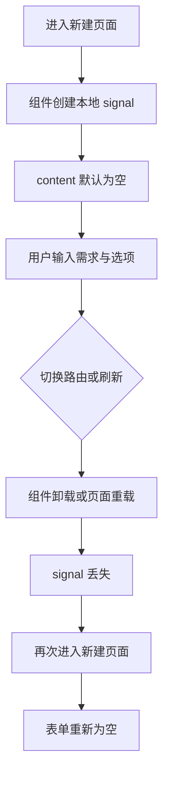
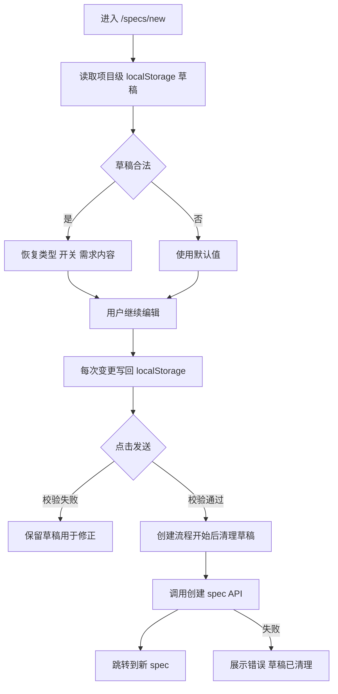
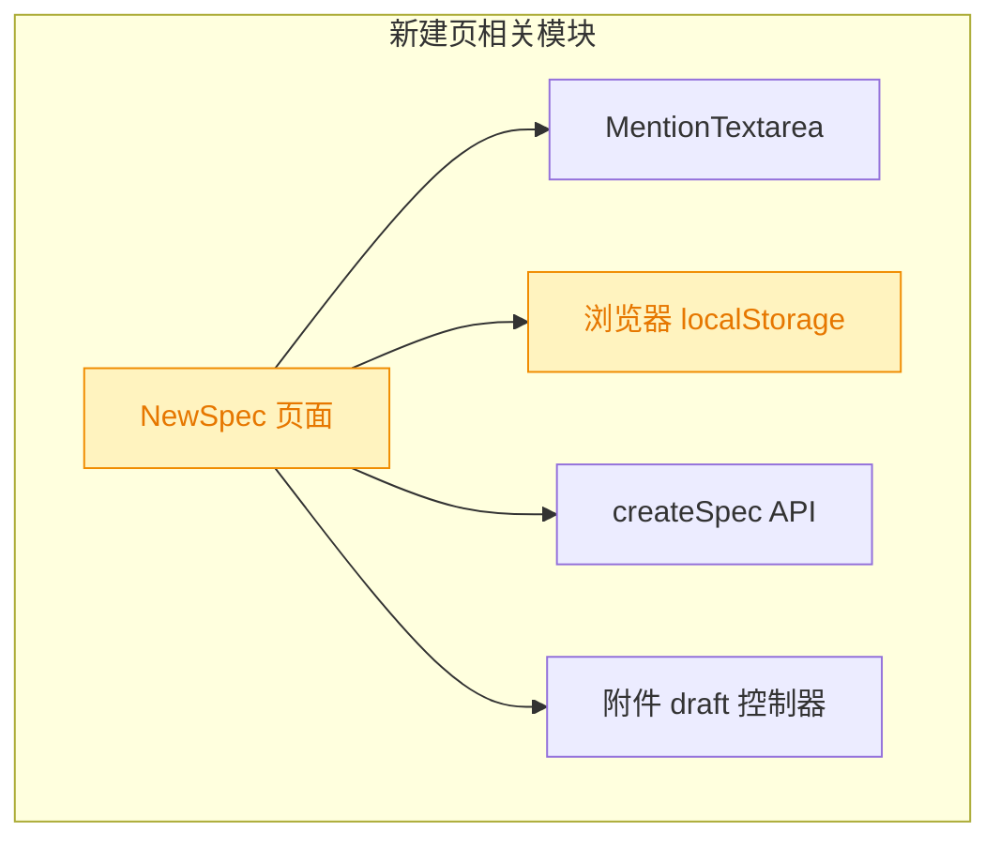

# 新建 Spec 页面草稿记忆

## 1. 背景

当前 `/specs/new` 页面使用组件内状态保存表单内容。用户录入需求后，如果切换路由、刷新页面或离开再回来，已经输入的内容会丢失。

## 2. 需求

原始需求：

> 当前 /specs/new 页面输入内容之后，如果切换路由、刷新页面已输入的内容会被丢失；
>
> 期望自动记忆 /specs/new 页面中的已输入内容
>
> - 切换到/specs/new 自动加载记忆内容
> - 点击“发送”按钮创建 spec 时重置记忆数据

范围界定：

- 记忆 `/specs/new` 的表单输入内容：需求内容、类型选择和“新开项目并行”开关。
- 成功点击发送并进入创建流程后清理记忆，避免回到新建页时再次出现已提交内容。
- 附件不纳入本次浏览器记忆；附件已有 `spec-drafts` 服务端临时上传机制，浏览器刷新后无法可靠恢复本地 `File` 对象。

## 3. 现状分析

现有实现精确层

- `src/gui/src/pages/NewSpec.tsx` 使用 `createSignal('')` 保存 `content`，使用 `createSignal<CreateSpecBody['type']>('feat')` 保存类型，使用 `createSignal(false)` 保存 worktree 开关。
- `MentionTextarea` 通过 `value={content()}` 与 `onValueChange={setContent}` 受控。
- `submit` 中校验 `content().trim()`，然后调用 `api.createSpec(pid, body)`，成功后导航到新创建 spec。
- 项目内已有 `localStorage` 用法，例如主题、语言、侧边栏和 Chat 面板布局；新建页没有草稿持久化逻辑。
- 按项目路由为 `/:projectId/specs/new`，同一个浏览器可能打开多个项目，因此草稿 key 需要包含项目 id。

结论：丢失的根因不是后端问题，而是 `/specs/new` 表单状态仅存在于组件生命周期内；浏览器端持久化即可满足路由切换和刷新恢复。

## 4. 技术实现方案

方案精确层

- 在 `src/gui/src/pages/NewSpec.tsx` 内新增轻量草稿结构，字段包括 `content`、`type`、`useWorktree`。
- 存储 key 使用项目隔离格式，例如 `yorz:new-spec-draft:${projectId}`。
- 读取时捕获 JSON 解析异常，类型非法时回落默认值；损坏数据不阻断页面渲染。
- 使用 Solid 的 effect 监听 `projectId/content/type/useWorktree`，项目 id 存在且不在创建中时写回最新草稿。
- `submit` 只在基础校验和附件状态校验都通过、即将进入创建流程时清理草稿；校验失败保留输入，方便用户修正。
- 创建失败后不恢复已清理草稿。原因是需求明确“点击发送按钮创建 spec 时重置记忆数据”，且此时页面仍保留当前组件内输入，用户可以直接修正重发。
- 不新增展示文案；本次变更无需 i18n 新增 key。

决策说明：

- 采用 `localStorage` 而非 `sessionStorage`，因为需求包含刷新恢复和切换路由恢复，且项目已有 localStorage 持久化心智。
- 草稿按项目隔离，避免多项目之间互相加载错误需求。
- 不持久化附件，避免刷新后出现“看似有附件但实际本地文件不可用”的不一致状态。

## 5. 待确认项

_暂无_

## 6. 任务清单

- [x] 在 `src/gui/src/pages/NewSpec.tsx` 增加项目级草稿读写与清理逻辑（验收：切换路由或刷新后恢复内容，发送校验通过后清理草稿）
- [x] 补充 `/specs/new` 草稿记忆相关自动化覆盖（验收：测试覆盖恢复与发送后清理场景）
- [x] 运行类型检查与相关测试验证（验收：命令通过或记录不可执行原因）

## 7. 执行记录

- 2026-08-11 14:18:15：新建 spec，完成现状分析与技术实现方案；待确认项为空，进入 tasks。
- 2026-08-11 14:22:20：在 `src/gui/src/pages/NewSpec.tsx` 增加项目级 `localStorage` 草稿持久化；进入页面自动恢复，内容为空或默认值时移除草稿，发送校验通过进入创建流程前清理草稿，并避免创建失败后自动写回同一提交快照。
- 2026-08-11 14:22:20：新增 `src/gui/src/__e2e__/new-spec-draft.spec.ts`，覆盖切换路由/刷新后恢复草稿，以及发送进入创建流程后清理草稿。
- 2026-08-11 14:22:20：验证通过：`pnpm run typecheck`、`pnpm run build`、`npx playwright test src/gui/src/__e2e__/new-spec-draft.spec.ts`。
- 2026-08-11 14:22:20：任务全部完成，待确认项为空，标记 done。
