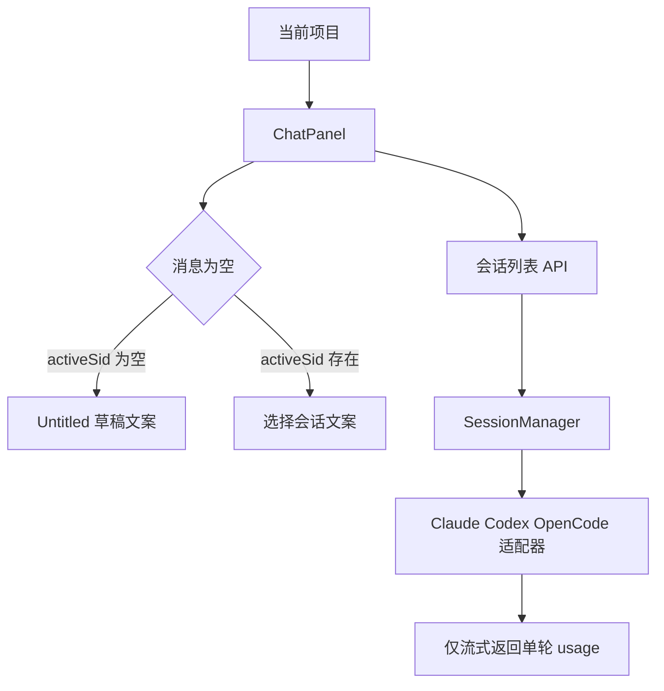
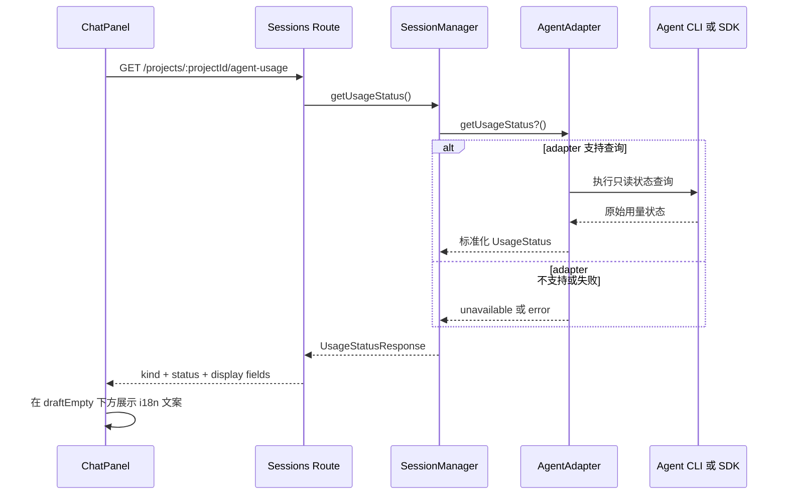
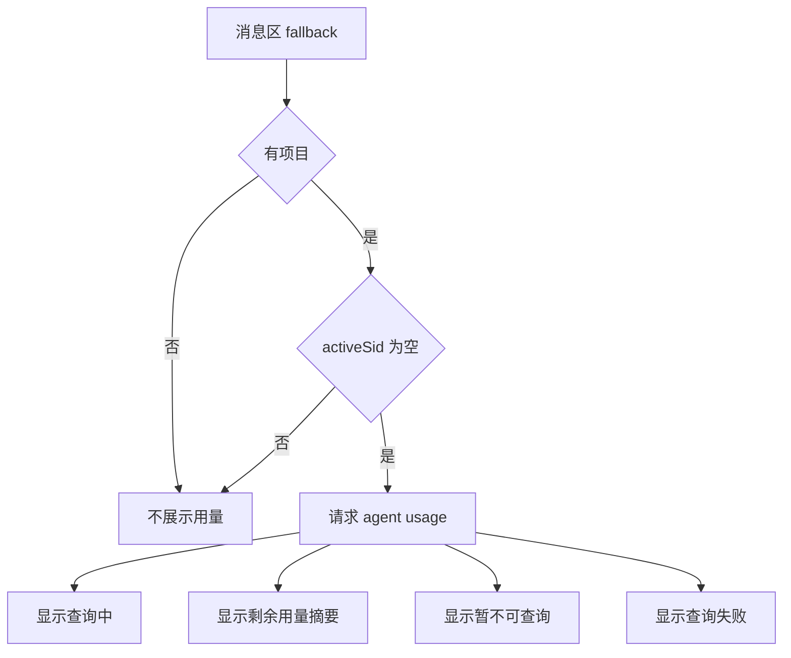
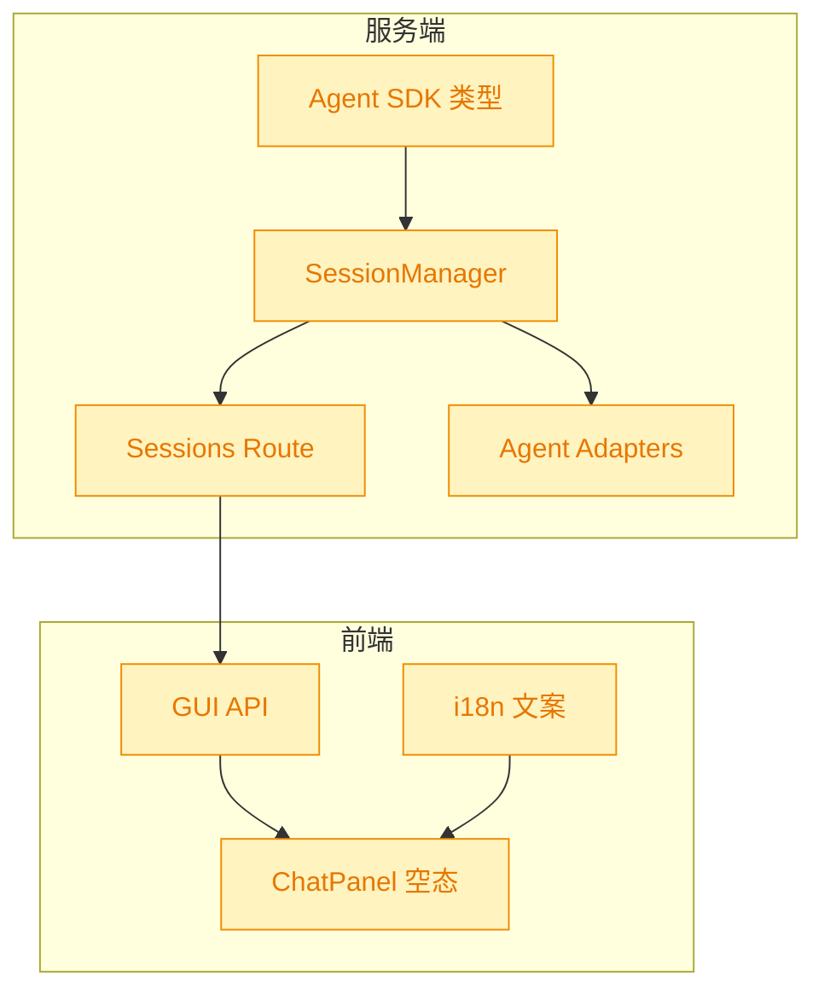

# feat: Chat 空会话展示模型剩余用量

## 1. 背景

用户希望 YorZ 调用 Agent 时，能像 ClaudeCode TUI 的 `/usage`、Codex TUI 的 `/status` 一样查询当前模型剩余用量，并在 Chat 的空会话状态文案“Untitled 会话 —— 发送消息即开始。”下方展示当前模型剩余用量信息。

## 2. 需求

原始需求：

> 调用 Agent 是否有方式可以查询到当前模型的剩余用量，如 ClaudeCode TUI 中的 /usage ， codex TUI 中的 /status；
>
> 我希望在 空会话状态“Untitled 会话 —— 发送消息即开始。” 下方当前模型剩余用量信息

需求拆解：

- 在 Chat 的 Untitled 草稿态空消息区展示当前项目所选 Agent 的模型用量状态。
- 查询能力应跟随当前项目 Agent 配置，不把文案硬编码在组件中。
- 如果当前 Agent 或 CLI 无法可靠查询剩余额度，应展示明确的“暂不可用/无法查询”状态，而不是伪造数字。
- 所有展示给用户的新增文字必须写入 `src/gui/src/i18n/`。

## 3. 现状分析

当前 Chat 空会话态只显示静态 i18n 文案，未请求任何模型状态接口。

现有实现精确层

- `src/gui/src/components/ChatPanel.tsx` 中 `activeSid() ? t('chat.empty') : t('chat.draftEmpty')` 决定空态文案。
- `src/gui/src/i18n/zh-CN.ts` 已有 `chat.draftEmpty: 'Untitled 会话 —— 发送消息即开始。'`。
- `src/gui/src/i18n/en.ts` 已有 `chat.draftEmpty: 'Untitled session — send a message to start.'`。
- `src/service/routes/sessions.ts` 只提供会话列表、创建、消息、abort 等路由。
- `src/service/session-manager.ts` 只维护会话、运行状态和流式事件。
- `src/service/agent-sdk/types.ts` 的 `AgentEvent` 支持 `turn-completed` 携带 `usage?: unknown`，但 `Capabilities` 没有查询剩余用量的能力声明。
- `src/service/agent-sdk/claude-adapter.ts` 与 `src/service/agent-sdk/codex-adapter.ts` 都只在一次 turn 完成后透传 usage，不提供 TUI `/usage` 或 `/status` 等价查询。

关键限制：

- 单轮 `usage` 不是“剩余用量”，不能直接满足用户要展示“当前模型剩余用量”的需求。
- ClaudeCode TUI 的 `/usage` 与 Codex TUI 的 `/status` 可能依赖各自 CLI/TUI 内部实现；YorZ 当前使用 SDK/适配器链路，不能假定这些交互命令可被 SDK 直接调用。
- 当前默认 Agent 配置来自项目配置与全局配置，前端需要通过服务端接口获取当前项目实际 Agent kind，而不是在 GUI 侧猜测。

## 4. 技术实现方案

新增一条只读的“Agent 用量状态”能力链路：GUI 在 Untitled 草稿态加载当前项目用量状态，服务端按项目 Agent kind 调用对应 adapter 的查询方法；adapter 无能力或查询失败时返回结构化不可用状态。

### 4.1 服务端数据模型

在 agent SDK 类型层新增标准化状态类型，字段保持保守：

- `kind`: 当前 Agent kind。
- `status`: `available | unavailable | error`。
- `label`: 可显示摘要，如“剩余额度：...”或“当前 Agent 暂不支持查询剩余用量”。
- `updatedAt`: 查询时间戳。
- `detail?`: 可选详情，供 tooltip 或后续扩展使用。

不把 quota 字段设计成固定数值结构，原因是 ClaudeCode 与 Codex 暴露的信息粒度可能不同；第一版先保证“可查询则展示原始摘要，不可查询则诚实降级”。

### 4.2 Adapter 能力扩展

在 `AgentSdkAdapter` 增加可选方法或 capability：

- `capabilities()` 增加 `usageStatus: boolean`，保持现有适配器向后兼容时需同步更新所有实现。
- 新增 `getUsageStatus?(): Promise<AgentUsageStatus>`。
- Claude/Codex/OpenCode 第一版分别实现只读查询探测；若 CLI/SDK 不提供稳定机器可读输出，则返回 `unavailable` 并带原因。

决策说明：不通过发送聊天消息模拟 `/usage` 或 `/status`。这些命令是 TUI 控制命令，不一定进入 SDK 会话，模拟消息还可能污染用户会话历史。

### 4.3 服务端路由

新增 `GET /api/projects/:projectId/agent-usage` 或挂在现有 sessions route 下的 `GET /projects/:projectId/agent-usage`：

- 复用 `resolveProject` 与项目级 `SessionManager`。
- 调用 `p.sessions.getUsageStatus()`。
- 失败时返回 200 + `status: 'error'`，避免 Chat 空态因为状态查询失败显示错误 toast。

### 4.4 GUI 展示

`ChatPanel` 在有 `activeProjectId()` 且 `activeSid()` 为空时请求用量状态，并在 `chat.draftEmpty` 下方新增一行次级文本。

GUI 改动精确层

- `src/gui/src/lib/api.ts` 新增 `AgentUsageStatus` 类型与 `api.getAgentUsageStatus(pid)`。
- `src/gui/src/components/ChatPanel.tsx` 新增 resource，仅在草稿空态下展示。
- `src/gui/src/i18n/zh-CN.ts` 新增 `chat.usageLoading`、`chat.usageUnavailable`、`chat.usageError` 等文案。
- `src/gui/src/i18n/en.ts` 同步新增英文文案。
- 展示位置应紧贴 `chat.draftEmpty` 下方，使用小字号与 `text-muted-foreground`，避免打断主输入流程。

### 4.5 兼容性与影响范围

该变更是新增只读能力，对现有会话发送链路没有 breaking change；受影响区域集中在 Agent 类型、会话管理、sessions route、GUI API 与 ChatPanel 空态。

## 5. 待确认项

_暂无_

## 6. 任务清单

- [x] 扩展 `src/service/agent-sdk/types.ts` 的 Agent 用量状态类型与 adapter capability（验收：三类 adapter 类型检查通过）
- [x] 在 `src/service/session-manager.ts` 增加项目级 `getUsageStatus()` 并补服务端单元测试（验收：SessionManager 能返回支持/不支持/异常三类状态）
- [x] 在 `src/service/routes/sessions.ts` 暴露只读用量状态接口（验收：HTTP 测试覆盖 200 返回与错误降级）
- [x] 在 Claude adapter 接入 SDK 实验性 `/usage` 数据并为 Codex/OpenCode 返回不可用状态（验收：不通过聊天消息模拟 slash command，Codex/OpenCode capability 明确为 false）
- [x] 在 `src/gui/src/lib/api.ts` 与 `ChatPanel` 空态下方展示用量状态（验收：仅 Untitled 草稿态展示，不影响已选会话空态）
- [x] 在 `src/gui/src/i18n/zh-CN.ts` 与 `src/gui/src/i18n/en.ts` 新增所有用户可见文案（验收：新增展示文案不在组件中硬编码）
- [x] 运行类型检查与相关测试，并修复失败项（验收：`pnpm run typecheck` 与相关 vitest 通过或记录环境阻塞）

## 7. 执行记录

- 2026-08-13 11:46:37：新建 spec，并完成 plan 阶段现状分析与技术实现方案。
- 2026-08-13 11:48:22：完成 tasks 阶段任务拆解，待执行。
- 2026-08-13 11:54:06：完成 Agent 用量状态能力链路：新增标准类型、SessionManager 查询入口、HTTP 路由、Claude 实验性 `/usage` 接入、Codex/OpenCode 不可用降级、GUI API 与 Chat 空态展示。
- 2026-08-13 11:54:06：验证通过：`yorz lint .yorz/specs/260813.feat.model-usage-status/spec.md --format json`、`pnpm run typecheck`、`pnpm vitest run src/service/__tests__/session-manager.test.ts src/service/__tests__/sessions-route.test.ts src/service/__tests__/claude-adapter.test.ts src/service/__tests__/codex-adapter.test.ts`。
- 2026-08-13 11:54:06：全量 `pnpm vitest run` 发现既有非本次链路失败：`src/service/__tests__/spec-review.test.ts` 的 “accepts commit/discard/stash actions and returns {runId}” 在 hook 10000ms 超时；单独重跑同文件仍复现。
- 2026-08-13 11:54:06：任务全部完成，标记 done。
- 2026-08-13 11:55:07：补充验证通过：`pnpm run build`。
