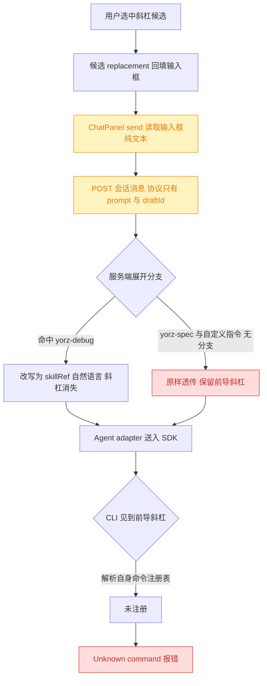
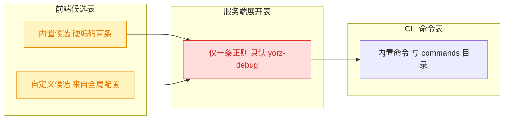
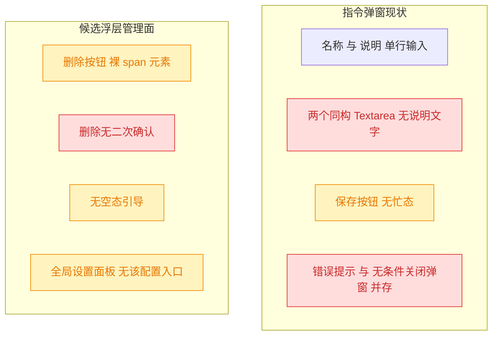
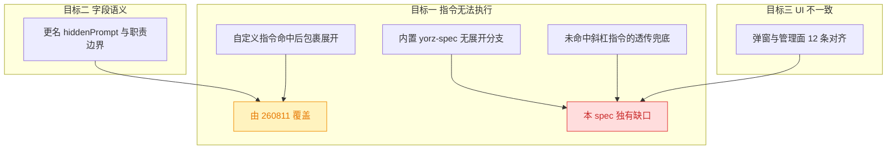
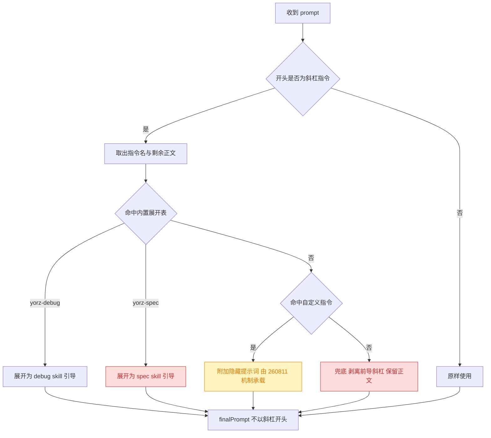
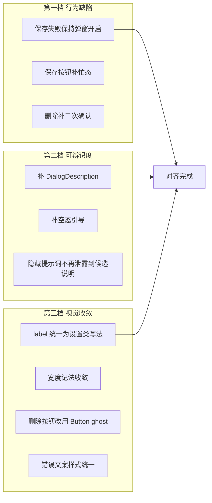
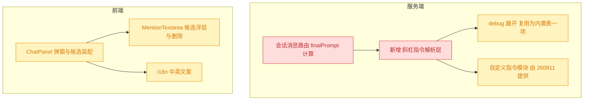

# 自定义斜杠指令执行修复与字段语义澄清

## 1. 背景

`260811.feat.custom-slash-commands` 已为 Chat 输入框补齐自定义斜杠指令的新增 / 选择 / 删除能力，指令弹窗包含「名称 / 说明 / 系统提示词 / 预输入内容」四项。实际使用时发现：在 Chat 输入框选择内置指令 `/yorz-spec` 并发送后，Agent 直接回复 `Unknown command: /yorz-spec`，指令未被正确消费；同时「系统提示词」这一字段名与其真实语义（用户不可见、随消息一并下发的隐藏上下文）不匹配，容易与预填充内容混淆，指令管理界面的样式也与仓库其它设置类界面不一致。

## 2. 需求

类型：fix

原始需求：

```text
在 chat 输入框 无法启用 yorz-spec 指令，以下是发送和 Agent 返回内容

/yorz-spec
1. 期望自定义指令需要区分预填充内容和“系统提示词”，“系统提示词”的语义不太准确，可以改成隐藏提示词之类更符合的名称；
2. 一并修复，UI 不一致的问题

Unknown command: /yorz-spec
```

拆解为三个目标：

1. **修复指令无法执行**：Chat 输入框中选择并发送斜杠指令后，指令必须被正确识别与消费，不能透传成字面量导致 Agent 报 `Unknown command`。
2. **字段语义澄清**：明确区分「预填充内容」（可见、回填输入框、用户可改）与当前叫「系统提示词」的字段（不可见、随消息下发），后者更名为语义更准确的名称（如「隐藏提示词」）。
3. **修复 UI 不一致**：指令管理/新增弹窗的组件用法与视觉规范对齐仓库既有设置类界面。

## 3. 现状分析

### 3.1 根因：`Unknown command` 由外部 CLI 产生，斜杠指令从未被服务端消费

`Unknown command` 这条文本**不存在于本仓库任何源码中**，它来自 Claude Agent SDK 内嵌的 Claude Code CLI：当 prompt 以 `/` 开头时，CLI 按自己的命令注册表解析，查不到即报错。YorZ 的斜杠指令本质只是**输入框文本回填器**，选中候选后输入框里留下的是字面量 `/yorz-spec `，发送时原样进入 Agent。



三层「注册表」并存且互不连通，是问题的结构性来源：



关键点：YorZ 的内置 skill 刻意安装在共享目录而非 Agent 自己的 skills 目录，**Agent 无法按名字发现它们**，只能靠服务端把 prompt 改写成「读取绝对路径 SKILL.md」的自然语言。因此任何「指望 Agent 自己认识 `/yorz-spec`」的路线都必然失败——唯一可行路径就是服务端展开。

<details>
<summary>精确位置与实测证据</summary>

- 唯一展开分支：`src/service/routes/sessions.ts:129`
  `let finalPrompt = isYorzDebugCommand(prompt) ? buildChatDebugPrompt(prompt) : prompt`
- 展开实现：`src/service/chat-debug.ts:10-30`（`isYorzDebugCommand` 正则 `^\/yorz-debug(?:\s|$)`，`buildChatDebugPrompt` 用 `skillRef('yorz-debug')` 改写）
- Prompt 原样入 SDK：`src/service/agent-sdk/claude-adapter.ts:120` `const q = query({ prompt, options })`
- 「Agent 不能按名发现 skill」的刻意设计：`src/service/skill-ref.ts:3-9` 注释；`src/cli/install.ts:15` 只安装 skills，从不写 `.claude/commands/`
- 内置候选硬编码：`src/gui/src/components/ChatPanel.tsx:202-210`（`/yorz-debug`、`/yorz-spec`，后者**无 replacement**）
- 自定义候选回填兜底：`ChatPanel.tsx:190` `const replacement = cmd.prefill.trim() ? cmd.prefill : \`${value} \``
- 发送：`ChatPanel.tsx:729-741`，协议见 `src/gui/src/lib/api.ts:494`，服务端入参 `sessions.ts:117`（仅 `{ prompt, draftId }`）
- 触发条件：`src/gui/src/components/MentionTextarea.tsx:234` `if (!/^\/[\w-]*$/.test(text)) return false`——斜杠只在输入框开头触发
- 全仓 grep `Unknown command` 无命中；SDK 侧证据 `node_modules/@anthropic-ai/claude-agent-sdk/sdk.d.ts:2352` `supportedCommands()`、`:69` "Slash commands are processed."

**旁证（为何"有时能用"）**：自定义指令若填了 `prefill`，回填的是不带 `/` 的纯文本，反而能正常跑；`prefill` 为空时回填 `/name ` 才报错。

</details>

### 3.2 `systemPrompt` 是死字段，命名与语义双重错位

`systemPrompt` 从表单写入全局配置后，在整条发送链路中**零引用**，唯一运行时消费点是候选列表描述的兜底文案。它既没有 SDK 意义上的 system prompt 效力，用户也无法感知其存在，「系统提示词」这一命名会让用户误判其具备系统级约束力。

<details>
<summary>字段定义与全量引用点</summary>

服务端权威定义 `src/service/global-config.ts:69-76`：

```ts
export interface GlobalCustomInstruction {
  id: string
  name: string // 不含前导 /，正则 [\w-]+
  description: string // 候选列表右侧展示
  systemPrompt: string // 存了但从未进入发送链路
  prefill: string // 选中后回填输入框
  createdAt: number
}
```

- 前端镜像：`src/gui/src/lib/api.ts:188-195`；类型守卫 `src/gui/src/lib/global-config.ts:150`
- 服务端归一化 `src/service/global-config.ts:304-325`；请求校验 `src/service/routes/global-config.ts:174-211`
- GUI 消费：`ChatPanel.tsx:195`（描述兜底）、`:838`（保存）、`:1218-1226`（表单）
- i18n：`zh-CN.ts:124-125`「系统提示词」/ `en.ts:127-128` "System Prompt"
- 测试：`src/service/__tests__/global-config.test.ts:243,258`、`src/service/__tests__/service.test.ts:353,374`
- 存储落点：`~/.config/yorz/config.json` 的 `customInstructions`（localStorage 仅剩一次性迁移分支 `src/gui/src/lib/global-config.ts:81,114`）

</details>

### 3.3 UI 不一致：弹窗与设置类界面分属两套写法，且列表管理面缺失范式

指令弹窗本身用了 shadcn 组件，但在**字段可辨识度、异步状态、删除确认、空态、管理入口**五个维度上与仓库既有范式脱节。其中「两个 Textarea 完全同构、都没有说明文字」正是用户混淆预填充与系统提示词的直接诱因——语义差异只存在于命名里，UI 上完全看不出来。



<details>
<summary>逐条不一致点与对照样例</summary>

弹窗位置：`ChatPanel.tsx:1184-1251`（内嵌在 ChatPanel 底部，非独立组件）。

| #   | 不一致点              | 现状                                                                                                                | 对照范式                                                                                                                                     |
| --- | --------------------- | ------------------------------------------------------------------------------------------------------------------- | -------------------------------------------------------------------------------------------------------------------------------------------- |
| 1   | 字段无说明文字        | 两个 Textarea 仅有 placeholder，`ChatPanel.tsx:1218-1237`                                                           | `ProjectConfigDialog.tsx:186` `<span class="text-sm text-muted-foreground">{t('...Hint')}</span>`                                            |
| 2   | 错误提示被吞          | `ChatPanel.tsx:843-847` `catch` 里 `setCustomCommandError()` 后无条件 `setCustomCommandOpen(false)`，错误永远不可见 | `CommandMenu.tsx:180` 保持弹窗开启展示错误                                                                                                   |
| 3   | 保存无忙态            | `ChatPanel.tsx:1245` 仅 `disabled={!name.trim()}`，而保存是异步网络调用                                             | `ProjectConfigDialog.tsx:197` `busy() ? t('common.saving') : ...`；`CommandMenu.tsx:184-193`                                                 |
| 4   | 删除无二次确认        | `ChatPanel.tsx:850-854` 直接落盘                                                                                    | `ProjectsSidebar.tsx:400-438` 确认 Dialog + `variant="destructive"` + 忙态                                                                   |
| 5   | 删除按钮非语义元素    | `MentionTextarea.tsx:437-452` `<span role="button" tabIndex={-1}>`                                                  | 应为 `Button variant="ghost" size="sm"`                                                                                                      |
| 6   | 无空态                | 自定义指令为空时无引导文案                                                                                          | `CommandMenu.tsx:100-102` `{t('commands.empty')}`                                                                                            |
| 7   | 无 DialogDescription  | `ChatPanel.tsx:1192-1194` 仅 `DialogTitle`                                                                          | `ProjectsSidebar.tsx:407` 使用 `DialogDescription`                                                                                           |
| 8   | label 样式两套并存    | 弹窗用 `grid gap-2 text-sm font-medium`（A 套，同 `CommandMenu.tsx:160,170`）                                       | 设置类弹窗用 `flex flex-col gap-1 font-medium`（B 套，`ProjectConfigDialog.tsx:157,167,179`、`AppendTaskDialog.tsx:148`、`NewSpec.tsx:291`） |
| 9   | 宽度记法两套          | `ChatPanel.tsx:1191` `max-w-md`                                                                                     | `ProjectConfigDialog.tsx:126` `max-w-[480px]`、`GlobalConfigDialog.tsx:202` `max-w-[560px]`                                                  |
| 10  | 无设置面板入口        | `GlobalConfigDialog.tsx:135` 仅原样透传 `customInstructions`，不展示不管理                                          | 它是 `GlobalConfig` 一等字段，其余一等字段均有面板入口                                                                                       |
| 11  | 错误文案样式四种写法  | `m-0 text-sm text-destructive` / `m-0 text-destructive` / `" text-destructive"`（多余空格）/ `text-destructive`     | 需收敛为一种                                                                                                                                 |
| 12  | `prefill` 保存未 trim | `ChatPanel.tsx:839` 直接存原值，而 `systemPrompt`/`description` 均 trim                                             | 同一表单内应一致（注：`prefill` 尾部空格可能是有意保留的回填分隔，见方案 §4.4）                                                              |

既有规范 spec 覆盖情况：`260807.refct.ui-theme-unify-dark-mode` 建立了**颜色/token/字体/圆角/动效/无障碍**规范（硬性纪律：GUI 禁止调色板类名与 hex 字面量），但**未涉及表单与弹窗布局规范**（label 间距、字号、分组、按钮忙态、空态、删除确认）——这正是上述 12 条长期存在的原因。`AGENTS.md:4` 是全仓唯一硬性 UI 约定：可见文字必须走 i18n。

</details>

### 3.4 与 `260811` 在途 spec 的边界

调研中发现 `.yorz/specs/260811.feat.custom-slash-commands/spec.md` 已被另一路会话按「变更重开流程」切回并推进至 `stage: execute`，其 §4.1 方案与任务清单覆盖了**字段更名 `systemPrompt` → `hiddenPrompt`**、**隐藏段包裹注入发送链路**、**气泡文本一致性**、**`/yorz-debug` 接入同一机制**。

对照本 spec 三个目标，重叠与缺口如下：



**关键结论**：`260811` 的方案把隐藏提示词前置、用户原文后置，因此 finalPrompt 不再以 `/` 开头——**命中自定义指令的场景会被顺带修好**。但用户实际报障的 `/yorz-spec` 是内置候选、不在 `customInstructions` 中，匹配必然落空、仍走原样透传，**报错依旧存在**；`260811` 的任务清单也完全没有 UI 一致性条目。故本 spec 与其互补而非重复。

## 4. 技术实现方案

### 4.1 总体：把「唯一正则分支」升级为统一的斜杠指令解析层

在服务端新增一个**斜杠指令解析入口**，取代 `sessions.ts:129` 的单条三元表达式。解析顺序为：内置展开表 → 自定义指令表 → 兜底剥离。任何一条路径都保证送入 Agent 的 `finalPrompt` **不以 `/` 开头**，从而在结构上根除 `Unknown command`。



方案决策：

1. **`/yorz-spec` 补齐服务端展开，措辞对齐既有 skill 引导范式。** 与 `/yorz-debug` 同构：用 `skillRef('yorz-spec')` 生成「读取绝对路径 SKILL.md」的自然语言前缀，随后按 chat 场景补充「按 skill 的自动模式判定推进；若会话上下文无 spec 文档，走新建 spec 流程」，再拼接用户在指令后补充的正文。理由：`skill-ref.ts` 的注释已确立这是本项目唯一能让 Agent 加载 skill 的手段；`buildDraftPrompt`（`routes/specs.ts:258`）与 `buildChatDebugPrompt` 均是该范式的既有实例，直接复用可保证行为与 GUI 侧「新建 spec」入口一致。被否决的备选：向 `.claude/commands/` 写入命令文件——与 `skill-ref.ts` 声明的「不让 Agent 按名发现」设计直接冲突，且需为三种 Agent（claude/opencode/codex）各写一套。

2. **未命中的斜杠输入一律兜底包一段隐藏说明，不再透传、也不改写用户文本。** 任何 `^/[\w-]+` 开头且既非内置、也未命中「隐藏提示词非空的自定义指令」的 prompt，都用 `wrapHiddenPrompt` 前置一段说明——告诉 Agent「`/` 是 YorZ 输入框的指令语法，不是你的 slash command，请勿回 `Unknown command`」；若命中的是隐藏提示词为空的自定义指令，说明里额外带上指令名与其 `description`。理由：用户在 YorZ 输入框敲的 `/` 语义永远是「YorZ 指令」，透传只会产生一次无效往返和一条报错。这同时兜住了「自定义指令被删除但历史输入仍以 `/name` 开头」「用户手敲不存在的指令名」「指令未配隐藏提示词」三类场景。

   > **实施期修订**（原方案为「剥离前导 `/`」）：剥离会改写用户文本，使 transcript 读回结果与乐观渲染的气泡不再逐字相等，直接让 `260811` 刚修好的气泡一致性回归。改用隐藏段包裹后，`stripHiddenPrompt` 仍能还原出与用户输入逐字相同的可见文本，两个目标同时成立——这也与 `/yorz-debug`、自定义指令展开走的是同一套机制，无需第二种约定。被否决的备选：① 剥离前导 `/`（破坏气泡一致性）；② 直接返回 400 报错（把一次可降级的输入变成硬失败，且 GUI 侧没有对应的错误展示位）。

3. **解析层落在服务端而非前端。** 沿用 `sessions.ts` 现有 `finalPrompt` 计算点，不扩展消息协议。理由：`/yorz-debug` 的既有实现已在服务端，两处分裂会让「哪些指令真正生效」失去单一真相；且自定义指令的权威数据在服务端 `config.json`，前端解析需要额外保证配置新鲜度。

4. **与 `260811` 的代码边界：本 spec 不改字段名、不实现隐藏段包裹。** `260811` 已于 2026-08-13 18:34:47 收尾为 `done`，`src/service/custom-instruction.ts` 已落地 `matchCustomInstruction` / `wrapHiddenPrompt` / `applyCustomInstruction` / `stripHiddenPrompt`，`sessions.ts` 也已接入自定义指令展开。本 spec 的解析层**复用**这些函数，不重写、不改签名。理由：避免两条 spec 对同一批文件产生互相覆盖的改动。

> 决策记录：待确认项 5.1「本 spec 与在途 `260811` 的推进关系」—— 用户选择「本 spec 只做 `260811` 未覆盖的两块（内置 `/yorz-spec` 展开 + 兜底剥离、UI 一致性），并等 `260811` 收尾为 done 后再进入 execute」。前置条件已满足（`260811` 现为 `stage: done`），据此本轮直接进入 execute，范围收敛为服务端斜杠解析层与 UI 一致性两块。

**基于 `260811` 落地后代码的缺口复核**（决定本 spec 的实际改动面）：

| 输入                                    | 当前服务端行为                                   | 是否仍报 `Unknown command` |
| --------------------------------------- | ------------------------------------------------ | -------------------------- |
| `/yorz-debug …`                         | `buildChatDebugPrompt` 展开                      | 否                         |
| `/name …`（自定义指令，隐藏提示词非空） | `applyCustomInstruction` 前置隐藏段              | 否                         |
| `/name …`（自定义指令，隐藏提示词为空） | `wrapHiddenPrompt` 空 hidden 直接返回原文        | **是**                     |
| `/yorz-spec …`                          | 不在 `customInstructions` 中，匹配落空，原样透传 | **是**                     |
| `/未知名 …`                             | 同上                                             | **是**                     |

后三行即本 spec 目标一的全部工作面。

### 4.2 目标二（字段语义）的处置：声明依赖，不重复实施

「系统提示词 → 隐藏提示词」的更名、读取侧向后兼容、i18n 键替换、职责边界固化，均已由 `260811` 完整落地并收尾。本 spec **不重复实施**，仅承接其一项遗留后果：

- 候选描述兜底当前仍取 `cmd.description || cmd.hiddenPrompt`（`ChatPanel.tsx:195`）。隐藏提示词按新定义就是「用户不可见」的内容，把它当候选说明显示在浮层里与该定义自相矛盾。改为 `cmd.description || t('chat.customSlashCommandNoDescription')`。

> 已由 `260811` 落地、本 spec 不再重复的项：字段更名为 `hiddenPrompt`（含旧字段回退读取）、两个提示词字段各补一行 `text-xs text-muted-foreground` 说明文案（`customSlashCommandHiddenPromptHint` / `customSlashCommandPrefillHint`）。

### 4.3 目标三（UI 不一致）：按「行为缺陷 → 可辨识度 → 视觉收敛」三档处置

不追求一次性统一全仓表单规范（那是独立的重构议题），只做与本弹窗直接相关的对齐，并以「设置类弹窗」为基准。



- **第一档（行为缺陷，必做）**：保存改为 `await` + `busy` signal，失败时**保持弹窗开启**并展示错误；保存按钮补 `busy` 禁用与 `common.saving` 文案；删除补二次确认（复用 `ProjectsSidebar` 的确认 Dialog 范式 + `variant="destructive"` + 忙态）。
- **第二档（可辨识度，必做）**：弹窗补 `DialogDescription`；候选浮层补自定义指令空态；候选描述兜底剔除隐藏提示词（字段说明文案已由 `260811` 落地）。
- **第三档（视觉收敛，随手做）**：label 统一为设置类写法 `flex flex-col gap-1 font-medium`；`max-w-md` 改为与设置弹窗一致的任意值记法；删除按钮改用 `Button variant="ghost" size="sm"`；错误文案统一为 `m-0 text-sm text-destructive`。

约束：新增可见文案一律走 `src/gui/src/i18n/`（`AGENTS.md:4`）；配色一律用语义 token，禁止调色板类名与 hex 字面量（`260807.refct.ui-theme-unify-dark-mode` 硬性纪律）。

> 关于 `prefill` 保存未 trim：**保持不 trim**。`prefill` 尾部空格是回填后让用户直接续写的分隔符（与 `` `${value} ` `` 兜底同理），trim 会破坏该体验；`description` / 隐藏提示词继续 trim。

### 4.4 影响面



<details>
<summary>预期改动文件与验证手段</summary>

服务端：

- 新增 `src/service/slash-command.ts`：内置展开表（`yorz-debug` / `yorz-spec`）、`parseSlashCommand`、`stripLeadingSlash`、统一入口 `resolveChatPrompt`
- `src/service/routes/sessions.ts:129`：改为调用统一入口
- `src/service/chat-debug.ts`：`buildChatDebugPrompt` 保持导出，作为内置表的一项被引用（不改其对外行为）
- 新增单测：内置命中展开、`/yorz-spec` 展开含 skill 引用与 spec 目录、未命中走隐藏段兜底、非斜杠输入原样返回

前端：

- `src/gui/src/components/ChatPanel.tsx`：弹窗字段说明、`DialogDescription`、`busy` 状态与失败不关窗、删除确认、候选描述兜底、label/宽度/错误样式收敛
- `src/gui/src/components/MentionTextarea.tsx`：删除按钮改 `Button variant="ghost"`、自定义指令空态
- `src/gui/src/i18n/zh-CN.ts` 与 `en.ts`：新增说明/空态/确认文案

验证：`npx prettier --write` + `pnpm run typecheck` + `pnpm test`；斜杠解析层以单测为主要验收手段，UI 侧以 typecheck 加人工确认。

</details>

## 5. 待确认项

_暂无_

## 6. 任务清单

- [x] 新增 `src/service/slash-command.ts`：内置展开表（`yorz-debug` 复用 `buildChatDebugPrompt`、`yorz-spec` 新建 `buildChatSpecPrompt` 走 `skillRef`）、未命中隐藏段兜底、统一入口 `resolveChatPrompt(prompt, instructions)` 返回 `{ prompt, builtin }`（验收：`pnpm run typecheck` 通过，且任何 `^/[\w-]+` 输入的返回值都不以 `/` 开头）
- [x] 新增 `src/service/__tests__/slash-command.test.ts` 覆盖五类输入（验收：`/yorz-debug`、`/yorz-spec`、隐藏提示词非空的自定义指令、隐藏提示词为空的自定义指令、未知指令名各一例，加非斜杠输入原样返回，全部断言结果不以 `/` 开头且 `pnpm test` 通过）
- [x] 将 `src/service/routes/sessions.ts` 的 `finalPrompt` 计算改为调用 `resolveChatPrompt`，并按返回的 `builtin` 标记决定是否触发 debug 目录清理（验收：既有 `sessions-route` 相关测试全绿，`/yorz-debug` 行为与清理时机不变）
- [x] 在 `src/gui/src/i18n/zh-CN.ts` 与 `en.ts` 补齐本轮新增可见文案：弹窗说明、删除确认标题/正文、候选无匹配空态（验收：无硬编码展示文案，中英文键一一对应）
- [x] 更新 `src/gui/src/components/ChatPanel.tsx` 的候选描述兜底为 `cmd.description || t('chat.customSlashCommandNoDescription')` 并为弹窗补 `DialogDescription`（验收：隐藏提示词不再出现在候选浮层说明中）
- [x] 将 `ChatPanel.tsx` 的 `saveCustomCommand` 改为异步 + `busy` signal，失败时保持弹窗开启并展示错误、成功后才关闭（验收：保存请求失败时弹窗不关且错误可见，保存中按钮禁用并显示 `common.saving`）
- [x] 为 `ChatPanel.tsx` 的自定义指令删除补二次确认 Dialog，复用 `ProjectsSidebar` 范式（验收：删除前弹确认框，确认按钮 `variant="destructive"`，删除中显示 `common.deleting`）
- [x] 将 `src/gui/src/components/MentionTextarea.tsx` 的删除按钮改为 `Button variant="ghost" size="sm"`，并在斜杠查询无匹配时展示空态行而非隐藏浮层（验收：删除按钮为真实 button 元素且不触发候选选择，输入 `/zzz` 时浮层显示空态文案）
- [x] 收敛 `ChatPanel.tsx` 弹窗视觉写法：label 改为 `flex flex-col gap-1 font-medium`、`max-w-md` 改为与设置类弹窗一致的任意值记法、错误文案统一为 `m-0 text-sm text-destructive`（验收：与 `ProjectConfigDialog` 并排对比无明显差异，且未引入调色板类名或 hex 字面量）
- [x] 执行 `npx prettier --write` 与 `pnpm run typecheck`、`pnpm test` 验证整体改动（验收：三者均通过；若环境失败，在执行记录说明原因）
- [ ] [manual] 在 GUI 中人工回归斜杠指令与弹窗（验收：发送 `/yorz-spec` 不再返回 `Unknown command`；新增/删除弹窗的忙态、失败提示、确认框表现符合预期）

## 7. 执行记录

- 2026-08-13 18:34:12：完成 plan 阶段——定位 `Unknown command` 根因为服务端仅有 `/yorz-debug` 一条展开分支、`/yorz-spec` 与未命中指令原样透传给 CLI；梳理 `systemPrompt` 死字段与 12 条 UI 不一致点；界定与在途 spec `260811` 的边界。因存在文件级冲突风险，写入 1 条待确认项后停止推进。
- 2026-08-13 19:52:30：消费用户批注（选择候选 1），落决策记录；复核 `260811` 已收尾为 `done` 且 `custom-instruction.ts` 已落地，前置条件满足；据最新代码复核缺口，确认 `/yorz-spec`、未知指令名、隐藏提示词为空的自定义指令三类输入仍会透传报错，UI 侧 12 条中第 1 条（字段说明文案）已被 `260811` 覆盖，其余仍在。生成任务清单，进入 execute。
- 2026-08-13 19:58:40：新增 `src/service/slash-command.ts`，提供 `isSlashCommand` / `buildChatSpecPrompt` / `resolveChatPrompt`；`/yorz-spec` 展开为 `skillRef('yorz-spec')` + 自动模式判定说明 + 项目 spec 目录，未命中的斜杠输入包一段「这是 YorZ 指令语法、勿回 Unknown command」的隐藏说明。**实施期修订**：兜底由原方案的「剥离前导 `/`」改为隐藏段包裹，避免改写用户文本导致 `260811` 的气泡一致性回归，已同步回写 §4.1 决策 2。
- 2026-08-13 19:58:40：新增 `src/service/__tests__/slash-command.test.ts`（19 例），对五类输入统一断言「结果不以 `/` 开头」且「`stripHiddenPrompt` 后逐字等于用户原文」；`npx vitest run` 全绿。
- 2026-08-13 19:58:40：`src/service/routes/sessions.ts` 改为调用 `resolveChatPrompt`（仅在输入是斜杠指令时才加载全局配置），debug 目录清理改由返回的 `builtin` 标记触发；`pnpm run typecheck` 通过，`src/service/__tests__` 全量 343 通过 / 2 skipped。
- 2026-08-13 20:01:20：在 `zh-CN.ts` / `en.ts` 补齐 `addSlashCommandDescription`、`slashCommandNoMatch`、`deleteSlashCommandTitle`、`deleteSlashCommandConfirm` 四组中英文案。
- 2026-08-13 20:01:20：`ChatPanel.tsx` 候选描述兜底改为 `cmd.description || t('chat.customSlashCommandNoDescription')`，隐藏提示词不再泄露到候选浮层；弹窗补 `DialogDescription`。
- 2026-08-13 20:02:05：`saveCustomCommand` 改为 `async` + `customCommandBusy`，成功才关窗、失败保留弹窗并展示错误，保存中禁用取消/保存并显示 `common.saving`；`prefill` 保持不 trim 并就地补注释说明原因。
- 2026-08-13 20:02:05：自定义指令删除改为二次确认 Dialog（`variant="destructive"` + `common.deleting` 忙态 + 失败 toast），`onDeleteSlashCommand` 由直接落盘改为打开确认框。
- 2026-08-13 20:03:00：`MentionTextarea.tsx` 重构候选行结构——行高亮移到 `<li>`，删除控件从 `<span role="button">` 改为真实 `Button variant="ghost"` 兄弟节点（原写法是为规避 button 嵌套 button 的非法 HTML，改结构后不再需要）；新增 `slashEmptyLabel` 受控空态，`/` 查询无匹配时展示「没有匹配的指令」而非隐藏浮层。
- 2026-08-13 20:03:30：收敛弹窗视觉写法——label 由 `grid gap-2 text-sm font-medium` 改为设置类弹窗的 `flex flex-col gap-1 font-medium`，`max-w-md` 改为 `max-w-[480px]`，表单容器改 `flex flex-col gap-4`，错误文案维持 `m-0 text-sm text-destructive`；未引入调色板类名与 hex 字面量。
- 2026-08-13 20:04:10：`npx prettier --write`、`pnpm run typecheck`、`pnpm test` 全部通过（63 个测试文件 / 557 passed / 2 skipped）。
- 2026-08-13 20:04:10：范围说明——`## 3.3` 表格第 10 条「全局设置面板无自定义指令入口」不在本轮方案内（`§4.3` 已限定只做与本弹窗直接相关的对齐，新增设置面板管理面属功能迁移，超出 fix 范畴）；第 12 条按 `§4.3` 决策保持 `prefill` 不 trim。
- 2026-08-13 20:04:10：非 manual 任务全部完成，待确认项为 `_暂无_`、无 `！！！` 批注、无 `[open]` 追加任务，标记 done；GUI 人工回归项以 `[manual]` 保留，不阻断收尾。
