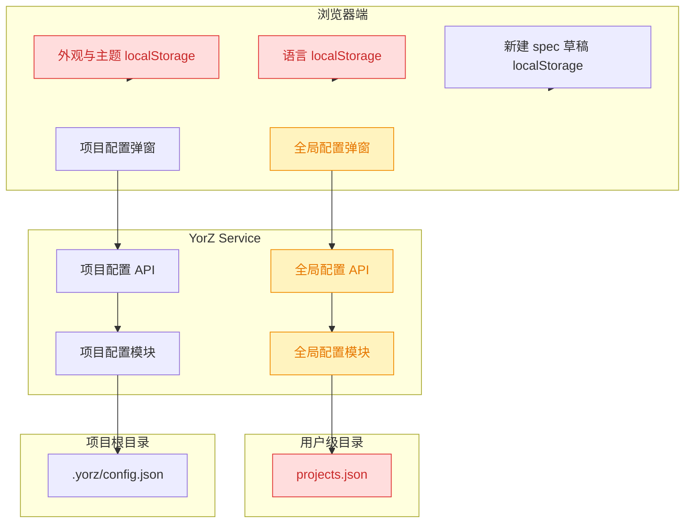
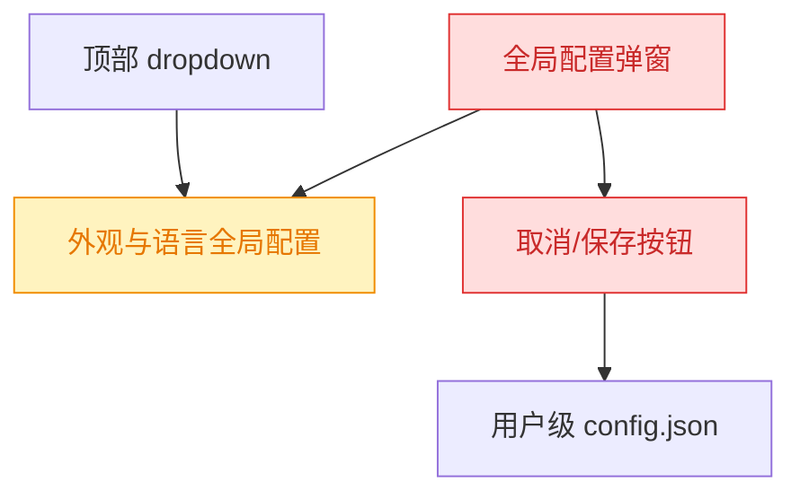
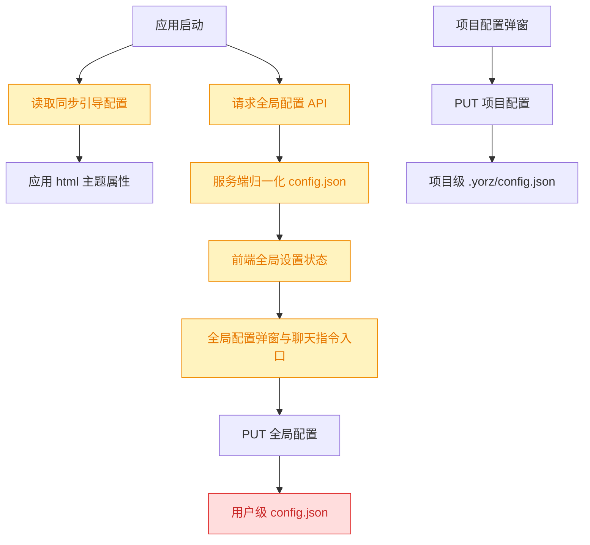
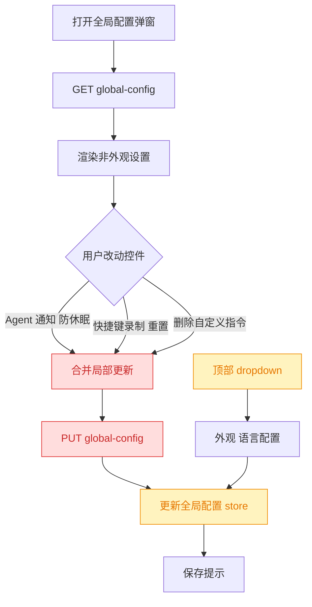

# settings-config-storage

## 1. 背景

用户要求重构配置持久化边界：

> 所有全局设置：外观、主题、全局设置、自定义指令，应该全部存储在 `<user>/.config/yorz/config.json` 文件中，而不是存储在前端浏览器的 `localStorage`。项目自定义设置则存储在 `<project-root>/.yorz/config.json`。

本 spec 类型由调用方指定为 `refct`。

## 2. 需求

全局配置与项目配置需要形成清晰边界：

- 全局设置落到用户级配置文件 `<user>/.config/yorz/config.json`，并由服务端 API 读写。
- 项目自定义设置落到项目级配置文件 `<project-root>/.yorz/config.json`。
- 前端浏览器 `localStorage` 不再作为全局设置的最终持久化位置。
- 外观、主题、现有全局设置、自定义指令都纳入全局配置。
- 需要保留现有配置的兼容读取或迁移路径，避免升级后用户偏好直接丢失。

## 3. 现状分析

当前全局配置已经有服务端模型和 API，但文件名与职责不完全匹配需求：`resolveGlobalConfigPath()` 指向用户级 `projects.json`，其中保存 `projects`、默认 Agent、通知、快捷键和防休眠配置。项目配置模块已经使用 `<project-root>/.yorz/config.json` 保存项目 Agent 覆盖、`specsDir` 与自定义命令，符合项目级配置边界。

前端外观与主题仍直接依赖浏览器存储：`theme.ts` 通过 `yorz.theme`、`yorz.themeName` 读写 `localStorage`，`index.html` 的同步引导脚本也从相同 key 读取以避免首屏闪烁。语言检测配置使用 `i18next-browser-languagedetector` 的 `localStorage` 缓存 `yorz.lang`。这两类均属于全局偏好，和本需求冲突。

“自定义指令”在现有代码中对应聊天面板里的自定义 slash command，当前从代码搜索看更接近组件内状态和对话交互入口，尚未纳入全局配置 API；而项目级自定义命令 `commands` 已明确保存在项目 `.yorz/config.json`，应继续留在项目级配置，不应误迁移到全局配置。

追加任务触发后复查现状：顶部 dropdown 已提供语言、色彩模式和主题族切换，并且直接通过全局配置 store 持久化；`GlobalConfigDialog` 里又重复渲染同一组外观/语言 RadioGroup，形成重复入口。弹窗当前仍是表单提交模型，依赖“取消/保存”按钮一次性写回 `saveGlobalConfig()`；这与追加任务要求的自动保存冲突，也会让删除自定义指令、切换通知/防休眠/快捷键录制在保存前只停留在本地状态。

现状精确层

- `src/service/global-config.ts`：用户级配置目录解析为 `YORZ_HOME`、`XDG_CONFIG_HOME/yorz` 或 `~/.config/yorz`；当前全局配置路径为 `projects.json`。
- `src/service/routes/global-config.ts`：`GET/PUT /api/global-config` 只暴露 `agent`、`notifications`、`shortcuts`、`power`。
- `src/service/project-config.ts`：项目配置路径为 `<project-root>/.yorz/config.json`，字段包括 `agent`、`specsDir`、`commands`。
- `src/gui/src/lib/theme.ts`：主题模式与主题名称使用 `localStorage` key `yorz.theme`、`yorz.themeName`。
- `index.html`：主题首屏引导脚本同步读取 `localStorage`。
- `src/gui/src/i18n/config.ts`：语言检测顺序与缓存都使用 `localStorage`。
- `src/gui/src/components/GlobalConfigDialog.tsx`：全局配置弹窗已走服务端 API，但还没有外观/语言/主题/自定义指令字段。
- `src/gui/src/components/ProjectConfigDialog.tsx`：项目配置弹窗只管理项目 Agent 与 specsDir，保存时保留项目 commands。
- `src/gui/src/components/ChatPanel.tsx`：存在自定义 slash command 的创建表单和运行入口，应作为“自定义指令”纳入用户级全局配置。

## 4. 技术实现方案

全局配置文件路径改为 `<user>/.config/yorz/config.json`，仍沿用现有 `resolveGlobalConfigDir()` 的环境变量优先级，因此测试和用户自定义 `YORZ_HOME`、`XDG_CONFIG_HOME` 行为保持一致。为兼容旧版本，读取阶段在 `config.json` 不存在时回退读取旧 `projects.json` 并归一化；保存阶段只写新 `config.json`，不再继续写旧文件。这样能满足新存储位置，同时降低升级丢项目列表和全局设置的风险。

扩展 `GlobalConfig` 数据模型，新增外观/主题、语言和自定义指令字段。建议结构为 `appearance: { themeMode, themeName, language }` 与 `customInstructions: []`；其中 `customInstructions` 承载聊天面板自定义 slash command 的名称、说明、系统提示词和预输入内容。现有 `agent`、`notifications`、`shortcuts`、`power` 保持在全局配置中。项目配置继续只承担项目 Agent 覆盖、`specsDir` 与项目命令 `commands`。

前端主题模块从“同步读取 localStorage”改为“先用 HTML 内联的服务端引导配置消除闪烁，再由 API 配置接管”。可在服务端静态 HTML 返回阶段注入最小 bootstrap JSON，或提供一个同步可内联的配置片段；若当前静态服务暂不具备注入能力，则首轮实现可使用默认主题首屏加载并在 API 返回后应用，随后再补服务端注入以彻底消除闪烁。无论采用哪种引导方式，`localStorage` 只允许作为一次性旧值迁移来源，迁移成功后删除相关 key，不作为后续持久化源。

语言配置不再让 i18next 自动缓存到 `localStorage`，改为由全局配置 API 驱动 `changeLanguage`。启动时先用默认语言或浏览器语言兜底，待全局配置返回后切换到 `appearance.language`；用户在配置界面修改语言时通过 `PUT /api/global-config` 保存。

自定义指令从组件内临时状态迁移到全局配置。聊天面板加载全局 `customInstructions` 生成 slash command 选项，新增、编辑或删除自定义指令时保存到 `config.json`。所有新增给用户展示的文案必须写入 `src/gui/src/i18n/` 的中英文资源，不直接硬编码在组件中。

追加任务的实现方案是将全局配置弹窗职责收窄为“除外观/语言之外的全局设置管理”：默认 Agent、会话结束提示、自定义指令列表、防休眠和快捷键仍保留在弹窗中；语言、色彩模式、主题族只保留在顶部 dropdown。弹窗不再使用 submit 表单和 `DialogFooter`，也不再展示“取消/保存”按钮。所有可修改控件在变更时立即调用统一的保存函数，把当前配置与局部更新合并后写入全局配置 store。

自动保存采用局部变更驱动而不是 `createEffect` 监听所有 signal，避免打开弹窗加载配置时误触发保存。每个控件的 `onChange`、快捷键录制完成、快捷键重置、自定义指令删除都显式调用 `persistPatch()`。保存期间禁用相关控件并保留错误提示；保存成功后通过 `onSaved` 触发原有 toast。外观字段不由弹窗编辑，但保存其它字段时必须从当前全局配置保留 `appearance`，避免覆盖 dropdown 已写入的外观/语言。

方案精确层

- `src/service/global-config.ts`：将 `resolveGlobalConfigPath()` 改为返回 `config.json`；新增旧路径 helper，例如 `resolveLegacyGlobalProjectsPath()`；扩展默认值和 normalize 逻辑。
- `src/service/routes/global-config.ts`：扩展 `GET/PUT /api/global-config` 的响应和校验，覆盖 `appearance` 与 `customInstructions`。
- `src/gui/src/lib/api.ts`：扩展 `GlobalConfig`、新增 `AppearanceConfig` 与 `CustomInstruction` 类型。
- `src/gui/src/lib/theme.ts`：移除常规 `localStorage` 读写，提供从全局配置初始化/应用主题的 API；旧 key 仅迁移一次。
- `index.html` 或 `src/service/static.ts`：调整主题首屏引导，不再从 `localStorage` 读取最终配置。
- `src/gui/src/i18n/config.ts`：关闭语言 `localStorage` detector cache，改由全局配置驱动。
- `src/gui/src/components/GlobalConfigDialog.tsx`：增加外观、主题、语言、自定义指令管理控件，所有新文案走 i18n。
- `src/gui/src/components/ChatPanel.tsx`：从全局配置读取自定义指令，并将新增/编辑/删除写回全局配置。
- 测试覆盖：`global-config` normalize/迁移、全局配置路由校验、主题模块不再写 localStorage、语言配置不缓存 localStorage、聊天自定义指令持久化。
- 追加任务改动点：`src/gui/src/components/GlobalConfigDialog.tsx` 移除外观/语言 signal、label helper、RadioGroup 和 `DialogFooter`；新增局部自动保存 helper，所有控件变更直接持久化。
- 追加任务测试点：补充或调整 GUI/组件可测路径，至少保证全局配置弹窗不再引用 `appearanceThemeMode`、`appearanceThemeName`、`languageTitle` 文案键，并通过类型检查覆盖移除后的接口。

## 5. 待确认项

_暂无_

## 6. 任务清单

- [x] 扩展 `src/service/global-config.ts` 用户级配置模型与路径（验收：默认路径为 `config.json`，缺省时可兼容读取旧 `projects.json`，normalize 覆盖外观与自定义指令）
- [x] 扩展 `src/service/routes/global-config.ts` 与 `src/gui/src/lib/api.ts` 全局配置 API 契约（验收：GET/PUT 包含 `appearance`、`customInstructions`，无效字段返回 400）
- [x] 重构 `src/gui/src/lib/theme.ts` 与启动入口的主题初始化（验收：运行态不再写 `yorz.theme`/`yorz.themeName` 到 `localStorage`，主题由全局配置应用）
- [x] 重构 `src/gui/src/i18n/config.ts` 与应用入口语言初始化（验收：i18next 不再缓存 `yorz.lang` 到 `localStorage`，语言由全局配置应用）
- [x] 更新 `src/gui/src/components/GlobalConfigDialog.tsx` 管理外观、语言与自定义指令（验收：新增用户可见文案均来自 `src/gui/src/i18n/`）
- [x] 更新 `src/gui/src/components/ChatPanel.tsx` 使用全局 `customInstructions`（验收：自定义 slash command 可从全局配置加载并持久化）
- [x] 补充并调整相关单元测试（验收：配置 normalize、路由校验、主题/语言 localStorage 迁移与自定义指令持久化路径有覆盖）
- [x] 运行验证命令（验收：`pnpm test` 或可用子集通过，`pnpm run typecheck` 通过）
- [x] 从 `src/gui/src/components/GlobalConfigDialog.tsx` 移除外观、主题、语言控件与相关本地状态（验收：弹窗不再引用 `appearanceThemeMode`、`appearanceThemeName`、`languageTitle`）
- [x] 将 `src/gui/src/components/GlobalConfigDialog.tsx` 从手动提交改为局部自动保存（验收：无 `DialogFooter`、无取消/保存按钮，Agent/通知/防休眠/快捷键/自定义指令删除变更时自动 PUT）
- [x] 清理 `src/gui/src/i18n/en.ts` 与 `src/gui/src/i18n/zh-CN.ts` 中仅供弹窗外观/语言使用的文案键（验收：`rg "appearanceTheme|languageTitle" src/gui/src` 无残留）
- [x] 运行追加任务验证命令（验收：`pnpm run typecheck` 与相关测试通过）
- [x] 从 `src/gui/src/components/GlobalConfigDialog.tsx` 移除自定义指令区块（验收：弹窗不再引用 `customInstructionsTitle`、`customInstructionsEmpty`，保存其它设置时不覆盖 `customInstructions`）
- [x] 清理 `src/gui/src/i18n/en.ts` 与 `src/gui/src/i18n/zh-CN.ts` 中仅供弹窗自定义指令区块使用的文案键（验收：`rg "customInstructionsTitle|customInstructionsEmpty" src/gui/src` 无残留）
- [x] 运行自定义指令移除验证命令（验收：`pnpm run typecheck` 与相关测试通过）

## 7. 追加任务

- [fixed] [refct] 2026-08-13 15:52:26 | 1. 全局配置 GUI 弹窗中不需要色彩模式、语言、外观选项，因为外部 dropdown 菜单已经提供了；
  - 描述：1. 全局配置 GUI 弹窗中不需要色彩模式、语言、外观选项，因为外部 dropdown 菜单已经提供了；

2. 全局配置 GUI 弹窗移除“取消/保存”两个按钮，改为自动保存

- [fixed] [refct] 2026-08-13 15:58:25 | 自定义指令也从全局配置弹窗中移除
  - 描述：自定义指令也从全局配置弹窗中移除

## 8. 执行记录

- 2026-08-13 15:21:39：新建 spec，完成现状分析与技术实现方案；待确认项自检后无需阻塞。
- 2026-08-13 15:22:42：生成任务清单，因无待确认项进入 execute。
- 2026-08-13 15:32:29：完成全局配置存储重构。用户级配置默认写入 `config.json` 并兼容读取旧 `projects.json`；前端外观、主题、语言和自定义指令改由全局配置 API 持久化；项目配置继续保留在 `.yorz/config.json`。验证通过：`pnpm run typecheck`、`pnpm test`、`yorz lint .yorz/specs/260813.refct.settings-config-storage/spec.md --format json`。
- 2026-08-13 15:32:29：任务全部完成，标记 done。
- 2026-08-13 15:53:41：针对追加任务完成 plan 与任务拆解，进入 execute。
- 2026-08-13 15:56:24：完成追加任务。全局配置弹窗移除色彩模式、主题族和语言控件；删除底部取消/保存按钮，改为 Agent、通知、防休眠、快捷键和自定义指令删除时自动保存；清理对应 i18n key。验证通过：`pnpm run typecheck`、`pnpm vitest run src/gui/src/lib/__tests__/theme.test.ts src/service/__tests__/global-config.test.ts src/service/__tests__/service.test.ts`、`pnpm test`。
- 2026-08-13 15:56:24：追加任务已标记 fixed；任务全部完成，标记 done。
- 2026-08-13 15:58:25：完成追加任务。全局配置弹窗移除自定义指令列表和删除入口，保留 ChatPanel 作为自定义指令创建/使用入口；弹窗保存其它全局设置时继续保留 `customInstructions`，避免覆盖。验证通过：`pnpm run typecheck`、相关测试、spec lint。
- 2026-08-13 15:58:25：追加任务已标记 fixed；任务全部完成，标记 done。
