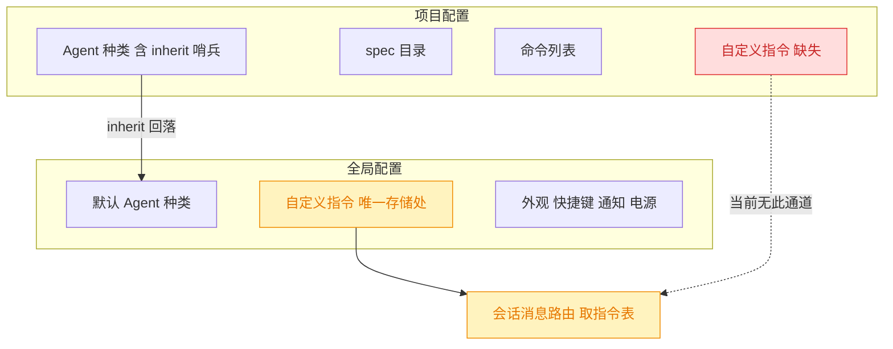
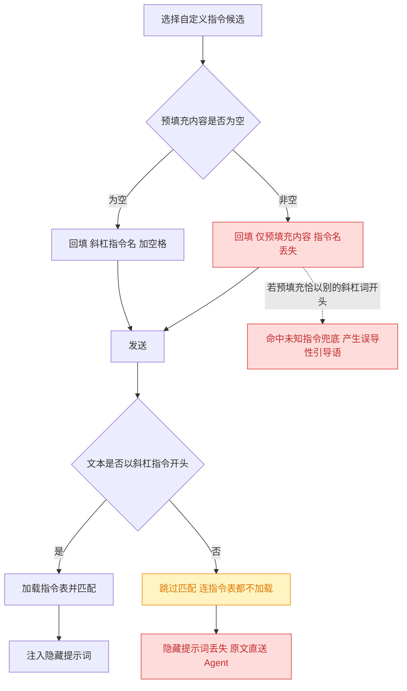
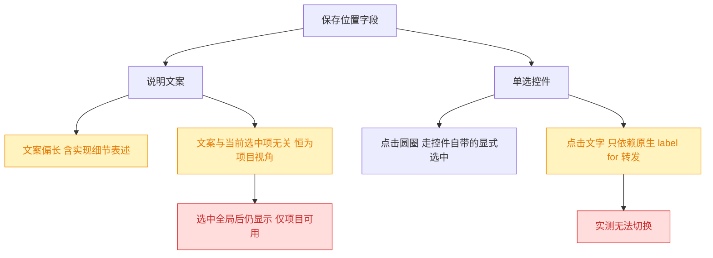
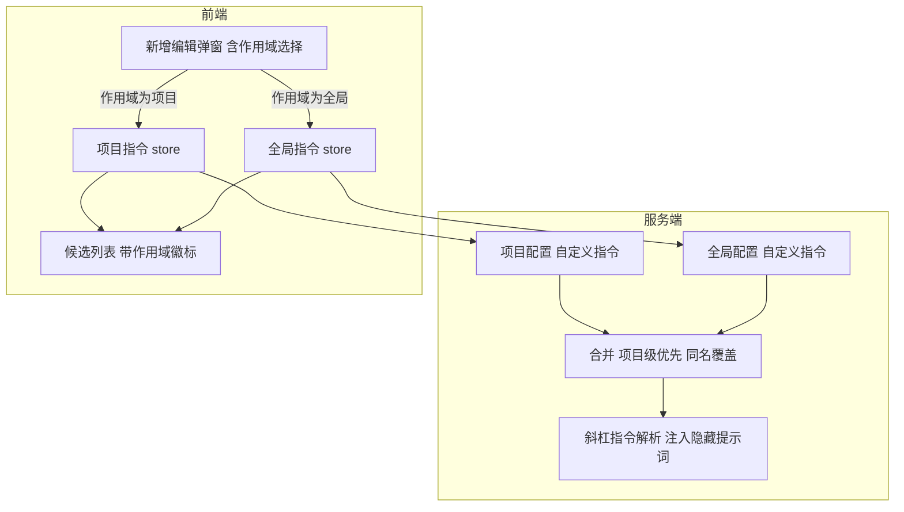
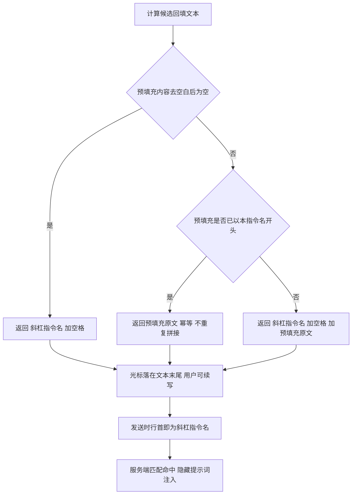
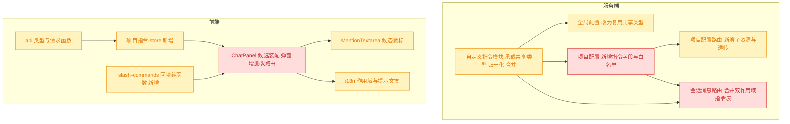

# 项目级自定义指令与预填充保留指令名

## 1. 背景

`260811.feat.custom-slash-commands` 建立了自定义斜杠指令能力，`260813.fix.custom-command-exec-and-naming` 补齐了服务端展开与 UI 一致性。当前自定义指令**只存在全局配置** `~/.config/yorz/config.json` 的 `customInstructions` 中，所有项目共享同一份；而实际使用中大量指令是项目专属的（如某仓库的提交规范、发布流程），放进全局会污染其它项目的候选列表。

同时，指令的「预填充内容」（`prefill`）在回填输入框时会**整段替换掉 `/指令名`**，导致服务端按指令名匹配的链路直接落空。

## 2. 需求

类型：feat

原始需求：

```text
1. 自定义指令存储在 全局配置，需要支持项目级自定义指令；
2. 如果自定指令存在预填充内容，填充内容时需要在输入框中保持指令名称，如 /name <预填充内容>

相关 spec：
@.yorz/specs/260811.feat.custom-slash-commands/spec.md
@.yorz/specs/260813.fix.custom-command-exec-and-naming/spec.md
```

拆解为两个目标：

1. **项目级自定义指令**：自定义指令可存储在项目配置 `<ProjectRoot>/.yorz/config.json`，与全局配置合并后供 Chat 输入框候选与服务端展开使用；新增 / 编辑 / 删除需要能区分并落到正确的作用域。
2. **预填充保留指令名**：`prefill` 非空时，回填结果为 `/指令名 <预填充内容>`，而不是仅有预填充内容。

## 3. 现状分析

### 3.1 自定义指令是纯全局字段，项目配置无对应概念

全局与项目两份配置各自独立归一化、各自落盘，仅 `agent` 一个字段存在「项目回落全局」的合并范式（哨兵值 `inherit`），`customInstructions` / `skills` 纯全局，`commands` 纯项目级。



关键结构性事实：

- 项目配置的归一化是**白名单式**的：写盘前会重建对象，未列入白名单的字段被静默丢弃。因此新增字段必须同步改归一化，否则任何一次保存（包括新增命令）都会把它抹掉。
- 项目配置 `PUT` 路由的请求体只接受两个字段，集合类字段（命令）由**独立路由 CRUD** + 在 `PUT` 中手工透传的方式保全。这是项目配置里「集合子资源」的既有范式，可直接复用。
- 项目配置没有内存缓存与 FS watcher，每次读都直接读盘；只有 `PUT` 路由会主动让项目注册表缓存失效。
- 前端有全局配置的 signal 单例 store，但**没有项目配置 store**，弹窗每次打开直接拉取。

<details>
<summary>精确位置与字段定义</summary>

- 项目配置模块：`src/service/project-config.ts`；`ProjectConfig` 仅 4 个一等字段（`:13-19`）：`version` / `agent` / `specsDir` / `commands`。
- 白名单归一化：`normalizeConfig`（`project-config.ts:91-104`，**未导出**），`saveProjectConfig` 写前强制调用（`:56-68`），tmp + rename 原子写。
- 项目配置路由：`src/service/routes/project-config.ts`；`GET /api/projects/:projectId/config`（`:21`）返回完整 `ProjectConfig`；`PUT`（`:29`）的 `PutBody` 只有 `{ agent, specsDir }`（`:13-16`），`commands` 从旧配置原样带过（`:44-49`，注释 `:41-42`），末尾 `registry.reload(id)`（`:69`）。
- 集合子资源范式：`src/service/routes/commands.ts:23,29,44` + `src/service/command-manager.ts:164,173-190`（load → 改集合 → save）。
- 全局配置：`src/service/global-config.ts`；`GlobalConfig`（`:24-33`）含 `customInstructions`；`GlobalCustomInstruction`（`:69-81`）字段 `id/name/description/hiddenPrompt/prefill/createdAt`；`normalizeCustomInstructions`（`:309-337`，**未导出**）负责去前导 `/`、`^[\w-]+$` 校验、重复 id 丢弃、`hiddenPrompt ?? systemPrompt` 旧键回退。
- 全局配置路由：`src/service/routes/global-config.ts:39`（GET，只回 6 个字段）、`:51`（PUT，read-modify-write 保留 `projects`）、`parseCustomInstructions`（`:174-211`，报错式校验）。
- 唯一 global↔project 合并：`resolveProjectAgentKind`（`src/service/project-registry.ts:253-260`），override 语义、非字段级 deep merge；结果在 `materialize()`（`:189-250`）时快照进 `ProjectInstance`。
- 会话消息路由取指令表：`src/service/routes/sessions.ts:132-139`，`isSlashCommand(prompt)` 为真时才 `loadGlobalConfig()` 取 `customInstructions`，否则传 `[]`；`p.path` 即项目根绝对路径（`:154` 已在用）。
- 前端：`src/gui/src/lib/global-config.ts`（signal 单例、`saveCustomInstructions:60-64`）；`src/gui/src/lib/api.ts` 的 `ProjectConfig:153-162`、`GlobalConfig:164-186`、`CustomInstruction:188-196`、`updateProjectConfig:424-432`（body 硬编码两字段）；`src/gui/src/lib/` 下**不存在** project-config store。
- 指令管理 UI 不在设置弹窗里，而在 `src/gui/src/components/ChatPanel.tsx:186,197-234,840-903`；project 上下文可用（`activeProjectId()`，`ChatPanel.tsx:185,1147`）。
- 旁路风险：`src/service/agent-config.ts:47-71,145-187` 是 `project-config.ts` 的同步镜像实现，只读 `agent`，不涉及本次新增字段。

</details>

### 3.2 `prefill` 非空会整段吃掉 `/指令名`，隐藏提示词随之失效

候选回填时，slash 分支从下标 0 起把 `/查询词` 整段替换为 `replacement`；而自定义指令的 `replacement` 在 `prefill` 非空时**就是 prefill 原文**，不含 `/指令名`。发送后服务端的匹配入口以「行首 `/名字` + 空白或结尾」为唯一线索，链路必然落空。



由此得到三条确定结论：

- **`prefill` 与 `hiddenPrompt` 当前互斥**：配置了非空 `prefill`，该指令的 `hiddenPrompt` 就是死配置。
- **存在隐式约定但无任何提示**：用户把 `prefill` 写成 `/指令名 …` 才能正常工作，而 UI 提示文案完全没提这一点。
- **误导性分支**：`prefill` 若以另一个 `/词` 开头，会命中「未知指令」兜底，产出「该指令未在 YorZ 中配置」的引导语，比丢失隐藏提示词更糟。

<details>
<summary>精确位置与推理链</summary>

- `src/gui/src/components/ChatPanel.tsx:201`：`const replacement = cmd.prefill.trim() ? cmd.prefill : \`${value} \``——非空分支不拼 `/name`。
- `src/gui/src/components/MentionTextarea.tsx:249`：触发门槛 `/^\/[\w-]*$/.test(text)`，保证触发时输入框内容就是 `/查询词`。
- `MentionTextarea.tsx:314-340` `selectItem`：slash 分支 `start = 0`、`before = ''`、`after = ''`，故 `onValueChange(replacement)`，`/name` 被完全删除；光标固定落在 `replacement` 末尾（`:333,337`）。
- `src/service/custom-instruction.ts:20,23-31`：`SLASH_NAME_RE = /^\/([\w-]+)(?:\s|$)/`，对 `prompt.trim()` 取名后按 `item.name` 全等查表。
- `src/service/slash-command.ts:31-33,86-109`：`isSlashCommand` 同一正则；`resolveChatPrompt` 首个分支即「非斜杠 → 原样返回」，`matchCustomInstruction` 根本不会被调用。
- `src/service/routes/sessions.ts:132`：`isSlashCommand(prompt)` 为假时连全局配置都不加载。
- 测试盲区：`src/service/__tests__/custom-instruction.test.ts:17`、`slash-command.test.ts:13` 的 fixture `prefill` 均为 `''`；`sessions-route.test.ts` 无自定义指令端到端用例；`ChatPanel.tsx` / `MentionTextarea.tsx` 无组件测试，`replacement` 计算零覆盖。
- 唯一出现非空 `prefill` 的用例 `src/service/__tests__/global-config.test.ts:238-262` 只验证归一化，不触发送链路。
- 提示文案：`src/gui/src/i18n/zh-CN.ts:135`、`en.ts:141-142` 的 `customSlashCommandPrefillHint` 未提及前缀约定。

</details>

### 3.3 本轮扩展的现状（弹窗提示语与候选徽标需移除）

本轮两处均为上一轮刚落地元素的回收，且都已确认只有单一消费者：

- 指令弹窗的 `DialogDescription` 是 `260813` 为对齐设置类弹窗补上的，本轮由决策 6 之外的文案改动更新过一次；它只承载「自定义指令在输入框中键入 `/` 即可使用，可保存在当前项目或全局。」这一句（编辑态为对应的另一句）。
- 候选行的作用域徽标由本 spec 决策 6 引入，`badge` 字段从 `SlashCommand` 一路透传到候选行渲染，除自定义指令候选外无其它使用方。

<details>
<summary>精确位置与引用面</summary>

- 弹窗描述：`src/gui/src/components/ChatPanel.tsx:1305-1309`（`DialogDescription` 元素，按 `editingCommandId()` 二选一）；文案键 `chat.addSlashCommandDescription`（`zh-CN.ts:120`、`en.ts:123`）与 `chat.editSlashCommandDescription`（`zh-CN.ts:122`、`en.ts:126`），全仓仅此一处消费。
- 候选徽标：`ChatPanel.tsx:230` 装配 `badge`；`MentionTextarea.tsx:34`（`SlashCommand.badge`）、`:52`（`CompletionItem.badge`）、`:262`（透传）、`:464-475`（渲染）。`grep badge` 在 GUI 其余位置只命中无关的 `ui/badge.tsx` 组件与注释。
- 作用域文案键 `chat.slashCommandScopeProject` / `chat.slashCommandScopeGlobal` 同时被弹窗「保存位置」单选使用（`ChatPanel.tsx` 表单段），移除徽标后仍有消费者，不能删。
- `DialogDescription` 的导入（`ChatPanel.tsx:50`）仍被删除确认弹窗（`:1424-1428`）使用，不能删。

</details>

### 3.4 本轮扩展的现状（作用域字段的三处缺陷）

三条都集中在弹窗的「保存位置」字段，且互相独立：



单选控件的两条路径确实不对等：控制点（圆圈）在组件库内部挂了显式的选中处理，而文字标签只渲染成一个指向隐藏 input 的原生 `label`，没有任何显式处理；同一个条目在聚焦态还会主动阻止 pointerdown 的默认行为。两者叠加使「点文字」这条路径的结果依赖浏览器事件与聚焦时序，不是稳定契约。

仓库当前**没有组件测试基础设施**（测试仅覆盖 `.test.ts` 纯函数，无 JSX 插件与 DOM 环境），因此这条交互无法用自动化测试复现或锁定，只能靠人工回归。

<details>
<summary>精确位置与源码依据</summary>

- 说明文案：`chat.customSlashCommandScopeHint`（`zh-CN.ts:126`、`en.ts:129-130`），在 `ChatPanel.tsx` 的「保存位置」字段下方以 `text-xs text-muted-foreground` 无条件渲染。
- 单选控件：`ChatPanel.tsx` 的 `RadioGroup` / `RadioGroupItem` / `RadioGroupItemControl` / `RadioGroupItemLabel` 组合，封装见 `src/gui/src/components/ui/radio-group.tsx`（除 `ItemControl` 外均为组件库原样再导出）。
- 组件库行为（`@kobalte/core` radio-group 实现）：`RadioGroupItemControl` 显式挂 `onClick → context.select()`；`RadioGroupItemLabel` 仅渲染 `as: 'label'` 且 `for = context.inputId()`，无点击处理；`RadioGroupItem` 的 `onPointerDown` 在 `isFocused()` 为真时调用 `e.preventDefault()`；`RadioGroupItemInput` 以 `visuallyHiddenStyles` 隐藏。
- `RadioGroupItem` 把未知 props 透传到渲染出的 `div`（`others` 展开），因此可在条目层直接挂事件处理。
- 同样写法在 `ProjectConfigDialog.tsx` 的 Agent 选择与 `ChatPanel.tsx` 的会话列表行数选择中已存在，本轮不一并改（见决策 16）。
- 测试基础设施：`vite.config.ts` 的 `test.include` 为 `src/**/*.test.ts`，无 `.tsx`、无 solid JSX 插件、无 jsdom 环境，实测新增 `.test.tsx` 会被判定为「No test files found」。

</details>

## 4. 技术实现方案

### 4.1 目标一：自定义指令下沉为「全局 + 项目」双作用域

在项目配置中新增与全局同构的 `customInstructions` 字段，服务端在发送链路把两份表**合并**后交给现有 `resolveChatPrompt`（其入参本就是一个指令数组，天然支持）；前端候选列表合并展示并按作用域路由增删改。



方案决策：

1. **共享类型与归一化下沉到 `src/service/custom-instruction.ts`。** 把 `CustomInstruction` 接口与 `normalizeCustomInstructions` 从 `global-config.ts` 移入该模块，`global-config.ts` 保留 `GlobalCustomInstruction` 作为类型别名再导出（避免全仓改名），`project-config.ts` 直接复用。理由：该模块已经承载指令匹配语义，且当前依赖方向是 `custom-instruction → global-config`（只为拿类型），下沉后反转为 `global-config → custom-instruction`，两个配置模块都不再互相依赖，无环。被否决的备选：从 `global-config.ts` 导出 `normalizeCustomInstructions` 给 `project-config.ts` 用——会让「项目配置依赖全局配置模块」，与现有两模块彼此独立的结构相悖。

2. **项目侧走独立子资源路由，`PUT /config` 显式透传。** 新增 `GET/PUT /api/projects/:projectId/custom-instructions`（出入参 `{ customInstructions }`），实现放在既有 `routes/project-config.ts` 内（该文件已注册，无需改 `server.ts`）；同时在 `PUT /config` 的手工拼装处补上 `customInstructions: current.customInstructions`，并把 `normalizeConfig` 白名单补齐。理由：完全对齐 `commands` 的既有范式；把整表放进 `PUT /config` 的 body 会让配置弹窗的保存与指令管理互相踩踏。

3. **合并策略为「项目级优先、同名覆盖」，不做字段级 merge。** 顺序上项目级在前、全局在后；两侧存在同 `name` 时只保留项目级。理由：与 `resolveProjectAgentKind` 的 override 语义一致；服务端匹配以 `name` 为唯一键，同名并存会让「`/name` 到底命中谁」不可判定，必须在合并层消歧。合并函数 `mergeCustomInstructions(project, global)` 放在 `custom-instruction.ts`，服务端与前端各自调用同一语义（前端复用前端侧同名实现，不跨 bundle 引 service 代码）。

4. **服务端每次斜杠消息直接读盘取项目配置，不进 `ProjectInstance` 缓存。** 在 `sessions.ts` 现有 `isSlashCommand` 短路分支内，与 `loadGlobalConfig()` 对称地追加 `loadProjectConfig(p.path)`。理由：项目配置没有 FS watcher，缓存进 `ProjectInstance` 后，用户手工编辑 `.yorz/config.json` 或其它进程改动都不会失效，只有 `PUT /config` 会 reload；而指令表恰恰是用户可能手工编辑的内容。代价是每条斜杠消息多一次小文件读，发生在已经要读全局配置的同一分支里，可忽略。

5. **新建指令的默认作用域为「项目」，编辑时作用域锁定。** 弹窗新增作用域选择（两项单选），新建默认项目级；编辑态该控件禁用，跨作用域迁移需删除后重建。理由：本需求的诉求方向就是项目级，且在项目会话上下文中新建的指令绝大多数与该项目相关；编辑态允许改作用域意味着「一次删除 + 一次新增」跨两个存储的事务，失败回滚复杂度与收益不匹配。

6. **候选行展示作用域徽标。** 给候选模型增加可选 `badge` 字段，自定义指令按作用域填入 i18n 文案，内置指令与「新增指令」不带。理由：合并后同一列表里出现两种来源，用户需要知道删除按钮会删掉哪一份；用 `description` 拼接会污染说明文案且无法样式区分。

7. **项目指令前端 store 独立成 `src/gui/src/lib/project-instructions.ts`。** 提供按 `projectId` 缓存的 signal、`refresh`、`save`。理由：ChatPanel 需要在候选装配处同步读取，沿用 `lib/global-config.ts` 的 signal 单例范式；不做通用 project-config store（那是更大的重构，当前只有指令一个消费者）。

8. **不在项目配置弹窗里新增指令管理面板。** 管理入口继续留在 Chat 输入框候选浮层，与全局指令一致。理由：`260813` 已就「新增设置面板管理面属功能迁移」作出同样界定，本 spec 不重复扩张范围。

### 4.2 目标二：预填充回填保留 `/指令名`

把回填文本的计算抽成前端纯函数并加单测，规则为「前缀 + 空格 + 预填充原文」，且对已含前缀的存量配置幂等。



方案决策：

9. **回填规则实现为 `buildSlashReplacement(name, prefill)`，落在 `src/gui/src/lib/slash-commands.ts`。** ChatPanel 只负责调用。理由：GUI 组件层零测试覆盖，而 `src/gui/src/lib/__tests__/` 已有成熟的纯函数测试范式，抽出后本次改动可被单测锁死（含幂等与空值分支）。

10. **对已以 `/指令名` 开头的 `prefill` 保持幂等。** 判定同样用「行首 `/名字` + 空白或结尾」，命中则原样返回。理由：`260811` 以来用户为了绕开断链，很可能已把 `/name ` 手写进 `prefill`（既有测试 fixture 里就存在这种写法），无条件拼接会产出 `/commit /commit …`。

11. **`prefill` 继续不 trim，光标继续落在回填文本末尾。** 理由：尾部空格是有意保留的续写分隔符（`260813` 已就此作出决策并写入注释）；光标在末尾即「指令名 + 预填充」之后，正是用户要接着补充的位置，无需引入占位符/中间光标机制。

12. **同步更新预填充提示文案**，说明回填时会自动带上指令名前缀。理由：现有文案是断链的诱因之一，行为改了文案不改会留下第二处误导。

### 4.3 影响范围



红色为行为/契约变更：项目配置结构扩容（漏改白名单会静默丢数据）、发送链路指令来源变更、候选回填文本语义变更。

<details>
<summary>预期改动文件与验收重点</summary>

服务端：

- `src/service/custom-instruction.ts`：迁入 `CustomInstruction` 接口与 `normalizeCustomInstructions`；新增 `mergeCustomInstructions(project, global)`。
- `src/service/global-config.ts`：`GlobalCustomInstruction` 改为共享类型别名并再导出，`normalizeConfig` 改调共享归一化，删除本地副本。
- `src/service/project-config.ts`：`ProjectConfig` 增 `customInstructions`；`defaultProjectConfig` 与 `normalizeConfig`（`:91-104` 白名单）同步补齐。
- `src/service/routes/project-config.ts`：`PUT /config` 手工拼装处透传 `customInstructions`；新增 `GET/PUT /projects/:projectId/custom-instructions`，校验复用全局路由 `parseCustomInstructions` 的报错式风格（含旧 `systemPrompt` 键兼容）。
- `src/service/routes/sessions.ts:132-139`：斜杠分支内并行读取全局与项目配置，`mergeCustomInstructions` 后传入 `resolveChatPrompt`。

前端：

- `src/gui/src/lib/api.ts`：`ProjectConfig` 增字段；新增 `getProjectCustomInstructions` / `updateProjectCustomInstructions`。
- `src/gui/src/lib/project-instructions.ts`（新增）：按 projectId 的 signal 缓存 + refresh + save。
- `src/gui/src/lib/slash-commands.ts`（新增）：`buildSlashReplacement` + `mergeCustomInstructions` 前端实现。
- `src/gui/src/components/ChatPanel.tsx`：候选装配改为合并双作用域并打 `scope`/`badge`；弹窗增作用域选择（编辑态禁用）；保存/删除按作用域分派。
- `src/gui/src/components/MentionTextarea.tsx`：`SlashCommand` 增可选 `badge` 并在候选行渲染。
- `src/gui/src/i18n/zh-CN.ts` / `en.ts`：作用域标签、作用域选择项、预填充提示文案更新。

验收重点：

- 项目级新增一条指令后，`<ProjectRoot>/.yorz/config.json` 出现 `customInstructions`；随后新增/删除一条项目命令（走 commands 路由）后该字段**不丢失**。
- 项目级与全局同名指令并存时，候选列表只出现一条（项目级），发送后注入的是项目级 `hiddenPrompt`。
- 切换项目后，候选列表中的项目级指令随之切换，全局指令保持不变。
- 配置非空 `prefill` 的指令，选择候选后输入框为 `/name <prefill>`；发送后 transcript 含隐藏提示词正文，气泡显示 `/name <prefill>` 且与刷新后逐字一致。
- `prefill` 已写成 `/name …` 的存量配置，回填结果不出现重复前缀。
- `npx prettier --write` + `pnpm run typecheck` + `pnpm test` 通过。

</details>

### 4.4 本轮扩展方案（移除弹窗提示语与候选徽标）

两项均为纯删除，不引入新分支与新数据流；影响面仍落在 §4.3 图中已标注的 `ChatPanel` / `MentionTextarea` / `i18n` 三个节点，故本轮不新增图（避免为出图而出图）。

方案决策：

13. **整体移除弹窗的 `DialogDescription` 元素，并删除 `addSlashCommandDescription` / `editSlashCommandDescription` 两个键。** 理由：该元素只承载这一句提示，删掉文案却留下空壳无意义；作用域说明已由「保存位置」字段下方的 `customSlashCommandScopeHint` 承载，信息不丢失。被否决的备选：只删新建态那一句——会让新建/编辑两态一个有描述一个没有，比现状更不一致。

14. **移除候选行作用域徽标，并同步删除 `MentionTextarea` 的 `badge` 字段。** 理由：用户要的是更干净的候选列表，只在装配处不传值会留下无消费者的死字段，下一个读代码的人无从判断它是否仍在用。作用域信息在编辑弹窗的「保存位置」（编辑态锁定展示）仍可查证。

    > 取舍留痕：删除按钮不再显示将删掉哪个作用域的条目，需先打开编辑弹窗确认。本轮不额外给删除确认文案补作用域说明——那会把「减少视觉噪音」的诉求反向变成新增文案；若实际使用中确有误删风险，再作为追加需求处理。

### 4.5 本轮扩展方案（作用域字段的三处修复）

方案决策：

15. **说明文案改为随选中项切换的两句短文案。** 项目态为「项目指令仅在当前项目可用，同名指令项目优先，保存后不可切换」，全局态为对应的全局表述。理由：用户反馈的「切到全局仍显示仅项目可用」本质是文案与选中项无关；只删掉项目相关表述会让「保存后不可切换」这条对两态都成立的约束一并消失，故拆成两句而不是单句或直接隐藏。

16. **在条目层挂显式选中处理，使整行（含文字）成为点击目标。** 保留组件库原有的控制点行为，二者对同一值幂等。理由：文字标签当前只依赖原生 `label for` 转发，且条目在聚焦态会阻止 pointerdown 默认行为，这条路径的结果依赖事件与聚焦时序，不构成稳定契约；在条目层显式处理与控制点内部的做法同构，且顺带把行内空白也变成可点区域。被否决的备选：① 改封装层 `ui/radio-group.tsx` 统一修复——组件库未导出条目上下文，拿不到选中入口；② 全仓其它 `RadioGroup` 用法一并改——本轮只有该弹窗有实测反馈，且仓库没有组件测试可回归验证，扩大改动面等于扩大不可验证的风险。

    > **实施后修正（经 `/yorz-debug` 取证推翻）**：该决策的前提「文字标签路径不可靠」被证伪——隔离标记与真实浏览器（chromium / webkit / firefox）下，新增态点击文字均可正常切换，短路掉条目级 `onClick` 后依然可切。用户遇到的实为**编辑态**：作用域被锁时，组件库的控制点 `onClick` 不检查禁用态（锁定可被圆圈绕过，进而在保存时把全局指令复制成项目级、产生同名重复），而禁用态对 `div` 又没有任何视觉表现（Tailwind `disabled:` 变体只匹配 `:disabled`）。已改为：**作用域字段只在「新增态且有项目」时渲染单选，否则渲染只读文本**，取消「禁用但仍可点」的中间态，并移除本决策新增的条目级 `onClick`。取证与验证见 `.yorz/tmp/debug/debug-20260818-150208.md`。

17. **本轮不引入组件测试基础设施。** 理由：为一条交互补齐 JSX 插件 + DOM 环境 + 测试库属独立的工程投入，应作为单独议题决策；本轮以人工回归项承接验证（已有 `[manual]` 任务覆盖弹窗回归）。

## 5. 待确认项

_暂无_

## 6. 任务清单

- [x] 将 `CustomInstruction` 接口与 `normalizeCustomInstructions` 从 `src/service/global-config.ts` 迁入 `src/service/custom-instruction.ts`，并新增 `mergeCustomInstructions(project, global)`（验收：`custom-instruction.test.ts` 新增合并用例，同名时项目级胜出且项目级在前，`pnpm run typecheck` 通过）
- [x] 更新 `src/service/global-config.ts`：`GlobalCustomInstruction` 改为共享类型别名再导出、`normalizeConfig` 改调共享归一化并删除本地副本（验收：`global-config.test.ts` 全绿，含旧 `systemPrompt` 键兼容用例）
- [x] 为 `src/service/project-config.ts` 的 `ProjectConfig` 新增 `customInstructions` 字段，并同步 `defaultProjectConfig` 与白名单 `normalizeConfig`（验收：新增单测断言含 `customInstructions` 的配置经 save→load 往返不丢失、非法项被丢弃）
- [x] 在 `src/service/routes/project-config.ts` 的 `PUT /config` 手工拼装处透传 `customInstructions`，并新增 `GET/PUT /projects/:projectId/custom-instructions` 子资源路由与报错式校验（验收：新增路由测试覆盖读写往返、非法名称返回 400、保存 agent/specsDir 后指令不被清空）
- [x] 修改 `src/service/routes/sessions.ts` 的斜杠分支：并行读取全局与项目配置并 `mergeCustomInstructions` 后传入 `resolveChatPrompt`（验收：新增 sessions 路由测试，项目级指令命中后 transcript 含其 `hiddenPrompt`，与全局同名时以项目级为准）
- [x] 更新 `src/gui/src/lib/api.ts`：`ProjectConfig` 增 `customInstructions` 字段，新增 `getProjectCustomInstructions` / `updateProjectCustomInstructions`（验收：`pnpm run typecheck` 通过）
- [x] 新增 `src/gui/src/lib/slash-commands.ts`，实现 `buildSlashReplacement(name, prefill)` 与前端 `mergeCustomInstructions`（验收：新增 `src/gui/src/lib/__tests__/slash-commands.test.ts` 覆盖空 prefill、普通 prefill 拼前缀、已含前缀幂等、尾部空格保留四类分支）
- [x] 新增 `src/gui/src/lib/project-instructions.ts`：按 projectId 缓存的 signal store，提供 refresh 与 save（验收：ChatPanel 切换项目时能读到对应项目指令，`pnpm run typecheck` 通过）
- [x] 为 `src/gui/src/components/MentionTextarea.tsx` 的 `SlashCommand` 增加可选 `badge` 字段并在候选行渲染（验收：自定义指令行显示作用域徽标，内置指令与「新增指令」不显示，徽标不触发候选选择）
- [x] 更新 `src/gui/src/components/ChatPanel.tsx`：候选装配改为合并双作用域并打 `scope`/`badge`、回填改用 `buildSlashReplacement`、弹窗新增作用域选择（编辑态禁用）、保存与删除按作用域分派（验收：新增项目级指令写入项目配置、全局指令仍写全局，删除各自生效，非空 prefill 回填为 `/name <prefill>`）
- [x] 补齐 `src/gui/src/i18n/zh-CN.ts` 与 `en.ts`：作用域标签、作用域选择项、更新预填充提示文案说明会自动带指令名前缀（验收：无硬编码展示文案，中英键一一对应）
- [x] 执行 `npx prettier --write` 与 `pnpm run typecheck`、`pnpm test` 验证整体改动（验收：三者均通过；若环境失败，在执行记录说明原因）
- [x] 移除 `src/gui/src/components/ChatPanel.tsx` 指令弹窗的 `DialogDescription` 元素（验收：新建/编辑弹窗标题下不再有提示语，删除确认弹窗的 `DialogDescription` 保持不变）
- [x] 删除 `src/gui/src/i18n/zh-CN.ts` 与 `en.ts` 的 `addSlashCommandDescription` / `editSlashCommandDescription` 两个键（验收：`rg` 无残留引用，中英键仍一一对应）
- [x] 移除候选行作用域徽标：删除 `MentionTextarea.tsx` 的 `SlashCommand.badge`、`CompletionItem.badge`、透传与渲染，并移除 `ChatPanel.tsx` 候选装配中的 `badge`（验收：`rg 'badge' src/gui/src/components` 只剩无关的 `ui/badge.tsx`，候选行只显示指令名与说明）
- [x] 执行 `npx prettier --write` 与 `pnpm run typecheck`、`pnpm test` 验证本轮改动（验收：三者均通过；`slashCommandScopeProject` / `slashCommandScopeGlobal` 仍被弹窗「保存位置」使用而未被误删）
- [x] 将 `customSlashCommandScopeHint` 拆为项目态 / 全局态两条短文案（中英各两条），项目态文案为「项目指令仅在当前项目可用，同名指令项目优先，保存后不可切换」（验收：中英键一一对应，无残留旧键）
- [x] 在 `ChatPanel.tsx` 中让「保存位置」说明文案随 `customCommandScope()` 切换（验收：选中全局时不再出现「仅当前项目可用」表述，两态都仍说明保存后不可切换）
- [x] 在 `ChatPanel.tsx` 的作用域 `RadioGroupItem` 上挂显式选中处理，并在处理内复用同一 disabled 条件（验收：点击文字或行内空白均可切换作用域；编辑态与无项目态点击不生效；点击圆圈行为不变）
- [x] 执行 `npx prettier --write` 与 `pnpm run typecheck`、`pnpm test` 验证本轮改动（验收：三者均通过）
- [ ] [manual] 在 GUI 中人工回归双作用域指令、预填充回填与「保存位置」交互（验收：项目切换后候选正确、同名只出现项目级一条、`/name <prefill>` 回填与发送后气泡表现符合预期、点击作用域文字可切换且说明文案随之变化）

## 7. 执行记录

- 2026-08-18 14:18:00：新建 spec 并完成 plan 阶段——梳理「自定义指令纯全局」与「prefill 吃掉指令名导致隐藏提示词断链」两条现状链路，输出双作用域合并方案（决策 1–8）与回填保留前缀方案（决策 9–12），补齐现状/方案 mermaid 图与影响面语义配色；待确认项自检后为空。
- 2026-08-18 14:26:00：生成任务清单（12 项 + 1 项 manual），待确认项为 `_暂无_`，进入 execute 阶段。
- 2026-08-18 14:33:00：完成服务端 5 项——`CustomInstruction` 类型、`normalizeCustomInstructions`、`parseCustomInstructions` 与新增 `mergeCustomInstructions` 统一下沉到 `src/service/custom-instruction.ts`（`global-config.ts` 保留类型别名再导出，两个配置模块互不依赖）；`ProjectConfig` 新增 `customInstructions` 并补进白名单归一化；`routes/project-config.ts` 新增 `GET/PUT /projects/:projectId/custom-instructions` 且 `PUT /config` 透传该字段；`routes/sessions.ts` 抽出 `loadCustomInstructions` 并行读两份配置后合并。新增 `project-config.custom-instructions.test.ts`（4 例）、`project-instructions-route.test.ts`（5 例）、`sessions-route.test.ts` 作用域用例（3 例），并为 merge/normalize 补 `custom-instruction.test.ts` 用例（6 例）；相关测试与 `npx tsc --noEmit` 全绿。
- 2026-08-18 14:36:00：完成前端 6 项——`api.ts` 补 `ProjectConfig.customInstructions` 与项目指令读写函数；新增 `lib/slash-commands.ts`（`buildSlashReplacement` 保留 `/指令名` 前缀且对已含前缀的 prefill 幂等、`mergeScopedInstructions` 打作用域标记）与 `lib/project-instructions.ts`（按 projectId 缓存的 signal store，读失败降级空表）；`MentionTextarea` 候选模型新增 `badge` 并在标题行右侧渲染；`ChatPanel` 候选表改为双作用域合并、回填改用 `buildSlashReplacement`、弹窗新增「保存位置」单选（新建默认项目、编辑态锁定、无项目时禁用项目选项）、保存与删除按作用域分派；中英 i18n 补 4 组作用域文案并修正「所有项目共享」「预输入内容」两处已失真的旧描述。新增 `slash-commands.test.ts`（8 例）。
- 2026-08-18 14:37:30：已知取舍——项目级指令与全局同名时，全局那条在候选浮层中被遮蔽，因而无法从浮层编辑/删除（需先删项目级或改名）。这是「同名以项目级为准」决策的直接后果，符合服务端匹配语义，未额外扩范围处理。
- 2026-08-18 14:38:00：`npx prettier --write`（18 个改动文件）、`pnpm run typecheck`、`pnpm test` 全部通过（66 个测试文件 / 583 passed / 2 skipped）。
- 2026-08-18 14:38:00：非 manual 任务全部完成，待确认项为 `_暂无_`、无 `！！！` 批注、无 `[open]` 追加任务，标记 done；GUI 人工回归项以 `[manual]` 保留，不阻断收尾。
- 2026-08-18 14:44:00：收到扩展需求「移除指令弹窗的提示语元素、移除候选列表的作用域徽标」；变更重开流程，补 §3.3 现状（确认两处均为单一消费者、`DialogDescription` 导入与作用域文案键仍被其它位置使用）与 §4.4 方案（决策 13–14，含删除按钮不再显示作用域的取舍留痕）；本轮为纯删除、无新分支，沿用 §4.3 影响面图不新增图；待确认项自检后为空。
- 2026-08-18 14:46:00：生成本轮任务清单（4 项），待确认项为 `_暂无_`，进入 execute 阶段。
- 2026-08-18 14:48:30：移除指令弹窗的 `DialogDescription` 元素并删除 `addSlashCommandDescription` / `editSlashCommandDescription` 中英四条文案；移除候选行作用域徽标——`ChatPanel` 装配处不再传 `badge`，`MentionTextarea` 的 `SlashCommand.badge`、`CompletionItem.badge`、透传与渲染一并删除，候选标题行恢复为单层 `block` 结构（不留无消费者的死字段）。`slashCommandScopeProject` / `slashCommandScopeGlobal` 仍被弹窗「保存位置」单选使用，已确认未误删；删除确认弹窗的 `DialogDescription` 与其导入均保持不变。
- 2026-08-18 14:49:00：`npx prettier --write`、`pnpm run typecheck`、`pnpm test` 全部通过（66 个测试文件 / 583 passed / 2 skipped）。
- 2026-08-18 14:49:00：本轮非 manual 任务全部完成，待确认项为 `_暂无_`、无 `！！！` 批注、无 `[open]` 追加任务，标记 done。
- 2026-08-18 14:56:00：收到扩展需求「简化作用域说明文案、修复点击文字无法切换、全局态不应显示仅项目可用」；变更重开流程，补 §3.4 现状与 §4.5 方案（决策 15–17）。定位到组件库中控制点有显式选中处理、文字标签仅依赖原生 `label for` 转发且条目聚焦态会阻止 pointerdown 默认行为；同时确认仓库无组件测试基础设施（`test.include` 仅 `.test.ts`、无 JSX 插件与 DOM 环境，实测新增 `.test.tsx` 直接 No test files found），该交互只能人工回归。待确认项自检后为空。
- 2026-08-18 14:58:00：生成本轮任务清单（4 项），并把「保存位置」交互并入既有 `[manual]` 人工回归项；待确认项为 `_暂无_`，进入 execute 阶段。
- 2026-08-18 14:59:30：`customSlashCommandScopeHint` 拆为 `...ScopeProjectHint` / `...ScopeGlobalHint` 两条中英短文案，弹窗按 `customCommandScope()` 二选一渲染，全局态不再出现「仅当前项目可用」表述、两态均保留「保存后不可切换」；新增 `scopeOptionDisabled(scope)` 收敛禁用条件，并在作用域 `RadioGroupItem` 上挂显式选中处理（带同一禁用守卫），使整行含文字与空白均可切换、与控制点自带的选中幂等。
- 2026-08-18 15:00:00：`npx prettier --write`、`pnpm run typecheck`、`pnpm test` 全部通过（66 个测试文件 / 583 passed / 2 skipped）。该交互无自动化覆盖（见决策 17），已并入 `[manual]` 人工回归项。
- 2026-08-18 15:00:00：本轮非 manual 任务全部完成，待确认项为 `_暂无_`、无 `！！！` 批注、无 `[open]` 追加任务，标记 done。
- 2026-08-18 15:18:00：用户复测「点击文字仍不可切换」，转入 `/yorz-debug` 深度调试（活文档 `.yorz/tmp/debug/debug-20260818-150208.md`）。以 jsdom 对照实验 + 三引擎真实浏览器探针取证，**证伪**决策 16 的前提（原生 label 转发本就可用），定位真实根因为编辑态锁定的三重缺陷：点击文字无反应与「控件坏了」不可区分、控制点不检查禁用态使锁定可被圆圈绕过（会把全局指令复制成项目级、产生同名重复）、禁用态对 `div` 零视觉表现。修复为「作用域字段在可切换与只读两形态间二选一」，并移除决策 16 新增的条目级 `onClick`；已回写修正说明至 §4.5。
- 2026-08-18 15:18:00：修复后重跑复现步骤——编辑态作用域控件不再存在且以只读文本展示正确值，新增态三引擎点击文字/圆圈均可切换；`pnpm run typecheck` 通过，`pnpm test` 66 文件 / 583 passed / 2 skipped；调试脚手架全部核销，`git diff` 仅剩 `ChatPanel.tsx` 一处合法修复。
