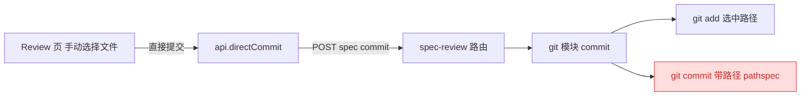
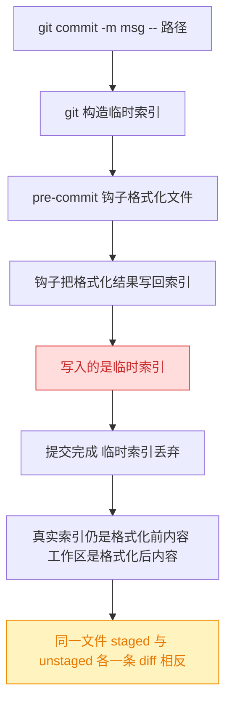
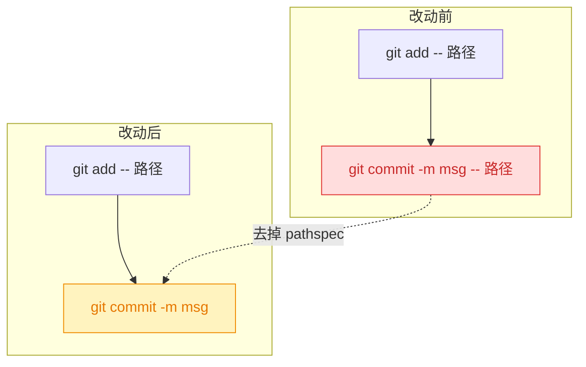
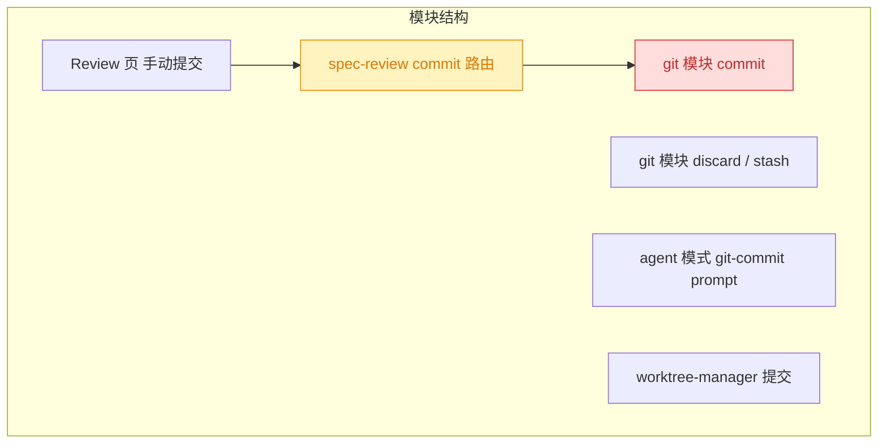

# 260818.fix.commit-without-pathspec

## 1. 背景

@src/gui/src/pages/SpecReview.tsx 的「手动选择文件 + 直接提交」链路最终调用服务端 `commit()`，该实现以 pathspec 形式提交（`git commit -m <msg> -- <paths>`）。

git 在 pathspec 提交时会构造一份**临时索引**（temporary index）：钩子（如 pre-commit 中的格式化工具）对文件的改写被写进这份临时索引，而非仓库真实索引。提交完成后临时索引被丢弃，工作区里被格式化过的内容与提交内容产生偏差，表现为同一个文件在 `git status` 中**同时出现在 staged 与 unstaged**，且两侧 diff 内容正好相反。

## 2. 需求

- 直接提交不再使用带路径的提交命令。
- 将 `git commit -m "..." -- <文件>` 拆成两步：`git add -- <文件>` → `git commit -m "..."`，让钩子改动落到真实索引，消除提交后的「双记录」脏状态。

## 3. 现状分析

### 3.1 调用链路

GUI 手动模式 → REST → 服务端 git 封装，只有最后一步用到 pathspec 提交：



<details>
<summary>精确层：涉及文件与关键行</summary>

- `src/gui/src/pages/SpecReview.tsx:205` — `api.directCommit(projectId(), params.id, { message, paths })`
- `src/gui/src/lib/api.ts:373` — `directCommit` 请求 `POST /projects/:projectId/specs/:id/commit`
- `src/service/routes/spec-review.ts:88` — commit 路由，校验 message/paths 后调用 `gitCommit(p.path, { message, paths })`
- `src/service/git.ts:201-217` — `commit()` 实现；`:213` `git add -- <allPaths>`，`:214` `git commit -m <msg> -- <allPaths>`（问题所在），`:215` `git rev-parse HEAD`
- `src/service/git.ts:180-199` — `partitionPathsByStatus()`：重命名条目额外补入 `renamedFrom`，保证旧路径的删除也被 `git add` 暂存
- 已有测试：`src/service/__tests__/git.test.ts:59-88`（精确路径提交 / 越界路径 / 空 message）、`:159-184`（untracked + unstaged + staged 混合提交）
- agent 模式（`src/service/routes/spec-review.ts:184`）的 prompt 已要求 `git add` + `git commit`，本身不受影响

</details>

### 3.2 脏状态是怎么产生的



要点：`git add` 那一步已把选中路径写入**真实索引**，因此去掉 commit 的 pathspec 后，提交内容与当前实现一致——差别只在于「真实索引中是否还存在本次未勾选、但已被外部暂存的路径」（已定：一并提交）。

## 4. 技术实现方案

### 4.1 核心改动

`src/service/git.ts` 的 `commit()` 保持 `git add -- <paths+renamedFrom>` 不变，仅将提交命令的 pathspec 去掉：



<details>
<summary>精确层：代码 diff 与不变量</summary>

`src/service/git.ts:213-214`：

```diff
  await runGit(cwd, ['add', '--', ...allPaths])
- await runGit(cwd, ['commit', '-m', message, '--', ...allPaths])
+ await runGit(cwd, ['commit', '-m', message])
```

保持不变的部分：

- `assertSafeRelativePath` 路径校验、空 message / 空 paths 的 `GitError` 分支
- `partitionPathsByStatus` 补 `renamedFrom`（重命名场景仍需把旧路径的删除一并 `add`）
- 提交后 `git rev-parse HEAD` 返回 sha 的返回值形状 `{ commit: string }`
- `discard` / `stash` 完全不动；agent 模式 prompt 不动

</details>

> 决策说明：不采用 `git commit --only/-o` 或 `-i` 等替代开关——`--only` 正是当前 pathspec 语义（同样走临时索引），`-i` 语义仍与用户明确指定的两步法不一致。选择最直白的 `add` + 无 pathspec `commit`。

> 决策说明：不引入「提交前先 `git stash` 备份」之类的兜底，避免在提交路径上增加不可逆副作用；钩子改写的内容本来就应当进入本次提交。

> 决策记录：待确认项「提交时索引中存在『未勾选但已被外部暂存』的路径，如何处置？」—— 用户选择「直接一并提交，不做额外处理」，理由：未额外说明。故 `commit()` 不新增任何索引清理/报错分支，提交范围即为提交时刻索引的全部内容。

### 4.2 影响范围



- 行为变化：提交范围从「仅 pathspec 指定路径」变为「提交时索引中的全部内容」。选中路径始终包含在内；「用户在 YorZ 之外已 `git add` 过、但本次未勾选」的路径按用户决策直接一并提交，不做额外处理。
- `worktree-manager.ts:185` 本就是无 pathspec 的 `git commit -m`，不需改动。
- 需要新增回归测试：模拟一个会改写文件内容的 `pre-commit` 钩子，提交后断言 `git status` 中该文件不再同时出现 staged/unstaged 记录。

### 4.3 验证方式

- `pnpm test`（vitest）跑 `src/service/__tests__/git.test.ts`，含新增的钩子回归用例。
- `pnpm typecheck`。

## 5. 待确认项

_暂无_

## 6. 任务清单

- [x] 修改 `src/service/git.ts` 的 `commit()`，将提交命令由 `['commit', '-m', message, '--', ...allPaths]` 改为 `['commit', '-m', message]`（验收：文件内 `git commit` 调用不再携带 pathspec，`pnpm typecheck` 通过）
- [x] 在 `src/service/__tests__/git.test.ts` 新增 pre-commit 钩子回归用例：钩子改写被提交文件内容，提交后断言 `listChanges` 中该文件不再同时出现 staged/unstaged 记录（验收：新用例通过，在改回 pathspec 提交时会失败）
- [x] 运行 `pnpm test` 与 `pnpm typecheck` 并记录结果（验收：git 相关用例全绿、类型检查通过）

## 7. 执行记录

- 2026-08-18 15:35 — `src/service/git.ts:219` 去掉提交命令 pathspec，改为 `git add -- <paths>` + `git commit -m <msg>` 两步；上方补注释说明临时索引导致钩子改写丢失的原因。`git rev-parse HEAD` 与返回值形状不变，`discard`/`stash` 未动。
- 2026-08-18 15:36 — `src/service/__tests__/git.test.ts` 新增用例「leaves no staged/unstaged residue when a pre-commit hook rewrites the file」：写入 `.git/hooks/pre-commit`（改写 `fmt.txt` 并 `git add`），提交后断言 `listChanges` 中无 `fmt.txt` 残留且 `HEAD:fmt.txt` 为钩子格式化后的内容。
- 2026-08-18 15:36 — 反向验证：临时把提交命令改回 pathspec 形式后该用例失败（`fmt.txt` 出现残留记录），还原后通过，确认用例可捕获回归。
- 2026-08-18 15:36 — 验证结果：`npx tsc -b` 退出码 0；`npx vitest run` 全量 66 个文件 / 584 用例通过（2 skipped）。
- 2026-08-18 15:37 — 任务全部完成，标记 done。
