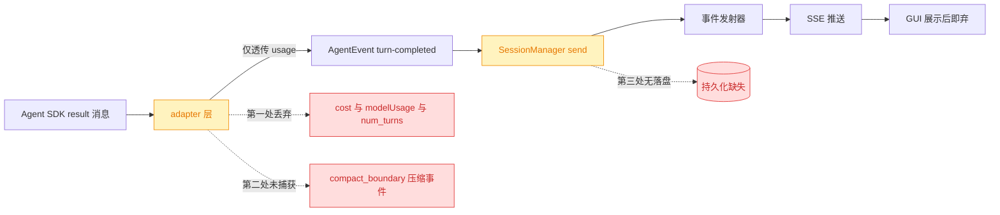
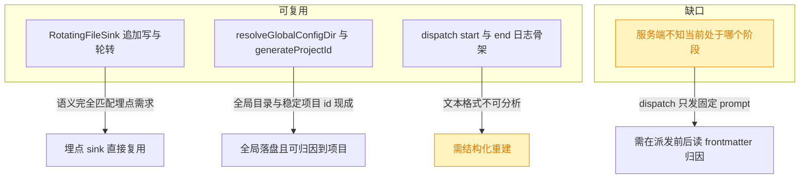
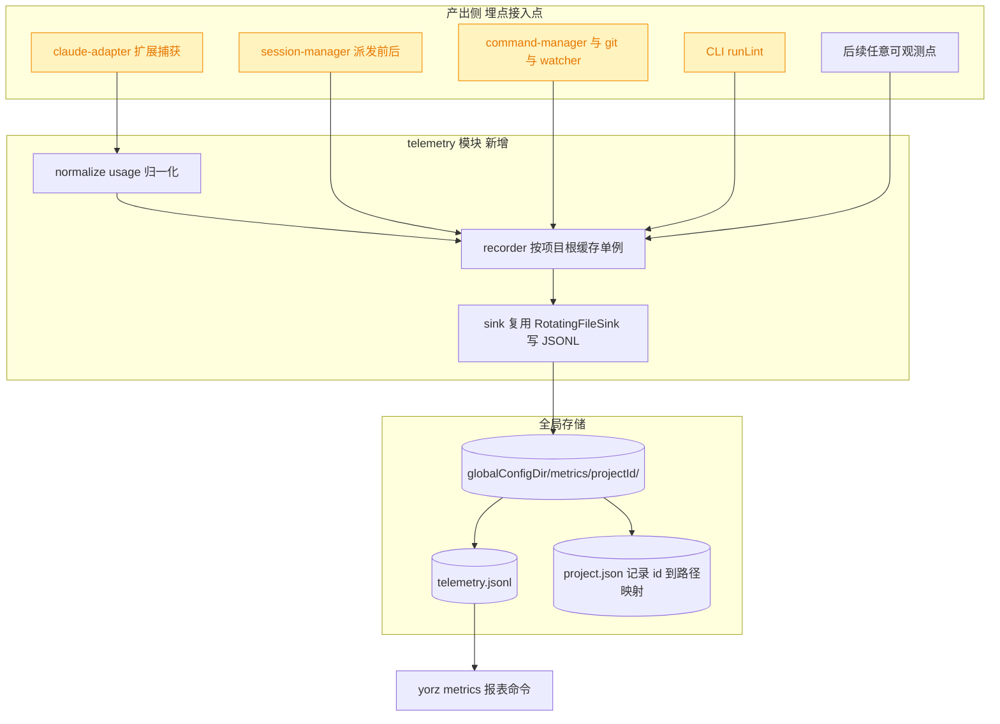
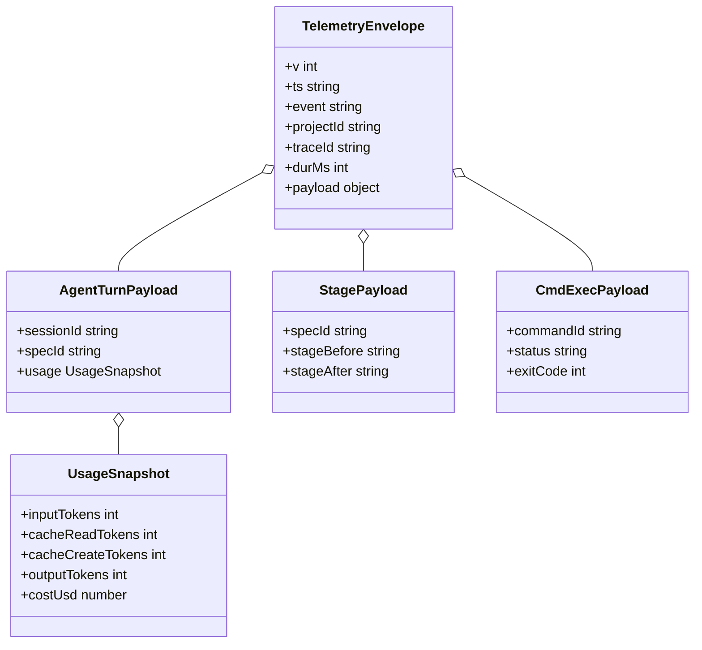

# 通用埋点模块：运行效率与 Agent Token 消耗数据采集

## 1. 背景

YorZ 当前无法回答「一次 spec 从新建到 done 花了多少 token / 多少钱 / 多少时间」这类问题。计量数据在链路上产生过，但从未落盘：`ClaudeSession.send()` 捕获了 SDK 的 `usage` 并通过 `turn-completed` 事件抛出，服务端却只把它经 SSE 推给 GUI 展示，展示完即丢弃。

这直接导致任何优化策略（session 断点策略、模型分层、skill 注入方式、lint 往返削减等）都**无法验证效果**——没有基线，改完前后只能凭感觉。本 spec 的目标是先把「秤」造出来，而不是先减重。

## 2. 需求

新增一个**通用**埋点模块，采集 YorZ 运行效率与 Agent token 消耗的原始数据，为评估未来改进策略的优化效果提供数据支撑。

硬性要求：

- **通用**：事件模型不绑定 Agent/token 场景，后续新增任意可观测点（命令执行、git 操作、watcher、HTTP 请求等）不需要改动核心模块。
- **原始数据优先**：采集不做聚合损失，保留可回溯的明细；聚合分析在读取侧完成。
- **零侵入**：埋点失败、磁盘异常绝不能影响主流程。
- **可归因**：数据能关联到项目、spec、session、阶段，否则无法做「每 spec 成本」这类核心分析。

## 3. 现状分析

### 3.1 计量数据流与三处丢失点

计量数据在链路中产生后被逐级削减，最终完全丢弃：

第三处是根因：**服务端从不持久化任何计量数据**，因此当前没有任何历史数据可供回溯，基线必须从零开始采集。

三处丢失点的精确位置与字段

- `src/service/agent-sdk/claude-adapter.ts:151-152`：`else if (m.type === 'result') { usage = m.usage }` —— 只取 `usage`，同一条 `SDKResultSuccess` 上的 `total_cost_usd`、`modelUsage`、`num_turns`、`duration_ms`、`stop_reason` 全部丢弃。
- 同文件 `for await` 循环（L123-161）未处理 `m.subtype === 'compact_boundary'`，故 auto-compact 的发生完全不可见。
- `src/service/session-manager.ts:325-332`：事件循环仅 `emitter.emit('event', ev)`，无任何落盘分支。全局搜索 `turn-completed` 的服务端消费者只有 SSE 一条路径。

SDK 侧可用字段（`node_modules/@anthropic-ai/claude-agent-sdk/sdk.d.ts`）：

- `SDKResultSuccess`（L4167）：`duration_ms` / `duration_api_ms` / `num_turns` / `stop_reason` / `total_cost_usd` / `usage` / `modelUsage`
- `ModelUsage`（L1233）：`inputTokens` / `outputTokens` / `cacheReadInputTokens` / `cacheCreationInputTokens` / `costUSD` / `contextWindow` / `maxOutputTokens`
- `SDKCompactBoundaryMessage`（L2864）：`compact_metadata.trigger`（`'manual' | 'auto'`）/ `pre_tokens` / `post_tokens` / `duration_ms`

### 3.2 三个 adapter 的 usage 形状不一致

`AgentEvent` 契约（`src/service/agent-sdk/types.ts:11`）把 usage 声明为 `unknown`，三个 adapter 各自塞入不同结构，跨 Agent 无法直接比较：

| adapter    | usage 来源         | 位置                      | 结构                      |
| ---------- | ------------------ | ------------------------- | ------------------------- |
| `claude`   | `m.usage`          | `claude-adapter.ts:152`   | SDK `NonNullableUsage`    |
| `codex`    | `ev.usage`         | `codex-adapter.ts:253`    | Codex turn.completed 结构 |
| `opencode` | `data.info.tokens` | `opencode-adapter.ts:219` | OpenCode tokens 结构      |

因此归一化必须在采集侧统一完成，而不是在读取侧按 kind 分支判断。

### 3.3 可复用的现有设施与归因缺口

现状并非一片空白，有三处可直接复用，一处是必须新解的缺口：

复用点与缺口的精确依据

- **`RotatingFileSink`**（`src/service/logger.ts:70-144`）已具备埋点 sink 所需的全部语义：`write()` 入队即返回不阻塞调用方；所有写入串到单条 promise 链（L92）杜绝行交错；按大小轮转（L104、L127）；**每个磁盘错误都被吞掉**（L109-111，注释明确写 "logging must never break the caller"）。这与本 spec「零侵入」要求完全一致，无需另造轮子或引入新依赖。
- **全局目录与项目 id**：`resolveGlobalConfigDir`（`src/service/global-config.ts:103-108`）已实现 `YORZ_HOME` > `XDG_CONFIG_HOME` > `~/.config/yorz` 的解析，`resolveLogDir`（`logger.ts:42`）即在其上拼 `logs`，埋点目录照此拼 `metrics` 即可；`generateProjectId(absPath)`（`global-config.ts:364-369`）产出 `<slug>-<sha256 前 6 位>` 的稳定可读 id，且与 `.yorz/config.json` 中已注册项目的 id 完全一致，是「全局落盘 + 关联项目」的现成钥匙。
- **已有 dispatch 埋点骨架**：`src/service/session-manager.ts:321`（`dispatch start`，带 `sessionId` / `runId` / `promptLength`）、L348（`dispatch end`，带 `durationMs`）、L336（`dispatch failed`）。但 `Logger.emit`（L229-235）输出的是人类可读文本行 `[ISO] [level] [scope] msg {json}`，需要正则反解才能分析，不适合作为数据源。
- **归因缺口**：`src/service/routes/specs.ts:213` 派发的 prompt 内容固定，服务端不解析 spec 状态；`SessionManager.send()`（L308）签名只有 `sid` / `prompt` / `titleSource`，调用栈中没有任何阶段信息与触发语义。而 `spec-store.ts` 已用 gray-matter 解析 frontmatter（`normalizeFrontmatter` 在 L391-398），读取 `stage` 的能力现成。

### 3.4 其余可观测点均已有天然收口

首期范围扩展到服务端关键动作后，逐条核查发现**每类动作都已存在唯一收口函数**，无需散点埋设：

| 可观测点      | 唯一收口位置                                             | 现成字段                                   |
| ------------- | -------------------------------------------------------- | ------------------------------------------ |
| Agent 派发    | `session-manager.ts:308` `send()` 的 start/catch/finally | `runId` / `durationMs` / `promptLength`    |
| 命令执行      | `command-manager.ts:498` `markRunEnded()`                | `runId` / `status` / `exitCode` / `signal` |
| git 操作      | `git.ts:120` `runGitChecked()` / `:131` `runGitRaw()`    | 子命令名 / cwd / 退出码                    |
| lint 执行     | `src/cli/lint.ts:23` `runLint()`                         | `exitCode` / 报告计数                      |
| spec 文件变更 | `watcher.ts:154` `emit()`                                | `specId` / `updated\|removed` / `mtimeMs`  |

`lint` 目前是 **CLI-only**（`src/service/` 下无任何调用点），因此它的埋点发生在 CLI 进程内，必须自行由 `--cwd` 上溯定位项目根，不能依赖服务端上下文。

## 4. 技术实现方案

### 4.1 总体结构

新增独立 `src/service/telemetry/` 模块，以「通用事件信封 + 开放事件类型」为核心；所有埋点接入点只负责产出事件，不感知存储细节。数据落在**全局** `<globalConfigDir>/metrics/`，按项目 id 分子目录，天然完成项目归因：

黄色为需改动的既有文件，其余为纯新增；不改变任何现有对外行为，无破坏性变更。所有接入点统一通过 `getTelemetry(projectRoot)` 取 recorder——这五处调用栈里恰好都持有项目根路径（`SessionManager.cwd` / `CommandManager.cwd` / `git.ts` 的 `cwd` 入参 / `SpecWatcher.cwd` / `runLint` 的 `--cwd`），因此**无需向任何既有函数穿透新参数**。

### 4.2 通用事件模型

通用性由「稳定信封 + 开放 `event` 命名空间 + 自由 payload」三者保证：新增可观测点只需定义新的 `event` 字符串，核心模块零改动。

事件命名采用 `<域>.<动作>` 两段式，首期落地 8 类：`agent.dispatch` / `agent.turn` / `agent.compact` / `spec.stage` / `spec.change` / `cmd.exec` / `git.op` / `lint.run`；后续新增 `http.req` 等无需修改 recorder。

信封字段全文与首期 8 类事件定义

信封（所有事件共有）：

- `v`：schema 版本号，从 `1` 起。破坏性字段变更时递增，读取侧据此兼容。
- `ts`：本地秒级 `YYYY-MM-DD HH:mm:ss`，与 spec frontmatter 的 `updated_at` 保持同一格式。
- `event`：`<域>.<动作>`，如 `agent.turn`。
- `projectId`：`generateProjectId(projectRoot)` 的产物。目录名已含该 id，行内再冗余一份是为了「多项目文件 `cat` 合并后仍可归因」。
- `traceId`：贯穿一次派发的关联 id，直接复用 `session-manager.ts:309` 已有的 `runId`，无需新造。
- `durMs`：可选耗时。
- 其余字段为该事件类型的 payload，平铺在信封内以便 `jq` 直接查询。

首期事件：

- `agent.dispatch`：一次派发的总账。字段 `sessionId` / `specId` / `agentKind` / `trigger`（`run|append|explain|git-ops|chat|new-spec|conflict`）/ `phase`（`start|end`）/ `promptLength` / `durMs` / `ok` / `errorMessage`。
- `agent.turn`：一轮的用量明细。字段 `sessionId` / `numTurns` / `stopReason` / `model` / 归一化后的 `usage` / `modelUsage`（按模型分桶，原样保留）。
- `agent.compact`：字段 `compactTrigger`（`auto|manual`）/ `preTokens` / `postTokens` / `durMs`。压缩来源刻意不叫 `trigger`，以免覆盖同一行上表示派发来源的 `trigger`，两者需并存。
- `spec.stage`：字段 `specId` / `stageBefore` / `stageAfter` / `tasksTotal` / `tasksDone` / `specBytes`。
- `spec.change`：来自 watcher，字段 `specId` / `kind`（`updated|removed`）。
- `cmd.exec`：字段 `commandId` / `runId` / `status` / `exitCode` / `signal` / `durMs`。
- `git.op`：字段 `op`（git 子命令名）/ `ok` / `durMs` / `exitCode`。不记录参数值，避免路径与提交信息入库。
- `lint.run`：字段 `fileCount` / `errorCount` / `warnCount` / `exitCode` / `durMs`。

`UsageSnapshot` 归一化后的统一字段：`inputTokens`（未命中缓存的全价输入）/ `cacheReadTokens` / `cacheCreateTokens` / `outputTokens` / `costUsd`。三个 adapter 各自实现到该结构的映射；无法提供的字段留空而非补零，避免把「缺测」和「真零」混淆——这是后续判断缓存命中率时的关键区分。

`project.json`（每个项目目录写一次）：`{ id, path, firstSeenAt }`，用于把短 id 还原成绝对路径，避免每行冗余长路径。

### 4.3 埋点接入点

首期共 8 处，前四处对应 3.1 的丢失点与 3.3 的归因缺口，后四处对应 3.4 的现成收口：

1. **`claude-adapter.ts` 扩展捕获**：`result` 分支补齐 `total_cost_usd` / `modelUsage` / `num_turns` / `stop_reason` / `duration_ms`；`for await` 循环新增 `compact_boundary` 分支产出 `agent.compact`。`AgentEvent.turn-completed` 的 `usage` 字段由 `unknown` 收紧为携带归一化结果的结构。
2. **`session-manager.ts` 落盘与关联**：在既有 `dispatch start` / `dispatch end` / `dispatch failed` 三处旁挂 `agent.dispatch`，复用现成的 `runId` 与 `durationMs`；事件循环中拦截 `turn-completed` 产出 `agent.turn`、拦截 compact 事件产出 `agent.compact`。
3. **派发入口归因**：`send()` 增加可选的第四参数 `meta?: { trigger; specId }`（可选，不破坏既有 6 个调用点），并在派发前后各读一次 spec frontmatter 的 `stage`，产出 `spec.stage`。这能直接暴露 `stageBefore === stageAfter === 'plan'` 这类阶段抖动。
4. **`watcher.ts:154` `emit()`**：产出 `spec.change`。
5. **`command-manager.ts:498` `markRunEnded()`**：产出 `cmd.exec`。
6. **`git.ts` 的 `runGitChecked` / `runGitRaw`**：产出 `git.op`，只记子命令名与耗时。
7. **`src/cli/lint.ts` `runLint()`**：产出 `lint.run`，项目根由 `--cwd` 上溯 `.yorz` 目录定位。
8. **读取侧 `yorz metrics`**：新增 `src/cli/metrics.ts`，按 `runLint` 的既有风格导出 `runMetrics(opts)`，默认输出「按 spec 聚合的 token / 成本 / 耗时 / 派发次数」表格，`--json` 输出原始聚合对象，`--project` 指定项目（缺省取 cwd 所属项目）。

### 4.4 关键决策说明

> 决策记录：待确认项 5.1「首期埋点的事件覆盖范围」——用户选择「Agent 链路 + 服务端关键动作（追加 `cmd.exec` / `git.op` / `lint.run` / `watcher` 事件）」，理由：在通用事件模型之上顺带验证「新增可观测点零核心改动」这一设计承诺。据此 4.2 首期事件扩展为 8 类，4.3 接入点扩展为 8 处，GUI 前端交互事件不在首期范围。

> 决策记录：待确认项 5.2「埋点数据落在项目内 `.yorz/metrics/` 且默认开启采集」——用户否决·换方案，理由：文件应落全局 `<globalConfigDir>/metrics`，且埋点数据需要能关联到项目。新方案见下条。

> 决策记录：落盘位置改为 `<globalConfigDir>/metrics/<projectId>/telemetry.jsonl`，项目归因由「目录名 = `generateProjectId(projectRoot)`」+「行内 `projectId` 字段」+「目录内 `project.json` 记录 id→绝对路径」三重保证。理由：与 `logger.ts` 写 `<globalConfigDir>/logs` 的既有先例同构；数据不再进入项目工作区，`.gitignore` 无需改动，也就不存在「漏改导致埋点数据被误提交」的风险；按项目分子目录使每个项目拥有独立的轮转配额，避免高频项目把低频项目的历史挤掉，同时跨项目横向对比仍可 `cat <globalConfigDir>/metrics/*/telemetry.jsonl` 一次完成。被否决备选：单一全局 `telemetry.jsonl` + 行内项目字段 —— 轮转会跨项目连带截断，且任何单项目分析都要先全表过滤。

> 决策记录：复用 `RotatingFileSink` 而非新建写入层或引入外部依赖。理由：其「入队即返、单链串行、错误全吞」语义与埋点的零侵入要求完全吻合（依据见 3.3 折叠块）。被否决备选：直接复用 `Logger` —— 否决原因是其输出为人类可读文本行，需正则反解，不适合作数据源。

> 决策记录：存储格式采用 JSONL 而非 SQLite。理由：追加写天然无并发写冲突、可被 `jq` / DuckDB 直接查询、与 YorZ「文件即真相」的既有范式一致、零新增依赖。被否决备选：SQLite —— 查询能力更强，但引入原生依赖与迁移负担，且当前分析需求（按 spec/阶段聚合）用 `jq` 即可满足。

> 决策记录：不记录 prompt 与响应正文，只记录长度；`git.op` 只记子命令名不记参数。理由：正文与参数体积大且含项目源码、文件路径等敏感内容，而所有既定分析指标（成本、缓存命中、阶段归因）都不需要它们。被否决备选：记录正文哈希用于去重分析 —— 当前无此分析需求，YAGNI。

> 决策记录：采集默认开启，`YORZ_TELEMETRY=off` 关闭。理由：数据落在用户自己的全局配置目录、不上传、不入版本库，与 `logs` 目录的既有隐私边界一致；若默认关闭则基线永远采不到，本 spec 目标落空。

> 决策记录：`SDKResultSuccess.usage` 在 resume 会话下的语义（本轮增量 vs session 累计）不写作待确认项，而列为实现期的首个验证任务。理由：该问题可由「对同一 session 连发两轮短 prompt，观察第二轮 `inputTokens` 是否含第一轮」自行验证，属于能自查的技术细节，不需占用人工决策。风险提示：若为累计语义，所有 token 字段必须跨事件做差，否则整套基线数据失效，故必须在采集正式开始前完成验证。

## 5. 待确认项

_暂无_

## 6. 任务清单

- [x] 查证 `SDKResultSuccess.usage` 在 resume 会话下是本轮增量还是 session 累计（依据 sdk.d.ts 与 SDK 运行时实现）（验收：结论写入 `## 执行记录`，并据此确定 `agent.turn` 是否需跨事件做差）
- [x] 新增 `src/service/telemetry/types.ts`，定义 `TelemetryEnvelope` / `UsageSnapshot` / 首期 8 类事件名（验收：`pnpm typecheck` 通过）
- [x] 新增 `src/service/telemetry/paths.ts`，实现 `resolveMetricsDir(env)` 与 `resolveProjectMetricsDir(projectRoot, env)`（验收：单测断言 `YORZ_HOME` 覆盖生效且目录名等于 `generateProjectId(projectRoot)`）
- [x] 新增 `src/service/telemetry/normalize.ts`，实现 claude / codex / opencode 三种 usage → `UsageSnapshot` 映射（验收：单测三种输入各得统一结构，缺测字段为 `undefined` 而非 0）
- [x] 新增 `src/service/telemetry/recorder.ts`，实现 `getTelemetry(projectRoot)` 缓存单例、`record()`、`YORZ_TELEMETRY=off` 短路、`project.json` 写入，sink 复用 `RotatingFileSink`（验收：单测在临时 `YORZ_HOME` 下写事件并读回 JSONL，信封字段齐全）
- [x] 新增 `src/service/telemetry/index.ts` 统一导出（验收：接入点仅从 `telemetry/index.js` 导入）
- [x] 收紧 `src/service/agent-sdk/types.ts` 的 `turn-completed` usage 类型并新增 compact 事件类型（验收：`pnpm typecheck` 通过且三个 adapter 均适配）
- [x] 扩展 `claude-adapter.ts`：`result` 分支补齐 cost / modelUsage / num_turns / stop_reason / duration_ms，新增 `compact_boundary` 分支（验收：单测以桩 SDK 消息驱动，断言 `turn-completed` 字段完整并产出 compact 事件）
- [x] 在 `codex-adapter.ts` 与 `opencode-adapter.ts` 出口接入归一化（验收：单测断言两者产出同构 `UsageSnapshot`）
- [x] 在 `session-manager.ts` 的 dispatch start / failed / end 三处产出 `agent.dispatch`，事件循环中产出 `agent.turn` 与 `agent.compact`（验收：单测跑一次假派发后 JSONL 含对应事件且 `traceId` 一致）
- [x] 为 `SessionManager.send()` 增加可选 `meta?: { trigger; specId }` 并在全部派发调用点传入 trigger（验收：`pnpm typecheck` 通过，JSONL 中 `trigger` 非空）
- [x] 在 spec 派发路由派发前后读取 frontmatter `stage` 并产出 `spec.stage`（验收：单测断言 `stageBefore` / `stageAfter` 落盘）
- [x] 在 `watcher.ts` 的 `emit()` 产出 `spec.change`（验收：单测触发一次 spec 文件变更后 JSONL 出现该事件）
- [x] 在 `command-manager.ts` 的 `markRunEnded()` 产出 `cmd.exec`（验收：单测跑一个短命令后 JSONL 含 `status` 与 `exitCode`）
- [x] 在 `git.ts` 的 `runGitChecked` / `runGitRaw` 产出 `git.op`，仅记子命令名与耗时（验收：单测断言事件不含任何参数值）
- [x] 在 `src/cli/lint.ts` 的 `runLint()` 产出 `lint.run`，项目根由 `cwd` 上溯 `.yorz` 定位（验收：跑一次 `yorz lint` 后对应项目目录 JSONL 出现该事件）
- [x] 新增 `src/cli/metrics.ts` 导出 `runMetrics(opts)`，输出按 spec 聚合的 token / 成本 / 耗时 / 派发次数，支持 `--json` 与 `--project`（验收：`--json` 输出可被 `JSON.parse` 解析）
- [x] 在 `src/cli/index.ts` 注册 `yorz metrics` 子命令（验收：`yorz metrics --help` 正常输出）
- [x] 在 `docs/Architecture.md` 补 telemetry 模块说明（验收：文档含数据路径 `<globalConfigDir>/metrics/<projectId>/telemetry.jsonl` 与 `YORZ_TELEMETRY=off` 开关）
- [x] 运行 `pnpm typecheck` 与 `pnpm test` 全量校验（验收：均通过，无新增失败用例）

## 7. 执行记录

- 2026-08-19 21:12 —— 查证 SDK usage 语义：**`result` 消息的 `usage` / `total_cost_usd` 是本轮 `query()` 的用量，不是 session 累计**。依据：SDK 另有一个专门的 `SDKControlGetUsageResponse`，其 `session` 字段注释写明 "Cost and usage accumulated by the current session"（`sdk.d.ts:3108-3117`）——若 `result` 已是累计值，该接口无存在必要；且 `maxBudgetUsd`（L1639-1643）注释为 "Maximum budget in USD for the query"，与 `total_cost_usd` 同源比较，语义为单次 query。YorZ 每次 `ClaudeSession.send()` 恰好调用一次 `query()`，故一条 `agent.turn` = 一次派发，**无需跨事件做差**，直接求和即为总量；resume 会话重放的历史体现为 `cacheReadTokens`，属真实成本，计入合理。
- 2026-08-19 21:14 —— 新增 `src/service/telemetry/types.ts`：`TELEMETRY_SCHEMA_VERSION` / `TelemetryEnvelope`（`v`/`ts`/`event`/`projectId`/`traceId`/`durMs` + 平铺 payload）/ `UsageSnapshot`（全字段可选，区分「缺测」与「真零」）/ `TurnMetrics` / `CompactMetrics` / `ProjectMetricsMeta`；`TelemetryEventName` 以 `(string & {})` 保持事件命名空间开放。验证：`pnpm typecheck` 通过。
- 2026-08-19 21:15 —— 新增 `src/service/telemetry/paths.ts`：`resolveMetricsDir()` = `<globalConfigDir>/metrics`（复用 `resolveGlobalConfigDir`，自动继承 `YORZ_HOME` / `XDG_CONFIG_HOME`）、`resolveProjectMetricsDir()` 追加 `generateProjectId(projectRoot)` 子目录；轮转参数 5 MiB × 2 archive。验证：`pnpm typecheck` 通过。
- 2026-08-19 21:16 —— 新增 `src/service/telemetry/normalize.ts`：claude（snake_case Messages usage）/ codex（`cached_input_tokens` 从 `input_tokens` 中扣除，保持 `inputTokens` 恒为「全价输入」语义）/ opencode（`tokens.cache.read|write`）三路映射到 `UsageSnapshot`，缺测字段直接省略。验证：`pnpm typecheck` 通过。
- 2026-08-19 21:18 —— 新增 `src/service/telemetry/recorder.ts`：`getTelemetry(projectRoot)` 按解析后的绝对路径缓存单例；`record()` 组装信封后交给复用的 `RotatingFileSink`（入队即返、单链串行、错误全吞），`JSON.stringify` 失败直接丢弃该事件而非抛出；首次写入时旁挂 `project.json`（id → 绝对路径）；`isTelemetryEnabled()` 支持 `YORZ_TELEMETRY=off|0|false|no|disabled`，默认开启；另导出 `flushTelemetry()` / `resetTelemetry()` 供收尾与测试使用。验证：`pnpm typecheck` 通过。
- 2026-08-19 21:19 —— 新增 `src/service/telemetry/index.ts` 统一出口，后续接入点一律从 `./telemetry/index.js` 导入。验证：`pnpm typecheck` 通过。
- 2026-08-19 21:24 —— 收紧 `agent-sdk/types.ts`：`turn-completed` 增加 `metrics?: TurnMetrics`（`usage` 原样保留，GUI 既有消费不受影响），新增 `{ type: 'compact'; metrics: CompactMetrics }` 事件。GUI 侧事件处理为 if/else 链，未知类型自然忽略，无破坏性变更。验证：`pnpm typecheck` 通过。
- 2026-08-19 21:26 —— 扩展 `claude-adapter.ts`：`result` 分支补齐 `total_cost_usd` / `modelUsage` / `num_turns` / `stop_reason` / `duration_ms` / `duration_api_ms` 并归一化 usage，`modelUsage` 中输出 token 最多的模型作为 `model`；新增 `compact_boundary` 分支产出 `compact` 事件。验证：`claude-adapter.test.ts` 新增「捕获成本/模型分桶/轮次并暴露压缩」用例，4 个用例全通过。
- 2026-08-19 21:27 —— `codex-adapter.ts` / `opencode-adapter.ts` 出口接入 `normalizeUsage`（opencode 另带 `modelID`）。验证：`telemetry.test.ts` 三种 usage 形状映射用例通过。
- 2026-08-19 21:30 —— `session-manager.ts`：`send()` 新增可选第四参数 `meta?: DispatchMeta`；dispatch start/end 两处产出 `agent.dispatch`（`ok` / `errorMessage` 由 catch 分支的 `dispatchError` 决定），事件循环拦截 `turn-completed` / `compact` 产出 `agent.turn` / `agent.compact`，全部复用现成 `runId` 作 `traceId`。压缩事件的 `auto|manual` 以 `compactTrigger` 命名，避免与派发 `trigger` 字段互相覆盖。验证：集成测试断言一次派发产出 start/end + turn + compact 且 `traceId` 唯一。
- 2026-08-19 21:32 —— 全部派发调用点传入 trigger：`routes/specs.ts`（new-spec / append / run / explain）、`routes/spec-review.ts`（git-ops）、`routes/sessions.ts`（chat）、`server.ts`（conflict）。验证：`pnpm typecheck` 通过，集成测试断言 JSONL 中 `trigger` / `specId` 非空。
- 2026-08-19 21:33 —— 新增 `telemetry/spec-stage.ts`：`trackSpecStage()` 以路由已读到的 `SpecDetail` 作 before 快照（无额外 IO、无竞态），在 `handle.onDone` 时重读 spec 产出 `spec.stage`（`stageBefore` / `stageAfter` / `tasksTotal` / `tasksDone` / `tasksDoneBefore` / `specBytes`）；已接入 run / append / git-ops 三个会改写 spec 的入口，explain 不改文档故只记派发。验证：`snapshotSpec` 单测覆盖任务计数与空态。
- 2026-08-19 21:34 —— `watcher.ts` 的 `emit()` 产出 `spec.change`（新增 `cwd` 字段以取得项目根）。验证：集成测试在真实 Service 上写入 spec 文件后轮询到该事件（`specId` / `kind` 正确）。
- 2026-08-19 21:35 —— `command-manager.ts` 的 `markRunEnded()` 产出 `cmd.exec`。验证：集成测试跑 `node -e "process.exit(3)"`，JSONL 中 `status=exited` / `exitCode=3` / `durMs` 齐全。
- 2026-08-19 21:36 —— `git.ts` 的 `runGit` 与 `runGitRaw` 产出 `git.op`，仅记 `args[0]` 子命令名。验证：集成测试经真实 HTTP 路由触发 `git status` 后断言事件存在且 `JSON.stringify(event)` 不含 `--porcelain` 等参数。
- 2026-08-19 21:37 —— `src/cli/lint.ts` 产出 `lint.run`，项目根由新增的 `findProjectRoot()` 从 `cwd` 上溯 `.yorz` 定位，并在返回前 `flush()`（CLI 进程随即退出，不 flush 会丢队列）。验证：`YORZ_HOME=$(mktemp -d) node dist/cli/index.js lint <spec>` 后该目录下出现 `metrics/yorz-6f1f9f/telemetry.jsonl`，内容为一条完整 `lint.run` 事件。
- 2026-08-19 21:38 —— 新增 `src/cli/metrics.ts`（`runMetrics`）：按项目目录读取 `telemetry.jsonl` 及其轮转归档，按 spec 聚合 token / 成本 / 耗时 / 派发次数（`agent.dispatch` 只按 `phase=end` 计数，避免重复），支持 `--all` / `--project` / `--since` / `--format json`；无法解析的行计入 `skipped` 而非静默吞掉。验证：`metrics.test.ts` 4 个用例通过（聚合、`--since` 过滤 + 截断行、空态退出码 1、文本报表）。
- 2026-08-19 21:39 —— `src/cli/index.ts` 注册 `yorz metrics` 子命令。验证：`node dist/cli/index.js metrics --help` 正常输出全部选项；`node dist/cli/index.js metrics` 在上述临时 `YORZ_HOME` 下正确渲染报表。
- 2026-08-19 21:40 —— `docs/Architecture.md`：4.1 命令表补 `yorz metrics`，4.2 Service 增加 Telemetry 小节（事件模型、首期 8 类事件、归一化、全局落盘路径与项目归因三重保证、零侵入、`YORZ_TELEMETRY=off` 开关、读取侧）。
- 2026-08-19 21:41 —— 另在 `vitest.setup.ts` 将 `YORZ_HOME` 默认指向临时目录：埋点目录在每次写入时从环境解析，无法像 logger 那样用 setter 重定向，否则测试会污染开发者真实的 `<globalConfigDir>/metrics`。
- 2026-08-19 21:42 —— 全量校验：`pnpm typecheck` 通过；`pnpm test` 70 个测试文件 / 632 用例全部通过（2 跳过），无新增失败。
- 2026-08-19 21:43 —— 收尾：任务清单 20 项全部完成，`## 待确认项` 为 `_暂无_`，无 `！！！` 批注与 `[open]` 追加任务，标记 `stage: done`。「秤」已就位——下一步是用 `yorz metrics` 采集若干真实 spec 的基线，再开始验证任何优化策略。
