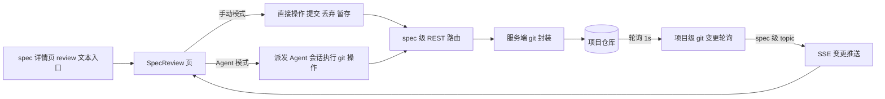
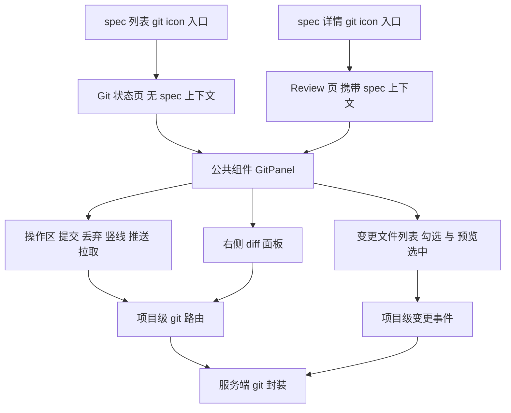
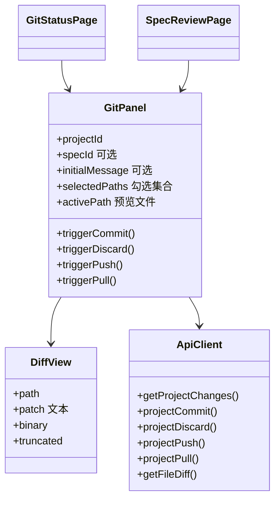
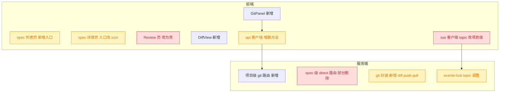

# 260819.feat.git-status-page

## 1. 背景

当前仓库变更的查看与提交只能从 spec 详情页的「review」入口进入 `SpecReview` 页，强绑定单个 spec；页面本身也没有 diff 展示能力，用户只能看到文件路径与状态字母，无法确认改动内容。同时「暂存（stash）」按钮在实际使用中价值低，而高频的「推送（push）」能力缺失。

## 2. 需求

- 新增独立的 git 状态浏览页面，入口放在 `@src/gui/src/pages/SpecList.tsx` 中命令行 icon 右侧，使用 git icon。
- 从 `@src/gui/src/pages/SpecReview.tsx` 现状改造并抽离为公共组件，两个入口复用：
  1. 移除「暂存」操作按钮。
  2. 新增「推送」操作按钮，放在「丢弃」右侧，二者之间用竖线 `|` 分隔；「推送」右侧再加一个「拉取」操作按钮。
  3. 从 SpecList 进入 git 状态页时，提交信息输入框为空，且空信息不允许提交。
  4. 选中下方列表中的变更文件后，右侧出现 diff 面板展示该文件的变更内容，选用合适的第三方 diff 库。
- spec 详情页中的「review」入口改为 git icon，从该入口进入 git 状态页时自动带入 spec summary 作为提交信息，其余交互保持不变。

## 3. 现状分析

### 3.1 现有 review 链路

整条链路（页面 → REST/SSE → 服务端 git 封装）**全部以 specId 为作用域**，但服务端实际操作对象是整个仓库：`listChanges(p.path)` 与 git 轮询 watcher 都只按项目路径工作，specId 仅用于「spec 是否存在」的准入校验与事件 topic 命名。这意味着「脱离 spec 的独立 git 页」在服务端并不需要新语义，只需要一套不再强制携带 specId 的接口。



<details>
<summary>精确层：涉及文件、行号与关键事实</summary>

- 页面：`src/gui/src/pages/SpecReview.tsx` — 提交/丢弃/暂存三按钮 `:301-338`；提交信息 Textarea `:340-352`；手动/Agent 单选 `:354-374`；文件勾选列表 `:376-409`；`STATUS_COLOR` `:63-69`；默认提交信息 `defaultCommitMessage()` `:120-125`（`${type}: ${summary}`）；SSE 订阅 `:140-154`；`triggerDirect()` `:185-219`；`triggerAgent()` `:221-239`
- 入口：`src/gui/src/pages/SpecDetail.tsx:446-451` — 纯文本 `A` 链接，`href=projectHref('specs/<id>/review')`，文案 `t('specDetail.review')`
- 路由：`src/gui/src/main.tsx:22-36` — spec 参数名是 `:id`；已注册 `/:projectId/specs/:id/review`
- 客户端 API：`src/gui/src/lib/api.ts` — `GitOpsAction` `:76`、`GitChange` `:78-84`、`gitOp` `:360-368`、`getChanges` `:369-372`（GUI 从未调用）、`directCommit` `:373-378`、`directDiscard` `:379-384`、`directStash` `:385-390`
- 服务端路由：`src/service/routes/spec-review.ts` — `/git` `:32-55`、`/changes` `:73-86`、`/commit` `:88-115`、`/discard` `:117-141`、`/stash` `:143-169`；统一 `need(c)` 解析项目 `:24-30`，`GitError → 400`
- git 封装：`src/service/git.ts` — `listChanges` `:147`、`commit` `:201`、`discard` `:224`、`stash` `:245`、`runGitChecked` `:111`、`runGitRaw` `:122`、`assertSafeRelativePath` `:72`
- 事件：`src/service/events-hub.ts:53-116` 项目级轮询 `subscribeGitChanges(path)`（1s，按 JSON 签名去重）；`:267-268` topic 正则 `^spec:([^:]+):changes$`；`:316-332` `attachSpecChanges` 仅用 specId 校验存在性；GUI 侧 `src/gui/src/lib/sse.ts:330-348` topic `project:<pid>:spec:<id>:changes`
- e2e：`src/gui/src/__e2e__/spec-task-list.spec.ts:43-50` 断言 `[data-testid="review-controls-pane"]` 存在；`focus-mode-persist.spec.ts:41`、`shortcut-config.spec.ts:76` 会导航到 `/review` 路由

</details>

### 3.2 能力缺口

| 需求点           | 现状                                                                            | 缺口                                                    |
| ---------------- | ------------------------------------------------------------------------------- | ------------------------------------------------------- |
| 独立 git 页      | 只有 `/:projectId/specs/:id/review`                                             | 缺项目级路由、页面与列表入口 icon                       |
| 公共组件         | 全部逻辑内联在 `SpecReview.tsx`（约 450 行）                                    | 需抽离为可复用组件，区分「带 spec」/「不带 spec」两形态 |
| 推送             | 全仓库无任何 `git push` 调用；agent prompt 与 skill 文档均显式**禁止** push     | 需新增服务端 push 能力 + 路由 + 客户端方法 + 按钮       |
| 空提交信息       | 点击后才报错 `review.enterCommitMsg`                                            | 需改为按钮 disabled，且 spec 入口保持预填               |
| 文件 diff        | 仓库无 diff 接口、无 diff 组件、无任何 diff/代码视图三方库（仅 `highlight.js`） | 需新增 diff 接口 + 第三方解析库 + 渲染面板              |
| Agent 自动选文件 | 依赖 spec 会话 `ensureSessionForSpec(specId)`                                   | 独立页无 spec 上下文，该模式在独立页不可用              |

## 4. 技术实现方案

### 4.1 总体结构

两个入口共用一个 `GitPanel` 组件；组件通过是否传入 `specId` 决定「Agent 模式单选是否出现」「提交信息是否预填」。数据面全部改走**项目级**接口与项目级 SSE topic，不再借道 specId。



要点：

- 独立页路由 `/:projectId/git`；`/:projectId/specs/:id/review` 路由与页面**保留**（e2e 与既有交互依赖），内部瘦身为「壳 + 预填提交信息 + specId」。
- 独立页无 spec 会话，**不渲染**「手动/Agent」单选，固定手动模式；Review 页两种模式保持不变。
- 提交信息：Review 页沿用 `${type}: ${summary}` 预填；独立页初始为空。两端统一「信息为空时提交按钮 disabled」。
- 勾选（checkbox）＝操作范围；点击文件行＝设置预览文件（`activePath`），两者互不影响，右侧面板随 `activePath` 出现。
- 操作区按钮顺序：`提交` `丢弃` `|` `推送` `拉取`。推送/拉取是仓库级操作，不依赖文件勾选，因此不受「未勾选文件」禁用规则约束，只在有操作进行中时禁用。

### 4.2 前端组件与接口形态



<details>
<summary>精确层：新增/改动文件与签名</summary>

新增：

- `src/gui/src/components/GitPanel.tsx`
  ```ts
  interface GitPanelProps {
    projectId: () => string
    /** 传入即为 spec 上下文：启用 Agent 模式单选与 Agent 派发 */
    specId?: () => string | undefined
    /** 初始提交信息（spec 入口传 `${type}: ${summary}`；独立页不传） */
    initialMessage?: () => string
  }
  ```
  保留 `data-testid="review-controls-pane"`（e2e 依赖），新增 `data-testid="git-diff-pane"`。
- `src/gui/src/components/DiffView.tsx`：接收 unified patch 文本，解析后渲染行号 + 增删着色（语义 token：`text-success`/`text-destructive`/`bg-*`），hunk 头分隔；二进制/超限时给占位文案。
- `src/gui/src/pages/GitStatus.tsx`：面包屑「spec 列表 / Git 状态」+ `FocusModeButton` + `GitPanel`。

改动：

- `src/gui/src/main.tsx:22-36`：新增 `<Route path="/:projectId/git" component={GitStatus} />`。
- `src/gui/src/pages/SpecList.tsx:229-232`：`CommandMenu` 右侧新增 `A` + `GitBranch` icon（`lucide-solid`），`href={projectHref('git')}`，`title={t('git.title')}`。
- `src/gui/src/pages/SpecDetail.tsx:446-451`：文本链接改为 `GitBranch` icon 按钮，`href` 与 `title` 语义不变。
- `src/gui/src/pages/SpecReview.tsx`：删除自身实现，改为渲染 `GitPanel`（保留 Breadcrumb、`spec()?.frontmatter.summary` 副标题、`defaultCommitMessage()` 预填逻辑）。
- `src/gui/src/lib/api.ts`：新增 `getProjectChanges` / `projectCommit` / `projectDiscard` / `projectPush` / `projectPull` / `getFileDiff`；删除 `getChanges`（未被调用）、`directCommit`、`directDiscard`；`directStash` 一并删除（无 UI 入口）。
- `src/gui/src/lib/sse.ts:330-348`：`subscribeChanges` 改为项目级 `subscribeProjectChanges(pid, cb)`，topic `project:<pid>:changes`。
- i18n：新增 `git.*` 命名空间（`title` / `push` / `pushing` / `pushed` / `pull` / `pulling` / `pulled` / `upToDate` / `selectFileToPreview` / `binaryFile` / `diffTruncated` / `diffEmpty` / `diffLoading`），沿用既有 `review.*` 键；`specDetail.review` 文案保留作为 icon 的 `title`。

</details>

### 4.3 服务端接口

新增 `src/service/routes/git.ts`（项目级，沿用 `spec-review.ts` 的 `need(c)` + `GitError → 400` 范式），并从 `src/service/server.ts:98` 附近挂载：

| 方法 | 路径                                   | 请求                   | 响应                                                    |
| ---- | -------------------------------------- | ---------------------- | ------------------------------------------------------- |
| GET  | `/api/projects/:projectId/git/changes` | —                      | `{ changes: GitChange[] }`                              |
| GET  | `/api/projects/:projectId/git/diff`    | query `path`           | `{ path, patch, binary, truncated }`                    |
| POST | `/api/projects/:projectId/git/commit`  | `{ message, paths[] }` | `{ commit }`                                            |
| POST | `/api/projects/:projectId/git/discard` | `{ paths[] }`          | `{ ok: true }`                                          |
| POST | `/api/projects/:projectId/git/push`    | `{}`                   | `{ ok: true, branch, createdUpstream }` 或 400 + stderr |
| POST | `/api/projects/:projectId/git/pull`    | `{}`                   | `{ ok: true, branch, updated }` 或 400 + stderr         |

<details>
<summary>精确层：git 封装新增函数与实现要点</summary>

`src/service/git.ts` 新增（均先过 `assertSafeRelativePath`）：

```ts
export interface FileDiff {
  path: string
  patch: string
  binary: boolean
  truncated: boolean
}
export async function fileDiff(cwd: string, path: string): Promise<FileDiff>
export async function push(cwd: string): Promise<{ branch: string; createdUpstream: boolean }>
export async function pull(cwd: string): Promise<{ branch: string; updated: boolean }>
```

- `fileDiff`：先 `listChanges` 判定状态。
  - untracked（`??`）→ `runGitRaw(cwd, ['diff', '--no-index', '--', '/dev/null', path])`（退出码 1 属正常，需用 `runGitRaw`；Windows 用 `NUL` 不可靠，改用 `git diff --no-index` 前先判断，必要时回退为读文件生成全新增 patch）。
  - 重命名 → `['diff', 'HEAD', '--', renamedFrom, path]`。
  - 其余 → `['diff', 'HEAD', '--', path]`（同时覆盖已暂存与未暂存内容）。
  - 二进制：stdout 命中 `Binary files ... differ` → `binary: true`，`patch` 置空。
  - 体积保护：patch 超过 512KB 或 3000 行时截断并置 `truncated: true`。
- `push`：`git rev-parse --abbrev-ref HEAD` 取分支 → `git rev-parse --abbrev-ref --symbolic-full-name @{u}` 判定 upstream；有 upstream 则 `git push`，否则 `git push --set-upstream origin <branch>`；一律**不带** `--force`；失败用 `runGitRaw` 的 stderr 原文回传 400。
- `pull`：取当前分支 → `git pull --ff-only`；执行前后各取一次 `git rev-parse HEAD`，两者不同即 `updated: true`（用于「已是最新」提示）；非零退出把 stderr 原文回传 400；detached HEAD 或无 upstream 时 git 自身会报错，直接透传。
- 保留：spec 级 `/specs/:id/git`（Agent 模式）与 `/specs/:id/stash` 路由、`git.ts` 的 `stash()` 原样不动；仅删除被项目级路由取代的 `/specs/:id/{changes,commit,discard}`。
- 事件：`src/service/events-hub.ts:267` 新增 topic 分支 `^changes$` → 项目级 `attachProjectChanges`，复用既有 `subscribeGitChanges(project.path)` 轮询与 `changes-updated` 事件名；`^spec:([^:]+):changes$` 分支删除。

</details>

> 决策说明：直接操作接口从 spec 级迁移到项目级，而不是「新增项目级、保留 spec 级」——服务端本就按项目路径操作整个仓库，specId 只是准入校验，保留两套会形成重复实现。Agent 派发（`/specs/:id/git`）必须有 spec 会话，因此保持在 spec 级。

> 决策说明：diff 展示采用**单栏 unified** 而非并排 side-by-side——右侧面板宽度受左侧操作区挤压，并排两栏在窄容器中每列可视宽度不足，横向滚动体验差。

> 决策说明：第三方 diff 库选 **`parse-diff`（unified diff 解析）+ 自绘 Solid 行渲染**，而非 `diff2html`。理由：diff2html 走「输出 HTML 字符串 + 自带 CSS」路线，本项目已有多主题 + Tailwind 语义 token 体系（`text-success` / `text-destructive` / `bg-muted` 等），覆盖其硬编码配色的成本高于自绘；自绘还能直接复用现有 `highlight.js`。被否决备选：`diff2html`（主题适配成本）、`jsdiff`（用于计算 diff，而我们已有 `git diff` 输出，无需前端再算）、`@codemirror/merge`（体积过大）。

> 决策说明：Agent 模式在独立页不渲染，而非渲染后禁用——该模式必须 `ensureSessionForSpec(specId)`，无 spec 时不存在可派发目标，禁用态只会制造困惑。

> 决策说明：拉取采用 `git pull --ff-only`，不用默认 merge 或 `--rebase`。理由：默认 pull 在分叉时会生成合并提交、冲突时把工作区留在 MERGING 中间态，而本页面没有任何解决冲突的手段（用户只能退回 Agent 会话处理）；`--ff-only` 失败是纯只读结果，原样回显 stderr 由用户决定后续，属可逆行为。被否决备选：默认 merge（产生中间态）、`--rebase`（改写本地提交，风险更高）。

> 决策记录：待确认项 5.1「新增服务端 `git push` 直连能力」—— 用户确认，按此推进，理由：未额外说明。故本 spec 落地 `POST /git/push`，无 upstream 时自动 `--set-upstream origin <branch>`，不带 `--force`，不加二次确认弹窗，失败回显 git stderr。

> 决策记录：用户批注「在推送旁边加一个拉取操作」—— 视为新增需求并按变更重开流程回到 plan，已补入需求第 2 条、操作区按钮顺序、`POST /git/pull` 接口与 `pull()` 实现要点。

### 4.4 影响范围



- 🔴 破坏性：`/api/projects/:projectId/specs/:id/{changes,commit,discard}` 与 SSE topic `project:<pid>:spec:<id>:changes` 被移除，对应服务端测试需迁移；`SpecReview.tsx` 内部实现整体替换。
- 🟡 受影响：`SpecDetail` / `SpecList` 头部布局、`api.ts` 方法表、`events-hub` topic 分派、`git.ts` 新增导出（`fileDiff` / `push` / `pull`）。
- 🟡 远端交互：`push` 会写远端（用户已确认），`pull --ff-only` 只在可快进时改动本地，两者都可能因网络/认证失败，错误一律回显不重试。
- 交互不变量：Review 页的面包屑、summary 副标题、Agent 模式、丢弃二次确认对话框、`data-testid="review-controls-pane"`、`/review` 路由地址全部保持，e2e（`spec-task-list` / `focus-mode-persist` / `shortcut-config`）不需改动。
- 新增依赖：`parse-diff`（生产依赖，体积 < 10KB）。

### 4.5 验证方式

- `pnpm typecheck`（`tsc -b`）。
- `pnpm test`：`src/service/__tests__/` 下新增项目级 git 路由用例（changes / diff / commit / discard / push / pull），迁移 `spec-review.test.ts` 中被删除路由的用例；`git.test.ts` 新增 `fileDiff`（改动、新增未跟踪、重命名、二进制、超限截断）、`push`（有/无 upstream，本地裸仓库当 origin）与 `pull`（可快进、已最新、分叉被拒）用例。
- 手工链路：从 spec 列表 git icon 进入 → 输入框为空且提交按钮禁用 → 点击文件出现 diff → 从 spec 详情 git icon 进入 → 提交信息自动带入 summary。

## 5. 待确认项

_暂无_

## 6. 任务清单

- [x] 安装并登记依赖 `parse-diff`（验收：`package.json` dependencies 出现 `parse-diff`，`pnpm-lock.yaml` 更新）
- [x] 在 `src/service/git.ts` 新增 `fileDiff(cwd, path)`：按 untracked / 重命名 / 其余三分支取 unified diff，识别二进制与超限截断（验收：导出类型 `FileDiff`，`tsc -b` 通过）
- [x] 在 `src/service/git.ts` 新增 `push(cwd)`：有 upstream 走 `git push`，否则 `--set-upstream origin <branch>`，不带 `--force`，失败抛 `GitError` 携带 stderr（验收：函数导出且类型检查通过）
- [x] 在 `src/service/git.ts` 新增 `pull(cwd)`：`git pull --ff-only`，对比前后 HEAD 得出 `updated`，失败抛 `GitError` 携带 stderr（验收：函数导出且类型检查通过）
- [x] 新增 `src/service/routes/git.ts` 项目级路由（changes / diff / commit / discard / push / pull）并在 `src/service/server.ts` 挂载（验收：`GET /api/projects/:id/git/changes` 返回 changes，非法 path 返回 400）
- [x] 删除 `src/service/routes/spec-review.ts` 中被取代的 `/changes`、`/commit`、`/discard` 路由，保留 `/git` 与 `/stash`（验收：文件内不再出现这三条路由注册）
- [x] 在 `src/service/events-hub.ts` 新增项目级 topic `changes`（`attachProjectChanges`），删除 `spec:<id>:changes` 分支（验收：topic 正则表含 `^changes$`，旧分支移除）
- [x] 更新 `src/gui/src/lib/api.ts`：新增 `getProjectChanges` / `getFileDiff` / `projectCommit` / `projectDiscard` / `projectPush` / `projectPull`，删除 `getChanges` / `directCommit` / `directDiscard` / `directStash`（验收：GUI 无残留引用，`tsc -b` 通过）
- [x] 更新 `src/gui/src/lib/sse.ts`：`subscribeChanges` 改为 `subscribeProjectChanges(pid, cb)`，topic 改 `project:<pid>:changes`（验收：无 spec 级 changes topic 残留）
- [x] 新增 `src/gui/src/components/DiffView.tsx`：用 `parse-diff` 解析 patch，单栏 unified 渲染行号与增删着色，处理二进制/截断/空 diff 占位（验收：组件可独立渲染，类型检查通过）
- [x] 新增 `src/gui/src/components/GitPanel.tsx`：抽离 SpecReview 现有逻辑，按钮顺序 `提交 丢弃 | 推送 拉取`，移除暂存，提交信息为空时提交禁用，点击文件行预览 diff（验收：保留 `data-testid="review-controls-pane"`，新增 `data-testid="git-diff-pane"`）
- [x] 新增 `src/gui/src/pages/GitStatus.tsx` 并在 `src/gui/src/main.tsx` 注册路由 `/:projectId/git`（验收：访问该路由渲染面包屑与 GitPanel，提交信息初始为空）
- [x] 改造 `src/gui/src/pages/SpecReview.tsx` 为壳：保留面包屑与 summary 副标题，向 GitPanel 传入 specId 与预填提交信息（验收：文件不再直接调用 git 相关 api，行为与改造前一致）
- [x] 在 `src/gui/src/pages/SpecList.tsx` 的 CommandMenu 右侧新增 git icon 入口，链接到 `projectHref('git')`（验收：列表页头部出现 git icon 且可跳转）
- [x] 将 `src/gui/src/pages/SpecDetail.tsx` 的 review 文本入口改为 git icon（验收：href 仍为 `specs/<id>/review`，icon 带 title 提示）
- [x] 在 `src/gui/src/i18n/zh-CN.ts` 与 `en.ts` 补齐 `git.*` 文案键并删除无用的 `review.stash*` 键（验收：两文件键集合一致，页面无 raw key 显示）
- [x] 在 `src/service/__tests__/git.test.ts` 新增 `fileDiff`（修改/未跟踪/重命名/二进制/截断）、`push`（有无 upstream）、`pull`（可快进/已最新/分叉被拒）用例（验收：新用例全部通过）
- [x] 新增 `src/service/__tests__/git-routes.test.ts` 覆盖项目级路由成功与错误分支，并同步清理 `spec-review.test.ts` 中已删除路由的用例（验收：`vitest run` 全绿）
- [x] 运行 `npx tsc -b` 与 `npx vitest run` 并把结果记入执行记录（验收：类型检查退出码 0、测试全绿）

## 7. 执行记录

- 2026-08-19 20:00 — 安装 `parse-diff@0.12.0` 为生产依赖（`export =` 形式的 CJS 类型，GUI 侧 `moduleResolution: Bundler` + `esModuleInterop` 下默认导入可用）。
- 2026-08-19 20:01 — `src/service/git.ts` 新增 `FileDiff` 类型与 `fileDiff()`/`push()`/`pull()`。`fileDiff` 对未跟踪文件**自绘**全新增 patch（不用 `git diff --no-index`，避免 Windows 上 `/dev/null` 不可用），重命名取 `git diff HEAD -- <old> <new>`，其余取 `git diff HEAD -- <path>`（同时覆盖已暂存与未暂存）；二进制识别 + 512KB/3000 行截断。`push` 无 upstream 时 `--set-upstream origin <branch>`、绝不 `--force`；`pull` 用 `--ff-only` 并以前后 HEAD 比对得出 `updated`。
- 2026-08-19 20:01 — 新增 `src/service/routes/git.ts`（changes / diff / commit / discard / push / pull），在 `src/service/server.ts` 挂载；删除 `spec-review.ts` 中被取代的 `/changes`、`/commit`、`/discard`，保留 `/git`（Agent 派发）与 `/stash`。
- 2026-08-19 20:02 — `src/service/events-hub.ts` 用项目级 `attachProjectChanges` 替换 `attachSpecChanges`，topic 由 `project:<pid>:spec:<id>:changes` 改为 `project:<pid>:changes`，同步更新 `routes/events.ts` 的 topic 文档注释。
- 2026-08-19 20:02 — GUI 数据层：`api.ts` 新增 `getProjectChanges`/`getFileDiff`/`projectCommit`/`projectDiscard`/`projectPush`/`projectPull` 与 `FileDiff` 类型，删除 4 个 spec 级方法；`sse.ts` 的 `subscribeChanges` 改名 `subscribeProjectChanges`。
- 2026-08-19 20:03 — 新增 `DiffView.tsx`（parse-diff 解析 + 单栏 unified 自绘，语义色 `bg-success/10`、`bg-destructive/10`，含二进制/截断/空 diff/加载态占位）与 `GitPanel.tsx`（按钮 `提交 丢弃 | 推送 拉取`，移除暂存；勾选＝操作范围、点击文件名＝预览 diff；无 specId 时不渲染 Agent 模式；提交信息为空即禁用提交）。
- 2026-08-19 20:03 — 新增 `pages/GitStatus.tsx` + 路由 `/:projectId/git`；`SpecReview.tsx` 瘦身为壳（面包屑 + summary 副标题 + 预填提交信息）；`SpecList.tsx` 命令行 icon 右侧、`SpecDetail.tsx` 原 review 位置均改为 `GitBranch` icon；i18n 新增 `git.*` 并删除 `review.stash*`。实现时未采用计划中的 `selectFileToPreview` 文案键——未选中文件时 diff 面板整体不渲染，占位提示无处安放。
- 2026-08-19 20:05 — 测试：`git.test.ts` 新增 12 条（fileDiff 修改/暂存/未跟踪/重命名/二进制/截断/越界，push 首次/已有 upstream/被拒，pull 快进/已最新/分叉被拒，均用本地裸仓库当 origin）；新增 `git-routes.test.ts` 10 条覆盖 6 个路由的成功与 400/404 分支。
- 2026-08-19 20:06 — 验证：`npx tsc -b` 退出码 0；`npx vitest run` 67 个文件 / 608 用例全通过（2 skipped）；`vite build`（GUI）与 `vite build`（CLI）均构建成功。
- 2026-08-19 20:10 — 端到端实跑：在临时 git 仓库启动 `yorz serve` 并用 Playwright 驱动真实页面，确认——列表页 git icon 存在并跳转 `/git`；独立页提交信息为空且提交按钮禁用（勾选文件后仍禁用，填入信息后启用）；按钮为 `提交/丢弃/推送/拉取` 且无「暂存」、含竖线分隔；点击 `tracked.txt` 右侧 diff 面板显示 `-line2`/`+CHANGED`，点击未跟踪 `fresh.txt` 显示 `+brand new`；spec 详情页 git icon 进入后提交信息自动带入 `feat: <summary>` 且 Agent 模式单选仍在。验证产物与临时仓库已清理。
- 2026-08-19 20:11 — 任务全部完成，标记 done。
