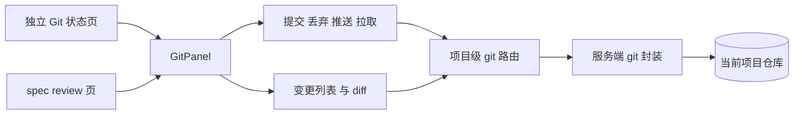
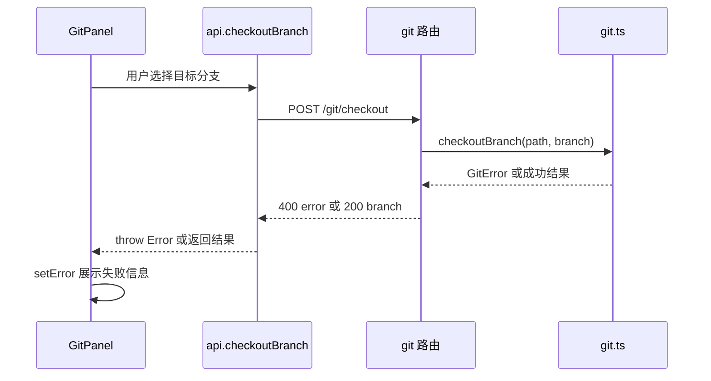
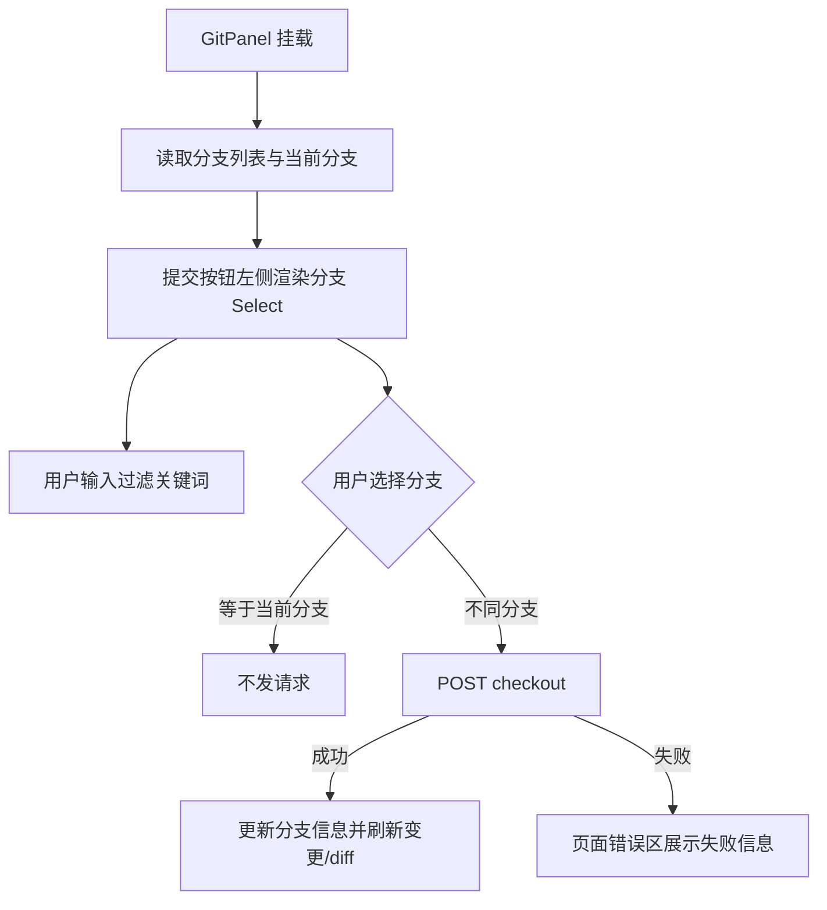
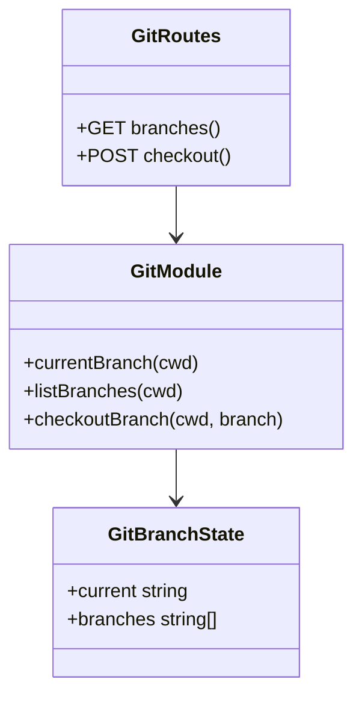
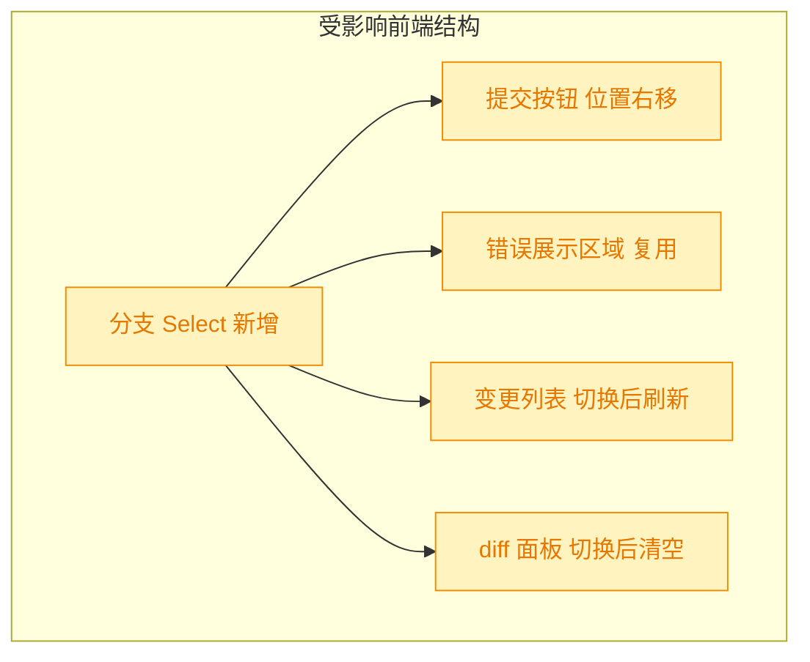

# 260820.feat.git-branch-switcher

## 1. 背景

上一份 `@.yorz/specs/260819.feat.git-status-page/spec.md` 已将 git 状态能力抽离为公共 `GitPanel`，并新增独立 Git 状态页。当前页面可以提交、丢弃、推送、拉取和查看 diff，但操作区没有展示当前分支，也不能在页面内切换分支。用户在提交前需要确认目标分支，并希望可通过支持过滤的 Select 手动切换分支；若切换失败，页面必须直接显示 git 错误信息。

## 2. 需求

- 在 Git 状态页的提交按钮左侧显示当前分支。
- 当前分支使用 Select 组件展示，支持过滤。
- 允许用户手动切换分支。
- 如果切换 git 分支失败，在页面显示对应错误信息。

## 3. 现状分析

### 3.1 当前 git 页面结构

当前 `GitPanel` 是独立 Git 状态页和 spec review 页共用的操作面板。服务端已提供项目级 git 接口，但能力集中在变更、diff、提交、丢弃、推送、拉取，尚无分支读取或切换接口。

精确层：相关文件与缺口

- `src/gui/src/components/GitPanel.tsx`：操作按钮区域位于顶部 `flex flex-wrap items-center gap-2`，当前按钮顺序从 `提交` 开始；错误显示使用 `error` signal 并渲染为 `text-destructive` 文本。
- `src/gui/src/components/ui/select.tsx`：已存在 Kobalte Select 封装，支持 trigger/content/item，但项目没有封装 combobox；要实现过滤需要基于现有 Select content 在面板内增加搜索输入过滤 item。
- `src/gui/src/lib/api.ts`：已有 `projectPush` / `projectPull` 等项目级方法，尚无 `getBranches` / `checkoutBranch` 类型和方法。
- `src/service/routes/git.ts`：已有 `/git/changes`、`/git/diff`、`/git/commit`、`/git/discard`、`/git/push`、`/git/pull`；尚无 branch 路由。
- `src/service/git.ts`：已有内部 `currentBranch()`，但只服务 push/pull，未导出；尚无分支列表和 checkout 封装。
- `src/gui/src/i18n/zh-CN.ts` 与 `src/gui/src/i18n/en.ts`：所有展示文案必须通过 `git.*` 国际化键新增，不能在组件中写裸文本。

### 3.2 现有错误展示链路

切换分支失败可以沿用当前直接 git 操作的错误展示方式：服务端将 `GitError` 转为 `400 { error }`，前端 `request()` 抛出 `Error("400 ...")`，`GitPanel` 捕获后写入 `error`，页面已有固定错误展示区域。

## 4. 技术实现方案

### 4.1 总体方案

在项目级 git API 中新增「分支列表 + 当前分支」读取接口和「切换分支」接口；`GitPanel` 顶部操作区在提交按钮左侧渲染支持过滤的 Select。切换成功后更新当前分支、刷新变更列表和当前 diff 预览；切换失败时保持原分支选择并复用现有 `error` 区域展示错误。

### 4.2 服务端接口与 git 封装

- `src/service/git.ts` 导出 `currentBranch()`，新增 `listBranches(cwd)` 与 `checkoutBranch(cwd, branch)`。
- `listBranches` 使用 `git branch --format=%(refname:short)` 获取本地分支列表，并组合当前分支返回 `{ current, branches }`。
- `checkoutBranch` 校验分支名只允许来自本地分支列表，避免把任意用户输入直接交给 `git checkout`；执行 `git checkout <branch>`，失败时抛出带 stderr 的 `GitError('checkout_failed', ...)`。
- `src/service/routes/git.ts` 新增：
  - `GET /projects/:projectId/git/branches` → `{ current: string, branches: string[] }`
  - `POST /projects/:projectId/git/checkout`，body `{ branch }` → `{ ok: true, current: string }`
- 路由错误处理沿用现有模式：`GitError` 转为 `400 { error: err.message }`，从而让前端直接显示失败原因。

精确层：服务端实现细节

- 分支名校验不使用 `assertSafeRelativePath`，因为分支名不是路径；使用 `listBranches()` 结果做白名单校验。
- detached HEAD 时 `currentBranch()` 已会抛出 `GitError('detached_head', ...)`；分支 Select 显示错误，不提供伪分支占位。
- 切换后由服务端返回当前分支，前端随后重新读取分支列表，确保分支集合与当前值一致。
- 本需求只覆盖本地分支切换，不新增创建分支、删除分支、远端分支 checkout 或 stash 自动保护。

### 4.3 前端交互方案

- `src/gui/src/lib/api.ts` 新增 `GitBranchState` 类型、`getGitBranches(pid)`、`checkoutGitBranch(pid, branch)`。
- `GitPanel` 增加 `branches` resource / signal、`branchQuery`、`branchError` 可直接合并进现有 `error` 展示。
- 顶部操作区调整为：`分支 Select` `提交` `丢弃` `|` `推送` `拉取`。
- Select 使用现有 `src/gui/src/components/ui/select.tsx` 组件；`SelectContent` 顶部放一个输入框作为过滤框，`SelectItem` 只渲染匹配项。过滤输入的 placeholder、空态、加载态、失败态均走 `git.*` i18n。
- 切换期间禁用 Select 和其它 git 操作，避免 checkout 与 commit/push/pull 并发修改仓库状态。
- 切换成功后清空 `selectedPaths`、`activePath` 与旧错误，并主动调用 `api.getProjectChanges()` 更新列表，避免等待 SSE 轮询。
- 切换失败时不改 `current`，将错误显示在页面已有错误区域。

### 4.4 验证方案

- 新增/更新 `src/service/__tests__/git.test.ts`：覆盖分支列表、成功切换、非法/不存在分支拒绝、未提交冲突导致 checkout 失败时抛出 `GitError`。
- 新增/更新 `src/service/__tests__/git-routes.test.ts`：覆盖 `GET /git/branches` 与 `POST /git/checkout` 成功和失败响应。
- 执行 `pnpm exec prettier --write` 格式化改动文件。
- 执行 `pnpm exec tsc -b` 验证类型。
- 执行相关 vitest：`pnpm exec vitest run src/service/__tests__/git.test.ts src/service/__tests__/git-routes.test.ts`。

## 5. 待确认项

_暂无_

## 6. 任务清单

- [x] 在 `src/service/git.ts` 增加分支状态读取与切换封装（验收：`git.test.ts` 覆盖分支列表、成功切换、非法/不存在分支与 checkout 失败）
- [x] 在 `src/service/routes/git.ts` 增加项目级分支接口（验收：`git-routes.test.ts` 覆盖 `GET /git/branches` 与 `POST /git/checkout` 成功/失败）
- [x] 在 `src/gui/src/lib/api.ts` 增加分支 API 类型与方法（验收：`tsc -b` 不报类型错误）
- [x] 在 `src/gui/src/components/GitPanel.tsx` 的提交按钮左侧加入支持过滤的分支 Select 与切换错误展示（验收：分支切换失败复用页面错误区，切换成功刷新变更列表并清空旧选择/diff）
- [x] 在 `src/gui/src/i18n/zh-CN.ts` 与 `src/gui/src/i18n/en.ts` 补齐 git 分支相关文案（验收：新增可见文字均通过 `git.*` 键获取）
- [x] 执行格式化、类型检查与相关测试（验收：`prettier`、`tsc -b`、相关 vitest 通过或记录阻塞原因）

## 7. 执行记录

- 2026-08-20 15:58:10：新建 spec，并完成 plan 阶段的现状分析、技术实现方案、图形化补充与待确认项自检；当前无待确认项。
- 2026-08-20 15:59:13：完成 tasks 阶段拆解，待确认项为空，按规则进入 execute。
- 2026-08-20 16:03:53：完成服务端分支能力：`src/service/git.ts` 新增分支列表、当前分支导出与 checkout 封装；`src/service/routes/git.ts` 新增 `GET /git/branches` 与 `POST /git/checkout`；服务端测试覆盖成功与失败路径。
- 2026-08-20 16:03:53：完成前端分支切换能力：`src/gui/src/lib/api.ts` 新增分支 API；`GitPanel` 在提交按钮左侧渲染可过滤 Select，切换成功刷新变更并清空旧选择/diff，失败复用页面错误区展示。
- 2026-08-20 16:03:53：完成 i18n：`zh-CN.ts` 与 `en.ts` 新增 `git.branchSelect`、`git.branchPlaceholder`、`git.branchFilterPlaceholder`、`git.noBranches`，新增可见文案均走国际化。
- 2026-08-20 16:03:53：验证通过：`pnpm exec prettier --write ...`、`pnpm exec vitest run src/service/__tests__/git.test.ts src/service/__tests__/git-routes.test.ts`（2 files / 40 tests passed）、`pnpm exec tsc -b`。
- 2026-08-20 16:03:53：任务全部完成，待确认项为空，标记 done。
