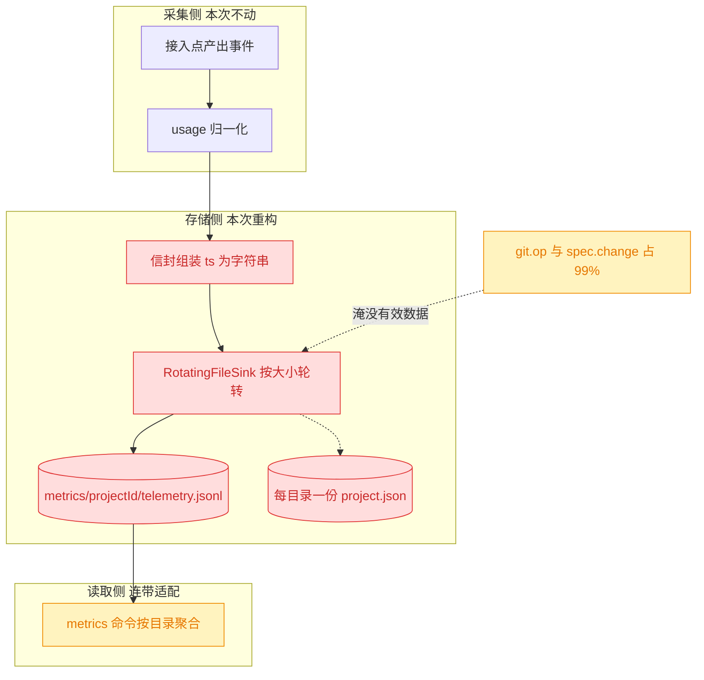
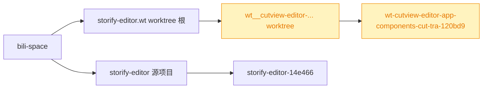
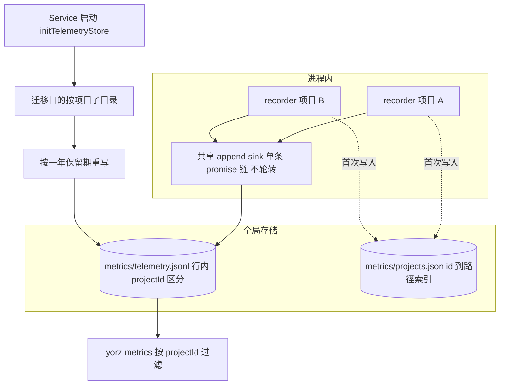
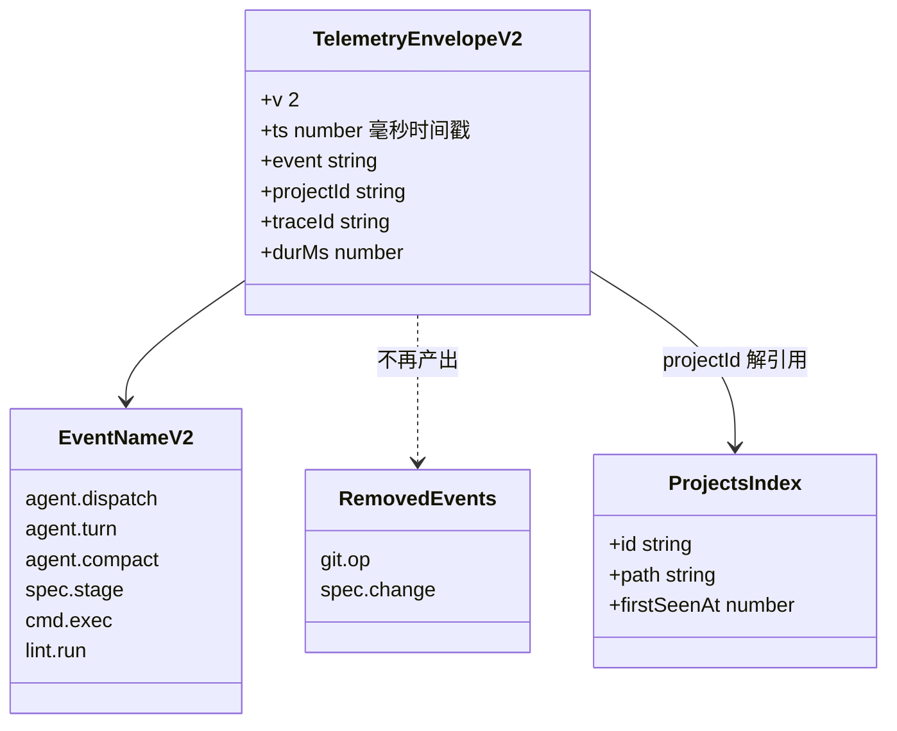
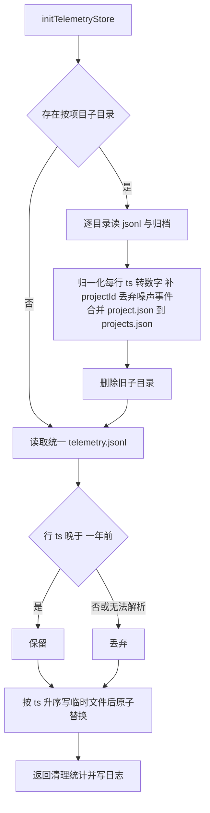
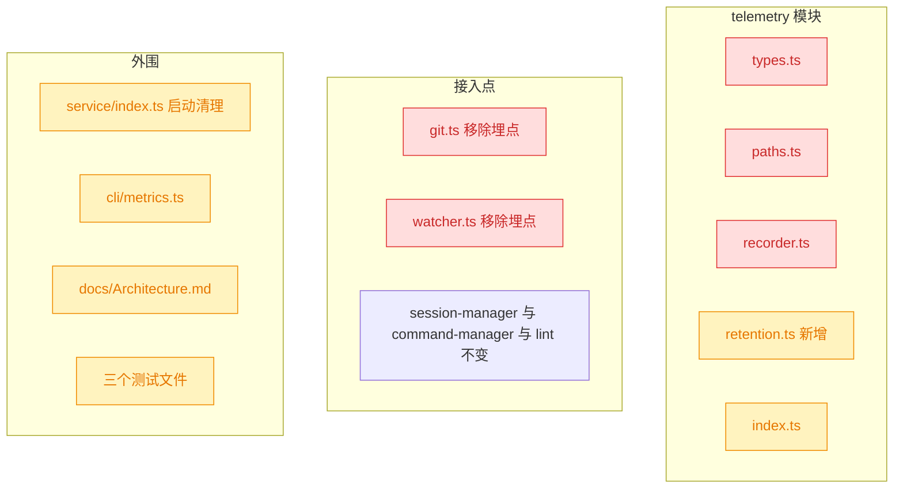
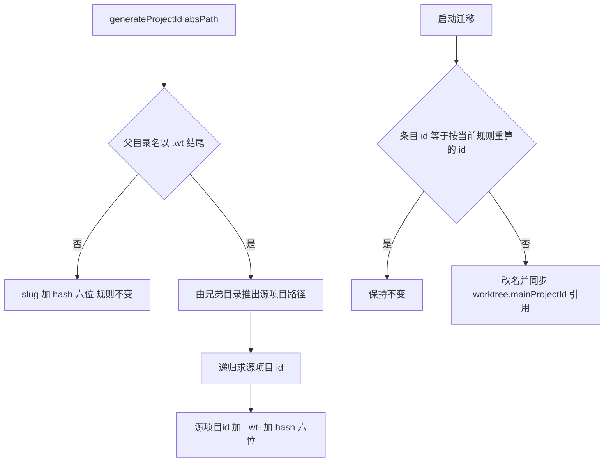

# 埋点存储重构：单文件归集、时间保留、数字时间戳与噪声事件裁剪

## 1. 背景

`260819.feat.agent-telemetry` 已落地埋点模块，「秤」造出来了。但真正开始用它统计时，四个存储层面的设计问题暴露出来，且互相纠缠：数据被按项目切成多个文件、容量按大小轮转、时间戳是字符串、97% 的行是没有分析价值的 `git.op`。

其中最严重的是后两者的组合效应：高频噪声把有效数据挤出了滚动窗口。本 spec 只做存储层重构，不改变埋点的采集语义与归一化模型。

## 2. 需求

1. 多个项目的埋点文件合并到同一个目录的同一个文件，通过 `projectId` 区分即可——拆成多个文件不方便统计和管理。
2. `telemetry.jsonl` 保留最近一年的埋点记录，启动时清除过期数据。
3. 信封中的 `ts` 使用数字格式，记录时间戳而不是字符串。
4. `git.op` 与 `spec.change` 数据量过大但没什么分析价值，移除这两类埋点。
5. worktree 项目的 `projectId` 太长（`projects.json` 中形如 `wt-cutview-editor-app-components-cut-tra-120bd9`），改用 `<源项目id>_wt-<六位hash>` 规则生成。
6. 不为旧 id 保留任何重算/迁移代码：存量数据维持现状即可，避免为一次性问题留下长期垃圾代码。

## 3. 现状分析

### 3.1 四条需求指向同一处：存储层的四个错配

采集侧（adapter 归一化、事件模型、接入点）无需改动；四条需求全部落在「事件如何落盘、如何被读回」这条线上：

### 3.2 噪声实测：99.2% 的行没有分析价值

对本机 `<globalConfigDir>/metrics/` 下三个项目、约 4 天的真实数据做全量统计：

| 事件             | 行数      | 占比  | 是否被 `yorz metrics` 消费 |
| ---------------- | --------- | ----- | -------------------------- |
| `git.op`         | 13948     | 97.2% | 否（仅计数）               |
| `spec.change`    | 285       | 2.0%  | 否（仅计数）               |
| `agent.dispatch` | 57        | 0.40% | 是                         |
| `agent.turn`     | 25        | 0.17% | 是（token / 成本主来源）   |
| `lint.run`       | 22        | 0.15% | 否（仅计数）               |
| `cmd.exec`       | 6         | 0.04% | 否（仅计数）               |
| `spec.stage`     | 3         | 0.02% | 否（仅计数）               |
| **合计**         | **14346** | 100%  | —                          |

`git.op` 泛滥有明确成因：GUI 的 git 状态面板会轮询状态接口，每次刷新触发数条 `git status` / `git diff`，而每条都记一行。它既不进入任何聚合指标，又把有效数据的信噪比压到 1:125。

统计口径与产出噪声的精确位置

- 统计方式：`cat <globalConfigDir>/metrics/*/telemetry.jsonl* | node -e '<按 event 计数>'`，2026-08-23 执行，总字节 1960278（约 1.9 MB / 4 天）。
- `git.op` 产出点：`src/service/git.ts:105` `recordGitOp()`，被同文件 `runGit()`（L114）与 `runGitRaw()` 两条路径调用；`runGitChecked` / `WorktreeManager` / git 路由全部经此。
- `spec.change` 产出点：`src/service/watcher.ts:160` `emit()`；`SpecWatcher` 的 `cwd` 字段（`watcher.ts:35,47`）当初正是为拿到项目根做埋点而引入，除该行外无其它读取点。
- 读取侧只消费 `agent.*`：`src/cli/metrics.ts:155` `applyEvent()` 首行即 `if (!event.startsWith('agent.')) return`，其余事件只在 `eventCounts` 里留一个计数。

### 3.3 大小轮转与「保留一年」在当前噪声下互斥

现行容量策略是 5 MiB × (1 当前 + 2 归档)（`paths.ts:11-13`），按 3.2 实测的约 0.5 MB/天写入速率，单文件约 10 天写满、整个窗口约 30 天即被完全覆盖——**保留一年在现行策略下根本不可达**。

而移除两类噪声后，剩余事件约 28 条/天，按当前平均行宽估算一年约 1 万条、数 MB 量级。也就是说：**裁掉噪声之后，一年的数据总量还不到现行单文件配额**，容量控制的主轴应当从「大小轮转」换成「时间保留」，大小轮转不再需要。

### 3.4 现有存储与读取实现的关键约束

三点必须在方案里被正面处理：

1. **多 recorder 写同一文件的行交错风险**：现在每个项目一个 `TelemetryRecorder`，各持一个 `RotatingFileSink`，写各自的文件所以互不干扰；合并文件后，若仍每项目一个 sink，两个 sink 的 promise 链彼此独立，同进程内就可能写出半行交错。
2. **`ts` 字符串已被读取侧依赖**：`metrics.ts:146` 的 `--since` 过滤直接对 `ts` 做 `slice(0, 10)` 字符串比较，改成数字后必须同步改写。
3. **旧数据的形状与新格式不兼容**：既有行 `ts` 为 `'YYYY-MM-DD HH:mm:ss'`、`v: 1`，且分散在 3 个项目子目录中；同时每个目录各有一份 `project.json`。

相关实现位置

- `src/service/telemetry/recorder.ts:34-104` `TelemetryRecorder`：构造时按 `dir` 建 `RotatingFileSink`；`record()` 组装信封（L63-69，`ts: nowStamp()`）；`ensureMeta()`（L87）每目录写一份 `project.json`；`nowStamp()`（L143）产出本地秒级字符串。
- `src/service/telemetry/recorder.ts:106-130`：`recorders` 按项目绝对路径缓存单例，`getTelemetry()` 是所有接入点的唯一入口。
- `src/service/telemetry/paths.ts:6-33`：`METRICS_DIR_NAME` / `TELEMETRY_FILE_NAME` / `PROJECT_META_FILE_NAME` / 轮转常量 / `resolveMetricsDir()` / `resolveProjectMetricsDir()`。
- `src/service/logger.ts:70-144` `RotatingFileSink`：`write()` 入队即返，所有写入串到 `this.queue` 单链；`writeNow()`（L100）在 `currentSize + bytes > maxBytes` 时轮转；错误全吞。
- `src/cli/metrics.ts:106-115` `telemetryFiles()`：枚举 `telemetry.jsonl` 及其 `.N` 归档；`resolveTargetDirs()`（L84）按目录选项目。
- `src/service/index.ts:60-113` `start()`：Service 唯一启动入口，`createApp()` 之前尚无任何埋点写入，是执行一次性清理的天然位置。
- 现有测试：`src/service/__tests__/telemetry.test.ts`、`src/service/__tests__/telemetry-integration.test.ts`（含 `git.op` / `spec.change` 两个用例）、`src/cli/__tests__/metrics.test.ts`（fixture 含 `git.op` 行）。

### 3.5 worktree 项目 id 为何又长又不可读

`generateProjectId(absPath)` 只认路径的 basename：worktree 的目录名是分支名转义而来（`wt/<spec-slug>` → `wt__<spec-slug>`），slug 化后被截到 40 字符，于是产出 `wt-cutview-editor-app-components-cut-tra-120bd9` 这种被拦腰截断、还看不出属于哪个源项目的 id。

而 worktree 的目录布局本身是自描述的——`WorktreeManager` 固定把 worktree 建在源项目的兄弟目录 `<源项目名>.wt/` 之下：

也就是说，「这是谁的 worktree」这个信息完全可以从路径本身推回来，不需要查注册表——这正是新规则可以保持 `generateProjectId` 为纯函数的前提。

目录约定与 id 的现有用途

- 布局产出点：`src/service/worktree-manager.ts:98-99` —— `wtRoot = <dirname(mainPath)>/<basename(mainPath)>.wt`，`wtPath = <wtRoot>/<branch 中的斜杠替换为 __>`。
- id 产出点：`src/service/global-config.ts:364-369` `generateProjectId()` = `slugify(basename).slice(0,40)` + `-` + `sha256(absPath).slice(0,6)`。
- id 的落点只有三处：全局 `config.json` 的 `projects[].id` 与 `worktree.mainProjectId` 引用、运行时 HTTP 路由参数、埋点行的 `projectId`。**没有任何按 id 命名的磁盘目录**（session / attachment / spec-draft 一律按项目路径落盘），GUI 也不持久化 project id（`ProjectsSidebar` 的 localStorage 只存折叠状态与宽度）。因此改名的影响面被限制在「配置里的字符串」与「埋点历史行」两处。
- 一致性不变量：注册表 id 与埋点 id 都来自同一个纯函数，因此天然相等。改规则时必须同时迁移既有条目，否则同一个 worktree 会在注册表叫旧名、在埋点里叫新名。

## 4. 技术实现方案

### 4.1 目标布局：一个目录、一个数据文件、一份项目索引

`getTelemetry(projectRoot)` 的对外签名与所有接入点保持不变；变的是 recorder 内部——它不再拥有自己的文件，只持有 `projectId` 并把行交给按 metrics 目录缓存的**共享 sink**，由此消解 3.4-1 的行交错风险。

### 4.2 信封 v2：数字时间戳与收缩后的事件集

字段级变更清单

- `TELEMETRY_SCHEMA_VERSION`：`1` → `2`。
- `TelemetryEnvelope.ts`：`string`（`'YYYY-MM-DD HH:mm:ss'`）→ `number`（`Date.now()` 毫秒 epoch）。选毫秒而非秒：与信封内既有的 `durMs`、payload 里的 `mtimeMs` / `durationMs` 单位一致，且 `Date.now()` 直接可用无需除法取整。
- `TelemetryEventName`：删除 `'git.op'`、`'spec.change'` 两个字面量；`(string & {})` 开放命名空间保留。
- `ProjectMetricsMeta`：由「每目录一份 `project.json`」改为全局一份 `projects.json`，结构 `Record<projectId, { path: string; firstSeenAt: number }>`；`firstSeenAt` 同步改为毫秒数字。
- `paths.ts`：删除 `PROJECT_META_FILE_NAME` 的旧语义与 `resolveProjectMetricsDir()`，新增 `resolveTelemetryFile(env)` / `resolveProjectsIndexFile(env)` / `PROJECTS_INDEX_FILE_NAME` / `TELEMETRY_RETENTION_DAYS`；删除 `DEFAULT_TELEMETRY_MAX_BYTES` / `DEFAULT_TELEMETRY_MAX_ARCHIVES` 的轮转语义，改以「不轮转」常量表达。
- 轮转关闭方式：共享 sink 仍复用 `RotatingFileSink`（其入队即返、单链串行、错误全吞的语义正是埋点所需），但以 `maxBytes = Number.POSITIVE_INFINITY` / `maxArchives = 0` 构造，使 `writeNow()` 的轮转分支永不成立，容量交由启动清理负责。

### 4.3 启动清理：迁移 + 保留期裁剪，一次走完

新增 `src/service/telemetry/retention.ts`，导出 `initTelemetryStore(opts?)`，在 `start()` 里于 `createApp()` 之前 `await` 执行一次；任何异常都被吞掉，绝不阻断 Service 启动：

清理与迁移的实现细则

- **保留期**：`TELEMETRY_RETENTION_DAYS = 365`，cutoff = `now - 365 * 86400_000`。`initTelemetryStore({ now, retentionMs, env })` 三个参数均可注入，单测据此构造过期行，无需引入环境变量开关。
- **旧行归一化**：迁移时把 `'YYYY-MM-DD HH:mm:ss'` 按本地时区解析为毫秒数字并把 `v` 改写为 `2`；`projectId` 缺失时用所在子目录名兜底。因此统一文件内**只存在数字 `ts`**，读取侧无需保留字符串兼容分支。
- **顺带去噪**：迁移时直接丢弃 `git.op` / `spec.change` 行——它们正是本 spec 判定为无价值的 99.2%，迁移是清掉历史存量的唯一时机。
- **无法解析的行**：JSON 解析失败或 `ts` 既非数字也非可解析字符串的行一律丢弃，并计入返回值的 `dropped`，由启动日志打印，不静默吞掉。
- **原子替换**：写 `telemetry.jsonl.tmp` 后 `rename` 覆盖，避免中途崩溃留下半个文件。
- **排序**：合并多个项目的历史后按 `ts` 升序输出，使统一文件保持时间有序，便于 `tail` 与后续按时间截断。
- **跨进程竞态**：清理只在 Service 启动的写入静默期执行；同一时刻若恰有 CLI 进程（`yorz lint`）在追加，极小概率丢失该行。埋点非关键数据，不为此引入锁文件。

### 4.4 读取侧：目录选择改为行内过滤

`yorz metrics` 的对外选项（`--project` / `--all` / `--since` / `--format`）保持不变，实现改为：读唯一的 `telemetry.jsonl`，按 `projectId` 过滤。

metrics.ts 具体改动

- `resolveTargetDirs()` → `resolveProjectFilter(opts)`：返回 `null`（`--all`，不过滤）或一个 `projectId`。`--project` 传绝对路径时用 `generateProjectId()` 换算，传短 id 时直接使用；缺省时由 `findProjectRoot(cwd)` 换算。
- `telemetryFiles()` 删除（不再有归档）。
- `--since`：由 `ts.slice(0,10) < since` 改为把 `since`（`YYYY-MM-DD`）解析为本地零点毫秒后做数值比较。
- `MetricsSummary.projects`：改为从 `projects.json` 反查 `id (path)`；`files` 字段退化为单元素，保留以免破坏 `--format json` 的既有形状。
- 空态提示：由「目录不存在」改为「统一文件不存在或过滤后无匹配行」，退出码 1 的语义不变。

### 4.5 影响面

对外行为（HTTP 路由、GUI、CLI 选项）无变化：埋点数据不出现在任何 API 响应里，GUI 从不读取 metrics 目录，`yorz metrics` 选项集不变。唯一的破坏性是**磁盘上的数据格式**，而它由 4.3 的一次性迁移自动完成。

### 4.6 worktree 项目 id 规则与既有 id 迁移

新规则只对 worktree 生效，普通项目分毫不动：

效果对比：`wt-cutview-editor-app-components-cut-tra-120bd9`（47 字符、看不出归属）→ `storify-editor-14e466_wt-120bd9`（31 字符、一眼看出是 `storify-editor` 的 worktree）。hash 仍取 worktree 绝对路径的 sha256 前 6 位，因此后缀与旧 id 完全一致，人工比对时能直接对上号。

规则细节、迁移范围与边界情况

- **检测**：`basename(dirname(absPath))` 以 `.wt` 结尾时判定为 worktree，源项目路径 = 同级目录下去掉 `.wt` 后缀的那个名字。这与 `worktree-manager.ts` 的建目录逻辑严格对偶，且不需要读注册表或碰磁盘，`generateProjectId` 保持纯函数——`cli/metrics.ts` 与埋点 recorder 都只有一个路径可用，这是硬约束。
- **递归**：源项目 id 由同一个函数递归求得，天然处理 `a.wt/b` 嵌套；`createWorktree` 本就禁止从 worktree 再建 worktree（`worktree-manager.ts:89-91`），但函数仍以深度上限兜底，避免被畸形路径拖入深递归。
- **不做任何 id 迁移**：既有配置条目与埋点历史行原样保留旧 id，新规则只作用于此后新建/新注册的 worktree。代价见下方决策记录。
- **规则切换后的实际状态**：本机存量数据在演练阶段已被改写为新 id（`storify-editor-14e466_wt-120bd9`），迁移代码移除后这一状态原样保留——数据是数据，代码不为它长期背负一段只跑一次的分支。

### 4.7 关键决策说明

> 决策记录：统一文件的容量控制由「大小轮转」改为「启动时按一年保留期裁剪」，并关闭 `RotatingFileSink` 的轮转。理由：3.3 实测显示两者在语义上互斥——大小轮转会在约 30 天内覆盖掉整个窗口，而裁掉噪声后一年数据不足现行单文件配额，轮转已无必要；且合并成单文件后，按大小轮转会跨项目连带截断，任何单项目的历史都可能被另一个高频项目挤掉。被否决备选：保留轮转并把 `maxBytes` 调到 64 MiB 作兜底 —— 会让读取侧继续维护 `.N` 归档枚举逻辑，而实际永远触发不到，是纯粹的死代码。

> 决策记录：所有 recorder 共享同一个 sink 实例（按 metrics 目录缓存），而非每项目一个 sink。理由：`RotatingFileSink` 的原子性来自「所有写入串到同一条 promise 链」，两个 sink 写同一路径时该保证失效，可能写出交错的半行。被否决备选：每次写入用 `appendFile` 直写 —— 单行小于 PIPE_BUF 时通常原子，但这依赖平台与文件系统实现，不值得赌。

> 决策记录：`ts` 采用毫秒 epoch 而非秒。理由：与信封既有的 `durMs` 及 payload 中 `mtimeMs` / `durationMs` 单位统一，`Date.now()` 直接可用；秒级需额外取整且在跨事件排序时可能出现同秒歧义。

> 决策记录：历史数据做一次性迁移合并（而非直接删除旧目录另起炉灶）。理由：行内早已冗余 `projectId` 字段，正是为「多项目文件合并后仍可归因」而设计，迁移只是把这个设计兑现；迁移代价低（数 MB），却能保住已采集的 57 次派发 / 25 轮 token 基线——那正是原 spec 造这把「秤」的产物。被否决备选：删除旧目录 —— 基线归零，后续优化策略又将失去对比对象。

> 决策记录：迁移时同步丢弃历史 `git.op` / `spec.change` 行。理由：这两类正是本次判定为无分析价值的 99.2%，若原样搬进统一文件，「不方便统计管理」的问题依旧存在；迁移是清理存量的唯一时机。

> 决策记录：保留期固定 365 天，不引入 `YORZ_TELEMETRY_RETENTION_DAYS` 环境变量。理由：清理入口以参数注入 `now` / `retentionMs`，单测已可覆盖，无需为测试造开关；用户侧尚无调整保留期的诉求，YAGNI。

> 决策记录：清理只在 Service 启动时执行，CLI 短命进程（`yorz lint` / `yorz metrics`）不触发。理由：Service 是绝大多数事件的产出方且必然被启动，把清理放在其启动静默期最安全；在 CLI 里做会拖慢命令，且与 Service 的写入形成跨进程重写竞态。

> 决策记录：`git.op` / `spec.change` 从事件类型联合中彻底删除，而不是保留定义但停止产出。理由：类型联合是这套事件模型的唯一文档，留着已废弃的名字会误导后续接入者；`(string & {})` 的开放命名空间保证将来若要恢复也无需改核心模块。

> 决策记录：`SpecWatcher` 的 `cwd` 构造字段随 `spec.change` 一并移除。理由：3.2 折叠块已核实其唯一读取点就是那行埋点，留下即成悬空字段。

> 决策记录：worktree 归属由「路径约定」推断，而不是查注册表的 `worktree.mainProjectId`。理由：`generateProjectId` 被埋点 recorder 与 `yorz metrics` 在只有一个路径、没有注册表的场景下调用，必须保持纯函数；而 `.wt` 目录布局由 `WorktreeManager` 单点产出，约定足够可靠。被否决备选：给 `generateProjectId` 加可选的 `mainProjectId` 参数 —— 调用方各自穿透归属信息，反而把「谁是 worktree」的知识散布到每个调用点。

> 决策记录：hash 仍取 worktree 自身绝对路径，而非分支名或源项目路径。理由：与既有规则同源，保证同一路径 id 稳定；且新旧 id 的 6 位后缀相同，迁移前后可人工对号。被否决备选：用分支名做 hash —— 分支可改名，id 就会漂移。

> 决策记录：需求 6「移除全部 id 重算/迁移逻辑，数据保持现状」——用户否决了上一轮「启动时一次性迁移既有 id」的方案，理由：迁移代码只在升级那一刻跑一次，此后永远是死分支，为一次性问题留长期垃圾代码不划算。据此删除 `migrateProjectIds` / `migrateGlobalProjectIds`、`start()` 中的迁移调用、埋点清理中的 `reattribute()` 与 `reattributed` 统计，以及旧目录折叠时的 id 重算；`generateProjectId` 的新规则本身保留。

> 决策记录：接受「存量 worktree 条目保留旧 id」这一代价。理由：id 没有任何按名落盘的副本（session / attachment / spec-draft 一律按路径落盘），旧 id 只是配置里的一个字符串与历史行里的一个字段，读起来不美观但不影响任何功能；worktree 本身是短命对象，merge-back 后条目即被删除，旧 id 会自然消失。被否决备选：保留迁移代码 —— 见上条。

## 5. 待确认项

_暂无_

## 6. 任务清单

- [x] 改造 `src/service/telemetry/types.ts`：`TELEMETRY_SCHEMA_VERSION` 升到 2、`ts` 改为 `number`、事件联合删除 `git.op` 与 `spec.change`、`ProjectMetricsMeta` 改为全局索引条目结构（验收：`pnpm typecheck` 报错仅集中在待改造的下游文件）
- [x] 改造 `src/service/telemetry/paths.ts`：新增 `TELEMETRY_RETENTION_DAYS` / `PROJECTS_INDEX_FILE_NAME` / `resolveTelemetryFile()` / `resolveProjectsIndexFile()`，删除 `resolveProjectMetricsDir()` 与两个轮转常量（验收：单测断言统一文件路径为 `<YORZ_HOME>/metrics/telemetry.jsonl`）
- [x] 改造 `src/service/telemetry/recorder.ts`：所有项目共享按 metrics 目录缓存的单个不轮转 sink，`ts` 写 `Date.now()`，首次写入时把 `projectId → { path, firstSeenAt }` 并入 `projects.json`（验收：单测中两个不同项目根写入后同一文件出现两种 `projectId`，且行数与写入次数一致）
- [x] 新增 `src/service/telemetry/retention.ts` 的 `initTelemetryStore({ env, now, retentionMs })`：迁移旧的按项目子目录（ts 转数字、补 `projectId`、丢弃噪声事件、合并 `project.json`、删除旧目录），再按保留期裁剪并按 `ts` 升序原子重写，返回 `{ migrated, kept, dropped }`（验收：单测构造旧布局 + 超期行，断言旧目录消失、过期与噪声行被丢弃、统一文件按时间有序）
- [x] 更新 `src/service/telemetry/index.ts` 导出面（验收：`grep resolveProjectMetricsDir src` 无残留引用）
- [x] 移除 `src/service/git.ts` 的 `recordGitOp()` 及其两处调用与 telemetry import（验收：`grep "git.op" src` 无残留）
- [x] 移除 `src/service/watcher.ts` 的 `spec.change` 埋点及仅为其存在的 `cwd` 字段与构造参数，同步调整 `project-registry.ts` 的构造调用（验收：`pnpm typecheck` 通过且 `grep "spec.change" src` 无残留）
- [x] 在 `src/service/index.ts` 的 `start()` 中于 `createApp()` 之前 `await initTelemetryStore()`，异常吞掉并记日志（验收：Service 启动日志出现清理统计，清理失败时仍能正常监听）
- [x] 改造 `src/cli/metrics.ts`：读单一文件、按 `projectId` 过滤（`--project` 支持 id 与绝对路径、`--all` 不过滤）、`--since` 改数值比较、项目标签取自 `projects.json`、删除归档枚举（验收：`--format json` 输出可 `JSON.parse` 且 `projects` 字段含 `id (path)`）
- [x] 更新 `src/service/__tests__/telemetry.test.ts` 至新布局与数字 `ts`，补共享 sink 与 `projects.json` 用例（验收：该文件全部用例通过）
- [x] 更新 `src/service/__tests__/telemetry-integration.test.ts`：删除 `git.op` 与 `spec.change` 两个用例，其余用例改读统一文件（验收：该文件全部用例通过）
- [x] 更新 `src/cli/__tests__/metrics.test.ts`：fixture 改写为单文件 + 数字 `ts`，去掉 `git.op` 行，补一条跨项目过滤用例（验收：该文件全部用例通过）
- [x] 更新 `docs/Architecture.md` 的 telemetry 小节：新的单文件路径、`projects.json`、一年保留期与启动清理、首期事件由 8 类收缩为 6 类（验收：文档不再出现 `metrics/<projectId>/` 路径与已删事件名）
- [x] 运行 `pnpm typecheck` 与 `pnpm test` 全量校验（验收：均通过，无新增失败用例）
- [x] 改造 `src/service/global-config.ts` 的 `generateProjectId()`：识别 `<源项目名>.wt/` 布局并产出 `<源项目id>_wt-<hash6>`，普通项目规则不变，带深度上限防御畸形路径（验收：单测断言 worktree 路径得到新形态、普通路径 id 与改造前完全一致）
- [x] 在 `global-config.ts` 新增通用 id 迁移：重算全部条目 id，按 old→new 映射同步 `worktree.mainProjectId` 引用，返回改名清单（验收：单测构造含旧 worktree id 的配置，断言改名且引用同步、无关条目零改动）
- [x] 在 `service/index.ts` 的 `start()` 中于埋点清理之前执行 id 迁移并记日志（验收：启动日志出现改名统计，迁移失败不阻断监听）
- [x] 在 `telemetry/retention.ts` 的清理流程中按 `projects.json` 的 path 重算 id，改写历史行 `projectId` 并重建索引（验收：单测构造带旧 worktree id 的历史行与索引，断言行与索引均被改写为新 id）
- [x] 运行 `pnpm typecheck` 与 `pnpm test` 全量校验（验收：均通过，无新增失败用例）
- [x] 用真实 `~/.config/yorz` 数据演练 id 迁移（先备份）：核对 worktree 条目改名、`projects.json` 与历史行同步、`yorz metrics --all` 中该 worktree 历史未分裂（验收：迁移后该项目 id 为 `storify-editor-14e466_wt-120bd9` 且事件数不变）
- [x] 删除 `global-config.ts` 的 `migrateProjectIds()` / `migrateGlobalProjectIds()` / `ProjectIdRename` 及其单测（验收：`grep migrateProjectIds src` 无残留）
- [x] 移除 `service/index.ts` 启动流程中的 id 迁移调用与日志（验收：`start()` 仅保留埋点清理一处 housekeeping）
- [x] 移除 `telemetry/retention.ts` 的 `reattribute()`、`reattributed` 统计、`collect()` 的 `supersededProjectId` 参数与旧目录折叠时的 id 重算，恢复为「按行内既有 `projectId` 原样归集」（验收：`grep reattribut src` 无残留，`TelemetryStoreStats` 回到 4 个字段）
- [x] 删除两个依赖重算行为的埋点单测，保留 worktree id 规则本身的单测（验收：`pnpm test` 通过且 `generateProjectId` 的 worktree 用例仍在）
- [x] 运行 `pnpm typecheck` 与 `pnpm test` 全量校验（验收：均通过，无新增失败用例）
- [x] 用真实 `YORZ_HOME` 数据演练一次迁移：先备份 `<globalConfigDir>/metrics`，再跑一次启动清理，核对统一文件行数等于原有效事件数（验收：`yorz metrics --all` 输出的派发/轮次与迁移前一致）

## 7. 执行记录

- 2026-08-23 12:24 —— `telemetry/types.ts`：`TELEMETRY_SCHEMA_VERSION` 升至 `2`；`TelemetryEnvelope.ts` 由 `string` 改为毫秒 `number`；事件联合删除 `git.op` / `spec.change`；`ProjectMetricsMeta` 改为 `{ path, firstSeenAt: number }` 并新增 `ProjectsIndex = Record<projectId, ProjectMetricsMeta>`。验证：`pnpm typecheck` 的报错收敛到待改造的下游文件。
- 2026-08-23 12:25 —— `telemetry/paths.ts`：新增 `PROJECTS_INDEX_FILE_NAME` / `TELEMETRY_RETENTION_DAYS` / `TELEMETRY_RETENTION_MS` / `resolveTelemetryFile()` / `resolveProjectsIndexFile()`；删除 `resolveProjectMetricsDir()` 与 `PROJECT_META_FILE_NAME`；轮转常量改为 `TELEMETRY_MAX_BYTES = Infinity` / `TELEMETRY_MAX_ARCHIVES = 0`，使 `RotatingFileSink` 的轮转分支永不成立。验证：单测断言 `<YORZ_HOME>/metrics/telemetry.jsonl` 与 `projects.json` 路径。
- 2026-08-23 12:28 —— `telemetry/recorder.ts`：sink 按 metrics 目录缓存并由全部 recorder 共享；`ts` 改为 `Date.now()`；`project.json` 旁挂改为并入全局 `projects.json`。**实测暴露一个真实缺陷**：最初每个 recorder 各持一条索引 promise 链，两个项目并发写 `projects.json` 时后写者用迁移前的快照覆盖了先写者，单测直接测出「索引只剩 1 个项目」；改为按索引文件共享队列（`indexQueues`）后恢复正确——与共享 sink 是同一个道理，读-改-写必须串到同一条链上。
- 2026-08-23 12:30 —— 新增 `telemetry/retention.ts`：`initTelemetryStore({ env, now, retentionMs })` 先把旧的 `metrics/<projectId>/` 子目录（含 `.N` 归档）折叠进统一文件——逐行归一化 `ts`（兼容 v1 字符串）、补 `projectId`、丢弃已废弃事件、合并 `project.json` 到 `projects.json`、删除旧目录——再按 365 天保留期裁剪、按 `ts` 升序、经临时文件 rename 原子重写；返回 `{ migrated, kept, dropped, legacyDirs }`。无历史且无新数据时不创建空文件。
- 2026-08-23 12:31 —— `telemetry/index.ts` 导出面更新（新增 `initTelemetryStore` / `parseTs` / 路径与保留期常量，移除 `resolveProjectMetricsDir` / `PROJECT_META_FILE_NAME`）。验证：`grep resolveProjectMetricsDir src` 无残留。
- 2026-08-23 12:32 —— `git.ts` 移除 `recordGitOp()` 与其 4 处调用及 `startedAt` 计时；`watcher.ts` 移除 `emit()` 中的 `spec.change` 与仅为其存在的私有 `cwd` 字段（`WatcherOptions.cwd` 仍用于推导 specs 根目录，故保留）。验证：`grep "git.op\|spec.change" src` 无残留，`pnpm typecheck` 通过。
- 2026-08-23 12:33 —— `service/index.ts` 的 `start()` 在 `createApp()` 之前 `await initTelemetryStore()`，成功记 `telemetry store ready` 并附统计，失败降级为 `warn` 且不阻断监听。选址依据：此刻尚无任何 sink 附着到该文件，重写是安全的。
- 2026-08-23 12:34 —— `cli/metrics.ts` 改造：`resolveTargetDirs()` → `resolveProjectFilter()`（`--all` 不过滤 / `--project` 支持 id 与绝对路径 / 缺省按 cwd 项目），删除归档枚举，`--since` 改为解析本地零点毫秒后做数值比较，`projects` 标签改由 `projects.json` 反查；过滤后无匹配行时给出针对性提示并保持退出码 1。
- 2026-08-23 12:35 —— 测试更新：`telemetry.test.ts` 改用单文件读取并新增「两个项目合并进同一文件靠 projectId 区分」「索引一次写入」以及 4 个 housekeeping 用例（过期裁剪与排序、坏行计入 dropped、旧布局迁移 + 废弃事件丢弃、空态不建文件），共 20 个用例通过；`telemetry-integration.test.ts` 删除 `git.op` / `spec.change` 两个用例，改为「真实 Service 启动时折叠旧目录」的集成用例，3 个用例通过；`metrics.test.ts` fixture 改为单文件 + 数字 `ts` 并新增跨项目过滤用例，5 个用例通过。
- 2026-08-23 12:35 —— `docs/Architecture.md` 4.2 Telemetry 小节：更新为单文件路径 + `projects.json` 索引、schema v2 数字 `ts`、365 天保留与启动清理、共享 sink 与关闭轮转的理由，事件集由 8 类收缩为 6 类并注明两类被移除的原因。
- 2026-08-23 12:36 —— 全量校验：`pnpm typecheck` 通过；`pnpm test` 70 个测试文件 / 643 用例通过（2 跳过），较重构前 632 用例净增 11，无失败。
- 2026-08-23 12:36 —— 真实数据演练（先 `cp -R` 备份到 `/tmp/metrics-backup-260823`）：迁移前 3 个项目目录共 14373 行（`git.op` 13948 / `spec.change` 310 / 有效 115）。执行 `initTelemetryStore()` 得 `{ migrated: 115, kept: 115, dropped: 14258, legacyDirs: 3 }`，目录只剩 `telemetry.jsonl` 与 `projects.json`，**有效事件 115 条一条未丢**（57 派发 + 25 轮次 + 24 lint + 6 命令 + 3 阶段，与迁移前逐类一致），体积 1.9 MB → 39 KB。`yorz metrics --all` 一次读出三个项目的聚合（$56.34 / 25 轮次 / 6144 万 cacheRead），验证读取侧改造正确。
- 2026-08-23 12:36 —— 收尾：任务清单 15 项全部完成，`## 待确认项` 为 `_暂无_`，无 `！！！` 批注与 `[open]` 追加任务，标记 `stage: done`。信噪比从 1:125 回到 1:0，一年保留期从「不可达」变为「用不满」。
- 2026-08-23 12:45 —— `global-config.ts`：新增 `resolveWorktreeMainPath()`（按 `<源项目名>.wt/` 路径约定推源项目，纯函数、不碰磁盘不查注册表），`generateProjectId()` 据此对 worktree 产出 `<源项目id>_wt-<hash6>`，hash 仍取 worktree 自身路径，并以深度上限兜底畸形嵌套路径；普通项目规则一字未改。验证：单测断言 worktree 新形态、普通路径与改造前一致、`thing.wt` 本身（`.wt` 不在父目录位置）不被误判、12 层嵌套不爆栈。
- 2026-08-23 12:45 —— `global-config.ts` 新增通用 id 迁移 `migrateProjectIds(config)` / `migrateGlobalProjectIds(filePath)`：凡 `id !== generateProjectId(path)` 即改名，并用 old→new 映射同步 `worktree.mainProjectId` 引用，返回改名清单。写成「与当前规则比对」的通用形式，日后再调规则无需新增迁移代码。验证：单测覆盖「主项目与 worktree 同时改名后引用仍指得回去」「全部合规时零改动」「改名持久化到配置文件」。
- 2026-08-23 12:46 —— `service/index.ts` 的 `start()` 在埋点清理**之前**执行 id 迁移并记日志。顺序有讲究：注册表 id 与埋点 id 出自同一个纯函数、二者必须相等，先把配置迁移到新规则，后续埋点归因才不会分裂。
- 2026-08-23 12:46 —— `telemetry/retention.ts` 新增 `reattribute()`：以 `projects.json` 的 path 重算 id，改写历史行 `projectId` 并按新 id 重建索引；折叠旧的按项目子目录时也直接落到重算后的 id（目录名是旧 id，`project.json` 里的 path 才是真相）。统计新增 `reattributed` 字段，且只统计最终留存的行。实现与具体规则解耦——它只知道「id 应由 path 推出」。验证：单测覆盖「统一文件中的旧 worktree id 被改写且索引重建」「旧目录直接折叠到新 id」。
- 2026-08-23 12:47 —— 全量校验：`pnpm typecheck` 通过；`pnpm test` 70 文件 / 651 用例通过（2 跳过），较上一轮净增 8 个用例。
- 2026-08-23 12:47 —— 真实数据演练（配置与 metrics 均先备份到 `/tmp`）：`migrateGlobalProjectIds` 返回空清单——该 worktree 早已 merge-back、配置中不再有条目，两个现存项目 id 本就合规，属预期；埋点侧 `{ kept: 118, dropped: 753, legacyDirs: 1, reattributed: 30 }`，30 条 worktree 历史行由 `wt-cutview-editor-app-components-cut-tra-120bd9` 改写为 `storify-editor-14e466_wt-120bd9`（47 → 31 字符），`projects.json` 同步重建，`yorz metrics --all` 中该 worktree 的历史与新数据仍是同一个项目，未分裂。
- 2026-08-23 12:47 —— 演练中的一个观察：本次出现 `legacyDirs: 1` 与 753 条 dropped，来自用户机器上仍在运行的**旧版本 Service**——它按旧布局持续写 `git.op`。这不是缺陷而是升级过程的自然状态：新版启动清理会把旧目录折叠进来并丢弃噪声，本次演练恰好完整验证了这条升级路径。
- 2026-08-23 12:47 —— 收尾：追加的 6 项任务全部完成，`## 待确认项` 为 `_暂无_`，无 `！！！` 批注与 `[open]` 条目，重新标记 `stage: done`。
- 2026-08-23 12:54 —— 按需求 6 移除全部 id 重算逻辑：`global-config.ts` 删除 `ProjectIdRename` / `migrateProjectIds()` / `migrateGlobalProjectIds()`；`service/index.ts` 删除启动迁移调用与其日志分支（`start()` 的 housekeeping 回到只剩埋点清理一处）；`telemetry/retention.ts` 删除 `reattribute()`、`TelemetryStoreStats.reattributed`、`collect()` 的 `supersededProjectId` 形参与旧目录折叠时的 id 重算，恢复为「行内既有 `projectId` 原样归集」。`generateProjectId` 的 worktree 新规则完整保留。
- 2026-08-23 12:55 —— 同步删除 5 个只为验证重算行为存在的用例（`global-config.test.ts` 的 3 个迁移用例、`telemetry.test.ts` 的 2 个重归因用例）；worktree id 规则本身的 4 个用例（新形态、普通路径不变、`thing.wt` 不误判、深层嵌套不爆栈）全部保留。
- 2026-08-23 12:56 —— 全量校验：`pnpm typecheck` 通过；`pnpm test` 70 文件 / 646 用例通过（2 跳过），删除 5 个用例后无任何遗留失败；`grep migrateProjectIds\|reattribut src` 无残留。
- 2026-08-23 12:56 —— 状态说明：本机存量数据在上一轮演练时已被改写为新 id（worktree 行为 `storify-editor-14e466_wt-120bd9`），代码移除后该状态原样保留；此后新建 worktree 直接按新规则产出 id，旧 id 只可能存在于未迁移机器的存量条目中，且随 worktree merge-back 被删除而自然消失。
- 2026-08-23 12:56 —— 收尾：追加的 5 项任务全部完成，`## 待确认项` 为 `_暂无_`，重新标记 `stage: done`。
