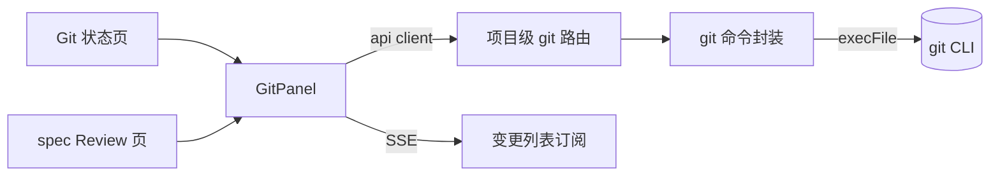
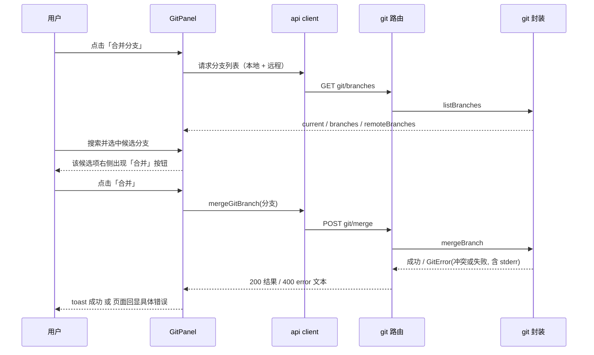
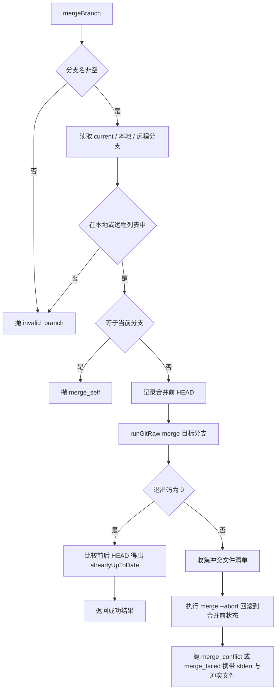
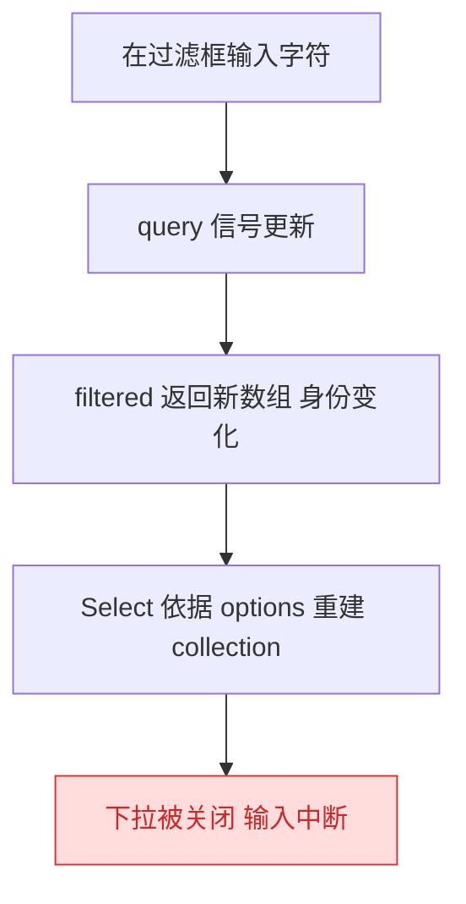
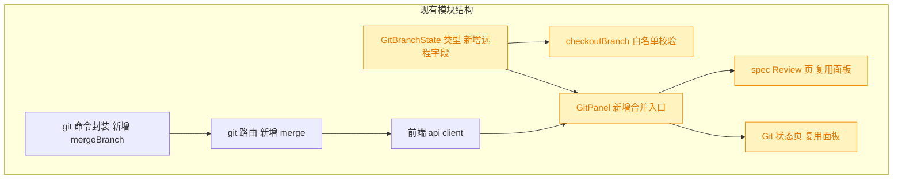

# 分支合并（Git Panel）

## 1. 背景

Git 面板（`GitPanel`）已支持提交、丢弃、推送、拉取、切换分支等基础操作，Git 状态页与 spec Review 页共用该面板。目前缺少「把另一个分支合并到当前分支」的能力，用户必须切到终端执行 `git merge`。

## 2. 需求

- 在「丢弃」按钮之后新增分隔符 `|` 与「合并分支」入口。
- 点击入口展开 Select，加载**本地 + 远程**分支，支持关键字搜索过滤。
- 选中某个分支后，该候选项右侧出现「合并」按钮；点击后把选中分支合并到当前分支。
- 合并出错时，在页面上显示具体错误信息（git 原始报错），而非泛化提示。

## 3. 现状分析

当前 git 能力自下而上分三层：`src/service/git.ts`（git 命令封装）→ `src/service/routes/git.ts`（项目级 HTTP 路由）→ `src/gui/src/lib/api.ts`（前端 client）→ `GitPanel.tsx`（唯一 UI 载体）。

现有分支能力的关键事实：

- 分支列表只取 `refs/heads`，即**只有本地分支**，无远程分支来源。
- 切换分支的服务端校验直接以「分支列表」为白名单，因此该列表的语义被 checkout 复用，不能随意混入远程分支。
- 命令执行有两种形态：抛错型与返回退出码的非抛错型；后者专门用于「非零退出本身是有意义状态」的命令（如合并冲突）。
- 拉取刻意采用 `--ff-only`，注释明确写着「宁可失败也不要把工作区留在 UI 无法解决的 MERGING 状态」。
- 另一条既有链路 worktree 合并回主项目时**允许冲突存在**：冲突后不回滚，而是自动生成一个冲突修复 spec，交给 Agent/用户在主项目工作区解决。
- 面板已有统一错误出口：一个 `error` 信号 + 页面底部的错误行；服务端 git 失败统一以 400 + `{ error }` 返回，前端 `request` 会把它抛成 Error message。

精确层：涉及文件、函数与既有约定

- `src/service/git.ts`
  - `runGit`（抛 `GitError`）/ `runGitRaw`（返回 `{ stdout, stderr, code }`，供合并类命令使用）
  - `currentBranch(cwd)`：`rev-parse --abbrev-ref HEAD`，`HEAD` 时抛 `detached_head`
  - `listBranches(cwd): Promise<GitBranchState>`：`for-each-ref --sort=-committerdate --format=%(refname:short) refs/heads`，返回 `{ current, branches }`
  - `checkoutBranch(cwd, branch)`：以 `state.branches.includes(target)` 作为白名单校验，未命中抛 `invalid_branch`
  - `pull(cwd)`：`pull --ff-only`，失败抛 `pull_failed`（stderr 原文）
- `src/service/routes/git.ts`：`/projects/:projectId/git/{changes,diff,branches,checkout,commit,discard,push,pull}`；统一 `catch (err) { if (err instanceof GitError) return c.json({ error: err.message }, 400) }`
- `src/service/worktree-manager.ts:165 mergeBackToMain`：`runGitRaw(mainPath, ['merge','--no-ff','-m',msg,branch])`，`code !== 0` 时保留冲突现场并生成 `<stamp>.fix.merge-conflict-<branch>` spec
- `src/gui/src/lib/api.ts:386-392`：`getGitBranches` / `checkoutGitBranch`
- `src/gui/src/components/GitPanel.tsx`
  - 状态：`branchState`（`createResource`）、`branchQuery`、`directAction`、`error`、`isAnyRunning`、`visibleError`
  - 分支 Select：`SelectContent` 内嵌 `Input` 做过滤（`onKeyDown` 阻止冒泡），`itemComponent` 渲染分支名
  - 错误渲染：`<Show when={visibleError()}>
`
  - `GitAction = 'commit' | 'discard' | 'push' | 'pull' | 'checkout'`，`buttonLoading(kind)` 依据它派生 loading
- `src/gui/src/components/ui/select.tsx`：`SelectItem` 内部把 children 包进 `SelectPrimitive.ItemLabel`，并在 `right-2` 绝对定位渲染选中指示图标
- i18n：`src/gui/src/i18n/{zh-CN,en}.ts` 的 `git.*` 段（`branchSelect`/`branchPlaceholder`/`branchFilterPlaceholder`/`noBranches`/`push`/`pull`…）
- 测试：`src/service/__tests__/git.test.ts`（真实临时仓库）、`src/service/__tests__/git-routes.test.ts`（路由级）；命令 `pnpm test` / `pnpm typecheck`

## 4. 技术实现方案

沿用现有三层结构增量扩展：service 增加 `mergeBranch`，routes 增加 `POST /git/merge`，api client 增加 `mergeGitBranch`，`GitPanel` 增加一个独立的「合并分支」Select 入口。

### 4.1 后端分支列表：本地与远程分离

`GitBranchState` 增加 `remoteBranches: string[]`，由 `refs/remotes` 读出并剔除 `origin/HEAD` 这类符号引用；`branches` 保持「仅本地」语义不变。

> 决策说明：不把远程分支并入 `branches`。`checkoutBranch` 把 `branches` 当作白名单，混入远程分支会让 checkout 落进 detached HEAD。新增独立字段是唯一不破坏既有语义的做法；被否决的备选是「`branches` 直接包含 `origin/x`，checkout 时再过滤」——校验点分散、易回归。

> 决策说明：不在合并前自动 `git fetch`。远程候选取本地 remote-tracking refs，避免在一次 UI 点击里引入不可控的网络耗时；需要最新远端状态时用户可先点「拉取」。

### 4.2 合并命令封装

新增 `mergeBranch(cwd, branch): Promise<{ current: string; merged: string; alreadyUpToDate: boolean }>`，流程：

要点：

- 用非抛错型执行器跑 merge——非零退出是有意义状态（冲突），需要读 stderr 与冲突文件。
- 分支名必须命中「本地 ∪ 远程」白名单后才拼进命令，避免把用户输入直接交给 git 解析。
- 错误信息带上 git stderr 原文（列表为空时兜底一句可读文案），这是「页面显示具体错误」的数据来源。
- **冲突收尾（已定）**：先用 `diff --name-only --diff-filter=U` 取冲突文件清单，再执行 `merge --abort` 把工作区恢复到合并前状态，最后抛错并把冲突文件清单拼进 message。`--abort` 本身失败时不掩盖原错，仍以合并失败原文报出。
- 与 worktree 合并回主项目的链路**互不复用**：那条链路刻意保留冲突现场并生成修复 spec，本功能按用户决策走「零残留」路线。

> 决策记录：5.1 合并冲突收尾策略 —— 用户选择「冲突时自动 `git merge --abort` 回滚，页面显示冲突文件清单与原始报错，工作区回到合并前状态」，理由：GUI 无冲突解决界面，保留 MERGING 状态会把用户困在面板无法处理的中间态；与既有 `pull --ff-only` 的「宁可失败也不留中间态」保持一致。

### 4.3 接口层

- 路由：`POST /projects/:projectId/git/merge`，body `{ branch: string }`；空串 400；`GitError` → 400 + `{ error }`，与既有 git 路由的错误处理完全同构。
- 前端 client：`mergeGitBranch(pid, branch)`，返回 `{ ok: true; current: string; merged: string; alreadyUpToDate: boolean }`。

### 4.4 前端交互

- 「丢弃」之后插入与推送/拉取同款的 `|` 分隔符，再放「合并分支」入口按钮。
- 下拉**不使用 Kobalte Select**，改用 `Popover` + 过滤 `Input` + 普通候选按钮列表（理由见 4.5 的实测结论）。
- 候选项按「本地在前、远程在后」拼接，远程项显示 `origin/xxx` 原名；搜索用大小写不敏感 `includes` 过滤，空结果复用 `git.noBranches` 文案。
- 点击候选项即选中（高亮），选中行右侧出现「合并」按钮；点击「合并」才真正发起合并，避免误触。
- `GitAction` 扩展 `'merge'`，并入 `directAction` / `isAnyRunning` / `buttonLoading`，合并期间禁用其余 git 操作。
- 合并成功：`toast.success` 提示（区分「已合并」与「已是最新，无需合并」），随后刷新变更列表与分支状态，并关闭下拉、清空搜索词与选中项。
- 当前分支在候选中禁用（不可选），从交互上先挡住自合并。
- 新增 i18n key 落在 `git.*` 段，zh-CN 与 en 同步。

### 4.5 下拉内过滤为何不能用 Select（实测结论）

execute 阶段用 Playwright 驱动真实页面发现：把过滤 `Input` 放进 `SelectContent` 后，**只要输入一个字符，整个下拉立刻关闭**（`listbox` 节点数归零）。既有的「切换分支」下拉用的是同一套写法，实测同样会被关掉——这是既有实现里此前未被发现的缺陷，不是本次引入。

> 决策说明：合并入口改用 `Popover` 自绘候选列表。被否决的备选：① 继续用 Select 并想办法阻止关闭——根因在 Kobalte 内部对 `options` 变更的处理，绕不过去且脆弱；② 引入 Kobalte `Combobox`——需要新建一层 ui 封装并重新对齐样式，收益不及自绘列表，且自绘列表能直接把「合并」按钮放进行内。
>
> 本次**不顺带改造「切换分支」下拉**（最小改动原则，它不在本需求范围内），但把该缺陷记录在此，后续可另开 fix spec 用同一方案收敛。

### 4.6 错误呈现

失败路径统一走面板既有的 `error` 信号 → 页面底部 `text-destructive` 错误行，展示服务端回传的 git 原文（含冲突文件清单）。不新增弹窗，不吞异常，不做二次包装。

### 4.7 兼容性与影响范围

- 🟡 `GitBranchState` 属**增量加字段**，旧调用方读 `branches` 行为不变；但类型为必填字段时所有构造点需同步，故标记为受影响。
- 🟡 `checkoutBranch` 的白名单必须继续只认本地分支——这是本次最容易踩的回归点，需要用测试钉住。
- 🟡 `GitPanel` 被两个页面复用，工具栏改动会同时出现在 Git 状态页与 spec Review 页；这是期望行为（合并是仓库级操作，与 spec 上下文无关）。
- 无破坏性接口变更：既有端点的请求/响应形状均不变。

### 4.8 验证策略

- service 层：在真实临时仓库中覆盖「可合并成功」「已是最新」「合并当前分支被拒」「未知分支被拒」「冲突自动回滚且工作区干净」五类路径。
- 路由层：覆盖 200 成功、空 branch 400、冲突 400 且 `error` 文本非空。
- 回归：分支列表接口新增远程字段后，checkout 仍拒绝远程分支名。
- 交互层：用仓库既有的 Playwright e2e 夹具驱动真实页面（在 `.tmp-e2e` 内建独立 git 仓库，避免命令落到宿主仓库），覆盖「过滤保持展开」「选中后出现合并按钮」「合并成功」「冲突回显错误且工作区干净」。
- 命令：`pnpm test`、`pnpm typecheck`、`npx playwright test git-merge`。

## 5. 待确认项

_暂无_

## 6. 任务清单

- [x] `src/service/git.ts`：`GitBranchState` 增加 `remoteBranches`，`listBranches` 读取 `refs/remotes` 并剔除 `origin/HEAD`（验收：新增单测断言远程分支出现在 `remoteBranches`、不出现在 `branches`）
- [x] `src/service/git.ts`：新增 `mergeBranch(cwd, branch)`，含空值/白名单/自合并校验、`alreadyUpToDate` 判定、冲突时收集冲突文件并 `merge --abort` 回滚后抛 `GitError`（验收：`git.test.ts` 覆盖成功、已是最新、自合并被拒、未知分支被拒、冲突回滚五路径）
- [x] `src/service/routes/git.ts`：新增 `POST /projects/:projectId/git/merge`，空 branch 400，`GitError` → 400 + `{ error }`（验收：`git-routes.test.ts` 覆盖 200 成功、空 branch 400、冲突 400 且 error 文本非空）
- [x] `src/service/__tests__/git-routes.test.ts`：补充回归断言——`/git/branches` 新增远程字段后 `/git/checkout` 仍拒绝远程分支名（验收：该用例返回 400）
- [x] `src/gui/src/lib/api.ts`：`GitBranchState` 前端类型同步 `remoteBranches`，新增 `mergeGitBranch(pid, branch)`（验收：`pnpm typecheck` 通过）
- [x] `src/gui/src/i18n/zh-CN.ts` 与 `en.ts`：`git.*` 段补齐合并相关文案（入口、过滤占位、合并按钮、合并中、已合并、已是最新）（验收：两语言 key 一一对应，无缺失）
- [x] `src/gui/src/components/GitPanel.tsx`：在「丢弃」后插入 `|` 分隔符与「合并分支」入口，用 `Popover` + 过滤 `Input` + 候选按钮列表实现（候选＝本地+远程，当前分支禁用）（验收：e2e 断言输入过滤后下拉仍展开且候选被筛选）
- [x] `src/gui/src/components/GitPanel.tsx`：选中行右侧渲染「合并」按钮，点击调用 `mergeGitBranch`，成功 toast + 刷新变更与分支状态，失败写入 `error` 信号回显原文（验收：`GitAction` 含 `'merge'` 且合并期间其余按钮禁用）
- [x] 回滚 `src/gui/src/components/ui/select.tsx` 的 `labelClass` 试探性改动（验收：该文件与主干一致，`git diff` 无残留）
- [x] 新增 `src/gui/src/__e2e__/git-merge.spec.ts`：真实浏览器驱动过滤、合并成功、冲突回显三条路径（验收：`npx playwright test git-merge` 通过）
- [x] 运行 `pnpm typecheck` 与 `pnpm test`（验收：均通过，无新增失败用例）
- [ ] [manual] 在 GUI 中实际执行一次可合并分支与一次冲突分支的合并（验收：成功有 toast、冲突时页面显示冲突文件与 git 原文且工作区无残留 MERGING 状态）

## 7. 执行记录

- `src/service/git.ts`：`GitBranchState` 增加 `remoteBranches`（`refs/remotes`，剔除 `*/HEAD`），`branches` 仍只含本地分支；抽出 `parseRefLines` 复用。验证：`git.test.ts` 新增「远程分支单列」用例通过。
- `src/service/git.ts`：新增 `mergeBranch`——空值/白名单（本地 ∪ 远程）/自合并三重校验，`merge --no-edit` 走非抛错执行器，冲突时先取 `--diff-filter=U` 清单再 `merge --abort` 回滚，抛 `merge_conflict`/`merge_failed` 并把 stdout+stderr 原文与冲突文件拼进 message。验证：`git.test.ts` 五路径用例全绿（含冲突后 `status --porcelain` 为空）。
- `src/service/routes/git.ts`：新增 `POST /projects/:projectId/git/merge`，空 branch 400，`GitError` → 400 `{ error }`。验证：`git-routes.test.ts` 覆盖 200/空 branch 400/冲突 400 且 error 含冲突文件名。
- `src/service/__tests__/git-routes.test.ts`：补充回归用例——写入 `refs/remotes/origin/demo` 后 `/git/branches` 单列该 ref，而 `/git/checkout origin/demo` 仍 400 且 HEAD 不变。
- 命令：`npx vitest run src/service/__tests__/git.test.ts`（34 passed）、`npx vitest run src/service/__tests__/git-routes.test.ts`（16 passed）。
- 前端首版按原方案用 Kobalte `Select` 实现合并入口，Playwright 实测暴露「过滤框输入一个字符即关闭下拉」的缺陷（既有「切换分支」下拉同样复现）；按变更重开流程回补 4.4/4.5 方案并改用 `Popover` 自绘列表，前端任务重新拆分。
- `src/gui/src/lib/api.ts`：前端 `GitBranchState` 同步 `remoteBranches`，新增 `mergeGitBranch`。验证：`tsc -b` 通过。
- `src/gui/src/i18n/{zh-CN,en}.ts`：`git.*` 段新增 `mergeBranch`/`mergeBranchPlaceholder`/`mergeFilterPlaceholder`/`mergeAction`/`merging`/`merged`/`mergeUpToDate`/`mergeSelfHint`，中英一一对应。
- `src/gui/src/components/GitPanel.tsx`：「丢弃」后新增 `|` 与「合并分支」入口，改用 `Popover` + 过滤 `Input` + 候选按钮列表；选中行高亮并在右侧渲染「合并」按钮，当前分支禁用；`GitAction` 扩展 `'merge'`，`buttonLoading` 改由 `AGENT_CAPABLE` 集合判定；合并成功 toast 并刷新变更/分支，失败写入 `error` 信号回显 git 原文。
- `src/gui/src/components/ui/select.tsx`：改用 Popover 后不再需要 `labelClass`，已 `git checkout` 回滚，保持与主干一致。
- 新增 `src/gui/src/__e2e__/git-merge.spec.ts`：在 `.tmp-e2e` 内建独立 git 仓库（否则命令会落到宿主仓库），真实浏览器覆盖「输入过滤后下拉仍展开且候选被筛选」「选中后才出现合并按钮并合并成功」「冲突时页面回显 CONFLICT 与 shared.txt、无 MERGE_HEAD 残留、HEAD 内容不变」。
- 命令：`npx tsc -b` 通过；`npx vitest run` 70 文件 / 656 passed；`npx playwright test` 34 passed（含新增用例）；`git status` 确认宿主仓库未被 e2e 的 git 操作污染。
- 收尾：任务清单非 manual 项全部完成，待确认项为空、无批注、无追加任务，标记 `done`；剩余 `[manual]` 项为人工回归确认，不阻塞收尾。
