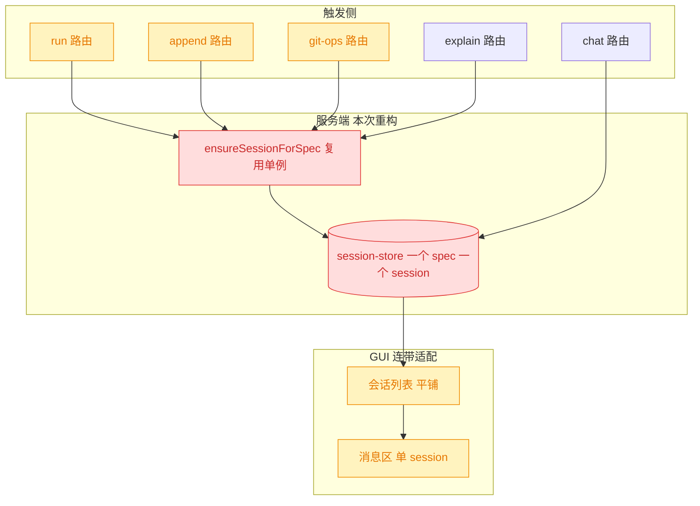
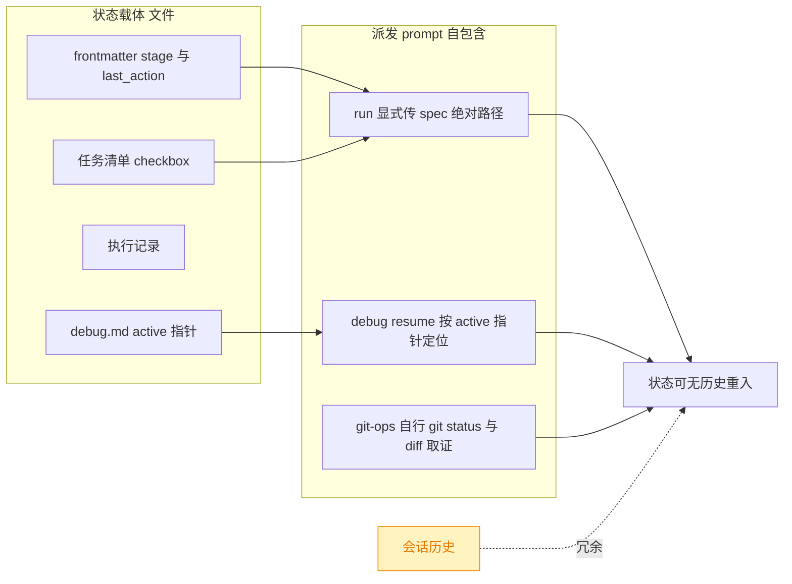
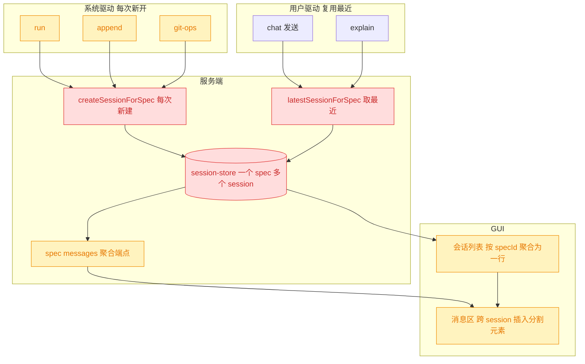
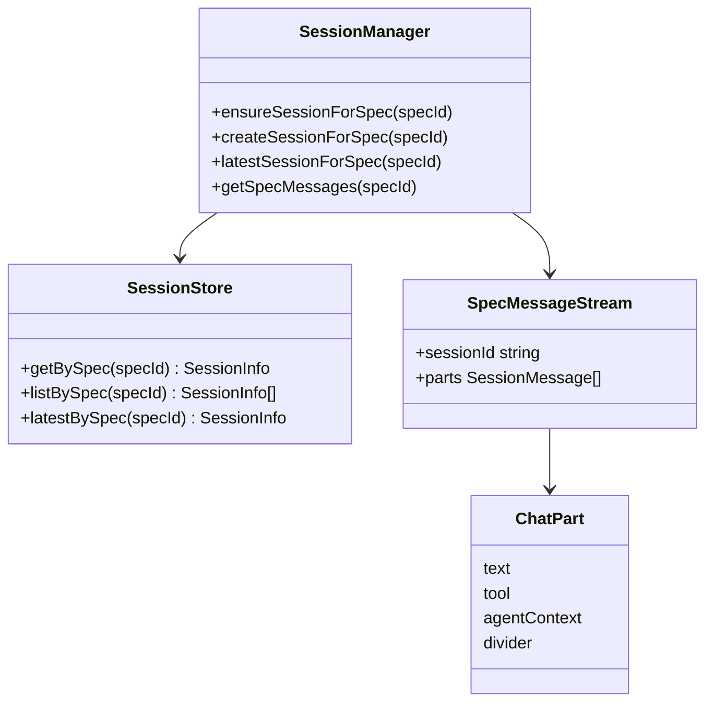
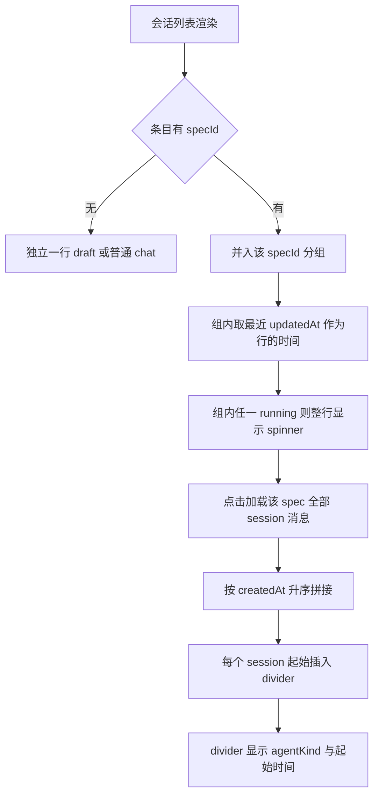
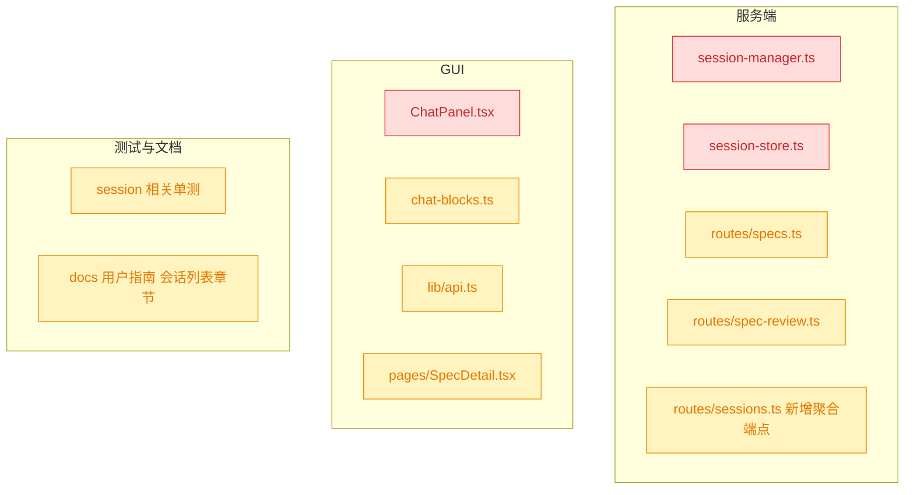
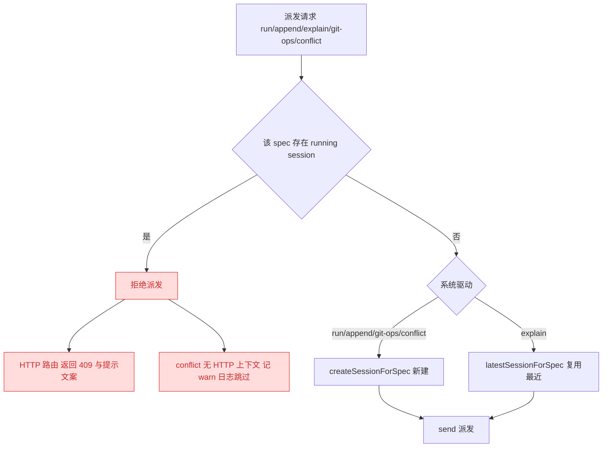

# spec 会话拆分与 Chat 面板聚合：切断跨轮次上下文继承

## 1. 背景

对本机 `telemetry.jsonl` 近 11.2 天、180 次 `agent.turn` 的实测显示，claude 侧总成本 $555，其中 `run` 占 37.8%、`new-spec` 占 26.5%。

成本的结构性浪费出现在**同一 spec 的多次派发共用一个 session**：

|                | 首次 run（干净 session） | 非首次 run（继承历史） |
| -------------- | ------------------------ | ---------------------- |
| n              | 4                        | 15                     |
| 起始上下文中位 | 30k                      | **105k**               |
| ctx/轮 中位    | 104.4k                   | **162.0k**             |
| 平均轮次       | 97                       | 95                     |
| **平均成本**   | **$8.81**                | **$11.64**             |

轮次几乎相同（97 vs 95），成本高 **32%**——差异全部来自继承的会话历史。逐次建模估算：15 次非首次 run 共可省 $60.93 / $174.62（**35%**），占 claude 总成本 **10.8%**。

这份继承没有任何正确性依据。`session-manager.ts` 中 `ensureSessionForSpec()` 的注释写明了复用的**唯一理由是 UI**：

> All system-driven rounds (run / explain / review / git-ops) reuse this per-spec session **so their output lands in one conversation the Chat panel can switch to.**

因此本 spec 的思路是：把这个纯 UI 诉求**下沉到 UI 层解决**，从而解除服务端的会话复用约束。

## 2. 需求

1. spec 状态推进（`run`）、追加任务（`append`）、git-ops 操作，都以 spec 文档为基础**新开 session**。
2. 同一 spec 相关的 session，在 Chat 面板的会话列表中**聚合成一条记录**。
3. Chat 面板历史消息中，不同 session 之间需要有**显式的视觉分割元素**。
4. 用户在 Chat 中发送消息，**追加到最近一个 session**。

## 3. 现状分析

### 3.1 一处服务端耦合，支撑一个纯 UI 诉求

关键实现位置与数据模型

- `src/service/session-manager.ts:153-169`：`findSessionForSpec()` 委托 `store.getBySpec()`；`ensureSessionForSpec()` 命中即复用，未命中才 `createSession(undefined, specId, specId)`。
- `src/service/session-store.ts:50-52`：`getBySpec()` 实现为 `items.find((s) => s.specId === specId)` —— **1 spec : 1 session 的约束就落在这一行**。
- `src/service/agent-sdk/types.ts:35-45`：`SessionInfo` **已带 `specId?: string` 字段**，GUI 侧 `api.ts:241-250` 同构。分组键已经存在，无需新增数据模型。
- `src/service/session-store.ts:42`：`list()` 按 `updatedAt` 倒序。
- 四个复用调用点：`routes/specs.ts:219`（run）、`routes/specs.ts:182`（append）、`routes/specs.ts:263`（explain）、`routes/spec-review.ts`（git-ops）。
- `src/service/session-manager.ts:325-350` `send()`：**无 running 守卫**——仅 `setRunning(sid, true)` 后即派发，不拒绝重入。
- GUI：`ChatPanel.tsx:1119-1150` 平铺渲染 `visibleSessions()`；`ChatPanel.tsx:554-619` 的选择 effect 按单个 `activeSid` 拉 `getSessionMessages` 并订阅 SSE。
- `src/gui/src/lib/chat-blocks.ts:38`：`ChatPart = TextPart | ToolPart | AgentContextPart`，无分割元素类型。

### 3.2 会话历史在架构上是冗余的

三处代码证据表明，spec 驱动轮次的状态**全部持久化在文件中**，不依赖会话记忆：

三处证据的精确出处

1. **skill 契约**：`yorz-spec/SKILL.md:8` —— 「**md 是单一真相**」；状态由 frontmatter（`stage`/`last_action`/`updated_at`/`summary`）+ 任务清单 checkbox + `## 执行记录` 承载。
2. **run 的 prompt 自包含**：`routes/specs.ts:224` —— `` `${skillRef('yorz-spec')}，然后处理 spec：${p.specsDirRelative}/${specId}/spec.md` ``。显式传路径，不走 `SKILL.md:24` 那条「从 session 上下文恢复 spec_path」的兜底分支。实测 `promptLength` 中位 164、max 175 字符，与该固定模板一致。
3. **debug resume 亦不依赖历史**：`routes/specs.ts:394-400` —— resume 分支的指令是「该目录下已存在处于 debugging 状态的 `debug.md`，请定位其 frontmatter `active` 指向的 `## Debug NNN` 继续」，定位信息在文件里。
4. **git-ops 自行取证**：`yorz-git-ops/SKILL.md:10-15` 列明输入为「当前 git 仓库的未提交变更（`git status -sb` / `git diff` / `git diff --staged`）」，且 `SKILL.md:8` 明确「这条路径不进入 yorz-spec 的状态机」。

### 3.3 实测：git-ops 与 run 后的 chat 是继承链的最大受害者

单轮上下文（ctx/轮）Top 5 全部出现在长继承链的尾部：

| trigger   | ctx/轮 | 位置            |
| --------- | ------ | --------------- |
| `git-ops` | 350k   | 链尾第 4 次派发 |
| `chat`    | 281k   | 链尾第 3 次派发 |
| `chat`    | 253k   | 链尾第 4 次派发 |
| `chat`    | 251k   | 链尾第 4 次派发 |
| `run`     | 239k   | 链尾第 2 次派发 |

`agent.compact` 事件数为 **0**——尚未触发压缩，但成本已随上下文线性攀升。

## 4. 技术实现方案

### 4.1 目标形态：服务端按 spec 一对多，UI 层做聚合

### 4.2 数据模型与接口变更

字段级与签名级变更清单

- `session-store.ts`：`getBySpec()` 删除（1:1 语义已失效）；新增 `listBySpec(specId): SessionInfo[]`（按 `createdAt` 升序）与 `latestBySpec(specId): SessionInfo | undefined`（按 `updatedAt` 取最近）。
- `session-manager.ts`：`ensureSessionForSpec()` 删除；新增 `createSessionForSpec(specId, title?)`（无条件新建）与 `latestSessionForSpec(specId)`（取最近，不存在则新建）。
- 新增路由 `GET /projects/:projectId/specs/:id/messages`：返回 `Array<{ sessionId, kind, createdAt, messages }>`，服务端按 `createdAt` 升序拼接。
- `chat-blocks.ts`：`ChatPart` 联合新增 `DividerPart { kind: 'divider'; sessionId: string; agentKind: AgentKind; startedAt: number }`；`groupParts()` 中 divider 自成一个 block 并**打断** assistant 合并（否则跨 session 的助手文本会被并进同一气泡）。
- `api.ts`：新增 `getSpecMessages(pid, specId)`；`SessionInfo` 无需改动（`specId` 已存在）。
- GUI 状态：`activeSid` 语义扩展为「当前选中的组」，新增 `activeSpecId` 信号；SSE 仅订阅组内最近一个 session。

### 4.3 UI 聚合与分割元素

聚合行与分割元素的展示细节

- 聚合行标题：优先取该 spec 最近一个 session 的 `title`（`displaySessionTitle` 逻辑不变）；副信息追加会话计数（如 `×4`）。
- 聚合行时间：取组内 `max(updatedAt)`，保持列表「最新活动上浮」的既有排序语义不变。
- 聚合行 running：组内任一 session `running === true` 即显示 spinner；`runningCount()` 改为按组计数，避免同一 spec 的多个 session 被重复计入。
- 分割元素：一条水平分隔线 + 居中小字标签 `[claude] 08-31 22:24`，视觉权重低于用户/助手气泡，用 `text-muted-foreground` 与 `border-t`。
- 分割元素的插入位置为**两个 session 之间**（首个 session 之前不插）：需求 3 的语义是「不同 session 之间需要分割」，组内仅 1 个 session 时不应出现任何分割线。
- 无 `specId` 的普通 chat session 与 Untitled 草稿保持现状：各占一行，不参与聚合。

### 4.4 影响面

对外行为无变化：CLI 选项、埋点 schema、spec.md 格式均不改动。唯一的破坏性是**服务端 spec↔session 的基数约束**，且存量数据天然兼容——既有 per-spec session 已带 `specId`，重构后自动成为该组的第一个成员，**无需任何数据迁移**。

### 4.5 关键决策说明

> 决策记录：会话复用的解除放在服务端，聚合诉求放在 UI 层。理由：`ensureSessionForSpec()` 的注释已自证复用的唯一动机是「让 Chat 面板能切到一个对话」，这是纯展示需求；把它下沉到 UI 后，服务端不再需要为展示牺牲 33% 的 token。被否决备选：保留复用、改为定期新建（如每 N 轮）—— 阈值无法从任何客观信号推导，且仍会在阈值内继承半条历史。

> 决策记录：`explain` 归入「用户驱动」类，复用最近 session，不随 run/append/git-ops 一起拆分。理由：需求 1 列举的三者都是重活长轮次（run 均 95 轮），而 explain 是用户在文档上选中文字的即时问答，其价值恰恰在于结合当前上下文解释；拆分会让它失去解释对象的语境。被否决备选：一并拆分 —— 会把「解释这段话」变成冷启动，答案质量下降而省下的成本可忽略（explain 在实测窗口内调用数为 0）。

> 决策记录：跨 session 消息合并采用**服务端聚合端点**，而非前端并发请求多个 session。理由：服务端能一次性保证跨 session 的时间序，并让 divider 直接携带 `agentKind`/`createdAt` 元信息；前端并发方案需要额外拿会话列表反查这些字段来渲染分割线标题，且引入 N+1 请求与排序竞态。被否决备选：前端并发 + 客户端排序 —— 改动看似更小，但把顺序正确性推给了前端。

> 决策记录：聚合视图**一次性加载组内全部 session** 的消息，不做分页或懒加载。理由：实测数据中单个 spec 的派发次数为 1–4 次（`new-spec` + 1~2 次 `run` + 偶发 `git-ops`），拆分后单组 session 数预计仍在个位数，全量渲染无性能压力；提前引入懒加载属于为假想规模付出复杂度。若后续出现超长 spec 再按实测优化。

> 决策记录：不为「组」引入新的持久化实体，分组完全由 `specId` 在查询时导出。理由：`SessionInfo.specId` 字段已存在且服务端/GUI 同构，分组是纯投影；新增 group 表会引入与 session 生命周期同步的一致性负担。

> 决策记录：存量数据不做迁移。理由：既有 per-spec session 已带 `specId`，在新模型下自动成为该 spec 分组的首个成员，语义连续；不存在需要回填的字段。

> 决策记录：待确认项 5.1「拆分后同一 spec 的并发派发如何约束？」—— 用户**选择「服务端加『同 spec 串行』守卫：该 spec 存在 running session 时，新派发直接拒绝并返回提示」**，理由：不引入排队状态机的复杂度，把并发写 `spec.md` 的风险在服务端一次性堵死（详见 4.6）。被否决备选：服务端排队（需要维护挂起队列与取消语义）、仅 GUI 层禁用（保护强度不随 session 拆分补回）。

> 决策记录：分割元素插入在**两个 session 之间**而非每个 session 起始。理由：需求 3 的语义是「不同 session 之间」的分割；组内仅 1 个 session 时插入一条悬空分割线纯属噪声。

### 4.6 同 spec 串行守卫

守卫的落点与判定口径

- 判定实现：`SessionManager.isSpecRunning(specId)` —— 遍历 `store.listBySpec(specId)`，任一 session 命中内存 `running` 集合即为真。复用现有 `running: Set<string>`，不新增状态。
- 检查位置：在 `createSessionForSpec()` / `latestSessionForSpec()` **之前**，避免被拒的请求先造出一个空壳 session。
- 拒绝响应：HTTP `409`，body `{ error: '该 spec 有正在执行的会话，请等待其结束后再试' }`（`SPEC_BUSY_ERROR`，与 `routes/project.ts:76` 的 409 中文提示同构）。GUI 侧 `SpecDetail` 已有 `runError` 通道展示 `Error.message`，无需新增 UI。
- **append 例外**：条目在守卫之前就已写入 md，返回 409 会让对话框停留并诱导用户重复提交、产生重复条目。因此 append 命中守卫时返回 `200 { ok: true, busy: true }`（仅跳过派发），由 GUI 用 `specDetail.appendSavedSpecBusy` 提示「已保存但未派发」。
- `conflict` 触发点（`server.ts`）没有 HTTP 上下文，命中守卫时记 `worktreeLog.warn` 并跳过派发。
- `chat` 路由不加此守卫：它按 sessionId 派发，已有 GUI 的 running 禁用，且用户消息本就应落在最近 session 上。

## 5. 待确认项

_暂无_

## 6. 任务清单

- [x] 改造 `src/service/session-store.ts`：删除 `getBySpec()`，新增 `listBySpec(specId)`（按 `createdAt` 升序）与 `latestBySpec(specId)`（按 `updatedAt` 取最近）（验收：`pnpm typecheck` 无该文件报错，两方法返回顺序符合注释）
- [x] 改造 `src/service/session-manager.ts`：删除 `ensureSessionForSpec()`，新增 `createSessionForSpec(specId)`（无条件新建）、`latestSessionForSpec(specId)`（取最近，无则新建）、`isSpecRunning(specId)`；`findSessionForSpec()` 改走 `latestBySpec()`（验收：`pnpm typecheck` 通过，无 `ensureSessionForSpec` 残留引用）
- [x] 在 `src/service/session-manager.ts` 新增 `getSpecMessages(specId)`：按 `listBySpec` 升序逐个取 `getMessages`，返回 `Array<{ sessionId, kind, createdAt, messages }>`，单个 session 取历史失败降级为空数组不中断整组（验收：单测覆盖多 session 拼接顺序）
- [x] 改造 `src/service/routes/specs.ts` 的 run / append 两个派发点：先 `isSpecRunning` 守卫返回 409，再 `createSessionForSpec` 新建 session（验收：`appends-route.test.ts` 与新增 run 用例通过）
- [x] 改造 `src/service/routes/specs.ts` 的 explain 派发点：守卫后改用 `latestSessionForSpec`（验收：连续两次 explain 落在同一 sessionId）
- [x] 改造 `src/service/routes/spec-review.ts` 的 git-ops 派发点：守卫返回 409 + `createSessionForSpec`（验收：`spec-review.test.ts` 通过）
- [x] 改造 `src/service/server.ts` 的 conflict 触发点：`isSpecRunning` 命中时记 warn 日志跳过，否则 `createSessionForSpec`（验收：`pnpm typecheck` 通过，`project-registry.test.ts` 调用点同步更新）
- [x] 在 `src/service/routes/sessions.ts` 新增 `GET /projects/:projectId/specs/:id/messages` 聚合端点，spec 不存在返回 404（验收：新增路由测试断言返回体形状与顺序）
- [x] 更新 `src/service/__tests__/session-manager.test.ts`：把 `ensureSessionForSpec 复用` 用例改为 `createSessionForSpec 每次新建` + `latestSessionForSpec 取最近` + `isSpecRunning` + `getSpecMessages` 顺序（验收：`pnpm vitest run session-manager` 全绿）
- [x] 在 `src/service/__tests__/sessions-route.test.ts` 补充聚合端点用例与同 spec 并发 409 用例（验收：`pnpm vitest run sessions-route` 全绿）
- [x] 在 `src/gui/src/lib/api.ts` 新增 `SpecSessionMessages` 类型与 `getSpecMessages(pid, specId)` 方法（验收：`pnpm typecheck` 通过）
- [x] 在 `src/gui/src/lib/chat-blocks.ts` 新增 `DividerPart` 与 `DividerBlock`，`groupParts()` 中 divider 自成一 block 并打断 assistant 合并（验收：新增单测断言跨 divider 的助手文本不合并进同一气泡）
- [x] 新建 `src/gui/src/lib/session-groups.ts`：纯函数 `groupSessions(sessions, isRunning)` 按 `specId` 聚合，无 `specId` 者独立成组，组内按 `updatedAt` 取代表与时间、任一 running 则组 running（验收：新增 `session-groups.test.ts` 覆盖聚合/独立/排序/running 四类断言）
- [x] 改造 `src/gui/src/components/ChatPanel.tsx` 会话列表：`visibleSessions()` 改为分组渲染，选中态按「组内含 activeSid」判定，`runningCount()` 按组计数，标题后缀显示会话数 `×N`（验收：`pnpm typecheck` 通过，列表中同一 spec 只占一行）
- [x] 改造 `src/gui/src/components/ChatPanel.tsx` 消息加载：活动 session 所属组含多个 session 时改调 `getSpecMessages` 并在 session 之间插入 divider，SSE 仍只订阅组内最近一个 session（验收：切到多 session 的 spec 组能看到全部历史与分割线）
- [x] 在 `src/gui/src/i18n/zh-CN.ts` 与 `en.ts` 补充分割元素与聚合行计数所需文案键（验收：无硬编码中文进入 tsx，两语言键集一致）
- [x] 更新 `docs/User-Guide-CN.md` 与 `docs/User-Guide.md` 的会话列表章节：说明同一 spec 的多次派发聚合为一行、历史按 session 分割（验收：两语言文档描述一致）
- [x] 运行 `pnpm typecheck` 与 `pnpm test` 全量校验（验收：两者均无失败）

## 7. 追加任务

- [fixed] [fix] 2026-09-01 10:55:29 | 新建 spec 创建 session，plan 阶段提交批注问题 创建 第二个 session 时；
  - 描述：新建 spec 创建 session，plan 阶段提交批注问题 创建 第二个 session 时；
    chat 面板的内容被清空，只显示第二个 session的内容；
    切换到其他 session 再切回来，才能正确加载整个 session 组的消息内容。
- [fixed] [fix] 2026-09-01 15:06:30 | 推动 spec 状态、追加任务而创建session时，会清空 session 组内的消息，只显示最新session内容；
  - 描述：推动 spec 状态、追加任务而创建session时，会清空 session 组内的消息，只显示最新session内容；
    刷新页面，或切换其他session在切换来，才能获取 session 组完整消息；
- [fixed] [fix] 2026-09-01 15:37:00 | 测试追加任务，session 组是否能增量更新消息；
  - 描述：测试追加任务，session 组是否能增量更新消息；
    无需改动任何代码

## 8. 执行记录

- 2026-08-31 22:24 —— 新建 spec 并完成 plan 阶段：基于 `telemetry.jsonl` 11.2 天实测数据确立成本基线（非首次 run 比首次贵 32%，可省 35%）；核实会话复用的唯一动机是 UI（`session-manager.ts:161-162` 注释自证）；核实 spec 状态全部落在文件中、会话历史架构冗余（skill 契约 + run prompt 自包含 + debug resume 按 active 指针定位 + git-ops 自行取证四处证据）；确立「系统驱动新开 / 用户驱动复用」的分工方案与 UI 聚合形态。发现一处方案引入的新风险（并发写 spec.md），已作为 `### 5.1` 待确认项，等待人工批注。
- 2026-08-31 22:52 —— 消费用户批注完成 tasks 阶段：待确认项 5.1 采纳「服务端同 spec 串行守卫」，落为 `### 4.6` 与三条决策记录；核对五处派发调用点（`routes/specs.ts` run/append/explain、`routes/spec-review.ts` git-ops、`server.ts` conflict）与 GUI 侧四处 `requestChatSession` 调用点，确认守卫与聚合改造的最小影响面；修正影响面清单中的文档目标（`docs/Architecture.md` 无会话列表描述，实为 `docs/User-Guide-CN.md:308-330`）；拆出 18 项可执行任务。
- 2026-08-31 22:55 —— 执行服务端改造：`session-store.ts` 删除 `getBySpec()`、新增 `listBySpec()`（createdAt 升序）与 `latestBySpec()`；`session-manager.ts` 删除 `ensureSessionForSpec()`、新增 `createSessionForSpec()` / `latestSessionForSpec()` / `isSpecRunning()` / `getSpecMessages()`（单个 session 取历史失败降级为空数组）；run / append / git-ops / conflict 四个派发点改为每轮新建 session，explain 复用最近 session，五处统一加同 spec 串行守卫（run / explain / git-ops 返回 409，append 返回 `{ ok: true, busy: true }`，conflict 记 warn 跳过）；`routes/sessions.ts` 新增 `GET /specs/:id/messages` 聚合端点。测试同步更新：fake adapter 的 `createSession` 改为每次返回唯一 id（原先固定 `'created'` 会把多轮会话塌缩成一条），`session-manager.test.ts` 用例改写为「每轮新建 / 取最近 / 串行判定 / 拼接顺序」，新增 `spec-dispatch-guard.test.ts`（5 例）与聚合端点用例。
- 2026-08-31 22:56 —— 执行 GUI 改造：`lib/api.ts` 新增 `SpecSessionMessages` 与 `getSpecMessages()`，`appendItem` 返回类型补 `busy?`；`lib/chat-blocks.ts` 新增 `DividerPart`/`DividerBlock`，`groupParts()` 中 divider 打断 assistant 合并，新增 `specMessagesToParts()`（分割线只插在两轮之间、跳过空轮次）；新建 `lib/session-groups.ts`（`groupSessions()` / `findGroupBySession()`）；`ChatPanel.tsx` 列表改为按组渲染（`×N` 计数、组内任一 running 显示 spinner、`runningCount()` 按组计数、选中态按组判定），并把原「选择 → 加载历史 + 订阅」单一 effect **拆成两个**：历史 effect 依赖 `activeSpecId` 与运行态（spec 组在本轮结束后重读拼接历史，运行中不覆盖内存里的流式内容），订阅 effect 只依赖 `pid`/`sid`，避免列表刷新导致 SSE 反复重订阅。验证：`session-groups.test.ts`（6 例）与 `chat-blocks.test.ts`（30 例）全绿，`pnpm build:gui` 构建通过。
- 2026-08-31 22:57 —— 执行文档与文案：`i18n/zh-CN.ts` 与 `en.ts` 各新增 `chat.sessionDivider`（分割线标签）与 `specDetail.appendSavedSpecBusy`（追加已保存但未派发）；`docs/User-Guide-CN.md` 与 `docs/User-Guide.md` 的会话列表 / 阅读体验两节补充「同一 spec 多轮聚合为一行（`×N`）」「同 spec 同时只允许一轮执行」「跨轮次分割线」三条说明。
- 2026-08-31 22:58 —— 收尾：全量校验通过（`pnpm typecheck` 无错；`pnpm test` 72 文件 / 678 通过 + 2 skipped；`pnpm build:gui` 构建成功），改动文件按 prettier 格式化。任务清单 18 项全部完成，无待确认项 / 批注 / `[open]` 条目，标记 `done`。
- 2026-09-01 15:24 —— 追加任务 `[fix] 10:55:29` 经 Debug 1 收敛（详见 `debug.md#Debug 1`）：根因是 `ChatPanel.tsx` 历史加载 effect 存在**未被识别的第三态**——`selectSession()` 中 `setActiveSid()` 同步而 `refetchSessions()` 异步，服务端刚新建的 session 必然先经历「列表还不认识它」的窗口，effect 在该窗口按普通 chat 加载单 session 并写脏 `displayedSid`，随后被 `running && sameSession` 守卫吞掉唯一的纠正机会。修复：新增 `src/gui/src/lib/chat-history-load.ts` 把加载决策抽为纯函数 `planHistoryLoad()`（`idle | fresh | hold | keep | load` 五态），`hold` 即缺失的第三态（不清空、不加载、不写 `displayedSid`）。顺带修复 E4：`session-store.ts` 新增单调 `stamp()`（`Math.max(Date.now(), last + 1)`），消除同毫秒并列导致 `latestBySpec()` 取到最旧一轮的缺陷。
- 2026-09-01 15:33 —— 追加任务 `[fix] 15:06:30` 经 Debug 2 收敛（详见 `debug.md#Debug 2`）：Debug 1 的 `hold` 只覆盖 `listLoaded && !known`，而 `GET /sessions` 实测 1.1s（比 spec session 探针慢约 750 倍）留下 ~1.1s 的 `listLoaded === false` 窗口，同一条中毒路径从另一扇门复现（冷路径 R2 / 整页加载时该 spec 正在跑 R5）。修复围绕不变量「确认归属前绝不写 `displayedSid`，已写下的必须留有纠正余地」：判据改为 `!known && listPending`；`listPending` 落地仍 `known=false` 时退回单 session 加载（修掉 `hold` 因 `SESSION_LIST_LIMIT=30` 截断而永久卡死的 R6）；新增 `displayedSpecId`，守卫收紧为 `running && sameSession && sameScope` 使猜测加载的内容可被自愈重读；`selectSession()` 中 `refetchSessions()` 调整到 `setActiveSid()` 之前。回归：`chat-history-load.test.ts` 由 11 例增至 14 例。
- 2026-09-01 15:38 —— 追加任务 `[fix] 15:37:00` 为用户侧验证项（无需代码改动）：以真实追加任务派发验证 session 组消息可增量更新，用户确认**测试通过**。收尾全量校验通过（`pnpm typecheck` 无错；`pnpm test` 73 文件 / 693 通过 + 2 skipped；`pnpm build:gui` 构建成功）。三条 `[open]` 条目全部标记 `[fixed]`，任务清单 18 项完成，无待确认项 / 批注 / `[open]` 条目，重新标记 `done`。
