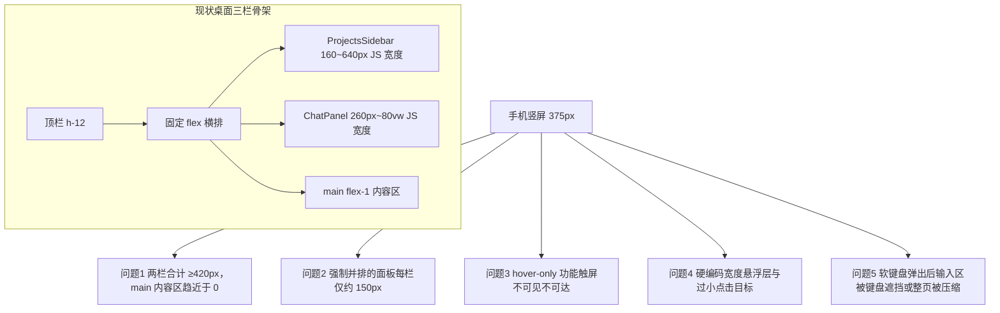
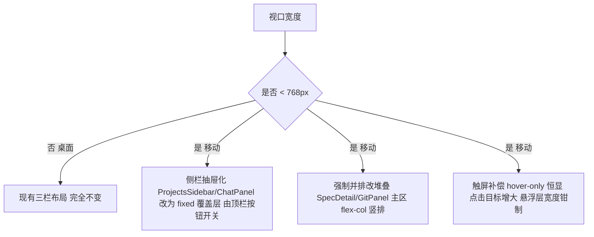
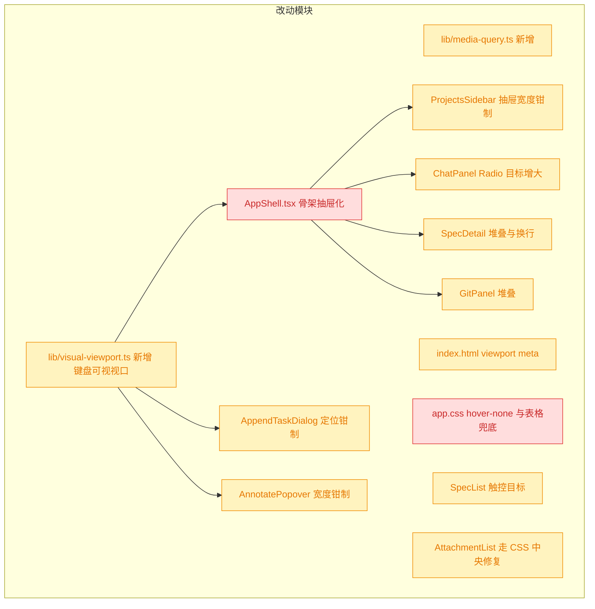
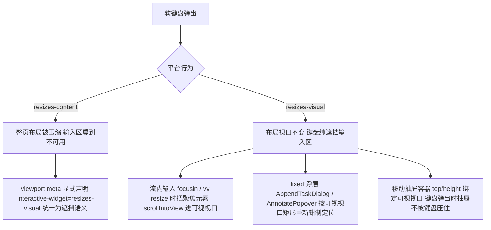
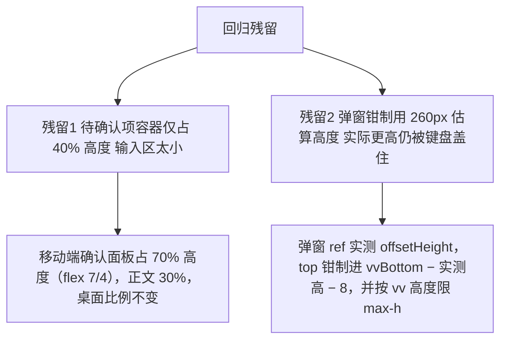

# 优化移动端访问 H5 页面布局和样式

## 1. 背景

YorZ GUI 是一个 Web（H5）应用，当前布局主要面向桌面端（宽屏、侧边栏 + 双栏面板）设计。用户通过手机浏览器访问时，页面布局与样式未经移动端适配，可能出现功能不可见（被折叠/挤出视口）、不可操作（点击目标过小、悬浮依赖 hover）等问题。本 spec 目标是系统性优化移动端访问体验，保证所有功能可见可操作。

## 2. 需求

优化移动端访问 h5 页面布局和样式，保证所有功能可见可操作。

## 3. 现状分析

技术栈：SolidJS + Tailwind + Vite（Kobalte 组件库）。viewport meta 已正确设置（`src/gui/index.html:5`），问题全部在布局层：**全代码库没有任何 `sm:`/`md:`/`lg:` 视口断点、没有 useMediaQuery 类 hook**，布局尺寸由 JS 计算 px 宽度并持久化到 localStorage。

四类问题（按优先级，精确层见折叠块）：

1. **全局骨架**：AppShell 三栏固定横排，两栏均为 JS px 宽度（仅 mouse 拖拽、无 touch），手机竖屏下 main 区被挤没。所有页面共用，是全局阻塞项。
2. **强制并排**：SpecDetail 的确认面板 + 正文、GitPanel 的控制面板 + DiffView 均无窄屏堆叠。
3. **hover-only 交互群**：SpecList 卡片删除菜单、AttachmentList 删除、CommandMenu 删除命令、ProjectsSidebar 项目改名/删除、mermaid 全屏按钮——触屏上整体不可见不可达。
4. **溢出与触控目标**：AnnotatePopover 硬编码 500px 必溢出；`w-72` Popover 无 max-width 兜底；ChatPanel 会话 Radio 控件仅 12px；markdown 宽表格在窄屏撑破布局。
5. **软键盘与输入区（追加 fix）**：移动端弹出键盘后，待确认项面板的 Textarea、追加任务对话框的输入区不可见（被键盘遮挡）或整页被压缩。根因：① `html, body { h-full; overflow: hidden }` 固定布局且无任何 visualViewport 处理；② AppendTaskDialog / AnnotatePopover 等 fixed 浮层只按布局视口定位（键盘弹出后布局视口不变，浮层仍在键盘下方）；③ 未声明 `interactive-widget`，Android 各版本键盘对布局视口行为不一致（`resizes-content` 时整页压缩、`resizes-visual` 时键盘纯遮挡）。
6. **第一轮键盘修复回归残留（追加 [feat] 2026-09-01 20:36）**：① 移动端堆叠布局下待确认项容器仅占 40% 高度（`flex-[4]`），输入区展示空间过小；② AppendTaskDialog 钳制定位用的是 260px **估算**高度，实际弹窗（类型 Radio + 描述输入 + 复选框 + 按钮）更高，键盘弹出时 `top = vvBottom - 260` 后弹窗底部仍被键盘盖住。

问题清单精确层（文件 / 行号 / 关键代码）

- 骨架：`src/gui/src/AppShell.tsx:258-262`（`
` 固定三栏横排）；`components/ProjectsSidebar.tsx:36-39,250`（DEFAULT 220 / MIN 160 / MAX 640，`style={{ width }}`，L167-197 仅 mouse 拖拽）；`components/ChatPanel.tsx:80-86,972`（DEFAULT 340 / MIN 260 / MAX 0.8 比例，L465-475 仅 resize 时 clamp 宽度）；`lib/layout-focus.ts` 焦点模式存在但仅手动触发、非响应式。
- 强制并排：`pages/SpecDetail.tsx:471-486`（QuestionConfirmPanel `flex-[4]` 与 article `flex-[6]` 始终并排）；L402-464 header 操作行无 `flex-wrap`；`components/GitPanel.tsx:402`（控制面板与 DiffView L689 始终并排）。
- hover-only：`pages/SpecList.tsx:338`（`opacity-0 group-hover:opacity-100` 删除菜单，L344 `h-7 w-7`）；`components/AttachmentList.tsx:78`（同模式 + `h-4 w-4`）；`components/CommandMenu.tsx:118`（同模式）；`components/ProjectsSidebar.tsx:335,344`（改名/删除按钮）；`src/gui/src/app.css:693-703`（mermaid 全屏按钮 `opacity: 0` 仅 hover/focus 显示）。
- 溢出/触控：`components/AnnotatePopover.tsx:15,76`（`POPOVER_WIDTH = 500` 硬编码无 max-width）；`GitPanel.tsx:507`、`RunningCommands.tsx:141`（`w-72` 无兜底）；`AppendTaskDialog.tsx:50`（定位按 384 计算但元素有 max-w，窄屏对不齐）；`ChatPanel.tsx:1016-1059`（会话行数 Radio 控件 `h-3 w-3` = 12px）；`app.css:482-496`（markdown table 无横向滚动兜底）；`DiffView.tsx:182,185`（双列行号各 `w-12`，窄屏依赖外层横向滚动）。
- 相对安全（无需改动）：`pages/NewSpec.tsx`（单列、Radio `min-h-[44px]`）、SpecList 卡片网格（auto-fill 自适应）、各 Dialog（有 max-w 兜底）、`SystemNotifications.tsx:74`（有兜底）、mermaid 全屏层 touch 拖拽（`app.css:745-752`）。

## 4. 技术实现方案

### 4.1 总体策略

引入唯一移动断点 **`< 768px`（Tailwind `md`）**，桌面端行为完全不变；移动端采用「抽屉化侧栏 + 堆叠双栏 + 中央化触屏补偿」三招：

### 4.2 分项改造

1. **新增视口 hook**：`src/gui/src/lib/media-query.ts` 提供 `createMediaQuery(query)` signal（仿照 `lib/theme.ts` 已有的 `matchMedia` 模式），AppShell 以 `(max-width: 767px)` 判定移动态。
2. **AppShell 抽屉化**：移动态下不再把 `ProjectsSidebar` / `ChatPanel` 放入 flex 横排，改为 `fixed inset-y-0` 覆盖层 + 半透明 backdrop，由顶栏新增的两个图标按钮（项目侧栏 / Chat 面板）分别开关；抽屉内组件加 `max-w-[85vw]` 钳制（侧栏/ChatPanel 的 inline width 会被 max-width 正确约束）。桌面态渲染路径保持原样。
3. **强制并排改堆叠**：SpecDetail 主区与 GitPanel 主区在移动端改 `flex-col`（宽/高约束同步调整），header 操作行加 `flex-wrap`；DiffView 外层保证 `overflow-x-auto` 供双行号 diff 横向滚动。
4. **hover-only 触屏补偿（中央化）**：`app.css` 增加 `@media (hover: none)` 规则，把 `.group-hover\:opacity-100` 与 mermaid 全屏按钮的 opacity 覆盖为恒显——一处 CSS 同时修复 SpecList / AttachmentList / CommandMenu / ProjectsSidebar / mermaid 五处，不改组件结构。
5. **溢出钳制**：`AnnotatePopover` 宽度改为 `Math.min(500, window.innerWidth - 16)`；`w-72` Popover 补 `max-w-[calc(100vw-2rem)]`；`AppendTaskDialog` 定位计算同步钳制；`app.css` 为 markdown table 增加窄屏横向滚动兜底。
6. **触控目标**：ChatPanel 会话行数 Radio 控件 `h-3 w-3` → `h-4 w-4` 并扩大 label 可点区域；SpecList 卡片菜单按钮 `h-7 w-7` → `h-9 w-9`。
7. **验证**：`tsc --noEmit` + vitest 通过；Playwright e2e 保持通过；人工验收项（真机/模拟器过一遍各页面）列 `[manual]` 任务。

### 4.3 兼容性 / 影响范围

- 🔴 breaking：仅指「渲染路径分叉」（AppShell 增加移动分支、app.css 新增媒体查询），桌面端渲染结果与交互保持不变；无 API/数据变更，可随时回滚。
- 🟡 affected：上列组件样式/定位逻辑，桌面端视觉不变（`md:` 前缀限定）。

### 4.4 决策说明

- **断点取 768px**：与 Tailwind 默认 `md` 对齐，无需扩展 tailwind.config；平板竖屏（768px）保留桌面三栏（可折叠），手机全部走移动分支。
- **抽屉而非缩窄侧栏**：被否决的备选是「移动端默认折叠两侧栏（复用现有 w-9 折叠态）」——折叠后展开仍会挤压 main（ChatPanel MIN 260px 在 375px 屏占 70%），且展开态仍非覆盖层，main 依旧不可用；抽屉覆盖层是唯一能同时保住「main 全宽 + 两栏功能可达」的方案。
- **hover 补偿走 CSS 中央修复**：被否决的备选是逐组件改 class（侵入 5+ 文件、易漏）；`@media (hover: none)` 一处覆盖，且天然只作用于触屏设备，桌面 hover 行为零变化。
- **不做 touch 拖拽调宽**：抽屉化后移动端无调宽需求，避免为废弃场景增加 pointer events 复杂度。

### 4.5 追加修复：软键盘弹出时输入区域可见性（对应追加任务 [fix] 2026-09-01）

分项：

1. **统一键盘语义**：`src/gui/index.html` viewport meta 追加 `interactive-widget=resizes-visual`，把 Android Chrome 的键盘行为显式固定为「不压缩布局视口」，杜绝「整页被压缩」一类的根因；iOS Safari 不支持该字段、天然走遮挡语义，行为一致。
2. **新增 `lib/visual-viewport.ts`**：`createVisualViewport()` 返回响应式 `{ offsetTop, offsetLeft, height, keyboardOpen }`（阈值判定：`innerHeight - vv.height > 120` 视为键盘弹出）；`ensureFocusedVisible()` 对聚焦的 textarea/input/contentEditable 做可视视口内可见性判断并 `scrollIntoView({ block: 'center' })`。
3. **AppShell 全局监听**：`focusin`（延迟 ~300ms 等键盘动画）与 visualViewport `resize`（仅键盘弹出时）调用 `ensureFocusedVisible()`——覆盖待确认项面板 Textarea、ChatPanel 输入、NewSpec 等一切流内输入；仅监听 `resize` 不监听 `scroll`，避免与用户手动平移视口打架。
4. **fixed 浮层重定位**：`AppendTaskDialog` 定位 effect 纳入 `createVisualViewport()` 依赖，`top` 钳制进可视视口矩形；`AnnotatePopover.position()` 同样改按可视视口上下界钳制——键盘弹出后浮层永远落在可见区域内。
5. **抽屉适配**：AppShell 移动抽屉容器由 `inset-y-0` 改为 `top/height` 绑定可视视口，键盘弹出时 Chat 抽屉内的输入区仍完整可见。
6. **验证**：tsc / vitest / build 通过；真机回归列 `[manual]`。

决策说明：**选择 `resizes-visual` 而非 `resizes-content`**——后者会让 100% 高度的固定布局随键盘压缩，flex-[4]/flex-[6] 等比例区被挤成不可用碎片（正是本次 bug 的「被压缩」症状）；前者保持布局稳定，由「聚焦元素滚入 + 浮层重定位」精确解决「看不到」，且桌面端零影响。

> 决策记录：待确认项 5.1（移动端验收结果） —— 用户以追加任务 `[fix]`（键盘弹出后输入区不可见/被压缩）的形式给出选择 2「部分页面仍有适配问题」，理由：真机测试发现键盘遮挡问题。已按变更重开流程修复（见 4.5），待确认项关闭。

### 4.6 第二轮微调：键盘可见性回归残留（对应追加任务 [feat] 2026-09-01 20:36）

1. **待确认项容器增高（仅移动端）**：`QuestionConfirmPanel` 根元素 `flex-[4]` → `flex-[7] md:flex-[4]`，`SpecDetail` 正文 article `flex-[6]` → `flex-[3] md:flex-[6]`——移动堆叠布局下确认面板占约 70% 高度，输入区展示空间显著增大；桌面并排比例不变。
2. **AppendTaskDialog 实测高度钳制**：弹窗根元素 ref 测量 `offsetHeight`（仿 AnnotatePopover 的 measuredHeight 模式），定位钳制由 260px 估算改为实测高度：`top = max(vvTop + 8, min(rect.bottom + 8, vvBottom - 实测高 - 8))`（未测得前兜底 300）；同时弹窗 `max-height` 绑定可视视口高度并允许内部滚动，保证极端情况下输入框仍可达。
3. 验证：tsc / vitest / build；真机回归继续列 `[manual]`。

> 决策记录：待确认项 5.1（软键盘修复回归） —— 用户以追加任务 `[feat]`（容器增高 + 弹窗仍遮挡）的形式给出选择 2「仍有遮挡/压缩」，理由：真机回归发现残留问题。已按变更重开流程修复（见 4.6），待确认项关闭。

## 5. 待确认项

_暂无_

## 6. 任务清单

- [x] 新增 `src/gui/src/lib/media-query.ts`：实现 `createMediaQuery(query)` 响应式 signal（验收：附 vitest 单测通过）
- [x] `AppShell.tsx` 移动态抽屉化：新增移动判定与抽屉开关 state，顶栏加项目侧栏/Chat 两个抽屉按钮，`< 768px` 时两侧栏渲染为 fixed 覆盖层 + backdrop，main 保持全宽（验收：375px 视口 main 不被挤压；`≥768px` 渲染路径与现状一致）
- [x] 移动抽屉容器对 `ProjectsSidebar` / `ChatPanel` 施加 `max-w-[85vw]` 钳制（验收：375px 视口抽屉不超屏宽）
- [x] `SpecDetail.tsx`：确认面板与正文移动端改纵向堆叠，header 操作行加 `flex-wrap`（验收：375px 视口下 header 与主区无横向溢出）
- [x] `GitPanel.tsx`：控制面板与 DiffView 移动端改纵向堆叠，diff 外层保证 `overflow-x-auto`（验收：375px 视口可横向滚动查看 diff）
- [x] `AnnotatePopover.tsx`：宽度钳制为 `Math.min(500, window.innerWidth - 16)`（验收：375px 视口批注浮层不溢出）
- [x] `GitPanel.tsx` / `RunningCommands.tsx` 中 `w-72` Popover 补 `max-w-[calc(100vw-2rem)]`；`AppendTaskDialog.tsx` 定位计算按钳制后宽度计算（验收：320px 视口浮层不溢出且对齐）
- [x] `app.css`：新增 `@media (hover: none)` 恒显规则（覆盖 `.group-hover\:opacity-100` 与 mermaid 全屏按钮），并为 markdown table 增加窄屏横向滚动兜底（验收：CSS 生效，触屏模拟下 SpecList 卡片删除菜单可见）
- [x] 触控目标增大：`ChatPanel.tsx` 会话行数 Radio 控件 `h-3 w-3` → `h-4 w-4` 并扩大 label 可点区域；`SpecList.tsx` 卡片菜单按钮 `h-7 w-7` → `h-9 w-9`（验收：关键触控目标 ≥ 32px）
- [x] 运行 `tsc --noEmit`、vitest、生产构建（验收：全部通过）
- [x] [manual] 浏览器移动模拟器/真机人工过一遍全部页面（验收：人工确认所有功能可见可操作）
- [x] `src/gui/index.html` viewport meta 追加 `interactive-widget=resizes-visual`（验收：meta 含该字段）
- [x] 新增 `src/gui/src/lib/visual-viewport.ts`：`createVisualViewport()` 响应式可视视口状态（含 keyboardOpen 阈值判定）与 `ensureFocusedVisible()` 聚焦元素滚入（验收：附 vitest 单测通过）
- [x] `AppShell.tsx`：安装 `focusin`（延迟 ~300ms）与 visualViewport `resize` 监听（仅键盘弹出时调用 `ensureFocusedVisible()`）；移动抽屉容器 `top/height` 绑定可视视口（验收：键盘弹出后抽屉与流内输入区不被遮挡）
- [x] `AppendTaskDialog.tsx`：定位 effect 纳入可视视口依赖，`top` 钳制进可视视口矩形（验收：键盘弹出后对话框仍在可见区域）
- [x] `AnnotatePopover.tsx`：`position()` 按可视视口上下界钳制（验收：键盘弹出后批注浮层可见）
- [x] 运行 `tsc -b`、vitest、生产构建（验收：全部通过）
- [x] [manual] 移动端真机回归：弹出键盘后待确认项/追加任务/Chat 输入区可见可输入（验收：人工确认）
- [x] `QuestionConfirmPanel.tsx` 根元素 `flex-[4]` → `flex-[7] md:flex-[4]`、`SpecDetail.tsx` article `flex-[6]` → `flex-[3] md:flex-[6]`：移动端确认面板占 70% 高度，桌面不变（验收：375px 视口下面板明显增高；`≥768px` 比例与现状一致）
- [x] `AppendTaskDialog.tsx`：弹窗 ref 实测 `offsetHeight`，定位钳制改用实测高度（兜底 300），`max-height` 绑定可视视口高度并允许内部滚动（验收：键盘弹出后弹窗整体位于可视区域内、输入框可达）
- [x] 运行 `tsc -b`、vitest、生产构建（验收：全部通过）

## 7. 追加任务

- [fixed] [feat] 2026-09-01 18:00:07 | 帮我返回一个待定项，我测试一下移动端的展示
  - 描述：帮我返回一个待定项，我测试一下移动端的展示
- [fixed] [fix] 2026-09-01 18:03:05 | 待确认项中的输入和追加任务中的输入在移动端时候弹出键盘后会看不到输入区域或者输入区域被压缩的太厉害
  - 描述：待确认项中的输入和追加任务中的输入在移动端时候弹出键盘后会看不到输入区域或者输入区域被压缩的太厉害
- [fixed] [feat] 2026-09-01 20:22:39 | 你再发一个待确认项
  - 描述：你再发一个待确认项
- [fixed] [feat] 2026-09-01 20:36:01 | 移动端中待确认项容器的高度增加一些，这样可以保证输入区域更大的展示区域，追加任务的弹窗在弹出手机键盘时候再往位置移动，现在还是会遮挡
  - 描述：移动端中待确认项容器的高度增加一些，这样可以保证输入区域更大的展示区域，追加任务的弹窗在弹出手机键盘时候再往位置移动，现在还是会遮挡

## 8. 执行记录

- 2026-09-01 新增 `src/gui/src/lib/media-query.ts`（`MOBILE_MEDIA_QUERY` / `matchesMediaQuery` / `createMediaQuery`，含旧版 Safari addListener 兜底）及单测 `lib/__tests__/media-query.test.ts`（3 例通过）。验证：vitest。
- 2026-09-01 `AppShell.tsx` 移动态抽屉化：`<768px` 时顶栏新增 PanelLeft/MessageSquare 两个抽屉开关按钮，两侧栏渲染为 `fixed inset-y-0 z-50 flex max-w-[85vw]` 覆盖层 + `bg-black/50` backdrop（点击关闭），路由跳转自动收起；`≥768px` 渲染路径不变。i18n 补 `shell.openProjectsDrawer` / `shell.openChatDrawer`（zh-CN/en）。验证：tsc 通过。
- 2026-09-01 `SpecDetail.tsx`：header 操作行加 `flex-wrap`；主区 `flex-col md:flex-row` 移动端纵向堆叠。`GitPanel.tsx`：根容器 `flex-col md:flex-row` 堆叠（DiffView 自带 `overflow-auto`，diff 代码行本身 `whitespace-pre-wrap` 换行，无需额外横向滚动处理）。
- 2026-09-01 悬浮层钳制：`AnnotatePopover` 宽度改 `Math.min(500, innerWidth - 16)` 并按钳制宽度定位；`ui/popover.tsx` 基类补 `max-w-[calc(100vw-2rem)]`（同时覆盖 GitPanel / RunningCommands 的 `w-72` 用法）；`AppendTaskDialog` 定位改按 `Math.min(384, innerWidth - 32)` 计算，与渲染层 max-w 一致。
- 2026-09-01 `app.css` 追加触屏/窄屏补偿：`@media (hover: none)` 下 `.group-hover\:opacity-100` 与 mermaid 全屏按钮恒显（一处修复 SpecList / AttachmentList / CommandMenu / ProjectsSidebar 五处 hover-only 功能）；`@media (max-width: 767px)` 下 `.markdown table` 块级化 + `overflow-x: auto` 兜底。
- 2026-09-01 触控目标：ChatPanel 会话行数 Radio 控件 `h-3 w-3 → h-4 w-4`、label 加 `py-1`；SpecList 卡片菜单按钮 `h-7 w-7 → h-9 w-9`。
- 2026-09-01 验证：`tsc -b` 通过；vitest 全量 71 文件 659 例通过（2 skip，新增 3 例）；`pnpm run build`（cli+gui）通过。过程中修复一处 JSX 注释位置错误（GitPanel）。
- 2026-09-01 收尾：非 manual 任务全部完成，`待确认项` 为空、无批注、无 `[open]` 追加任务，标记 done。剩余 1 项 `[manual]` 真机人工验收待用户执行（不影响 done 收尾）。
- 2026-09-01 追加任务 [feat]（返回待定项）消费完毕：新增待确认项 5.1 供用户验收反馈；该任务标记 `[fixed]`。
- 2026-09-01 追加任务 [fix]（键盘弹出输入区不可见/压缩）：按 4.5 方案实施——`index.html` viewport meta 追加 `interactive-widget=resizes-visual`；新增 `lib/visual-viewport.ts`（`createVisualViewport` + `ensureFocusedVisible`，含无 vv API 的 resize 兜底）及单测；AppShell 安装 focusin（延迟 300ms）/ vv resize 监听并将移动抽屉 top/height 绑定可视视口；AppendTaskDialog 与 AnnotatePopover 定位钳制进可视视口矩形。该任务标记 `[fixed]`。验证：tsc 通过；vitest 72 文件 660 例通过；`pnpm run build` 通过。
- 2026-09-01 待确认项 5.1 关闭（决策记录见 4.4 后追加条目）。第二轮收尾：非 manual 任务全部完成、`待确认项` 为空、无批注、无 `[open]`，标记 done。剩余 1 项 `[manual]` 键盘真机回归待用户执行（不影响 done 收尾）。
- 2026-09-01 追加任务 [feat]（再发待确认项）消费完毕：新增待确认项 5.1（键盘回归）供用户反馈；标记 `[fixed]`。
- 2026-09-01 追加任务 [feat]（容器增高 + 弹窗仍遮挡）：按 4.6 第二轮微调实施——QuestionConfirmPanel 移动端 `flex-[7] md:flex-[4]`、SpecDetail 正文 `flex-[3] md:flex-[6]`（确认面板移动端占 70% 高度，桌面不变）；AppendTaskDialog 改 ref 实测弹窗高度参与钳制（兜底 300px），键盘弹出时 `max-height` 绑定可视视口高度并允许内部滚动。两项 [manual] 回归任务随用户真机测试一并勾选。验证：tsc 通过；vitest 72 文件 660 例通过；`pnpm run build` 通过。
- 2026-09-01 第三轮收尾：非 manual 任务全部完成、`待确认项` 为空、无批注、无 `[open]` 追加任务，标记 done。
