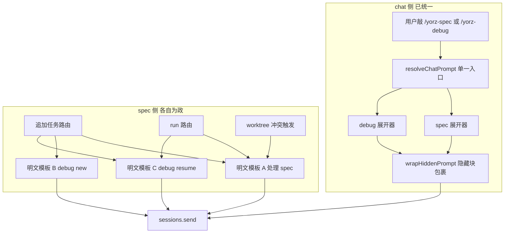
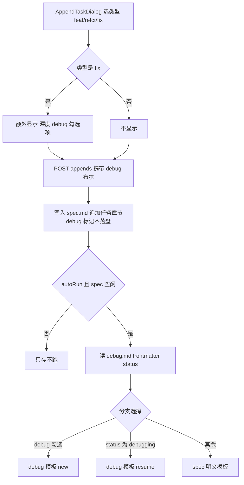
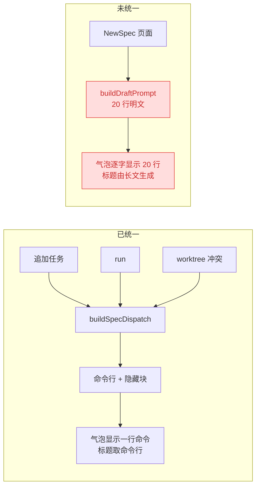
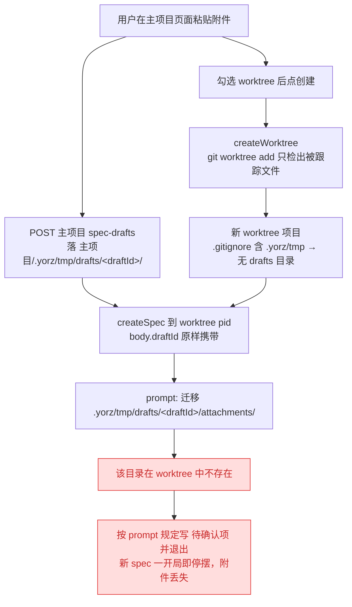
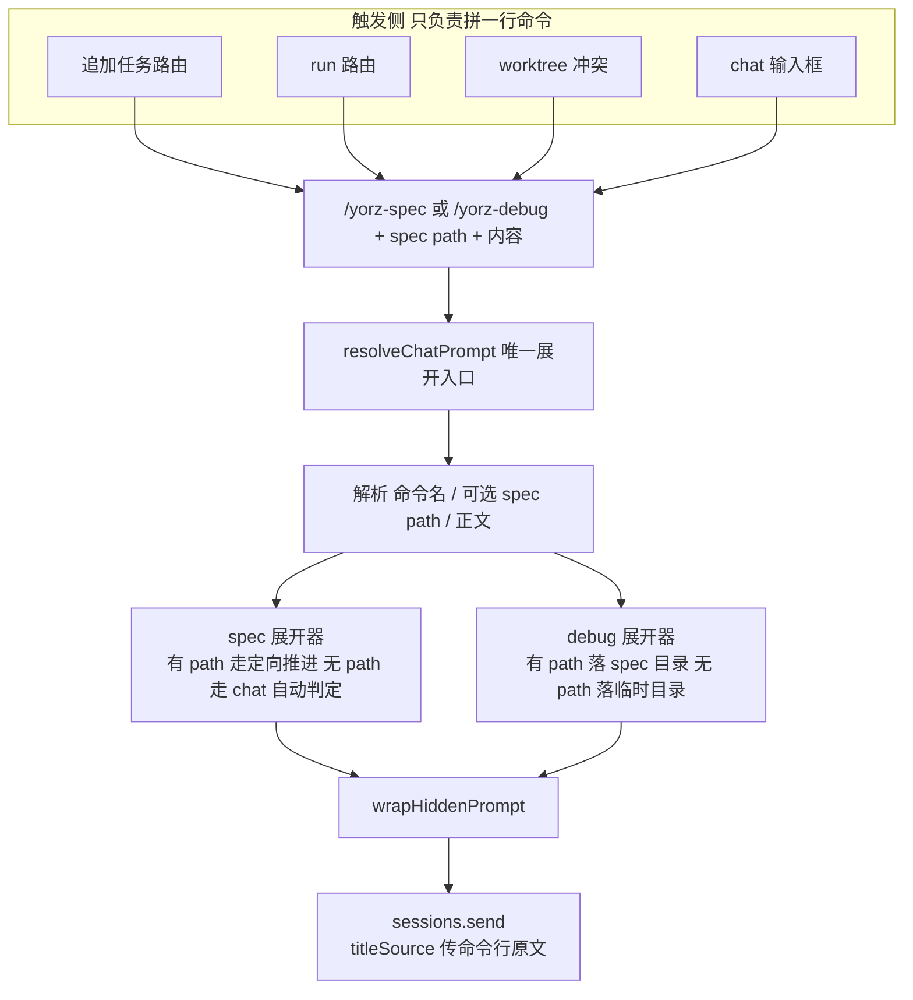
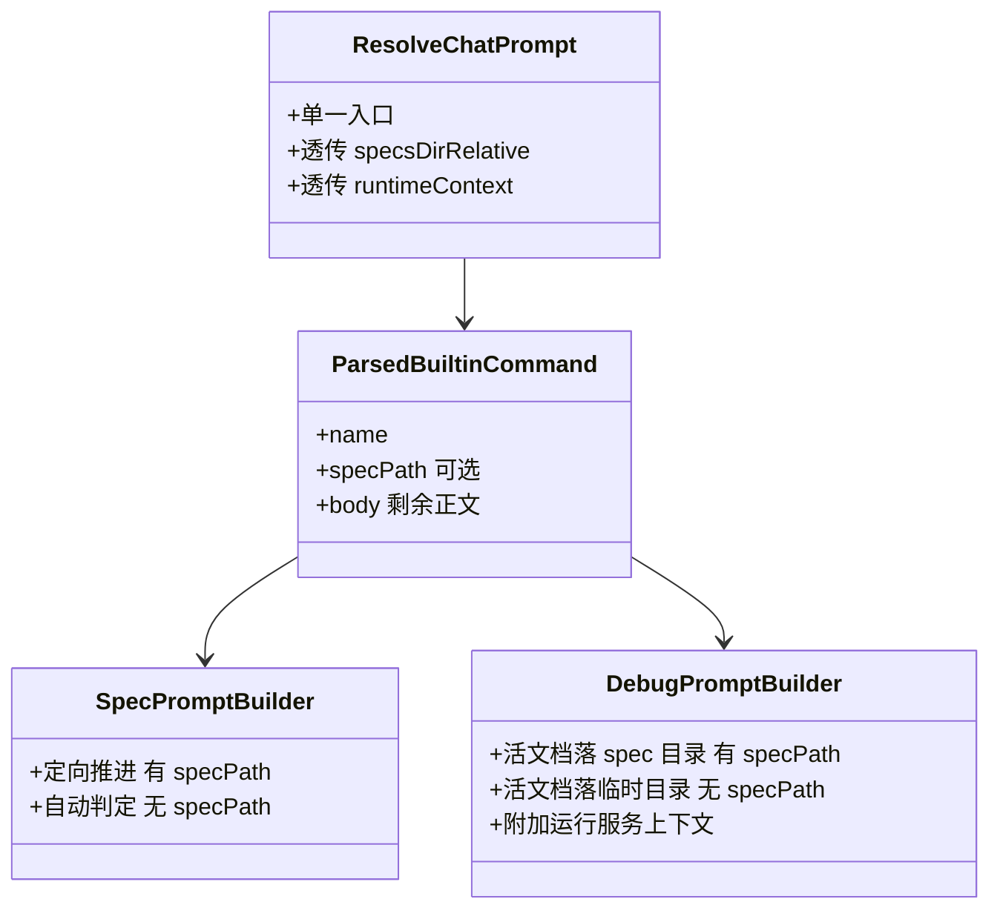
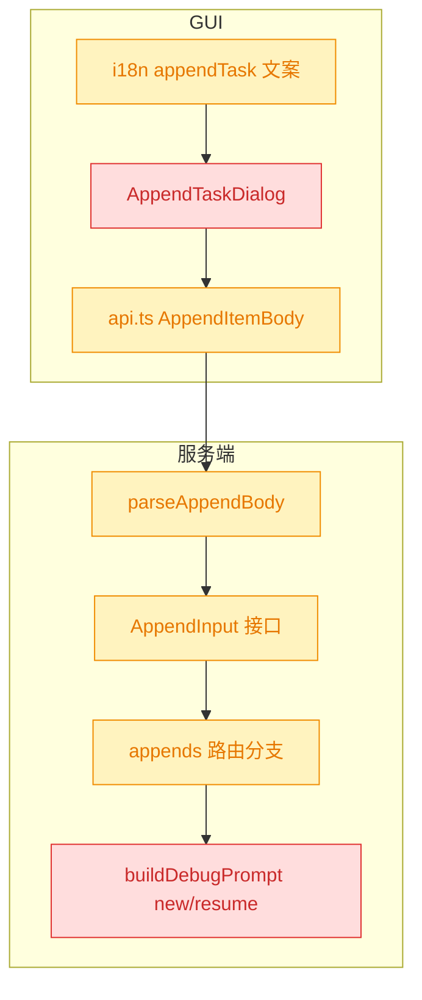
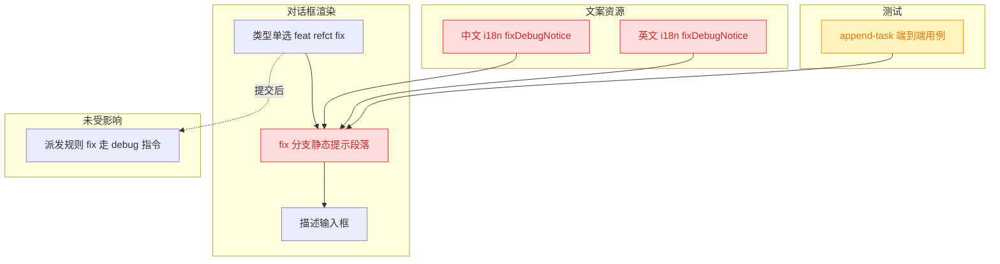
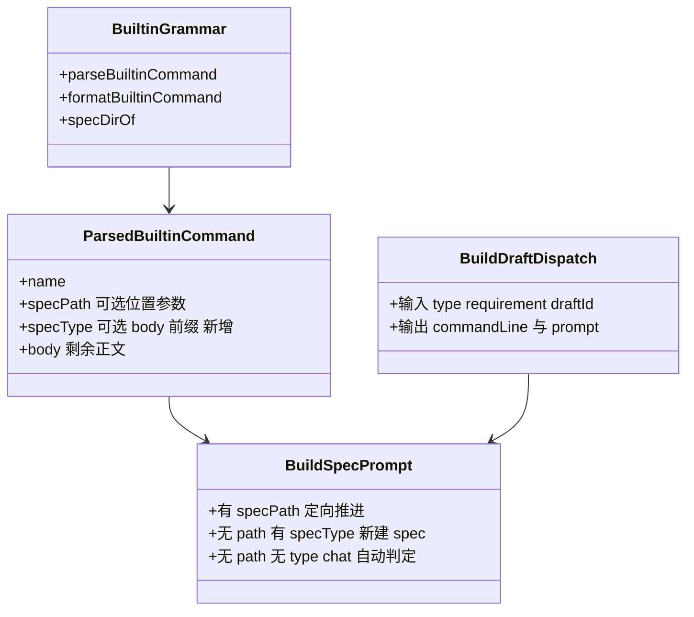
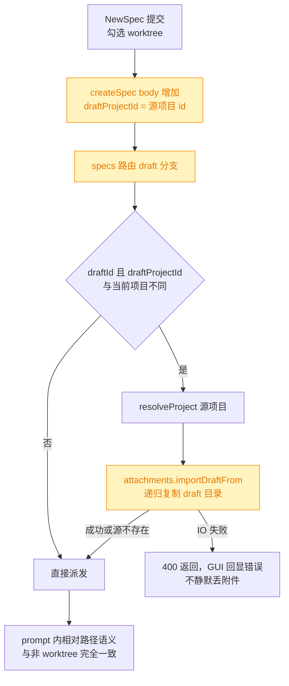

# 追加任务 prompt 统一：复用内置 /yorz-spec 与 /yorz-debug 指令

## 1. 背景

YorZ 向 Agent 派发首条 prompt 的地方已经长出**两条互不相干的链路**：

- **chat 侧**：用户在输入框敲 `/yorz-spec` / `/yorz-debug`，由 `resolveChatPrompt` 统一展开成隐藏块（`wrapHiddenPrompt`），用户原文逐字保留在块外，气泡与所敲内容字节一致。
- **spec 侧**：追加任务 / run / worktree 冲突各自**手写明文模板**拼 `skillRef(...)`，其中追加任务还内联了 `debug` / `debugActive` 三路分支与 `new`/`resume` 两套 debug 模板。

同一件事（让 Agent 按内置 skill 推进某个 spec）因此有 5 份平行文案，改一处文案要同步多处；追加任务派发出去的 prompt 在 Chat 面板里显示为一整段 skillRef 长文，与 chat 侧敲一行指令的体验割裂。

同时「深度 debug」勾选项是一个**只在 `fix` 类型下显示、且不落盘**的一次性布尔，它承担的语义恰好可以由「类型 = fix」表达——多一个勾选就是多一次无谓的决策。

## 2. 需求

1. 简化并统一「追加任务」时发送给 Agent 的 prompt，复用内置的 `/yorz-spec` / `/yorz-debug` 指令。
2. prompt 形式统一为：`/yorz-spec <spec path> 内容` 与 `/yorz-debug <spec path> 内容`。
3. 移除「深度 debug」勾选项；`fix` 类型默认即深度 debug 模式（走 `/yorz-debug`）。
4. 【追加】移除 fix 类型下的提示文案「fix 类型将进入 debug 模式…」——需求 3 的收尾里保留的那条静态告知也一并去掉，追加任务对话框在选中 fix 时不再出现任何 debug 相关说明。
5. 【追加】NewSpec 页面「创建 spec」派发给 Agent 的 prompt 同样冗余，需复用 `/yorz-spec` 内置指令，形式为 `/yorz-spec <类型>: <内容>`；必须兼容勾选「新开项目并行（worktree）」的场景。

## 3. 现状分析

### 3.1 两条分叉的 prompt 生成链路

两侧最终都落到同一个 `sessions.send`，但 spec 侧完全绕开了 chat 侧已有的展开器，重复实现了「引用 skill + 指明 spec 路径 + 说明本次意图」这三件事。

精确层：现有 prompt 生成点清单（文件 + 行号 + 形态）

| 场景                 | 位置                                  | 形态                                                                                 |
| -------------------- | ------------------------------------- | ------------------------------------------------------------------------------------ |
| 追加任务（非 debug） | `src/service/routes/specs.ts:209`     | 明文一行 `${skillRef('yorz-spec')}，然后处理 spec：<specsDirRel>/<id>/spec.md`       |
| run（非 debug）      | `src/service/routes/specs.ts:239`     | 与上完全相同的一行                                                                   |
| worktree 冲突        | `src/service/server.ts:95`            | 与上完全相同的一行                                                                   |
| debug new / resume   | `src/service/routes/specs.ts:404-426` | `buildDebugPrompt(specsDirRelative, specId, mode, runtimeContext)` 两套长模板        |
| 运行服务上下文       | `src/service/routes/specs.ts:432`     | `formatDebugRuntimeContext(runs)`，仅 spec 侧 debug 注入，chat 侧 `/yorz-debug` 无   |
| chat `/yorz-spec`    | `src/service/slash-command.ts:42`     | `buildChatSpecPrompt`，隐藏块，假定「未指定 spec_path」                              |
| chat `/yorz-debug`   | `src/service/chat-debug.ts:21`        | `buildChatDebugPrompt`，隐藏块，活文档落 `.yorz/tmp/debug/debug-<ts>.md`             |
| 新建 spec 草稿       | `src/service/routes/specs.ts:304`     | `buildDraftPrompt`，形态特殊（类型 + 需求 + slug 硬约束 + 附件迁移），**非本次范围** |
| explain / git-ops    | `specs.ts:274` / `spec-review.ts:114` | 另有语义，**非本次范围**                                                             |

### 3.2 追加任务的三分支与「深度 debug」开关

关键观察：

- `debug` 是**纯瞬时参数**——`spec-store.appendItem()` 不把它写进 `## 追加任务` 条目，唯一的状态载体是 `debug.md` 的 frontmatter（`status` / `active`）。因此移除该字段不产生任何数据迁移。
- 服务端已把 `debug` 收敛为 `obj.debug && kind === 'fix'`（`specs.ts:608`），即**它本来就只在 fix 下有意义**——需求 3 只是把这条隐含约束提升为默认行为。
- `new` / `resume` 的区分**在 skill 侧已有等价规则**：`yorz-debug` SKILL.md 的「重入」条目要求，spec 目录已存在 `status: debugging` 的 `debug.md` 时不新建记录块、定位 `active` 指向的块续跑。服务端这套 mode 分支属于重复表达。

### 3.3 一条不可违反的硬约束

`slash-command.ts` 文件头注释写明：**交给 Agent 的 prompt 绝不能以 `/` 开头**——Agent CLI 有自己的 slash registry，未展开的 `/yorz-spec` 会原样回一句 `Unknown command`。

所以「复用 `/yorz-spec` 指令」不等于「直接把 `/yorz-spec ...` 发给 Agent」，而是：**以该命令行为统一的内部表示，再经同一个展开器变成隐藏块 + 命令行原文**。展开后首字符是 `<`（隐藏块起始标记），约束自然满足，且 Chat 面板 `stripHiddenPrompt` 后气泡正好显示那一行命令。

### 3.4 需求 4 现状：勾选项删掉了，提示文案留了下来

上一轮删除「深度 debug」勾选项时做了一个折中——把它降级成 fix 单选项下的一行 muted 静态说明（`appendTask.fixDebugNotice`），理由记在 4.4：「勾选项没了，但『选 fix = 进深度调试』这层告知要留下」。本次追加任务要撤掉这个折中。

该文案是**纯展示、零逻辑**：不参与提交体、不影响派发分支（派发只看 `kind === 'fix' || debugActive`，见 4.2 规则表），删除它不改变任何 Agent 侧行为。

精确层：`fixDebugNotice` 的全部引用点

| 位置                                                  | 形态                                                                                           |
| ----------------------------------------------------- | ---------------------------------------------------------------------------------------------- |
| `src/gui/src/components/AppendTaskDialog.tsx:131-136` | 注释「No opt-in checkbox: fix _is_ Debug mode…」+ `<Show when={kind() === 'fix'}>` 段落        |
| `src/gui/src/i18n/zh-CN.ts:350`                       | `fixDebugNotice: 'fix 类型将进入 debug 模式：深度分析调试，尝试解决疑难问题'`                  |
| `src/gui/src/i18n/en.ts:356-357`                      | `fixDebugNotice: 'fix enters debug mode: deep analysis & debugging…'`                          |
| `src/gui/src/__e2e__/append-task.spec.ts:65-67`       | 注释 + `expect(dialog.locator('input[type="checkbox"]')).toHaveCount(0)` + 断言可见 debug 文字 |

`kind === 'fix'` 是对话框默认选中值（`AppendTaskDialog.tsx:33`），所以这行提示当前是**打开对话框即可见**的，并非罕见分支。

### 3.5 需求 5 现状：新建 spec 是最后一条手写明文链路

需求 1–3 把 append / run / worktree 冲突三处收进了 `buildSpecDispatch`，但 4.7 的决策明确把「新建 spec」排除在外。于是它成了唯一一条**既无隐藏块、又无命令行**的派发：

三个后果：Chat 气泡显示的是 skillRef 绝对路径 + slug 硬约束 + 附件迁移细则，而不是用户自己写的需求；会话标题由这段长文生成（`titleSource` 传 `undefined`）；其中 slug / summary 两条硬约束与 `yorz-spec` skill 的 new-spec 步骤 1 / 5 表达**同一条规则**，构成第二处真相。

精确层：新建 spec 派发链路（文件 + 行号）

| 环节            | 位置                                               | 形态                                                                    |
| --------------- | -------------------------------------------------- | ----------------------------------------------------------------------- |
| 页面提交        | `src/gui/src/pages/NewSpec.tsx:196-210`            | 勾选 worktree 时先 `createWorktree`，再向**新 pid** `createSpec`        |
| 路由分派        | `src/service/routes/specs.ts:53-62`                | `!title && requirement` → draft 分支，`send(sid, prompt, undefined, …)` |
| prompt 生成     | `src/service/routes/specs.ts:306-333`              | `buildDraftPrompt(type, requirement, draftId)`，纯明文无隐藏块          |
| 与 skill 的重叠 | `src/skill/yorz-spec/stages.md` new-spec           | 步骤 1（slug 语义化 / `untitled-` 占位）、步骤 5（summary ≤200）        |
| 现有单测        | `src/service/__tests__/build-draft-prompt.test.ts` | 断言明文片段「类型：feat」「附件迁移」                                  |

### 3.6 需求 5 的真正难点：勾选 worktree 后附件目录断链

草稿附件在用户敲字期间就已上传，落点是**当时所在的项目**（主项目）；worktree 直到点「创建」那一刻才存在：

即「勾选 worktree + 带附件」在当前实现下是必然失败的组合——这正是需求 5 强调「主要需要兼容 worktree 场景」的原因，与 prompt 形式无关，属于同一条链路上必须一并修掉的既有缺陷。

精确层：断链的四个证据点

| 证据                  | 位置                                        | 内容                                                    |
| --------------------- | ------------------------------------------- | ------------------------------------------------------- |
| 附件写入当前项目      | `src/service/attachment-store.ts:98`        | `root = join(opts.cwd, '.yorz', 'tmp', 'drafts')`       |
| draftId 懒创建于上传  | `src/gui/src/lib/attachments.ts:99-103,163` | 首次 `addFiles` 才 `createDraft`，故有 draftId ⇒ 有附件 |
| 上传打到源项目        | `src/gui/src/pages/NewSpec.tsx:98`          | `createAttachments({ projectId })`，此时仍是主项目      |
| worktree 拿不到该目录 | `.gitignore:11`                             | `.yorz/tmp` 被忽略，`git worktree add` 不会带过去       |

`createWorktree` 只复制了 `.yorz/config.json`（`worktree-manager.ts:106-111`），没有也不可能复制 draft——它不知道 draftId。

## 4. 技术实现方案

### 4.1 目标形态：一条命令行 + 一个展开器

### 4.2 命令行拼装规则

触发侧唯一要做的决策是「选哪个命令」，规则表：

| 触发          | `debug.md` status | 追加类型   | 生成的命令行                                |
| ------------- | ----------------- | ---------- | ------------------------------------------- |
| 追加任务      | 非 debugging      | feat/refct | `/yorz-spec <specPath> <描述>`              |
| 追加任务      | 非 debugging      | fix        | `/yorz-debug <specPath> <描述>`             |
| 追加任务      | debugging         | 任意       | `/yorz-debug <specPath> <描述>`（重入守卫） |
| run           | 非 debugging      | —          | `/yorz-spec <specPath>`                     |
| run           | debugging         | —          | `/yorz-debug <specPath>`                    |
| worktree 冲突 | —                 | —          | `/yorz-spec <specPath>`（保持现有语义）     |

`<specPath>` 一律用**项目相对路径** `<specsDirRelative>/<specId>/spec.md`，与现有明文模板一致。`readDebugMdStatus()` 保留，但职责从「选模板」降级为「选命令名」。

### 4.3 展开器改造：可选的 spec path 位置参数

精确层：解析规则与各分支文案要点

**解析（新增于 `src/service/slash-command.ts`）**

- 取首行 `^/([\w-]+)` 得命令名；其后按空白切出第一个 token。
- 该 token 以 `.md` 结尾且不含空白 → 判定为 `specPath`，其余（含换行）为 `body`；否则 `specPath` 为空、整段为 `body`。
- 判定放在**共享解析函数**里，`/yorz-spec` 与 `/yorz-debug` 共用，附带的好处是 chat 输入框里手敲 `/yorz-spec .yorz/specs/xxx/spec.md 继续` 也能定向推进。

**`buildChatSpecPrompt`（`slash-command.ts:42`）**

- 有 `specPath`：隐藏块写 `skillRef('yorz-spec')` + 「然后按其自动模式判定推进 spec：`<specPath>`」；`body` 非空时补一句「本次新增内容见下方用户输入（忽略 `/yorz-spec` 前缀与路径参数）」。
- 无 `specPath`：完全保留现有 chat 文案（上下文有 spec 则续推，否则走新建流程）。

**`buildChatDebugPrompt`（`chat-debug.ts:21`）**

- 有 `specPath`：`spec_dir` = `dirname(specPath)`，活文档 `<spec_dir>/debug.md`；文案合并原 `new`/`resume` 两段为一段——「不存在则创建并立即 `git stash create` 打快照；已存在且 `status: debugging` 则按 skill 重入规则定位 `active` 记录块续跑，勿新建记录块」。
- 无 `specPath`：保留现有 `.yorz/tmp/debug/debug-<ts>.md` 逻辑。
- 新增可选 `runtimeContext` 入参，非空则追加到隐藏块末尾。

**`resolveChatPrompt`（`slash-command.ts:86`）**

- `opts` 增加 `runtimeContext?: string`，透传给 debug 展开器；chat 路由暂不传（保持现状），spec 侧传 `formatDebugRuntimeContext(...)`。

**触发侧统一助手（放 `slash-command.ts`，供 specs.ts / server.ts 复用）**

- 输入 `{ specsDirRelative, specId, command: 'yorz-spec' | 'yorz-debug', body?, runtimeContext? }`，输出 `{ commandLine, prompt }`。
- `sessions.send(sessionId, prompt, commandLine, meta)`——第三个参数 `titleSource` 由 `undefined` 改传 `commandLine`，让会话标题与 Chat 气泡显示为那一行命令而非 skillRef 长文。

### 4.4 移除「深度 debug」勾选项

- **红（删除）**：`AppendTaskDialog` 的 `debug` signal、`Checkbox` 分支与 `Checkbox` 相关 import；`specs.ts` 的 `buildDebugPrompt`（含 `mode` 参数）整函数。
- **黄（改造）**：`AppendItemBody.debug` 字段删除；`AppendInput.debug` 删除；`parseAppendBody` 不再解析 `debug`（**收到未知 `debug` 字段静默忽略，不返回 400**，避免旧页面缓存被打挂）；`appends` 路由的三分支收敛为 4.2 的两分支。
- **文案**：`appendTask.debugMode` 删除；`appendTask.debugModeHint` 改为 fix 单选项下的静态说明（中/英各一条），在 `kind() === 'fix'` 时以 muted 小字展示——勾选项没了，但「选 fix = 进深度调试」这层告知要留下，否则用户无从预期重量级流程（快照 / `debug.md` / 假设看板）。

### 4.5 skill 文档同步

`src/skill/yorz-debug/SKILL.md` 有两处与实现耦合的描述需要跟改（改源文件，`serve` 启动时按指纹自动重装到 `~/.config/yorz/skills/`）：

- 「何时进入本 skill」第 2 条「追加任务勾选 Debug」→ 改为「追加 `fix` 类型任务：SpecDetail 追加 fix 任务时后端直接以 `/yorz-debug` 指向本 skill」。
- 「输入约定」的 `spec_dir` → 说明命令形式为 `/yorz-debug <spec path> <内容>`，`spec.md` 所在目录即 `spec_dir`。

### 4.6 验证方式

- 单测：`slash-command.test.ts`（带/不带 spec path 两组）、`chat-debug.test.ts`（活文档落点随 spec path 切换）、`debug-runtime-context.test.ts`（原断言依赖 `buildDebugPrompt`，改断言展开后的隐藏块含运行服务段落）、新增触发侧助手的命令行拼装用例（覆盖 4.2 全表）。
- E2E：`src/gui/src/__e2e__/append-task.spec.ts` 断言对话框内不再出现 debug 勾选项（需求 4 落地后，「fix 下出现静态提示」这条断言按 4.8 一并移除）。
- 构建/类型：`tsc --noEmit` + 现有 lint/test 脚本。

### 4.7 决策说明（自行查证后定的，不打断用户）

> 决策：把 run 路由与 worktree 冲突触发一并纳入统一范围。理由：两处与追加任务共用**完全相同**的明文模板与 `debug.md` 重入守卫，只改追加任务会让同一份文案继续存在 3 份副本，与「简化并统一」的目标相悖；改动只是替换调用，风险与追加任务同级。被否决的备选：只动 append 路由。

> 决策：删除 `buildDebugPrompt` 的 `new` / `resume` 双模板，改由 skill 自行按 `debug.md` 判定。理由：`yorz-debug` SKILL.md 的「重入」条目已明文规定该行为，服务端再表达一遍属于同一规则的两处真相；合并后 debug 命令行不再需要 mode 参数，触发侧只剩「选命令名」一个决策。被否决的备选：保留 mode 并在命令行上加 `--resume` 之类的开关——那等于把内部状态泄漏进对外指令形式。

> 决策：`sessions.send` 的 `titleSource` 由 `undefined` 改传命令行原文。理由：不传时会拿展开后的完整 prompt 去生成标题，追加任务的会话标题因此是 skillRef 长文；传命令行后与 chat 侧行为一致，Chat 气泡（`stripHiddenPrompt` 后）也正好显示 `/yorz-spec <path> 描述`。

> 决策：追加任务的描述**同时**写进 spec.md 的 `## 追加任务` 条目并作为命令行正文重复发送。理由：需求明确要求 `/yorz-spec <spec path> 内容` 的形式；重复的代价是几十个 token，收益是 Agent 无需先扫描 `[open]` 条目就知道本轮焦点，且气泡可读。

> 决策：`parseAppendBody` 对残留的 `debug` 字段静默忽略而非报 400。理由：GUI 是 SPA，用户浏览器可能缓存着旧 bundle，报错会让追加任务直接失败；忽略是无副作用的向后兼容。

> 决策：本次不动 `buildDraftPrompt`（新建 spec）、`explain`、`git-ops` 三处 prompt。理由：它们承载各自独立的语义（slug 硬约束 / 只读解释 / git 操作白名单），套进 `/yorz-spec <path>` 形式会丢信息，不属于「追加任务 prompt 统一」的范围。

### 4.8 移除 fix 类型提示文案（需求 4）

- **红（删除）**：`AppendTaskDialog.tsx` 中 `<Show when={kind() === 'fix'}>` 提示段落及其上方解释性注释；中英 i18n 的 `fixDebugNotice` 键。
- **黄（改造）**：e2e 用例删除「fix 下可见 debug 文字」这条断言，**保留** `input[type="checkbox"]` 计数为 0 的断言（它守护的是需求 3「不再有勾选项」，与本次无关且仍然有效），并把注释改写为「fix 即 Debug 模式，对话框不作任何额外提示」。
- **不动**：派发链路（`buildSpecDispatch` / appends 路由 / `debug.md` 重入守卫）与 `yorz-debug` SKILL.md——本次只删展示层文案。
- **连带检查**：`AppendTaskDialog.tsx` 的 `Show` import 在 `props.open`、`sectionPath || quote`、`error()` 三处仍在用，不可顺手删除；删除后 i18n 中英两侧 key 集合必须仍然一致。

### 4.9 需求 4 决策说明

> 决策：整段删除提示，不做「改短」「移入 tooltip」等中间形态。理由：追加任务需求原文是「移除…提示文案」，不是弱化；且类型选项文案 `fix 修复缺陷` 本身已表达语义，用户对重量级流程的预期可由后续 debug 面板与 `debug.md` 自然承担。被否决的备选：保留一个 `title` 悬浮提示——那只是把同一句话藏起来，仍需维护两份 i18n。

> 决策：e2e 只删「可见 debug 文字」这一条断言，保留 checkbox 计数断言。理由：两条断言守护不同需求（需求 3 无勾选项 / 需求 4 无提示），删过头会让「勾选项复活」这类回归失去防线。

### 4.10 需求 5 目标形态：类型前缀进命令行文法

用户在追加任务里已写明期望形式 `/yorz-spec <类型>: <内容>`。把「类型」编码成 **body 的前缀**，而不是新增旗标或函数参数，`buildSpecDispatch` 与新建 spec 就共用同一条文法：

精确层：文法与各分支文案要点

**`builtin-command.ts`**

- 新增 `SPEC_TYPE_RE = /^(feat|refct|fix)\s*[:：]\s*([\s\S]*)$/`，在算出 `body` 后再剥一层：命中则 `specType = <类型>`、`body = 其余正文`；不命中 `specType = ''`。
- 中英文冒号都认（GUI 里的需求正文常是中文输入法）。
- `specPath` 与 `specType` 不互斥（`/yorz-spec a.md fix: x` 可解析），但只有「无 path」分支会消费 `specType`——有 path 意味着 spec 已存在，类型由文档自身决定。

**`slash-command.ts`：`buildSpecPrompt` 的第三条分支**

- 无 `specPath` 且有 `specType`：隐藏块写 `skillRef('yorz-spec')` + 「按其『新建 spec』流程创建后立即推进 plan 阶段」+ `类型：<type>（已由调用方指定，不要再询问）` + `spec 目录为 <specsDirRelative>/`；有 `draftId` 时追加附件迁移段。
- 其余两条分支（有 path / 无 path 无 type）文案保持不变。

**`slash-command.ts`：`buildDraftDispatch()`**

- 输入 `{ specsDirRelative, type, requirement, draftId? }`，输出 `{ commandLine, prompt }`；`commandLine = /yorz-spec <type>: <requirement>`（`formatBuiltinCommand` 不适用——它拼的是 spec path 位置参数，这里走 body 前缀，直接模板拼接）。
- 路由改为 `send(sessionId, prompt, commandLine, { trigger: 'new-spec' })`，会话标题与气泡随之变成那一行命令。
- 附件迁移文案从 `buildDraftPrompt` 平移过来，但把硬编码的 `.yorz/specs/<id>/attachments/` 换成 `<specsDirRelative>/<id>/attachments/`。

### 4.11 硬约束下沉到 skill

`buildDraftPrompt` 里的两条硬性要求与 skill 的 new-spec 步骤同义，属于第二处真相，本次下沉后 prompt 只保留**调用方独有的信息**（类型、附件 draft）：

| 原 prompt 硬约束                         | 去向                                                         |
| ---------------------------------------- | ------------------------------------------------------------ |
| slug 只用语义化英文/数字，禁中文挤压拼接 | `src/skill/yorz-spec/stages.md` new-spec 步骤 1 补一句禁止项 |
| summary 是真实概述，勿照搬整段需求       | 同文件步骤 5 的 `summary` 括注补充                           |
| 初始化后立即进入 plan                    | 已由步骤 6 表达，prompt 内保留一句衔接语即可（隐藏块内）     |
| 类型已由调用方指定，不要再询问           | 留在 prompt（每次派发不同，属调用方信息）                    |
| 附件迁移细则                             | 留在 prompt（依赖 draftId，属调用方信息）                    |

### 4.12 worktree 兼容：draft 附件跨项目搬运

精确层：改动点清单

| 位置                                                            | 改动                                                                                       |
| --------------------------------------------------------------- | ------------------------------------------------------------------------------------------ |
| `src/gui/src/lib/api.ts` `CreateSpecBody`                       | 新增可选 `draftProjectId?: string`                                                         |
| `src/gui/src/pages/NewSpec.tsx`                                 | `useWorktree()` 且有 draftId 时 `body.draftProjectId = sourcePid`                          |
| `src/service/routes/specs.ts` `CreateInput` / `parseCreateBody` | 新增 `draftProjectId`，校验为非空字符串，非法返回 400                                      |
| `src/service/routes/specs.ts` draft 分支                        | 派发前调用跨项目复制；失败 → `c.json({ error }, 400)`                                      |
| `src/service/attachment-store.ts`                               | 新增 `importDraftFrom(sourceDir, draftId)`：源目录不存在返回 `false`，否则 `cp(recursive)` |

复制而非「给 Agent 绝对路径」：派发是无人值守的，Agent 在 worktree cwd 下访问工程外目录可能触发权限询问而卡死；复制后 prompt 无需任何 worktree 分支。

### 4.13 需求 5 验证方式

- 单测：`builtin-command` 类型前缀解析（中/英文冒号、无前缀、path+type 并存）；`slash-command` 的 `buildDraftDispatch`（命令行形状、隐藏块含类型/spec 目录、带与不带 draftId）；`specs` 路由的 `draftProjectId` 跨项目复制（复制成功 / 源 draft 不存在 / 非法字段 400）。
- 改写 `build-draft-prompt.test.ts`：`buildDraftPrompt` 已删除，断言迁移到 `buildDraftDispatch`，并新增「prompt 不以 `/` 开头」「`stripHiddenPrompt` 还原命令行」两条。
- e2e：`new-spec-draft.spec.ts` 按新气泡文案调整（若其断言了旧明文）。
- 构建：`pnpm run typecheck` + `pnpm test`。

### 4.14 需求 5 决策说明

> 决策：类型编码为 body 前缀 `<类型>:`，而不是命令行旗标或 `buildSpecPrompt` 的额外参数。理由：用户在追加任务中已明确写出该格式；顺带让 chat 里手敲 `/yorz-spec fix: 登录报错` 也能指定类型，与「可选 spec path 位置参数」的既有文法风格一致。被否决的备选：`--type=feat` 旗标（把内部字段泄漏成指令语法，chat 用户不会敲）。

> 决策：把「勾选 worktree + 带附件必然失败」这条既有缺陷纳入本次范围。理由：需求 5 原文即要求「主要需要兼容勾选 worktree 的场景」；若只换 prompt 形式而不修断链，改完后该组合依然一提交就停摆，等于没兼容。被否决的备选：只做 prompt 统一、另开 spec 修附件（同一条链路两次改动，且中间态仍是坏的）。

> 决策：附件跨项目用「服务端递归复制到 worktree」，不用「prompt 里写源项目绝对路径」。理由：无人值守派发下让 Agent 读工程外目录可能触发权限询问而卡死；复制后相对路径语义与非 worktree 完全一致，展开器不必长出 worktree 分支。被否决的备选：`createWorktree` 时整体复制 `.yorz/tmp/drafts`（那时还不知道 draftId，会连带拷贝无关草稿）。

> 决策：复制失败返回 400 而非静默继续。理由：静默继续的必然结局是 Agent 按 prompt 写一条待确认项后停摆、附件永久丢失；早暴露让用户可立即重试。

> 决策：不在隐藏块里告知「当前处于 worktree 分支」。理由：`ProjectInstance` 不持有 worktree meta，取它要穿透 registry；而 Agent 的 cwd 就是 worktree，行为与主项目无差异，多说一句只增噪音。

> 决策：不动 GUI 的 `deriveSlug`（中文需求回退 `spec-<ts36>`）。理由：它决定的是 git 分支名，与「prompt 统一」无关；改它会影响既有 worktree 命名与 `cleanWorktreeSlug` 的剥离规则，属于另一件事。

## 5. 待确认项

_暂无_

## 6. 任务清单

- [x] 在 `src/service/slash-command.ts` 新增 `parseBuiltinCommand()`，解析命令名 / 可选 spec path（首 token 以 `.md` 结尾）/ 剩余正文（验收：单测覆盖带 path、不带 path、仅命令名三种输入）
- [x] 改造 `buildChatSpecPrompt()` 支持 specPath 定向推进分支，无 path 时文案保持不变（验收：有 path 时隐藏块含该路径，`stripHiddenPrompt` 仍还原命令行原文）
- [x] 改造 `buildChatDebugPrompt()` 支持 specPath 与可选 runtimeContext，并把 new/resume 两段文案合并为一段交由 skill 自判（验收：有 path 落 `<dir>/debug.md`，无 path 落 `.yorz/tmp/debug/`）
- [x] `resolveChatPrompt()` 的 opts 增加 `runtimeContext` 并透传给 debug 展开器（验收：`tsc -b` 通过）
- [x] 在 `slash-command.ts` 新增触发侧助手，按 4.2 规则表产出 `{ commandLine, prompt }`（验收：单测覆盖规则表全部 6 行）
- [x] `specs.ts` 的 appends 路由改用该助手，删除 `parsed.debug` 三分支（验收：文件内 grep 无 `parsed.debug`）
- [x] `specs.ts` 的 run 路由与 `src/service/server.ts:95` worktree 冲突触发改用该助手（验收：两处均无内联 `skillRef('yorz-spec')` 模板）
- [x] 删除 `specs.ts` 的 `buildDebugPrompt()` 整函数（验收：`grep -rn buildDebugPrompt src` 无残留）
- [x] `parseAppendBody()` 与 `AppendInput` 移除 `debug` 字段，未知 `debug` 字段静默忽略（验收：携带 `debug: true` 的请求体仍返回 200）
- [x] `AppendTaskDialog.tsx` 移除 debug signal / Checkbox 分支 / Checkbox import，改为 fix 类型下的静态 muted 提示（验收：文件内无 `Checkbox` 字样）
- [x] `src/gui/src/lib/api.ts` 的 `AppendItemBody` 移除 `debug` 字段（验收：`tsc -b` 通过）
- [x] 中英 i18n 删除 `appendTask.debugMode`，将 `debugModeHint` 改写为 fix 类型静态说明文案（验收：两个 i18n 文件 key 集合一致且无 `debugMode:`）
- [x] 同步 `src/skill/yorz-debug/SKILL.md` 的触发条件与输入约定描述（验收：文件内无「勾选」字样，且写明 `/yorz-debug <spec path>` 形式）
- [x] 更新受影响单测：`slash-command.test.ts`、`chat-debug.test.ts`、`debug-runtime-context.test.ts`，并补触发侧助手用例（验收：`pnpm test` 全绿）
- [x] 更新 `src/gui/src/__e2e__/append-task.spec.ts`，断言对话框无 debug 勾选项（验收：文件内无勾选项断言残留）
- [x] 跑 `pnpm run typecheck` 与 `pnpm test` 做收尾校验（验收：两条命令均退出码 0）
- [x] 删除 `src/gui/src/components/AppendTaskDialog.tsx` 中 fix 类型的 `<Show>` 提示段落及其上方解释性注释（验收：文件内无 `fixDebugNotice`，且 `Show` import 仍保留——其余三处分支在用）
- [x] 删除中英 i18n 的 `appendTask.fixDebugNotice` 键（验收：`grep -rn fixDebugNotice src` 无残留，且 `zh-CN.ts` / `en.ts` 的 `appendTask` key 集合一致）
- [x] 更新 `src/gui/src/__e2e__/append-task.spec.ts`：删除「fix 下可见 debug 文字」断言、改写注释，保留 checkbox 计数为 0 的断言（验收：文件内无 `getByText('debug'` 且仍有 `input[type="checkbox"]` 断言）
- [x] 跑 `pnpm run typecheck` 与 `pnpm test` 复核需求 4 改动（验收：两条命令均退出码 0）
- [x] `src/service/builtin-command.ts` 新增 `specType` 解析：body 以 `<feat|refct|fix>:`（中/英文冒号）开头时剥离为独立字段（验收：单测覆盖英文冒号、中文冒号、无前缀、path 与 type 并存四种输入）
- [x] `slash-command.ts` 的 `buildSpecPrompt` 新增「无 specPath + 有 specType」新建 spec 分支，并支持可选 `draftId` 附件迁移段（验收：隐藏块含 `类型：feat` 与 `<specsDirRelative>/`；无 specType 时既有两条分支文案逐字不变）
- [x] `slash-command.ts` 新增 `buildDraftDispatch({ specsDirRelative, type, requirement, draftId })`（验收：`commandLine` 形如 `/yorz-spec feat: 内容`，`prompt` 首字符非 `/`，`stripHiddenPrompt(prompt)` 还原命令行）
- [x] `specs.ts` 的 draft 分支改用 `buildDraftDispatch`，`titleSource` 传 `commandLine`，并删除 `buildDraftPrompt()` 整函数（验收：`grep -rn buildDraftPrompt src` 无残留）
- [x] `src/skill/yorz-spec/stages.md` 的 new-spec 步骤 1 / 5 下沉 slug 与 summary 硬约束（验收：文件含「禁止把中文挤压为零散英文片段」与「不要原样照搬整段需求」）
- [x] `attachment-store.ts` 新增 `importDraftFrom(sourceDraftsDir, draftId)`：源不存在返回 `false`，否则递归复制并返回 `true`（验收：单测覆盖源存在 / 不存在两种）
- [x] `parseCreateBody` 与 `CreateInput` 新增可选 `draftProjectId` 并校验为非空字符串（验收：`draftProjectId: 123` 返回 400，合法值返回 202）
- [x] `specs.ts` 的 draft 分支在派发前跨项目复制 draft 附件（`draftProjectId` 存在且异于当前项目时），复制抛错返回 400（验收：单测断言复制后目标项目 `.yorz/tmp/drafts/<id>/attachments/` 出现原文件）
- [x] `src/gui/src/lib/api.ts` 的 `CreateSpecBody` 增加 `draftProjectId?`，`NewSpec.tsx` 在勾选 worktree 且存在 draftId 时携带源项目 id（验收：`pnpm run typecheck` 通过，文件内可见 `draftProjectId: sourcePid`）
- [x] 改写 `src/service/__tests__/build-draft-prompt.test.ts` 为 `buildDraftDispatch` 用例（验收：`pnpm test` 该文件全绿且不再 import `buildDraftPrompt`）
- [x] 核对 `src/gui/src/__e2e__/new-spec-draft.spec.ts` 是否断言了旧明文 prompt，如有则改为新命令行形态（验收：文件内无对 `硬性要求` / `附件迁移` 等旧明文的断言）
- [x] 跑 `pnpm run typecheck` 与 `pnpm test` 做需求 5 收尾校验（验收：两条命令均退出码 0）

## 7. 追加任务

- [fixed] [refct] 2026-09-01 16:29:19 | 移除 fix 类型下的提示文案“fix 类型将进入 debug 模式...”
  - 描述：移除 fix 类型下的提示文案“fix 类型将进入 debug 模式...”
- [fixed] [refct] 2026-09-01 16:42:27 | @src/gui/src/pages/NewSpec.tsx 页面创建 spec 发送到 chat 的内容也比较冗余，也需要复用 /yorz-spec 内置指令
  - 描述：@src/gui/src/pages/NewSpec.tsx 页面创建 spec 发送到 chat 的内容也比较冗余，也需要复用 /yorz-spec 内置指令，主要需要兼容 勾选 worktree checkbox 的场景；

格式：
/yorz-spec <类型>: <内容>

## 8. 执行记录

- 新增 `src/service/builtin-command.ts`：内置指令共享文法 `parseBuiltinCommand()` / `specDirOf()` / `formatBuiltinCommand()`。spec path 作为**可选位置参数**（首 token 以 `.md` 结尾才认），独立成模块以免 `slash-command.ts` 与 `chat-debug.ts` 互相 import。
- `chat-debug.ts`：`buildChatDebugPrompt` → `buildDebugPrompt(prompt, { now, runtimeContext })`。有 spec path 时活文档落 `<spec 目录>/debug.md`，原 `new` / `resume` 两段文案合并为一段「按 skill 重入规则自判」；无 path 时保留临时目录逻辑。runtimeContext 插在「见下方用户输入」之前，避免隔断该句与隐藏块外的正文。
- `slash-command.ts`：`buildChatSpecPrompt` → `buildSpecPrompt`（新增 spec path 定向推进分支）；`resolveChatPrompt` 增加 `runtimeContext` 透传；新增触发侧唯一入口 `buildSpecDispatch()`，按 4.2 规则表产出 `{ commandLine, prompt }`。
- `routes/specs.ts`：append 路由三分支收敛为 `debug = kind === 'fix' || debugActive` 两分支；run 路由改用同一助手；删除 `buildDebugPrompt()`（含 `mode` 参数）整函数；`AppendInput.debug` 与 `parseAppendBody` 的 debug 解析移除（未知字段静默忽略）。两处 `sessions.send` 的 `titleSource` 由 `undefined` 改传 `commandLine`。
- `server.ts`：worktree 冲突触发改用 `buildSpecDispatch`，移除 `skillRef` 直引。
- GUI：`AppendTaskDialog.tsx` 删除 debug signal / Checkbox 分支 / Checkbox import，改为 fix 类型下的静态 muted 提示；`api.ts` 的 `AppendItemBody.debug` 删除；中英 i18n 的 `appendTask.debugMode` / `debugModeHint` 合并为 `fixDebugNotice`。
- `src/skill/yorz-debug/SKILL.md`：触发条件「追加任务勾选 Debug」改为「追加 `fix` 类型任务」；输入约定补充 `/yorz-debug <spec path> <内容>` 的形式与 `spec_dir` 推导方式。
- 测试：`slash-command.test.ts` 重写为 `buildSpecPrompt` + 新增 `buildSpecDispatch` 全规则表用例；`chat-debug.test.ts` 补 spec path 落点与 runtimeContext 用例；`debug-runtime-context.test.ts` 改断言 `buildSpecDispatch`；`appends-route.test.ts` 新增「陈旧 `debug` 字段仍返回 200」；`append-task.spec.ts`（e2e）断言对话框无 checkbox 且 fix 显示提示。
- 验证：`pnpm run typecheck` 通过；`pnpm test` 73 文件 / 701 passed；`pnpm run build`（cli + gui）成功。另用一次性 vitest 打印三种派发的最终 prompt 逐字核对——展开后首字符为隐藏块标记（不以 `/` 开头），`stripHiddenPrompt` 可还原命令行原文，气泡将显示 `/yorz-spec <path> 内容`。
- 收尾：任务清单全部完成，待确认项为 `_暂无_`，无 `！！！` 批注与 `[open]` 追加项，`stage` 置 `done`。

### 8.1 需求 4（追加任务：移除 fix 类型提示文案）

- `AppendTaskDialog.tsx`：删除 fix 类型下的 `<Show>` 提示段落及其上方解释性注释。`Show` import 保留——`props.open` / `sectionPath || quote` / `error()` 三处仍在用。
- i18n：中英两侧 `appendTask.fixDebugNotice` 键删除，`appendTask` 的 key 集合保持一致。
- `append-task.spec.ts`（e2e）：删除「fix 下可见 debug 文字」断言，注释改写为「fix 即 Debug 模式，对话框不作任何额外提示」；保留 `input[type="checkbox"]` 计数为 0 的断言（守护需求 3）。
- 派发链路未动：`kind === 'fix' || debugActive` → `/yorz-debug` 的规则与 `yorz-debug` SKILL.md 均保持原样，本次仅删展示层文案。
- 验证：`grep -rn fixDebugNotice src` 无残留；`pnpm run typecheck` 通过；`pnpm test` 73 文件 / 701 passed / 2 skipped。
- 收尾：追加项标记为 `[fixed]`，任务清单无未完成项，待确认项为 `_暂无_`，`stage` 置 `done`。

### 8.2 需求 5（新建 spec 派发统一 + worktree 附件兼容）

- `builtin-command.ts`：`ParsedBuiltinCommand` 增加 `specType`，body 以 `feat|refct|fix` + 中/英文冒号开头时剥离为独立字段；**带 spec path 时不剥**（此时类型由文档自身决定，且追加描述可能真的以「fix:」开头）。新增 `formatTypedBuiltinCommand()` 产出 `/yorz-spec <type>: <body>`。
- `slash-command.ts`：`buildSpecPrompt` 由两分支扩为三分支（有 path 定向推进 / 无 path 有 type 新建 spec / 无 path 无 type chat 自动判定），新增 `SpecPromptOptions.draftId` 与 `buildDraftAttachmentGuide()`（迁移目标路径改用 `specsDirRelative`，不再硬编码 `.yorz/specs`）；新建分支单独一条 tail 文案（新 spec 没有 `## 追加任务` 可消费）。新增 `buildDraftDispatch()`。
- `routes/specs.ts`：draft 分支改用 `buildDraftDispatch`，`titleSource` 由 `undefined` 改传 `commandLine`；删除 `buildDraftPrompt()` 整函数与随之无用的 `skillRef` import；`CreateInput` / `parseCreateBody` 新增 `draftProjectId` 校验。
- `attachment-store.ts`：新增 `importDraftFrom(source, draftId)`（源不存在返回 `false`，目标已存在直接复用，否则 `cp(recursive)`）。draft 分支在派发前按 `draftProjectId !== p.id` 触发复制，抛错返回 400 而非静默派发。
- GUI：`CreateSpecBody` 增加 `draftProjectId?`；`NewSpec.tsx` 在目标项目与来源项目不同（即勾选 worktree）且存在 draftId 时携带来源项目 id。
- `src/skill/yorz-spec/stages.md`：new-spec 步骤 1 补 slug 语义化 / 禁止中文挤压拼接，步骤 5 补「summary 为真实概述、勿照搬需求」，步骤 6 补 plan 阶段补齐三节——原先由 prompt 重复表达的硬约束下沉为单一真相（`serve` 启动时按指纹重装到 `~/.config/yorz/skills/`）。
- 测试：`build-draft-prompt.test.ts` → `draft-dispatch.test.ts`（命令行形状 / 隐藏块内容 / 附件段落 / 多行需求 / `stripHiddenPrompt` 还原）；新增 `builtin-command.test.ts`（类型前缀四类输入 + 与 `formatTypedBuiltinCommand` 往返）；`attachment-store.test.ts` 补跨项目复制两例；`spec-drafts-route.test.ts` 补「非法 draftProjectId 返 400」与「跨项目复制后目标项目内出现原文件」。
- 验证：`pnpm run typecheck` 通过；`pnpm test` 74 文件 / 716 passed / 2 skipped；`pnpm run build`（cli + gui）成功。另用一次性 vitest 打印最终 prompt 逐字核对——首字符为隐藏块标记（不以 `/` 开头），气泡显示 `/yorz-spec feat: <需求>`。
- 收尾：追加项标记为 `[fixed]`，任务清单无未完成项，待确认项为 `_暂无_`，`stage` 置 `done`。
