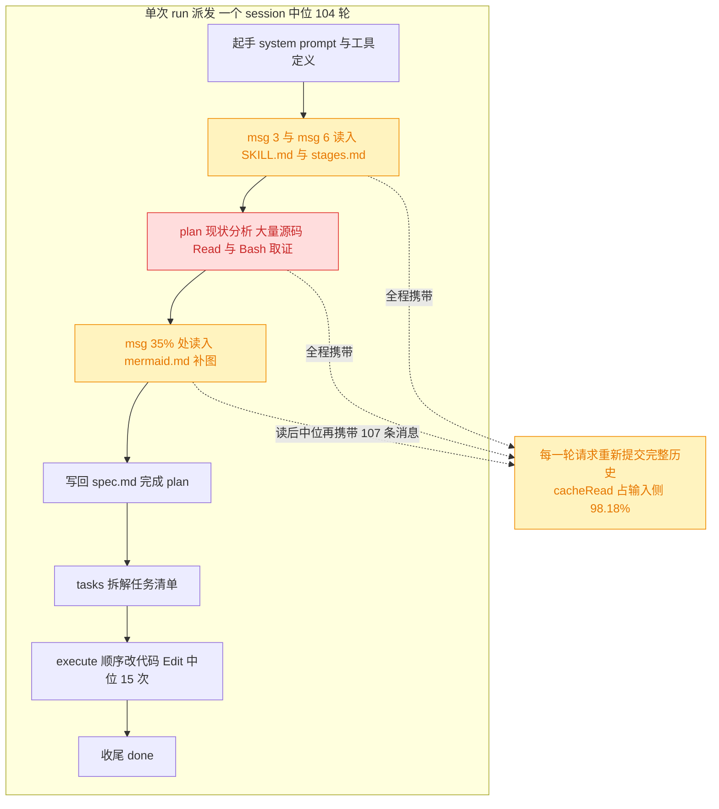
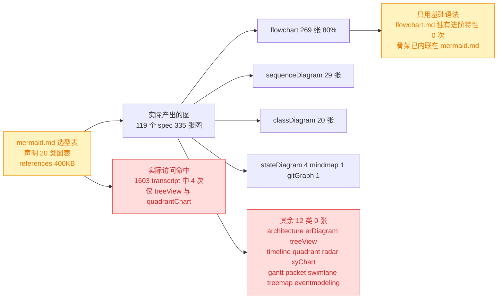
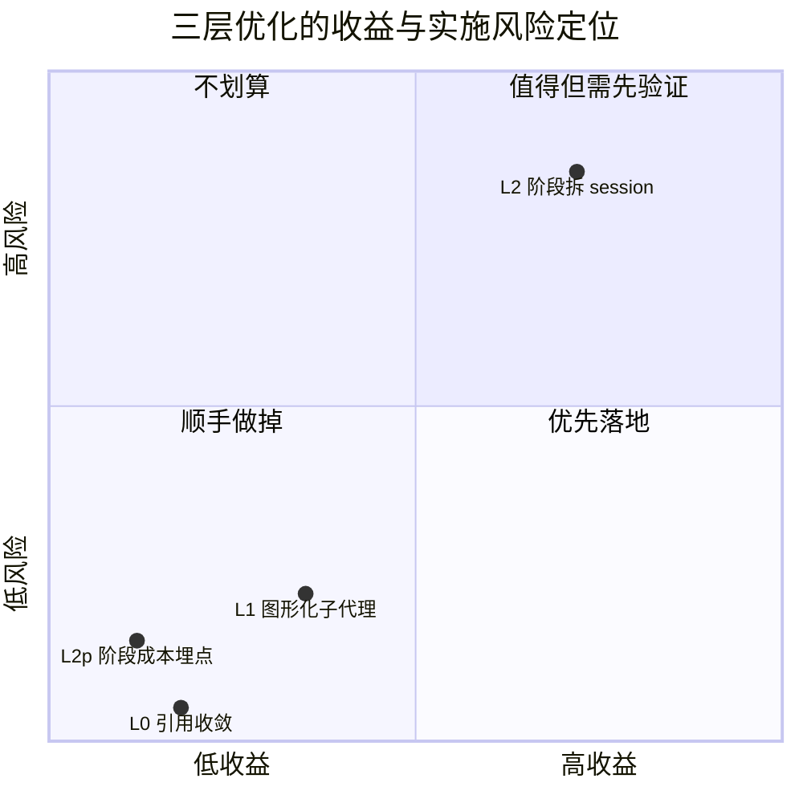
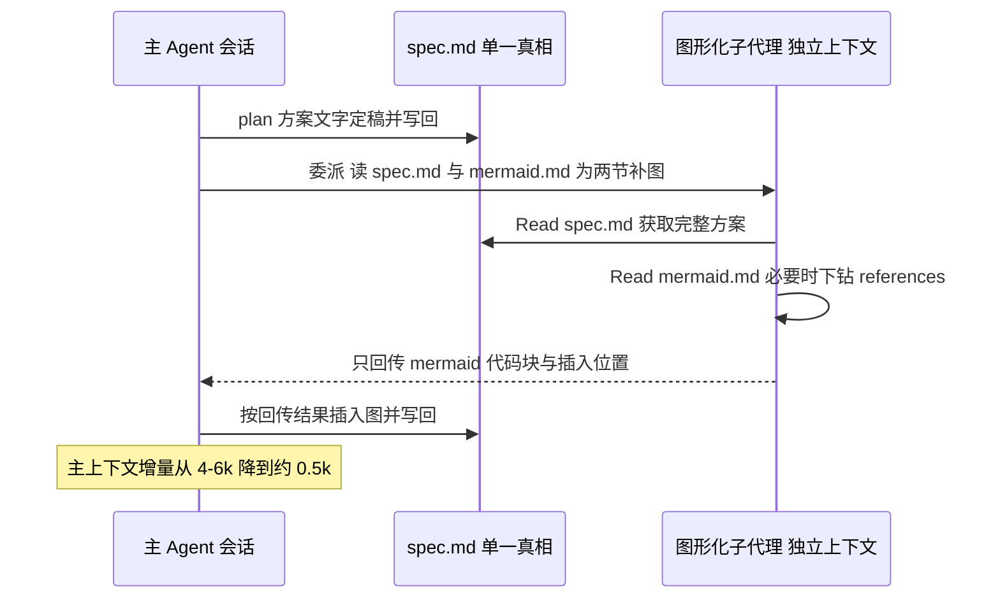
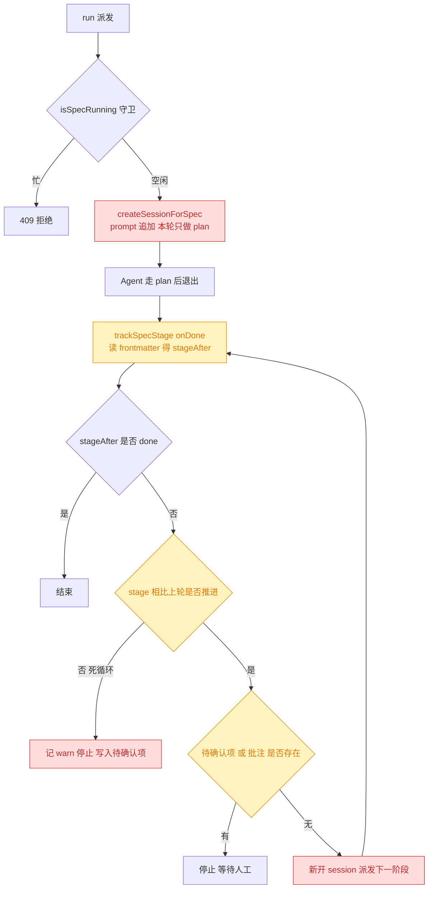
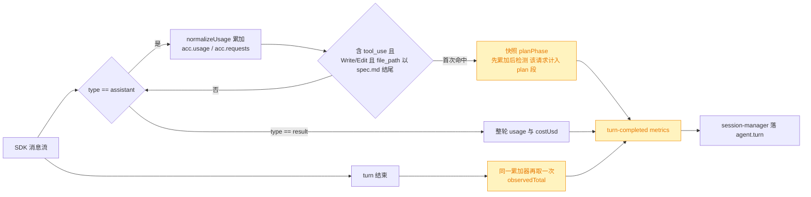
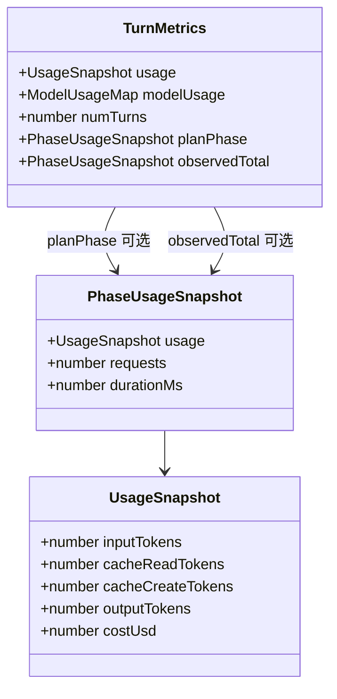
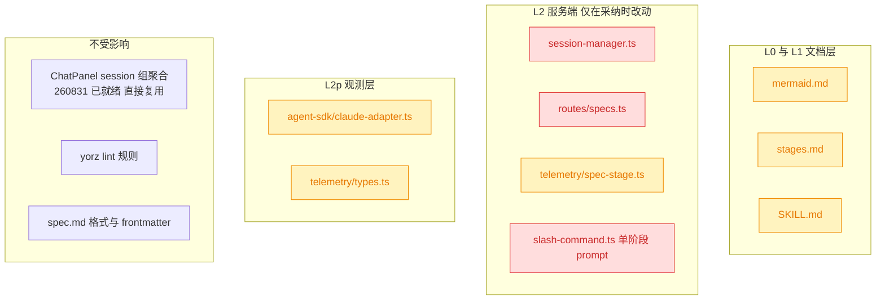

# skill 阶段上下文成本优化：mermaid 大文档的携带代价与阶段拆分论证

## 1. 背景

`yorz-spec` skill 在 plan 阶段设有「图形化补充」收尾子步骤，强制加载 `mermaid.md` 对 `现状分析` / `技术方案` 两节补图；`mermaid.md` 又可按需下钻 `references/` 目录中的单图类型文档。

这些文档体积可观，而 plan / tasks / execute 三阶段目前在**同一个 session 内连续推进**——plan 阶段读入的文档会在后续每一轮请求中被重新提交。

本 spec 承接 `260831.refct.session-split-chat-grouping` 的结论（该 spec 已把「同一 spec 多次派发共用一个 session」拆开），继续向内一层：**同一次派发内部，跨阶段的上下文携带是否也存在同类浪费**。

## 2. 需求

1. 量化 plan 阶段加载 `mermaid.md` / `references/*.md` 对后续 tasks / execute 阶段执行效率与成本的实际影响。
2. 判定是否需要优化；若需要，给出优化方案。
3. 论证是否应把 skill 的各阶段拆成独立 session 并纳入 session 组（沿用 `260831` 的聚合能力）。
4. 评估阶段拆分对 Agent 执行效率与质量的损害。

## 3. 现状分析

本节全部结论基于两组本机实测数据：`~/.config/yorz/metrics/telemetry.jsonl`（12 个自然日、232 次派发、6683 轮、$683.19）与 `~/.claude/projects/**/*.jsonl`（1603 个 session transcript、84,726 行、2026-07-18 → 2026-09-01）。

### 3.1 一次派发内三阶段连做，plan 的上下文全程被 execute 携带

阶段边界与上下文轨迹的实测出处

- **三阶段确实连做**：123 个读过 `mermaid.md` 的 session 中，88 个（**72%**）在同 session 内既 `Write` 了 `.yorz/specs/*/spec.md` 又发生了源码 `Edit`（Edit 次数中位 15、均值 22、最多 88）。
- **阶段边界位置**：以「首个 `/src/` 源码 Edit」为 plan→execute 交接点，14 个合格 session 中该点中位落在全 session 消息数的 **31.0%** 处。
- **交接时的上下文**：交接点前 5 次请求的 `cache_read_input_tokens` 中位 **104,179**；execute 段单次请求上下文中位 **143,682**。
- **最近一次完整派发解剖**（`4ce7f75e-2c68-4b4a-bf62-ec6993d9ffae.jsonl`，09-01 append，104 轮 / $8.84）：254 条消息、150 次计费请求、cacheRead 合计 **17,859,483**。上下文从 msg 1 的 14,774 单调爬升到 msg 244 的 172,018；`SKILL.md` 在 msg 2、`stages.md` 在 msg 5 读入，首个源码 Edit 在 msg 113。
- **压缩不是当前瓶颈**：12 天 6683 轮中 `agent.compact` 事件 **0 次**（埋点自 `e07f667` 起即存在，覆盖全时间范围）；transcript 侧 470 个 YorZ session 中仅 4 个出现过 `compact_boundary`。上下文增长全部以 cacheRead 反复计费，而非被压缩截断。
- **计费口径**：对 365 条 opus `modelUsage` 样本做最小二乘反解，得 `cacheRead ≈ $0.515/M tok`（与 Opus 输入价 $5/M × 0.1 吻合），`output ≈ $22/M`；中位相对残差 3.60%、p90 7.40%。下文所有成本折算均用 **$0.515/M**。

### 3.2 实测：skill 文档的常驻代价约占单次 run 的 6–9%

| 文档           | 体积    | token 估算区间 | 读入位置（中位）    | 读后携带轮次 | 折算成本          | 占 run 中位成本 |
| -------------- | ------- | -------------- | ------------------- | ------------ | ----------------- | --------------- |
| `SKILL.md`     | 8.6 KB  | 2.7k – 4.3k    | 第 3 条消息         | ≈ 104        | $0.15 – $0.23     | 1.5% – 2.3%     |
| `stages.md`    | 12.9 KB | 4.1k – 6.5k    | 第 6 条消息         | ≈ 104        | $0.22 – $0.35     | 2.2% – 3.6%     |
| `mermaid.md`   | 12.8 KB | 4.0k – 6.2k    | 全 session 35.5% 处 | ≈ 67         | **$0.14 – $0.21** | **1.4% – 2.2%** |
| `references/*` | 400 KB  | ~100k          | —— 几乎不读         | ——           | **≈ $0**          | **≈ 0%**        |
| **三件套合计** | 34.3 KB | 10.8k – 17.0k  | ——                  | ——           | **$0.58 – $0.91** | **5.9% – 9.3%** |

对照基线：`run` 派发中位成本 **$9.80** / 104 轮 / ctx/轮 140,704；`run` 占 12 天总成本的 36.9%（$251.81 / $683.19）。

**结论：`mermaid.md` 单独的携带代价约为单次 run 的 2%，三件套合计 6–9%。影响真实存在，但不足以支撑架构级改动。**

token 估算口径与成本折算过程

本机无 `ANTHROPIC_API_KEY`、无 `ant` CLI，无法用 `messages.count_tokens` 精确核算，故给区间而非点值：

- **下界**（CJK 按 1 token/字，ASCII 按 3.5 字节/token）：SKILL 2,731 / stages 4,101 / mermaid 4,018，合计 **10,850**。
- **上界**（CJK 按 2 token/字即 1.5 字节/token，ASCII 按 4 字节/token）：SKILL 4,292 / stages 6,514 / mermaid 6,196，合计 **17,002**。
- 真实值大概率靠近下界（Claude 3+ 对中文约 1–1.5 token/字），表中一律给区间并按上界做保守判断。

成本折算公式：`成本 = token 数 × 读后计费请求数 × $0.515/M`。

- `mermaid.md` 读后轮次：中位读入位置 35.5%，run 中位 104 轮 → 104 × (1 − 0.355) ≈ **67**。
- `SKILL.md` / `stages.md` 在第 3 / 第 6 条消息读入，视作全程携带 → **104**。
- 三件套上界：17,002 × 104 × 0.515 / 1e6 = **$0.91**；下界：10,850 × 104 × 0.515 / 1e6 = **$0.58**。

### 3.3 实测：`references/` 是死重——1603 个 transcript 中只被访问 4 次

用户假设中「特别是 flow gitgraph」这类大文档拖累上下文——**实测该假设不成立**：在 2026-07-18 → 2026-09-01 的 45 天观测窗口内，扫描全机 **1603** 个 transcript / **84,726** 行消息，`flowchart.md`（53 KB）与 `gitgraph.md`（52 KB）**被任何工具（`Read` / `Bash` / 其它）访问的次数均为 0**；整个 `references/` 目录只被访问 **4 次**（2 次 `Read`、2 次 `Bash`，全部指向 `treeView.md` 与本 spec 自身核对语法用的 `quadrantChart.md`）。

同一套脚本在同目录下检出 `SKILL.md` 206 次、`stages.md` 191 次、`mermaid.md` 121 次 `Read`——**方法的检出能力已由阳性对照证实**，`references/` 的近零命中是信号而非探针失灵。计量方法、漏检面排查与口径缺口见下方折叠块。

计量方法、阳性对照与口径缺口

**数据源与口径**：Claude Code 把每个 session 的完整消息流落盘为 `~/.claude/projects/<escaped-path>/<sessionId>.jsonl`，其中每次工具调用是一条 `content[].type == "tool_use"` 记录，带 `name`（工具名）与 `input`（含 `file_path`）。计量即：遍历全部 **1603** 个 jsonl / **84,726** 行，对 `input` 序列化后匹配 `references/<name>.md`，按 `(工具名, 文件名)` 计数。**不只统计 `Read`**——任何工具（`Bash`/`Write`/`Grep`…）的 input 里点名该文件都会被计入，因此 `cat`、`grep` 这类绕过 `Read` 的访问同样可见。JSON 解析失败 0 行。

**全量结果**（1603 个 transcript 中所有触碰 `references/` 的工具调用，共 11 次）：

| 次数 | 工具    | 文件                                                                |
| ---- | ------- | ------------------------------------------------------------------- |
| 6    | `Bash`  | 目录级（`ls` 之类，未点名具体文件）                                 |
| 2    | `Read`  | `treeView.md`                                                       |
| 1    | `Bash`  | `treeView.md`                                                       |
| 1    | `Bash`  | `quadrantChart.md`（本 spec 自身 plan 阶段为核对语法所做的 `grep`） |
| 1    | `Write` | 目录级                                                              |

`flowchart.md` / `gitgraph.md` / `sequenceDiagram.md` / `classDiagram.md` 等 **全部 0 次，任何工具皆无**。

**阳性对照（证明方法能检出真实读取）**：同一套脚本对同目录其他文件的计数为 `Read SKILL.md` **206**、`Read stages.md` **191**、`Read mermaid.md` **121**、`Bash SKILL.md` 42、`Bash mermaid.md` 8。方法能稳定检出三件套的读取，却在 `references/` 上几乎为零——是信号，不是探针失灵。

**漏检面排查**：

- _相对路径漏网_：全部 `Read` 的 `file_path` 均为绝对路径，落在 4 个 skill 根目录（`~/.config/yorz/skills/` 371 次、`~/.claude/skills/` 92 次、`.tmp-e2e-home/skills/` 91 次、`src/skill/` 7 次），无相对路径形态。
- _子代理漏网_：子代理（Task）的消息以 `isSidechain: true` 记在同一 jsonl 中，已纳入统计（命中条目中有 4 条来自子代理）。
- _非 Read 通道漏网_：已覆盖（见上表 `Bash` 行）。

**口径缺口（如实标注）**：`references/` 与 `mermaid.md` 同在 `ad5daa8`（**2026-06-27**）引入，而本机 transcript 最早只到 **2026-07-18**——**开头约 3 周无记录**。因此本结论的严格表述是「**在 2026-07-18 → 2026-09-01 这 45 天、1603 个 session 的观测窗口内**，`references/` 被访问 4 次（2 次 `Read`）」。考虑到同窗口内 `mermaid.md` 被读 121 次却未触发一次下钻，缺口不改变结论方向。

不读文档为什么还能画出 269 张 flowchart

这不是矛盾，恰恰是渐进式披露按设计工作的证据。三条支撑：

1. **常用语法已内联在 `mermaid.md` 里**。`mermaid.md` 自身就带 3 段可直接套用的范式：开头的 `flowchart TD` 决策示例、「影响面语义配色」的 `flowchart TB` + `classDef` 范式、`classDiagram` + `classDef` 范式，以及结尾的 `flowchart LR` 示例。产出量最大的两类图（flowchart 269 张、classDiagram 20 张）的骨架，Agent 读 `mermaid.md` 时就已经拿到了。

2. **实际产出只用到基础语法，从未触及 `flowchart.md` 独有的进阶特性**。对 331 张图做语法特征扫描：

   | 语法特征                       | 出现次数 | 是否需下钻 `flowchart.md` |
   | ------------------------------ | -------- | ------------------------- |
   | 基础节点 `A[..]`               | 2232     | 否（训练数据 + 内联示例） |
   | 基础箭头 `-->`                 | 1968     | 否                        |
   | ` ` 换行                   | 275      | 否                        |
   | `classDef` 语义配色            | 244      | 否（mermaid.md 内联范式） |
   | `subgraph`                     | 207      | 否                        |
   | 菱形判定 `{..}`                | 150      | 否                        |
   | 虚线箭头 `-.->`                | 52       | 否                        |
   | `style` 单节点                 | 24       | 否                        |
   | `%%{init}%%` 主题指令          | **0**    | 是                        |
   | 新版形状 `@{ shape: }`         | **0**    | 是                        |
   | `linkStyle`                    | **0**    | 是                        |
   | markdown 字符串 `["\`..\`"]`   | **0**    | 是                        |
   | `<-->` 双向箭头 / `click` 交互 | **0**    | 是                        |

   即产出侧只消费了 mermaid 最古老、公开语料最密集的那层语法，从未逼近需要查手册的边界。

3. **唯一触发过下钻的正是最冷门的图型**。2 次 `Read` 全部指向 `treeView.md`——mermaid 的 `-beta` 图型，公开语料稀薄，模型确实"不会"。这正是 `references/` 应有的角色：**语法兜底，而非常规读物**。

**对方案的含义**：这三条同时解释了为什么 L0 选择「收敛引用」而非「删除目录」。`references/` 的问题不是它被读得太多（成本为 0），而是 `mermaid.md` 用 20 行选型表把它抬成了常规工序的一部分，诱导 Agent 考虑 12 类从未产出过的图型；而 `treeView.md` 的 2 次命中又证明兜底能力真的会被用到——所以该动的是引用方式，不是文件本身。

Read 命中与产出分布的精确数据

**Read 侧**（扫描 `~/.claude/projects/**/*.jsonl`，1603 个 transcript、236 个 project 目录、时间跨度 2026-07-18 → 2026-09-01）：

- 命中 `yorz-spec` 路径的 `Read` 工具调用共 **561** 次，聚合后：`SKILL.md` 206 次、`stages.md` 191 次、`mermaid.md` **121** 次、`references/*.md` **2** 次（占 0.36%，全部是 `treeView.md`，分属 2 个临时 draft session）。
- 全机只有 11 个 session 的 transcript 出现过字符串 `yorz-spec/references`，其中 9 次是 `ls` 输出里的目录列举（各 ref 文件出现次数均匀分布在 12–22，正是目录被打印的特征），仅 2 次是真正的 `Read`。

**产出侧**（`.yorz/specs/*/spec.md`，119 个 spec）：

- 89 个 spec 含 mermaid，共 **335** 张图。类型分布：`flowchart` 269、`sequenceDiagram` 29、`classDiagram` 20、`stateDiagram-v2` 4、`mindmap` 1、`gitGraph` 1、`graph` 1。
- `mermaid.md` 选型表推荐的 `architecture`（现状分析首选）、`erDiagram`、`treeView-beta`、`treemap-beta`、`timeline`、`quadrantChart`、`radar`、`xyChart`、`eventmodeling`、`packet`、`swimlane`、`gantt` —— **产出为 0**。

**体积对照**：`references/` 25 个文件 400 KB ≈ 100k token，是三件套（34.3 KB）的 **11.7 倍**，但对实际成本贡献为 0。

### 3.4 成本的主导变量是任务规模与 ctx/轮，不是文档体积

对 22 条 `plan → done` 派发（一次派发内跑完 plan + 全部 task）按 `tasksTotal` 做线性回归拆解：

| 因变量   | 截距（plan + 固定开销） | 斜率（每个 task 的边际） | R²    | 中位 12 tasks 时的固定项占比 |
| -------- | ----------------------- | ------------------------ | ----- | ---------------------------- |
| costUsd  | **$1.598**              | $0.662 / task            | 0.532 | **17%**                      |
| numTurns | **31.6 轮**             | 4.88 轮 / task           | 0.530 | **35%**                      |

即：**plan 段约占成本的 17%、轮次的 35%；tasks/execute 段占成本约 83%。** 轮次占比高于成本占比，正说明后期轮次因上下文已胀大而单价更高——这恰恰是「阶段拆分」想要攻击的点。

同时，`260831` 的 session 拆分已经在同一机理上取得过实测收益：`git-ops` 派发的 ctx/轮 从复用 session 时的 128,558 降到新开 session 后的 25,729（**−80%**，n=3 vs n=2，样本极小仅供方向参考）。

## 4. 技术实现方案

### 4.1 结论总览：三层优化，收益与风险不在同一量级

| 层级    | 做法                                                    | 12 天可省                    | 占总成本    | 实施半径                        | 质量风险           |
| ------- | ------------------------------------------------------- | ---------------------------- | ----------- | ------------------------------- | ------------------ |
| **L0**  | `mermaid.md` 选型表按实测收敛，`references/` 折叠为兜底 | ≈ $0（省的是认知负担与误导） | 0%          | 1 个 md 文件                    | 无                 |
| **L1**  | 「图形化补充」委派 Task 子代理，主上下文只回收图        | **≈ $7.6**                   | ≈ 1.1%      | 2 个 md 文件                    | 低（图与方案脱节） |
| **L2**  | plan / tasks+execute 拆成独立 session，纳入 session 组  | **≈ $19 – $30**              | 2.8% – 4.4% | 服务端编排循环 + skill 契约反转 | 中高（语境断裂）   |
| **L2p** | 阶段成本埋点（L2 的前置观测）                           | $0                           | 0%          | adapter + telemetry             | 无                 |

**核心判断：L0 与 L1 是纯收益、应当直接做；L2 的收益是 L1 的约 3 倍，但代价是反转 skill 的核心契约并承担质量风险，其收益估算还建立在若干未经实测的假设上——因此建议先做 L2p 取得实测依据，再决定是否投入 L2。**

### 4.2 L0：`mermaid.md` 引用收敛

不删除 `references/`（删了就永久失去 Agent 查语法的兜底能力，而它的驻留成本本就是 0），只改**引用方式**：

- 选型表按实测频次收敛为**主表 6 行**（flowchart / sequenceDiagram / classDiagram / stateDiagram / mindmap / gitgraph），其余 12 类移入 `
` 折叠的「扩展图型」表。
- 「必须用图（高优先级）」一节中，把从未产出过的 `treeView-beta` 从「必须」降级为「按需」——它是当前唯一被 Read 过的 reference，却也从未真正产出过图，说明现有措辞诱导了无效下钻。
- 在 mermaid.md 顶部补一条硬约束：**「`references/` 仅在图渲染报错或语法确实不确定时读取，单轮最多读 1 个」**。当前 SKILL.md 只说「仅按需 Read」，没有给可判定的触发条件。

### 4.3 L1：图形化补充委派子代理

可行性依据：`claude-adapter.ts:141-148` 用默认 `Options` 调用 SDK `query()`，未裁剪 `allowedTools`，因此 Task（子代理）工具默认可用。子代理天然满足 skill 的「md 是单一真相」契约——它读 `spec.md` 就能拿到完整方案，不需要继承主会话的探索历史。

### 4.4 L2：阶段拆 session 的可行性与收益上界

**收益上界推导**：execute 段约 68 轮（104 × 65%），交接时上下文 104k，其中冷启动必需基线约 40k（system + 工具定义约 12k、skill 三件套约 14k、spec.md 约 15k）。差额 64k 是 plan 的探索痕迹。

- **理想上界**（execute 完全不需要重读）：64k × 68 × $0.515/M = **$2.24 / 派发 ≈ 23%**。
- **现实估计**（execute 需重读约一半、并因重新定位多花 10–15 轮）：净省 **$0.7 – $1.1 / 派发 ≈ 7% – 11%**。
- 折算到 12 天窗口的 27 次 run+append：**$19 – $30**，占总成本 2.8% – 4.4%。

**质量代价**（需求 4 的正面回答）：

1. **交接物基本够用，但不是全部够用。** 实测 1325 条任务条目中 **969 条（73%）** 含具体文件路径；119 个 spec 中 **66 个（55%）** 含 `
` 精确层，且近 10 个 spec 稳定在 2–7 块。剩下 27% 的任务条目与 45% 的 spec 缺少可冷启动的落点，拆分后这部分会明显退化。
2. **失去的是「为什么」而非「是什么」。** spec.md 承载结论，不承载推理路径。execute 遇到方案与代码现实冲突时，冷启动 session 只能重新推导——这正是「新增/扩展需求 → 切回 plan」这条合法阻塞会被更频繁触发的场景。
3. **与 skill 核心契约正面冲突。** `SKILL.md:8` 写明「Agent 持续推进直至阻塞或收尾为 `done` 才退出」，「持续推进硬约束」显式禁止中途停顿。L2 要求 Agent 在 plan 结束后主动退出，等于新增一种「非阻塞退出」——必须同时改 skill 契约与服务端编排，两者任一未对齐就会退化成「plan 做完就停住不动」。
4. **新增可靠性负担**：自动续跑循环需要死循环防护（stage 未推进即停）、与 `isSpecRunning` 守卫协同、失败在 GUI 可见。当前代码库**没有任何自动续跑机制**（`autoRun` 只是 append 的一次性派发开关，见 `routes/specs.ts:210`）。

### 4.5 L2p：阶段成本埋点（本轮唯一落地项）

当前遥测无法直接切分单次派发内 plan 与 execute 的成本——4.4 的收益推导只能靠回归（R²≈0.53）与 14 个 transcript 样本。L2p 把这条推断变成直接测量。

#### 4.5.1 测量原理

`agent.turn` 目前只在 `result` 消息到达时上报**一次**整轮 usage，轮内无任何分段信息。做法是在 `ClaudeSession.send` 的消息流里挂一个**累加器**：每条 `type: 'assistant'` 的 SDK 消息都带本次 API 请求的 `message.usage`，逐条归一化累加；当流中首次出现「写 `spec.md`」的 `tool_use` 时对累加器打快照，即为 plan 段。

#### 4.5.2 新增类型契约

字段语义、口径自洽性与边界情况

**为什么必须同时有 `observedTotal`**：`metrics.usage` 来自 `result` 消息（SDK 自己的整轮口径），而 `planPhase` 来自逐条 assistant 累加——两者是**两套口径**，直接相除会把口径差伪装成阶段差。`observedTotal` 用**同一个累加器**在 turn 结束时再取一次，保证 `planPhase / observedTotal` 分子分母同源可比；`metrics.usage.costUsd` 则提供整轮真实计费，用于把 token 比例折算成金额。

**字段定义**：

| 字段         | 含义                                                            |
| ------------ | --------------------------------------------------------------- |
| `usage`      | 累加的归一化 token（`normalizeUsage('claude', message.usage)`） |
| `requests`   | 计入的 assistant 消息条数 ≈ 计费请求数，用于算「读后携带轮次」  |
| `durationMs` | 从 `send()` 开始到该时刻的墙钟毫秒                              |

**先累加后检测**：boundary 所在那条 assistant 消息自身的 usage 计入 plan 段——写回 `spec.md` 这个动作本身是 plan 的产物，不是 execute 的开销。

**边界情况**：

- 派发内从未写 `spec.md`（`git-ops` / `explain` / 纯问答）→ `planPhase` 保持 `undefined`，字段不落盘，`agent.turn` 行形状与今天完全一致（向后兼容，`yorz metrics` 无需改动）。
- 一轮内多次写 `spec.md`（tasks 写清单、execute 逐项勾选）→ 只认**首次**，后续命中不覆盖快照。
- 子代理（`parent_tool_use_id` 非空）的 assistant 消息同样带 usage，一并累加——它们是真实成本，不该从分母里消失。
- 匹配条件放在 adapter 层用「`file_path` 以 `spec.md` 结尾」判定，不引入 `specsDir` 配置依赖；代价是 `docs/specs/<name>.md` 这类非 `spec.md` 结尾的存量路径测不到，作为已知口径缺口记录在此。

#### 4.5.3 改动清单

| 文件                               | 改动                                                         |
| ---------------------------------- | ------------------------------------------------------------ |
| `telemetry/types.ts`               | 新增 `PhaseUsageSnapshot`；`TurnMetrics` 增两个可选字段      |
| `telemetry/index.ts`               | 导出新类型                                                   |
| `agent-sdk/claude-adapter.ts`      | `ClaudeSession.send` 内累加 + 快照，装进 `metrics`           |
| `session-manager.ts`               | `agent.turn` payload 透传 `planPhase` / `observedTotal`      |
| `__tests__/claude-adapter.test.ts` | 补「命中 boundary」「无 boundary」「多次写只认首次」三条用例 |
| `docs/Architecture.md`             | 事件集一节补 `agent.turn` 的阶段快照字段说明                 |

### 4.6 影响面

对外行为无变化：CLI 选项、埋点 schema（L2p 为新增字段，向后兼容）、spec.md 格式均不改。**L2 若采纳，唯一的破坏性是 skill 的「持续推进」契约语义**；Chat 面板的多 session 聚合能力已由 `260831` 提供，拆分后无需任何 GUI 改动。

### 4.7 关键决策说明

> 决策记录：`### 5.1 L2「阶段拆 session」投入到哪一层？` —— 用户批注「只做 L2p：阶段成本埋点」，即在给出的 4 个候选之外进一步收窄：**本轮只实施 L2p，L0（引用收敛）、L1（图形化子代理）、L2（阶段拆 session）全部不做**。理由：L0/L1 虽被本 spec 判定为纯收益，但合计仅省 ≈1.1% 总成本，而 L2p 是把「plan 段究竟占多少」从 R²≈0.53 的回归推断变成直接测量——先取得实测依据，再决定后续任何一层是否值得投入。L0/L1/L2 的分析结论保留在 4.2–4.4 作为后续重开的现成依据，不删除。

> 决策记录：**L2p 只上报数据，不扩 `yorz metrics` 聚合面**。理由：L2p 的定位是「L2 的前置观测」，消费方是一次性分析（本 spec 的 plan 阶段自身就是用 jq / 临时脚本完成取证的），而 `MetricsSummary` 每加一个聚合字段都要同步 CLI 渲染与快照测试；等积累到足够样本、确认该指标要长期看板化时再补聚合更划算。被否决备选：同步给 `SpecAggregate` 加 `planCostUsd` —— 在指标是否有长期价值尚未验证时就固化 CLI 契约。

> 决策记录：**boundary 判定放在 adapter 层按「`file_path` 以 `spec.md` 结尾」匹配，而非由 `session-manager` 用已知的 `specId` 精确判定**。理由：分段所需的逐请求 usage 只在 SDK 消息流里可见（`session-manager` 只能拿到 turn 末尾的汇总），累加器必须住在 adapter；把 boundary 检测拆到 `session-manager` 就要让 adapter 额外向外流式吐出每请求 usage，改动面和事件契约都更大。代价是 adapter 不知道 `specsDir`，非 `spec.md` 结尾的存量路径测不到，已作为口径缺口记录在 4.5.2。

> 决策记录：**不删除 `references/` 目录**，改为在 `mermaid.md` 中折叠引用 + 补充可判定的下钻触发条件。理由：该目录在 1603 个 transcript 中只被访问 4 次（2 次 `Read`），驻留成本实测为 0，删除省不下任何 token；它真正的害处是选型表里 20 行推荐诱导 Agent 考虑 12 类从未产出过的图型，收敛引用即可消除该害处并保留语法兜底。被否决备选：整目录删除 —— 永久失去渲染报错时的自查能力，换来的是 0 成本收益。

> 决策记录：**用户假设「flow gitgraph 文档内容多会拖累上下文」经实测不成立**，`flowchart.md`（53 KB）与 `gitgraph.md`（52 KB）在 1603 个 transcript 中被任何工具访问的次数均为 0。真正常驻的只有 `SKILL.md` + `stages.md` + `mermaid.md` 三件套（34.3 KB / 10.8k–17.0k token）。因此本 spec 把优化重心从「瘦身大文档」转向「阶段间上下文携带」。

> 决策记录：**「不读文档也能画图」不构成对结论的反驳，反而是渐进式披露生效的证据**（详见 3.3 折叠块）。理由：产出量最大的 flowchart/classDiagram 的骨架已内联在 `mermaid.md` 的三段范式里；对 331 张图做语法特征扫描显示，`flowchart.md` 独有的进阶特性（`%%{init}%%`、`@{shape:}`、`linkStyle`、markdown 字符串、`<-->`、`click`）使用次数全为 0；而唯一触发过下钻的 `treeView.md` 恰是公开语料稀薄的 `-beta` 图型。故 `references/` 的正确定位是「语法兜底」，L0 只收敛引用方式、不动文件。

> 决策记录：**Read 次数的计量口径为「任何工具 input 中点名该文件」而非仅 `Read` 工具**，并以三件套的命中数（206/191/121）作阳性对照。理由：`Bash cat`/`grep` 可绕过 `Read` 工具访问文件（本 spec 自身核对 `quadrantChart` 语法时就是如此，且被该口径成功捕获）；子代理消息以 `isSidechain: true` 记在同一 jsonl 中亦已纳入。被否决备选：只统计 `Read` 工具 —— 会漏掉 Bash 通道，无法排除「探针失灵」这一竞争解释。

> 决策记录：**如实标注观测窗口缺口**：`references/` 于 `ad5daa8`（2026-06-27）引入，而本机 transcript 最早只到 2026-07-18，开头约 3 周无记录。结论的严格表述限定在 45 天观测窗口内。理由：同窗口内 `mermaid.md` 被读 121 次而未触发一次下钻，缺口不改变结论方向，但把「全机从未」写成无限定断言会是过度声明。

> 决策记录：**L1 采用 Task 子代理隔离，而非把 `mermaid.md` 内容内联进 `stages.md`**。理由：内联只是把 4–6k token 从「35.5% 处读入」提前到「第 6 条消息读入」，携带轮次反而从 67 涨到 104，成本更高；子代理把主上下文增量压到只剩回传的图（约 0.5k）。被否决备选：把选型表精简后内联 —— 精简到能内联的程度就会丢失出图质量所依赖的判据。

> 决策记录：**不把「压缩风险」作为优化理由**。理由：12 天 6683 轮中 `agent.compact` 事件 0 次，transcript 侧 470 个 session 中仅 4 个出现 `compact_boundary`，即使 ctx/轮 最高达 348,005 也未触发压缩。上下文增长的全部代价体现为 cacheRead 反复计费（占输入侧 98.18%），是线性成本而非阶跃风险。

> 决策记录：**成本折算统一采用实测反解的 `cacheRead = $0.515/M`**，而非官方牌价推算。理由：对 365 条 opus `modelUsage` 样本做最小二乘，中位相对残差 3.60%、p90 7.40%，比按「Opus 输入 $5/M × 0.1」的理论值更贴合本机实际计费（两者也确实吻合，互为验证）。

> 决策记录：**token 量给区间而非点值**。理由：本机无 `ANTHROPIC_API_KEY` 也无 `ant` CLI，无法调用 `messages.count_tokens`；字符数近似对中文的误差可达 2 倍，故一律给出下界/上界并按上界做保守判断，避免把估算值伪装成实测值。

## 5. 待确认项

_暂无_

## 6. 任务清单

- [x] 在 `src/service/telemetry/types.ts` 新增 `PhaseUsageSnapshot` 接口（`usage` / `requests` / `durationMs`），并给 `TurnMetrics` 增加可选 `planPhase`、`observedTotal` 两个字段（验收：`pnpm typecheck` 通过，两字段均为可选，旧 `agent.turn` 行形状不变）
- [x] 在 `src/service/telemetry/index.ts` 导出 `PhaseUsageSnapshot` 类型（验收：adapter 中 `import type { PhaseUsageSnapshot } from '../telemetry/index.js'` 可解析）
- [x] 在 `src/service/agent-sdk/claude-adapter.ts` 的 `ClaudeSession.send` 中按 assistant 消息累加 `message.usage`（经 `normalizeUsage('claude', …)`）并记录请求数与耗时（验收：累加逻辑不改变现有 `metrics.usage` 来自 `result` 消息的行为）
- [x] 在同一处实现 boundary 检测：首次出现 `Write`/`Edit`/`MultiEdit` 且 `input.file_path` 以 `spec.md` 结尾时快照 `planPhase`，先累加当条 usage 再检测，后续命中不覆盖（验收：新增单测断言快照包含 boundary 所在请求的 usage）
- [x] 在 turn 结束（`turn-completed` 发出前）用同一累加器生成 `observedTotal` 并装入 `metrics`（验收：单测断言 `observedTotal.requests` 等于流中 assistant 消息总数）
- [x] 在 `src/service/session-manager.ts` 的 `agent.turn` 上报 payload 中透传 `planPhase` 与 `observedTotal`（验收：字段为 `undefined` 时不出现在 JSONL 行内）
- [x] 在 `src/service/__tests__/claude-adapter.test.ts` 补三条用例：命中 boundary、无 `spec.md` 写入时 `planPhase` 缺席、一轮多次写只认首次（验收：`pnpm exec vitest run src/service/__tests__/claude-adapter.test.ts` 全绿）
- [x] 在 `docs/Architecture.md` 遥测事件集一节补 `agent.turn` 的 `planPhase` / `observedTotal` 字段语义与「同口径分子分母」的用法说明（验收：文档中可查到两字段含义及 `undefined` 的向后兼容约定）
- [x] 运行 `pnpm typecheck` 与 `pnpm test` 全量验证（验收：typecheck 无错误、测试套件全绿）

## 7. 执行记录

- 2026-09-01 17:23 —— 新建 spec，写入背景与需求，进入 plan 阶段。
- 2026-09-01 17:52 —— 完成 plan 阶段。取证三路并行：（1）扫描 1475 个 Claude transcript 统计 skill 文档 Read 命中与携带轮次，得出 `references/` 仅被 Read 2 次、`mermaid.md` 中位在 35.5% 处读入后仍需携带 107 条消息；（2）分析 12 天遥测 939 行 / $683.19，对 22 条 `plan→done` 做回归拆解得 plan 段占成本 17%、轮次 35%，并对 365 条 opus 样本最小二乘反解出 `cacheRead = $0.515/M`；（3）解剖 14 个 session 的 plan→execute 交接点，得交接上下文 104k、execute 段单请求 143k。据此推翻「flow/gitgraph 大文档拖累上下文」的初始假设，把重心转向阶段间携带，形成 L0/L1/L2/L2p 四层方案。L2 的投入程度依赖用户对成本与改造风险的取舍，作为 `### 5.1` 待确认项等待人工批注。
- 2026-09-01 18:14 —— 应质疑复核 `references/` 计量方法：把口径从「仅 `Read` 工具」放宽为「任何工具 input 点名该文件」，重扫 1603 个 transcript / 84,726 行，得全目录访问 4 次（`flowchart.md`/`gitgraph.md` 均为 0）；补三件套命中数（206/191/121）作阳性对照，排查相对路径、子代理 `isSidechain`、非 Read 通道三类漏检面；如实标注 2026-06-27 → 07-18 约 3 周的观测窗口缺口。另对 331 张产出图做语法特征扫描，证实只消费基础语法、`flowchart.md` 独有进阶特性使用为 0，解释了「不读文档仍能画图」，并据此固化 L0「收敛引用而非删除目录」的取舍。结论与方案层级不变，仍阻塞于 `### 5.1`。
- 2026-09-01 20:34 —— 消费用户批注「只做 L2p：阶段成本埋点」，进入 tasks 阶段。勘察 `claude-adapter.ts` / `telemetry/types.ts` / `session-manager.ts` / `cli/metrics.ts` 现状，确认逐请求 usage 只在 SDK 消息流内可见，据此把 4.5 展开为可实施设计：累加器 + 首次写 `spec.md` 快照 `planPhase`，并新增 `observedTotal` 保证分子分母同口径。落三条决策记录（收窄至仅 L2p、不扩 `yorz metrics` 聚合面、boundary 判定留在 adapter 层），清空待确认项，拆出 9 条任务，删除 `## 用户批注` 章节。
- 2026-09-01 20:41 —— execute 完成全部 9 项，L2p 埋点落地。改动点：`telemetry/types.ts` 新增 `PhaseUsageSnapshot` 并给 `TurnMetrics` 增可选 `planPhase`/`observedTotal`；`telemetry/index.ts` 导出新类型；`claude-adapter.ts` 新增 `PhaseAccumulator`（逐条 assistant 消息累加 `message.usage`，计请求数与墙钟耗时）与 `isSpecWrite` 后缀判定，在首个写 `spec.md` 的 `tool_use` 处（先累加后检测）快照 `planPhase`、并在两处 `turn-completed` 出口统一经 `withPhases` 补 `observedTotal`；`session-manager.ts` 在 `agent.turn` payload 透传两字段。验证方式：新增 3 条 adapter 单测（命中 boundary 断言 `planPhase.requests=2` 且含 boundary 请求的 usage、无 spec 写入时 `planPhase` 为 `undefined`、一轮三次写只认首次 `inputTokens=5` 而 `observedTotal=555`）；向后兼容由 `recorder.ts:99` 的 `JSON.stringify` 保证——`undefined` 字段不会落盘，未写 spec 的派发行形状不变。`pnpm typecheck` 无错误，`pnpm test` 74 文件 / 719 用例全绿（2 skipped）。另在 `docs/Architecture.md` 遥测一节补「轮内阶段切分」条目，说明两字段语义、为何需要同口径分母、以及路径后缀匹配测不到 `docs/specs/<name>.md` 的已知缺口。
- 2026-09-01 20:41 —— 收尾：任务清单 9/9 完成，待确认项为空、无 `！！！` 批注、无 `[open]` 追加任务，标记 `stage: done`。需求 1–4 的论证结论保留在 3.x / 4.4；L0（引用收敛）、L1（图形化子代理）、L2（阶段拆 session）按用户决策本轮不实施，方案与实测依据留在 4.2–4.4 供后续凭 L2p 数据重开评估。
