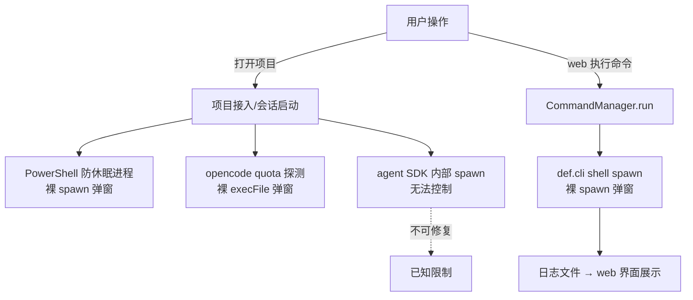
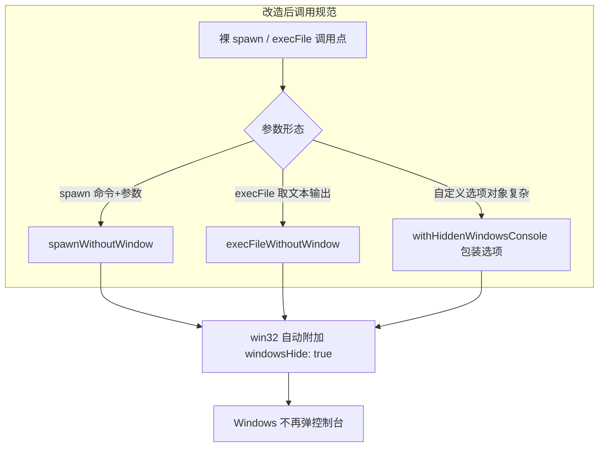
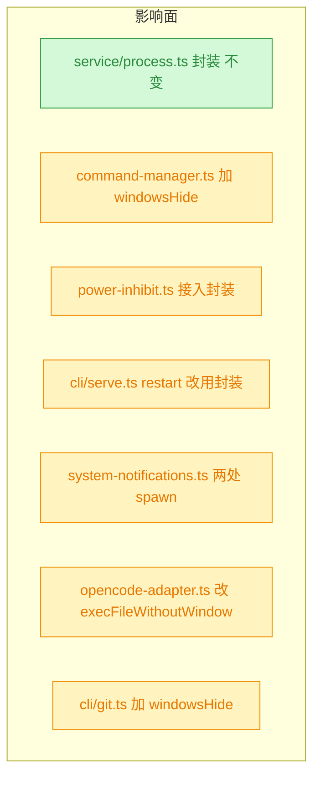

# Windows 下弹出空白 cmd 窗口

## 1. 背景

用户原始反馈：

> win 的体验问题，打开一个项目会弹出一个空白的 cmd，关闭也不影响，运行的命令虽然是在 web 中看到执行情况，但是也会弹出一个空白的 cmd，感觉是没有配置好 win 下的 silent。

即：在 Windows 上，YorZ 打开项目时、以及在 web 界面中执行命令时，都会额外弹出一个空白 cmd 控制台窗口。窗口虽然可以关闭且不影响功能，但体验较差，疑似子进程创建时未做静默（hide console）配置。

## 2. 需求

- Windows 平台下打开项目不应弹出空白 cmd 窗口。
- Windows 平台下通过 web/GUI 执行命令时不应弹出空白 cmd 窗口。
- 命令输出仍正常在 web 界面中展示，功能行为不变。

## 3. 现状分析

YorZ 是纯 Node.js CLI + Web GUI 架构（无 Electron/Tauri）：CLI 入口 `src/cli/index.ts`，服务端为 Hono（`src/service/index.ts`），GUI 为 SolidJS 单页应用跑在浏览器中。Windows 上的弹窗来自 Node 子进程创建时未隐藏控制台。

仓库已有一套跨平台控制台静默封装 `src/service/process.ts`（`withHiddenWindowsConsole` / `spawnWithoutWindow` / `execFileWithoutWindow`），部分调用点已接入，但仍有 7 处裸 `spawn`/`execFile` 漏接，形成弹窗缺口。

问题点与已修复点的精确清单：

spawn/execFile 调用点全量清单（路径:行号 + 现状）

**缺 windowsHide（本 spec 修复对象）**

| #   | 位置                                            | 调用                                                                        | 现有选项                                                                                   | 说明                                                                                                             |
| --- | ----------------------------------------------- | --------------------------------------------------------------------------- | ------------------------------------------------------------------------------------------ | ---------------------------------------------------------------------------------------------------------------- |
| A   | `src/service/command-manager.ts:253`            | `spawn(def.cli, {...})`                                                     | `shell: true, cwd, env, detached: process.platform !== 'win32', stdio: ['ignore', fd, fd]` | 「运行命令弹 cmd 窗」直接原因：`shell: true` 在 Windows 走 cmd.exe /c，且无 `windowsHide`                        |
| B   | `src/cli/serve.ts:274`                          | `spawn(process.execPath, [...], { detached: true, stdio: 'ignore' })`       | 无 windowsHide                                                                             | restart worker；同文件 203 行已用 `spawnWithoutWindow`，此处漏了                                                 |
| C   | `src/service/power-inhibit.ts:46`（92 行调用）  | `spawn(command, args, { stdio: 'ignore' })`                                 | 仅 stdio                                                                                   | win32 时命令为 `powershell.exe`（136-147 行），会话运行时触发 → 弹可见 PowerShell 窗口，「打开项目弹窗」高嫌疑点 |
| D   | `src/service/system-notifications.ts:246`       | `spawn(restart.cmd, restart.args, { detached: true, stdio: 'ignore' })`     | 无 windowsHide                                                                             | win32 时 cmd 为 `yorz.cmd`（`resolveRestartCommand`，213 行）；spawn `.cmd` 无 shell 时新版 Node 会 EINVAL       |
| E   | `src/service/system-notifications.ts:256`       | `spawn(cmd, args, { stdio: 'ignore' })`                                     | 仅 stdio                                                                                   | 全局更新安装（npm/pnpm/yarn/bun，Windows 上均为 .cmd shim）                                                      |
| F   | `src/service/agent-sdk/opencode-adapter.ts:318` | `execFileP(command.cmd, command.args, { cwd, timeout: 10_000, maxBuffer })` | 无 windowsHide                                                                             | `opencode-quota` 在 Windows 可能是 .cmd shim                                                                     |
| G   | `src/cli/git.ts:16`                             | `spawn('git', ['init'], { cwd, stdio: 'inherit' })`                         | 无 windowsHide                                                                             | `yorz add` 接入时自动 git init                                                                                   |

**已正确处理（不动）**：`src/service/process.ts`（封装本体）、`src/cli/serve.ts:203`、`src/service/index.ts:198`、`src/service/git.ts:101,136`、`src/service/session-end-notifier.ts:35-38`、`src/service/command-manager.ts:661,674`（taskkill 已带 windowsHide）。

补充说明：「打开项目」本身（`POST /projects` → `registry.add()`）是纯文件系统操作、不 spawn；打开项目后启动 agent 会话触发的防休眠 PowerShell 进程（点 C）与 opencode quota 探测（点 F）才是弹窗来源。另注：`nr` 只是开发者本机工具，仓库内不存在其解析逻辑；GUI「命令」的 `def.cli` 来自项目 `.yorz/config.json`，以 `shell: true` spawn。

## 4. 技术实现方案

核心思路：**所有仓库内裸 spawn/execFile 调用点统一收敛到 `src/service/process.ts` 的 `withHiddenWindowsConsole` 系列封装**，不在各处散写平台判断。非 Windows 平台行为完全不变（`withHiddenWindowsConsole` 在非 win32 原样返回选项）。

兼容性 / 影响范围（全部为 🟡 affected，无 breaking——仅新增 windowsHide 选项，不改变命令语义、stdio、detached 与 POSIX 行为）：

各修复点决策与精确改动：

1. **点 A（命令执行，主诉求）**：`command-manager.ts:253` 的 spawn 选项追加 `windowsHide: true`（直接用 `withHiddenWindowsConsole` 包裹选项）。**保留** `shell: true`（`def.cli` 是完整命令字符串需 shell 解析）、保留 win32 不 detached 的现有语义（注释已说明 taskkill /T 与日志 fd 依赖）。
2. **点 C（防休眠 PowerShell）**：`power-inhibit.ts` 默认 `spawnCommand` 的 spawn 调用经 `withHiddenWindowsConsole` 包装；保留类上可注入的 `spawnCommand` 测试点语义。
3. **点 B**：`cli/serve.ts:274` 改用同文件已 import 的 `spawnWithoutWindow`。
4. **点 D/E**：`system-notifications.ts` 两处 spawn 补 `windowsHide`（经封装）；246 行 win32 下 spawn `.cmd` 需 `shell: true`（新版 Node 对无 shell 的 .cmd spawn 直接 EINVAL），`.cmd` 交给 shell 解析后参数按现状拼装。
5. **点 F**：`opencode-adapter.ts:318` 改用 `execFileWithoutWindow`（该封装要求 `encoding: 'utf8'`，补上；原 `timeout`/`maxBuffer` 保留）。
6. **点 G**：`cli/git.ts:16` 追加 `windowsHide: true`（顺手收敛，从终端运行时本就继承控制台、无额外影响）。
7. **已知限制（不做，决策记录）**：`@anthropic-ai/claude-agent-sdk` / `@openai/codex-sdk` / `@opencode-ai/sdk` 内部自行 spawn CLI，不暴露 `windowsHide`，仓库无法修复；若 SDK 自身在 Windows 弹窗，属上游问题，不在本 spec 范围。

**验证方式**：仓库现有 vitest 测试全量通过（重点跑 `process.ts`、`command-manager`、`power-inhibit`、`system-notifications`、`opencode-adapter` 相关用例）；`tsc --noEmit` 通过。Windows 实机弹窗验证依赖用户环境，若仓库 CI 无 Windows runner，则以代码审查 + 测试为准并在执行记录注明。

## 5. 待确认项

_暂无_

## 6. 任务清单

- [x] src/service/command-manager.ts:253 spawn 选项经 withHiddenWindowsConsole 包裹（验收：选项含 windowsHide 逻辑，保留 shell/detached/stdio 语义，command-manager 相关测试通过）
- [x] src/service/power-inhibit.ts 默认 spawnCommand 的 spawn 经 withHiddenWindowsConsole 包裹（验收：注入测试点仍收到原始选项，power-inhibit 测试通过）
- [x] src/cli/serve.ts:274 restart worker 改用 spawnWithoutWindow（验收：文件内无裸 spawn 遗留）
- [x] src/service/system-notifications.ts defaultRunRestart 与 runProcess 两处 spawn 经 spawnWithoutWindow 包裹，win32 下 defaultRunRestart 补 shell: true 以解析 yorz.cmd（验收：system-notifications 测试通过）
- [x] src/service/agent-sdk/opencode-adapter.ts:318 改用 execFileWithoutWindow 并补 encoding: 'utf8'，清理不再使用的 execFileP（验收：opencode-adapter 测试通过）
- [x] src/cli/git.ts:16 git init spawn 选项经 withHiddenWindowsConsole 包裹（验收：tsc --noEmit 通过）
- [x] 运行 tsc --noEmit 与 vitest 全量验证（验收：零失败）

## 7. 执行记录

- 2026-09-02 10:55:26 新建 spec，进入 plan 阶段。
- 2026-09-02 10:55:26 plan 阶段完成：完成现状分析（7 处裸 spawn 缺口定位）、技术方案（收敛到 process.ts 封装）、图形化补充与待确认项自检（全部决策可自行查证，无待确认条目）。
- 2026-09-02 11:14:00 command-manager.ts:253 改为 `spawn(def.cli, withHiddenWindowsConsole<SpawnOptions>({...}))`；显式泛型保留 stdio 上下文推断（裸泛型会拓宽 stdio 元组导致 spawn 重载解析失败，tsc 首轮报错后修正）。shell/detached/stdio 语义未变。
- 2026-09-02 11:14:00 power-inhibit.ts 默认 spawnCommand 经 `withHiddenWindowsConsole(options, this.platform)` 包裹；注入的 spawnCommand 测试点仍收到原始选项，测试全通过。
- 2026-09-02 11:14:00 cli/serve.ts:274 restart worker 改用 spawnWithoutWindow（import 已存在）。
- 2026-09-02 11:14:00 system-notifications.ts：defaultRunRestart 与 runProcess 改用 spawnWithoutWindow；win32 下 defaultRunRestart 补 `shell: true`（yorz.cmd 为 .cmd shim，无 shell 的 spawn 在新版 Node 会 EINVAL），已加注释说明。
- 2026-09-02 11:14:00 opencode-adapter.ts:318 改用 execFileWithoutWindow（补 `encoding: 'utf8'`），移除不再使用的 execFile/execFileP import。
- 2026-09-02 11:14:00 cli/git.ts:16 经 `withHiddenWindowsConsole<SpawnOptions>` 包裹。
- 2026-09-02 11:14:00 验证：`tsc -b` 通过；`vitest run` 72 个文件 660 通过 / 2 跳过 / 0 失败；grep 复核 src 下无遗漏的裸 spawn/execFile。环境说明：本机为 Linux，Windows 实机弹窗效果待用户在 Windows 上复验；pnpm install 时 esbuild postinstall 失败，以 `--ignore-scripts` + chmod 修复二进制执行权限后测试正常，与本次改动无关。
- 2026-09-02 11:14:00 收尾：任务清单全部完成，待确认项为 _暂无_，无批注，标记 done。
