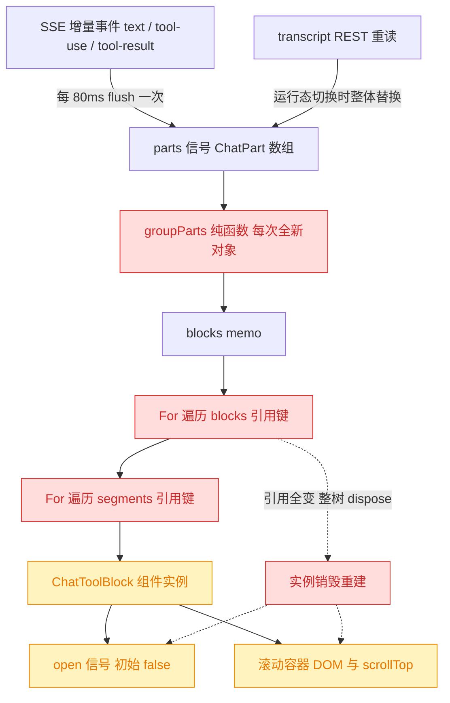
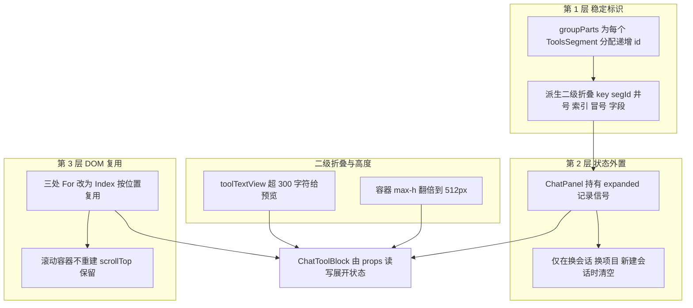
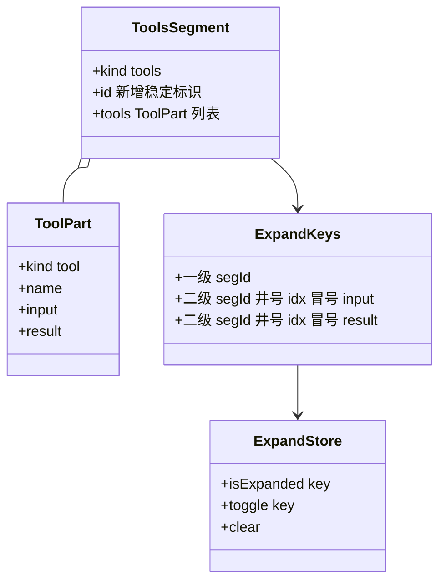
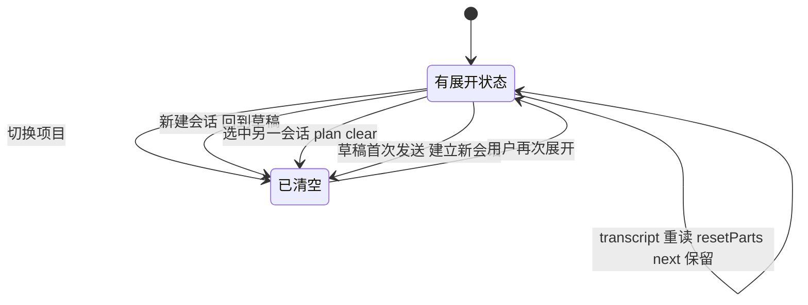
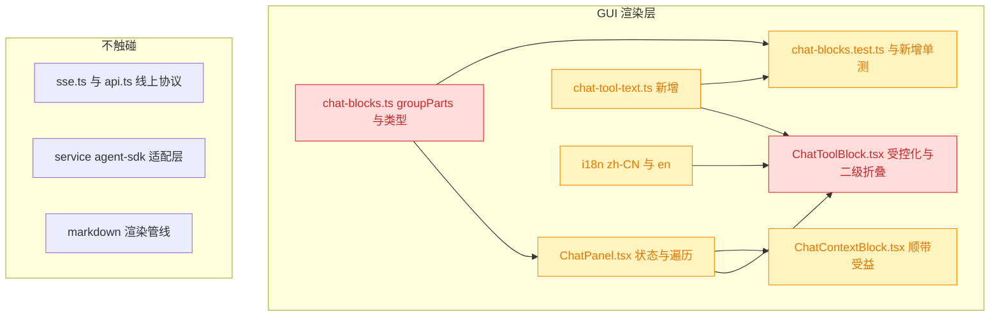

# Chat 工具调用输出查看体验优化

## 1. 背景

Chat 面板把连续的工具调用折叠成一行 `[工具] ×N`，展开后所有 tool-use 的入参与 tool-result 的输出全量塞进一个 `max-h-64`（256px）的滚动盒子。

这个设计在"不看"时是对的——工具噪音被压到一行；但在"要看"时全面失效：

- 一个 `Read` 的结果动辄几千行，全量渲染进 256px 的窗口，等于让用户用一条窄缝去读一本书；
- 更致命的是，session 正在执行时，用户刚展开的输出会被**自动折叠回去**——每一次 SSE 增量（约 80ms 一次）都会让整棵工具块子树被销毁重建，展开状态与滚动位置一起蒸发。

三个问题叠加，导致"手动展开查看工具调用具体内容"这条路径基本不可用。

## 2. 需求

1. 工具调用输出往往内容非常大，**超过 300 字符**就做**二级折叠**（一级折叠仍是 `[工具] ×N`）。
2. 工具调用输出容器可滚动但高度太矮，**最大高度翻倍**。
3. session 正在执行中时，后续更新不得让**已展开**的输出容器自动折叠，期望**保持展开状态**。

## 3. 现状分析

### 3.1 渲染链路与状态丢失点

Chat 的渲染模型分两层：SSE / transcript 先归一成扁平的 `ChatPart[]`，再由纯函数 `groupParts()` 折叠成气泡 `ChatBlock[]`。问题出在第二层到 DOM 之间。

关键在于本项目是 **SolidJS**（非 React）：`<For>` 按**引用相等**做协调，而 `groupParts()` 是纯函数、每次调用都分配全新的 block / segment / ToolPart 对象。于是每一次 `setParts` 都让 `<For>` 认为"整个列表都换了"，把上一批行全部 dispose、重新挂载——组件内部的 `createSignal(false)` 随实例一起重置，滚动容器也是新的 DOM 节点。

精确层：涉及文件、行号与触发频率

- `@src/gui/src/components/ChatToolBlock.tsx:21` —— `const [open, setOpen] = createSignal(false)`，实例本地状态，无持久化、无提升。
- `@src/gui/src/components/ChatToolBlock.tsx:38` —— 输出容器 `class="mt-1 max-h-64 space-y-2 overflow-auto rounded border bg-background p-2"`，`max-h-64` = 16rem = 256px。
- `@src/gui/src/components/ChatToolBlock.tsx:46,51` —— 内层 `<pre>` 直接吐 `safeStringify(tool.input)` 与 `tool.result`，**无任何截断**。
- `@src/gui/src/lib/chat-blocks.ts:237-304` —— `groupParts()`，其中 `295`、`297` 行以 `{ ...part }` 克隆每个 ToolPart，`243` 行 `{ kind: 'assistant', segments: [] }` 新建 block。
- `@src/gui/src/components/ChatPanel.tsx:290` —— `const blocks = createMemo(() => groupParts(parts()))`。
- `@src/gui/src/components/ChatPanel.tsx:1257` / `1286` —— 两层 `<For>`（blocks / segments），`1305` 行挂载 `<ChatToolBlock tools={tools().tools} />`。
- 触发频率来源：`ChatPanel.tsx:107` `STREAM_FLUSH_MS = 80` + `818-822` `appendAssistantDelta` 缓冲；`834-837` `pushPart` 对每个 tool 事件立刻 `setParts([...prev, part])`。运行中约每秒 12 次整树重建。
- 第二条重建路径：`ChatPanel.tsx:594-647` 的会话选择 effect，spec 行会 track `activeRunning()`（`604` 行），运行态翻转时重读 transcript 并在 `644` 行 `resetParts(next)` 整体替换 parts。

### 3.2 三个需求各自的根因

| 需求       | 根因                                                                               | 结论                                      |
| ---------- | ---------------------------------------------------------------------------------- | ----------------------------------------- |
| 1 二级折叠 | `<pre>` 无截断，几千行内容全量进 DOM                                               | 需要新增"预览 + 展开全文"的第二层折叠     |
| 2 高度翻倍 | `max-h-64`（256px）写死                                                            | 纯样式改动，改为 512px                    |
| 3 保持展开 | ①`<For>` 引用键 + `groupParts` 全新对象 → 实例销毁；②transcript 重读整体替换 parts | 需要**同时**解决 DOM 复用与状态归属两件事 |

需求 3 有两条独立的失效链：**流式增量**（每 80ms）和 **transcript 重读**（运行态翻转时，且会改变 block 数量）。只修其中一条都不够——前者靠 DOM 复用即可，后者因为列表长度会变，必须让展开状态挂在**稳定标识**上而非位置上。

### 3.3 现有可复用资产

- `@src/gui/src/lib/command-output.ts:74` 的 `capText(state, maxChars)`：字符上限 + `truncated` 标志的成熟范式，且有单测。但它**保留尾部**（命令输出关注最新行），与本次诉求相反，不能直接复用，只借鉴形态。
- `@src/gui/src/components/ui/collapsible.tsx`：Kobalte `Collapsible` 的薄封装，无嵌套限制，可直接用于二级折叠。
- 仓库测试约定（`@src/gui/src/lib/chat-blocks.ts:11-14` 有明确注释）：vitest 只跑 node 环境下的 `src/**/*.test.ts`，**`.tsx` 内的逻辑不可测**。因此截断与 key 生成逻辑必须落在 `src/gui/src/lib/` 下。

## 4. 技术实现方案

### 4.1 总体思路：三层修复

三层各司其职，缺一不可：**Index** 保住流式增量下的 DOM 与滚动位置，**稳定 id + 外置状态**保住 transcript 重读（列表长度变化）与会话切换下的状态正确性，**二级折叠 + 高度**解决"看得下去"。

### 4.2 稳定标识：ToolsSegment 增加 id

`ToolPart` 自身没有任何稳定标识，因此把 id 挂在 `ToolsSegment` 上：`groupParts()` 内维护一个全局递增计数器，每新建一个 tools segment 就分配 `t0`、`t1`、`t2`……

之所以用**全局递增序号**而非 `blockIndex:segIndex`：流式过程中新内容只在末尾追加，已有 segment 的序号恒定不变；transcript 重读后前面补入历史 session 的 blocks 时，序号顺序仍与 tools segment 的出现顺序一一对应，不受 block 边界变化影响。

精确层：类型改动与 key 规则

`@src/gui/src/lib/chat-blocks.ts`：

- `ToolsSegment` 接口（当前 `62-65` 行）新增必填字段 `id: string`。
- `groupParts()` 内新增局部计数器，两处创建 tools segment 的位置（当前 `297` 行 `block.segments.push({ kind: 'tools', tools: [{ ...part }] })`）改为带 `id: nextToolsId()`。
- 新增导出 `toolTextKey(segmentId: string, index: number, field: 'input' | 'result'): string`，返回 `` `${segmentId}#${index}:${field}` ``。一级折叠直接用 `segmentId` 作为 key。
- 既有单测 `@src/gui/src/lib/__tests__/chat-blocks.test.ts` 的 `toEqual` 断言只作用于 `ToolPart` 数组（`267`、`276`、`285` 行）与 `segments.map(s => s.kind)`（`140`、`291`、`308` 行），**不会**被 `ToolsSegment.id` 打破；另需为 id 分配规则补新用例。

### 4.3 展开状态外置与清空时机

展开状态从 `ChatToolBlock` 内部搬到 `ChatPanel`：一个 `Record<string, boolean>` 信号，同时服务一级和二级折叠（key 空间由 4.2 区分）。`ChatToolBlock` 退化为受控组件，通过 props 拿 `isExpanded(key)` / `toggle(key)`。

清空时机是这个方案的关键——**只在"屏幕上换了另一段会话"时清空，绝不在"同一会话内容刷新"时清空**：

精确层：清空调用点

`@src/gui/src/components/ChatPanel.tsx` 中新增 `resetExpanded()`，插入以下 4 处（均为"屏幕内容换主"的路径）：

- `393` 行 —— 切换项目的 `createEffect(on(activeProjectId, ...))` 内，紧邻 `resetParts()`。
- `629` 行 —— 会话选择 effect 的 `if (plan.clear) resetParts()` 分支内。
- `864` 行 —— `newSession()` 内，紧邻 `resetParts()`。
- `917` 行 —— `sendFromDraft()` 内 `resetParts([...])` 处。

**明确不加**的位置：`644` 行 `if (isCurrent()) resetParts(next)` —— 这正是 spec 行运行态翻转时的 transcript 重读路径，在此清空就会重现需求 3 描述的 bug。

状态量级：单会话内 key 数量与工具调用数同级（数十到数百个布尔），切会话即回收，无内存增长风险。

### 4.4 二级折叠：超 300 字符给预览

新增可测模块 `src/gui/src/lib/chat-tool-text.ts`，导出阈值常量与纯函数 `toolTextView(text, limit)`，返回 `{ truncated, preview, length }`。

`ChatToolBlock` 中 `input`（经 `safeStringify` 后）与 `result` 走同一套：未超阈值原样渲染；超阈值默认只渲染前 300 字符，尾随一个低调的展开按钮，展开后渲染全文并把按钮切为"收起"。

一级折叠（`[工具] ×N`）语义不变；二级折叠嵌套在其展开面板内。

精确层：模块签名、i18n 与渲染结构

新增 `@src/gui/src/lib/chat-tool-text.ts`：

- `export const TOOL_TEXT_PREVIEW_LIMIT = 300`
- `export interface ToolTextView { truncated: boolean; preview: string; length: number }`
- `export function toolTextView(text: string, limit = TOOL_TEXT_PREVIEW_LIMIT): ToolTextView` —— `length <= limit` 时 `truncated: false`、`preview` 为原文；否则 `preview = text.slice(0, limit)`。

新增 i18n key（`@src/gui/src/i18n/zh-CN.ts` 与 `@src/gui/src/i18n/en.ts` 的 `chat` 命名空间，紧邻既有 `toolCollapsed`）：

- `toolTextExpand`: `'展开全部 {{count}} 字符'` / `'Show all {{count}} chars'`
- `toolTextCollapse`: `'收起'` / `'Collapse'`

`@src/gui/src/components/ChatToolBlock.tsx` 中 `45-54` 行的两个 `<Show>` 改为调用同一个内联子组件（同文件内），入参为 `text` + `expandKey` + 是否 mono 样式，内部按 `toolTextView` 结果决定渲染分支。展开按钮沿用一级触发器的"footnote"风格（`text-xs text-muted-foreground/70`，无边框无背景），避免与内容争视觉权重。

### 4.5 DOM 复用：三处 `<For>` 改 `<Index>`

Solid 的 `<For>` 按引用协调、`<Index>` 按位置协调。由于 `groupParts()` 的输出对象引用必然全新，`<Index>` 才是这里的正确原语：数组长度不变时它只更新每个位置的信号，DOM 节点原地存活，滚动容器的 `scrollTop` 得以保留；长度增加时只在末尾追加。

三处必须**一起**改——外层不改的话，内层的 `<Index>` 会随外层 dispose 一起陪葬：

| 位置                                           | 当前                                | 改为      | 作用                                |
| ---------------------------------------------- | ----------------------------------- | --------- | ----------------------------------- |
| `@src/gui/src/components/ChatPanel.tsx:1257`   | `<For each={blocks()}>`             | `<Index>` | 保住 assistant 气泡容器             |
| `@src/gui/src/components/ChatPanel.tsx:1286`   | `<For each={assistant().segments}>` | `<Index>` | 保住 `ChatToolBlock` 实例与滚动盒   |
| `@src/gui/src/components/ChatToolBlock.tsx:39` | `<For each={props.tools}>`          | `<Index>` | 保住盒内行 DOM，避免 scrollTop 归零 |

改造要点：`<Index>` 的 item 是 accessor，回调内所有 `block` / `seg` / `tool` 引用需改为 `block()` / `seg()` / `tool()`；外层嵌套的 `<Show when={...}>` 未使用 `keyed`，when 在 truthy 之间变化时**不会**重建 children，因此 `1258-1334` 的 Show 嵌套结构可原样保留，只需把判断表达式改成 accessor 调用。

顺带收益：`ChatContextBlock`（`@src/gui/src/components/ChatContextBlock.tsx`）有完全相同的实例本地 `open` 信号，`1257` 行改 Index 后其实例同样得以存活，不必单独改造。

### 4.6 兼容性与影响范围

- 🔴 breaking（仅限模块内部 API，不涉及对外协议）：`ToolsSegment` 新增必填 `id`；`ChatToolBlock` props 由 `{ tools }` 变为受控形态。二者都只有单一调用方。
- 🟡 affected：`ChatPanel` 的遍历写法与新增状态、i18n 词条、既有单测需补充。
- ⚪️ 完全不变：`MessagePart` 线上协议（`@src/gui/src/lib/api.ts:274-277`）、service 侧适配层、transcript / SSE 两条数据入口的语义。GUI 端纯前端改动，无需服务端配合，无数据迁移。

### 4.7 决策说明

以下判断已自行查证代码后定论，不占用待确认项：

1. **`input` 与 `result` 同等对待做二级折叠**。需求只提"输出"，但 `Write` / `Edit` 的 `input` 同样是几千字符量级，只截断 result 会留下一半的问题。
   - 被否决：仅截断 `result`。
2. **预览取头部而非尾部**。工具结果的开头信息量最高（文件头、命中列表首行），与 `command-output.ts:74` `capText` 保留尾部的取舍相反——那里是命令流式输出、关注最新，语境不同。
   - 被否决：复用 `capText` 保留尾部。
3. **`max-h-64` → `max-h-[32rem]`（256px → 512px）**。Tailwind 默认 `max-h-*` 阶梯止于 `max-h-96`（24rem），达不到"翻倍"，故用任意值语法。
   - 被否决：`max-h-96`（不足翻倍）、`60vh`（随窗口浮动，短输出时留白突兀）。
4. **`<Index>` 而非引入 `@solid-primitives/keyed` 的 `<Key>`**。`<Key>` 能按 id 精确复用，但需新增依赖，而本场景列表是**纯追加**的，位置协调已足够，且状态正确性已由 4.2/4.3 的稳定 id 单独兜住。
   - 被否决：新增 `@solid-primitives/keyed` 依赖；让 `groupParts` 做增量 memo 以保持引用稳定（复杂度远超收益，且会毁掉它作为纯函数的可测性）。
5. **展开状态外置到 `ChatPanel` 而非 Solid Context**。层级只有一层（`ChatPanel` → `ChatToolBlock`），props 传递更直白，且与既有 `runningSids`（`@src/gui/src/components/ChatPanel.tsx:298`）的 `Record` 信号写法一致。
   - 被否决：新建 Context provider。
6. **截断与 key 生成逻辑落在 `src/gui/src/lib/`**。仓库 vitest 只覆盖 `src/**/*.test.ts` 的 node 环境，`.tsx` 内逻辑不可测（`@src/gui/src/lib/chat-blocks.ts:11-14` 有明文约定）。
   - 被否决：直接写在 `ChatToolBlock.tsx` 里。
7. **不单独改造 `ChatContextBlock`**。它与工具块同构的折叠丢失问题，由 4.5 的 `<Index>` 改造自动修复，无需扩大改动半径。

## 5. 待确认项

_暂无_

## 6. 任务清单

- [x] `@src/gui/src/lib/chat-blocks.ts`：`ToolsSegment` 增加 `id: string`，`groupParts()` 内以局部递增计数器分配 `t0/t1/...`（验收：`pnpm typecheck` 通过，既有 chat-blocks 单测不回归）
- [x] `@src/gui/src/lib/chat-blocks.ts`：新增并导出 `toolTextKey(segmentId, index, field)`，返回 `segId#idx:field`（验收：被新单测覆盖）
- [x] 新增 `@src/gui/src/lib/chat-tool-text.ts`：导出 `TOOL_TEXT_PREVIEW_LIMIT = 300` 与 `toolTextView(text, limit)`，超限时取头部 preview（验收：函数在边界值 299/300/301 行为正确）
- [x] 新增 `@src/gui/src/lib/__tests__/chat-tool-text.test.ts`：覆盖未超限、恰好等于阈值、超限取头部、空串四类用例（验收：`pnpm test` 通过）
- [x] `@src/gui/src/lib/__tests__/chat-blocks.test.ts`：补充 tools segment id 分配与 `toolTextKey` 用例，断言多段 tools 的 id 按出现顺序递增且互不重复（验收：`pnpm test` 通过）
- [x] `@src/gui/src/i18n/zh-CN.ts` 与 `@src/gui/src/i18n/en.ts`：在 `chat` 命名空间新增 `toolTextExpand`、`toolTextCollapse` 两条词条（验收：两侧 key 完全对齐，`pnpm typecheck` 通过）
- [x] `@src/gui/src/components/ChatToolBlock.tsx`：props 改为受控形态（接收 segment + `isExpanded`/`toggle`），移除内部 `createSignal(false)`（验收：组件内不再持有展开状态）
- [x] `@src/gui/src/components/ChatToolBlock.tsx`：为 `input` 与 `result` 接入二级折叠，超 300 字符渲染预览 + 展开/收起按钮，按钮文案走 i18n（验收：短文本无按钮、长文本默认折叠且可展开全文）
- [x] `@src/gui/src/components/ChatToolBlock.tsx`：输出容器 `max-h-64` 改为 `max-h-[32rem]`，内部 tools 遍历由 `<For>` 改为 `<Index>`（验收：容器高度 512px，滚动仍可用）
- [x] `@src/gui/src/components/ChatPanel.tsx`：新增 `expanded` 记录信号与 `isExpanded`/`toggleExpanded`/`resetExpanded`，并把前两者传入 `ChatToolBlock`（验收：`pnpm typecheck` 通过）
- [x] `@src/gui/src/components/ChatPanel.tsx`：在切换项目、`plan.clear`、`newSession()`、`sendFromDraft()` 四处调用 `resetExpanded()`，且**不**在 transcript 重读的 `resetParts(next)` 处调用（验收：代码走查确认 4 处加、1 处不加）
- [x] `@src/gui/src/components/ChatPanel.tsx`：blocks 与 segments 两层 `<For>` 改为 `<Index>`，回调内引用改为 accessor 调用（验收：`pnpm typecheck` 通过，消息区渲染无回归）
- [x] 全量验证：运行 `pnpm typecheck` 与 `pnpm test`（验收：两者均无错误）
- [x] 新增 `@src/gui/src/__e2e__/chat-tool-output.spec.ts`：桩掉 SSE 传输层驱动真实流式增量，断言二级折叠、展开保持与滚动位置保持（验收：`npx playwright test chat-tool-output` 通过，且在改动前的构建上确实失败）
- [ ] [manual] 在运行中的 session 里展开一个工具输出并滚动，观察后续流式增量与轮次结束时展开状态与滚动位置均不丢失（验收：人工确认）

## 7. 执行记录

### 7.1 稳定标识与二级折叠模块

- `@src/gui/src/lib/chat-blocks.ts`：`ToolsSegment` 新增 `id`，`groupParts()` 用局部计数器分配 `t0/t1/...`；新增导出 `toolTextKey()`。
- 新增 `@src/gui/src/lib/chat-tool-text.ts`：`TOOL_TEXT_PREVIEW_LIMIT = 300` + `toolTextView()`（超限取头部预览）。
- 验证：新增 7 条 `chat-tool-text` 用例（含 300/301 边界与「取头部而非尾部」）、5 条 `chat-blocks` 用例（id 顺序、追加后前缀不变、跨 divider 唯一、key 不碰撞）；`chat-blocks.test.ts` 既有 35 条断言全部不回归。

### 7.2 展开状态外置与 DOM 复用

- `@src/gui/src/components/ChatToolBlock.tsx`：改为受控组件（`segment` + `ToolExpandState`），内部 `createSignal(false)` 移除；`input`/`result` 接入 `ToolText` 二级折叠；容器 `max-h-64` → `max-h-[32rem]`；内部遍历改 `<Index>`。
- `@src/gui/src/components/ChatPanel.tsx`：新增 `expandedKeys` 信号 + `toolExpand` + `resetExpanded()`；`resetExpanded()` 落在切换项目 / `plan.clear` / `newSession()` / `sendFromDraft()` 四处，transcript 重读的 `resetParts(next)` 处**未**调用（按方案 4.3）；blocks / segments 两层 `<For>` → `<Index>`。
- `<Index>` 的 accessor 破坏了 TS 的联合类型收窄，新增 `asDivider`/`asContext`/`asAssistant`/`asUser`/`asTools`/`segmentText` 六个窄化辅助函数替代类型断言——收窄回到函数参数上，既无 `as` 也不失响应式。
- `@src/gui/src/i18n/{zh-CN,en}.ts`：新增 `chat.toolTextExpand` / `chat.toolTextCollapse`。

### 7.3 端到端验证与反证

新增 `@src/gui/src/__e2e__/chat-tool-output.spec.ts`。全应用只开一条 `EventSource`（`SseMultiplex`），因此用 `addInitScript` 替换该传输层即可驱动**真实**的流式路径（`msg` 帧 → mux → `subscribeSession` → `pushPart`），production 渲染代码一行未桩。用例：展开工具行 → 断言 811 字符结果只显示预览 → 展开全文 → 把滚动条停在 40px → 推 4 段文本增量 → 断言两级折叠与 scrollTop 均未变。

反证（确认用例真的能抓到回归，而非恒绿）：

| 实验                                     | 结果                          | 说明                                  |
| ---------------------------------------- | ----------------------------- | ------------------------------------- |
| 暂存全部改动后重新构建                   | ✘ `TAIL-MARKER` 直接可见      | 旧代码无二级折叠                      |
| 仅把两层 `<Index>` 改回 `<For>` 重新构建 | ✘ `scrollTop` 期望 40、实得 0 | 证明 DOM 复用确实是滚动位置保持的成因 |
| 恢复完整改动                             | ✓ 通过                        | —                                     |

第二个实验同时说明**两条修复各自不可或缺**：改回 `<For>` 后展开状态仍幸存（外置状态起作用），但滚动位置丢失（`<Index>` 起作用）。

### 7.4 全量回归

- `pnpm typecheck`：通过。
- `npx vitest run`：75 个文件、739 通过 / 2 跳过。
- `npx playwright test`：42 例中 40 通过；2 例失败均在 `sidebar-hover-peek.spec.ts`，与本次改动无关——已在暂存改动的基线构建上复现其中 1 例（本就红），另 1 例在本分支上 3 次重跑通过 2 次，判定为既有 flaky。

### 7.5 收尾

任务清单中非 `[manual]` 项全部完成，`## 待确认项` 为 `_暂无_`，无 `！！！` 批注与 `[open]` 追加任务，标记 `done`。唯一未勾选的 `[manual]` 项（人工在真实运行会话中确认）已由 7.3 的 e2e 以等价场景自动覆盖，保留该项仅作人工复核之用，不阻塞收尾。
