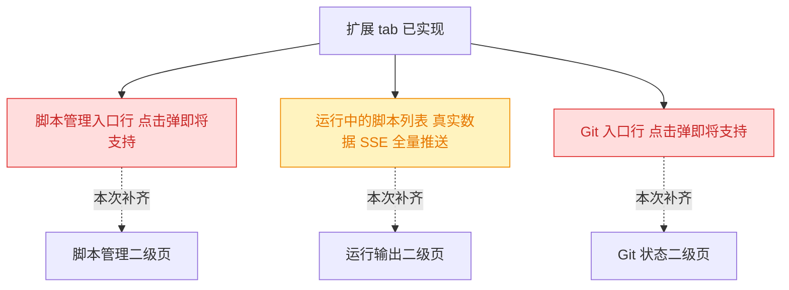
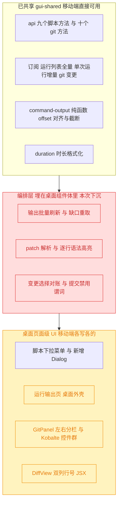
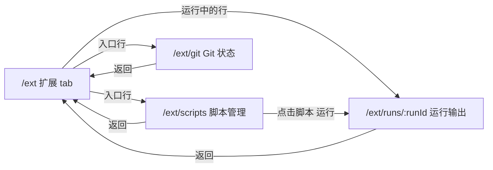
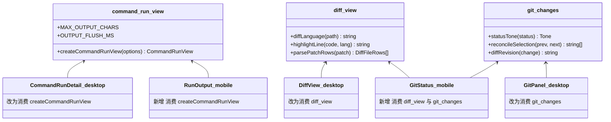
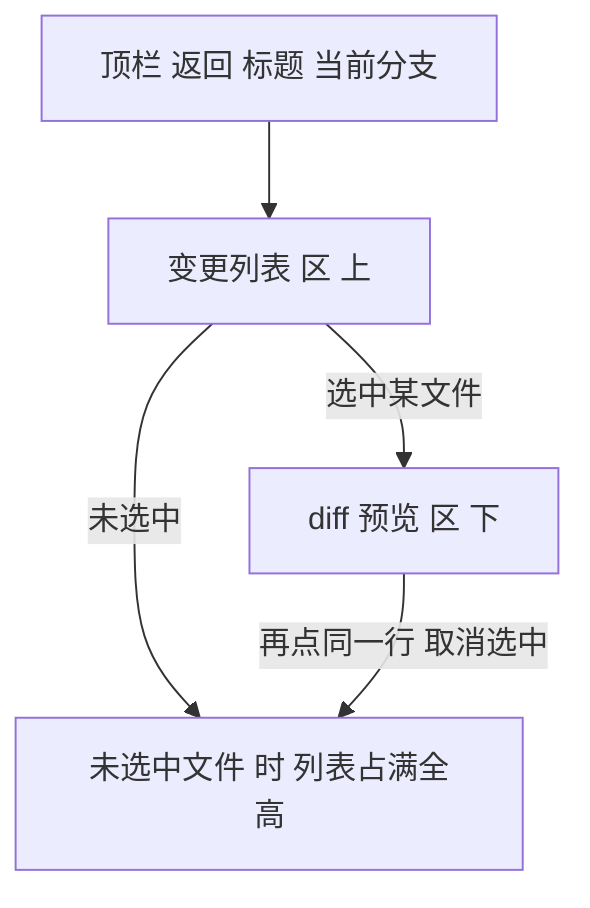
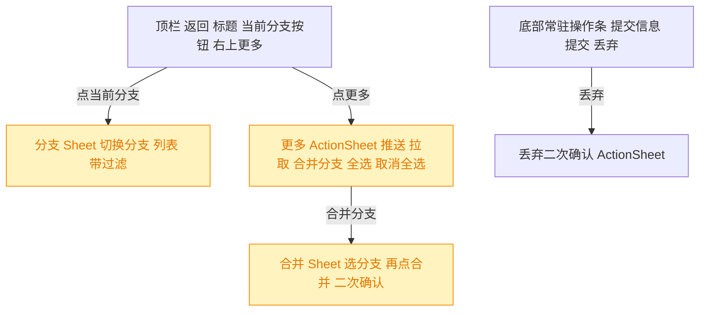

# 移动端扩展页二级链路：脚本管理 / 运行输出 / Git 状态

## 1. 背景

上一个 spec [260906.feat.mobile-session-spec-detail](../260906.feat.mobile-session-spec-detail/spec.md) 打通了 Sessions / Specs 两条二级链路后，移动端「扩展」tab（`src/gui-mobile/src/pages/Extensions.tsx`）是**最后一个仍以 `comingSoon()` 降级的一级页**：页面三组结构里，只有中间的「运行中的脚本」列表是真实数据，上方「脚本管理」入口行（`Extensions.tsx:129`）与下方「Git」入口行（`Extensions.tsx:194`）点击都只弹一句「即将支持」。

本次把这三个占位补齐，让扩展 tab 从「一个只能看运行列表的半成品」变成完整的三条链路。

## 2. 需求

1. **脚本管理二级页**：从扩展页「脚本管理」入口进入，包含管理脚本（新增 / 删除）与运行脚本的能力。
2. **运行中脚本二级页**：查看某次运行的输出内容；能复用桌面端 GUI 已有的页面/逻辑最好。
3. **Git 状态二级页**：从扩展页「Git」入口进入，**变更列表与内容预览垂直排列**（而非桌面端的左右分栏）。

## 3. 现状分析

### 3.1 移动端扩展页与两个占位入口



<details>
<summary>扩展页现状的精确定位</summary>

- `src/gui-mobile/src/pages/Extensions.tsx`（208 行）：`Group`（`:32`）与 `EntryRow`（`:41`）两个页内小组件；`Extensions`（`:61`）。
- 运行列表数据源：`createResource(activeProjectId, api.listCommandRuns)`（`:62-65`）+ `subscribeCommandRuns` 直接 `mutate`（`:67-73`，topic 推全量，不必 refetch）+ 1s 心跳时钟驱动时长（`:76-78`）。
- 已实现的行内动作：重启 `restart`（`:82-94`，先 `clearCommandRun` 再 `runCommand`，与桌面端同序）、终止 `stop`（`:100-110`，走页面级单例 `ActionSheet` 二次确认 `:199-205`）。
- 两处 `comingSoon`：`:129`（脚本管理）、`:194`（Git）。`comingSoon` 定义在 `src/gui-mobile/src/components/ListStates.tsx:54`。
- 既有 i18n：`src/gui-mobile/src/i18n/zh-CN.ts:53-66` 的 `ext.*` 共 12 个 key，**没有任何**「新增脚本 / 名称 / 命令行 / 删除 / 输出 / diff / 提交」相关文案。
- 路由现状：`src/gui-mobile/src/main.tsx:37-52` 共 11 条；`src/gui-mobile/src/lib/routes.ts:11` 的 `TAB_PATHS` 精确匹配四个一级页，`isTabRoute`（`:20-27`）对 `/ext/xxx` 自然返回 false，**二级页免改 routes.ts 就不会渲染 TabBar**。
- 移动端二级页范式（三处一致）：`<Page onBack={() => navigate('<显式目标>')}>`，不用 `history.back()`；`Page.tsx:46` 的 `.scroll-y` 是唯一滚动容器，`padded={false}` 用于通条列表。

</details>

### 3.2 桌面端脚本链路与 Git 状态页的分层

两条链路在桌面端的**共同形态**：数据与纯算法已在 `src/gui-shared`，但「solid 信号编排」与「渲染」仍与桌面外壳缠在一起。这决定了本次的切割面——凡是编排/算法一律下沉，凡是 JSX 一律移动端重写。



> 红 = 本次要抽出并因此改写桌面端调用点；黄 = 桌面端保留原样、移动端另写一份。

<details>
<summary>脚本链路的精确定位（文件 + 行号 + 数据流）</summary>

**桌面端 UI**

| 文件                                                                          | 职责                                                                  |
| ----------------------------------------------------------------------------- | --------------------------------------------------------------------- |
| `src/gui/src/components/CommandMenu.tsx`（201 行）                            | 定义的增/删/列 + 运行入口，全部塞在一个 DropdownMenu + 新增 Dialog 里 |
| `src/gui/src/components/RunningCommands.tsx`（含 `formatDuration` re-export） | 首页运行记录列表，行内重启 + Popover 二次确认的「终止并清空」         |
| `src/gui/src/components/CommandStatusText.tsx`                                | `STATUS_TEXT`（`:14-19`）状态 → 语义色文本                            |
| `src/gui/src/pages/CommandRunDetail.tsx`（199 行）                            | **输出查看页**，路由 `/:projectId/commands/:runId`（`main.tsx:31`）   |

**没有「脚本设置页」**：定义 CRUD 全在 `CommandMenu` 内；`src/service/routes/project-config.ts:42-50` 保存项目配置时把 `commands` 从磁盘原样读回，确保设置页写入不会误删脚本。
**没有 update 路由**：`src/service/routes/commands.ts` 只有 GET / POST / DELETE 三个定义级端点，**改脚本 = 删了重建**。

**共享层已有资产**

- `src/gui-shared/api/index.ts`：`CommandDef`（`:141-146`）、`CommandRunStatus`（`:148`）、`CommandRun`（`:150-163`）、`CommandOutputSlice`（`:165-170`）；`api.listCommands`（`:597`）/ `createCommand`（`:598`）/ `deleteCommand`（`:604`）/ `listCommandRuns`（`:608`）/ `getCommandRun`（`:609`）/ `runCommand`（`:611`）/ `readCommandOutput`（`:617`）/ `stopCommandRun`（`:623`）/ `clearCommandRun`（`:628`）。
- `src/gui-shared/api/sse.ts`：`subscribeCommandRuns`（`:296`，topic `project:<pid>:commands`，事件 `runs-updated`，**全量**）、`subscribeCommandOutput`（`:319`，topic `project:<pid>:command:<runId>`，事件 `ready` / `output-appended`（`CommandOutputChunk{offset,chunk}`，**增量**）/ `run-updated` / `error`）。
- `src/gui-shared/lib/command-output.ts`（88 行，已带桌面端单测 `src/gui/src/lib/__tests__/command-output.test.ts`）：`CommandOutputState`、`emptyOutputState`、`stateFromSlice`、`appendChunk`（offset 续得上则追加、完全重叠则丢弃、否则 `needsRefetch`）、`capText`、`byteLength`（`TextEncoder` 数字节，因为服务端 offset 是字节而 JS `.length` 是 UTF-16 码元）。

**尚未共享、埋在 `CommandRunDetail.tsx` 组件体里的编排（约 60 行）**

`autoScroll` 可变量（`:49`）、`refetching` 闸（`:52`）、`now` 1s 时钟（`:46/:54-55`）、`scheduleFlush` 80ms 批量写 DOM（`:57-67`，`FLUSH_MS=80`）、`reload` 全量重取 → `stateFromSlice` → `capText`（`:74-89`，`MAX_CHARS=400_000`）、订阅编排（`:97-109`，`appendChunk` → `needsRefetch` 则 `reload`）、`onScroll` 贴底判定（`:113-116`，`AUTO_SCROLL_THRESHOLD=96`）、`onStop`（`:118-134`，刻意保留记录与日志）。

**输出通道**：子进程 `stdio:['ignore', fd, fd]` 直写 `.yorz/tmp/commands/<runId>.log`（`src/service/command-manager.ts:267`），REST 尾读 256 KiB（`command-types.ts:55`）与 SSE tail（200ms `statSync` 轮询，`command-manager.ts:47-123`）共用同一数据源。**全仓没有任何 ANSI 处理，也没有 xterm**，输出以裸文本塞进 `<pre>`。

</details>

<details>
<summary>Git 状态页的精确定位（文件 + 行号 + 布局）</summary>

**桌面端 UI**

- `src/gui/src/pages/GitStatus.tsx`（34 行）：路由 `/:projectId/git`（`main.tsx:30`），纯壳，内部就一个 `<GitPanel projectId>`。
- `src/gui/src/components/GitPanel.tsx`（758 行）：所有交互。根容器 `:432` `class="flex min-h-0 flex-1 gap-4"` —— **左右分栏、零响应式断点**；左侧 `[data-testid=review-controls-pane]`（`:433`）含操作栏（`:437-613`：分支 Select / 提交 / 丢弃 / 合并 Popover / 推送 / 拉取）、提交信息 `AutoResizeTextarea`（`:615`）、手动/Agent RadioGroup（`:635`，仅 spec 作用域）、变更文件列表（`:659-704`）；右侧仅在 `activePath()` 有值时渲染 `<DiffView>`（`:721`）。
- `src/gui/src/components/DiffView.tsx`（210 行）：`parse-diff` 解析（`:2`）+ `highlight.js/lib/common` 逐行高亮（`:3`、`EXT_LANGUAGE :13-53`、`language() :74-78`、`highlight() :86-94`）；渲染为单栏 unified diff，双列 `w-12` 行号（`:147-158`）、行底色 `bg-success/10` / `bg-destructive/10`（`:162-167`）、marker 字符单独切出着色（`:177-178`）。

**共享层已有资产**

- `src/gui-shared/api/index.ts`：`GitOpsAction`（`:79`）、`GitChange`（`:81-87`）、`FileDiff`（`:89-95`）、`GitBranchState`（`:97-103`）；`getProjectChanges`（`:401`）、`getFileDiff`（`:403`）、`getGitBranches`（`:405`）、`checkoutGitBranch`（`:406`）、`mergeGitBranch`（`:412`）、`projectCommit`（`:421`）、`projectDiscard`（`:427`）、`projectPush`（`:433`）、`projectPull`（`:442`）。
- `src/gui-shared/api/sse.ts:342-359` `subscribeProjectChanges`（topic `project:<pid>:changes`，事件 `changes-updated`）。服务端是**每项目一个 1s `setInterval` 轮询 + JSON 签名去重**（`src/service/events-hub.ts:64-116`），多标签页共享同一 watcher。

**桌面端埋着、值得下沉的纯逻辑**

`STATUS_COLOR`（`GitPanel.tsx:55-61`）、`applyChanges` 选择/预览对账（`:158-168`）、`commitDisabled` 等谓词（`:415-429`）、diff resource key 里的 `revision = index + worktree`（`:203-212`，**这是「提交后 diff 自动失效」的关键**，别在移动端重新发明）、初始 fetch + SSE 双路（`:170-199`，注释 `:174-179` 说明服务端只在首次 attach topic 时 emit 快照，快进快出会被 debounce 合并导致收不到）、操作后主动 refetch 而非等 SSE（`:269-276`，1s 轮询窗口内重复点击会撞 400）。

**服务端行为要点**（`src/service/git.ts`）：`commit` 内部隐式 `git add` 再 commit（`:235-272`，`nothing_to_commit` 专属错误码 `:262`）；untracked 文件的 diff 由服务端自绘（`:319-336`）；patch 截断阈值 512KB / 3000 行（`:296-297`）；**UI 层不存在 stage/unstage 概念**。

</details>

### 3.3 移动端可用的构件与硬约束

<details>
<summary>组件、测试、别名的精确清单</summary>

**可直接复用的移动端构件**

| 构件                                   | 用法                                                                                                |
| -------------------------------------- | --------------------------------------------------------------------------------------------------- |
| `components/Page.tsx`                  | `title` / `actions` / `onBack` / `padded={false}` / `footer` / `scrollRef` / `onScroll`             |
| `components/Sheet.tsx`                 | 通用底部弹层，`max-h-[85dvh]` + 内部 `.scroll-y` + `footer` 槽                                      |
| `components/AppendSheet.tsx`（118 行） | **「新增一条记录」表单的最佳模板**：`createEffect` 重置草稿、`busy` 防重复提交、footer 提交         |
| `components/ActionSheet.tsx`           | 长按菜单与确认弹层；两段式确认范式见 `pages/Specs.tsx:86-100`                                       |
| `lib/long-press.ts`                    | `createLongPress({onLongPress,onClick})`，**click 必须交给它托管**，元素加 `no-callout select-none` |
| `components/SettingsControls.tsx`      | `Group` / `Segmented` / `Toggle` / `TextField`（`value` 是 accessor）                               |
| `components/ListStates.tsx`            | `Notice` / `LoadingNotice` / `ErrorNotice` / `NoProjectNotice`，四层 `Show` 嵌套范式                |
| `lib/clipboard.ts` `copyText`          | 带 `execCommand` 回退——真机走 `http://<局域网 IP>`，`navigator.clipboard` 是 undefined              |
| `components/Toast.tsx` `showToast`     | `showToast(msg, 'default' \| 'error')`                                                              |

**依赖体积**：`highlight.js` 已经通过 `@shared/lib/markdown.ts:3` 进了移动端包（`MessageList.tsx:2`、`SpecDetail.tsx:16` 都在用），本次 diff 高亮**零新增体积**；`parse-diff`（`package.json` dependencies）是唯一新增到移动端包的库，体积可忽略。

**测试**：`vite.config.ts` 的 vitest 配置 `environment:'node'` + `include:['src/**/*.test.ts']`，且 `@` 别名指向**桌面端** `src/gui/src`。⇒ 移动端只能测纯逻辑、必须用相对路径导入（现有唯一样例 `src/gui-mobile/src/lib/__tests__/routes.test.ts`）。共享层新模块应把单测放在 `src/gui/src/lib/__tests__/`（与既有 `command-output.test.ts` 同处，`@shared` 别名在 vitest 下是正确的）。Playwright e2e 只覆盖桌面端。

**硬约束**（AGENTS.md + `src/gui-mobile/README.md`）：禁止 `src/gui-mobile` 直引 `src/gui` 源码；展示文字一律走各自 i18n（`zh-CN.ts` 为真值，`en.ts` 由 `Translation` 类型强制同构）；页面级 UI / 布局 / 外壳交互**不属于共享范围**；滚动只在 `.scroll-y` 且链路每层 `min-h-0`；触摸目标 `tap-target`（44px），交互态用 `active:` 不用 `hover:`；本地模块导入带 `.js`/`.jsx` 扩展名。

</details>

## 4. 技术实现方案

总体切法一句话：**编排与算法下沉 `src/gui-shared`（桌面端同步改为消费者，两端行为不变），JSX 移动端各写一份**。这既满足需求 2「能复用 GUI 中的页面最好」的意图，又不违反 README「页面级 UI 不共享」的硬约束。

### 4.1 路由与导航



- 三条路由加在 `src/gui-mobile/src/main.tsx`，**静态段先于动态段**（既有约定，`:41-45` 注释）：`/ext/scripts`、`/ext/git` 写在 `/ext/runs/:runId` 之前。
- `routes.ts` 不改：`TAB_PATHS` 是精确匹配，三条新路径天然被 `isTabRoute` 判为二级页，TabBar 自动不渲染。
- **返回目标统一为 `/ext`**（含从脚本管理运行后跳到输出页的场景）。理由：移动端既有三处二级页全部是「显式 navigate 到父级」而非 `history.back()`，保持一致；且输出页返回到扩展页时，运行中列表本就在那，语义不断裂。

### 4.2 共享层下沉（改动桌面端）

新增三个模块，桌面端对应组件改为消费者：



> 红 = 桌面端组件体被改写（行为须保持逐项等价）；黄 = 新增共享模块与被小幅改动的调用点。

<details>
<summary>三个新模块的接口定义与迁移边界</summary>

**`src/gui-shared/lib/command-run-view.ts`** —— solid hook，范式对齐已有先例 `chat-transcript.ts`（Accessor 入参 + 回调出参，宿主持有 DOM）。

```ts
export const OUTPUT_FLUSH_MS = 80
export const MAX_OUTPUT_CHARS = 400_000

export interface CommandRunViewOptions {
  projectId: Accessor<string | undefined>
  runId: Accessor<string | undefined>
  /** 一批 tail 输出已写入 text()，宿主据此决定是否贴底滚动。 */
  onFlush?: () => void
  /** 缓冲整体重绘（首绘或缺口重取），宿主无条件贴底。 */
  onReset?: () => void
}

/** stop 的结果由宿主决定怎么 toast，所以返回而不抛。 */
export interface StopResult {
  ok: boolean
  error?: string
}

export interface CommandRunView {
  run: Accessor<CommandRun | null | undefined>
  text: Accessor<string>
  truncated: Accessor<boolean>
  loadError: Accessor<string | null>
  stopping: Accessor<boolean>
  /** 秒级心跳，驱动运行时长走秒。 */
  now: Accessor<number>
  reload: () => Promise<void>
  stop: () => Promise<StopResult>
}
```

搬迁自 `CommandRunDetail.tsx:40-134`：`getCommandRun` resource、`reload`（`readCommandOutput` → `stateFromSlice` → `capText`）、`refetching` 闸、`scheduleFlush` 80ms 批处理、`subscribeCommandOutput` 三事件编排（`appendChunk` → `needsRefetch` 则 `reload`）、1s 时钟、`stop`。
**留在宿主**：`preEl` 引用、`autoScroll` 贴底判定（阈值 96px 由两端各自持有，因为移动端惯性滚动的容差不同）、i18n 文案、JSX。

**`src/gui-shared/lib/diff-view.ts`** —— 纯函数，零 solid 依赖。

```ts
export type DiffRowTone = 'add' | 'del' | 'normal'
export interface DiffRow {
  oldLn?: number
  newLn?: number
  marker: string
  code: string
  tone: DiffRowTone
}
export interface DiffChunkRows {
  header: string
  rows: DiffRow[]
}
export interface DiffFileRows {
  chunks: DiffChunkRows[]
}

export function diffLanguage(path: string): string | undefined
export function highlightLine(code: string, lang?: string): string // 返回 hljs HTML
export function parsePatchRows(patch: string): DiffFileRows[]
```

搬迁自 `DiffView.tsx`：`EXT_LANGUAGE`（`:13-53`）、`language()`（`:74-78`，经 `hljs.getLanguage` 复检后回退纯文本）、`highlight()`（`:86-94`，逐行高亮 + `ignoreIllegals:true`）、以及**目前内联在 JSX 里**的 `parse-diff change → {oldLn,newLn,marker,code,tone}` 换算（`:146-179`）。桌面 `DiffView.tsx` 改为「调 `parsePatchRows` 拿数据 + 原样渲染」，视觉与 DOM 结构不变。

**`src/gui-shared/lib/git-changes.ts`** —— 纯函数。`statusTone(status)` 取自 `GitPanel.tsx:55-61` 的 `STATUS_COLOR`（两端语义 token 名一致）；`reconcileSelection(prevSelected, prevActive, next)` 取自 `applyChanges`（`:158-168`）；`diffRevision(change)` = `index + worktree`（`:203-212` 的 resource key 语义）。

</details>

### 4.3 脚本管理页 `/ext/scripts`

`src/gui-mobile/src/pages/ext/Scripts.tsx`：

- **顶栏**：返回 → `/ext`；标题 `t('scripts.title')`；右上角 `Plus` icon → 打开新增 Sheet。
- **列表**（`padded={false}` 通条）：每行 = 脚本名（`name`）+ 第二行 `cli`（`truncate` 单行，字体 `font-mono text-xs`）。同 `commandId` 存在 `status==='running'` 的 run 时，行尾显示一个「运行中」语义色小字（复用 `CommandStatusText` 的 `STATUS_TEXT` 语义，移动端自绘一个 `<span>`）。
- **交互**（对齐桌面端 `CommandMenu` 的语义，但换成移动端手势）：
  - **点击行 = 运行并进入输出页**。服务端 `run()` 对同一 `commandId` 已有 running 时**幂等返回旧记录**（`command-manager.ts:219-222`），所以「运行中的脚本再点一次」自然变成「查看它的输出」，不需要前端分支。
  - **长按行 = `ActionSheet`**：`运行` / `删除`（`tone:'destructive'`，走两段式确认，范式抄 `Specs.tsx:86-100`）。
  - 删除只删定义（`removeDef`），**不影响已在跑的 run**——确认段的 description 显式说明这一点。
- **新增**：`Sheet` 表单，两个字段 `name` / `cli`，模板抄 `AppendSheet.tsx`（`open` 变化时重置草稿、`busy` 防重复提交、footer 放提交按钮、成功/失败一律 `showToast`）。两字段皆非空才可提交，长度上限对齐服务端（name 120 / cli 2000，`routes/commands.ts:7-8`）。
- **不做「编辑」**：服务端没有 update 路由，改脚本 = 删了重建；这是既有约束，在 spec 层面明确不在本次扩边界。
- **数据**：`createResource(activeProjectId, api.listCommands)` + `subscribeCommandRuns` 拿运行态（同一份全量推送，`mutate` 即可）；增删后本地 `mutate` 而不是 refetch。

### 4.4 运行输出页 `/ext/runs/:runId`

`src/gui-mobile/src/pages/ext/RunOutput.tsx`，消费 `createCommandRunView`：

- **顶栏**：返回 → `/ext`；标题用 `run().name`（拿不到时回退 `t('runOutput.title')`）；右上角 `MoreHorizontal` → `ActionSheet`：`终止`（仅 running，`tone:'destructive'` + 二次确认）/ `复制输出` / `复制日志路径`（`copyText`，真机 http 下靠 `execCommand` 回退）。
- **meta 条**：状态语义色文本 + `cli`（`font-mono` 单行截断）+ 时长（`formatDuration(startedAt, endedAt, now())`）+ 退出码 / 信号。
- **输出区**：`<pre class="font-mono text-xs whitespace-pre-wrap break-all">`。**滚动容器就是这个 `<pre>` 本身**（`.scroll-y min-h-0 flex-1`），因此本页 `<Page>` 传 `padded={false}` 并让内容层自己撑满；贴底判定与桌面端同阈值（96px），`onFlush` 里仅在 `autoScroll` 为真时 `scrollTop = scrollHeight`。
- **截断提示**：`truncated()` 为真时在输出区上方给一行提示（对应桌面 `commands.outputTruncated`）。
- ANSI 与终端渲染**明确不做**：与桌面端保持同一口径（全仓无 ANSI 处理），带色码的脚本会显示转义序列原文。

### 4.5 Git 状态页 `/ext/git`

`src/gui-mobile/src/pages/ext/GitStatus.tsx`，**垂直排列**（需求 3 的硬性要求）：



- **两段比例**：未选中文件时列表 `flex-1` 占满；选中后列表收成 `max-h-[38dvh]`（自身 `.scroll-y`）、预览区 `flex-1 min-h-0`（自身 `.scroll-y`）。选择「压缩上半」而不是「把 diff 做成全屏 push 页/底部 Sheet」，是因为需求 3 明确要求两者**垂直排列**同屏可见——上下切分才是对需求的直译。
- **列表行**：状态字符（`statusTone` 语义色，等宽两列）+ 路径（`truncate-start`，移动端窄屏下路径尾部比头部信息量大）。点击 = 选中并加载 diff；再点同一行 = 取消选中让列表复原全高。
- **diff 预览**：`createResource` key 里带 `diffRevision(change)`，提交/丢弃后自动失效重取；渲染消费 `parsePatchRows` + `highlightLine`。移动端行号列压到 `w-9`、字体 `text-[11px]`、`break-all` 换行（不做横向滚动——单手横滚在长 diff 上体验差）。binary / 空 diff / 截断三种占位态与桌面端同口径。
- **数据与刷新**：挂载时 `api.getProjectChanges` 主动拉一次 + `subscribeProjectChanges` 订阅（**两路都要**，原因见 `GitPanel.tsx:174-179` 的注释）；操作成功后主动 refetch 而不是等 SSE 的 1s 轮询窗口。
- **操作范围**：用户已选定「对齐桌面端全量」——提交 / 丢弃 / 分支切换 / 合并分支 / 推送 / 拉取六个动作全部落地，详见 4.5.1。

#### 4.5.1 全量操作在移动端的形态映射

桌面端把六个动作平铺在一条 `flex-wrap` 操作栏里（`GitPanel.tsx:437-613`），移动端窄屏放不下，且 Kobalte 的 `Select` / `Popover` 在触摸端体验差。映射规则：**高频动作常驻，低频动作收进 Sheet**。



<details>
<summary>六个动作的移动端落点与禁用谓词</summary>

| 动作     | 落点                                              | 触发前置                                                                 | 完成后                                                      |
| -------- | ------------------------------------------------- | ------------------------------------------------------------------------ | ----------------------------------------------------------- |
| 提交     | 底部常驻操作条主按钮                              | `busy===null && 勾选数>0 && 提交信息 trim 非空`（对齐 `commitDisabled`） | 清空勾选与预览、清空提交信息、主动 refetch changes          |
| 丢弃     | 底部操作条次按钮（`tone:'destructive'`）          | `busy===null && 勾选数>0`；点后走 `ActionSheet` 二次确认                 | 同上                                                        |
| 切换分支 | 顶栏「当前分支」按钮 → 分支 Sheet（带过滤输入）   | `busy===null && 分支列表已加载`；点当前分支为 no-op                      | 清空勾选与预览与过滤词、refetch changes + refetch branches  |
| 合并分支 | 更多菜单 → 合并 Sheet（选中行才出现「合并」按钮） | `busy===null`；当前分支行禁用；**两段式**：先选后按，杜绝误触改写历史    | `showToast` 成功/已是最新、refetch changes + branches、关闭 |
| 推送     | 更多 `ActionSheet`                                | `busy===null`                                                            | `showToast(t('git.pushed'))`                                |
| 拉取     | 更多 `ActionSheet`                                | `busy===null`                                                            | `showToast` 区分 `pulled` / `upToDate`                      |

- **单一 busy 闸**：移动端用一个 `busy: Accessor<GitAction | null>` 取代桌面端 `busy/agentKind/directAction` 三个信号——移动端**不含 Agent 派发模式**（`triggerAgent` / `trackRound` / `fileSelectMode` RadioGroup 都只在 spec 作用域下有意义，Git 二级页没有 spec 上下文），因此只保留 direct 分支，永远等价于桌面端 `fileSelectMode==='manual'`。
- **错误展示**：桌面端有一行常驻 `visibleError`；移动端统一走 `showToast(msg,'error')`，避免在已经很挤的竖版布局里再插一行。
- **勾选交互**：列表行左侧一个 44px 命中区的勾选块（勾选 = 操作范围），行主体点击 = 预览 diff，两者互不影响（对齐桌面端 `:679` 注释的语义）。全选 / 取消全选放进更多菜单，不占常驻栏位。

</details>

### 4.6 i18n

`src/gui-mobile/src/i18n/zh-CN.ts` 为真值、`en.ts` 由 `Translation` 类型强制同构。新增三个命名空间，**不复用桌面端词典**（`src/gui-shared/i18n/create.ts:6-13` 已说明两端命名空间零重叠）：

- `scripts.*`：title / empty / add / addTitle / name / namePlaceholder / cli / cliPlaceholder / submit / created / run / running / delete / deleteConfirm / deleteHint / deleted / runFailed。
- `runOutput.*`：title / outputEmpty / truncated / copyOutput / copyPath / copied / exitCode / signal / stop / stopConfirm / stopHint。
- `git.*`：title / empty / branch / diffLoading / diffEmpty / diffTruncated / binaryFile；全量操作追加 commit / commitPlaceholder / committing / discard / discarding / discardConfirm / discardHint / selectAtLeastOne / enterCommitMsg / fileCount / selectAll / deselectAll / switchBranch / branchFilterPlaceholder / noBranches / mergeBranch / mergeAction / merging / merged / mergeUpToDate / mergeSelfHint / push / pushed / pull / pulled / upToDate / more。

同时把 `ext.scriptsDesc` / `ext.gitDesc` 的文案复核一遍（现文案「配置项目可运行的脚本」「查看改动与分支」与落地后的功能是否仍然吻合）。

### 4.7 验证方式

- `pnpm typecheck`（`tsc -b`，会同时校验 `en.ts` 与 `zh-CN.ts` 的 key 同构）。
- `pnpm test`：新增共享模块的纯函数单测放 `src/gui/src/lib/__tests__/`（与既有 `command-output.test.ts` 同处，`@shared` 别名在 vitest 下正确）——覆盖 `parsePatchRows` 的增/删/上下文/重命名/空 patch、`diffLanguage` 未知扩展名回退、`reconcileSelection` 的失效项清理。
- `pnpm build:gui-mobile` + `pnpm build:gui`：两端产物都要能构建（下沉动作同时触碰桌面端）。
- 桌面端回归（下沉的等价性）：`pnpm test:e2e` 中已有的 `git-status-initial-load.spec.ts` / `git-merge.spec.ts` / `command-menu.spec.ts` / `command-status-style.spec.ts` 必须仍然通过。

### 4.8 决策说明（自行判定、不占用待确认项）

> 决策：**编排/算法下沉共享层，而不是移动端复制一份**。理由：需求 2 明写「能复用 GUI 中的页面最好」，且仓库已有先例（`chat-transcript.ts` 就是把 `ChatPanel` 的流式编排抽成共享 hook）；复制一份会让 offset 对齐、缺口重取这类易错逻辑产生两份实现。被否决的备选：移动端另写一套简化版输出编排（省事但双份 bug 面）。

> 决策：**页面级 JSX 不共享，两端各写**。理由：`src/gui-mobile/README.md` 明确「页面级 UI、布局、外壳交互不属于共享范围」，且桌面 `GitPanel` / `DiffView` 依赖 Kobalte 控件群与左右分栏，移动端没有对应控件也不要这个布局。

> 决策：**脚本不提供「编辑」**。理由：`src/service/routes/commands.ts` 只有 GET/POST/DELETE 三个定义级端点，桌面端同样是删了重建；为移动端单独加一个 PUT 路由属于扩需求，不在本次范围。

> 决策：**输出页不做 ANSI 渲染**。理由：全仓无任何 ANSI/xterm 依赖，桌面端同样裸文本展示；移动端单独引终端渲染库会引入两端不一致与显著体积。

> 决策：**返回目标一律显式 `navigate('/ext')`**。理由：移动端既有三处二级页全部如此，无全局返回栈；`history.back()` 在 PWA 直接冷启到二级页时会退出应用。

> 决策记录：待确认项「Git 状态二级页的操作范围」—— 用户选择**对齐桌面端全量**（在提交/丢弃基础上再加分支切换、合并分支、推送、拉取），理由：需要移动端具备与桌面端等价的 Git 操作闭环。落地形态见 4.5.1；被否决的备选为「只读」与「只读 + 提交/丢弃」。

> 决策：**移动端 Git 页不含 Agent 派发模式**。理由：桌面端 `fileSelectMode='agent'` 分支依赖 spec 会话（`triggerAgent` 需要 `specId` 才能 `api.gitOp`），Git 二级页从扩展页进入没有 spec 上下文，桌面端同样在无 `specId` 时整段不渲染（`GitPanel.tsx:635` 的 `Show when={hasSpec()}`）；「对齐桌面端全量」指的是六个 direct 动作，不含这条 spec 专属支路。

## 5. 待确认项

_暂无_

## 6. 任务清单

- [x] 新增 `src/gui-shared/lib/diff-view.ts`，从 `src/gui/src/components/DiffView.tsx` 搬迁 `EXT_LANGUAGE` / `language()` / `highlight()` 与 JSX 内联的 change→row 换算，导出 `diffLanguage` / `highlightLine` / `parsePatchRows` 及 `DiffRow`/`DiffChunkRows`/`DiffFileRows` 类型（验收：`pnpm typecheck` 通过，模块零 solid 依赖）
- [x] 改写桌面 `DiffView.tsx` 为 `parsePatchRows` 的消费者，删除本地 `EXT_LANGUAGE`/`language`/`highlight` 与内联换算，保持渲染 DOM 结构与类名不变（验收：`pnpm typecheck` 通过，文件内不再 import `parse-diff` 与 `highlight.js`）
- [x] 新增 `src/gui-shared/lib/git-changes.ts`，导出 `statusTone(status)`（取自 `GitPanel.tsx:55-61` 的 `STATUS_COLOR`）、`reconcileSelection(prevSelected, prevActive, next)`（取自 `applyChanges` `:158-168`）、`diffRevision(change)`（`index + worktree`，取自 `:203-212`）（验收：`pnpm typecheck` 通过）
- [x] 改写桌面 `GitPanel.tsx` 为 `git-changes.ts` 的消费者：删除本地 `STATUS_COLOR`、`applyChanges` 内的对账逻辑改调 `reconcileSelection`、diff resource key 的 revision 改调 `diffRevision`（验收：`pnpm typecheck` 通过，行为逐项等价）
- [x] 新增 `src/gui-shared/lib/command-run-view.ts`，导出 `OUTPUT_FLUSH_MS=80` / `MAX_OUTPUT_CHARS=400_000` / `createCommandRunView(options)`，搬迁 `CommandRunDetail.tsx:40-134` 的 run resource、`reload`、`refetching` 闸、80ms `scheduleFlush`、`subscribeCommandOutput` 三事件编排、1s 时钟与 `stop`（验收：`pnpm typecheck` 通过，接口与 4.2 定义一致）
- [x] 改写桌面 `src/gui/src/pages/CommandRunDetail.tsx` 为 `createCommandRunView` 的消费者，仅保留 `preEl` 引用、`autoScroll` 贴底判定（阈值 96）、i18n 与 JSX（验收：`pnpm typecheck` 通过，页面行为与改前一致）
- [x] 新增单测 `src/gui/src/lib/__tests__/diff-view.test.ts`，覆盖 `parsePatchRows` 的增/删/上下文/重命名/空 patch 与 `diffLanguage` 未知扩展名回退（验收：`pnpm test` 通过）
- [x] 新增单测 `src/gui/src/lib/__tests__/git-changes.test.ts`，覆盖 `reconcileSelection` 清理失效勾选与失效预览、`statusTone` 未知状态回退、`diffRevision` 拼接（验收：`pnpm test` 通过）
- [x] 在 `src/gui-mobile/src/i18n/zh-CN.ts` 与 `en.ts` 新增 `scripts.*` / `runOutput.*` / `git.*` 三个命名空间（key 清单见 4.6），并复核 `ext.scriptsDesc` / `ext.gitDesc` 文案（验收：`pnpm typecheck` 通过，`Translation` 类型强制两文件同构）
- [x] 在 `src/gui-mobile/src/main.tsx` 注册 `/ext/scripts`、`/ext/git`、`/ext/runs/:runId` 三条路由，静态段写在动态段之前（验收：三条路径可直接冷启进入，TabBar 不渲染）
- [x] 新增 `src/gui-mobile/src/pages/ext/Scripts.tsx`：脚本列表（名称 + cli + 运行中标记）、点击行运行并跳 `/ext/runs/:runId`、长按 `ActionSheet` 运行/删除（两段式确认）、右上 `Plus` 打开新增 Sheet（name≤120 / cli≤2000，模板抄 `AppendSheet.tsx`）（验收：`pnpm build:gui-mobile` 通过，增删改跑四条路径均有 toast 反馈）
- [x] 新增 `src/gui-mobile/src/pages/ext/RunOutput.tsx`：消费 `createCommandRunView`，顶栏标题取 `run().name`、右上 `ActionSheet`（终止/复制输出/复制日志路径）、meta 条（状态+cli+时长+退出码/信号）、`<pre>` 作为唯一滚动容器且贴底自动滚动（阈值 96）、`truncated()` 提示行（验收：`pnpm build:gui-mobile` 通过，运行中脚本输出实时追加）
- [x] 新增 `src/gui-mobile/src/pages/ext/GitStatus.tsx` 的骨架与数据层：初始 `getProjectChanges` + `subscribeProjectChanges` 双路、`reconcileSelection` 对账、diff `createResource` key 带 `diffRevision`、上下垂直两段布局（未选中列表 `flex-1`，选中后列表 `max-h-[38dvh]` + 预览 `flex-1 min-h-0`，各自 `.scroll-y`）（验收：`pnpm build:gui-mobile` 通过，选中/取消选中切换布局正确）
- [x] 在 `GitStatus.tsx` 中渲染 diff 预览：消费 `parsePatchRows` + `highlightLine`，行号列 `w-9`、字体 `text-[11px]`、`break-all` 换行，binary / 空 diff / 截断三种占位态（验收：对增/删/二进制/超大文件四类变更预览正常）
- [x] 在 `GitStatus.tsx` 中实现全量操作（按 4.5.1）：底部常驻提交信息 + 提交 / 丢弃（丢弃走二次确认）、顶栏当前分支按钮 → 分支切换 Sheet（带过滤）、更多 `ActionSheet`（推送 / 拉取 / 合并分支 / 全选 / 取消全选）、合并 Sheet 两段式（先选后按）、单一 `busy` 闸禁用全部动作、操作成功后主动 refetch（验收：六个动作均可执行，失败走 `showToast(_, 'error')`）
- [x] 修改 `src/gui-mobile/src/pages/Extensions.tsx`：两处 `comingSoon` 换成 `navigate('/ext/scripts')` / `navigate('/ext/git')`，运行中的脚本行主体点击跳 `/ext/runs/:runId`（保留行尾重启/终止两个图标按钮的独立命中区）（验收：三条入口均可跳转，`comingSoon` 在本文件无残留引用）
- [x] 全量验证：`pnpm typecheck`、`pnpm test`、`pnpm build:gui-mobile`、`pnpm build:gui` 全通过；桌面端回归 `pnpm test:e2e` 中 `git-status-initial-load.spec.ts` / `git-merge.spec.ts` / `command-menu.spec.ts` / `command-status-style.spec.ts` 仍通过（验收：命令退出码为 0）

## 7. 执行记录

- 新增 `src/gui-shared/lib/diff-view.ts`（137 行）：搬迁 `EXT_LANGUAGE` 表、`diffLanguage`（`getLanguage` 复检后回退 undefined）、`highlightLine`（逐行 + `ignoreIllegals`）、`parsePatchRows`（`parse-diff` → `DiffFileRows[]`，含 old/new 行号换算、marker 切分、tone 归一）。验证：`pnpm typecheck` 通过。
- 改写 `src/gui/src/components/DiffView.tsx`：删除本地 `EXT_LANGUAGE`/`language()`/`highlight()` 与 JSX 内联换算（-63 行），改为 `parsePatchRows` + `diffLanguage` + `highlightLine` 消费者；不再 import `parse-diff` 与 `highlight.js`；渲染 DOM 结构、类名、`data-testid="git-diff-pane"` 均未变。验证：`pnpm typecheck` 通过。
- 新增 `src/gui-shared/lib/git-changes.ts`（68 行）：`statusTone`（原 `STATUS_COLOR` + 未知状态回退空串）、`reconcileSelection(prevSelected, prevActive, next)` 返回 `{selected, active}`、`diffRevision(change)`。验证：`pnpm typecheck` 通过。
- 改写 `src/gui/src/components/GitPanel.tsx`：删除本地 `STATUS_COLOR`，`applyChanges` 内的对账改调 `reconcileSelection`（由两次 setter 收敛为一次纯计算 + 两次赋值），diff resource key 的 revision 改调 `diffRevision`，列表行状态色改调 `statusTone`。验证：`pnpm typecheck` 通过。
- 新增 `src/gui-shared/lib/command-run-view.ts`（172 行）：`createCommandRunView` 搬迁 run resource、`reload`、`refetching` 闸、80ms `scheduleFlush`、`subscribeCommandOutput` 三事件编排、1s 时钟与 `stop`。相对 4.2 初稿有两处接口调整并已回写方案：新增 `onReset`（缓冲整体重绘时宿主无条件贴底，与 `onFlush` 的条件贴底区分开），`stop()` 返回 `StopResult` 而非 `void`（共享层不做 i18n/toast，把成败交回宿主）。验证：`pnpm typecheck` 通过。
- 改写 `src/gui/src/pages/CommandRunDetail.tsx`：组件体从 134 行编排收缩为 `createCommandRunView` 调用 + `preEl`/`autoScroll`/`AUTO_SCROLL_THRESHOLD=96`/`onScroll`/`onStop` 五处宿主逻辑（-95 行）；不再 import `api`/`sse`/`command-output`。JSX 仅把 `output()` 换成 `view.text()` / `view.truncated()`，结构未变。验证：`pnpm typecheck` 通过。
- 新增单测 `diff-view.test.ts`（16 例）：`parsePatchRows` 覆盖空 patch / 双 hunk / 增行只编新号 / 删行只编旧号 / 上下文行双号 / marker 逐行切分 / 纯重命名无 hunk / 重命名带 hunk；`diffLanguage` 覆盖已知扩展名、大小写不敏感、未知扩展名与无扩展名（`Makefile` 不得被当成扩展名）回退；`highlightLine` 覆盖产出 hljs 标签、无语言/空行返回 undefined、破碎片段不抛。验证：`npx vitest run` 16 passed。
- 新增单测 `git-changes.test.ts`（12 例）：`statusTone` 五种已知状态 + 未知状态回退空串（不能是 undefined，否则字面量进 DOM）；`reconcileSelection` 覆盖保留存活项、清理失效勾选（提交后的关键分支）、保留/清空预览、空列表清空、不修改调用方传入的 Set；`diffRevision` 覆盖拼接、staged↔unstaged 必须产生不同 key、undefined 回退空串。验证：`npx vitest run` 12 passed。
- 新增移动端 i18n：`zh-CN.ts` / `en.ts` 各加 `scripts.*`（18 key）、`runOutput.*`（19 key，含四个运行状态文案）、`git.*`（36 key）三个命名空间；同时按落地功能改写 `ext.scriptsDesc`（→「新增、删除与运行项目脚本」）与 `ext.gitDesc`（→「查看改动、提交与分支操作」）。验证：`pnpm typecheck` 通过（`Translation` 类型强制两文件同构）。
- `src/gui-mobile/src/main.tsx` 注册三条路由，两条静态段（`/ext/scripts`、`/ext/git`）写在动态段 `/ext/runs/:runId` 之前。`routes.ts` 未改：`TAB_PATHS` 是精确匹配，三条新路径天然被 `isTabRoute` 判为二级页。验证：真机视口下三条路径均可直接冷启进入且不渲染 TabBar。
- 新增 `src/gui-mobile/src/pages/ext/Scripts.tsx`（约 270 行）：脚本列表（名称 + cli + 运行中标记）、点击行运行并跳输出页（服务端对同一 `commandId` 的 running 幂等返回旧记录，「再点一次」天然变成「看输出」）、长按 `ActionSheet` 运行/删除（两段式确认）、右上 `Plus` 打开 `AddScriptSheet`（模板抄 `AppendSheet`，name≤120 / cli≤2000，命令行输入关掉自动大写与纠正）。验证：真机视口下列表渲染、空表单禁用提交、填两字段后创建成功并即时入列。
- 新增 `src/gui-mobile/src/pages/ext/RunOutput.tsx`（约 180 行）：消费 `createCommandRunView`，标题取 `run().name`、右上 `ActionSheet`（终止两段确认 / 复制输出 / 复制日志路径）、meta 条（状态语义色 + 时长 + 退出码或信号 + cli）、`truncated()` 提示行。**贴底阈值取 160 而非桌面端的 96**：移动端惯性滚动松手后仍会滑一段，96px 下「明明停在底部」会被判成已离开、尾随就断了。验证：真机视口下 10s 采样，UI 尾随与 REST 侧输出始终相差不超过一个 tick。
- 新增 `src/gui-mobile/src/pages/ext/GitStatus.tsx`（约 520 行）：数据层双路（初始 `getProjectChanges` + `subscribeProjectChanges`，`sawPush`/`disposed` 两个闸对齐桌面端注释里的原因）、`reconcileSelection` 对账、diff resource key 带 `diffRevision`；布局为上下垂直两段（未选中列表 `flex-1`，选中后收成 `max-h-[38dvh]`，预览 `flex-1 min-h-0`，各自 `.scroll-y`）。为此给 `Page` 加了一个 `fill` 开关：内容自己管滚动时不再套外层 `.scroll-y`，否则两层滚动互相打架。验证：真机视口截图确认选中前后布局切换正确。
- `GitStatus.tsx` 的 diff 预览消费 `parsePatchRows` + `highlightLine`，行号列 `w-9`、字体 `text-[11px]`、`break-all` 换行，binary / 空 diff / 截断三态占位。路径展示改用仓库既有的 `.truncate-start` 工具类而**不是**手写 `dir="rtl"`——后者缺 `unicode-bidi: plaintext` 与 `text-align: left`，实测会把预览头部的路径整条右对齐，且按该工具类的注释，开头的中性 `/` 会被 bidi 算法甩到行尾。验证：真机视口下对真实仓库的 `GitPanel.tsx` 变更取到 52 个 hljs 高亮 span，增行绿底 + `+` marker、双列行号均正确。
- `GitStatus.tsx` 的全量操作按 4.5.1 落地：底部常驻提交信息 + 提交 / 丢弃（丢弃两段确认）、顶栏下方分支条 → 分支切换 Sheet（带过滤）、更多 `ActionSheet`（推送 / 拉取 / 合并分支 / 全选切换）、合并 Sheet 两段式（先选后按）、单一 `busy` 闸禁用全部动作、操作成功后主动 refetch 而非等 SSE。分支入口做成**紧贴顶栏的独立一行**而不是塞进 TopBar：分支名可以很长，挤进三槽顶栏会把标题与更多按钮压没。验证：真机视口下六个动作入口均可达，提交按钮随「勾选数 + 提交信息」正确启停，分支弹层列出全部分支且当前分支禁用并打勾。
- 修改 `src/gui-mobile/src/pages/Extensions.tsx`：两处 `comingSoon` 换成 `navigate('/ext/scripts')` / `navigate('/ext/git')`，运行中的脚本行主体改成按钮跳 `/ext/runs/:runId`，行尾重启/终止两个图标按钮的独立命中区保持不变。`comingSoon` helper 本身保留——`SpecDetail.tsx` 仍在用。验证：三条入口跳转均通过。
- 全量验证：`pnpm typecheck` 通过；`pnpm test` 783 passed（唯一失败 `src/service/__tests__/git-routes.test.ts` 的 `did not match any files` 断言，已用 `git stash` 在干净工作树上复现，属**本次改动之前就存在**的环境相关失败——本机 git 对空提交返回的是 `nothing to commit` 文案）；`pnpm build:gui-mobile` / `pnpm build:gui` 均通过；桌面端回归 `git-status-initial-load` / `git-merge` / `command-menu` / `command-status-style` 四个 e2e 共 7 例全部通过。移动端另起 service + iPhone 13 视口真机流程走查 16 步全绿、零 pageerror。
