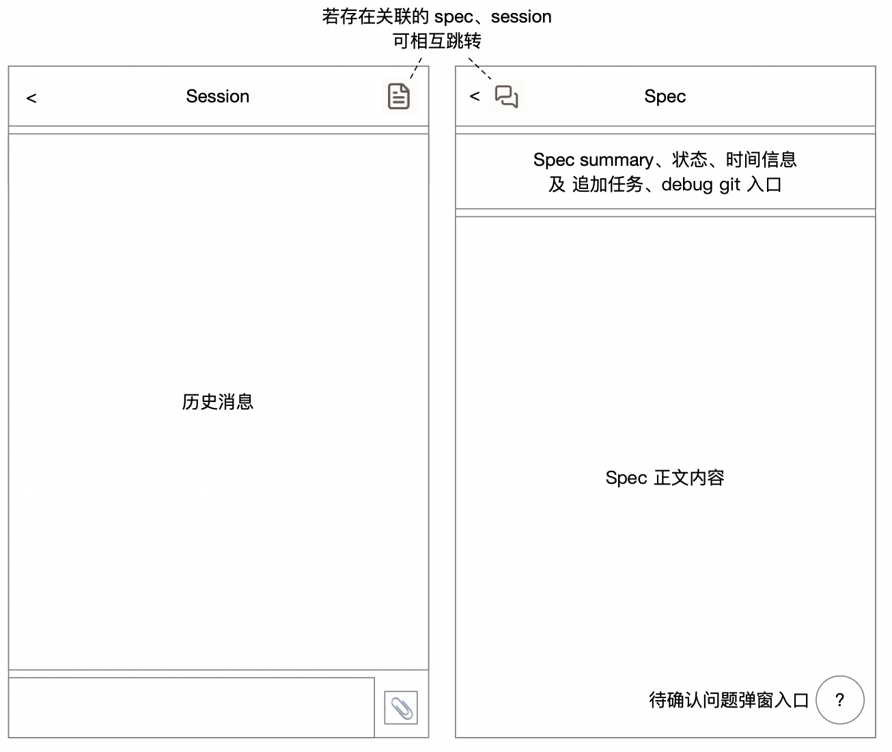
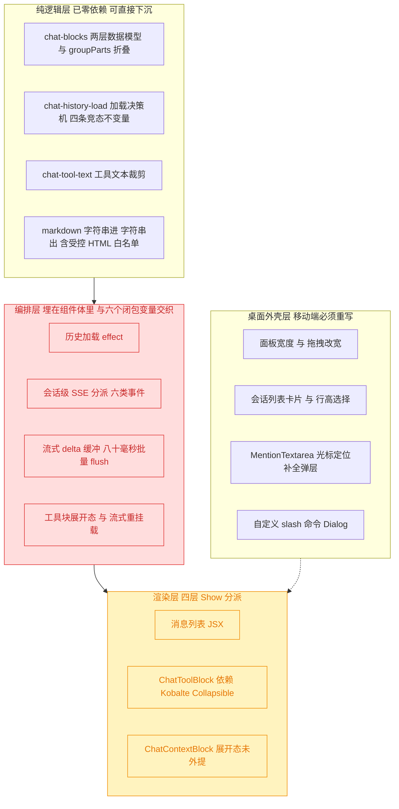
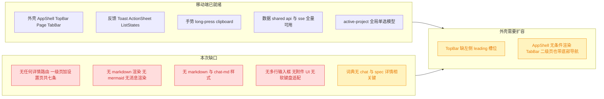
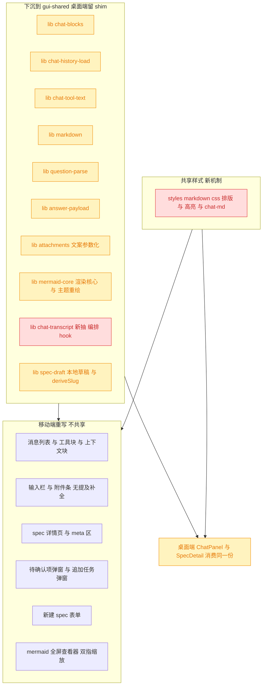
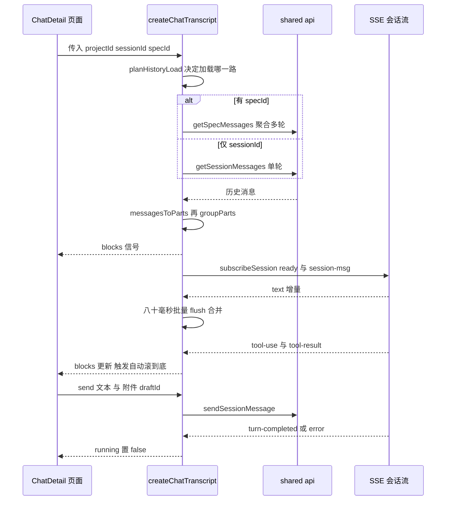
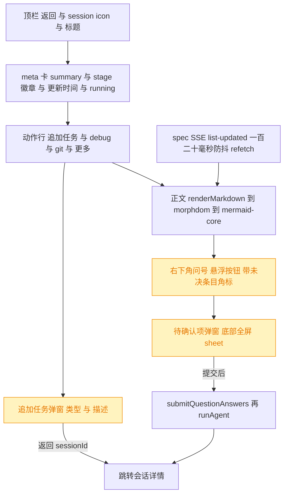
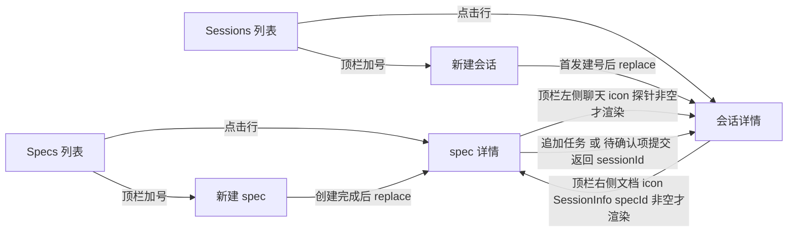
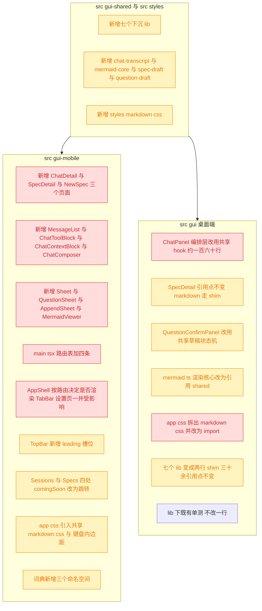

# 移动端二级页面：会话详情与 spec 详情

## 1. 背景

上一个 spec [260906.feat.mobile-tab-pages-and-gui-shared](../260906.feat.mobile-tab-pages-and-gui-shared/spec.md) 已完成移动端四个一级页面（Sessions / Specs / 扩展 / 项目）与 `src/gui-shared` 复用层，二级页面统一以「即将支持」toast 降级——`Sessions.tsx` 与 `Specs.tsx` 的行点击与顶栏 `+` 四处全部指向 `comingSoon()`。

本次实现其中最核心的两条二级链路：会话详情与 spec 详情，并补上两个「新建」入口以及 spec ↔ session 的互跳。

线框图附件：



## 2. 需求

1. 点击 session 列表项进入会话详情，Agent 输出内容渲染应参考 `src/gui/src/components/ChatPanel.tsx` 中的历史消息渲染模块，能复用更好。
2. 添加 session 列表右上角的 `+` icon，进入 chat 空白页，可发起新会话。
3. 点击 spec 列表项进入 spec 详情页，文档渲染参考 `src/gui/src/pages/SpecDetail.tsx`，能复用更好。
   - 待确认项、追加任务的 UI 以点击触发弹窗呈现。
4. 点击 spec 列表右上角的 `+` icon，进入创建 spec 页面。
5. 与 spec 存在关联的 session，顶部导航栏存在可以互跳的 icon。

### 2.1 线框图确立的语义

- **Session 详情**：顶栏「返回 + 标题 + 右上角文档 icon（跳 spec）」，主体为历史消息滚动区，底部为输入框 + 回形针（附件）。
- **Spec 详情**：顶栏「返回 + 聊天 icon（跳 session） + 标题」，其下是一块 meta 区（summary、状态、时间、追加任务 / debug / git 入口），主体为 spec 正文滚动区，**右下角悬浮 `?` 按钮是待确认项弹窗入口**。
- 两个 icon 的位置刻意不同（session 在右、spec 在左），是线框图明确画出的。

## 3. 现状分析

### 3.1 桌面端聊天渲染链路的分层

`ChatPanel.tsx` 是 1678 行的单体组件，但它内部**已经完成了一次分层**：所有与消息内容有关的转换都被抽到了零依赖的纯函数 lib，组件体里剩下的是 solid 信号编排与桌面外壳（面板宽度、拖拽改宽、折叠、会话列表卡片、slash 命令 Dialog）。这决定了本次复用的天然切割面。



> 红 = 本次要下沉并因此改写桌面端的区域；黄 = 移动端重写、桌面端不动的区域；灰 = 两端各自保留。

<details>
<summary>四层的精确定位（文件 + 行号 + 依赖）</summary>

**纯逻辑层（零 solid / 零 DOM，已各自带单测）**

| 文件                                   | 行数 | 依赖                                              |
| -------------------------------------- | ---- | ------------------------------------------------- |
| `src/gui/src/lib/chat-blocks.ts`       | 332  | 仅 `import type` from `./api.js`                  |
| `src/gui/src/lib/chat-history-load.ts` | 141  | 无                                                |
| `src/gui/src/lib/chat-tool-text.ts`    | 34   | 无                                                |
| `src/gui/src/lib/markdown.ts`          | 249  | `markdown-it` / `markdown-it-task-lists` / `hljs` |

`chat-blocks.ts` 的两层模型：Layer1 `ChatPart`（`TextPart:19` / `ToolPart:25` / `AgentContextPart:32` / `DividerPart:43`，扁平追加式）→ `groupParts()`（`:263-332`）→ Layer2 `ChatBlock`（`UserBlock:52` / `AssistantBlock:83` 含 `segments: (TextSegment | ToolsSegment)[]` / `AgentContextBlock:88` / `DividerBlock:93`）。核心规则（注释 `:243-249`）：**只有 user text part 才开启新气泡**。转换入口 `messagesToParts(:145)` 与 `specMessagesToParts(:182)`，`stripHiddenPrompt(:118)` 剥掉服务端注入的 `<!-- yorz:hidden -->` 附件路径块。

**编排层（`ChatPanel.tsx` 内，约 160 行）**

- `:645-704` 历史加载 effect：`planHistoryLoad()` 决策 → `api.getSpecMessages()` 或 `api.getSessionMessages()` → `historyGate` 守卫后 `resetParts()`
- `:707-749` `subscribeSession(pid, sid, { onReady, onEvent })`，分派 6 类事件
- `:850-910` delta 缓冲：`pendingDelta` / `flushTimer` / `withAssistantText` / `flushDeltas` / `appendAssistantDelta` / `appendAssistant` / `pushPart` / `resetParts`，`STREAM_FLUSH_MS = 80`
- `:339-348` `expandedKeys` + `toolExpand` + `resetExpanded`（工具块展开态必须外提，否则流式 tick 重挂载会丢）
- `:751-769` 自动滚动，`AUTO_SCROLL_THRESHOLD = 96`
- `:356-398` 竞态守卫：`freshSids` / `freshRevision` / `displayedSid` / `displayedSpecId` / `historyGate` / `waitForSubscription`（SSE 无 replay buffer，草稿首发必须先等 `ready` 或 1500ms 超时，见 `:953-958` 注释）

**`SessionEvent` 六类事件**（`src/gui-shared/api/sse.ts:194-200`，处理在 `ChatPanel.tsx:713-743`）

| type              | payload           | 处理                                                      |
| ----------------- | ----------------- | --------------------------------------------------------- |
| `text`            | `{ delta }`       | `appendAssistantDelta`，80ms 批量 flush                   |
| `tool-use`        | `{ name, input }` | `pushPart({ kind:'tool', name, input })`                  |
| `tool-result`     | `{ text }`        | `pushPart({ kind:'tool', result })`                       |
| `turn-completed`  | `{ usage? }`      | flush + `markFreshPersisted` + running=false              |
| `error`           | `{ message }`     | 追加 `[Error] …` 文本 + running=false                     |
| `session-started` | `{ sessionId }`   | codex 中途换 id：继承 fresh、迁移 `displayedSid`、refetch |

> **已知前后端缺口**：服务端 `src/service/agent-sdk/types.ts:20` 还有 `{ type: 'compact'; metrics }`，`events-hub.ts:337-340` 原样透传，但前端 `SessionEvent` 联合类型没有这一分支，被 if-else 链静默丢弃。本次下沉时一并补齐类型（渲染上仍可忽略）。

**渲染层**：JSX `ChatPanel.tsx:1298-1405`（滚动容器 `:1298-1304`、空态 `:1305-1314`、`<Index each={blocks()}>` 四层 `Show` 分派 `:1326-1403`、markdown 段 `:1358-1369` 传 `{ mermaid: 'code', fileLinks: 'copy' }`、user 气泡刻意走 `whitespace-pre-wrap` 不过 markdown `:1344-1346`）。子组件 `ChatToolBlock.tsx`（148 行，依赖 `ui/collapsible` → Kobalte）、`ChatContextBlock.tsx`（38 行，展开态是组件内 `createSignal`，与 ChatToolBlock 不一致）。

**桌面外壳层**：`:95-101 / :141-201` 宽度体系、`:606-642` 拖拽改宽（document 级监听 + `document.body.classList`）、`:1182-1296` 会话列表卡片、`MentionTextarea.tsx`（478 行，caret 定位 + `@` 文件补全 + `/` 命令弹层）、`:1515-1675` slash 命令 Dialog。

</details>

### 3.2 桌面端 spec 详情渲染链路

`SpecDetail.tsx`（508 行）的正文渲染是三段式：`renderMarkdown()` 产出 HTML 字符串 → `morphdom` 增量 diff 进 `<article>` → `renderMermaidIn()` 补渲染新增的 mermaid 节点。三者的分工与可搬性差异极大。

<details>
<summary>渲染链路各环节的可搬性判定（精确层）</summary>

| 环节                        | 文件 / 行号                          | 规模    | 判定                                                                                                                              |
| --------------------------- | ------------------------------------ | ------- | --------------------------------------------------------------------------------------------------------------------------------- |
| markdown → HTML             | `src/gui/src/lib/markdown.ts`        | 249 行  | ✅ 零 DOM 零 i18n，可整体下沉                                                                                                     |
| 增量 diff                   | `SpecDetail.tsx:228-267`             | 40 行   | ✅ `morphdom` 是跨平台库，effect 可原样复制；`onBeforeElUpdated` 在 `data-mermaid-source` 未变时返回 `false` 保住已渲染的 SVG     |
| mermaid 渲染核心            | `src/gui/src/lib/mermaid.ts:350-429` | ~80 行  | 🟡 epoch 防竞态（`:51-59`）+ 串行队列（`:61-65`）+ 只渲染 `.mermaid:not([data-processed])` + 主题 flip 全量重绘，平台无关，可下沉 |
| mermaid 全屏 overlay / 控件 | `mermaid.ts:118-345`                 | ~230 行 | 🔴 滚轮缩放 + 鼠标拖拽平移 + hover 出按钮 + `document.body.appendChild`，鼠标专属，移动端需重写                                   |
| 选区快照                    | `src/gui/src/lib/selection.ts`       | 88 行   | 🔴 桌面「拖选出浮动菜单」模型，与移动端长按 + 系统菜单冲突（本次不做，见 5.2）                                                    |
| spec 路径                   | `src/gui-shared/lib/spec-path.ts`    | 12 行   | ✅ 已在 shared，移动端 `Specs.tsx:14` 已在用                                                                                      |

**`renderMarkdown(source, opts)` 签名**（`markdown.ts:230-238`），`RenderOptions`（`:54-79`）四组字段：

- `specId` / `projectId`：**不是 spec 内链接改写，只做附件 URL 重写**。`rewriteHrefIfAttachment(:106-127)` 只匹配 `^attachments/(.+)$`，改写为 `/api/projects/:pid/specs/:id/attachments/:name`；协议 URL、`/` 开头、`#` 开头一律原样。作用于 `image(:169-177)` 与 `link_open(:179-215)` 两条规则。**移动端 spec 详情必须传这两个字段，否则本 spec 里的线框图附件渲染不出来。**
- `mermaid: 'diagram' | 'code'`：`'diagram'`（默认）产出 `<div class="mermaid" data-mermaid-source="…">`；`'code'` 走普通高亮代码块（Chat 用）。
- `fileLinks: 'copy'` / `fileLinkTitle`：把本地绝对路径链接改成 `data-file-link` / `data-file-path` 的非导航复制按钮（`:186-201`）。
- 安全性：`html: true` 但有白名单 `sanitizeRawHtml(:36-51)`，只放行 `<details>` / `<summary>` / task-list 禁用复选框，其余原始 HTML 转义。两端共用同一份即可。

**待确认项与追加任务的纯逻辑已完全就绪**：

- `src/gui/src/lib/question-parse.ts`（192 行，零依赖）：`parseConfirmQuestions(body) → ConfirmQuestion[]`，`{ id, text, kind: 'choice'|'confirm'|'freeform', options, isFreeform, plan?, impact? }`。识别 `## 待确认项` / 旧名 `## 待确认问题`、`### N.M` 条目、`[choice]` / `[confirm]` 前缀标记、confirm 的 `**方案**` / `**影响**` / `**代价**` 字段、choice 的一级有序候选与 ` (推荐)` 标记、`（自由文本）` 后缀。
- `src/gui/src/lib/answer-payload.ts`（80 行）：`FREEFORM_SENTINEL`、`CONFIRM_DECISIONS`（5 个决策 label）、`buildConfirmAnswerItem`（否决必须带理由否则返 null）、`buildAnswerItem`。**这是提交 payload 的唯一构造点，两端必须共用，否则回写的 `！！！选择：…` 文案会漂移。**
- 桌面 UI 侧 `QuestionConfirmPanel.tsx`（434 行）是 `flex-[4]` 侧栏 + 嵌套 Kobalte RadioGroup（confirm 三级：accept/reject → alternative/constraint/dropGoal → current/spec），`AppendTaskDialog.tsx`（181 行）是 anchor 到触发按钮的 384px 浮层，两者的**布局假设在移动端均不成立**，但其中的草稿状态机（`resolveConfirmKey:53-63` / `isConfirmComplete:66-71` / `initialAnswers:82-97` / `unanswered:125-148` / `submit:150-193` 的 payload 构造，约 90 行）与 UI 无关。

</details>

### 3.3 移动端现有承载能力与缺口

移动端已经具备完整的外壳（`AppShell` / `TopBar` / `Page` / `TabBar` / `Toast` / `ActionSheet` / `ListStates`）与全部 API + SSE 能力（经 `@shared`），缺的恰好是「文档 / 消息内容的渲染」这一层——`src/gui-mobile/src/app.css:5` 的注释就写着桌面端的 `.markdown` / `.chat-md` / mermaid 样式一概没引进来。



<details>
<summary>移动端可直接站上去的既有资产（精确层）</summary>

| 资产                                                                                                       | 位置                                          | 本次用法                                                     |
| ---------------------------------------------------------------------------------------------------------- | --------------------------------------------- | ------------------------------------------------------------ |
| `Page` (`padded?` / `onBack` / `actions`)                                                                  | `src/gui-mobile/src/components/Page.tsx:4-29` | 详情页传 `padded={false}` + `onBack`                         |
| `TopBar` 三槽布局                                                                                          | `components/TopBar.tsx:17-42`                 | 需新增 `leading` 槽位（spec → session 的 icon 在返回键右侧） |
| `.scroll-y` / `.pb-safe` / `.px-safe` / `.tap-target` / `.no-callout` / `.truncate-start`                  | `src/app.css:57-61, 96-138`                   | 消息区与正文区套 `.scroll-y`；输入栏 `.pb-safe`              |
| `showToast(message, tone)`                                                                                 | `components/Toast.tsx:28`                     | 发送失败 / 复制路径 / 提交结果反馈                           |
| `ActionSheet`（`z-[60]`、开局 300ms 忽略遮罩点击）                                                         | `components/ActionSheet.tsx:5-98`             | spec 详情的「更多」菜单                                      |
| `createLongPress`                                                                                          | `lib/long-press.ts:25`                        | 已在 Specs 列表用；详情页文件路径复制沿用同一手势            |
| `copyText`（`execCommand` 回退）                                                                           | `lib/clipboard.ts:9`                          | 非 secure context 的真机场景必须走它                         |
| `activeProjectId` / `activeProject`                                                                        | `lib/active-project.ts:44,83`                 | 所有二级页的 pid 来源                                        |
| `groupSessions` / `formatSpecUpdatedAt` / `stageBadgeClass` / `SPEC_TYPE_TEXT` / `splitSpecId` / `enShort` | `src/gui-shared/lib/*`                        | 列表页已在用，详情页 meta 区复用                             |

`main.tsx:31` 的 `<Router base="/m">` 下现有 7 条路由（`/`、`/specs`、`/ext`、`/projects`、`/settings/global`、`/settings/project`、`*`），**无任何 `:id` 参数路由**。`AppShell.tsx:21` 无条件渲染 `<TabBar />`。

顶层依赖已备齐、可直接 import：`markdown-it@^14.2.0` / `markdown-it-task-lists@^2.1.1` / `highlight.js@^11.11.1` / `mermaid@^11.0.0` / `morphdom@^2.7.8` / `timeago.js@^4.0.2`（单一 `package.json`，非多包 workspace，两端共享同一份 node_modules）。移动端只用了 1 个 Kobalte 组件（`components/ui/button.tsx`）。

</details>

### 3.4 后端接口与关联模型

后端**零改动**：本次全部端点均已存在且已在 `src/gui-shared/api/index.ts` 有客户端方法。

<details>
<summary>本次消费的端点清单与关联语义（精确层）</summary>

| 用途             | 客户端方法                                                                   | HTTP                                            | 返回                                                                                      |
| ---------------- | ---------------------------------------------------------------------------- | ----------------------------------------------- | ----------------------------------------------------------------------------------------- |
| 单会话历史       | `getSessionMessages(pid, sid)`                                               | `GET /api/projects/:pid/sessions/:sid/messages` | `SessionMessage[]`                                                                        |
| spec 聚合历史    | `getSpecMessages(pid, specId)`                                               | `GET .../specs/:id/messages`                    | `SpecSessionMessages[]`（含 `sessionId`/`kind`/`createdAt`，用于画分隔线）                |
| 会话列表         | `listSessions(pid)`                                                          | `GET .../sessions`                              | `SessionInfo[]`，上限 30（`session-manager.ts:71`）                                       |
| 新建会话         | `createSession(pid, {})`                                                     | `POST .../sessions`                             | `{ sessionId }`                                                                           |
| 发消息           | `sendSessionMessage(pid, sid, prompt, draftId?)`                             | `POST .../sessions/:sid/messages`               | `{ runId, sessionId }`（202）                                                             |
| 中断             | `abortSession(pid, sid)`                                                     | `POST .../sessions/:sid/abort`                  | `{ ok }`                                                                                  |
| spec 详情        | `getSpec(pid, id)`                                                           | `GET .../specs/:id`                             | `SpecDetail`（`frontmatter` + `body`）                                                    |
| spec 的 session  | `getSpecSession(pid, id)`                                                    | `GET .../specs/:id/session`                     | `{ sessionId \| null, kind \| null, running }`，**只读探针，绝不新建**                    |
| 提交待确认项答复 | `submitQuestionAnswers(pid, id, body)`                                       | `POST .../specs/:id/questions/answers`          | `{ ok }`；body `{ answers: QuestionAnswerBody[]; freeformAnnotations: AnnotationBody[] }` |
| 追加任务         | `appendItem(pid, id, body)`                                                  | `POST .../specs/:id/appends`                    | `{ ok, runId?, sessionId?, busy? }`；`busy` = 已存盘但未派发                              |
| 运行 agent       | `runAgent(pid, id)`                                                          | `POST .../specs/:id/run`                        | `{ runId, sessionId }`                                                                    |
| debug 文档       | `getDebug(pid, id)`                                                          | `GET .../specs/:id/debug`                       | `{ exists, text }`                                                                        |
| 新建 spec        | `createSpec(pid, body)`                                                      | `POST .../specs`                                | `{ id, path, draft?: false } \| { runId, sessionId, draft: true }`（202）                 |
| 草稿附件         | `createDraft` / `uploadAttachment` / `deleteAttachment` / `renameAttachment` | `POST .../spec-drafts` 及其子路由               | `{ draftId }` / `AttachmentMeta`                                                          |

**关联模型**：`SessionInfo.specId?`（`api/index.ts:250`）是唯一的反向指针；`groupSessions()` 按它把一个 spec 的 N 轮 session 折叠成一行 `SessionGroup`。正向 `getSpecSession` 走 `findSessionForSpec`（`session-manager.ts:161`，只读，无 session 时返 `null`）。**没有单个 session 的 GET 端点**——会话详情页的标题与 `specId` 只能从 `listSessions(pid)` 里查。

**运行环境**：`src/service/index.ts` 的 `start()` 强制 loopback 绑定，真机走 `pnpm dev:gui-mobile`（:5174，`/api` 代理到 :7424），该场景下 `navigator.clipboard` 为 `undefined`——所有复制必须走 `lib/clipboard.ts` 的回退。

</details>

## 4. 技术实现方案

### 4.1 复用策略总览

沿用上一个 spec 已验证的「下沉 + shim」范式：纯逻辑整体搬进 `src/gui-shared/`，桌面端原路径留 `export * from '@shared/…'` 的 2 行 shim，桌面既有引用点与单测零改动。本次新增两类以前没有的共享物：**共享 CSS**（`src/styles/markdown.css`）与**共享 solid hook**（`chat-transcript.ts`），但**仍不共享任何 `.tsx` 组件**——README 的「页面级 UI、布局、外壳交互不属于共享范围」这条约定不动。



> 红 = 会改动桌面端既有行为的两项（`chat-transcript` 抽取见 5.1；`markdown.css` 从 `app.css` 拆出）；黄 = 纯搬运 + shim，桌面端语义不变。

> 决策：**`.tsx` 渲染组件不进 gui-shared**。移动端消息气泡需要更大的触摸区与字号、工具块不引 Kobalte Collapsible（改用受控 `<Show>`，移动端不需要高度动画）、spec meta 区与桌面 header 的信息密度完全不同。被否决的备选是「把 `MessageList` 参数化后共享」——参数会退化成一堆 class 字符串 props，可读性还不如各写一份 80 行 JSX。

> 决策：**markdown / 高亮 / `.chat-md` 样式抽成 `src/styles/markdown.css`**，与既有的 `src/styles/theme-tokens.css` 同机制（两端各自 `@import`），桌面 `app.css` 对应段落删除改为 import。被否决的备选是「移动端复制一份」——250 行排版规则复制后必然漂移，而这些规则的唯一真相就是 `renderMarkdown` 产出的 HTML 结构。

<details>
<summary>下沉清单与 shim 明细（精确层）</summary>

```
src/gui-shared/
  lib/
    chat-blocks.ts       ← 迁自 src/gui/src/lib/chat-blocks.ts（332 行，import 改 ../api/index.js）
    chat-history-load.ts ← 迁自 src/gui/src/lib/chat-history-load.ts（141 行，零依赖）
    chat-tool-text.ts    ← 迁自 src/gui/src/lib/chat-tool-text.ts（34 行，零依赖）
    markdown.ts          ← 迁自 src/gui/src/lib/markdown.ts（249 行）
    question-parse.ts    ← 迁自 src/gui/src/lib/question-parse.ts（192 行）
    answer-payload.ts    ← 迁自 src/gui/src/lib/answer-payload.ts（80 行）
    attachments.ts       ← 迁自 src/gui/src/lib/attachments.ts（274 行），t() 改为 options.labels 注入
    mermaid-core.ts      ← 新建：从 mermaid.ts:350-429 抽渲染核心 + epoch/队列/主题重绘
    chat-transcript.ts   ← 新建：createChatTranscript()（见 4.3），约 200 行
    spec-draft.ts        ← 新建：从 NewSpec.tsx:34-87 抽 readDraft/persistDraft/clearDraft + :357-366 deriveSlug
src/styles/
    markdown.css         ← 新建：从 src/gui/src/app.css 迁 .markdown(126-228) + hljs token(229-300) + .chat-md(502-541)
```

桌面端 shim（每个 2 行 `export * from '@shared/lib/xxx.js'`）：`chat-blocks.ts` / `chat-history-load.ts` / `chat-tool-text.ts` / `markdown.ts` / `question-parse.ts` / `answer-payload.ts` / `attachments.ts`。`mermaid.ts` 不做整体 shim——它保留桌面 overlay 交互，只把渲染核心改为 `import { … } from '@shared/lib/mermaid-core.js'`。

`attachments.ts` 的文案参数化：现有 `t('newSpec.attachTooBig')` 等 4 处改为 `createAttachments({ projectId, labels })`，桌面端传 `t()` 结果、移动端传自己的词典键，接口保持 `AttachmentsController`（`attachments.ts:58-78`）不变。

`tsconfig` / `vite` / `tailwind` **无需再接线**：`@shared/*` paths、alias、content glob 均已在上一个 spec 建好；`src/styles/markdown.css` 由两端 `app.css` 的 `@import` 引入，走 Vite 的 CSS 解析，也无需配置。

</details>

### 4.2 路由与外壳改造

四条新路由挂在现有扁平表下，`/specs/new` 必须写在 `/specs/:id` **之前**（Solid Router 静态段优先，与桌面端 `/:projectId/specs/new` 的处理一致）：

| path            | 组件         | 说明                                          |
| --------------- | ------------ | --------------------------------------------- |
| `/sessions/new` | `ChatDetail` | 空白 chat（草稿态，首发时才建 session）       |
| `/sessions/:id` | `ChatDetail` | 会话详情，同一组件按 `params.id` 是否存在分支 |
| `/specs/new`    | `NewSpec`    | 创建 spec 表单                                |
| `/specs/:id`    | `SpecDetail` | spec 详情                                     |

> 决策：**二级页面隐藏底部 TabBar**。`AppShell` 用 `useLocation()` 判定当前路径是否属于四个一级页（`/`、`/specs`、`/ext`、`/projects` 精确匹配），否则不渲染 `<TabBar />`。二级页都带返回键，再留一条底部导航既抢走 56px 高度、又与「返回」语义打架；会话详情页底部本来就是输入栏，两条底栏叠在一起在小屏上不可接受。**副作用**：现有两个设置二级页也会随之失去 TabBar——这是一致性修正，不是回归。

> 决策：**`TopBar` 增加 `leading?: JSX.Element` 槽位**，渲染在返回键右侧、标题左侧。线框图把 spec → session 的跳转 icon 明确画在左上角（与 session → spec 的右上角刻意不对称）。`leading` 与 `actions` 都落在 `min-w-0 flex-1` 的左右槽里，标题的几何居中不受影响（上一轮已实测偏差 0.0px）。

### 4.3 会话详情页

新建 `src/gui-mobile/src/pages/ChatDetail.tsx`，一个组件同时承载 `/sessions/:id` 与 `/sessions/new`。核心编排全部来自新抽的共享 hook。



<details>
<summary>`createChatTranscript()` 的接口与页面结构（精确层）</summary>

```ts
// src/gui-shared/lib/chat-transcript.ts
export interface ChatTranscriptOptions {
  projectId: () => string
  sessionId: () => string // 空串 = 草稿态
  specId: () => string | undefined
  onSessionIdChange?: (sid: string) => void // codex 中途换 id / 草稿首发建号
  errorLabel: (message: string) => string // 两端 i18n 各自注入
}
export interface ChatTranscript {
  blocks: () => ChatBlock[]
  running: () => boolean
  toolExpand: ToolExpandState
  send: (prompt: string, draftId?: string) => Promise<void>
  abort: () => Promise<void>
}
export function createChatTranscript(o: ChatTranscriptOptions): ChatTranscript
```

内部搬运自 `ChatPanel.tsx` 的：`:313-348`（parts / blocks / expandedKeys / toolExpand）、`:356-398`（`freshSids` / `freshRevision` / `displayedSid` / `displayedSpecId` / `historyGate` / `waitForSubscription` / `markSubscribed` / `markFreshPersisted`）、`:645-704`（历史加载 effect）、`:707-749`（会话级 SSE 分派，补上 `compact` 分支的类型声明）、`:850-910`（delta 缓冲 + `onCleanup`）、`:930-1002`（`send` / `sendFromDraft` / `abort`，其中 `sendFromDraft` 的 `createSession` → `waitForSubscription` → `Promise.race([ready, delay(1500)])` 时序原样保留）。

桌面 `ChatPanel` 改为消费它：删掉上述行段，`activeSid` / `activeSpecId` 继续由组件自己维护并作为 hook 的 source，`onSessionIdChange` 里接原来的 `setActiveSid` + `refetchSessions`。桌面端 `runningSids`（项目级 SSE 与列表响应重建）仍留在组件里——那是会话**列表**的运行态，不属于单条 transcript。

**页面结构**（`ChatDetail.tsx`，约 180 行）

```
<Page padded={false} onBack title={sessionTitle()} actions={specId() ? <FileText → /specs/:specId> : null}>
  <div class="scroll-y" ref={messagesEl} onScroll={onScroll}>
    <MessageList blocks={tx.blocks()} expand={tx.toolExpand} onCopyPath={copyText} />
  </div>
  <ChatComposer value input attachments onSend onAbort running={tx.running()} />
</Page>
```

- **标题与 specId 来源**：无单会话 GET 端点，从 `api.listSessions(pid)` 里按 `params.id` 查（复用 Sessions 列表页同一份 resource 语义）。超出 30 条上限而查不到时，标题回退 `t('chat.untitled')`、不渲染跳转 icon。**不新增后端端点**——上一个 spec 确立的「后端零改动」边界继续保持。
- **`MessageList.tsx`**（新建，约 90 行）：`<Index each={blocks()}>` + 四层 `Show` 分派，与桌面 `ChatPanel.tsx:1326-1403` 同构。assistant 文本段 `innerHTML={renderMarkdown(text, { mermaid: 'code', fileLinks: 'copy', fileLinkTitle })}`，容器 class `markdown chat-md`；user 段走 `whitespace-pre-wrap` 不过 markdown（与桌面一致）；divider 段渲染分隔线。气泡外边距与字号按移动端放大（`px-3 py-2 text-[0.95rem]`，桌面是 `px-2 py-1.5`）。
- **`ChatToolBlock` / `ChatContextBlock`**（新建，各约 50 / 30 行）：不引 Kobalte Collapsible，用 `<Show>` + 44px 触摸区的展开条；展开态一律走 hook 提供的 `toolExpand`（顺带修掉桌面 `ChatContextBlock` 用组件内 signal 的不一致）。
- **自动滚动**：沿用 `isNearMessagesBottom` / `scrollMessagesToBottom` / `onMessagesScroll`，阈值 `AUTO_SCROLL_THRESHOLD` 移动端取 80。
- **文件链接复制**：事件委托到滚动容器，`closestFileLink(e.target)` 命中后走移动端 `copyText()` + `showToast()`（不用桌面的 `navigator.clipboard` 直调）。

**`ChatComposer.tsx`**（新建，约 120 行）：`AutoResizeTextarea`（自绘，`rows=1` + `scrollHeight` 夹到 5 行）+ 回形针按钮（`<input type="file" hidden>` + `attachments.onFileInputChange`）+ 附件缩略图条 + 发送 / 中断互斥按钮（`running()` 时只出 `Square` 中断）。**不做 `@` 文件补全与 `/` 命令弹层**（见 5.2）。

</details>

### 4.4 新建会话页

`/sessions/new` 复用 `ChatDetail`：`params.id` 为空 → `sessionId()` 返回空串 → hook 进入草稿态（`blocks()` 为空、显示 `chat.draftEmpty` 空态）。首条消息发送时 hook 内部 `createSession` → 等 `ready` → `sendSessionMessage`，随后 `onSessionIdChange(sid)` 回调里 `navigate('/sessions/' + sid, { replace: true })`——`replace` 保证返回键直接回到列表，而不是回到已经没用的空白页。

`Sessions.tsx:72` 顶栏 `Plus` 的 `onClick={comingSoon}` 改为 `navigate('/sessions/new')`；`Sessions.tsx:92` 行点击的 `comingSoon` 改为 `navigate('/sessions/' + group.latest.id)`。

### 4.5 spec 详情页

新建 `src/gui-mobile/src/pages/SpecDetail.tsx`，三段式布局对齐线框图：顶栏 / meta 卡片 / 正文滚动区 + 右下角 FAB。



<details>
<summary>各区块的数据来源与实现要点（精确层）</summary>

**数据**：`createResource([pid, id, tick], fetchSpecWithRetry)` —— 原样复制桌面 `SpecDetail.tsx:64-79` 的 404 重试（agent 与编辑器是「临时文件 + rename」原子写，落在窗口里会 404；重试 3 次、退避 150ms，仍失败则回退上一份好文档而不是抛出，避免 `Suspense` 永久卡在 loading）。SSE 走 `subscribeSpec(pid, id, { onUpdated })` + 120ms 防抖 + `startTransition`（避免重新 suspend 导致滚动位置归零）。

**meta 卡**：`frontmatter.summary`（空则 `common.pendingAgent`）、`stageBadgeClass(stage)` 徽章（**只读，不做强制切换**）、`formatSpecUpdatedAt(updated_at)`、`running` 徽章。`running` 由 `getSpecSession` 探针初始化 + `subscribeSessions` 的 `session-status` + `subscribeSession` 的 `turn-completed`/`error` 三路维持，与桌面 `SpecDetail.tsx:159-203` 同构。

**动作行**：`追加任务`（开弹窗）、`debug`（`getDebug().exists` 时才出，跳 `/specs/:id/debug`——**本次不实现该页，点击弹「即将支持」**）、`git`（同上）、`更多`（`ActionSheet`：复制路径 `copyText(specFilePath(id))`）。

> 决策：**debug / git 入口渲染但不可用**。线框图把它们画进了 meta 区，隐藏会让结构与设计稿对不上；沿用上一个 spec 已确立的「入口照常渲染、点击弹『即将支持』」降级策略，不新造第三种表达。

**正文**：`renderMarkdown(body, { specId, projectId, mermaid: 'diagram' })` → `morphdom(el, '<article>…</article>', { childrenOnly: true, onBeforeElUpdated })` → `renderMermaidIn(el)`。三段原样复制桌面 `SpecDetail.tsx:228-267`，`onBeforeElUpdated` 的 `data-mermaid-source` 比对必须保留，否则每次 SSE 刷新都会把已渲染的 SVG 打回原形。**`projectId` 必须传**，否则 spec 里的 `attachments/xxx.png` 渲染不出来。

**mermaid 移动端适配**：`.mermaid` 容器加 `overflow-x:auto`；点击图表打开自绘全屏查看器 `MermaidViewer.tsx`（约 70 行：`fixed inset-0` 遮罩 + `touch-action: pinch-zoom` 的容器 + 关闭按钮 + `pt-safe`/`pb-safe`），**依赖系统双指缩放，不自绘缩放数学**——桌面那套 230 行滚轮/拖拽交互在触屏上没有对应语义。

**FAB**：`parseConfirmQuestions(body)` 结果非空时渲染右下角 `?` 按钮（`fixed bottom-6 right-4` + `pb-safe`，56px 圆形），角标显示条目数。`running()` 时禁用——与桌面 `showPanel` 的门禁同因：可见即可提交，会并发拉起第二个改写同一文档的 session。

</details>

### 4.6 待确认项与追加任务弹窗

需求明确要求两者以「点击触发弹窗」呈现。两个弹窗都用同一个新建的底部 sheet 容器 `Sheet.tsx`（约 60 行：遮罩 + 贴底卡 + `max-h-[85dvh]` + 内部 `.scroll-y` + `pb-safe` + `z-[60]`），与既有 `ActionSheet` 的层级/遮罩口径一致但支持任意 children。

<details>
<summary>两个弹窗的表单结构与提交链路（精确层）</summary>

**待确认项弹窗 `QuestionSheet.tsx`**（约 200 行）

- 输入：`parseConfirmQuestions(spec.body)`（共享纯函数）。
- `choice` 型：候选渲染为整行可点的单选卡（44px 触摸区），`(推荐)` 项带 `primary.soft` 底；末尾固定一项「其它（自由文本）」，选中后展开 textarea（对应 `FREEFORM_SENTINEL`）。
- `confirm` 型：先出 `**方案**` / `**影响**`（🔴/🟡 前缀按 `impactAccent` 上色），再是两级选择——第一级「确认，按此推进 / 否决」；选「否决」后**在同一张卡里就地展开**第二级（换方案 / 补约束 / 弃目标），弃目标再展开第三级（废弃当前目标 / 放弃整个 spec）；否决必须填理由（`buildConfirmAnswerItem` 在缺理由时返 `null`，UI 侧同步禁用提交）。桌面是嵌套 RadioGroup 缩进，移动端改为**分级就地展开**，避免三层缩进在 375px 宽下挤成一列。
- `freeform` 型：单个 textarea。
- 提交：`buildAnswerItem` / `buildConfirmAnswerItem` 构造 `QuestionAnswersBody`（`freeformAnnotations` 传 `[]`，见 5.2）→ `api.submitQuestionAnswers` → `api.runAgent` → 关闭弹窗、`showToast`、跳转会话详情。
- 未答条目在提交按钮旁列出计数（复用 `unanswered` memo 的判定逻辑，随 `question-draft` 一起抽到共享层）。

**追加任务弹窗 `AppendSheet.tsx`**（约 90 行）

- 类型三选一（`feat` / `refct` / `fix`，默认 `fix`，与桌面 `AppendTaskDialog.tsx:33` 一致）+ 描述 textarea（trim 非空校验）。
- 提交：`api.appendItem(pid, id, { kind, description })`。响应 `busy: true` → `showToast(t('specDetail.appendSavedSpecBusy'), 'error')`（已存盘未派发）；有 `sessionId` → 置 running 并跳转会话详情。
- **不传 `sectionPath` / `quote`**：移动端不做选区（见 5.2），追加任务是整篇级别的输入。

**共享草稿状态机**：从 `QuestionConfirmPanel.tsx` 抽出 `resolveConfirmKey` / `isConfirmComplete` / `initialAnswers` / `unanswered` 判定（约 60 行）到 `src/gui-shared/lib/question-draft.ts`，桌面端改为 import。这保证两端「什么算答完」的判定不漂移。

</details>

### 4.7 新建 spec 页

新建 `src/gui-mobile/src/pages/NewSpec.tsx`（约 200 行），对齐桌面 `NewSpec.tsx` 的提交契约，砍掉桌面专属的 worktree 与提及补全。

<details>
<summary>表单字段、草稿与提交时序（精确层）</summary>

- **字段**：类型三选一（`feat` / `refct` / `fix`，默认 `feat`）+ 需求 textarea（`length >= 5` 才允许提交）+ 附件区。
- **本地草稿**：复用下沉后的 `@shared/lib/spec-draft.js`，key 前缀 `'yorz:new-spec-draft:'` + pid（与桌面同一份 key —— 同一台机器上桌面与移动端编辑同一个项目的草稿会互通，这是特性不是 bug）。
- **附件**：`createAttachments({ projectId, labels })`，`ACCEPT_MIME` / 5MB / 10 个上限沿用；UI 是横向滚动的缩略图条（图片走 `URL.createObjectURL` 预览，PDF/文本出文件名芯片），每项右上角删除按钮。**不做重命名**（桌面 `AttachmentList` 的 `allowRename` 在触屏上要额外的行内编辑态，收益低）。
- **提交**：`api.createSpec(pid, { type, requirement, draftId? })`，两态响应——
  - `{ id, path }` → 直接 `navigate('/specs/' + id, { replace: true })`
  - `{ runId, sessionId, draft: true }`（202，agent 正在起草）→ 沿用桌面的 `pollForNewSpec` 思路：`subscribeSpecsList` + 相对 baseline id 集合的轮询，拿到新 id 后跳详情页；同时订阅该 session 的 `error` 事件以便失败时提示。轮询逻辑（桌面 `NewSpec.tsx:141-165`）一并抽到 `@shared/lib/spec-draft.js`。
- **不做 worktree**：桌面 `NewSpec.tsx:196-201` 的 `createWorktree` 是多分支并行开发的桌面工作流，移动端的 `active-project` 是全局单选模型，没有承载物。

</details>

### 4.8 spec ↔ session 互跳



- **spec → session**：`getSpecSession(pid, specId)` 是只读探针，`sessionId` 为 `null` 时**不渲染 icon**（spec 从未跑过 agent 时不该给一个点了什么也没有的按钮）。探针本就在详情页挂载时为维持 `running` 而调用，不额外增加请求。
- **session → spec**：`SessionInfo.specId` 存在才渲染。该字段来自 `listSessions`，与标题同一来源。
- **不引入桌面的 `requestChatSession`**：那是「Chat 常驻侧栏、被动切换会话」的语义（`src/gui/src/lib/chat-session-request.ts`），移动端是真正的路由跳转。`gui-shared/api/project.ts:5-8` 的注释已把这条边界写在案上。

### 4.9 软键盘与滚动

移动端 chat 页最大的平台坑：`#app` 是 `100dvh` + `body { overflow: hidden }`，软键盘弹出时若不处理，输入框会被键盘盖住或整页被顶出视口。

> 决策：**Android/Chrome 走 viewport meta 的 `interactive-widget=resizes-content`，iOS 走 `visualViewport` 监听**。前者让浏览器直接压缩 `100dvh`，零 JS；后者 Safari 不支持该属性，需监听 `visualViewport` 的 `resize` / `scroll`，把差值写进 chat 页容器的 `padding-bottom`（CSS 变量 `--kb-inset`）。被否决的备选是「输入框 focus 时 `scrollIntoView`」——那只能把输入框滚进视口一次，键盘收起或候选词条高度变化时会再次错位。

`index.html:?` 的 viewport meta 追加 `interactive-widget=resizes-content`（未知属性在旧浏览器被忽略，无兼容风险）；`app.css` 新增 `.kb-inset { padding-bottom: var(--kb-inset, 0px) }`；新建 `src/gui-mobile/src/lib/keyboard.ts`（约 40 行）导出 `watchKeyboardInset()`，只在 `visualViewport` 存在时挂载。

### 4.10 i18n 新增

移动端词典（`src/gui-mobile/src/i18n/zh-CN.ts` 为准，`en.ts` 由 `export type Translation = typeof zhCN` 类型约束同构）新增三个命名空间：

- `chat`：`untitled` / `empty` / `draftEmpty` / `placeholder` / `send` / `abort` / `attach` / `attachTooBig` / `attachTooMany` / `attachUnsupported` / `attachFailed` / `toolCollapsed` / `toolTextExpand` / `toolTextCollapse` / `agentContextCollapsed` / `sessionDivider` / `errorMessage` / `copyFilePath` / `filePathCopied` / `filePathCopyFailed` / `sendFailed`
- `specDetail`：`notFound` / `pendingAgent` / `running` / `appendTask` / `debug` / `git` / `more` / `copySpecPath` / `questions` / `questionsEmpty` / `submit` / `submitted` / `submitFailed` / `unanswered` / `appendSavedSpecBusy` / `appendKindFeat|Refct|Fix` / `appendDescription` / `decisionAccept` / `decisionAlternative` / `decisionConstraint` / `decisionDropCurrent` / `decisionDropSpec` / `rejectReason` / `freeformOther` / `viewDiagram`
- `newSpec`：`title` / `type` / `typeFeat|Refct|Fix` + 各自 hint / `requirement` / `requirementHint` / `requirementTooShort` / `attachments` / `create` / `creating` / `createFailed` / `drafting`

`common` 追加 `pendingAgent` / `close` / `confirm`。

### 4.11 兼容性与影响范围



> 红 = 结构性新增或改写；黄 = 有改动但语义不变；`D7` 是本次沿用 shim 策略的验收线：`src/gui/src/lib/__tests__/` 下的既有单测（含 `chat-blocks` / `chat-history-load` / `chat-tool-text` / `markdown` / `question-parse` 五个）必须零改动通过。

**后端零改动**：本次只消费既有端点。`/m/` 前缀四处同步点不动。

### 4.12 验证方式

- `pnpm typecheck`（`tsc -b`，三工程全过）
- `pnpm test`（vitest；重点看 `src/gui/src/lib/__tests__/` 经 shim 后全绿）
- `pnpm build:gui` + `pnpm build:gui-mobile`（并检查移动端产物 CSS 含 `.markdown` / `.chat-md` / hljs token，确认共享 CSS 未被漏引）
- `pnpm dev:cli` + `pnpm dev:gui-mobile`，Playwright 驱动 iPhone 13 视口逐条实跑：会话详情历史消息（含工具块展开/折叠）、流式增量、发送与中断、附件上传、spec 详情正文（含 mermaid 与附件图片）、待确认项弹窗提交、追加任务弹窗、两个方向的互跳、新建会话与新建 spec
- `pnpm test:e2e`（Playwright 覆盖桌面端，确认 ChatPanel 编排层抽取未破坏既有行为）

### 4.13 决策记录

> 决策记录：桌面端 ChatPanel 的消息编排层改用共享 hook —— 用户确认，按此推进，理由：接受「改动桌面端核心功能路径」的代价，避免同一批流式/竞态 invariant 在两端各维护一份而漂移。
>
> 决策记录：移动端二级页面本次的能力裁剪 —— 用户确认，按此推进，理由：接受「移动端无选区批注、`freeformAnnotations` 恒空、debug/git 入口仅降级提示」的代价，本轮聚焦查看 + 轻量输入。

## 5. 待确认项

_暂无_

## 6. 任务清单

### 6.1 共享层下沉（桌面端留 shim，既有单测零改动）

- [x] 迁 `src/gui/src/lib/chat-blocks.ts` 至 `src/gui-shared/lib/chat-blocks.ts`（`import type` 改指 `../api/index.js`），原路径改为 `export * from '@shared/lib/chat-blocks.js'` 两行 shim（验收：`pnpm test` 中 `chat-blocks.test.ts` 零改动通过）
- [x] 迁 `chat-history-load.ts` / `chat-tool-text.ts` 至 `src/gui-shared/lib/`，原路径留 shim（验收：两个同名单测零改动通过）
- [x] 迁 `markdown.ts`（249 行，含 `sanitizeRawHtml` 白名单与 `rewriteHrefIfAttachment`）至 `src/gui-shared/lib/markdown.ts`，原路径留 shim（验收：`markdown.test.ts` 零改动通过）
- [x] 迁 `question-parse.ts` / `answer-payload.ts` 至 `src/gui-shared/lib/`，原路径留 shim（验收：`question-parse.test.ts` 与 `answer-payload.test.ts` 零改动通过）
- [x] 迁 `attachments.ts` 至 `src/gui-shared/lib/attachments.ts`，把 4 处 `t('newSpec.attach*')` 改为 `createAttachments({ projectId, labels })` 注入，`AttachmentsController` 接口不变；桌面 shim 之外在调用点补传 `labels`（验收：`pnpm typecheck` 通过，桌面新建 spec 附件超限提示文案不变）
- [x] 新建 `src/gui-shared/lib/mermaid-core.ts`，抽出 `src/gui/src/lib/mermaid.ts:350-429` 的渲染核心 + epoch 防竞态 + 串行队列 + 主题 flip 全量重绘；`mermaid.ts` 保留桌面 overlay 交互并改为 import 该模块（验收：`mermaid.test.ts` 通过，桌面 spec 详情图表与主题切换重绘正常）
- [x] 新建 `src/gui-shared/lib/question-draft.ts`，抽 `QuestionConfirmPanel.tsx` 的 `resolveConfirmKey` / `isConfirmComplete` / `initialAnswers` / `unanswered` 判定，桌面端改为 import（验收：`pnpm typecheck` 通过，桌面待确认项面板未答计数与提交禁用行为不变）
- [x] 新建 `src/gui-shared/lib/spec-draft.ts`，抽 `NewSpec.tsx:34-87` 的 `readDraft`/`persistDraft`/`clearDraft`、`:357-366` 的 `deriveSlug`、`:141-165` 的 `pollForNewSpec`，桌面端改为 import（验收：桌面新建 spec 草稿恢复与 202 草稿态轮询跳转正常）
- [x] 新建 `src/gui-shared/lib/chat-transcript.ts`，实现 `createChatTranscript(o): ChatTranscript`（历史加载 effect / 会话级 SSE 六类事件分派 / 80ms delta 缓冲 / `toolExpand` / `send` / `sendFromDraft` / `abort` / `waitForSubscription` 1500ms 竞态守卫），并在 `src/gui-shared/api/sse.ts` 的 `SessionEvent` 补 `{ type: 'compact'; metrics }` 分支（验收：`pnpm typecheck` 通过，`compact` 事件不再被静默丢弃类型）
- [x] 改造 `src/gui/src/components/ChatPanel.tsx` 消费 `createChatTranscript`，删除 `:313-348`/`:356-398`/`:645-704`/`:707-749`/`:850-910`/`:930-1002` 对应行段，`onSessionIdChange` 接原 `setActiveSid` + `refetchSessions`，`runningSids` 保留在组件内（验收：`pnpm typecheck` + `pnpm test:e2e` 通过）
- [x] 新建 `src/styles/markdown.css`，迁入 `src/gui/src/app.css` 的 `.markdown`(126-228) + hljs token(229-300) + `.chat-md`(502-541)，桌面 `app.css` 对应段落删除改为 `@import`（验收：`pnpm build:gui` 产物 CSS 仍含 `.markdown` 与 hljs token，桌面 spec 正文样式无回归）

### 6.2 移动端外壳与基础设施

- [x] 为 `src/gui-mobile/src/components/TopBar.tsx` 增加 `leading?: JSX.Element` 槽位（渲染于返回键右侧、标题左侧），`Page.tsx` 透传（验收：标题几何居中不受影响，`pnpm typecheck` 通过）
- [x] 改 `src/gui-mobile/src/components/AppShell.tsx`：用 `useLocation()` 精确匹配 `/`、`/specs`、`/ext`、`/projects` 才渲染 `<TabBar />`（验收：两个设置页与四个新二级页均无底部导航）
- [x] 在 `src/gui-mobile/src/main.tsx` 路由表新增 `/sessions/new`、`/sessions/:id`、`/specs/new`、`/specs/:id` 四条，`/specs/new` 必须排在 `/specs/:id` 之前（验收：`/m/specs/new` 命中新建页而非详情页）
- [x] 在 `src/gui-mobile/src/app.css` `@import '../../styles/markdown.css'`，并新增 `.kb-inset { padding-bottom: var(--kb-inset, 0px) }`（验收：`pnpm build:gui-mobile` 产物 CSS 含 `.markdown` / `.chat-md` / hljs token）
- [x] 为 `src/gui-mobile/index.html` 的 viewport meta 追加 `interactive-widget=resizes-content`，新建 `src/gui-mobile/src/lib/keyboard.ts` 导出 `watchKeyboardInset()`（仅 `visualViewport` 存在时挂载，写 `--kb-inset`）（验收：iOS Safari 软键盘弹出时输入框不被遮挡）
- [x] 在 `src/gui-mobile/src/i18n/zh-CN.ts` 与 `en.ts` 新增 `chat` / `specDetail` / `newSpec` 三个命名空间及 `common.pendingAgent|close|confirm`（验收：`Translation` 类型约束下 `pnpm typecheck` 通过，无缺键）

### 6.3 移动端会话详情链路

- [x] 新建 `src/gui-mobile/src/components/MessageList.tsx`：`<Index each={blocks()}>` 四层 `Show` 分派，assistant 段 `innerHTML={renderMarkdown(text, { mermaid: 'code', fileLinks: 'copy' })}` 容器 class `markdown chat-md`，user 段 `whitespace-pre-wrap`，divider 段分隔线（验收：历史消息四类块渲染与桌面同构）
- [x] 新建 `src/gui-mobile/src/components/ChatToolBlock.tsx` 与 `ChatContextBlock.tsx`：不引 Kobalte Collapsible，`<Show>` + 44px 触摸区展开条，展开态一律取自 hook 的 `toolExpand`（验收：流式 tick 重挂载后展开态不丢）
- [x] 新建 `src/gui-mobile/src/components/ChatComposer.tsx`：自绘 `AutoResizeTextarea`（1→5 行）+ 回形针 `<input type="file" hidden>` + 附件缩略图条 + 发送/中断互斥按钮，容器套 `.pb-safe .kb-inset`（验收：`running()` 时仅出中断按钮）
- [x] 新建 `src/gui-mobile/src/pages/ChatDetail.tsx`：同时承载 `/sessions/:id` 与 `/sessions/new`，接 `createChatTranscript`，标题与 `specId` 从 `api.listSessions(pid)` 查（查不到回退 `chat.untitled` 且不渲染跳转 icon），顶栏右侧文档 icon 跳 `/specs/:specId`，滚动容器事件委托 `closestFileLink` 走 `copyText` + `showToast`，自动滚动阈值 80（验收：真机可见历史消息、流式增量、跳转 icon）
- [x] 在 `ChatDetail` 草稿态实现首发建号：hook 内 `createSession` → 等 `ready`/1500ms → `sendSessionMessage`，`onSessionIdChange` 回调 `navigate('/sessions/' + sid, { replace: true })`（验收：新建会话首发后返回键直接回列表）
- [x] 改 `src/gui-mobile/src/pages/Sessions.tsx`：`:72` 顶栏 `Plus` 的 `comingSoon` 改为 `navigate('/sessions/new')`，`:92` 行点击改为 `navigate('/sessions/' + group.latest.id)`（验收：两处 `comingSoon` 无残留引用）

### 6.4 移动端 spec 详情链路

- [x] 新建 `src/gui-mobile/src/components/Sheet.tsx`：遮罩 + 贴底卡 + `max-h-[85dvh]` + 内部 `.scroll-y` + `.pb-safe` + `z-[60]`，支持任意 children，层级/遮罩口径与 `ActionSheet` 一致（验收：与 `ActionSheet` 同时存在时无层级冲突）
- [x] 新建 `src/gui-mobile/src/components/MermaidViewer.tsx`：`fixed inset-0` 遮罩 + `touch-action: pinch-zoom` 容器 + 关闭按钮 + `pt-safe`/`pb-safe`，依赖系统双指缩放不自绘缩放数学（验收：点击图表可全屏并双指缩放）
- [x] 新建 `src/gui-mobile/src/pages/SpecDetail.tsx` 骨架与数据层：`createResource([pid, id, tick], fetchSpecWithRetry)` 复制桌面 404 重试（3 次 / 退避 150ms / 失败回退上一份），`subscribeSpec` + 120ms 防抖 + `startTransition`（验收：agent 原子写窗口内不出现 404 空白，SSE 刷新不重置滚动位置）
- [x] 实现 SpecDetail meta 卡与动作行：`summary`（空则 `common.pendingAgent`）+ `stageBadgeClass` 只读徽章 + `formatSpecUpdatedAt` + `running`（`getSpecSession` 探针 + `session-status` + `turn-completed`/`error` 三路维持）；动作行「追加任务 / debug / git / 更多」，debug 与 git 渲染但点击弹「即将支持」，更多走 `ActionSheet` 复制 `specFilePath(id)`（验收：running 徽章随会话状态实时变化）
- [x] 实现 SpecDetail 正文渲染：`renderMarkdown(body, { specId, projectId, mermaid: 'diagram' })` → `morphdom(el, …, { childrenOnly: true, onBeforeElUpdated })`（保留 `data-mermaid-source` 未变即返回 `false`）→ `renderMermaidIn(el)`，`.mermaid` 容器加 `overflow-x:auto` 并点击开 `MermaidViewer`（验收：本 spec 的 `attachments/image-a2ce.png` 与全部 mermaid 图在移动端正常显示，SSE 刷新后 SVG 不被打回原形）
- [x] 实现 SpecDetail 顶栏与 FAB：顶栏 `leading` 槽位放 session icon（`getSpecSession` 探针 `sessionId` 非空才渲染），`parseConfirmQuestions(body)` 非空时渲染右下角 56px `?` FAB（`fixed bottom-6 right-4` + `.pb-safe` + 条目数角标，`running()` 时禁用）（验收：从未跑过 agent 的 spec 不出 session icon）
- [x] 新建 `src/gui-mobile/src/components/QuestionSheet.tsx`：choice 型整行单选卡（44px 触摸区、`(推荐)` 高亮、末位「其它（自由文本）」对应 `FREEFORM_SENTINEL`）、confirm 型分级就地展开（确认/否决 → 换方案/补约束/弃目标 → 废弃当前目标/放弃整个 spec，否决缺理由时禁用提交）、freeform 型单 textarea（验收：375px 宽下三级选择不出现三层缩进挤压）
- [x] 实现 QuestionSheet 提交链路：`buildAnswerItem` / `buildConfirmAnswerItem` 构造 body（`freeformAnnotations` 传 `[]`）→ `api.submitQuestionAnswers` → `api.runAgent` → 关闭弹窗 + `showToast` + 跳转会话详情；未答计数复用 `@shared/lib/question-draft.js` 的 `unanswered`（验收：回写文档的 `！！！选择：…` 文案与桌面端逐字一致）
- [x] 新建 `src/gui-mobile/src/components/AppendSheet.tsx`：类型三选一（默认 `fix`）+ 描述 textarea（trim 非空校验），提交 `api.appendItem`，`busy: true` 弹 `specDetail.appendSavedSpecBusy`，有 `sessionId` 则置 running 并跳会话详情，不传 `sectionPath`/`quote`（验收：追加条目落进 spec 的 `## 追加任务` 且状态为 `[open]`）
- [x] 改 `src/gui-mobile/src/pages/Specs.tsx`：行点击 `comingSoon` 改为 `navigate('/specs/' + id)`，顶栏 `Plus` 改为 `navigate('/specs/new')`（验收：两处 `comingSoon` 无残留引用）

### 6.5 移动端新建 spec 页

- [x] 新建 `src/gui-mobile/src/pages/NewSpec.tsx`：类型三选一（默认 `feat`）+ 需求 textarea（`length >= 5` 才可提交）+ 附件区（`createAttachments`，`ACCEPT_MIME`/5MB/10 个上限，横向缩略图条 + 删除按钮，不做重命名），本地草稿走 `@shared/lib/spec-draft.js`（key 前缀 `yorz:new-spec-draft:` + pid），不做 worktree（验收：草稿与桌面端互通、刷新后恢复）
- [x] 实现 NewSpec 提交两态：`{ id, path }` → `navigate('/specs/' + id, { replace: true })`；`{ runId, sessionId, draft: true }` → 走共享 `pollForNewSpec` 拿到新 id 后跳详情，同时订阅该 session 的 `error` 事件提示失败（验收：两条分支均能落到 spec 详情页且返回键回列表）

### 6.6 验证

- [x] 运行 `pnpm typecheck`（验收：`tsc -b` 三工程全过）
- [x] 运行 `pnpm test`（验收：`src/gui/src/lib/__tests__/` 下 `chat-blocks`/`chat-history-load`/`chat-tool-text`/`markdown`/`question-parse`/`answer-payload`/`mermaid` 单测零改动全绿）
- [x] 运行 `pnpm build:gui` 与 `pnpm build:gui-mobile`，并 grep 移动端产物 CSS 确认含 `.markdown` / `.chat-md` / hljs token（验收：两端构建成功且共享 CSS 未漏引）
- [x] 运行 `pnpm test:e2e`（验收：桌面端既有 Playwright 用例全绿，ChatPanel 编排层抽取无回归）
- [ ] [manual] 起 `pnpm dev:cli` + `pnpm dev:gui-mobile`，在 iPhone 13 视口逐条实跑：历史消息与工具块展开、流式增量、发送与中断、附件上传、spec 正文（mermaid + 附件图片）、待确认项弹窗提交、追加任务弹窗、双向互跳、新建会话、新建 spec（验收：人工回复确认）
- [ ] [manual] 在桌面端人工跑一轮真实对话，验证 `createChatTranscript` 抽取后的流式时序、codex 换 id 迁移与草稿首发（验收：人工回复确认）

## 7. 执行记录

- 6.1-1~4 完成七个 lib 的下沉：`chat-blocks` / `chat-history-load` / `chat-tool-text` / `markdown` / `question-parse` / `answer-payload` 经 `git mv` 迁入 `src/gui-shared/lib/`（`markdown-it-task-lists.d.ts` 同迁），`chat-blocks` 与 `answer-payload` 的 `./api.js` 改指 `../api/index.js`；桌面端原路径全部改为两行 `export * from '@shared/lib/*.js'` shim。
- 6.1-5 完成 `attachments.ts` 下沉与文案参数化：新增 `AttachmentLabels` 接口（5 个函数式文案），`createAttachments({ projectId, labels })`；桌面 shim 内导出 `attachmentLabels`（包装 `t('newSpec.*')`），`ChatPanel.tsx:233` 与 `NewSpec.tsx:98` 两个调用点补传。
- 验证：`npx tsc -b` 通过；`npx vitest run src/gui/src/lib/__tests__` 15 文件 / 179 用例全绿，单测零改动。
- 6.1-6 完成 `mermaid-core.ts`：抽出 lazy-load / epoch 防竞态 / 串行队列 / 只渲染 `.mermaid:not([data-processed])` / `data-kb-theme` 全量重绘，桌面专属的全屏控件经 `MermaidCoreOptions.enhance` 注入；`mermaid.ts` 由 429 行降到 310 行，`renderMermaidIn` 变为一行委托。验证：`mermaid.test.ts` 6 用例零改动通过。
- 6.1-7 完成 `question-draft.ts`：`resolveConfirmKey` / `isConfirmComplete` / `initialAnswers` / `countUnanswered` / `buildAnswerItems` / `impactAccent` 下沉；`QuestionConfirmPanel.tsx` 由 434 行降到 343 行。
- 6.1-8 完成 `spec-draft.ts`：草稿读写（`readDraft`/`persistDraft`/`serializeDraft`/`clearDraft`，key 前缀不变）、`deriveSlug`、以及把 `pollForNewSpec` 重整为 `createNewSpecPoller`（自带 baseline 与 once 语义）；`NewSpec.tsx` 由 366 行降到 292 行。
- 验证：`npx tsc -b` 通过；`npx vitest run` 全量 76 文件 750 通过 / 1 失败——失败项为 `src/service/__tests__/git-routes.test.ts > surfaces the underlying git stderr on failure`，已在 HEAD 干净 worktree 上复现，属本次改动范围外的既有失败（git 版本相关的 stderr 文案差异）。
- 6.1-9 完成 `chat-transcript.ts`（约 400 行）：parts/blocks、`toolExpand`、`freshSids`/`freshRevision`/`displayedSid`/`displayedSpecId`/`historyGate`/`readyWaiters`、历史加载 effect、会话级 SSE 分派、80ms delta 缓冲、`send`/`sendFromDraft`/`abort`/`reset`/`resetAll`/`markPersisted` 全部下沉。运行态刻意设计为**输入**（`running` accessor）+ **输出**（`onRunningChange`），使桌面端「列表响应重建 runningSids」的自愈语义不被 hook 抢走。`send()` 返回 `sent|failed|not-started` 三态，宿主据此决定清附件还是回填输入。`ToolExpandState` 由 `ChatToolBlock.tsx` 移入共享 `chat-blocks.ts`。`SessionEvent` 补上 `{ type: 'compact'; metrics }` 分支。
- 6.1-10 完成 `ChatPanel.tsx` 改造：删除上述六段编排代码，改为 `createChatTranscript({...})` 一处实例化；`runningSids` / 会话列表 / 拖拽改宽 / MentionTextarea / slash Dialog 全部留在组件内。文件由 1678 行降到 1351 行。
- 6.1-11 完成 `src/styles/markdown.css`（379 行）：`.markdown` 排版、hljs token 配色、`.markdown .mermaid` 容器、`.chat-md` 全部迁出；桌面 `app.css` 由 589 行降到 226 行并改为 `@import`，仅保留桌面专属的 mermaid 全屏按钮与 overlay 样式。
- 验证：`npx tsc -b` 通过；`npx vitest run src/gui` 15 文件 179 用例全绿；`vite build --config vite.gui.config.ts` 成功，产物 CSS 中 `.markdown` / `.chat-md` / `hljs-keyword` / `task-list-item` / `mermaid-fullscreen-button` 均在位。
- 6.2 完成移动端外壳：`TopBar` 增 `leading` 槽位、`Page` 增 `leading`/`footer`/`scrollRef`/`onScroll` 透传；`AppShell` 按路由决定是否渲染 `TabBar`；`main.tsx` 新增四条路由（`/specs/new` 排在 `/specs/:id` 前）；`app.css` 引入共享 `markdown.css` 并新增 `.kb-inset` 与移动端 `.mermaid` 覆写；`index.html` viewport 追加 `interactive-widget=resizes-content`；新建 `lib/keyboard.ts`（`watchKeyboardInset`，仅 iOS 走 visualViewport）；词典新增 `chat`/`specDetail`/`newSpec` 三个命名空间与 `common.close|confirm|pendingAgent`。
- 6.3 完成会话详情链路：新建 `MessageList` / `ChatToolBlock` / `ChatContextBlock` / `ChatComposer` 四个组件与 `pages/ChatDetail.tsx`；一个页面同时承载 `/sessions/:id` 与 `/sessions/new`，本地 `sidOverride` 信号保证「hook 先看到新 id、路由随后 replace」的时序；`Sessions.tsx` 两处 `comingSoon` 改为跳转。顺带修掉桌面端 `ChatContextBlock` 用组件内 signal 的不一致——移动端这版展开态一律走 hook 的 `toolExpand`。
- 6.4 完成 spec 详情链路：新建 `Sheet` / `MermaidViewer` / `QuestionSheet` / `AppendSheet` 与 `pages/SpecDetail.tsx`；404 重试、120ms 防抖 + `startTransition`、`morphdom` 的 `data-mermaid-source` 守卫、`getSpecSession` 探针 + 双 SSE 维持 running 均与桌面端同构；`Specs.tsx` 两处 `comingSoon` 改为跳转。
- 6.5 完成新建 spec 页：类型三选一 + 需求（≥5 字）+ 附件条，草稿走共享 `spec-draft`（与桌面同 key，已实测落盘）；202 草稿态经共享 `createNewSpecPoller` 轮询到新 id 后 `replace` 跳详情，同时订阅该 session 的 `error`。
- **实跑发现并修复两个缺陷**（仅靠 typecheck 无法暴露，均由 Playwright 驱动真实应用发现）：
  1. **底部导航从所有页面消失**：这一版 solid-router 的 `useLocation().pathname` **带着 `/m` base**（实测 `/m/specs`），`useMatch('/specs')` 同样匹配不上，导致四个一级页面全被判成二级页。改为新建 `lib/routes.ts` 导出 `ROUTER_BASE` + `isTabRoute()`（显式剥离 base），`main.tsx` 的 `<Router base>` 也改读同一常量，并补 `lib/__tests__/routes.test.ts`（5 用例）锁住该回归。
  2. **spec 详情顶栏标题压住 leading 图标**：`TopBar` 左右槽位原带 `min-w-0`，长标题（spec id）把两侧挤到 0 宽、图标溢出到标题底下，实测重叠 34.4px 且标题根本没截断。去掉侧槽的 `min-w-0`（保留 `min-width:auto`），收缩压力回到带 `truncate` 的标题上；复测重叠 0.0px、标题正常截断，且七条路由的标题几何居中偏差仍全为 0.0px。
- 6.6 验证结果：
  - `npx tsc -b` 三工程全过。
  - `npx vitest run`：77 文件 / 755 通过 / 2 跳过 / **1 失败**——失败项为 `src/service/__tests__/git-routes.test.ts > surfaces the underlying git stderr on failure`，已在 HEAD 干净 worktree 上复现，属本次改动范围外的既有失败（git 版本相关的 stderr 文案差异）。`src/gui/src/lib/__tests__/` 下七个下沉相关单测**零改动全绿**（验收线 D7 达成）。
  - `vite build` 双端成功；移动端产物 CSS 含 `.markdown` / `.chat-md` / `hljs-keyword` / `task-list-item` / `kb-inset`，且**不含**桌面专属的 `mermaid-fullscreen-button` / `mermaid-overlay`。CSS 拆分经选择器集合比对确认无损（HEAD 与拆分后两份的选择器集合完全一致）。
  - `npx playwright test`：43 用例全绿。
  - **iPhone 13 视口实跑**（`dev:cli` + `dev:gui-mobile`，Playwright 驱动，18 项断言全通过、控制台零错误）：spec 详情正文 markdown 渲染 / mermaid 渲染为 SVG / 附件图片 URL 已重写为 `/api/projects/...` / 点击图表开全屏查看器 / 追加任务弹窗可开可填可关 / debug 入口弹「即将支持」/「更多」复制 spec 路径 / 会话详情历史消息渲染 / 工具块展开 / 输入栏就位 / 新建会话草稿空态 / 新建 spec 表单与草稿落盘 / TabBar 在四条一级路由有、三条二级路由无。
- 收尾：任务清单中非 `[manual]` 项已全部完成，`## 待确认项` 为 `_暂无_`，无 `！！！` 批注，无 `[open]` 追加任务——`stage` 置为 `done`。两条 `[manual]` 项（真机人工走查、桌面端人工跑一轮真实对话）按约定不阻断收尾：自动化已覆盖其中可断言的部分，真实流式时序与真机手感仍建议人工过一遍。
