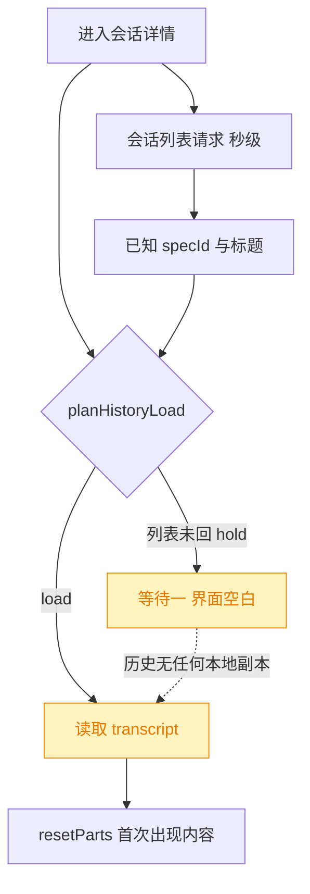
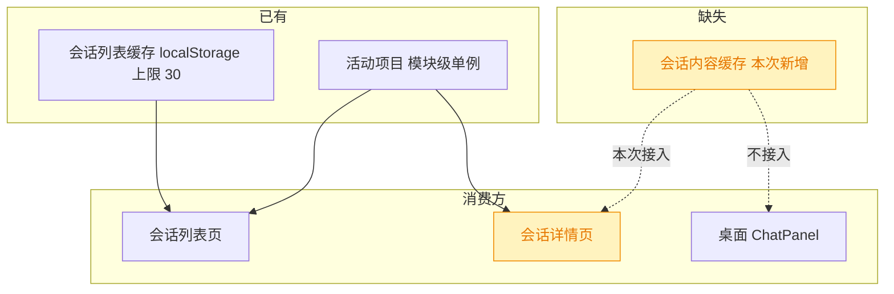
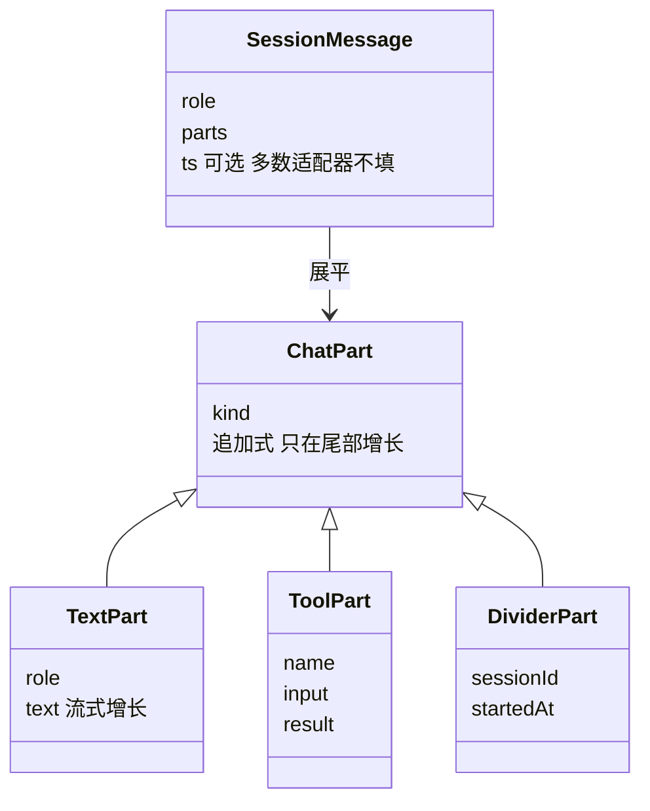
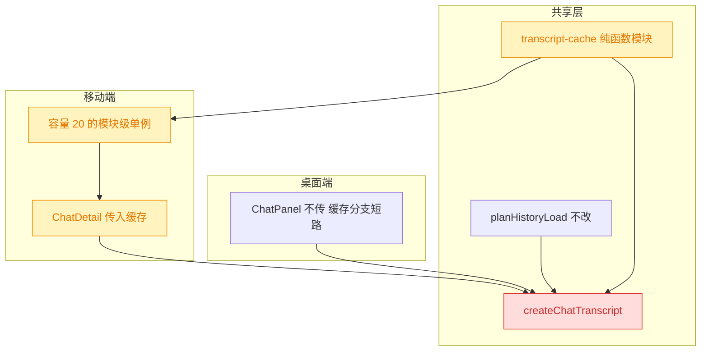
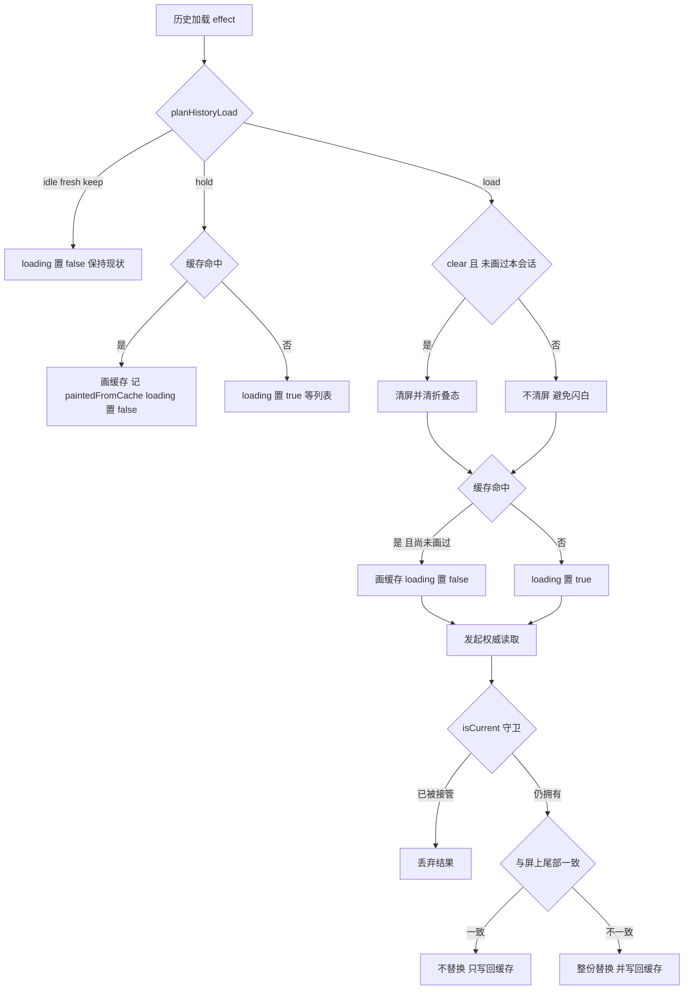

# 移动端会话详情 transcript 内存 LRU 缓存

## 1. 背景

移动端（`src/gui-mobile`）每次进入会话详情页 `/m/sessions/:id` 都要空等一段时间才出现消息，页面在此期间显示「加载中…」。原始需求：

> 移动端每次进入 session 详情页总是要等一段时间，本地内存实现 LRU 缓存 20 个 session 内容；优先使用缓存内容，数据获取成功之后，检测最后一个 message 对象与缓存是否一致，不一致则替换新数据。

会话列表页已经有同构的「缓存优先 + 网络覆盖」实现（`src/gui-mobile/src/lib/session-cache.ts`），本次是把同一套体感补到详情页的消息区。

## 2. 需求

1. 在本地**内存**中以 LRU 策略缓存最近 20 个 session 的会话内容（transcript），不落盘。
2. 进入会话详情页时优先渲染缓存内容，不再空等网络。
3. 网络数据获取成功后，比对最后一条消息与缓存是否一致：一致则保留屏上内容不做替换，不一致则整份替换为新数据。
4. 桌面端（`src/gui`）行为保持不变。
5. 缓存只参与渲染，绝不参与任何写路径（发送 / 中止 / 会话创建）。

## 3. 现状分析

### 3.1 详情页的两段等待，都发生在共享 hook 里

`ChatDetail` 自己不读消息接口，编排全部委托给共享 hook `createChatTranscript`。真正的读取只在一个 effect 里发生，读到的 `ChatPart[]` 通过 `resetParts(next)` 灌进唯一的 `parts` 信号。

进入页面到出现内容之间，实际上串着**两段**等待，而不是一段：

- **第一段（`hold`）**：详情页的标题与 `specId` 只能从会话列表接口里查（后端没有单会话 GET），而列表请求要合并所有 adapter 的 transcript 扫描，慢到秒级。列表没回来之前 `known` 为 false，`planHistoryLoad` 返回 `hold`——**不许清屏也不许读**，因为此刻 `specId` 不是「未知」而是「有误导性」。
- **第二段（`load`）**：列表落地后才发起 transcript 读取，又是一发网络。

两段期间 `blocks()` 恒为空，`historyLoading` 恒为 true，页面稳定显示「加载中…」。

精确层：链路上的文件、判定点与既有不变量

- 页面：`src/gui-mobile/src/pages/ChatDetail.tsx`。`sessions` 是一个 `createResource(listSessions)`，`current()` 从中查本会话；`listPending: () => sessions.loading`、`known: () => Boolean(current())` 传给 hook。
- 消息区已是三态（上一个 spec 落的）：`historyLoading` 为真 → `common.loading`；否则 `blocks().length > 0` → 列表，为空 → `chat.empty` / `chat.draftEmpty`。
- 编排：`src/gui-shared/lib/chat-transcript.ts` 的「session selection → load history」effect。读取分两条路：`api.getSpecMessages(pid, plan.specId).then(specMessagesToParts)` 或 `api.getSessionMessages(pid, sid).then(messagesToParts)`。
- 计划纯函数：`src/gui-shared/lib/chat-history-load.ts` 的 `planHistoryLoad`，五个动作 `idle | fresh | hold | keep | load`；`createHistoryLoadGate` 的 token 守卫决定一次在途读取是否还拥有消息区。
- 关键不变量（注释里已写明，本次必须继续守住）：① 绝不用猜测写 `displayedSid` / `displayedSpecId`；② 记住的是屏上内容的 **scope**（session 还是 spec），不只是 session；③ 在途读取只被真正的接管作废，不被无关的 effect 重跑作废。
- 移动端导航是卸载/挂载：从列表进详情会重新挂载 `ChatDetail`，hook 连同 `parts` / `displayedSid` 一起重建，所以上一次看过的内容在组件层面没有任何留存。

### 3.2 现有缓存设施：只有列表级、且是 localStorage

仓库里已有的缓存只有一处，缓存的是**会话列表**而非会话内容；`gui-shared` 下没有任何缓存/store 基础设施，桌面端 `ChatPanel` 同样没有内容缓存可参照。移动端的「全局单例」既有范式是模块级 `createSignal` + 模块级 resource。

精确层：既有缓存与单例的实现位置

- `src/gui-mobile/src/lib/session-cache.ts`：`readSessionCache` / `writeSessionCache`，key 前缀 `yorz.m.sessions.`，`MAX_ENTRIES = 30`，写入时剥掉瞬时的 `running` 字段；异常一律当「没有缓存」。消费方 `src/gui-mobile/src/pages/Sessions.tsx`：一个独立 `list` 信号，一个 effect 先塞缓存、另一个在 `sessions.state === 'ready'` 时整份替换并写回。
- `src/gui-mobile/src/lib/active-project.ts`：模块级信号 + localStorage 的单例范式。
- `src/gui-shared/lib/` 只有纯函数工具与两个 Solid hook（`chat-transcript.ts`、`attachments.ts`），无 LRU、无 Map cache。
- 桌面端 `src/gui/src/components/ChatPanel.tsx` 调的是同一个 `createChatTranscript`，其 localStorage 仅用于面板宽度/折叠等 UI 偏好。

### 3.3 消息对象没有 id，"最后一条是否一致"必须自己定义口径

需求里的「最后一个 message 对象」在本仓库没有现成的身份字段：wire 层的 `SessionMessage` 只有 `role` / `parts` / 可选 `ts`，**没有 uuid/id**，而 `ts` 在两个主力 adapter 里根本不填。渲染层的 `ChatPart` 同样无 id，`ToolsSegment.id` 只是 `groupParts` 现算的计数器。

精确层：类型全文与 ts 缺失的证据

- `src/gui-shared/api/index.ts`：`MessagePart` 三态（`text` / `tool-use` / `tool-result`）、`SessionMessage { role; parts; ts? }`、`SpecSessionMessages { sessionId; kind; createdAt; messages }`、`SessionInfo { id; title; kind; createdAt; updatedAt; specId?; running? }`。
- `src/gui-shared/lib/chat-blocks.ts`：`ChatPart = TextPart | ToolPart | AgentContextPart | DividerPart`；`ToolsSegment.id` 的注释明确写着它是 `groupParts` 分配的单调计数器，对象身份不跨渲染存活。
- `ts` 缺失：`src/service/agent-sdk/claude-adapter.ts` 与 `codex-adapter.ts` 的 `out.push({ role, parts })` 均不带 `ts`，只有 `opencode-adapter.ts` 填。
- 追加式增长的依据：`chat-transcript.ts` 的 `withAssistantText` / `pushPart` 只在尾部追加或替换最后一个 text part，SSE 与 transcript 读取产出的是同一份 `ChatPart` 流。

## 4. 技术实现方案

### 4.1 总体形状：纯函数缓存模块 + hook 上的可选注入点

新增一个**平台无关的纯函数模块** `src/gui-shared/lib/transcript-cache.ts`（LRU 容器 + key 构造 + 尾部比对），由 `createChatTranscript` 通过**新增可选参数** `transcriptCache` 消费；移动端在 `src/gui-mobile/src/lib/transcript-cache.ts` 建容量 20 的模块级单例并传入，桌面端不传 → 所有缓存分支短路，行为逐字不变。

> 决策说明：缓存放 `gui-shared` 而不是 `gui-mobile`。唯一能写 `parts` 的地方是共享 hook 的历史加载 effect，缓存必须在那里落点；而 vitest 只收 node 环境下的 `src/**/*.test.ts`，把 LRU 与比对写成不碰 `window` 的纯函数才可测。
>
> 决策说明：做成**可选注入**而不是 hook 内部自建单例。桌面端的会话切换在同一个挂载实例里完成、`parts` 本来就没被卸载清掉，缓存对它收益有限，却会把 `hold` 期的乐观绘制这一新行为强加给桌面的 scope 纠正路径。不传即完全不变，是把本次风险锁死在移动端的最省事做法。
>
> 决策说明：不缓存 `ChatBlock[]`，只缓存 `ChatPart[]`。`groupParts` 每次都新建对象、`ToolsSegment.id` 是现算计数器，缓存 blocks 等于把一层易变的派生结构固化下来；缓存 parts 则和 `resetParts(next)` 的入参严格同型。

### 4.2 缓存 key 必须带 scope，value 记住它是以哪种 scope 读到的

同一个 `sid`，在「属于某个 spec」与「普通会话」两种情形下读的是**两个不同接口**、内容量级完全不同（spec 聚合会把该 spec 名下每一轮 session 都拼进来）。缓存以 `projectId + sessionId` 为 key（一个会话只留最新的一份），value 里带上 `specId` 记住这份内容是以哪种 scope 读到的，供 `hold` 期乐观绘制后的自我纠正使用。

精确层：缓存模块的导出与语义

- 文件：`src/gui-shared/lib/transcript-cache.ts`
- `transcriptCacheKey(projectId, sessionId): string` —— 以不可能出现在 id 里的分隔符拼接。
- `TranscriptCacheEntry { specId?: string; parts: ChatPart[] }` —— `specId` 是这份 parts 被读出来时的 scope；`undefined` 表示单会话 transcript。
- `TranscriptCache { get(key); set(key, entry); clear(); readonly size }`。
- `createTranscriptCache(capacity = 20): TranscriptCache` —— 基于 `Map` 的插入序：`get` 命中后 `delete` + `set` 完成 touch；`set` 先 `delete` 再 `set`，超容时循环删 `keys().next().value`。
- `samePartTail(a: ChatPart[], b: ChatPart[]): boolean` —— 见 4.4。
- 移动端单例：`src/gui-mobile/src/lib/transcript-cache.ts` 导出 `createTranscriptCache(20)` 的结果，与 `active-project.ts` 同为模块级单例范式。

> 决策说明：key 不带 scope、value 带 scope。带 scope 的 key 会让同一会话在两种 scope 下各存一份，20 的容量被腰斩，而两份里总有一份是错的；一个会话只留最新一份、并记住它是哪种 scope，才能在 `hold` 期先画出来、在真相到达后判断要不要换。
>
> 决策说明：容量固定 20（需求指定），不设字节上限。缓存持有的是**渲染时就已经存在的同一批 `ChatPart` 对象引用**，不做深拷贝，代价只是离开页面后这批对象晚一点被回收；再加一层按体积裁剪的启发式，收益不明而复杂度实打实。

### 4.3 读取流程：`hold` 与 `load` 两处都先画缓存

改造集中在 `chat-transcript.ts` 的历史加载 effect，新增一个 hook 内变量 `paintedFromCache`（当前屏上内容是哪个 sid 的缓存乐观绘制），其余不变量原样保留。

要点：

- **`hold` 期只绘制、不记账**：命中缓存时只调 `resetParts(entry.parts)`，**绝不**写 `displayedSid` / `displayedSpecId`。这守住了不变量 ①——列表落地后 plan 仍会给出 `load`，权威读取照常发生。
- **`load` 期不重复清屏**：`plan.clear` 的清屏语义是「即将换成另一段对话」，但如果这段内容正是我们刚为**同一个 sid** 画上去的缓存，清掉就等于把好不容易消除的白屏又还回去。故 `clear` 时以 `paintedFromCache !== sid` 为附加条件；折叠态 `resetExpanded()` 跟随同一条件（同一会话的展开态仍然有意义）。
- **scope 不匹配也照画**：`hold` 期还不知道 scope，`load` 期缓存 scope 可能与 `plan.specId` 不同（例如上次以单会话读到、这次该读 spec 聚合）。此时缓存内容是「正确内容的一个子集」，画出来比空白好，且随后的权威读取必然判定尾部不一致并整份替换。
- **写回时机**：权威读取成功且通过 `isCurrent()` 守卫后写缓存（空数组不写，避免下次命中一个必然渲染空态的条目）；hook `onCleanup` 时若屏上有内容且 `displayedSid` 非空，再写一次——这一份包含了本次 SSE 流式追加的新一轮，比读取时那份更完整。
- **`paintedFromCache` 的清除**：权威读取落地、`reset()` / `resetAll()` 时清空。

精确层：effect 内的落点与守卫顺序

- 落点全部在 `src/gui-shared/lib/chat-transcript.ts` 的「session selection → load history」effect 内，`plan` 计算之后：
  1. `!pid` 分支不动（置 false 返回）。
  2. `hold` 分支：先尝试 `cache.get(transcriptCacheKey(pid, sid))`，命中且 `entry.parts.length > 0` 且 `paintedFromCache !== sid` 时 `resetParts(entry.parts)`、`paintedFromCache = sid`、`setHistoryLoading(false)`；已画过则直接 `setHistoryLoading(false)`；未命中维持现有的 `setHistoryLoading(true)`。
  3. `idle` / `keep` / `fresh` 分支不动。
  4. `load` 分支：`if (plan.clear && paintedFromCache !== sid) { resetParts(); resetExpanded() }`，随后写 `displayedSid` / `displayedSpecId`、`historyGate.begin()`；再做与 `hold` 同款的缓存绘制，命中则 `setHistoryLoading(false)`、未命中 `setHistoryLoading(true)`。
  5. `.then(next)`：`isCurrent()` 为假直接 return（现状）；为真时 `paintedFromCache = ''`，`if (!samePartTail(parts(), next)) resetParts(next)`，`setHistoryLoading(false)`，`next.length > 0` 时写缓存（`{ specId: plan.specId, parts: next }`）。
  6. `.catch`：现状不变（仅 `isCurrent()` 时置 false）；缓存已绘制的内容留在屏上，读取失败不再退回空白。
- `reset()` 内追加 `paintedFromCache = ''`（`resetAll()` 经它级联）。
- 既有 `onCleanup`（清 flushTimer + `historyGate.invalidate()`）内追加写回：`displayedSid` 非空且 `parts().length > 0` 时 `cache.set(transcriptCacheKey(pid, displayedSid), { specId: displayedSpecId, parts: parts() })`；`pid` 取 `o.projectId()`。
- 所有缓存分支均以 `o.transcriptCache` 是否存在为前置条件，桌面端走不到。

> 决策说明：不顺手给 `ChatDetail` 的 `sessions` 列表也接上 localStorage 缓存来消灭 `hold`。那会让 `specId` 变成一个来自磁盘的猜测去驱动 `known`，直接顶撞不变量 ①；而 `hold` 期的乐观绘制只动像素、不动记账，同样把白屏消掉却不改变判定路径。
>
> 决策说明：`ChatDetail.tsx` 本次不改渲染分支。缓存命中即 `historyLoading` 置 false 且 `blocks()` 非空，现有三态判断天然落到「渲染消息列表」，无需第四态。

### 4.4 尾部一致性口径：长度 + 最后一个 part 的字段比对

`samePartTail(a, b)`：长度不等 → 不一致；都为空 → 一致；否则逐字段比对最后一个 part。

- `text`：`role` + `text` 全文相等。
- `tool`：`name` + `result` 全文相等，**不比 `input`**。
- `context`：`contextKind` + `text` 相等。
- `divider`：`sessionId` + `startedAt` 相等。
- `kind` 不同直接不一致。

> 决策说明：只比尾部而不做全量深比，是需求指定的口径，也恰好与数据形状吻合——part 流只在尾部增长（`withAssistantText` 替换最后一个 text part，`pushPart` 追加），中间被就地改写的情形不存在。长度相等而尾部不同的唯一现实来源，正是「上次缓存的是流式进行到一半的最后一条」，而这恰恰是要检出来的那一种。
>
> 决策说明：不比 `input`。工具入参不是流式增长的（一次性下发），在「同长度 + 同 name + 同 result」的前提下再比 `input` 只会为一个可能上 MB 的对象做序列化，代价与收益不成比例。
>
> 决策说明：不用 `SessionInfo.updatedAt` 当版本戳。它在 claude adapter 里就是 transcript 文件的 mtime，粒度与语义都不是「最后一条消息变了没有」，而且要拿到它得先等那发慢列表——正是本次要绕开的东西。

### 4.5 验证方式

- 单元测试 `src/gui/src/lib/__tests__/transcript-cache.test.ts`（`gui-shared` 的逻辑测试按既有惯例落在桌面端目录，`@shared` 别名在 vitest 里可用）：LRU 淘汰序、`get` 的 touch 行为、容量边界、key 构造、`samePartTail` 的四类 part 与长度/空数组分支。
- `pnpm run typecheck`（新增可选参数进 `ChatTranscriptOptions`）与 `pnpm test`。
- 真机/浏览器移动视图人工确认：二次进入同一会话立即出现内容、无「加载中」闪烁、无内容跳变；跑完一轮后再进入能看到最新一轮。

## 5. 待确认项

_暂无_

## 6. 任务清单

- [x] 新增 `src/gui-shared/lib/transcript-cache.ts`：导出 `transcriptCacheKey(projectId, sessionId)`、`TranscriptCacheEntry`、`TranscriptCache`、`createTranscriptCache(capacity = 20)`、`samePartTail(a, b)`（验收：模块不引用 `window` 与 `solid-js`，`pnpm run typecheck` 通过）
- [x] 实现 `createTranscriptCache` 的 LRU 语义：`Map` 插入序，`get` 命中后 `delete` + `set` 完成 touch，`set` 先 `delete` 再 `set`，超容循环删最旧 key（验收：容量 20 时插入第 21 条淘汰最久未访问项）
- [x] 实现 `samePartTail`：长度不等即不一致、双空即一致，否则按 `kind` 逐字段比对最后一个 part（text 比 role+text、tool 比 name+result、context 比 contextKind+text、divider 比 sessionId+startedAt，不比 tool 的 input）（验收：`kind` 不同直接返回 false）
- [x] 新增 `src/gui/src/lib/__tests__/transcript-cache.test.ts`：覆盖 LRU 淘汰序、`get` 的 touch 效果、容量边界、key 构造、`samePartTail` 的四类 part 与长度/空数组分支（验收：`npx vitest run` 该文件全绿）
- [x] 在 `src/gui-shared/lib/chat-transcript.ts` 的 `ChatTranscriptOptions` 新增可选字段 `transcriptCache?: TranscriptCache`，并在 hook 内声明 `paintedFromCache` 变量（验收：桌面端不传该参数时编译无错，`pnpm run typecheck` 通过）
- [x] 在历史加载 effect 的 `hold` 分支加入缓存乐观绘制：命中且 parts 非空且未画过本 sid 时 `resetParts(entry.parts)` + 记 `paintedFromCache` + `setHistoryLoading(false)`，未命中维持 `setHistoryLoading(true)`；**不写** `displayedSid` / `displayedSpecId`（验收：读代码确认该分支无任何对两个 displayed 变量的赋值）
- [x] 在 `load` 分支把清屏条件改为 `plan.clear && paintedFromCache !== sid`（`resetParts()` 与 `resetExpanded()` 同条件），并在 `historyGate.begin()` 之后加入同款缓存绘制，命中置 `historyLoading` 为 false、未命中置 true（验收：缓存命中时不产生空屏帧）
- [x] 在读取成功回调内（`isCurrent()` 守卫之后）清 `paintedFromCache`、用 `samePartTail(parts(), next)` 判定是否 `resetParts(next)`，并在 `next.length > 0` 时写回缓存 `{ specId: plan.specId, parts: next }`（验收：尾部一致时屏上数组引用不变）
- [x] 在 `reset()` 内清 `paintedFromCache`，在既有 `onCleanup` 内追加写回：`displayedSid` 非空且 `parts()` 非空时写缓存 `{ specId: displayedSpecId, parts: parts() }`（验收：`resetAll()` 经 `reset()` 级联清除，卸载时缓存含本次流式追加的内容）
- [x] 新增 `src/gui-mobile/src/lib/transcript-cache.ts`：模块级单例 `createTranscriptCache(20)`，注释说明为何是内存而非 localStorage（验收：与 `active-project.ts` 同为模块级单例范式）
- [x] 在 `src/gui-mobile/src/pages/ChatDetail.tsx` 的 `createChatTranscript` 调用中传入该单例（验收：`pnpm run typecheck` 通过，页面渲染分支未改动）
- [x] 运行 `pnpm run typecheck` 与 `pnpm test`，并对改动文件跑 prettier（验收：typecheck 通过、无新增测试失败，结果写入执行记录）
- [ ] [manual] 真机/浏览器移动视图人工确认：二次进入同一会话立即出现内容、无「加载中」闪烁、无内容跳变；跑完一轮后再进入能看到最新一轮（验收：人工回复确认）

## 7. 执行记录

- 新增 `src/gui-shared/lib/transcript-cache.ts`：`TRANSCRIPT_CACHE_CAPACITY = 20`、`transcriptCacheKey`（以 `` 分隔，project/session id 都不可能含它）、`TranscriptCacheEntry { specId?; parts }`、`createTranscriptCache(capacity)`（`Map` 插入序 LRU，`get`/`set` 均 `delete` + `set` 完成 touch，超容循环删 `keys().next()`，容量下限夹到 1）、`samePartTail`（长度 + 最后一个 part 逐字段比对，tool 的 `input` 不比）。模块无 `window`、无 `solid-js` 依赖。
- 新增 `src/gui/src/lib/__tests__/transcript-cache.test.ts`（20 条）：key 构造与跨项目不冲突、同 key 只留一份、超容淘汰最久未用、`get` 与重复 `set` 各自算一次 use、默认容量 20 的边界、零容量不退化、`clear`；`samePartTail` 覆盖双空 / 长度增长 / 尾部相同 / 尾部流式增长 / role 不同 / kind 不同 / tool 的 name+result / 忽略 input / context / divider 九类分支。全绿。
- 改造 `src/gui-shared/lib/chat-transcript.ts`：`ChatTranscriptOptions` 新增可选 `transcriptCache`（桌面端不传即全部分支短路）；hook 内新增 `paintedFromCache` 与 `paintCached(pid, sid)` 辅助函数——命中且 parts 非空时 `resetParts`，**不写** `displayedSid` / `displayedSpecId`，返回值直接作为 `setHistoryLoading(!hit)` 的取反。
- 历史加载 effect：`hold` 分支由恒 `setHistoryLoading(true)` 改为 `setHistoryLoading(!paintCached(...))`（这段等的是那发秒级的会话列表，收益最大）；`load` 分支清屏条件加上 `paintedFromCache !== sid`（避免把刚画上去的同一会话缓存又抹掉，折叠态同条件保留），`historyGate.begin()` 之后同样走 `paintCached`；成功回调在 `isCurrent()` 守卫后清 `paintedFromCache`、`samePartTail(parts(), next)` 为假才 `resetParts(next)`、`next` 非空才写回缓存（带 `plan.specId`）。`catch` 分支未动——读取失败时缓存内容留在屏上，不再退回空白。
- `reset()` 与 `sendFromDraft()` 各补一处 `paintedFromCache = ''`；既有 `onCleanup` 追加写回：`displayedSid` 非空且 `parts()` 非空时把屏上最终内容（含本次 SSE 流式追加）写进缓存，这份比读取时那份更完整。
- 新增 `src/gui-mobile/src/lib/transcript-cache.ts` 模块级单例（容量 20），注释说明为何只放内存不落 localStorage；`ChatDetail.tsx` 在 `createChatTranscript` 调用中传入。页面的三态渲染分支**未改动**——缓存命中即 `historyLoading` 为 false 且 `blocks()` 非空，现有判断天然落到「渲染消息列表」。
- 验证：`pnpm run typecheck` 通过；前端全量 `npx vitest run src/gui src/gui-shared src/gui-mobile` 22 文件 / 264 测试全绿；改动文件已过 prettier。后端 `src/service/__tests__/git.test.ts`、`git-routes.test.ts`、`service.test.ts` 存在失败，全部是在临时仓库里 spawn 本地 `git` 并断言其 stderr 文案的环境相关用例（其中 `surfaces the underlying git stderr on failure` 与上一个 spec 记录的是同一条），与本次改动文件（`gui-shared` / `gui-mobile` / `gui` 测试）无任何交集。
- 收尾：非 manual 任务全部完成，待确认项为 `_暂无_`、无 `！！！` 批注、无 `## 追加任务` 的 `[open]` 条目，标记 `done`。剩余 `[manual]` 真机观感确认按约定不阻断收尾。
- 事故与恢复：为验证后端失败是否既有，执行 `git stash push -- <文件列表>` 时因清单含未跟踪文件而整条命令失败（未生成 stash），随后的 `git stash pop` 误把仓库中既有的 `stash@{0}`（他人 WIP，chat 工具输出渲染优化）应用进工作区并产生冲突。已用 `git checkout HEAD -- <该 stash 涉及的 7 个文件>` 完整还原，`git stash list` 五条 stash 全部完好、`stash@{0}` 未被 drop，工作区中他人正在进行的改动（移动端 slash 指令补全）未受影响。教训：本仓库工作区常有并行进行中的改动，不得使用 stash 做基线对比。
