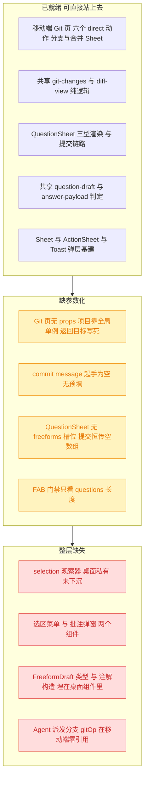
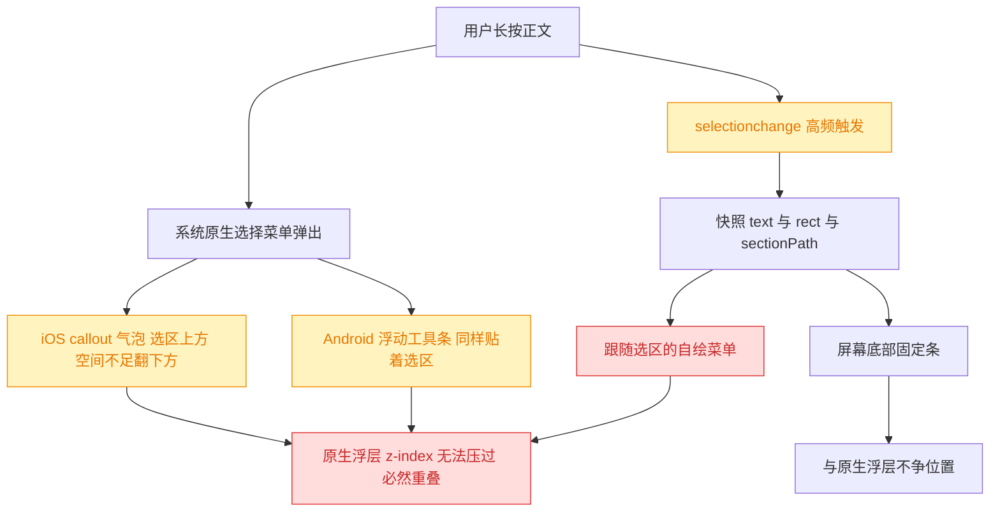
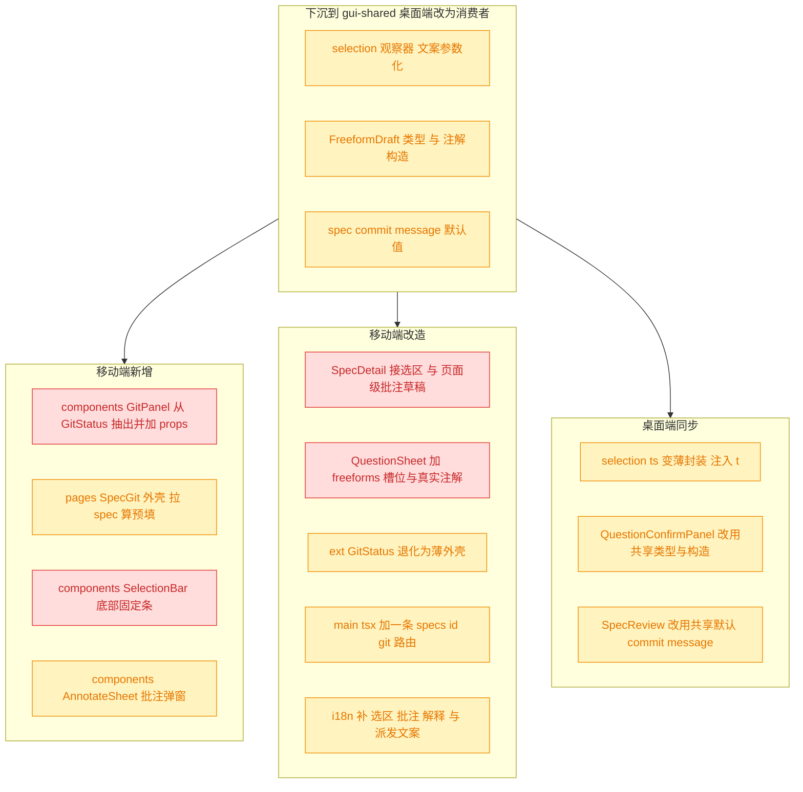
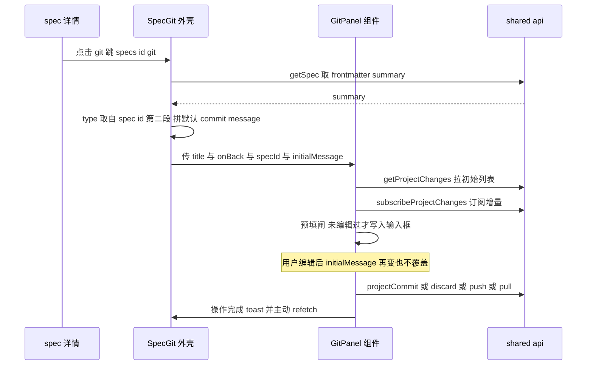
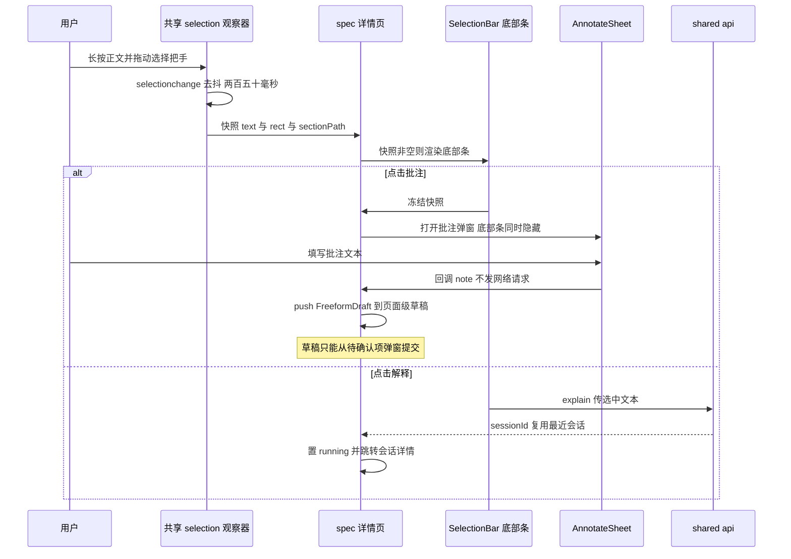
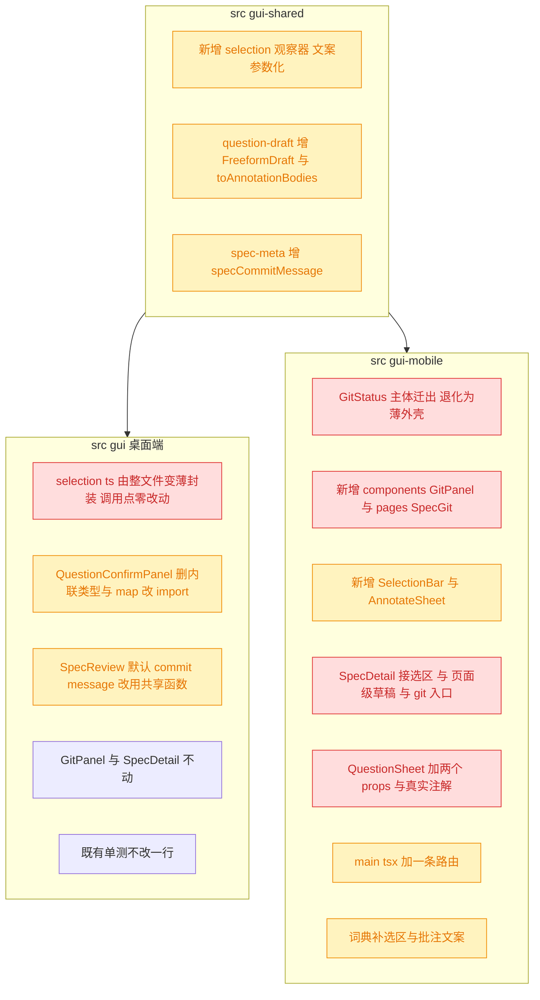

# 移动端 spec 详情三级页面与弹窗

## 1. 背景

上一个 spec [260906.feat.mobile-session-spec-detail](../260906.feat.mobile-session-spec-detail/spec.md) 已完成移动端 spec 详情页（`src/gui-mobile/src/pages/SpecDetail.tsx`）：正文渲染、meta 卡、待确认项 FAB + `QuestionSheet`、追加任务 `AppendSheet` 均已落地。同批的 [260906.feat.mobile-ext-secondary-pages](../260906.feat.mobile-ext-secondary-pages/spec.md) 完成了扩展页下的 Git 状态页（`pages/ext/GitStatus.tsx`，六个 direct 动作全量）。

两个 spec 各自留下了本次要补的缺口：

- spec 详情 meta 区的 `git` 按钮仍是 `onClick={comingSoon}`（`SpecDetail.tsx:320-323`），没有接到任何 git 页面。
- 移动端 Git 页刻意**不含 Agent 派发模式**，理由是「从扩展页进来没有 spec 上下文」（`GitStatus.tsx:34-36`）——本次从 spec 进入，这条理由消失。
- 移动端**没有正文选区能力**，`QuestionSheet` 的 `freeformAnnotations` 恒传 `[]`（`QuestionSheet.tsx:105-107`），桌面端「选中 → 批注 → 进待确认面板草稿 → 一次提交」这条链路在移动端整条缺失。

## 2. 需求

1. **git 三级页面**：spec 详情点击 `git` 进入对应页面，与桌面端（`src/gui/src/pages/SpecReview.tsx` + `components/GitPanel.tsx`）一样复用同一个 git 面板组件；从 spec 进入时把 summary 带进 commit message 输入框。
2. **待确认项弹窗**：参考桌面 `SpecDetail.tsx` 的待确认面板展示逻辑，移动端以弹窗形式承载待确认项内容，可显示/隐藏，入口放右下角、icon 触发（线框图见上一个 spec 的 `attachments/image-a2ce.png`）。
3. **选区菜单**：正文选中文本时弹出菜单，提供「批注」「解释」两项，参考桌面 `SpecDetail.tsx` 的实现。

### 2.1 需求边界澄清

需求 2 的 FAB + 弹窗骨架**上一个 spec 已经实现**（`SpecDetail.tsx:342-355` 的 `?` FAB、`QuestionSheet.tsx` 的 choice / confirm / freeform 三型渲染与提交链路）。对照桌面端 `QuestionConfirmPanel` 后，本次真正缺的是它**承载选区批注草稿**的那一半：桌面面板的 `showPanel` 门禁是 `questions().length > 0 || freeforms().length > 0`（`SpecDetail.tsx:124-129`），面板里除了问题卡还渲染可删除的批注草稿卡，提交时两者合成同一个 payload。移动端目前只有前一半。

因此需求 2 与需求 3 不是两件独立的事：**需求 3 产出批注草稿，需求 2 是这些草稿唯一的展示与提交出口**。本 spec 按这条依赖组织方案。

## 3. 现状分析

### 3.1 三条链路各自缺在哪一层

三条需求踩在完全不同的成熟度上：git 链路的纯逻辑与 UI 都已存在、只差参数化；待确认项弹窗只差草稿承载；选区链路则是从零——`selection.ts` 还是桌面私有文件，移动端连观察器都没有。



> 红 = 需要新建或从桌面下沉的整层；黄 = 既有代码开个口子即可。

<details>
<summary>三条链路的精确现状（文件 / 行号 / 依赖）</summary>

**Git 链路**

| 位置                                         | 规模   | 现状                                                                                                                                |
| -------------------------------------------- | ------ | ----------------------------------------------------------------------------------------------------------------------------------- |
| `src/gui-mobile/src/pages/ext/GitStatus.tsx` | 624 行 | `Component` 无 props；`projectId = () => activeProjectId() ?? undefined`（:55）；`onBack` 写死 `navigate('/ext')`（:279）           |
| 同上 `:41-53`                                | —      | 13 个信号，其中 `message`（:44）就是 commit 输入框状态，**起手为空**；单一 `busy: GitAction \| null`（:45）六动作共用一个闸         |
| 同上 `:62-96`                                | 35 行  | 「快照坑」处理：`getProjectChanges` HTTP 拉一次 + `subscribeProjectChanges` 订阅并行，`sawPush` 防慢快照覆盖、`disposed` 防卸载写入 |
| 同上 `:99-111`                               | —      | diff resource key 带 `diffRevision(change)`，提交/丢弃后自动失效重取                                                                |
| 同上 `:154-165`                              | —      | `run(action, fn)` 统一闸门：`setBusy` → `try/catch showToast(err,'error')` → `finally setBusy(null)`                                |
| 同上 `:242-277, 448-525`                     | —      | 页面级单例 `ActionSheet`（靠 `confirmingDiscard()` 分叉 items）+ 两个 `Sheet`（切换分支 / 两段式合并）                              |
| 同上 `:548-624`                              | 77 行  | 私有内部组件 `DiffBody`，未 export                                                                                                  |
| `src/gui/src/components/GitPanel.tsx`        | 745 行 | 桌面端；`GitPanelProps { projectId, specId?, initialMessage? }`（:47-53），三者都是 getter                                          |
| 同上 `:118-121`                              | 4 行   | 预填采纳闸：`if (msg && !userEditedMsg()) setCommitMessage(msg)` —— spec resource 异步 resolve 后回填，用户敲过键盘就永不覆盖       |
| 同上 `:622-643`                              | 22 行  | `Show when={hasSpec()}` 包住的 `fileSelectMode` RadioGroup（`manual` / `agent`）                                                    |
| `src/gui/src/pages/SpecReview.tsx:25-30`     | 6 行   | `defaultCommitMessage`：spec id 第二段取 type，拼 `${type}: ${summary}`，summary 为空时回退 `${type}: update`                       |
| `src/gui-shared/api/index.ts:392-447`        | —      | 全部 git REST 已在共享层；`gitOp(pid, specId, action)` 是**唯一需要 specId** 的方法，`GitOpsAction = 'commit'\|'discard'\|'stash'`  |
| `src/gui-shared/api/sse.ts:342-359`          | —      | `subscribeProjectChanges`，topic `project:${pid}:changes`，**不带 spec id**，所有 git 界面共享同一条流                              |

移动端 Git 页与桌面 `GitPanel` 的差异已被上一个 spec 收敛为三条（`GitStatus.tsx:29-37` 注释）：垂直排列而非左右分栏、无 Agent 派发、`ActionSheet`/`Sheet` 替代 Kobalte 浮层。前两条中的第二条正是本次要动的。

**待确认项链路**

- `src/gui-mobile/src/components/QuestionSheet.tsx`（309 行）props 为 `{ open, projectId, specId, questions, onClose, onSubmitted }`（:66-74），**无 `freeforms` / `onRemoveFreeform`**（对比桌面 `QuestionConfirmPanel.tsx:34-40`）。
- 提交处 `:105-118`：`freeformAnnotations: []` 恒空，且有一条桌面端没有的门禁 `if (built.items.length === 0) → toast + return`。**引入批注后这条必须放宽为 `items.length === 0 && annotations.length === 0`**，否则「只批注不答题」会被前端自己挡下。
- `:80-82` `createEffect` 在每次 `open` 变 true 时 `setAnswers(initialAnswers(...))` —— 弹窗关闭即草稿作废。桌面端 `freeforms` 是**页面级** signal（`SpecDetail.tsx:108`），跨 running / 跨面板隐藏都保留。语义相反，批注草稿必须提升到页面级。
- `FreeformDraft` 类型（`QuestionConfirmPanel.tsx:27-32`）与 `freeformAnnotations` 的构造（`:85-91`，丢掉 `id`）**都内联在桌面组件里，从未下沉**——这是共享层最明显的空档。
- 服务端 `src/service/routes/specs.ts:517-534` 校验：`sectionPath` / `quote` / `note` 三者都必须是非空字符串否则 400；`answers` 与 `freeformAnnotations` 不能同时为空。`spec-store.ts:172-212` 把每条渲染成 `> {sectionPath} 中 "{quote}"` + `> ！！！{note}`，并入 `## 用户批注`，强制 `stage: 'plan'`。

**选区链路**

`src/gui/src/lib/selection.ts`（88 行）是桌面私有，`src/gui-mobile` 零引用。

- `SelectionSnapshot { text, rect: DOMRect, sectionPath }`（:3-7）。`rect` 来自 `range.getBoundingClientRect()`，viewport 坐标。
- `sectionPath` 由 `findSectionHeading`（:11-28）**按文档序反向遍历**取最近的 H2/H3 文本，找不到回退 `t('selection.noSection')`（`gui/src/i18n/zh-CN.ts:441-443` = `(无章节)`）。这段纯 DOM、平台无关。
- 只监听 `document.addEventListener('selectionchange')`（:83），50ms 去抖（:43）。整个文件唯一的非纯依赖就是那一处 `t()`。
- `SelectionMenu.tsx`（50 行）吃 `snap.rect` 定位，硬编码 `MENU_HEIGHT=36` / `MENU_WIDTH=140`，默认放选区上方、顶部溢出时翻到下方，靠 `onMouseDown preventDefault`（:37）保住选区。
- `AnnotatePopover.tsx`（110 行）宽度硬编码 `POPOVER_WIDTH = 500`，内含 `MentionTextarea`（移动端无对应组件）。**375px 屏直接爆宽。**
- `SpecDetail.tsx:302-314` `submitAnnotate` **不发网络请求**，只往 `freeforms` push 一条草稿；`:320-324` `submitAnswers` 才 `submitQuestionAnswers` + `runAgent`。
- `api.explain(pid, id, text)`（`api/index.ts:383-391`）→ `POST .../specs/:id/explain`。服务端 `routes/specs.ts:274-308`：`text` 非空且 **≤ 4000** 否则 400；`isSpecRunning` 为真返 409；**复用最近会话不新建**（`latestSessionForSpec`），`trigger: 'explain'`，不写 spec 故不记 stage 迁移。

**移动端已有的、本次要避开的手势基建**：`lib/long-press.ts`（96 行）是为「更多操作」设计的，判定成立后在 document 捕获阶段挂 700ms `contextmenu` 拦截器（:32,45-49），元素自身 `onContextMenu` 无条件 `preventDefault`（:85），配套 `.no-callout`（`app.css:128-130` = `-webkit-touch-callout: none`）。**它与文本选择互斥**（500ms 内一有位移就 cancel），正文选区不能复用它，且正文容器不能带 `.no-callout` / `select-none`。

</details>

### 3.2 触屏选区与原生菜单的位置冲突

这是需求 3 唯一的硬约束，决定了移动端菜单形态不能照抄桌面。



<details>
<summary>桌面假设逐条在触屏上的失效点</summary>

| 桌面假设                                    | 位置                                          | 触屏后果                                                                        |
| ------------------------------------------- | --------------------------------------------- | ------------------------------------------------------------------------------- |
| `selectionchange` + 50ms 去抖足够           | `selection.ts:43,83`                          | 拖动选择把手期间高频触发，50ms 下菜单跟着手指抖；移动端需要更长去抖             |
| `rect` viewport 坐标 + `position: fixed`    | `selection.ts:74` / `SelectionMenu.tsx:32-36` | iOS visualViewport ≠ layoutViewport（键盘、页面缩放）时 `fixed` 会错位          |
| 选中即出菜单、无手势门槛                    | 整体                                          | 原生菜单**同时**出现且无法用 z-index 压过，跟随选区必然重叠                     |
| `onMouseDown preventDefault` 保住 selection | `SelectionMenu.tsx:37`                        | 触屏是 pointer 事件；`onMouseDown` 在 iOS 上晚于 selection 清除                 |
| 无 scroll 监听重算 rect                     | 无                                            | 滚动中 selection 未变但 rect 已过期，菜单停在错误位置（**桌面端也有这个 bug**） |
| `POPOVER_WIDTH = 500` 固定宽浮层            | `AnnotatePopover.tsx:15`                      | 375px 屏爆宽                                                                    |
| `MentionTextarea` 的 `@` 文件补全           | `AnnotatePopover.tsx:88-96`                   | 移动端无该组件（上一个 spec 已决定 chat 输入栏也不做提及补全）                  |

另有一条与 morphdom 的交互：正文靠 `morphdom` 增量 diff 刷新（`SpecDetail.tsx:170-210`），SSE 到达时被 patch 的节点上如果压着活跃 Range，选区会被浏览器悄悄折叠。桌面端同样存在，表现为「菜单突然消失」，不是本次引入的新问题，但移动端快照已冻结在信号里，用户点击时读的是快照而非 live selection，影响可控。

</details>

## 4. 技术实现方案

### 4.1 总览：三条链路的落点

沿用两个前序 spec 已验证的范式——**纯逻辑与判定下沉 `src/gui-shared/`，桌面端同步改为消费者；JSX 两端各写一份**（约定见 `src/gui-mobile/README.md:52-63`「页面级 UI、布局、外壳交互不属于共享范围」）。本次不新增任何后端端点。



> 红 = 结构性新增或语义改写；黄 = 搬运 / 开槽位 / 薄封装，语义不变。

> 决策：**不把 git 面板做成跨端共享的 `.tsx`**。桌面 `GitPanel` 745 行里有 Kobalte Select / Popover / RadioGroup / Checkbox / Dialog 五类浮层、左右分栏、`⌘+Enter` 快捷键与 `title=` tooltip；移动端对位物是 `Sheet` / `ActionSheet` / 手写 `role="checkbox"` / 垂直堆叠。参数化后 props 会退化成一堆 class 字符串与浮层开关。被否决的备选是「把桌面 GitPanel 参数化后两端共用」——两端已各自沉淀 600+ 行成熟 JSX，合并的收益远小于回归风险。**「跟 PC 一样复用 gitpanel 组件」在移动端的对应实现，是把已有的 `GitStatus.tsx` 主体抽成移动端自己的 `GitPanel` 组件、被两个页面外壳共用**——与桌面 `GitPanel` + `GitStatus.tsx`(34 行) + `SpecReview.tsx`(61 行) 的结构完全同构。

> 决策：**`IS_MAC` / `COMMIT_SHORTCUT` 那段不搬**（`GitPanel.tsx:61-65`）。其正则 `/mac|iphone|ipad|ipod/i` 会把 iPhone 判成 mac，移动端 placeholder 会显示 `⌘ + Enter`；且触屏没有该快捷键语义。同理 `COMMIT_MIN_ROWS` / `COMMIT_MAX_ROWS`（`:56-57`）是桌面端定义未使用的死代码，不要照搬。

### 4.2 git 三级页面

新路由 `/specs/:id/git`，把移动端 Git 页拆成「面板组件 + 两个页面外壳」。



<details>
<summary>路由、组件切割与预填链路（精确层）</summary>

**路由**（`src/gui-mobile/src/main.tsx`，现有 14 条）新增一条：

```
<Route path="/specs/:id/git" component={SpecGit} />
```

`/specs/new` 与 `/specs/:id` 的既有先后顺序不受影响（新路由深度不同）。`lib/routes.ts` 的 `TAB_PATHS` 是精确匹配，`isTabRoute('/specs/x/git')` 返回 false → TabBar 自动不渲染，无需改动。

**组件切割**：`pages/ext/GitStatus.tsx`（624 行）主体整体迁入新建 `src/gui-mobile/src/components/GitPanel.tsx`，包括 `DiffBody`（`:548-624`，仍作私有内部组件，本次不额外抽 `DiffView`）。props：

```ts
export interface GitPanelProps {
  /** 顶栏标题，两个入口各自给（扩展页给 git.title，spec 页给 spec id）。 */
  title: string
  /** 返回目标显式给出，不用 history.back()（PWA 冷启二级页会退出应用）。 */
  onBack: () => void
  /** 存在 ⇒ spec 上下文，开启 Agent 派发模式（见 5.1 待确认）。 */
  specId?: () => string | undefined
  /** 预填 commit message；采纳闸见下。 */
  initialMessage?: () => string
}
```

`projectId` **不进 props**：移动端是 `activeProjectId()` 全局单选模型（`lib/active-project.ts:44`），两个入口拿到的项目必然相同，多一个 props 只会制造「两个真相」。这与桌面端把 `projectId` 作为 props 的做法不同，因为桌面端项目来自路由参数 `/:projectId/...`。

`Page` 外壳留在 `GitPanel` 内（`fill` / `actions` / `footer` 三者与面板内部状态耦合太深：`actions` 是「更多」按钮、`footer` 是 commit 栏、`fill` 是「列表 38dvh + diff flex-1」布局的前提），`title` / `onBack` 由 props 注入。

两个外壳：

- `pages/ext/GitStatus.tsx` 退化为约 15 行：`<GitPanel title={t('git.title')} onBack={() => navigate('/ext')} />`。
- 新建 `pages/SpecGit.tsx` 约 40 行：`useParams<{ id: string }>` + `createResource` 拉 `api.getSpec`，`onBack={() => navigate('/specs/' + params.id)}`，传 `specId` 与 `initialMessage`。

**commit message 预填**：桌面 `SpecReview.tsx:25-30` 的默认值算法下沉为共享纯函数，放进已有的 `src/gui-shared/lib/spec-meta.ts`（那里已有 `splitSpecId`，`YYMMDD.feat.name` → `{ prefix, type, suffix }`）：

```ts
/** spec 作用域 git 页的默认 commit message：`<type>: <summary>`。 */
export function specCommitMessage(specId: string, summary: string | undefined): string
```

实现复用 `splitSpecId(specId)?.type ?? 'feat'`，`summary` 去空后为空时回退 `update`——与桌面端逐字等价（桌面现在是自己 `split('.')` 取第二段，本次改为消费共享函数，行为不变）。

**采纳闸**原样搬 `GitPanel.tsx:118-121`，一个字都不改：

```ts
const [userEditedMsg, setUserEditedMsg] = createSignal(false)
createEffect(() => {
  const msg = props.initialMessage?.() ?? ''
  if (msg && !userEditedMsg()) setCommitMessage(msg)
})
```

必须配套：现有 `<textarea onInput>`（`GitStatus.tsx` commit 栏）里先 `setUserEditedMsg(true)` 再写值。没有这个闸，`getSpec` 异步 resolve 会把用户已经敲进去的信息冲掉。

**入口改造**：`SpecDetail.tsx:318-323` 的 git 按钮 `onClick={comingSoon}` → `navigate('/specs/' + params.id + '/git')`，并去掉 `text-muted-foreground` 的降级配色（与「追加任务」按钮同一形态）。`debug` 按钮维持 `comingSoon` 不动——不在本次需求内。

**不动的部分**（避免回归）：`:62-96` 的快照坑双路加载、`:99-111` 的 `diffRevision` key、`:154-165` 的 `run()` 闸门、`:242-277` 的单例 ActionSheet 分叉、两个分支 Sheet、`.truncate-start` 路径展示、`w-9` 行号列，全部原样迁移。

</details>

#### Agent 派发模式（已确认放行）

> 决策记录：待确认项「移动端 spec 作用域 git 页开启 Agent 派发模式」—— 用户确认，按此推进，理由：未填写（确认型默认放行）。

`GitPanel` 在 `specId()` 非空时（仅 spec 入口）多渲染一个二选一「手动选择 / 交给 Agent」，与桌面 `GitPanel.tsx:622-643` 的 `Show when={hasSpec()}` + `fileSelectMode` RadioGroup 语义对齐。

<details>
<summary>模式切换的状态机与禁用矩阵（精确层）</summary>

**状态扩容**：移动端现有单一闸 `busy: GitAction | null`（`GitStatus.tsx:45`）表达不了「agent 轮次在飞」——后者不由 `await` 结束，而由 SSE 的 `turn-completed` / `error` 收尾。按桌面端 `GitPanel.tsx:89-90,201-224` 的分法再加一个信号：

```ts
type FileSelectMode = 'manual' | 'agent'
const [mode, setMode] = createSignal<FileSelectMode>('manual')
/** agent 轮次在飞时非 null；由 subscribeSession 的 turn-completed / error 落回。 */
const [agentKind, setAgentKind] = createSignal<GitOpsAction | null>(null)
const anyRunning = createMemo(() => busy() !== null || agentKind() !== null)
```

原有 `run()` 闸门的 `busy() !== null` 判定统一换成 `anyRunning()`，六个 direct 动作与 agent 轮次互斥。`roundUnsub` 用 `onCleanup` 兜底，页面卸载不留悬空订阅（对齐 `GitPanel.tsx:113-114`）。

**禁用矩阵**（`mode` 只影响 commit / discard 两个动作，其余四个仓库级动作恒走 direct）：

| 动作                       | manual                        | agent                                    |
| -------------------------- | ----------------------------- | ---------------------------------------- |
| commit                     | `projectCommit` 传勾选 paths  | `gitOp(pid, specId, 'commit')` 派发轮次  |
| discard                    | `projectDiscard` 传勾选 paths | `gitOp(pid, specId, 'discard')` 派发轮次 |
| push / pull                | direct                        | direct（不受 mode 影响）                 |
| checkout / merge           | direct                        | direct（不受 mode 影响）                 |
| 文件勾选列表 / 全选        | 渲染                          | **整段隐藏**（agent 自己决定范围）       |
| commit 按钮的 `selected>0` | 参与 `canCommit` 判定         | **不参与**（无勾选也可派发）             |

**派发后的收尾**：`gitOp` 返回 `{ runId, sessionId }` → `trackRound(kind, sessionId)` 挂 `subscribeSession` → 立即 `navigate('/sessions/' + encodeURIComponent(sessionId))` 看输出（沿用 `QuestionSheet` / `AppendSheet` 已确立的「拿到 sessionId 就跳」先例；桌面端那句 `requestChatSession` 是侧栏语义，移动端不适用）。跳转后本页卸载，`onCleanup` 会退订——`agentKind` 的作用因此只覆盖「派发中到跳转前」这一小段，但仍必须存在：`gitOp` 失败时页面不跳，闸必须能自己落回。

`discard` 在 agent 模式下作用于整个工作区，`ActionSheet` 的确认文案换成 `git.discardAllHint`（对齐桌面 `review.confirmDiscardAll`），不与 manual 的按选中丢弃共用一句。

</details>

### 4.3 待确认项弹窗承载批注草稿

`QuestionSheet` 开出 `freeforms` 槽位，与桌面 `QuestionConfirmPanel` 对齐；草稿状态提升到 `SpecDetail` 页面级。

<details>
<summary>props 变更、草稿寿命与提交 payload（精确层）</summary>

**共享层新增**（`src/gui-shared/lib/question-draft.ts`，已有 `initialAnswers` / `countUnanswered` / `buildAnswerItems` / `impactAccent`）：

```ts
/** 选区批注的本地草稿；id 仅供列表 key 与删除，不进 payload。 */
export interface FreeformDraft {
  id: string
  sectionPath: string
  quote: string
  note: string
}
/** 草稿 → 提交体。丢掉 id，字段顺序与服务端校验一致。 */
export function toAnnotationBodies(drafts: readonly FreeformDraft[]): AnnotationBody[]
/** 生成草稿 id，与桌面端 `f-${Date.now()}-${index}` 同形。 */
export function newFreeformId(index: number): string
```

桌面 `QuestionConfirmPanel.tsx` 删掉 `:27-32` 的类型定义与 `:85-91` 的内联 `.map()`，改为 import（`SpecDetail.tsx` 的 `import type { FreeformDraft }` 引用点随之改指共享层）。

**移动端 `QuestionSheet` props 增加两项**（与桌面 `QuestionConfirmPanel.tsx:34-40` 同名同序）：

```ts
freeforms: FreeformDraft[]
onRemoveFreeform: (id: string) => void
```

**草稿寿命**：`freeforms` 提升为 `SpecDetail` 的页面级 signal（对齐桌面 `SpecDetail.tsx:108`）。`QuestionSheet.tsx:80-82` 的 open-reset 只重置 `answers`，**不碰 freeforms**——弹窗关掉再打开，批注还在；页面卸载才丢（与桌面同口径，不做 localStorage 持久化）。

**渲染**：批注草稿卡放在问题卡之后（桌面 `QuestionConfirmPanel.tsx:318-340` 同序），每张显示 `sectionPath` + `quote.slice(0, 200)` + `！！！{note}`，右上角 44px 删除按钮调 `onRemoveFreeform(id)`。

**提交链路**改两处（`QuestionSheet.tsx:105-129`）：

```ts
const annotations = toAnnotationBodies(props.freeforms)
const payload: QuestionAnswersBody = { answers: built.items, freeformAnnotations: annotations }
// 门禁放宽：只批注不答题也是合法提交（服务端只要求两者不同时为空）
if (built.items.length === 0 && annotations.length === 0) {
  toast(unanswered)
  return
}
```

提交成功后 `onSubmitted(sessionId)`，`SpecDetail` 在回调里 `setFreeforms([])`（对齐桌面 `SpecDetail.tsx:322`）。

**FAB 门禁与角标**（`SpecDetail.tsx:342-355`）：`Show when={questions().length > 0 || freeforms().length > 0}`，角标数为两者之和。`disabled={running()}` 保持不变——与桌面 `showPanel` 在 `running()` 时返回 false 同因：可见即可提交，会并发拉起第二个改写同一文档的 session；草稿只是被隐藏，不清空。

**服务端契约核对**：`routes/specs.ts:517-525` 要求 `sectionPath` / `quote` / `note` 三者均为非空字符串。`sectionPath` 在找不到 H2/H3 时由观察器回退为本地化的「(无章节)」字面量，非空，安全。`quote` 服务端会再截 200（`spec-store.ts:192-198`），前端不必自己截。

</details>

### 4.4 选区菜单：批注与解释

`selection.ts` 下沉共享，移动端菜单改为**屏幕底部固定条**。



<details>
<summary>下沉签名、底部条形态与两条动作的实现要点（精确层）</summary>

**共享层新增 `src/gui-shared/lib/selection.ts`**：`src/gui/src/lib/selection.ts` 整体迁入，唯一的非纯依赖 `t('selection.noSection')` 参数化（与 `attachments.ts` 已确立的 `labels` 注入范式同构）：

```ts
export interface SelectionSnapshot {
  text: string
  rect: DOMRect
  sectionPath: string
}
export interface ObserveSelectionOptions {
  noSectionLabel: string
  throttleMs?: number
}
export function observeSelection(
  container: HTMLElement,
  cb: (snap: SelectionSnapshot | null) => void,
  options: ObserveSelectionOptions,
): () => void
```

`findSectionHeading` / `rangeContainedIn` / 去抖与去重逻辑一字不改。桌面 `src/gui/src/lib/selection.ts` 因签名变化**不能用 `export *` 两行 shim**，改为薄封装（约 10 行）：re-export 类型，`observeSelection` 包一层注入 `noSectionLabel: t('selection.noSection')`，`throttleMs` 默认仍 50 —— 桌面调用点（`SpecDetail.tsx:207`）零改动。

**移动端 `components/SelectionBar.tsx`**（约 60 行）：

- 形态：`fixed inset-x-0 bottom-0 z-50 px-safe pb-safe` 的整宽条，两个 `min-h-11` 按钮「批注」「解释」+ 右侧关闭按钮（把 snap 清空）；`animate-in slide-in-from-bottom-4 duration-150`，与 `Sheet.tsx:36` 同口径。
- 层级：`z-50` 与 `Toast` 同层但互不遮挡（Toast 是 `pointer-events-none` 的贴底容器，`Toast.tsx:57`）；低于 `Sheet` / `ActionSheet` 的 `z-[60]`，弹窗打开时天然被压住。父级再加一层门禁 `snap={annotateOpen() ? null : snap()}`（对齐桌面 `SpecDetail.tsx:481`），避免批注弹窗上方还挂着条。
- 保住选区：按钮上加 `onPointerDown={(e) => e.preventDefault()}`，同时**所有动作只读已冻结的快照信号**，不再读 live selection —— 即使 preventDefault 在某些 WebView 上失效、选区被清掉，`selectionchange` 的 250ms 去抖也足以让 `click` 先跑完。这是两道保险，缺一条都不够稳。
- 正文容器（`SpecDetail.tsx:334-338` 的 `<article>`）**不得**添加 `.no-callout` / `select-none`，也**不得**挂 `createLongPress` —— 后者会压制 contextmenu 与 callout 且位移即取消，与选择手势直接互斥（`lib/long-press.ts:32,45-49,85`）。

> 决策：**移动端菜单用屏幕底部固定条，不做跟随选区的浮动菜单**。iOS 的 callout 气泡与 Android Chrome 的浮动工具条都是原生浮层，贴着选区出现且 z-index 无法压过；任何跟随选区的自绘菜单都会与它重叠，且这不是可以调偏移量绕开的问题（空间不足时原生浮层会自己翻边）。底部固定条同时消掉了另外三个桌面遗留缺陷：滚动后 rect 过期、iOS visualViewport 与 layoutViewport 不一致导致 `fixed` 错位、`MENU_WIDTH=140` 的硬编码横向 clamp。代价是与桌面观感不一致——但桌面那套「浮在选区旁」的形态本身就依赖鼠标精确指点，在拇指操作下反而更难命中。

**移动端 `components/AnnotateSheet.tsx`**（约 70 行，基于既有 `Sheet`）：

- props：`{ open: boolean; snap: SelectionSnapshot | null; onClose: () => void; onSubmit: (note: string) => void }`。
- 内容：`sectionPath` 一行 + `blockquote` 回显 `snap.text.slice(0, 200)` + `rows={4}` textarea；footer 是提交按钮（`note.trim()` 为空时禁用）。
- **不发网络请求**（与桌面 `SpecDetail.tsx:302-314` 完全一致）：提交即回调，由 `SpecDetail` push 进 `freeforms` 并关闭弹窗、`showToast`。
- **不做 `@` 提及补全**：桌面 `AnnotatePopover` 用的 `MentionTextarea`（478 行，caret 定位浮层）移动端无对应物，上一个 spec 已就 chat 输入栏做过同样裁剪。

**解释**（`SpecDetail` 内新增 `openExplain(snap)`，对齐桌面 `SpecDetail.tsx:344-355`）：

```
setRunning(true) → api.explain(pid, specId, snap.text) → setSpecSid(sessionId)
                 → navigate(`/sessions/${encodeURIComponent(sessionId)}`)
失败 → setRunning(false) + showToast(err.message, 'error')
```

两处与桌面不同：

1. **跳转而非 `requestChatSession`**。桌面是「Chat 常驻侧栏被动切会话」的语义（`src/gui/src/lib/chat-session-request.ts`），移动端是真正的路由跳转——`gui-shared/api/project.ts:5-8` 的注释已把这条边界写在案上，且移动端 `QuestionSheet` / `AppendSheet` 提交后跳转已是既定先例。
2. **前端补 4000 字上限校验**。服务端 `routes/specs.ts:288-290` 超长返 400，桌面端没做前端拦截（桌面拖选很难超 4000）；移动端「全选正文」是一次长按加一个手势就能做到的操作，直接 toast `specDetail.explainTooLong` 并不发请求，比让用户看一条裸的 400 message 好。

`api.explain` 在 `isSpecRunning` 为真时返 409，走同一条 toast 路径即可，不额外分支。

</details>

### 4.5 i18n 新增

移动端词典（`src/gui-mobile/src/i18n/zh-CN.ts` 为真值，`en.ts` 由 `export type Translation = typeof zhCN` 强制同构；两端词典刻意零重叠，见 `src/gui-shared/i18n/create.ts:5-15`）：

- `specDetail` 追加：`noSection` / `annotate` / `annotateTitle` / `annotateInSection` / `annotatePlaceholder` / `annotateSubmit` / `annotationSaved` / `annotationDraft` / `removeAnnotation` / `explain` / `explainTooLong` / `explainFailed` / `selectionClose`
- `git` 追加（Agent 派发模式已放行）：`fileSelectMode` / `manualSelect` / `agentSelect` / `agentDispatched` / `discardAllHint`

桌面端词典不动（`gui/src/i18n/zh-CN.ts:311-320,441-443` 的 `selectionMenu.*` / `annotate.*` / `selection.noSection` 保持原样，薄封装继续读它）。

### 4.6 兼容性与影响范围



> 红 = 结构性搬迁或语义改写（`M1` 是 600 行整体位移，`D1` 的 `observeSelection` 签名变了、桌面靠薄封装吸收，`M4`/`M5` 改了既有组件的数据流）；黄 = 新增或纯搬运。

**后端零改动**：本次只消费既有端点（`explain` / `submitQuestionAnswers` / `gitOp` / 十个 git REST 全部已在 `src/gui-shared/api/index.ts`）。`/m/` 前缀四处同步点不动。

**验收线**：`src/gui/src/lib/__tests__/` 下既有单测（含 `question-parse` / `answer-payload` / `git-changes` / `diff-view`）**零改动通过**；`pnpm test:e2e` 中桌面端 `git-status-initial-load.spec.ts` / `git-merge.spec.ts` 全绿——后者正是覆盖「初始快照必须自己拉」那个坑的用例，移动端 `GitPanel` 搬迁时若漏掉 `sawPush` / `disposed` 两个旗标，桌面用例不会报，需要人工在移动端复核。

### 4.7 验证方式

- `pnpm typecheck`（`tsc -b`，三工程全过）
- `pnpm test`（vitest；`src/gui/src/lib/__tests__/` 既有单测零改动；共享层新增函数补单测，按已确立约定放在同目录、走 `@shared` 别名）
- `pnpm build:gui` + `pnpm build:gui-mobile`
- `pnpm test:e2e`（桌面端回归，重点 `git-status-initial-load` / `git-merge`）
- `pnpm dev:cli` + `pnpm dev:gui-mobile`，Playwright 驱动 iPhone 13 视口实跑：spec → git 页跳转与 commit 预填（含「先编辑再等 summary 到达不被覆盖」）、返回目标、提交/丢弃/推拉/切分支/合并、正文长按选区出底部条、批注入弹窗草稿并可删、只批注不答题也能提交、解释跳会话详情、超长选区被拦

## 5. 待确认项

_暂无_

## 6. 任务清单

- [x] 新建 `src/gui-shared/lib/selection.ts`：整体迁入 `src/gui/src/lib/selection.ts`，把 `t('selection.noSection')` 参数化为 `ObserveSelectionOptions.noSectionLabel`，`throttleMs` 保留默认 50（验收：文件不 import 任何 i18n / 平台模块，`tsc -b` 通过）
- [x] 把 `src/gui/src/lib/selection.ts` 改写为薄封装：re-export `SelectionSnapshot` / `SelectionCallback`，`observeSelection` 注入 `noSectionLabel: t('selection.noSection')`（验收：`SpecDetail.tsx:207` 调用点零改动，`tsc -b` 通过）
- [x] 在 `src/gui-shared/lib/question-draft.ts` 增 `FreeformDraft` 类型、`toAnnotationBodies(drafts)`、`newFreeformId(index)`（验收：`toAnnotationBodies` 只输出 `sectionPath`/`quote`/`note` 三字段，`tsc -b` 通过）
- [x] 桌面 `QuestionConfirmPanel.tsx` 删除内联 `FreeformDraft`（:27-32）与 `freeformAnnotations` 的内联 `.map()`（:85-91），改 import 共享层；`gui/src/pages/SpecDetail.tsx` 的 `FreeformDraft` 引用点改指共享层（验收：`grep -n "interface FreeformDraft" src/gui` 无残留，`tsc -b` 通过）
- [x] 在 `src/gui-shared/lib/spec-meta.ts` 增 `specCommitMessage(specId, summary)`，复用 `splitSpecId`，type 缺失回退 `feat`、summary 空回退 `update`（验收：新增单测覆盖三分支）
- [x] 桌面 `SpecReview.tsx:25-30` 的 `defaultCommitMessage` 改为调用 `specCommitMessage`（验收：删除本地 `split('.')` 逻辑，`tsc -b` 通过）
- [x] 为 `specCommitMessage` / `toAnnotationBodies` / `newFreeformId` 补单测，放 `src/gui/src/lib/__tests__/` 并走 `@shared` 别名（验收：`pnpm test` 全绿）
- [x] 新建 `src/gui-mobile/src/components/GitPanel.tsx`：`pages/ext/GitStatus.tsx` 主体（含私有 `DiffBody`）整体迁入，加 `GitPanelProps { title, onBack, specId?, initialMessage? }`，`projectId` 仍取 `activeProjectId()`；不搬 `IS_MAC` / `COMMIT_SHORTCUT` / `COMMIT_MIN_ROWS`（验收：快照坑双路加载、`diffRevision` key、`run()` 闸门、单例 ActionSheet 分叉、两个分支 Sheet 全部原样保留）
- [x] 在移动端 `GitPanel` 加 commit message 预填与采纳闸：`userEditedMsg` signal + `createEffect` 采纳 `props.initialMessage?.()`，`<textarea onInput>` 先置 `setUserEditedMsg(true)`（验收：用户先编辑后 summary 到达不被覆盖）
- [x] 在移动端 `GitPanel` 加 Agent 派发模式：`specId()` 非空时渲染「手动选择 / 交给 Agent」二选一，`agentKind` signal + `anyRunning()` 合并闸，agent 模式隐藏文件勾选列表且 commit 不再要求勾选，commit/discard 走 `api.gitOp` 并 `subscribeSession` 跟踪 `turn-completed`/`error`，`onCleanup` 退订（验收：push/pull/checkout/merge 在两种模式下均走 direct）
- [x] 移动端 `GitPanel` 的 agent 派发成功后跳转 `/sessions/:id`，失败落 `agentKind=null` 并 `showToast(err,'error')`；agent 模式的 discard 确认文案用 `git.discardAllHint`（验收：失败后页面不跳且闸复位）
- [x] `pages/ext/GitStatus.tsx` 退化为薄外壳：`<GitPanel title={t('git.title')} onBack={() => navigate('/ext')} />`（验收：文件 ≤ 20 行，不传 `specId`/`initialMessage`）
- [x] 新建 `src/gui-mobile/src/pages/SpecGit.tsx`：`useParams` + `createResource(api.getSpec)`，`onBack` 回 `/specs/:id`，传 `specId` 与 `initialMessage={() => specCommitMessage(params.id, spec()?.frontmatter.summary)}`（验收：无项目时不崩，标题为 spec id）
- [x] `src/gui-mobile/src/main.tsx` 新增 `<Route path="/specs/:id/git" component={SpecGit} />`（验收：`/specs/x/git` 命中新页且 TabBar 不渲染）
- [x] `src/gui-mobile/src/pages/SpecDetail.tsx` 的 git 按钮由 `comingSoon` 改为 `navigate('/specs/' + params.id + '/git')`，并去掉 `text-muted-foreground` 降级配色（验收：`debug` 按钮维持 `comingSoon` 不变）
- [x] 新建 `src/gui-mobile/src/components/SelectionBar.tsx`：`fixed inset-x-0 bottom-0 z-50 px-safe pb-safe` 整宽条，「批注」「解释」两个 `min-h-11` 按钮 + 关闭，按钮加 `onPointerDown` preventDefault，动作只读冻结快照（验收：不读 live selection）
- [x] 新建 `src/gui-mobile/src/components/AnnotateSheet.tsx`：基于既有 `Sheet`，展示 `sectionPath` + `blockquote` 回显 `text.slice(0,200)` + `rows={4}` textarea，提交按钮在 `note.trim()` 为空时禁用，提交仅回调不发网络请求（验收：不引入 `MentionTextarea`）
- [x] `SpecDetail.tsx` 接入选区：`createEffect` 对 `articleEl()` 调 `observeSelection(el, setSnap, { noSectionLabel: t('specDetail.noSection'), throttleMs: 250 })` 并 `onCleanup` 退订；渲染 `SelectionBar snap={annotateOpen() ? null : snap()}`（验收：`<article>` 不加 `.no-callout` / `select-none`，不挂 `createLongPress`）
- [x] `SpecDetail.tsx` 增页面级 `freeforms` signal 与 `submitAnnotate` / `removeFreeform`：批注提交 push 一条 `FreeformDraft`（id 用 `newFreeformId`）、关闭弹窗、`showToast`（验收：弹窗关闭再打开草稿仍在）
- [x] `SpecDetail.tsx` 增 `openExplain(snap)`：前置 4000 字上限校验超长则 toast `specDetail.explainTooLong` 且不发请求；否则 `setRunning(true)` → `api.explain` → `setSpecSid` → `navigate('/sessions/:id')`，失败落 `running=false` 并 toast（验收：409 走同一条 toast 路径）
- [x] `SpecDetail.tsx` FAB 门禁改为 `questions().length > 0 || freeforms().length > 0`，角标数为两者之和；`QuestionSheet` 传 `freeforms` 与 `onRemoveFreeform`，`onSubmitted` 回调里 `setFreeforms([])`（验收：`disabled={running()}` 保持不变）
- [x] `QuestionSheet.tsx` 增 `freeforms` / `onRemoveFreeform` 两个 props，渲染批注草稿卡（问题卡之后，含 `sectionPath` + `quote.slice(0,200)` + `！！！note` + 44px 删除按钮），提交体改用 `toAnnotationBodies(props.freeforms)`，空判门禁放宽为 `items.length === 0 && annotations.length === 0`（验收：只批注不答题可成功提交）
- [x] 移动端词典补文案：`specDetail` 增 `noSection`/`annotate`/`annotateTitle`/`annotateInSection`/`annotatePlaceholder`/`annotateSubmit`/`annotationSaved`/`annotationDraft`/`removeAnnotation`/`explain`/`explainTooLong`/`explainFailed`/`selectionClose`，`git` 增 `fileSelectMode`/`manualSelect`/`agentSelect`/`agentDispatched`/`discardAllHint`；`zh-CN.ts` 与 `en.ts` 同构（验收：`tsc -b` 无 Translation 类型缺字段报错）
- [x] 跑 `pnpm typecheck` 与 `pnpm test`（验收：三工程编译通过，既有单测零改动全绿）
- [x] 跑 `pnpm build:gui` 与 `pnpm build:gui-mobile`（验收：两个构建均成功）
- [ ] [manual] Playwright/真机 iPhone 13 视口实跑验收：spec → git 跳转与预填、返回目标、提交/丢弃/推拉/切分支/合并、Agent 派发跳会话、长按出底部条、批注入草稿并可删、只批注不答题可提交、解释跳会话、超长选区被拦（验收：人工确认逐项通过）

## 7. 执行记录

- **共享层下沉**：新建 `src/gui-shared/lib/selection.ts`（观察器整体迁入、`noSectionLabel` 注入化）；`question-draft.ts` 增 `FreeformDraft` / `toAnnotationBodies` / `newFreeformId`；`spec-meta.ts` 增 `specCommitMessage`（退化 id 仍取第二段，与桌面原实现逐字等价）。
- **桌面端改为消费者**：`gui/src/lib/selection.ts` 变 24 行薄封装，`SpecDetail.tsx:207` 调用点零改动；`QuestionConfirmPanel.tsx` 删掉内联 `FreeformDraft` 与内联 `.map()`；`SpecReview.tsx` 的 `defaultCommitMessage` 收敛成一行。
- **移动端 git 三级页**：`pages/ext/GitStatus.tsx`（624 行）主体迁入新建的 `components/GitPanel.tsx` 并加 `title`/`onBack`/`specId`/`initialMessage` 四个 props，快照坑双路加载、`diffRevision` key、`run()` 闸门、单例 ActionSheet 分叉、两个分支 Sheet 全部原样保留；扩展页壳退化为 16 行；新建 `pages/SpecGit.tsx` 与 `/specs/:id/git` 路由；spec 详情 git 按钮接上跳转并去掉降级配色。
- **Agent 派发模式**：`GitPanel` 增 `mode` / `agentKind` 两个信号与 `anyRunning()` 合并闸，agent 模式隐藏勾选列表与提交信息框、commit/discard 改走 `api.gitOp` + `subscribeSession` 跟踪轮次并跳会话详情，失败落闸并 toast；`push`/`pull`/`checkout`/`merge` 在两种模式下恒走 direct。
- **选区链路**：新建 `components/SelectionBar.tsx`（底部固定条，`onPointerDown` preventDefault + 只读冻结快照两道保险）与 `components/AnnotateSheet.tsx`（不发网络请求）；`SpecDetail.tsx` 接观察器（去抖 250ms）、增页面级 `freeforms` 草稿与 `openExplain`（前端拦 4000 字上限）；FAB 门禁与角标改为待确认项 + 草稿之和。
- **待确认项弹窗**：`QuestionSheet` 增 `freeforms` / `onRemoveFreeform` 两个 props 与批注草稿卡，提交体改用 `toAnnotationBodies`，空判门禁放宽为「答案与批注同时为空」才拦。
- **i18n**：`specDetail` 补 14 条、`git` 补 7 条，`zh-CN.ts` 与 `en.ts` 同构。
- **验证**：`tsc -b --force` 三工程通过；`vitest run` 791 passed（新增 `spec-commit-message` / `freeform-draft` 两个测试文件共 8 例；唯一失败的 `src/service/__tests__/git-routes.test.ts` 与本次改动无关——`src/service/` 未被触及，是路由文案 `src/service/git.ts:264` 与用例断言的既存分歧）；`vite build` 桌面端 / 移动端 / CLI 三个构建均成功；`playwright test git-status-initial-load git-merge selection-menu question-confirm` 5 passed。
- **移动端实跑**（临时 iPhone 13 视口用例，验证后已删除）：spec → git 跳转 ✓、commit message 预填 `feat: <summary>` ✓、用户编辑后预填不覆盖（含来回切模式）✓、Agent 模式隐藏勾选列表与输入框 ✓、返回目标回 spec 详情 ✓、选区出底部条且 `sectionPath` 正确取到 `2.1 GUI 现状` ✓、批注入草稿并在弹窗渲染 `！！！note` ✓、删除草稿后 FAB 消失 ✓、**只批注不答题提交返回 200 并派发 agent、跳转会话详情** ✓。
- **收尾**：非 manual 任务全部完成，`## 待确认项` 为空、无 `！！！` 批注、无 `[open]` 追加任务，标记 `done`；剩余 `- [ ] [manual]` 项为人工逐项签收（含推拉/切分支/合并、解释跳会话、超长选区被拦三处未在自动化中覆盖的路径），不阻断终止态。
