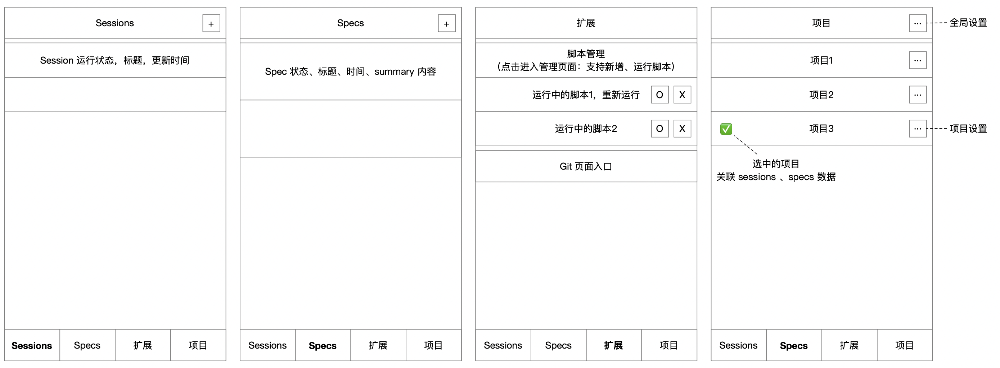
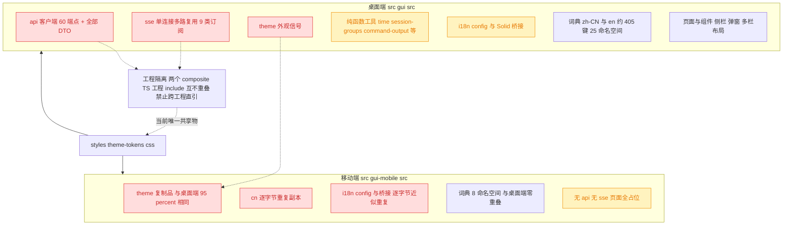
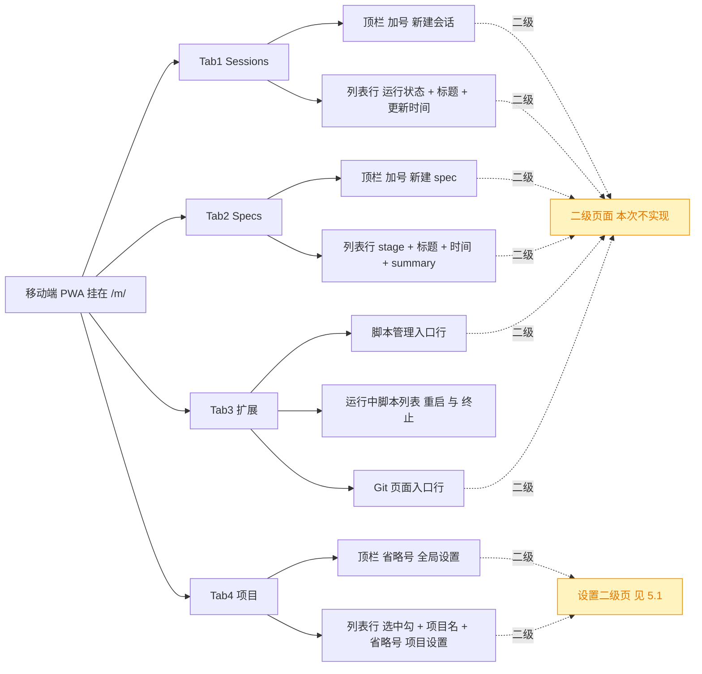
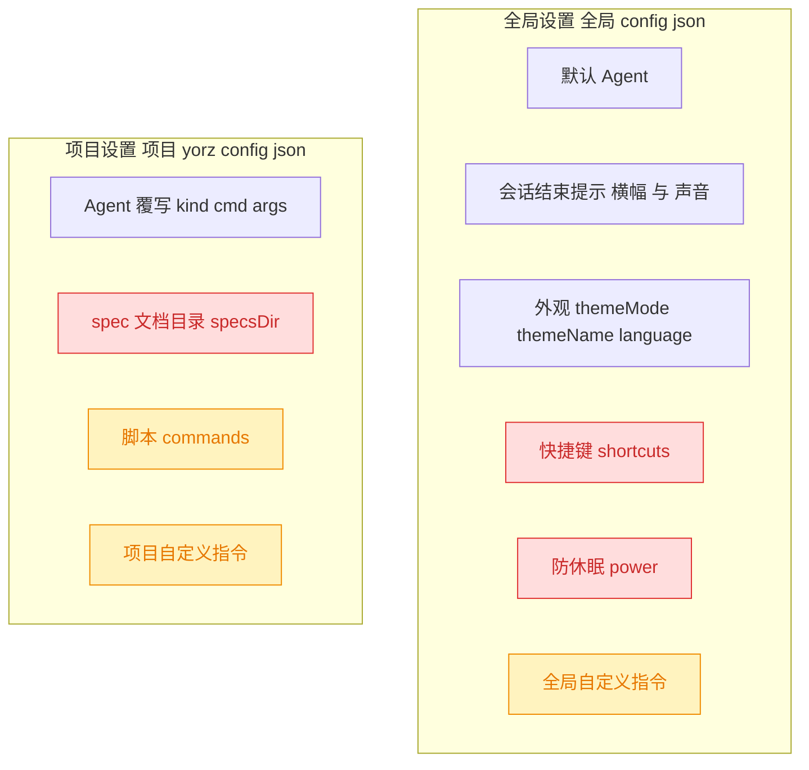
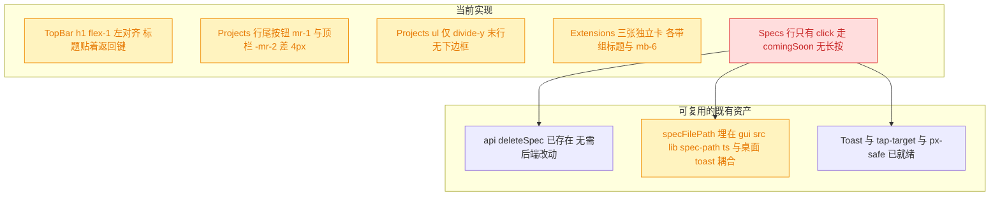
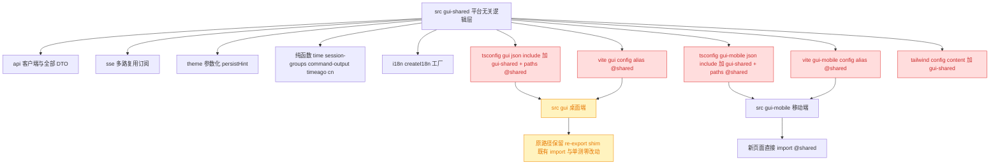
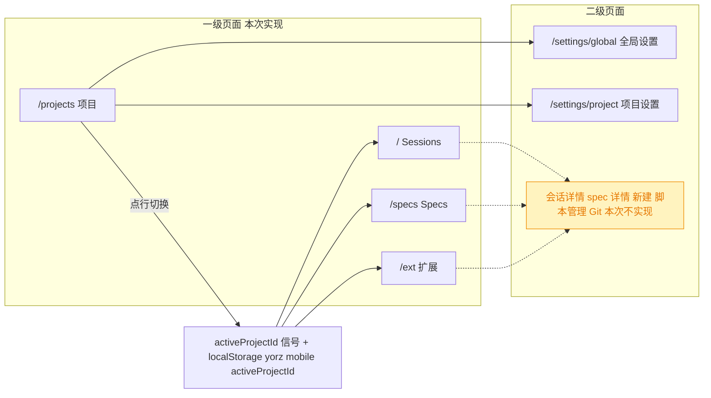
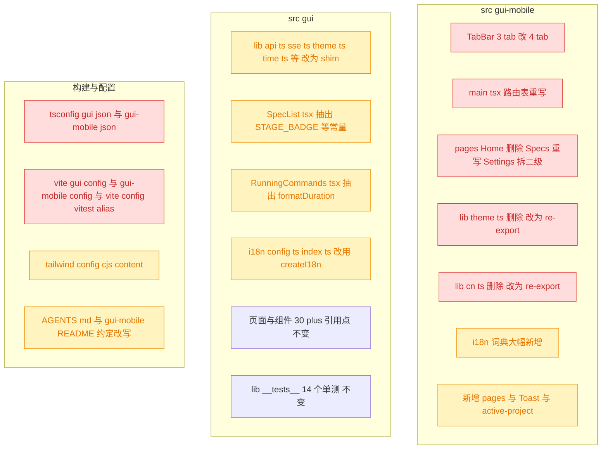
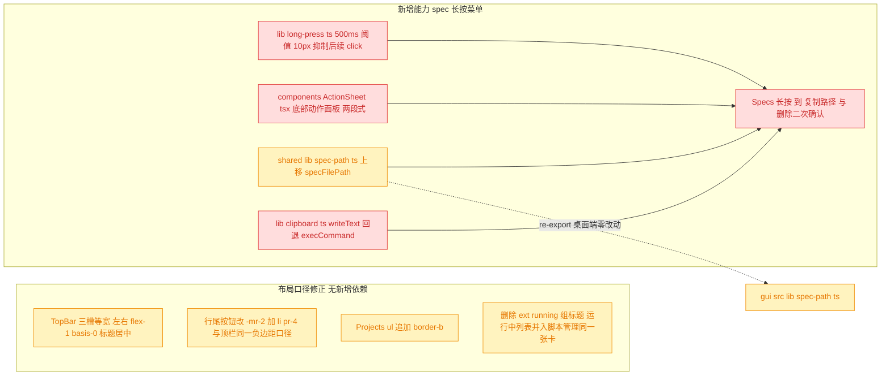

# 移动端四标签一级页面与 gui-shared 复用层

## 1. 背景

移动端 `src/gui-mobile` 目前只有骨架：三个底部标签（首页 / Spec / 设置），页面均为占位，**没有任何 `/api` 调用**。设置页承载的是外壳自身的开关（主题 / 语言 / 版本），属于验证骨架的临时内容。

本次按线框图把移动端推进到"可用"：底部导航扩为四个业务一级页面，全部加载真实项目数据；把设置收进二级页面；同时为两端共享非 UI 逻辑建立 `src/gui-shared` 复用机制。

线框图附件：



## 2. 需求

1. 底部导航改成 4 个（Sessions / Specs / 扩展 / 项目），保持当前 icon + 文字组合。
2. 实现四个导航对应的一级页面，加载真实项目数据；二级页面本次不实现。
3. 当前已实现的全局设置、项目设置放到二级页面；移动端无需展示「快捷键设置」「休眠设置」「spec 文档目录」。

### 2.1 UI 设计建议

- 遵循 `src/gui`（PC）的视觉设计效果，交互设计符合移动端操作逻辑。
- 底部导航 icon 设计跟主题相关；其他 icon（设置、激活态）使用通用 icon。
- 列表元素较多，遵守常见移动端列表设计，合理布局列表中的信息展示。

### 2.2 技术设计建议

- `gui`（PC）与 `gui-mobile` 使用相同技术栈，许多非 UI 逻辑可复用，需设计一个复用机制。
- 如创建 `src/gui-shared` 目录：主题、i18n、数据处理、后端接口对接逻辑等，甚至跟平台尺寸无关的通用 UI 组件，可放到这里复用。
- 页面级 UI 交互、布局相关，如不能复用，无需勉强。

## 3. 现状分析

### 3.1 两端资产分布与复用性分级

桌面端把**全部非 UI 逻辑**收在 `src/gui/src/lib/`（27 个 `.ts`，约 4.8k 行），其中 `api.ts`（约 60 个端点 + 全部 DTO）与 `sse.ts`（单连接多路复用）是零 DOM、零布局依赖的纯逻辑，移动端要做任何一个真实页面都绕不开它们。移动端目前只有 `theme / pwa / network / cn` 四个 lib，`theme.ts` 与桌面端那份是同源复制、语义 95% 相同。



> 红 = 本次必须迁移到 `gui-shared` 的重复或必需资产；黄 = 受牵连需同步调整；其余不动。

<details>
<summary>复用性分级明细（文件路径 + 判定依据）</summary>

**A 级 · 零改动直搬**（无 DOM、无 Solid、无桌面外壳耦合）

| 文件                                | 规模   | 说明                                                                                                                                                                                      |
| ----------------------------------- | ------ | ----------------------------------------------------------------------------------------------------------------------------------------------------------------------------------------- |
| `src/gui/src/lib/api.ts`            | 632 行 | 裸 `fetch` + 22 行泛型 `request<T>`；`projectBase(pid)` = `/api/projects/${encodeURIComponent(pid)}`；错误统一抛 `"${status} ${body.error}"`。第 3–294 行内联了几乎全部 DTO               |
| `src/gui/src/lib/sse.ts`            | 351 行 | `SseMultiplex` 单 `EventSource` + `POST /api/events/subscribe`；导出 `subscribeSpec/Session/Sessions/SpecsList/ProjectsList/SystemNotifications/CommandRuns/CommandOutput/ProjectChanges` |
| `src/gui/src/lib/time.ts`           | 15 行  | `formatSpecUpdatedAt`                                                                                                                                                                     |
| `src/gui/src/lib/session-groups.ts` | 89 行  | `groupSessions` / `findGroupBySession`，按 `specId` 折叠多轮 session                                                                                                                      |
| `src/gui/src/lib/command-output.ts` | 88 行  | `stateFromSlice` / `appendChunk`（处理 offset 乱序与空洞）                                                                                                                                |
| `src/gui/src/lib/timeago-locale.ts` | 31 行  | `enShort` 紧凑英文相对时间包                                                                                                                                                              |
| `src/gui/src/lib/cn.ts`             | 6 行   | 与 `src/gui-mobile/src/lib/cn.ts` **逐字节相同**                                                                                                                                          |

**B 级 · 需小幅参数化**

- `src/gui/src/lib/theme.ts` vs `src/gui-mobile/src/lib/theme.ts`：唯一实质差异是 hint 写入策略——桌面端 `sync(mode)` 不写 hint（交给 `global-config.ts` 的 `applyGlobalAppearance`，真值在服务端 `config.json`），移动端 `sync(mode, name)` 内部直接 `writeAppearanceHint`；移动端另导出 `THEME_MODES` / `THEME_NAMES` 数组。
- `src/gui/src/i18n/config.ts` + `index.ts`（约 53 行）与移动端两份**逐字节近似重复**，差别只有中文注释；`resources` 需参数化为 `createI18n(resources)`。
- `src/gui/src/lib/global-config.ts`（181 行）：含 localStorage 旧键迁移 `migrateLegacyAppearance()` 与 `applyGlobalAppearance()`，去掉桌面专属耦合后可共享。

**C 级 · 埋在组件里、需先抽出**

- `src/gui/src/pages/SpecList.tsx:52-62`：`STAGE_BADGE`（plan/tasks/execute/done → Tailwind 类）、`SPEC_TYPE_TEXT`、`splitSpecId(id)`
- `src/gui/src/components/RunningCommands.tsx:21`：`formatDuration(startedAt, endedAt, now)`

**D 级 · 不共享**：`markdown.ts`（249 行）/ `mermaid.ts`（429 行，直接操作 HTMLElement）/ `selection.ts` / `layout-focus.ts` / `shortcut-actions.ts` / `chat-session-request.ts`（桌面外壳专属）/ `components/**`（两端 `button.tsx` 已各自演化）。

**注定无法消除的第三份重复**：`src/gui/index.html` 与 `src/gui-mobile/index.html` 的 FOUC 同步引导脚本硬编码了 `THEME_NAMES` / `THEME_MODES` / `'yorz.appearanceHint'`——HTML 内联脚本无法 import 模块，两处源码注释已注明"修改必须同步"。

</details>

### 3.2 工程隔离约束（为什么不能直接 import）

`tsconfig.json` 是 solution-style，引用三个 composite 工程：`tsconfig.node.json` / `tsconfig.gui.json` / `tsconfig.gui-mobile.json`，两个前端的 `include` 互不重叠。`AGENTS.md` 与 `src/gui-mobile/README.md` 都明令"不要从这里 import `src/gui` 的源码"，理由是 composite 要求文件归属唯一，跨工程直引会让同一文件同时归属两个 project、破坏增量构建。

README 同时给出了**官方解法**："需要共享时抽成独立模块，两边各自 include——样式已按这个办法共享（`src/styles/theme-tokens.css`）"。本次要做的正是把这条既有约定从 CSS 扩展到 TS。

### 3.3 线框图信息架构



线框图确立的两个关键语义：**Tab4 的绿色勾表示"选中的项目"，关联 sessions、specs 数据**——即移动端存在一个全局单选的活动项目，Sessions/Specs 两个 tab 都读它；顶栏省略号是全局设置，行内省略号是项目设置。

### 3.4 后端接口现状（移动端可直接消费）

后端全部端点前缀 `/api`（`src/service/server.ts` 的 `app.route('/api', api)`），且**没有"当前项目"端点**——当前项目纯属前端概念，桌面端从 URL 第一段解析。移动端需自己维护选中态。

<details>
<summary>本次四个页面用到的端点与类型（精确层）</summary>

| 页面     | 端点                                                                                                                       | SSE topic                                                          | 返回类型            |
| -------- | -------------------------------------------------------------------------------------------------------------------------- | ------------------------------------------------------------------ | ------------------- |
| Sessions | `GET /api/projects/:pid/sessions`（上限 30 条）                                                                            | `project:<pid>:sessions` → `session-status`                        | `SessionInfo[]`     |
| Specs    | `GET /api/projects/:pid/specs`（已按 `updated_at` 倒序，同值再按 `mtime`）                                                 | `project:<pid>:specs` → `list-updated`                             | `SpecListItem[]`    |
| 扩展     | `GET /api/projects/:pid/command-runs`、`POST /api/projects/:pid/command-runs`、`POST .../:runId/stop`、`DELETE .../:runId` | `project:<pid>:commands` → `runs-updated`（推全量 `CommandRun[]`） | `CommandRun[]`      |
| 项目     | `GET /api/projects`                                                                                                        | `projects` → `projects-changed`                                    | `ProjectListItem[]` |
| 全局设置 | `GET/PUT /api/global-config`                                                                                               | —                                                                  | `GlobalConfig`      |
| 项目设置 | `GET/PUT /api/projects/:pid/config`                                                                                        | —                                                                  | `ProjectConfig`     |

关键类型（后端权威定义位置）：

- `SpecListItem { id; title; stage: 'plan'|'tasks'|'execute'|'done'; updated_at; summary; mtime }` — `src/service/spec-store.ts:15`
- `SessionInfo { id; title; kind: AgentKind; createdAt; updatedAt; specId?; running? }` — `src/service/agent-sdk/types.ts`
- `CommandRun { runId; commandId; name; cli; pid; status: 'running'|'exited'|'killed'|'failed'; startedAt; endedAt?; exitCode?; signal?; logFile }` — `src/service/command-types.ts`
- `ProjectListItem { id; name; path; lastActivityAt; worktree? }` — `src/service/project-registry.ts:57`
- `GlobalConfig { agent{defaultKind}; notifications{sessionEnd{banner,sound}}; shortcuts; power; appearance{themeMode,themeName,language}; customInstructions }` — `src/service/global-config.ts`
- `ProjectConfig { version:1; agent: AgentConfig; specsDir; commands; customInstructions }` — `src/service/project-config.ts`

前端已有的完整镜像客户端：`src/gui/src/lib/api.ts`（手写复刻，与 service **无类型共享**）。

**运行环境注意**：`src/service/index.ts` 的 `start()` 强制 loopback 绑定（`isLoopbackHost`，因为 command API 无鉴权），真机访问需走 `pnpm dev:gui-mobile`（:5174，`/api` 代理到 :7424）或隧道。本次不改变这一点。

</details>

### 3.5 设置项归属与移动端裁剪

需求 3 点名排除的三项，恰好横跨两个配置层级：



> 红 = 需求明确要求移动端不展示；黄 = 桌面端当前**也没有**编辑 UI（`GlobalConfigDialog` 只有默认 Agent / 通知 / 电源 / 快捷键四组，`ProjectConfigDialog` 只有 agent + specsDir），故不属于"当前已实现的设置"，移动端同样不做；`commands` 由「扩展」tab 的脚本管理二级页承载，不进设置页。

去掉红黄两类后，移动端设置页的**确定内容**是：

- 全局设置：默认 Agent、会话结束提示（横幅 / 声音）、外观（亮暗模式 / 主题风格 / 语言）、关于（版本 / 安装状态）
- 项目设置：Agent 覆写（kind + 自定义 cmd/args）

### 3.6 追加调整（第二轮）的现状定位

第二轮 5 条调整全部落在移动端已交付的页面上，后端与 gui-shared 的既有结论不受影响；其中只有第 5 条（spec 长按菜单）是新增能力，其余 4 条是布局口径修正。



<details>
<summary>五处现状的精确定位（文件 + 行号 + 数值）</summary>

1. **标题左对齐**：`src/gui-mobile/src/components/TopBar.tsx:30` 是 `<h1 class="min-w-0 flex-1 truncate ...">`——`flex-1` 让标题吃掉返回键与动作区之间的全部剩余宽度，视觉上永远贴左。四个一级页与两个设置二级页共用这一个组件。
2. **两个 icon 未对齐**：`TopBar.tsx:19` 容器 `px-4` + `Projects.tsx:40` 顶栏按钮 `-mr-2` → 44px 按钮右边缘距屏右 8px、图标中心距屏右 **30px**；而 `Projects.tsx:85` 行尾按钮是 `mr-1`、li 无 `pr` → 图标中心距屏右 **26px**。差 4px，两枚省略号肉眼可见地错开。
3. **末行无下边框**：`Projects.tsx:59` 的 `<ul class="divide-y divide-border">` 只画行间线。项目通常只有 3–5 条，末行下方是整屏空白，列表看起来像被裁断。
4. **扩展页被切成三张卡**：`Extensions.tsx:31` 的 `Group` 是 `<section class="mb-6">` + 组标题 + `divide-y border-y bg-card`；`Extensions.tsx:109/118/170` 三次调用，`ext.scripts` 与 `ext.running` 各自成卡，中间隔着 24px 外边距 + 一行标题，读起来是两件不相干的事。
5. **Specs 行无长按**：`Specs.tsx:69-73` 行只有一个 `onClick={comingSoon}`。`api.deleteSpec(pid, id)` 在 `src/gui-shared/api/index.ts:324` 已存在（桌面端 `SpecList.tsx:242` 在用）；`specFilePath(specId)` 在 `src/gui/src/lib/spec-path.ts:5`，但同文件的 `copySpecPath` 直接 import 了桌面端 Kobalte toast，移动端不能整体复用。

</details>

## 4. 技术实现方案

### 4.1 gui-shared 复用机制

新增 `src/gui-shared/`，作为**不属于任何一端的第三方目录**，由两个前端工程各自 `include`。这是仓库既有约定（`theme-tokens.css` 已按此共享）的 TS 版本，不引入第 4 个 TS 工程。



> 决策：**不使用 TS project reference**。被引用工程必须产出 `.d.ts`，而两个前端工程都是 `composite + noEmit`（不落任何产物），加 reference 会逼着新建一个会写盘的工程、并让 `tsc -b` 多一层构建依赖。被否决的备选还有"移动端加 `@gui/*` alias 直引桌面端源码"——那正是 `AGENTS.md` 与 README 明令禁止的做法。

> 决策：**桌面端保留 re-export shim**。`src/gui/src/lib/api.ts` 等文件物理内容迁走后，原路径改为 `export * from '@shared/api/index.js'`。理由：`api` / `sse` / `theme` 在桌面端有 30+ 引用点、14 个单测文件依赖 `lib/` 路径，一次性改 import 的收益为零、回归面却很大。被否决的备选是"全量改写 import 路径"。shim 是过渡态，后续可按文件逐步收敛。

### 4.2 首批迁移清单与接线点

只搬本次真正要用的，不做一次性大迁移。

<details>
<summary>迁移清单与五处接线的精确改动（精确层）</summary>

**目录结构**

```
src/gui-shared/
  api/
    index.ts          ← 迁自 src/gui/src/lib/api.ts（632 行，含全部 DTO）
    project.ts        ← 迁自 src/gui/src/lib/project.ts 中的 ProjectListItem / WorktreeMeta 类型
    sse.ts            ← 迁自 src/gui/src/lib/sse.ts（351 行）
  lib/
    theme.ts          ← 两端 theme.ts 合并，新增 initTheme({ persistHint }) 参数
    time.ts           ← 迁自 src/gui/src/lib/time.ts
    timeago-locale.ts ← 迁自 src/gui/src/lib/timeago-locale.ts
    session-groups.ts ← 迁自 src/gui/src/lib/session-groups.ts
    command-output.ts ← 迁自 src/gui/src/lib/command-output.ts
    cn.ts             ← 两端逐字节相同的副本合一
    spec-meta.ts      ← 新建：从 SpecList.tsx:52-62 抽出 STAGE_BADGE / SPEC_TYPE_TEXT / splitSpecId
    duration.ts       ← 新建：从 RunningCommands.tsx:21 抽出 formatDuration
  i18n/
    create.ts         ← 两端 i18n/config.ts + index.ts 合并为 createI18n(resources)
```

`src/gui/src/lib/project.ts` 的 `activeProjectId` / `useCurrentProjectId` / `projectHref` **不迁移**：依赖 `@solidjs/router` 的 `useParams` 与桌面端 URL 形状 `/:projectId`，移动端用另一套模型（见 4.4）。仅迁移其中的两个类型。

**接线点一：`tsconfig.gui.json` / `tsconfig.gui-mobile.json`**（两份都改）

```jsonc
"paths": {
  "@/*": ["./src/gui/src/*"],          // 或 ./src/gui-mobile/src/*
  "@shared/*": ["./src/gui-shared/*"]
},
"include": ["src/gui/**/*.ts", "src/gui/**/*.tsx", "src/gui-shared/**/*.ts"]
```

两个 composite 工程同时 include `src/gui-shared` 是允许的：它们之间**没有 project reference**，各自独立编译，不触发"文件归属唯一"检查。代价是共享文件被类型检查两次——与 `tailwind.config.cjs` 现有注释里"各自产物含少量对方工具类"是同一类可接受代价。

**接线点二：`vite.gui.config.ts` / `vite.gui-mobile.config.ts`**

```ts
alias: {
  '@': resolve(__dirname, 'src/gui/src'),        // 或 src/gui-mobile/src
  '@shared': resolve(__dirname, 'src/gui-shared'),
}
```

同时把 `vite.gui-mobile.config.ts` 里那段"刻意没有指向 src/gui 的别名"的注释改写为指向新机制。

**接线点三：`tailwind.config.cjs`**

`content` 追加 `'./src/gui-shared/**/*.{ts,tsx}'`（`spec-meta.ts` 里有 Tailwind 类名字符串，不加会被 purge 掉）。

**接线点四：`vitest`**

`vite.config.ts` 的 `test.include` 是 `src/**/*.test.ts`，无需改；但需给 vitest 补 `resolve.alias` 的 `@shared`，否则迁移后 `src/gui/src/lib/__tests__/*.test.ts` 经 shim 解析不到。

**接线点五：文档约定**

`AGENTS.md` 第 3 条与 `src/gui-mobile/README.md` 的「不要从这里 import `src/gui` 的源码」段落需要改写：从"只共享设计令牌"改为"共享设计令牌 + `src/gui-shared` 逻辑层；仍禁止两端互相直引"。

</details>

### 4.3 移动端信息架构与路由



> 决策：**活动项目用全局信号 + localStorage，而非 URL scope**。桌面端把 pid 放在 URL 第一段（`/:projectId/...`）是为了多标签页各自停在不同项目；移动端是单窗口 PWA，线框图也明确画成"勾选一个项目、其余 tab 跟随"。放进 URL 会让每个 tab 路径都带 pid、深链与 SW 缓存都变复杂。首次进入时若 localStorage 无值或该 id 已不在 `GET /api/projects` 结果中，回退为列表第一项；列表为空则各页显示引导空态（移动端不提供"添加项目"——后端 `POST /api/projects` 要求传绝对路径，手机上无从选择）。新建 `src/gui-mobile/src/lib/active-project.ts` 承载。

### 4.4 底部导航

四个 tab 保持现有「icon 在上、文字在下」的结构，`TABS` 常量从 3 项扩到 4 项，`h-14` 与 `flex-1` 等分布局不变（4 等分后单格约 25% 宽，仍高于 44pt 最小触控目标）。

> 决策：**"icon 跟主题相关"理解为「图标语义要贴合该 tab 的内容主题」**，仍从 `lucide-solid` 选取，不自绘图标。取值：Sessions → `MessagesSquare`，Specs → `FileText`（沿用），扩展 → `Blocks`，项目 → `FolderGit2`。「其他 icon（设置、激活态）使用通用 icon」对应：设置入口 `Settings` / `MoreHorizontal`，选中态 `Check`。被否决的备选是"定制一套与视觉主题（terminal/graphite/paper）联动的图标"——三套主题只改配色不改形状，图标联动没有承载物。

激活态沿用现有 `text-primary` 判定；`/` 用精确匹配，其余用前缀匹配。

### 4.5 四个一级页面

统一数据范式，与桌面端一致：`createResource(pid, ...)` 拉首屏 + 对应 SSE topic 回调里 `refetch()` / `mutate()`，**不做轮询**。列表统一走 `Page` 的 `.scroll-y` 容器，行高 ≥ 56px、单行主信息 + 次行元信息的移动端常见双行列表。

<details>
<summary>四个页面的字段布局与交互（精确层）</summary>

**Tab1 Sessions — `src/gui-mobile/src/pages/Sessions.tsx`**

- 数据：`api.listSessions(pid)` + `subscribeSessions(pid, { onStatus })`，再经 `@shared/lib/session-groups` 的 `groupSessions()` 折叠为行（一个 spec 的多轮会话合成一行，与桌面端 ChatPanel 口径一致）。
- 行布局：左侧运行状态点（`running` 时 `bg-primary` + `animate-pulse`，否则 `bg-muted-foreground/40`）→ 主行 `truncate` 标题 → 次行 `text-xs text-muted-foreground` 显示相对时间（`timeago.js` + `@shared/lib/timeago-locale` 的 `enShort`）与 agent kind。
- 顶栏右侧 `Plus` 按钮 → 二级（见 4.6）。

**Tab2 Specs — 改造现有 `pages/Specs.tsx`**

- 数据：`api.listSpecs(pid)` + `subscribeSpecsList(pid, refetch)`。后端已排序，前端不再排。
- 行布局：首行 = stage 徽章（复用 `@shared/lib/spec-meta` 的 `STAGE_BADGE`，`bg-stage-*/15 + text-stage-* + border-stage-*/30` 的 soft 形态，令牌两端共用）+ 右对齐 `formatSpecUpdatedAt(updated_at)`；次行 = `title`（`truncate`）；第三行 = `summary`，`line-clamp-2`（需在 `app.css` 或 tailwind 插件里确认 `line-clamp` 可用）。
- 顶栏右侧 `Plus` 按钮 → 二级。

**Tab3 扩展 — `src/gui-mobile/src/pages/Extensions.tsx`**

- 分三组，与线框图一致：
  1. 「脚本管理」单行入口（带 `ChevronRight`）→ 二级。
  2. 「运行中的脚本」列表：`api.listCommandRuns(pid)` + `subscribeCommandRuns(pid, mutate)`（SSE 推全量 `CommandRun[]`，直接 `mutate` 不用 refetch）。只渲染 `status === 'running'` 的记录；行内两个 44×44 图标按钮 —— `RotateCcw` 重启（`clearCommandRun` 后 `runCommand`，与桌面端 `RunningCommands.tsx` 同序）、`X` 终止（`stopCommandRun`）。运行时长用 `@shared/lib/duration` 的 `formatDuration`，配 1s `setInterval`。
  3. 「Git」单行入口 → 二级。
- 无运行中脚本时该组显示空态文案，不隐藏分组标题（避免布局跳动）。

**Tab4 项目 — `src/gui-mobile/src/pages/Projects.tsx`**

- 数据：`api.listProjects()` + `subscribeProjectsList(refetch)`。
- 行布局：左槽位固定宽度——选中项渲染 `Check`（`text-primary`），未选中留空；主行项目名（worktree 项目沿用桌面端 `displayProjectName` 的「主目录 · slug」拼法）；次行 `path`，`truncate` 且 `dir="rtl"` 让尾部目录名优先可见。整行点击 = 设为活动项目。
- 行尾 `MoreHorizontal` → 项目设置二级页（阻止事件冒泡，避免顺带切换项目）。
- 顶栏右侧 `MoreHorizontal` → 全局设置二级页。
- **不提供**添加 / 删除项目：`POST /api/projects` 需绝对路径、`DELETE` 是不可逆破坏性操作，均不适合移动端。

</details>

### 4.6 未实现二级入口的降级策略

> 决策：**入口照常渲染、点击弹「即将支持」轻提示**，而不是隐藏或置灰。理由：线框图把这些入口画成了信息架构的一部分，隐藏会让页面结构与设计稿对不上；置灰则无法解释"为什么不能点"。同时「扩展」tab 的重启 / 终止本来就需要成功与失败反馈，移动端缺一个 toast——两个需求合并，新增一个约 60 行的极简 `src/gui-mobile/src/components/Toast.tsx`（单条、底部安全区上方、3s 自动消失），不引入桌面端那套 Kobalte Toaster。

### 4.7 i18n 与主题

- **词典不合并**。两端命名空间零重叠（桌面 25 个 / 移动 8 个），且移动端注释已言明"直接复用桌面端的键会逼着桌面端为移动端妥协"。只把 `config.ts` + `index.ts` 合并为 `@shared/i18n/create.ts` 的 `createI18n(resources)`，两端各传自己的词典。
- 移动端词典新增命名空间：`nav`（4 个 tab 名）扩写、`sessions`、`ext`、`projects`、`globalSettings`、`projectSettings`、`common`（loading / empty / retry / comingSoon）。`zh-CN.ts` 为准，`en.ts` 由 `export type Translation = typeof zhCN` 类型约束保持同构。
- **主题合并**：`@shared/lib/theme.ts` 的 `initTheme(options?: { persistHint?: boolean })` —— 移动端传 `persistHint: true`（无服务端真值，自己写 localStorage），桌面端传 `false`（真值在 `config.json`，由 `global-config.ts` 的 `applyGlobalAppearance` 写）。`THEME_MODES` / `THEME_NAMES` 一并导出供两端复用。桌面端 `applyAppearance(mode, name)` 保留在 shared 里。

### 4.8 兼容性与影响范围



> 红 = 结构性重写；黄 = 有改动但语义不变；`D5` / `D6` 明确保持零改动，是本次「shim 过渡」策略的验收线：桌面端 `pnpm test` 与 `pnpm test:e2e` 必须原样通过。

后端零改动：本次只消费既有端点，不新增、不修改 `src/service`。`/m/` 前缀四处同步点（vite base / manifest / Router base / `static.ts` 的 `MOBILE_PREFIX`）本次均不动。

> 决策记录：待确认项「本次实现范围止于「四个一级页面 + 设置二级页」」—— 用户确认，按此推进，理由：接受"移动端首次承担全局配置读-改-写"的风险，本次实现 `/settings/global` 与 `/settings/project` 两个二级页，其余二级页面一律不实现、入口点击弹「即将支持」。

### 4.9 验证方式

- `pnpm typecheck`（`tsc -b`，三个工程全过，确认 gui-shared 被两端正确 include 且无重复归属报错）
- `pnpm test`（vitest，`src/gui/src/lib/__tests__/` 14 个单测经 shim 后仍全绿）
- `pnpm build:gui` + `pnpm build:gui-mobile`（两端产物均可构建）
- `pnpm dev:cli` + `pnpm dev:gui-mobile`，浏览器 DevTools 移动模拟下逐页验证四个 tab 的真实数据、SSE 实时更新、项目切换联动
- `pnpm test:e2e`（Playwright 覆盖桌面端，确认 shim 未破坏既有行为）

### 4.10 追加调整（第二轮）实现方案



> 决策：**标题居中用「左右槽位等宽 + 标题居中」的三槽 flex，而不是绝对定位**。左右槽位都写 `min-w-0 flex-1`（`flex-basis:0` + `grow:1`），两侧永远分到相同宽度，标题自然落在几何中心且仍能 `truncate`。被否决的备选是 `absolute left-1/2 -translate-x-1/2`：绝对定位后标题脱离流，最大宽度必须靠硬编码 `px-14` 猜测两侧按钮个数，多一个动作按钮就会重叠。

> 决策：**右对齐口径统一为「容器 `px-4` + 按钮 `-mr-2`」**，行尾按钮从 `mr-1` 改为 `-mr-2` 并给 `li` 补 `pr-4`，让两枚省略号图标中心都落在距屏右 30px。被否决的备选是"把顶栏按钮改成 `mr-1` 去迁就行"——那会让顶栏图标离屏幕边缘更远，与列表行 16px 的左留白失衡。

> 决策：**末行下边框只加在项目页**。需求点名的是项目列表；Sessions / Specs 是可滚动长列表，末行通常压在视口外，补下边框收益为零。项目页条目少（3–5 条）且末行下方留白大，缺一条线会被读成"内容被截断"。实现是 `ul` 追加 `border-b border-border`，不改 `divide-y`。

> 决策：**扩展页合并为「脚本」一张卡**：删除 `ext.running` 组标题，把运行中脚本的行直接放进「脚本管理」那张 `divide-y` 卡片里，成为入口行下方的兄弟行——共享容器的分隔线本身就在表达"这些正在跑的，就是上面那个入口管的东西"。空态文案保留（不整段隐藏，避免最后一个脚本停掉时页面跳一下），但内边距从 `py-6` 收到 `py-4`。`ext.running` 这个 i18n 键随之删除（zh-CN / en 同步），`ext.runningEmpty` 保留。

<details>
<summary>spec 长按菜单的精确实现（手势 / 面板 / 剪贴板 / 删除）</summary>

**手势 `src/gui-mobile/src/lib/long-press.ts`**

导出 `createLongPress({ onLongPress, ms?, moveTolerance? })`，返回可直接展开到元素上的 handler 对象（`onPointerDown` / `onPointerMove` / `onPointerUp` / `onPointerCancel` / `onContextMenu` / `onClick`）：

- `ms` 默认 500，`moveTolerance` 默认 10px——超过阈值判定为滚动意图，取消计时。
- 触发后置 `suppressClick` 标志；`onClick` 读到该标志就 `preventDefault + stopPropagation` 并复位。少了这一步，长按松手会连带触发行本身的 `comingSoon` toast，菜单和 toast 一起弹。
- `onContextMenu` 一律 `preventDefault()`：Android Chrome 长按会弹系统菜单（"复制链接/搜索"），iOS Safari 会弹 callout。
- 行元素另加 `select-none` 与新的 `.no-callout` 工具类（`-webkit-touch-callout: none`），iOS 上只靠 `contextmenu` 拦不住 callout。

**面板 `src/gui-mobile/src/components/ActionSheet.tsx`**

底部动作面板：全屏半透明遮罩（点击关闭）+ 贴底卡片 + `pb-safe`。props 为 `{ open, title?, description?, items: { label, tone?: 'default' | 'destructive', onSelect }[], onClose }`，末尾固定一条「取消」。同一个组件承担两段：第一段是 `复制路径 / 删除`，选「删除」后不直接调 API，而是把 `items` 换成 `确认删除`（destructive）并把 `description` 设为 spec 标题，形成二次确认。

> 决策：**删除走自绘的二段式面板，不用原生 `confirm()`**。原生弹窗在 PWA 里样式不可控、文案不受 i18n 管，且 iOS 独立模式下的呈现与浏览器内不一致；而删除 spec 是不可逆操作，必须有一次明确的确认。被否决的备选是"长按菜单里直接删"——单次误触就能删掉整个 spec 目录。

**剪贴板 `src/gui-mobile/src/lib/clipboard.ts`**

`copyText(text): Promise<boolean>`：优先 `navigator.clipboard.writeText`，抛错或 API 不存在时回退到隐藏 `<textarea>` + `document.execCommand('copy')`。

> 决策：**必须带 `execCommand` 回退**。`navigator.clipboard` 只在 secure context 暴露，而移动端真机验证走的是 `http://<局域网 IP>:5174`（见 3.4 的运行环境注意），那里 `navigator.clipboard` 直接是 `undefined`——只用 Clipboard API 的话，复制路径在唯一的真机使用场景下 100% 失败。

**路径来源 `src/gui-shared/lib/spec-path.ts`**

把 `specFilePath(specId)`（返回 `@.yorz/specs/<id>/spec.md`）上移到 gui-shared，桌面端 `src/gui/src/lib/spec-path.ts` 改为 `export { specFilePath } from '@shared/lib/spec-path.js'` 并保留与桌面 toast 耦合的 `copySpecPath`——桌面端 30+ 引用点与 e2e 用例零改动，与 4.1 的 shim 策略同构。两端复制出的字符串保持一致（含 `@` 前缀，便于直接粘进 agent 对话引用文件）。

**删除动作**

`api.deleteSpec(pid, spec.id)` → 成功弹 `specs.deleted` toast 并 `refetch()`（SSE 的 `list-updated` 也会到，但本地先刷一次，避免弱网下菜单关了列表还留着已删条目）；失败弹 error toast，不关列表。

**i18n 新增键**：`specs.copyPath` / `specs.pathCopied` / `specs.copyFailed` / `specs.delete` / `specs.deleteConfirm` / `specs.deleted` / `specs.deleteFailed` / `specs.actions`（面板 aria-label）、`common.cancel`；删除 `ext.running`。`en.ts` 由 `Translation` 类型约束同步补齐。

</details>

## 5. 待确认项

_暂无_

## 6. 任务清单

- [x] 创建 `src/gui-shared/` 并把 `src/gui/src/lib/api.ts` 整体迁移为 `src/gui-shared/api/index.ts`，原路径改为 re-export shim（验收：`src/gui/src/lib/api.ts` 仅剩 `export *`，`rg "from '@shared/api"` 有命中）
- [x] 把 `src/gui/src/lib/project.ts` 中的 `ProjectListItem` / `WorktreeMeta` 类型迁到 `src/gui-shared/api/project.ts`，原文件 re-export 类型并保留 `activeProjectId` / `useCurrentProjectId` / `projectHref`（验收：桌面端引用点零改动）
- [x] 把 `src/gui/src/lib/sse.ts` 迁移为 `src/gui-shared/api/sse.ts`，原路径改 shim（验收：9 个 `subscribe*` 导出在 `@shared/api/sse.js` 可见）
- [x] 把 `time.ts` / `timeago-locale.ts` / `session-groups.ts` / `command-output.ts` / `cn.ts` 迁到 `src/gui-shared/lib/`，桌面端原路径改 shim，删除 `src/gui-mobile/src/lib/cn.ts` 改为 re-export（验收：`rg "^export"` 各 shim 文件仅剩 re-export 行）
- [x] 合并两端 `theme.ts` 为 `src/gui-shared/lib/theme.ts`，新增 `initTheme({ persistHint })` 参数并导出 `THEME_MODES` / `THEME_NAMES` / `applyAppearance`；桌面端传 `persistHint:false`、移动端传 `true`（验收：两端 `lib/theme.ts` 均为 shim，主题切换行为不变）
- [x] 新建 `src/gui-shared/lib/spec-meta.ts`，从 `src/gui/src/pages/SpecList.tsx` 抽出 `STAGE_BADGE` / `SPEC_TYPE_TEXT` / `splitSpecId`，SpecList 改为 import（验收：SpecList.tsx 内不再有这三个本地定义）
- [x] 新建 `src/gui-shared/lib/duration.ts`，从 `src/gui/src/components/RunningCommands.tsx` 抽出 `formatDuration`，原组件改为 import（验收：组件内无本地 `formatDuration`）
- [x] 新建 `src/gui-shared/i18n/create.ts` 导出 `createI18n(resources)`，两端 `i18n/config.ts` + `index.ts` 改为调用工厂并各传自己的词典（验收：两端 i18n 行为不变，`rg "createI18n"` 两端各一处调用）
- [x] 接线 `tsconfig.gui.json` / `tsconfig.gui-mobile.json`：各自 `include` 追加 `src/gui-shared/**/*.ts`，`paths` 追加 `@shared/*`（验收：`pnpm typecheck` 通过且无文件重复归属报错）
- [x] 接线 `vite.gui.config.ts` / `vite.gui-mobile.config.ts` 的 `@shared` alias，并给 `vite.config.ts`（vitest）补同名 alias；改写 `vite.gui-mobile.config.ts` 中"刻意没有指向 src/gui 的别名"注释（验收：`pnpm test` 与两端 build 均通过）
- [x] `tailwind.config.cjs` 的 `content` 追加 `'./src/gui-shared/**/*.{ts,tsx}'`（验收：移动端 Specs 页 stage 徽章样式未被 purge）
- [x] 改写 `AGENTS.md` 第 3 条与 `src/gui-mobile/README.md` 的共享约定段落为「共享设计令牌 + `src/gui-shared` 逻辑层；仍禁止两端互相直引」（验收：两处文本均提及 gui-shared）
- [x] 新建 `src/gui-mobile/src/lib/active-project.ts`：全局信号 + `localStorage['yorz.mobile.activeProjectId']`，含"值失效回退列表第一项、列表为空返回 null"逻辑（验收：刷新页面后活动项目保持）
- [x] 新建 `src/gui-mobile/src/components/Toast.tsx`：单条、底部安全区上方、3s 自动消失，导出 `showToast()`，挂载到 `AppShell`（验收：调用后可见提示并自动消失）
- [x] 移动端 i18n 词典扩充：`zh-CN.ts` 新增 `sessions` / `ext` / `projects` / `globalSettings` / `projectSettings` / `common` 命名空间并扩写 `nav` 为 4 项，`en.ts` 按 `Translation` 类型同构补齐（验收：`pnpm typecheck` 无缺键报错）
- [x] `TabBar.tsx` 的 `TABS` 扩为 4 项（Sessions/Specs/扩展/项目），图标取 `MessagesSquare` / `FileText` / `Blocks` / `FolderGit2`，`/` 精确匹配、其余前缀匹配（验收：四格等分、激活态正确）
- [x] 重写 `src/gui-mobile/src/main.tsx` 路由表为 `/`、`/specs`、`/ext`、`/projects`、`/settings/global`、`/settings/project`，删除 `pages/Home.tsx` 与旧 `pages/Settings.tsx`（验收：六条路由均可达，无死引用）
- [x] 新建 `src/gui-mobile/src/pages/Sessions.tsx`：`api.listSessions(pid)` + `subscribeSessions` + `groupSessions()`，双行列表（运行点 + 标题 / 相对时间 + agent kind），顶栏 `Plus` 弹「即将支持」（验收：真实数据渲染且 SSE 更新生效）
- [x] 改写 `src/gui-mobile/src/pages/Specs.tsx`：`api.listSpecs(pid)` + `subscribeSpecsList`，三行列表（stage 徽章 + 更新时间 / 标题 / summary `line-clamp-2`），顶栏 `Plus` 弹「即将支持」（验收：列表顺序与后端一致，徽章配色随 stage 变化）
- [x] 新建 `src/gui-mobile/src/pages/Extensions.tsx`：三组结构（脚本管理入口 / 运行中脚本列表 / Git 入口），运行中列表走 `listCommandRuns` + `subscribeCommandRuns` 全量 `mutate`，行内 44×44 的重启（`clearCommandRun`→`runCommand`）与终止（`stopCommandRun`）按钮 + 1s 刷新的 `formatDuration`（验收：终止后行消失并弹 toast）
- [x] 新建 `src/gui-mobile/src/pages/Projects.tsx`：`api.listProjects()` + `subscribeProjectsList`，行首选中 `Check`、主行项目名（worktree 用「主目录 · slug」）、次行 `path` 且 `dir="rtl"`；整行点击切活动项目，行尾 `MoreHorizontal` 进项目设置（阻止冒泡），顶栏 `MoreHorizontal` 进全局设置（验收：切换项目后 Sessions/Specs 数据随之刷新）
- [x] 新建 `src/gui-mobile/src/pages/settings/GlobalSettings.tsx`：`GET /api/global-config` 读-改-写，仅展示默认 Agent、会话结束提示（横幅/声音）、外观（模式/主题/语言）、关于（版本/安装状态）（验收：保存后重新 GET，`shortcuts` / `power` / `customInstructions` 字段原值保留）
- [x] 新建 `src/gui-mobile/src/pages/settings/ProjectSettings.tsx`：`GET/PUT /api/projects/:pid/config` 读-改-写，仅展示 Agent 覆写（kind + 自定义 cmd/args），不展示 specsDir / commands（验收：保存后 `specsDir` 与 `commands` 原值保留）
- [x] 全量验证：`pnpm typecheck`、`pnpm test`、`pnpm build:gui`、`pnpm build:gui-mobile`（验收：四条命令全部通过）
- [x] 桌面端回归验证 `pnpm test:e2e`，确认 shim 过渡未破坏既有行为（验收：Playwright 全绿；环境不可用时在执行记录说明原因）
- [ ] [manual] 真机 / DevTools 移动模拟下逐页人工验收四个 tab 的真实数据、SSE 实时更新与项目切换联动（验收：人工回复确认）
- [x] `TopBar.tsx` 改为三槽布局：左右槽位 `min-w-0 flex-1`、标题居中且保留 `truncate`（验收：四个一级页标题水平居中，设置二级页带返回键时标题仍居中）
- [x] `Projects.tsx` 行尾省略号改 `-mr-2`、`li` 补 `pr-4`，与顶栏省略号同一负边距口径（验收：两枚图标中心距屏右均为 30px，肉眼在同一竖线上）
- [x] `Projects.tsx` 的 `ul` 追加 `border-b border-border`（验收：最后一个项目行下方有边框）
- [x] `Extensions.tsx` 删除「运行中的脚本」组标题，把运行中列表并入「脚本管理」同一张 `divide-y` 卡片，空态内边距收到 `py-4`，并从 zh-CN / en 词典删除 `ext.running` 键（验收：扩展页只剩「脚本」「Git」两张卡，`rg "ext.running\b"` 无命中）
- [x] 新建 `src/gui-shared/lib/spec-path.ts` 导出 `specFilePath`，桌面端 `src/gui/src/lib/spec-path.ts` 改为 re-export 并保留 `copySpecPath`（验收：桌面端引用点零改动，`pnpm test:e2e` 的 toast 用例不受影响）
- [x] 新建 `src/gui-mobile/src/lib/clipboard.ts` 的 `copyText()`：`navigator.clipboard` 优先、`execCommand('copy')` 回退（验收：非 secure context 下仍返回 true）
- [x] 新建 `src/gui-mobile/src/lib/long-press.ts` 的 `createLongPress()`：500ms、10px 移动阈值、`pointercancel` 取消、抑制后续 `click`、拦截 `contextmenu`（验收：长按后不再触发行的「即将支持」toast）
- [x] 新建 `src/gui-mobile/src/components/ActionSheet.tsx`：遮罩 + 贴底卡片 + `pb-safe`，支持 `destructive` 条目与固定的「取消」（验收：点遮罩或取消可关闭）
- [x] `Specs.tsx` 接入长按菜单：复制路径（`copyText(specFilePath(id))` + 成功/失败 toast）、删除（二段式确认 → `api.deleteSpec` → toast + `refetch`），行加 `select-none no-callout`，`app.css` 新增 `.no-callout` 工具类（验收：长按弹面板，删除需二次确认，删除后列表少一条）
- [x] 移动端词典新增 `specs.copyPath` / `pathCopied` / `copyFailed` / `delete` / `deleteConfirm` / `deleteHint` / `deleted` 与 `common.cancel`，`en.ts` 同步（验收：`pnpm typecheck` 无缺键报错）
- [x] 第二轮全量验证：`pnpm typecheck`、`pnpm test`、`pnpm build:gui-mobile`、`pnpm build:gui`（验收：四条命令全部通过）

## 7. 追加任务

- [fixed] [refct] 2026-09-06 13:58:16 | 需要对以下部分功能做调整优化：
  - 描述：需要对以下部分功能做调整优化：

1. 四个页面顶部导航标题文字应该水平居中
2. 项目列表，全局设置与项目设置入口 icon 的应该保持右对齐
3. 项目列表最后一个列表项应该也需要底部边框
4. 移除扩展页列表组标题“运行中的脚本”，减少与脚本管理的距离，表是两者的联系
5. spec 列表项，长按出现菜单项：复制路径、删除

## 8. 执行记录

- 建立 `src/gui-shared/`：`api/index.ts`（原 `gui/src/lib/api.ts`，632 行）、`api/sse.ts`、`api/project.ts`（新建，仅两个类型）、`lib/{time,timeago-locale,session-groups,command-output,cn,theme,spec-meta,duration}.ts`、`i18n/create.ts`。桌面端原路径全部改为 `export * from '@shared/...'` 的 shim；`gui/src/lib/project.ts` 保留 Router 相关逻辑并 re-export 两个类型。
- `theme.ts` 两端合并：`initTheme(options?: { persistHint?: boolean })`，`sync()` 内按 `persistHint` 决定是否 `writeAppearanceHint`。桌面端 `main.tsx` 传 `false`（真值在服务端 config.json），移动端传 `true`。`THEME_MODES` / `THEME_NAMES` / `applyAppearance` 一并导出。
- `SpecList.tsx` 删除本地 `STAGE_BADGE` / `SPEC_TYPE_TEXT` / `splitSpecId` 改 import `@shared/lib/spec-meta.js`；`RunningCommands.tsx` 删除本地 `formatDuration` 改 import 并 re-export（该组件是既有导出点）。
- `i18n/create.ts` 提供 `createI18n(resources)`（i18next 初始化 + Solid 信号桥接），两端 `i18n/config.ts` 各喂自己的词典、`index.ts` 从工厂取 `t` / `useTranslation`；词典本身不合并。
- 接线：两份 tsconfig 各加 `@shared/*` paths 与 `src/gui-shared/**/*.ts` include；两份 vite config 加 `@shared` alias；`vite.config.ts`（vitest）补 `resolve.alias`；`tailwind.config.cjs` 的 `content` 加 `./src/gui-shared/**/*.{ts,tsx}`；`AGENTS.md` 与 `src/gui-mobile/README.md` 的共享约定改写为「令牌 + gui-shared 逻辑层，仍禁止两端互引」。
- 验证：`tsc -b` 通过（三工程无重复归属报错）；`vitest run` 76 个测试文件 / 747 用例全绿，桌面端 14 个 lib 单测经 shim 后零改动通过。
- 移动端外壳：`active-project.ts`（全局信号 + `localStorage['yorz.mobile.activeProjectId']` + 模块级 `projects` resource，SSE `projects-changed` 驱动 refetch，id 失效回退列表首项）；`Toast.tsx` 单条提示（3s 自动消失，挂在 `AppShell`）；`ListStates.tsx` 统一四种非正常态与 `comingSoon()`；`SettingsControls.tsx` 抽出 Group / Segmented / Toggle / TextField；`Page` 与 `TopBar` 增加 `padded` 与 `onBack`。
- `TabBar` 扩为 4 项（`MessagesSquare` / `FileText` / `Blocks` / `FolderGit2`），`/` 精确匹配其余前缀匹配；`main.tsx` 路由表改为 `/`、`/specs`、`/ext`、`/projects`、`/settings/global`、`/settings/project`，删除 `pages/Home.tsx` 与旧 `pages/Settings.tsx`。
- 四个一级页面 + 两个设置二级页全部接入真实 `/api`：Sessions（`listSessions` + `subscribeSessions` 就地改 running + `groupSessions` 折叠）、Specs（`listSpecs` + `subscribeSpecsList`，stage 徽章走共享 `spec-meta`）、Extensions（`listCommandRuns` + `subscribeCommandRuns` 全量 mutate、重启/终止、1s 心跳驱动 `formatDuration`）、Projects（模块级 `projects` + 整行切换 + 两个省略号入口）、GlobalSettings / ProjectSettings（均为读-改-写）。
- 移动端词典新增 `common` / `sessions` / `ext` / `projects` / `globalSettings` / `projectSettings` 六个命名空间并把 `nav` 改为 4 项，`en.ts` 由 `Translation` 类型约束保持同构。
- 新增 `.truncate-start` 工具类（`direction:rtl` + `unicode-bidi:plaintext`）：实测只写 `dir="rtl"` 会让路径开头的 `/` 被 bidi 算法甩到行尾，渲染成 `Users/fenghen/YorZ/`。
- 端到端实跑验证（`dev:cli` + `dev:gui-mobile`，Playwright 驱动 iPhone 13 视口）：四个 tab 均渲染真实数据（3 个项目 / YorZ 的 session 与 spec 列表 / 运行中脚本空态），切换项目后 Sessions 与 Specs 数据随之刷新，「即将支持」toast 正常，无任何 console / pageerror。
- **重点验证读-改-写**：在移动端翻转「会话结束横幅」后比对 `GET /api/global-config`，`banner` 由 true 变 false，而 `shortcuts` / `power` / `appearance` / `customInstructions`（1 条）全部原样保留——即 5.1 确认项知会的风险点已在实现中闭合；验证后已把 `banner` 复原为 true。
- `pnpm build:gui` 与 `pnpm build:gui-mobile` 均通过；产物 CSS 中可检出 `stage-plan` / `stage-done` / `line-clamp`，确认 gui-shared 的硬编码类名未被 purge。
- `pnpm test:e2e`：42 passed / 1 failed，失败的是 `sidebar-hover-peek.spec.ts`（折叠宽度 36 vs 37.5）。已在 `HEAD` 干净 worktree 上复现同一失败，确认是该 spec 自身的既有 flake（`toBeLessThan(40)` 的 poll 阈值会取到 150ms 过渡的中间值），与本次 shim 改造无关。
- 收尾：`prettier --write` 误格式化的 14 个无关桌面端文件已 `git checkout` 还原，最终 `src/gui` 改动仅剩 shim、`SpecList` / `RunningCommands` / `ProjectsSidebar` 的常量抽取、i18n 工厂接入与 `main.tsx` 的 `initTheme` 参数六处。
- 收尾：任务清单中 25 项非 manual 任务全部完成，待确认项为 `_暂无_`、无 `！！！` 批注、无 `[open]` 追加任务；余下 1 项 `[manual]` 真机人工验收按 done 判定规则忽略。stage 置为 `done`。

### 8.1 第二轮（追加任务 refct）

- **标题居中**：`TopBar.tsx` 改三槽布局（左右 `min-w-0 flex-1` + 中间 `truncate` 标题）；返回键的 `-ml-3` 一并改为 `-ml-2`，与动作按钮 `-mr-2` 同口径，两侧图标距屏幕边缘等距。Playwright 实测四个一级页与「全局设置」二级页标题中心均为 195.0px、视口中心 195px，**偏差 0.0px**。
- **两枚省略号右对齐**：`Projects.tsx` 的 `li` 补 `pr-4`、行尾按钮 `mr-1` → `-mr-2`。实测顶栏与行内图标中心距屏右均为 **30.0px**（改前为 30 / 26）。
- **末行下边框**：`Projects.tsx` 的 `ul` 追加 `border-b border-border`，实测 `border-bottom: 1px solid`；只改项目页，Sessions / Specs 是长列表、末行常在视口外，不跟改。
- **扩展页合并**：删掉 `Group title={t('ext.running')}` 这一层，运行中脚本的行成为「脚本管理」入口行在同一张 `divide-y` 卡里的兄弟行，空态内边距 `py-6` → `py-4`；`ext.running` 键从 zh-CN / en 一并删除。实测组标题只剩 `["Scripts", "Git"]`，首张卡内两行。
- **spec 长按菜单**：新增 `lib/long-press.ts`（500ms / 10px 位移取消 / `pointercancel` 取消 / 抑制后续 click / 拦 `contextmenu`）、`components/ActionSheet.tsx`（遮罩 + 贴底卡 + 固定「取消」，同一组件承担二次确认）、`lib/clipboard.ts`（`navigator.clipboard` 优先 + `execCommand` 回退）；`specFilePath` 上移到 `src/gui-shared/lib/spec-path.ts`，桌面端原文件改为 re-export + 保留 `copySpecPath`。`app.css` 新增 `.no-callout`（`-webkit-touch-callout:none`），行另加 `select-none`。
- **长按链路实跑验证**（`dev:cli` + `dev:gui-mobile`，Playwright iPhone 13 视口）：长按弹出 `["Copy path", "Delete", "Cancel"]` 且**未误弹**行自身的「即将支持」；复制路径 toast = `Path copied`、剪贴板读回 `@.yorz/specs/260906.feat.mobile-tab-pages-and-gui-shared/spec.md`；为验证删除专门造了一条临时 spec，两段式确认（确认段显示 spec 标题 + `This cannot be undone`）后列表由 127 → 126 条、临时 spec 目录在磁盘上消失；「取消」正常关闭；普通点击仍是 `Coming soon`。全程 console / pageerror 均为 0。
- **叠放顺序修正**：截图复核时发现上一条未消失的 toast（`z-50`）会盖住面板最下方的动作项，`ActionSheet` 提到 `z-[60]` 后复验，`Delete` 完整可见。
- 验证：`pnpm typecheck` 通过；`pnpm test` 750 passed / 1 failed，失败的是 `src/service/__tests__/git-routes.test.ts`（断言 git stderr 含 `did not match any files`，本机 git 输出的是 `selected paths have no staged changes`）——已 `git stash` 到干净 HEAD 复现同一失败，属本机 git 版本导致的既有失败，与本轮前端改动无关；`pnpm build:gui-mobile` 与 `pnpm build:gui` 均通过。
- 收尾：第二轮 11 项任务全部完成，`## 追加任务` 的 refct 条目标记为 `[fixed]`；待确认项 `_暂无_`、无 `！！！` 批注、无 `[open]` 条目，stage 重新置为 `done`。
