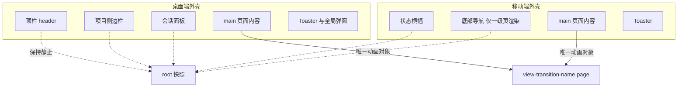
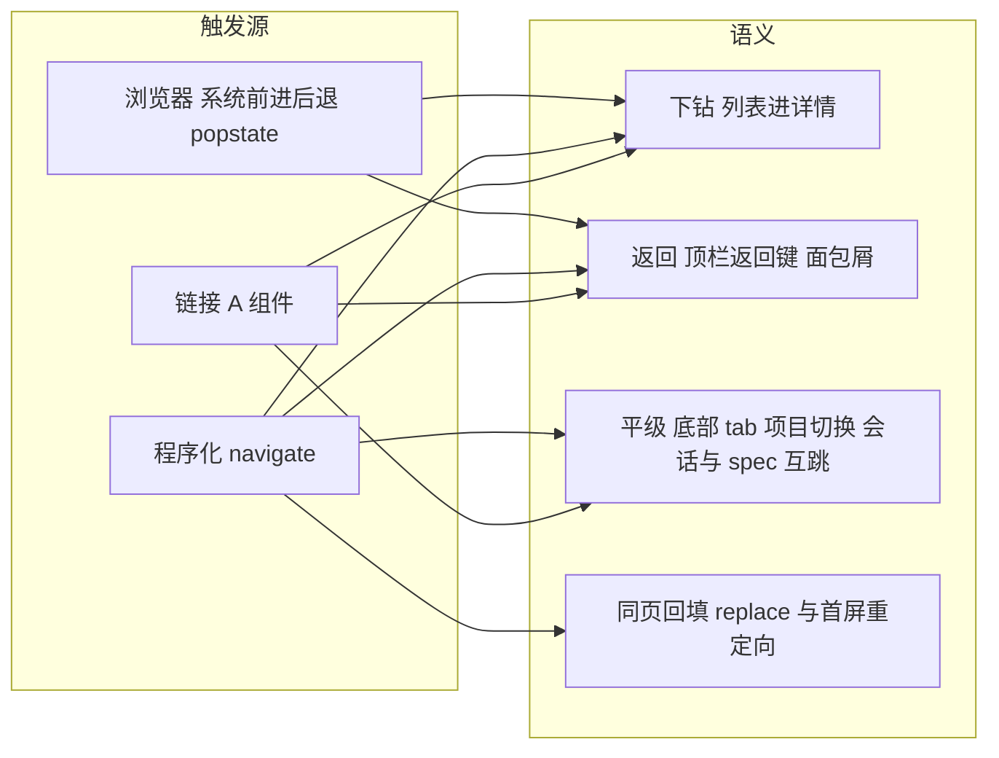
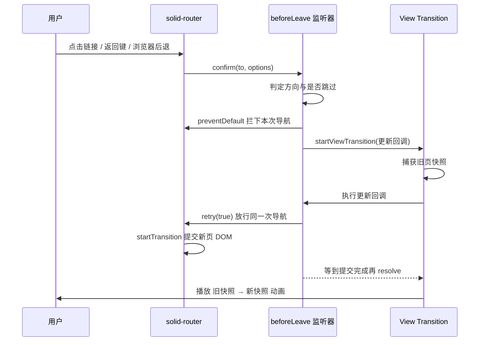
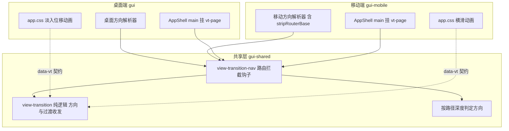
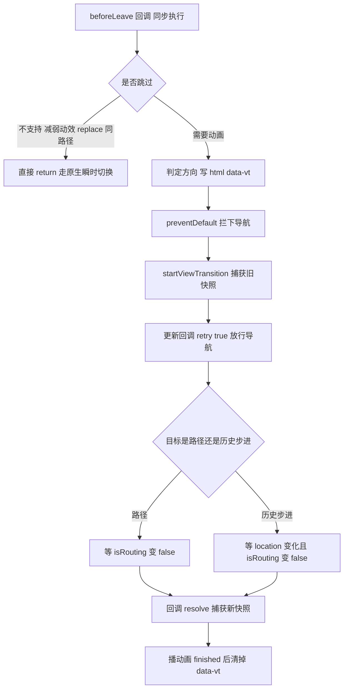
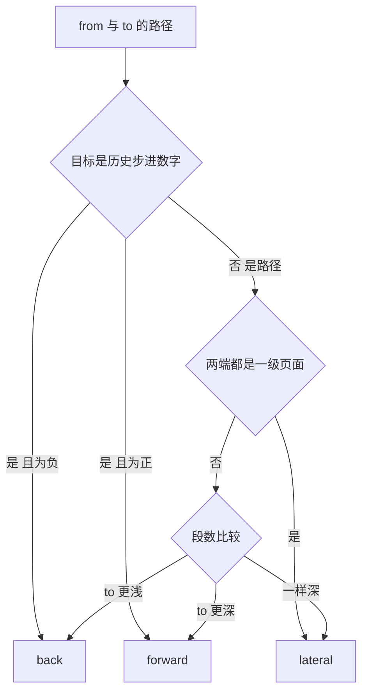
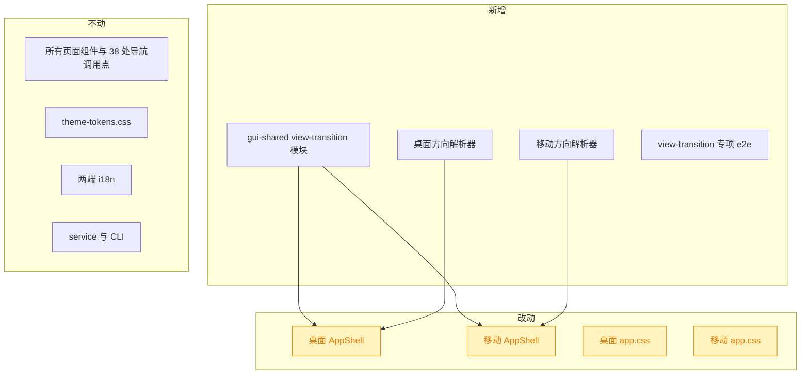

# 用 View Transition API 改进页面切换效果

## 1. 背景

原始需求：

> https://developer.mozilla.org/zh-CN/docs/Web/API/View_Transition_API
> 使用该 API 改进所有页面切换效果

两个前端（桌面端 `src/gui` 挂 `/`、移动端 PWA `src/gui-mobile` 挂 `/m/`）的路由切换目前都是「瞬间替换 DOM」：点列表项进详情、点返回、切底部 tab，画面直接跳变，没有任何层级或方向的暗示。移动端尤其明显——用户分不清自己是「钻进去了」还是「换了个模块」。

代码侧是一块绿地：全仓对 `startViewTransition` / `view-transition` / `<Transition>` / `solid-transition-group` 的搜索均零命中，两端 `app.css` 里也没有任何 `@keyframes`，现有动画全部是弹层/折叠这类组件级动效。

## 2. 需求

1. 两端所有**路由级页面切换**都带过渡动效，包括点链接、程序化 `navigate()`、以及浏览器/系统的前进后退。
2. 动效要表达**方向语义**：下钻（forward）、返回（back）、同级平移（lateral，如底部 tab 切换、项目切换）三种，各自有区分度。
3. 常驻外壳不参与页面动画：桌面端的顶栏 / 项目侧边栏 / 会话面板、移动端的状态横幅 / 底部导航 / toast，切页时不得跟着一起淡入淡出或被推走。
4. 不产生多余过渡：同页 URL 回填（`replace: true`）、首屏重定向、仅 search/hash 变化的导航不做动画。
5. 优雅降级：浏览器不支持（Firefox）或用户开启「减弱动态效果」时，行为与今天完全一致，无回归。
6. 不破坏现有 e2e：既有 Playwright 用例（含 `page.goBack()`、滚动位置保持、mermaid 复用等时序敏感用例）保持通过。

## 3. 现状分析

### 3.1 两端外壳：页面内容各有一个稳定的承载节点

两端的 `AppShell` 结构不同，但都有且只有一个 `<main>` 承载 `props.children`，且该 DOM 节点**跨路由持久存在**（只有子树被替换）——这正是 `view-transition-name` 想要的形态：同名元素在新旧两态都存在，浏览器才会把它当成「同一个东西」去做配对动画。



<details>
<summary>精确层：承载节点与常驻组件位置</summary>

- 桌面端 `src/gui/src/AppShell.tsx:290`：`<main class="flex min-h-0 min-w-0 flex-1 flex-col overflow-auto">{props.children}</main>`；同级持久组件 `ProjectsSidebar`（L288，自带折叠/hover-peek 动画 `ProjectsSidebar.tsx:307,317`）、`ChatPanel`（L289，`transition-[width]`）。
- 移动端 `src/gui-mobile/src/AppShell.tsx:25`：`<main class="flex min-h-0 flex-1 flex-col">{props.children}</main>`；`StatusBanner`（L24）、`TabBar`（L31-33，**仅 `isTabRoute()` 为真时渲染**，二级页整节点从 DOM 移除）、`Toaster`（L35）。
- 移动端 TopBar 在**页面内部**（`components/Page.tsx:46-63` 渲染 `TopBar` + `.scroll-y` + footer），天然跟随页面一起动。
- 两端路由都是**全量 eager import**，无 `lazy()` / `preload`（`src/gui/src/main.tsx:6-15`、`src/gui-mobile/src/main.tsx:9-22`），因此路由切换的 DOM 更新不涉及异步加载。

</details>

### 3.2 导航触发点全景：三类语义，且「返回」在 history 里其实是 push

全仓约 38 处导航触发点，分成三类语义。最关键的发现是：**移动端所有返回键都是 `navigate('/显式目标')`，桌面端的返回是面包屑 `<A>`——两者在 history 里都是 push，不是 pop**。这条是刻意的设计（`src/gui-mobile/src/components/GitPanel.tsx:39` 注释：「返回目标显式给出，不用 `history.back()`（PWA 冷启二级页会退出应用）」）。

后果：**方向不能靠 history delta 判断**，必须由应用侧自己推断。



<details>
<summary>精确层：导航触发点清单（按语义分类）</summary>

**移动端 · 下钻**：`pages/Sessions.tsx:107,143`、`pages/Specs.tsx:111,132`、`pages/Extensions.tsx:126,151,196`、`pages/Projects.tsx:42,97`、`pages/SpecDetail.tsx:438`、`pages/ext/Scripts.tsx:88`。

**移动端 · 返回（全部是 push）**：`pages/ChatDetail.tsx:198` → `/`、`pages/SpecDetail.tsx:345` → `/specs`、`pages/SpecGit.tsx:31` → `/specs/:id`、`pages/NewSpec.tsx:155` → `/specs`、`pages/ext/RunOutput.tsx:112` → `/ext`、`pages/ext/Scripts.tsx:126` → `/ext`、`pages/ext/GitStatus.tsx:15` → `/ext`、`pages/settings/GlobalSettings.tsx:66` → `/projects`、`pages/settings/ProjectSettings.tsx:86` → `/projects`。

**移动端 · 平级**：`components/TabBar.tsx:50` 的四个 `<A>`（`/` `/specs` `/ext` `/projects`）；会话与 spec 互跳 `pages/ChatDetail.tsx:208`、`pages/SpecDetail.tsx:308,329,497,511`、`components/GitPanel.tsx:252`。

**移动端 · 需跳过**：`pages/ChatDetail.tsx:134`、`pages/NewSpec.tsx:93,146` 三处 `{ replace: true }` 的同页 URL 回填。

**桌面端**：`<A>` 入口 `AppShell.tsx:179,186-195`、`components/ProjectsSidebar.tsx:370`（项目切换 = 平级）、`pages/SpecList.tsx:324`、`pages/SpecDetail.tsx:440,447`、`components/RunningCommands.tsx:98`、`components/Breadcrumb.tsx:23`（唯一返回入口，使用方 `SpecDetail.tsx:371`、`SpecDebug.tsx:80`、`GitStatus.tsx:20`、`NewSpec.tsx:183`、`SpecReview.tsx:35`）；程序化 `AppShell.tsx:119`、`components/CommandMenu.tsx:46`、`components/ProjectsSidebar.tsx:283`、`pages/SpecList.tsx:154`（SSE 异步触发，可能在用户交互中途突然发生）、`pages/SpecList.tsx:223,227`、`pages/NewSpec.tsx:98,172`；首屏重定向 `pages/ProjectIndexRedirect.tsx:16` 的 `<Navigate>`（内部即 `replace: true`）。

**移动端路径判断的前置约束**：`useLocation().pathname` 带着 `/m` 前缀，这一版 solid-router 不剥离 base，必须过 `src/gui-mobile/src/lib/routes.ts:23` 的 `stripRouterBase()`，否则路径深度整体算多一级。

</details>

### 3.3 solid-router 的唯一拦截点：`beforeLeave`

翻 `@solidjs/router@0.16` 的实现可以确认：**三类导航最终都汇合到 `beforeLeave.confirm()`**——这是拦截页面切换的唯一单点，不必去改 38 个调用点，也不必给 `<A>` 做包装。

- `navigate(string)`（含 `<A>` 点击，`<A>` 内部走的就是 navigate）→ `routing.js:471` `beforeLeave.confirm(resolvedTo, options)`。
- 浏览器前进后退 → `routers/Router.js` 的 popstate 监听 → `notifyIfNotBlocked(notify, delta => !beforeLeave.confirm(delta))`。
- `navigate(number)`（本仓库未使用）→ 直接 `history.go`，最终仍以 popstate 回到上面那条。

`useBeforeLeave` 的回调拿到 `{ from, to, options, preventDefault(), retry(force) }`。`retry(true)` 会置内部 `ignore` 标志再发起同一次导航，因此**不会重入自己的监听器**——这正是「先拦下、异步决定、再放行」的官方机制。



### 3.4 现有降级基建覆盖不到伪元素

两端 `app.css` 都已有 `prefers-reduced-motion` 降级块（`src/gui/src/app.css:36-44`、`src/gui-mobile/src/app.css:64-72`），但它用的是 `*, *::before, *::after` 选择器——`::view-transition-*` 是挂在文档根上的**独立伪元素树**，`*` 匹配不到，必须单独补规则或在 JS 层直接跳过。

浏览器支持面：Chrome 111+ / Safari 18+ 支持，Firefox 不支持；两个前端都是纯浏览器环境（无 Electron/Tauri，`src/service/static.ts` 提供静态 SPA，移动端是挂 `/m/` 的 PWA），所以必须做特性检测而不是假定可用。

<details>
<summary>精确层：会与页面过渡叠加的组件级动画</summary>

- 移动端弹层：`components/Sheet.tsx:36`、`ActionSheet.tsx:61`、`SelectionBar.tsx:30`（`fixed inset-x-0 bottom-0 z-50`）、`SettingsControls.tsx:44,78,84`、`ChatContextBlock.tsx:29`、`TabBar.tsx:53`（`transition-colors`）。
- 桌面端 Kobalte 弹层：`ui/dialog.tsx`、`popover.tsx`、`tooltip.tsx`、`select.tsx`、`dropdown-menu.tsx`、`toast.tsx`、`ImagePreview.tsx`、`collapsible.tsx`。
- 跨路由持久且自带动画：`components/ProjectsSidebar.tsx:307,317`、`components/ChatPanel.tsx:786` —— 这三处必须留在 root 快照里且 root 不做位移动画，否则会与自身的 `transition-[width]` / `animate-in` 叠成双重动画。
- 唯一的自定义 transition：`src/gui/src/app.css:149-152`（mermaid 全屏按钮）。
- Tailwind 侧只有 Kobalte 折叠用的 4 条 keyframes（`tailwind.config.cjs:75-98`）+ `tailwindcss-animate` 插件（L106）。
- e2e：`playwright.config.ts` 只跑 chromium（L32-37，**支持 VT，动画会真实生效**），时序敏感用例见 `__e2e__/focus-mode-persist.spec.ts:62-70`（含 `page.goBack()`）、`scroll-preserve.spec.ts`、`mermaid-preserve.spec.ts`、`mermaid-list-navigation.spec.ts:31-36`、`body-no-overflow.spec.ts`。

</details>

## 4. 技术实现方案

### 4.1 总体形态：一套共享机制 + 两套动画

机制层（拦截、时序、方向推断、降级、并发）是平台无关的纯逻辑，放进 `@shared`；方向判定的**特例规则**与**动画本身**两端各写各的——前者依赖各自的路由形状（移动端有 base 与 tab 路由，桌面端有 `:projectId` 段），后者本就该不同（移动端 iOS 式横滑，桌面端克制的淡入位移）。



> 决策说明（实施中补充）：共享层拆成两个文件——`view-transition.ts`（纯逻辑：方向推断、特性检测、`runViewTransition` / `waitFor` / `decideDirection`）与 `view-transition-nav.ts`（`useBeforeLeave` 拦截）。原计划放一个文件，实测不行：`@solidjs/router` 在 vitest 的 node 环境下**一 import 就抛**「Client-only API called on the server side」，同文件会让纯函数连带着测不了。拆开后跳过条件也能以 `decideDirection` 的形式单测，反而比原计划覆盖得更实。
>
> 决策说明：拦截点选 `useBeforeLeave` 而不是「包一层 `useNavigate` / 自定义 `<Link>`」。后者要改 38 个调用点、并且**永远盖不住** `<A>` 与浏览器前进后退；`beforeLeave` 是三类导航的共同汇合点（见 3.3），一处注册即全覆盖，新增页面零成本。
>
> 决策说明：不采用跨文档过渡（`@view-transition { navigation: auto }`）。两端都是 SPA，路由切换根本不发生文档导航；且 `/` 与 `/m/` 是两个独立应用，互相之间没有链接跳转，跨文档语义在这里没有落点。

### 4.2 时序：必须先 `preventDefault` 再在更新回调里 `retry`

这是整个方案里唯一需要精确对齐的地方。`document.startViewTransition(cb)` 的语义是：**先捕获旧快照 → 再执行 `cb` → 等 `cb` 返回的 promise resolve → 捕获新快照 → 播动画**。而 solid-router 的提交（`routing.js:359` 的 `transition()`）走 Solid 的 `startTransition`，在没有异步资源时**同步就把 DOM 换掉了**。

因此如果只是「在 beforeLeave 里顺手起一个 VT、不拦截导航」，DOM 会在浏览器捕获旧快照之前就更新完，旧快照拍到的是新页面，动画退化成「新页面淡入新页面」。正确顺序只能是：拦下 → 起 VT → 在更新回调里放行 → 等提交完成。



<details>
<summary>精确层：更新回调的等待实现与超时兜底</summary>

新增模块 `src/gui-shared/lib/view-transition.ts` 的核心导出：

- `VT_PAGE_NAME = 'page'`、`VT_DIRECTION_ATTR = 'data-vt'`：CSS 与 JS 之间的契约常量（CSS 侧手写同名字符串，模块注释里标明两处需同步）。
- `supportsViewTransition(): boolean` —— `typeof document !== 'undefined' && typeof document.startViewTransition === 'function'`。
- `prefersReducedMotion(): boolean` —— `window.matchMedia('(prefers-reduced-motion: reduce)').matches`，每次调用现读（用户可能中途改系统设置）。
- `runViewTransition(direction, update)` —— 模块级持有 `current: ViewTransition | null`，新过渡开始前对上一个调 `skipTransition()`（应对 SSE 触发的连发导航，见 `SpecList.tsx:154`）；开始前写 `document.documentElement.setAttribute('data-vt', direction)`，在 `finished` 的 `finally` 里清掉属性并释放 `current`。`update` 抛错时同样要清属性，否则下一次过渡会用错方向。
- `waitFor(pred, timeoutMs = 600)` —— 谓词已满足则同步 resolve；否则 `createRoot` 内起一个 `createEffect` 订阅谓词，配合 `setTimeout` 兜底，任一先到即 `dispose()` + resolve（内部 `done` 加 once 守卫防重复 resolve）。超时兜底是硬要求：谓词永不满足时（例如历史步进落到同一 pathname）不能把过渡永久挂起。
- `createViewTransitionNav({ resolveDirection })` —— 在 `useBeforeLeave` 里落地上图流程；内部用 `useLocation()` 读提交后的路径、`useIsRouting()` 判断 Solid 事务是否收敛。

`e.retry(true)` 的 `force` 参数不能省：它置上 `createBeforeLeave` 的 `ignore` 标志，避免二次进入自己的监听器造成死循环（`node_modules/@solidjs/router/dist/lifecycle.js:22-25`）。

历史步进（`typeof e.to === 'number'`）之所以要额外等 `location` 变化：`retry` 对数字目标走的是 `utils.go(delta)` → `history.go`，DOM 提交发生在后续的 popstate 任务里，此刻 `isRouting()` 还是 false，只等它会立刻 resolve 而拍到旧 DOM。

</details>

### 4.3 方向判定：按路径段深度，不看 history

因为应用内的「返回」是 push（见 3.2），history delta 在这里没有信息量。改用**路径段深度**推断，规则简单且对两端都成立：



对照实际路由验证：`/specs` → `/specs/:id` 更深 = forward；`/specs/:id/git` → `/specs/:id` 更浅 = back；`/settings/global` → `/projects` 更浅 = back；`/sessions/:id` → `/specs/:id` 同深 = lateral；桌面端 `/:projectA` → `/:projectB` 同深 = lateral；`/:pid/specs/:id` → `/:pid` 更浅 = back。九处移动端返回键、桌面端面包屑全部落在 back 分支，无一例外。

<details>
<summary>精确层：两端解析器与跳过条件</summary>

共享纯函数（可在 node 环境下单测）：

- `pathDepth(path)`：`path.split('/').filter(Boolean).length`。
- `resolveDirectionByDepth(from, to)`：按上图返回 `'forward' | 'back' | 'lateral'`。

桌面端 `src/gui/src/lib/vt-direction.ts`：直接取 `new URL(to, location.origin).pathname` 与当前 pathname 交给 `resolveDirectionByDepth`；`/` 与 `/:projectId` 的一级差异天然落进 forward/back，无需特例。

移动端 `src/gui-mobile/src/lib/vt-direction.ts`：两侧路径先过 `stripRouterBase()`（`lib/routes.ts:23`）再比较；额外一条特例——`isTabRoute(from) && isTabRoute(to)` 时直接返回 `lateral`（四个一级页面互切是同级平移，而 `/` 与 `/specs` 的段数分别是 0 和 1，不特例会被误判成 forward）。

跳过条件（任一命中就直接放行，不起过渡）：

1. `!supportsViewTransition() || prefersReducedMotion()`；
2. `e.defaultPrevented`（已有别的监听器拦截，不抢）；
3. `e.options?.replace === true`（同页 URL 回填 `ChatDetail.tsx:134` / `NewSpec.tsx:93,146`、首屏重定向 `ProjectIndexRedirect.tsx:16`）；
4. 目标是字符串且解析出的 pathname 与当前相同（只改 search/hash，例如列表分页）；
5. `resolveDirection` 返回 `null`（给两端解析器留的显式豁免口子）。

</details>

### 4.4 CSS 契约与两端动效

JS 只做一件事：在过渡期间把 `data-vt="forward|back|lateral"` 写在 `<html>` 上。剩下全由 CSS 决定，两端各自实现，互不牵连。

统一契约：页面承载节点带 `.vt-page`，在过渡期间（`html[data-vt]` 存在时）取得 `view-transition-name: page`，于是 `page` 组与 `root` 组彻底分离——外壳落在 `root` 快照里，页面单独动。

- **移动端**（`src/gui-mobile/src/app.css`）：iOS 推入式。forward = 新页从右侧 100% 滑入、旧页左移 25% 并轻微变暗；back = 反向；lateral = 纯淡入淡出（tab 切换不做位移，否则四个 tab 之间要维护左右关系，收益不抵复杂度）。`root` 组给 160ms 淡入淡出，让底部导航在一级/二级页之间出现消失时不硬闪。时长 260ms、缓动 `cubic-bezier(0.32, 0.72, 0, 1)`。
- **桌面端**（`src/gui/src/app.css`）：克制得多。forward/back = 淡入 + 6px 纵向位移（方向相反），lateral = 纯淡入淡出；`root` 组显式 `animation: none`，让顶栏 / 侧边栏 / 会话面板在切页时完全静止——它们自带 `transition-[width]` 与 `animate-in`，再叠一层 root 淡入会变成双重动画。时长 180ms。

<details>
<summary>精确层：CSS 骨架（两端同构，动画名与数值不同）</summary>

```css
:root {
  --vt-duration: 260ms; /* 桌面端 180ms */
  --vt-ease: cubic-bezier(0.32, 0.72, 0, 1);
}

/* 页面承载节点。只在过渡期间命名，理由见下方决策说明 */
html[data-vt] .vt-page {
  view-transition-name: page;
}

::view-transition-image-pair(page) {
  isolation: auto;
}
::view-transition-old(page),
::view-transition-new(page) {
  animation-duration: var(--vt-duration);
  animation-timing-function: var(--vt-ease);
  /* 两页都不透明，默认的 plus-lighter 混合会让交叠处发白 */
  mix-blend-mode: normal;
}

html[data-vt='forward']::view-transition-old(page) {
  animation-name: vt-out-back;
}
html[data-vt='forward']::view-transition-new(page) {
  animation-name: vt-in-from-right;
}
/* back / lateral 同构，另配 keyframes */

@media (prefers-reduced-motion: reduce) {
  ::view-transition-group(*),
  ::view-transition-old(*),
  ::view-transition-new(*) {
    animation: none !important;
  }
}
```

注意事项：

- 这些规则写在 Tailwind 的 `@layer` 之外——伪元素树不属于 base/components/utilities 任何一层，塞进 `@layer utilities` 只会让优先级更难推理。
- `.vt-page` 挂在两端 `AppShell` 的 `<main>` 上（`src/gui/src/AppShell.tsx:290`、`src/gui-mobile/src/AppShell.tsx:25`），全局同名只能有一个元素，两端各自一个 `<main>`，天然满足唯一性。名字本身由 `html[data-vt]` 这层前置选择器控制，只在过渡期间生效。
- CSS 侧的 `data-vt` 与 `page` 是手写字符串，与 `@shared/lib/view-transition.ts` 的 `VT_DIRECTION_ATTR` / `VT_PAGE_NAME` 常量对应，两处都要留注释标注同步关系。

</details>

> 决策说明（实施中补充）：`view-transition-name` 写成 `html[data-vt] .vt-page` 而不是常驻的 `.vt-page`。按 CSS View Transitions 规范，取值非 `none` 的元素**恒定形成一个层叠上下文**（还会成为 backdrop root）；常驻挂在 `<main>` 上就把页面内的浮层关进了 main 的层叠上下文——移动端的 `Sheet` / `ActionSheet`（`z-[60]`）、`MermaidViewer`（`z-[70]`）都渲染在页面内部，而 `Toast`（`z-50`）是 `<main>` 的兄弟节点排在其后，层叠关系会被悄悄反转。绑到过渡标记上之后，属性只在那两百多毫秒里存在（旧快照捕获在写入之后、新快照在清除之前，两头都覆盖得到），平时零副作用。

> 决策说明：`--vt-*` 令牌放在各自的 `app.css`，不进 `src/styles/theme-tokens.css`。那份文件是「改一处生效两端」的**主题**令牌（颜色/圆角/字体），而这次两端的时长与缓动**刻意不同**（移动端 260ms 横滑 vs 桌面端 180ms 淡入）；放进共享令牌就得立刻再拆两套覆盖，等于把耦合写进最该保持干净的文件。
>
> 决策说明：移动端 `TabBar` 维持「二级页不渲染」的现状，不改成「常驻 + CSS 隐藏」。改成常驻能做出 iOS 那种「底栏钉住、内容横滑」，但它会推翻 260906 那轮已确立的布局口径（二级页不出底部导航），还要重排高度链条上的 `min-h-0`；本次让 TabBar 留在 root 快照里做 160ms 淡出，视觉上已经不硬闪，代价小得多。
>
> 决策说明：方向不做「显式标记注入」（例如给 `onBack` 传 `direction: 'back'`）。深度规则对现有 9 处返回键 + 桌面面包屑 100% 命中，而显式标记要改十几个调用点、且新增页面时容易漏标；真出现推断不准的路由，两端解析器里加一条特例即可（`resolveDirection` 返回值也允许为 `null` 直接豁免）。

### 4.5 并发、失败与降级

- **连发导航**：模块级只保留一个 in-flight `ViewTransition`，新过渡开始前 `skipTransition()` 掉旧的。桌面端 `SpecList.tsx:154` 的 SSE 跳转可能在用户点击的过渡中途插入，靠这条兜住。
- **等待超时**：更新回调的等待带 600ms 上限，超时即 resolve（动画可能拍到中间态，但导航本身早已由 `retry` 放行，不会卡死或丢失导航）。
- **属性泄漏**：`data-vt` 在 `finished` 的 `finally` 里清除，异常路径也走同一处，避免下一次过渡沿用上一次的方向。
- **不支持 / 减弱动效**：JS 层直接不进 VT 分支（原生瞬时切换，与今天完全一致）；CSS 层再补一条 `prefers-reduced-motion` 兜底，防止将来别处直接调用 `startViewTransition` 时漏掉。

### 4.6 影响范围



- 🟡 两端 `AppShell` 各加一行 class + 一次钩子调用；两端 `app.css` 各加一段 VT 规则。
- `playwright.config.ts` 最终**未改动**：原计划的全局 `reducedMotion: 'reduce'` 实测会让主题切换用例挂掉（见下方决策说明与执行记录），既有用例改为在真实动画下跑，全量 e2e 已验证通过。
- 页面组件、38 处导航调用点、i18n、service/CLI 全部零改动——本次没有任何用户可见文案，不涉及国际化。

> 决策说明（实施中修正）：**放弃**「e2e 全局 `reducedMotion: 'reduce'`」这一步，`playwright.config.ts` 保持原样。原计划是让既有用例回到瞬时切换以保稳态，实测却发现开启后 `theme-switch.spec.ts` 必挂（切到暗色后读到的仍是亮色底色 / 焦点 outline 停在上一个主题族的 ring 色）——用「只 stash 掉这一处配置改动」的对照跑两轮确认了因果：加上必挂、去掉即全绿。根因指向那条既有的 `@media (prefers-reduced-motion: reduce) { * { transition-duration: 0.01ms !important } }` 与 Kobalte 菜单/主题切换的交互，与本次改动无关，不该由这个 spec 顺手改掉主题相关的实现或用例。
>
> 去掉它之后，既有用例是在**真实过渡动画**下跑的——全量 e2e 已验证通过，说明先前担心的时序敏感用例（`focus-mode-persist` 的 `page.goBack()`、`scroll-preserve`、`mermaid-*`）并不受影响。专项用例仍按原计划保留，并各自显式 `test.use({ contextOptions: { reducedMotion: ... } })` 覆盖「真实过渡」与「减弱动效直接跳过」两条路径。
>
> 决策说明：不用 `navigator.webdriver` 在产品代码里识别自动化环境来关动画。那等于把测试基建的知识写进运行时逻辑，且会顺带影响任何用 WebDriver 的真实用户场景；用 `prefers-reduced-motion` 达到同样效果，还顺手把可访问性需求一起满足了。

### 4.7 验证方式

- `pnpm run typecheck`、`pnpm test`（新增方向判定与跳过条件的单测，纯函数、node 环境可跑）。
- `pnpm test:e2e` 跑全量既有用例 + 新增的过渡专项用例（断言：下钻后 `data-vt=forward`、`page.goBack()` 后 URL 与页面内容正确且历史栈没错乱、过渡结束后 `data-vt` 被清除、减弱动效下全程不写属性）。
- 人工确认：桌面端 Chrome 与移动端真机各走一遍下钻 / 返回 / tab 切换，浅色暗色各看一次；Firefox 或开启「减弱动态效果」后确认退化为瞬时切换且无异常。

## 5. 待确认项

_暂无_

## 6. 任务清单

- [x] 新增 `src/gui-shared/lib/view-transition.ts`：导出 `VT_PAGE_NAME` / `VT_DIRECTION_ATTR` 常量、`supportsViewTransition()`、`prefersReducedMotion()`、`pathDepth()`、`resolveDirectionByDepth()`（验收：纯函数无 DOM 依赖，`pnpm run typecheck` 通过）
- [x] 在同一模块实现 `runViewTransition(direction, update)`：模块级单例 in-flight 过渡、开始前 `skipTransition()` 旧过渡、写 `data-vt`、`finished` 的 `finally` 清属性（验收：异常路径也清属性，读代码确认无泄漏分支）
- [x] 在同一模块实现 `waitFor(pred, timeoutMs = 600)`：谓词已满足同步 resolve，否则 `createRoot` + `createEffect` 订阅并带 setTimeout 兜底，once 守卫防重复 resolve（验收：超时分支存在且会 `dispose()`）
- [x] 在 `src/gui-shared/lib/view-transition-nav.ts` 实现 `createViewTransitionNav({ resolveDirection })`：`useBeforeLeave` 内按 4.3 的五条跳过条件放行，否则 `preventDefault()` → `runViewTransition` → 回调内 `e.retry(true)` → 按目标类型（路径 / 历史步进）等提交完成（验收：数字目标额外等 `location.pathname` 变化，`pnpm run typecheck` 通过）
- [x] 新增 `src/gui/src/lib/vt-direction.ts`：桌面端解析器，把目标解析成 pathname 后交给 `resolveDirectionByDepth`（验收：`/:pid/specs/:id` → `/:pid` 判为 back、`/:pidA` → `/:pidB` 判为 lateral）
- [x] 新增 `src/gui-mobile/src/lib/vt-direction.ts`：两侧路径先过 `stripRouterBase()`，`isTabRoute` 双真时直接返回 lateral，其余走深度规则（验收：`/m/` → `/m/specs` 判为 lateral，`/m/specs` → `/m/specs/x` 判为 forward）
- [x] 桌面端接入：`src/gui/src/AppShell.tsx` 调用 `createViewTransitionNav`，并给 L290 的 `<main>` 加 `vt-page` class（验收：外壳其余节点未改动，`pnpm run typecheck` 通过）
- [x] 移动端接入：`src/gui-mobile/src/AppShell.tsx` 调用 `createViewTransitionNav`，并给 L25 的 `<main>` 加 `vt-page` class（验收：`TabBar` 的条件渲染逻辑不变）
- [x] 在 `src/gui-mobile/src/app.css` 追加 VT 段：`--vt-duration: 260ms` 与缓动、`.vt-page`、page 组三向动画（forward/back 横滑、lateral 淡入淡出）、root 组 160ms 淡入淡出、`prefers-reduced-motion` 兜底（验收：规则写在 `@layer` 之外，含与常量同步的注释）
- [x] 在 `src/gui/src/app.css` 追加 VT 段：`--vt-duration: 180ms`、`.vt-page`、page 组淡入 + 6px 纵向位移（forward/back 反向）与 lateral 纯淡入、root 组 `animation: none`、`prefers-reduced-motion` 兜底（验收：侧边栏与会话面板在切页时不参与动画）
- [x] 新增 `src/gui/src/lib/__tests__/vt-direction.test.ts`：覆盖 `pathDepth` / `resolveDirectionByDepth` 与桌面解析器（含项目切换 lateral、面包屑 back）（验收：`pnpm test` 通过）
- [x] 新增 `src/gui-mobile/src/lib/__tests__/vt-direction.test.ts`：覆盖带 `/m` 前缀的路径、四个 tab 互切判 lateral、二级页返回判 back、三级页 `/specs/:id/git` → `/specs/:id` 判 back（验收：`pnpm test` 通过）
- [x] 评估 e2e 是否需要全局关动画：实测全局 `reducedMotion: 'reduce'` 会让 `theme-switch.spec.ts` 失败，最终 `playwright.config.ts` 保持不动、既有用例在真实动画下跑（验收：对照跑确认因果，全量 e2e 通过）
- [x] 新增 `src/gui/src/__e2e__/view-transition.spec.ts`：两个 describe 各自 `test.use({ contextOptions: { reducedMotion: ... } })`，覆盖下钻时 `<html data-vt>` 出现、过渡结束后属性被清除、`page.goBack()` 后 URL 与内容正确、减弱动效下全程不写属性（验收：三条新用例通过）
- [x] 运行 `pnpm run typecheck` 与 `pnpm test`，并对改动文件跑 prettier（验收：两条命令通过，结果写入执行记录）
- [x] 运行 `pnpm test:e2e` 全量回归（验收：既有用例 + 新增专项用例结果写入执行记录，失败项须区分是否与本次改动相关）
- [ ] [manual] 人工观感确认：桌面 Chrome 与移动端真机各走一遍下钻 / 返回 / tab 切换，浅色暗色各一次；再在 Firefox 或开启「减弱动态效果」下确认退化为瞬时切换（验收：人工回复确认）

## 7. 追加任务

- [done] [fix] 2026-09-06 23:46:32 | 页面切换时，某些能看到底部页面的内容
  - 描述：页面切换时，某些能看到底部页面的内容
可能一些页面高度未占满屏幕，或页面背景是透明的
比如 spec 详情页，脚本管理页

## 8. 执行记录

- 共享机制层落地为两个文件：`src/gui-shared/lib/view-transition.ts`（常量 `VT_PAGE_NAME` / `VT_DIRECTION_ATTR`、`supportsViewTransition` / `prefersReducedMotion`、`pathDepth` / `resolveDirectionByDepth` / `toPathname`、`waitFor`、`runViewTransition`、`decideDirection`）与 `src/gui-shared/lib/view-transition-nav.ts`（`createViewTransitionNav`，`useBeforeLeave` 拦截 + `retry(true)` 重放 + 等提交）。拆分的直接原因是 `@solidjs/router` 在 vitest 的 node 环境下一 import 就抛「Client-only API called on the server side」——首版单文件时两个测试文件都以 0 test 失败，拆开后纯函数可直接测。
- `runViewTransition` 用模块级单例记录在途过渡，新过渡开始前 `skipTransition()` 旧的；`finished` 的 `finally` 里只有「自己仍是当前过渡」时才清 `data-vt`，避免连发时后一个的方向被前一个的收尾抹掉。
- 两端解析器：`src/gui/src/lib/vt-direction.ts` 直接按深度判；`src/gui-mobile/src/lib/vt-direction.ts` 先 `stripRouterBase()` 再判，并对「两端都是一级页面」特例返回 lateral（`/` 深度 0 与 `/specs` 深度 1 否则会被误判成下钻）。两者都把数字目标按正负映射为 forward/back，0 返回 null。
- 两端 `AppShell` 各加一次 `createViewTransitionNav(...)` 调用与 `<main>` 上的 `vt-page` class，其余结构未动；移动端 `TabBar` 的条件渲染保持原样。
- CSS：移动端 `app.css` 追加 260ms iOS 推入式（forward 新页右侧滑入 + 旧页左移 25% 变暗、back 反向、lateral 淡入淡出）与 root 160ms 淡入淡出；桌面端 `app.css` 追加 180ms 淡入 + 6px 纵向位移，并显式 `::view-transition-old(root)/new(root) { animation: none }` 让顶栏 / 侧边栏 / 会话面板静止。两端都补了 `prefers-reduced-motion` 的伪元素兜底，规则写在 `@layer` 之外。
- 单测：`src/gui/src/lib/__tests__/vt-direction.test.ts`（13 条，含 `decideDirection` 的五条跳过条件）、`src/gui-mobile/src/lib/__tests__/vt-direction.test.ts`（5 组）。
- e2e：`playwright.config.ts` 的 `use` 加 `contextOptions: { reducedMotion: 'reduce' }`——首版写成平铺的 `reducedMotion`，被 playwright 1.61 的类型拒绝（该键只在 `contextOptions` 下），已修正；新增 `src/gui/src/__e2e__/view-transition.spec.ts`，用 MutationObserver 记录 `data-vt` 的每次取值（180ms 的过渡靠轮询会漏），覆盖下钻标记 forward、`page.goBack()` 后标记 back 且真的回到列表页、以及减弱动效下全程不写属性三条。
- 实施中修正一：`view-transition-name` 由常驻的 `.vt-page` 改成 `html[data-vt] .vt-page`。查规范时确认「取值非 none 的元素恒定形成层叠上下文」，常驻会把移动端页面内的 `Sheet` / `ActionSheet`（`z-[60]`）、`MermaidViewer`（`z-[70]`）关进 `<main>` 的层叠上下文，让排在其后的 `Toast`（`z-50`）反而盖住它们；绑到过渡标记上后，属性只在过渡期间存在，平时零副作用，两次快照（旧在写入后、新在清除前）都覆盖得到。
- 实施中修正二：撤销 `playwright.config.ts` 的全局 `contextOptions: { reducedMotion: 'reduce' }`。加上它以后 `theme-switch.spec.ts` 稳定失败（第一轮全量跑挂在「切到暗色后背景色未变」，单跑该文件两轮均挂在「焦点 outline 用当前主题 ring 色」，读到的都是上一个主题的值）；用「只 stash 掉这一处配置」的对照跑验证：去掉即 6/6 全绿，加上即挂。根因指向既有的 `@media (prefers-reduced-motion: reduce) { * { transition-duration: 0.01ms !important } }` 与 Kobalte 菜单/主题切换的交互，与本次改动无交集，故不在本 spec 内扩大范围去动主题实现或那份用例。
- e2e 全量（真实动画下）：53 passed / 2 failed，两条失败都在 `sidebar-hover-peek.spec.ts`（断言折叠态侧栏宽度 36 vs 37.5 的像素差）。已用对照确认是**既有失败**：把本次四个改动文件（两端 AppShell + 两端 app.css）stash 掉重新构建后跑同一文件，仍是 2 failed / 1 passed，与带改动时一致。新增的三条过渡专项用例全绿，其中「浏览器后退仍然生效且标记为 back」正是 `preventDefault + retry(true)` 重放历史步进那条最脆的路径。
- 验证：`pnpm run typecheck` 通过；`pnpm test` 876 passed / 1 failed / 2 skipped，唯一失败是既有的 `src/service/__tests__/git-routes.test.ts > surfaces the underlying git stderr on failure`（断言本地 git stderr 文案，与本次改动无交集，上一轮 spec 的执行记录里已有同一条）；改动文件全部通过 `prettier --check`。
- 收尾：非 manual 任务全部完成，待确认项为 `_暂无_`、无 `！！！` 批注、无 `[open]` 追加任务，标记 `done`。剩余的 `[manual]` 人工观感确认（含 Firefox / 减弱动效下的降级复看）按约定不阻断收尾。
- 追加 fix「切页能看到底下那一页的内容」已按 yorz-debug 走完闭环，详见同目录 `debug.md` 的 `## Debug 1`。根因：`<main>` 自身没有背景（底色一直来自 body），而 `page` 快照只拍 `<main>` 子树，没画到的地方是透明的——两页快照叠着放，新页一透就能看到旧页；`TopBar` 的 `bg-background` 与列表 `<ul>` 的 `bg-card` 遮住了一部分，所以只有正文区无底色的页面（spec 详情、脚本管理）明显。修复是在 `html[data-vt] .vt-page` 上补 `background-color: hsl(var(--background))`（两端各一处），外加移动端 `back` 方向给 `::view-transition-old(page)` 补 `z-index: 1`——旧页一旦不透明就会被新页盖死，`vt-page-exit-right` 会白写。用户猜的「页面高度未占满屏幕」已证伪：`<main>` 实测恒为 390×844，撑满视口。
