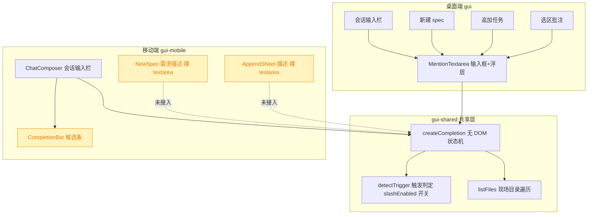
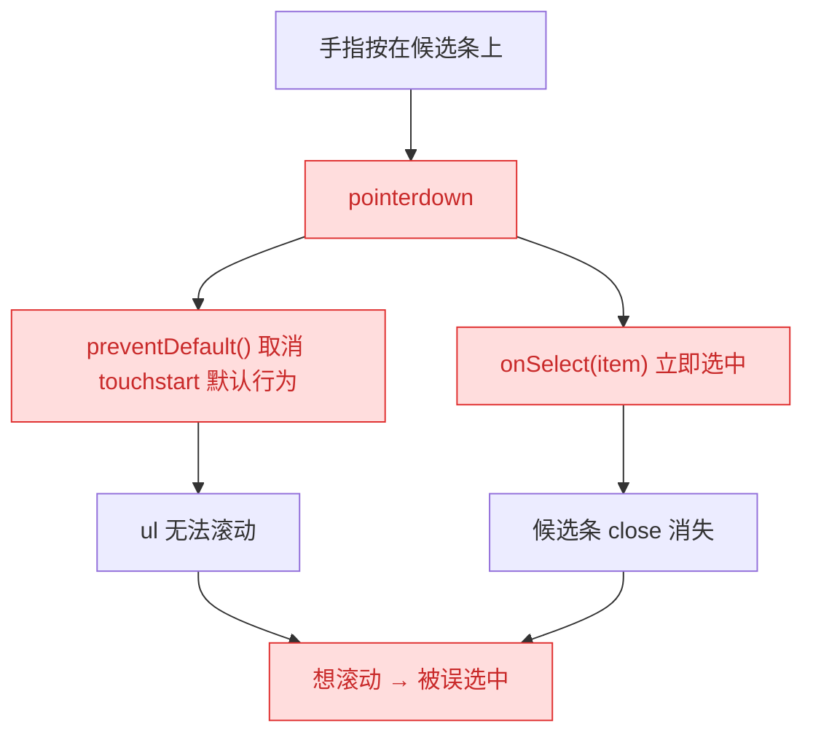
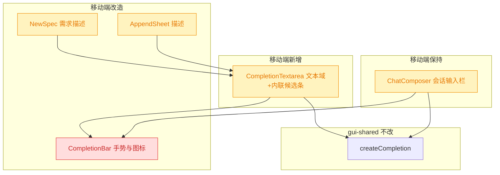
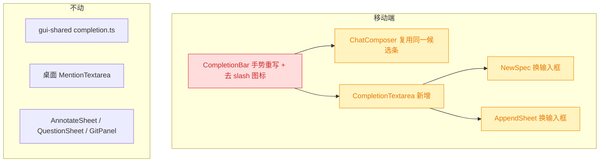

# 移动端补全交互修复

## 1. 背景

用户原始反馈（全部落在移动端 `src/gui-mobile`）：

> 当前 mobile session 详情页中的输入框已经可以触发指令 `/` 和文件路径补全 `@`；
>
> 1. 其他输入框也需要文件路径补全：新建 spec、追加任务；
> 2. 指令与文件路径补全列表，点击即选中，无法通过 touch 事件滚动列表；
> 3. 指令列表之前不需要 `/` icon。

三条都围绕同一套补全 UI（`CompletionBar` + `@shared/lib/completion.js`）：一条是覆盖面（其它输入框没接），一条是触屏手势（按下即选中，吃掉了滚动），一条是视觉冗余。合并成一个 spec 修，比拆三个更省——它们改的是同一批文件。

## 2. 需求

- **B1 补全覆盖新建 spec 与追加任务**：移动端「新建 spec」的需求描述输入框、「追加任务」弹层的描述输入框，都要支持 `@` 文件路径补全，交互口径与会话输入框一致（同一个共享状态机、同一套候选条 UI）。这两处**只要 `@`**、不要 `/` 指令，与桌面端 `NewSpec` / `AppendTaskDialog` 对齐。
- **B2 候选列表可 touch 滚动**：候选条超过一屏时可以用手指拖动滚动；滚动手势结束后**不得**误选中任何候选项。点选（轻触）仍然一次命中，且不因软键盘收起导致的布局跳动而选错项。
- **B3 指令项去掉 `/` 图标**：`/` 指令候选项前不再渲染 `Slash` 图标；`@` 文件路径项的文件图标保留。

## 3. 现状分析

### 3.1 补全能力在两端的分布

移动端只有会话输入栏接了补全，桌面端的 `MentionTextarea` 已被 4 处复用——B1 修的就是这条能力差。



<details>
<summary>精确层：涉及的文件与关键位置</summary>

- `src/gui-shared/lib/completion.ts` — `createCompletion()`（L214）、`detectTrigger(text, pos, slashEnabled)`（L122）、`applyCompletion`、`replacementFor`。`handleInput` 内 `slashEnabled = (options.slashCommands?.() ?? []).length > 0`（L290），即**不传 slashCommands 即自动只留 `@`**，无需新增开关。
- `src/gui-mobile/src/components/ChatComposer.tsx` — L57-64 建 controller（`MOBILE_SEARCH_DEBOUNCE_MS = 280`，L17）；L81-90 `onSelectCompletion` 在 rAF 里 `focus()` + `setSelectionRange`；L94-100 渲染 `CompletionBar`（输入栏容器 `.kb-inset` 的第一个子元素）；L189-192 `onBlur` 延迟 `BLUR_CLOSE_DELAY_MS = 150` 关闭。
- `src/gui-mobile/src/components/CompletionBar.tsx` — L32 滚动容器 `<ul class="scroll-y m-0 max-h-[38dvh] list-none p-0">`；L44-48 每项 `onPointerDown` 里 `preventDefault()` + `props.onSelect(item)`；L50-57 icon（`Slash` / `FileCode2`）。
- `src/gui-mobile/src/pages/NewSpec.tsx` — L187-193 裸 `<textarea rows={8}>`，`onInput` 只 `setRequirement`。
- `src/gui-mobile/src/components/AppendSheet.tsx` — L107-113 裸 `<textarea rows={5}>`，装在 `Sheet` 的 `.scroll-y` 正文区（`Sheet.tsx:49`，卡片 `max-h-[85dvh]`）。
- `src/gui-mobile/src/app.css:58-62` — `.scroll-y { overflow-y:auto; overscroll-behavior-y:contain; -webkit-overflow-scrolling:touch }`；全库仅 `MermaidViewer.tsx:42` 用到 `touch-action`，候选条及其祖先均未设置。
- 桌面参照：`src/gui/src/components/MentionTextarea.tsx`（`onMouseDown` + `preventDefault` 选中，L193-196）、`src/gui/src/pages/NewSpec.tsx:237`、`src/gui/src/components/AppendTaskDialog.tsx:133`（两处均**未传** `slashCommands`）。

</details>

### 3.2 B2 的根因：按下即选中，吃掉了滚动手势

候选项按钮 `min-h-[44px] w-full` 铺满整行，任何落在列表上的触摸都命中它；`pointerdown` 第一件事就是 `preventDefault()`——在 iOS Safari 上 pointer 事件由 touch 事件派生，这一下会连带取消 `touchstart` 的默认行为，`ul` 的滚动因此起不来。更致命的是同一个 handler 紧接着就执行了 `onSelect`：即便浏览器仍允许滚动，手指刚按下候选条就已经被选中并 `close()` 掉了。所以 `max-h-[38dvh]` 这个高度在实机上是**不可滚动**的。



原实现这么写有其历史理由（组件头部注释第 3 条）：iOS 上 `mousedown` 是合成事件、晚于失焦，若在 `click` 里选中，会先收键盘、`.kb-inset` 回落导致列表整体上移，`click` 落到错位的那一项。这个顾虑是真的，所以修复不能简单退回 `onClick`——必须在**不放弃「选中早于布局变化」**的前提下把滚动手势让出来。

对比同仓库其它移动端组件：`SelectionBar.tsx:44/52/61` 是「`onPointerDown` 只 `preventDefault`、动作放 `onClick`」的分离写法；`CompletionBar` 是全库唯一在 pointerdown 里直接触发动作的地方。

### 3.3 B1 的位置约束：浮层会被 overflow 裁掉

桌面 `MentionTextarea` 用 `absolute bottom-full` 把浮层吊在输入框上方。移动端两个新宿主都装在 `overflow-y: auto` 的滚动容器里（`NewSpec` 的页面正文、`AppendSheet` 的 `Sheet` 正文），绝对定位浮层会被祖先的 overflow 裁切；`Sheet` 卡片本身还有 `max-h-[85dvh]` 上限。会话输入栏之所以没这问题，是因为它的候选条是 `.kb-inset` 固定栏的兄弟节点、不在任何滚动容器内。所以 B1 不能照搬会话输入栏那套定位。

## 4. 技术实现方案

### 4.1 总体改动结构

新增一个移动端「带补全的文本域」组件 `CompletionTextarea`，把 `createCompletion` + `CompletionBar` + 自增高 + 选中后收尾光标这套样板收进去，供 `NewSpec` / `AppendSheet` 直接替换裸 `<textarea>`；`CompletionBar` 内部换掉手势实现并删掉 `/` 图标。



### 4.2 B2 候选条手势：改为「pointerup + 位移阈值」判定轻触

放弃在 `pointerdown` 里 `preventDefault` 与选中，改为在 `pointerdown` 只记录起点、在 `pointerup` 判定这是不是一次轻触（位移未超阈值）再选中。

- **滚动被让出来**：`pointerdown` 不再 `preventDefault`，`touchstart` 的默认行为完整保留，`.scroll-y` 的惯性滚动恢复；滚动手势位移必然超阈值，`pointerup` 时不会选中。
- **仍然「选中早于布局变化」**：选中发生在 `pointerup`，早于合成的 `mousedown` / `focus` 迁移 / `click`。3.2 里那个「键盘收起导致点错项」的竞态，根因是把动作推到了 `click`；推到 `pointerup` 同样能规避，无需靠 `pointerdown` 的 `preventDefault` 冻结焦点。
- **抑制后续合成事件**：在 `pointerup`（及配套的 `touchend`）里，仅当判定为轻触时 `preventDefault()`，尽量不让浏览器再补发 `mousedown`/`click`、不迁移焦点。这是尽力而为的锦上添花——即使某内核不买账，选中也已经落定；宿主在 rAF 里重新 `focus()` + `setSelectionRange` 会把键盘与光标拉回来（`ChatComposer` 已有，新组件同样实现）。
- **`pointercancel` 归零**：浏览器接管为滚动/系统手势时会派发 `pointercancel`，此时必须丢弃起点，避免残留状态在下一次 `pointerup` 误判成轻触。

> 决策记录：B2 的手势方案不写成待确认项——三条候选（退回 `onClick` / `pointerdown` 条件 `preventDefault` / `pointerup` 阈值判定）里，前两条各自违背 3.2 已记录的历史约束或依赖内核对 `preventDefault` 的不确定行为，第三条是唯一同时满足「滚动可用 + 选中早于布局变化」的解，可由代码与注释自证，无需用户裁决。

<details>
<summary>精确层：CompletionBar 手势改造要点</summary>

- 位移阈值取 `TAP_SLOP_PX = 10`（CSS px），用 `Math.hypot(dx, dy)` 判定；阈值内视为轻触。
- 起点状态 `{ pointerId, x, y }` 存在组件闭包内的普通变量（非 signal——它不参与渲染）；`pointerId` 用于忽略多指场景下的其它指针。
- 事件绑定改为：`onPointerDown` 记录起点（**无** `preventDefault`）；`onPointerMove` 超阈值即置空；`onPointerCancel` 置空；`onPointerUp` 命中则 `preventDefault()` + `props.onSelect(item)`。
- iOS 上 `touchend` 在 pointer 事件之后派发，需用一个独立的 `wasTap` 标记让 `onTouchEnd` 知道要不要 `preventDefault`；非轻触（滚动收尾）时**不得** `preventDefault`，否则可能打断惯性滚动。
- `<ul>` 保持 `.scroll-y max-h-[38dvh]`；不额外设 `touch-action`（默认 `auto` 才允许纵向平移）。
- 组件头部注释里「用 pointerdown 而不是 mousedown」那段要改写成新口径，别留下与代码相悖的说明。

</details>

### 4.3 B3 指令项去掉 `/` 图标

`/` 与 `@` 的候选列表互斥出现（`detectTrigger` 同一时刻只会给出一种 trigger），所以指令项去掉图标不会与文件项在同一列表里产生对不齐的观感。做法是让指令项**整个不渲染图标槽**（而不是渲染一个空占位），文本直接从容器内边距起排；文件项保留 `FileCode2`。`Slash` 图标的 import 一并删除。

### 4.4 B1 新组件 `CompletionTextarea`

<details>
<summary>精确层：组件契约与实现要点</summary>

新增 `src/gui-mobile/src/components/CompletionTextarea.tsx`：

```ts
interface CompletionTextareaProps {
  projectId: string // 空串则不触发搜索（共享层已有此语义）
  value: string
  onValueChange: (next: string) => void
  placeholder?: string
  rows?: number // 初始/最小行数，默认 5
  class?: string // 覆盖 textarea 的样式，宿主保持各自视觉
}
```

- 内部 `createCompletion({ projectId, value, onValueChange, searchDebounceMs: MOBILE_SEARCH_DEBOUNCE_MS })`——**不传** `slashCommands`、不传 `slashEmptyEnabled`，共享层的 `slashEnabled` 因此为 false，只留 `@`；空结果直接收起，不出现「没有匹配的指令」那一行（那是指令语义，文件搜索无匹配时该静默）。
- `MOBILE_SEARCH_DEBOUNCE_MS = 280` 目前是 `ChatComposer.tsx:17` 的私有常量，提到 `src/gui-mobile/src/lib/` 下共用，避免两份数字漂移。
- 渲染结构：`<div>` 包裹 `<textarea>` + `<Show when={completion.open() && items().length > 0}><CompletionBar …/></Show>`，候选条**内联排在 textarea 下方**、不用绝对定位（理由见 3.3：祖先 overflow 会裁切浮层）。内联时给 `CompletionBar` 一个带圆角与四边边框的外观变体，避免它在表单流里看起来像断开的一块。
- 候选条打开时对其容器调一次 `scrollIntoView({ block: 'nearest' })`：软键盘弹起后可视区变矮，内联在下方的候选条可能落到视口外。
- 选中收尾复用 `ChatComposer` 的写法：`completion.select(item)` 拿到 `{ kind: 'text', cursorPos }` 后在 `requestAnimationFrame` 里 `focus()` + `setSelectionRange(cursorPos, cursorPos)`，再 `autoSizeTextarea`。
- 失焦关闭沿用 `BLUR_CLOSE_DELAY_MS = 150` 的延迟，理由不变（失焦要晚于候选项的手势）。
- 宿主替换：`NewSpec.tsx` L187-193 与 `AppendSheet.tsx` L107-113 的裸 `<textarea>` 换成本组件，`projectId` 分别取 `pid()` 与 `props.projectId`，`rows` 保持 8 / 5，`class`/`placeholder` 沿用现值。

`ChatComposer` 本轮**不**改用该组件：它的候选条必须是 `.kb-inset` 固定栏的兄弟节点（3.3），定位模型与内联版不同，硬合并会把两种布局塞进一个组件的分支里，得不偿失。两者共用的是 `createCompletion` 与 `CompletionBar`，重复的只有十几行样板。

</details>

### 4.5 兼容性与影响范围



- 🔴 `CompletionBar` 的手势契约变了（按下即选中 → 抬起判定轻触），会话输入栏与新组件共用同一个组件，回归面覆盖两处。
- 🟡 `NewSpec` / `AppendSheet` 的输入框换了实现，需确认既有行为不回归：草稿持久化（`NewSpec` 的 `persistDraft` effect 依赖 `requirement()` 变化）、提交校验（`MIN_REQUIREMENT` / `description().trim()`）、`AppendSheet` 打开时的重置。
- 🟡 `@` 搜索多了两个调用点，服务端 `listFiles` 是现场目录遍历（无索引），沿用 280ms 防抖不放宽。
- 不动共享层与桌面端：`detectTrigger` 的 `slashEnabled` 开关、`createCompletion` 的既有语义已足够表达「只要 `@`」，无需改签名，桌面端零影响。
- 移动端目前没有针对 `CompletionBar` 的单测 / e2e（Playwright `testDir` 只覆盖 `src/gui/src/__e2e__`），`data-testid="completion-bar"` / `completion-item` 尚无引用者；手势判定的纯逻辑（位移阈值）应抽成可单测的纯函数补一条 vitest，触屏实机行为则靠人工验收。

## 5. 待确认项

_暂无_

## 6. 任务清单

- [x] 新增 `src/gui-mobile/src/lib/tap-select.ts`，导出 `createTapSelect`（pointerdown 记起点、位移超阈值作废、pointerup 判定轻触后选中并抑制合成事件），风格对齐同目录 `long-press.ts` 的可展开处理器（验收：`pnpm typecheck` 通过）
- [x] 新增 `src/gui-mobile/src/lib/__tests__/tap-select.test.ts`，覆盖轻触命中、超阈值不触发、pointercancel 归零、多指 pointerId 隔离四种情形（验收：`npx vitest run src/gui-mobile/src/lib/__tests__/tap-select.test.ts` 通过）
- [x] 改造 `src/gui-mobile/src/components/CompletionBar.tsx` 的候选项手势为 `createTapSelect`，移除 pointerdown 里的 `preventDefault` + 直接选中，并改写头部注释第 3 条为新口径（验收：文件内不再出现 `onPointerDown` 中调用 `props.onSelect`）
- [x] 删除 `CompletionBar` 中 `/` 指令项的 `Slash` 图标与图标槽，仅 `mention` 项保留 `FileCode2`，同步删掉 `Slash` import（验收：`grep -n "Slash" src/gui-mobile/src/components/CompletionBar.tsx` 无输出）
- [x] 给 `CompletionBar` 增加 `inline` 外观开关：默认沿用会话输入栏的贴边下边框样式，开启时改为四边边框 + 圆角，供表单内联使用（验收：`pnpm typecheck` 通过）
- [x] 新增 `src/gui-mobile/src/lib/completion-config.ts` 承载 `MOBILE_SEARCH_DEBOUNCE_MS = 280`，`ChatComposer` 改为引用（验收：`grep -rn "280" src/gui-mobile/src` 中该常量仅一处定义）
- [x] 新增 `src/gui-mobile/src/components/CompletionTextarea.tsx`：内部建 mention-only 的 `createCompletion`、内联渲染 `CompletionBar`、选中后 rAF 收尾光标、失焦延迟关闭、打开时 `scrollIntoView({ block: 'nearest' })`（验收：`pnpm typecheck` 通过）
- [x] `src/gui-mobile/src/pages/NewSpec.tsx` 的需求描述 textarea 换成 `CompletionTextarea`，`projectId` 取 `pid()`，保持 rows/placeholder/样式与草稿持久化行为不变（验收：`pnpm typecheck` 通过且 `persistDraft` effect 仍由 `requirement()` 驱动）
- [x] `src/gui-mobile/src/components/AppendSheet.tsx` 的描述 textarea 换成 `CompletionTextarea`，`projectId` 取 `props.projectId`，保持打开时重置与提交校验不变（验收：`pnpm typecheck` 通过）
- [x] 扩充 `src/gui/src/__e2e__/mobile-composer-completion.spec.ts`：新增「按住拖动不选中」与「新建 spec / 追加任务的 `@` 补全」三条用例（验收：该 spec 文件 9 条用例全通过）
- [x] 全量校验：`pnpm typecheck`、`pnpm test`、`pnpm build:gui-mobile`（验收：typecheck / build 退出码 0，单测除既有失败项外全通过）
- [ ] [manual] 真机验证：候选条可手指滚动且滚动后不误选、轻触一次命中、新建 spec 与追加任务能 `@` 补全、指令项无 `/` 图标（验收：人工回复确认）

## 7. 执行记录

- **手势判据落地**：新增 `src/gui-mobile/src/lib/tap-select.ts`（`createTapSelect`，10px 位移阈值、`pointerId` 隔离多指、`pointercancel` 归零、仅轻触时 `preventDefault`），配套 6 条 vitest 覆盖轻触/滚动/取消/多指/非主键/touchend 抑制。验证：`npx vitest run src/gui-mobile/src/lib/__tests__/` 18 passed。
- **候选条重写**：`CompletionBar` 的候选项改为展开 `createTapSelect` 的处理器，去掉 pointerdown 里的 `preventDefault` + 直接选中；`/` 指令项不再渲染图标槽（`Slash` import 一并删除），`@` 项保留 `FileCode2`；新增 `inline` 外观开关（贴边 vs 四边边框 + 圆角）。头部注释第 3 条改写为「选中发生在 pointerup」的新口径。
- **常量归位**：新增 `src/gui-mobile/src/lib/completion-config.ts` 承载 `MOBILE_SEARCH_DEBOUNCE_MS` 与 `BLUR_CLOSE_DELAY_MS`，`ChatComposer` 与新组件共用一份数字。
- **表单文本域**：新增 `src/gui-mobile/src/components/CompletionTextarea.tsx`（mention-only、内联候选条、打开时 `scrollIntoView({ block: 'nearest' })`、rAF 收尾光标）。实现时放弃了方案里写的「自增高」：`autoSizeTextarea` 以 1 行为下界，会把新建 spec 的 8 行框在输入第一个字时压塌，表单场景按 `rows` 固定高度更合适。
- **宿主接入**：`NewSpec.tsx`（`rows=8`，`projectId=pid()`）与 `AppendSheet.tsx`（`rows=5`，`projectId=props.projectId`）的裸 textarea 换成 `CompletionTextarea`，样式/占位/校验/草稿逻辑均未动。
- **e2e 扩充**：`src/gui/src/__e2e__/mobile-composer-completion.spec.ts` 从 6 条加到 9 条——按住候选项拖 60px 松手后候选条仍在且文本未被回填（B2 的回归点）、新建 spec 页 `@` 可补全而 `/` 不触发、追加任务弹层 `@` 可补全。验证：`npx playwright test src/gui/src/__e2e__/mobile-composer-completion.spec.ts` → 9 passed (6.9s)。
- **全量校验**：`pnpm typecheck` 退出码 0；`pnpm build`（含 `build:gui-mobile`）成功；`pnpm test` 858 passed / 1 failed，唯一失败项 `src/service/__tests__/git-routes.test.ts › POST /git/commit › surfaces the underlying git stderr on failure` 与本次改动无关——已在剥离本次改动的干净树上复跑，同样失败，属既有问题。
- **收尾**：非 manual 任务全部完成，无待确认项、无批注、无 `[open]` 追加项，`stage` 置 `done`。真机触屏验证保留为 `[manual]` 项，等待人工回复。
