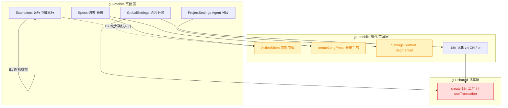
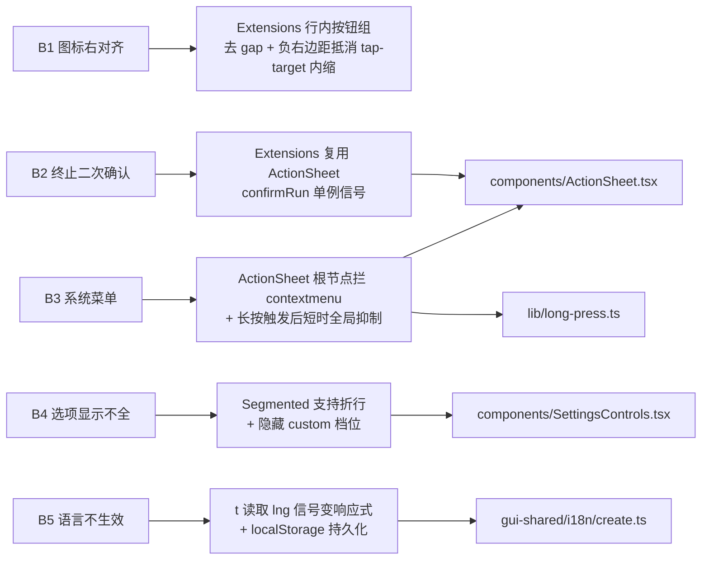
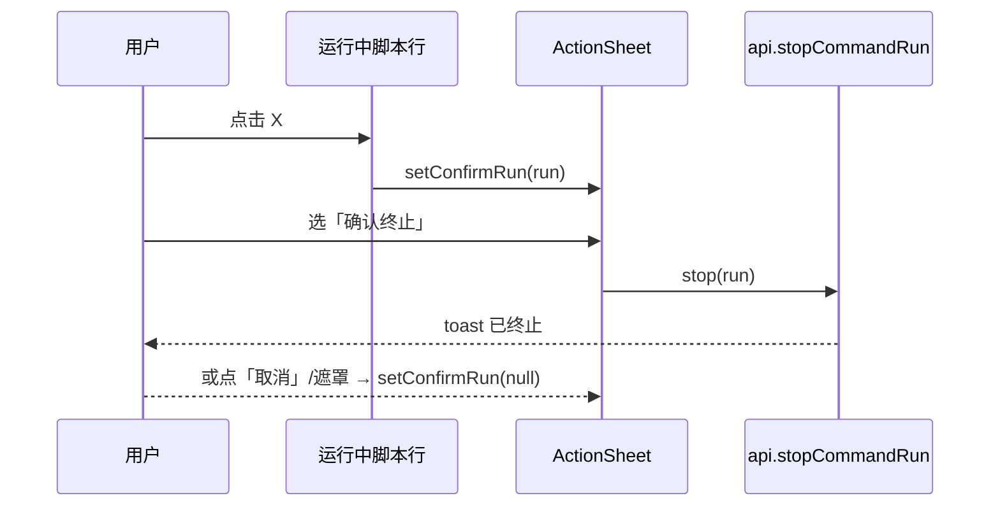
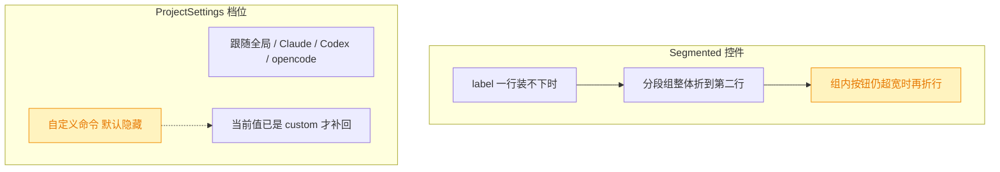
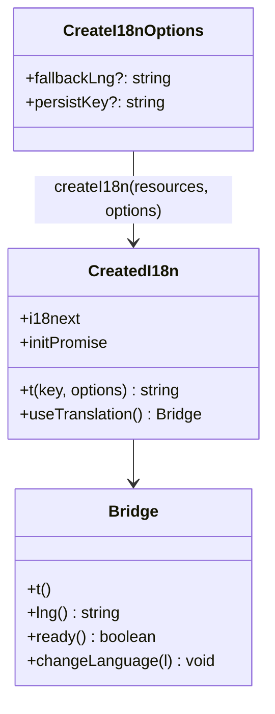

# 移动端 UI 与 i18n 缺陷修复

## 1. 背景

用户原始反馈（移动端 `src/gui-mobile`）：

> - 脚本 刷新、关闭 icon 离太远，x icon 右侧应该与其他 icon 右对齐（`src/gui-mobile/src/pages/Extensions.tsx`）
> - 删除运行中脚本，复用二次确认弹窗，复用长按 spec 菜单样式进行确认（`src/gui-mobile/src/pages/Extensions.tsx`）
> - spec 列表长按应避免触发系统的右键菜单（`src/gui-mobile/src/pages/Specs.tsx`）
> - 项目设置，agent 选项显示不全，建议让控件折行、隐藏自定义命令选项（`src/gui-mobile/src/pages/settings/ProjectSettings.tsx`）
> - 全局设置，切换语言到 English 无效（`src/gui-mobile/src/pages/settings/GlobalSettings.tsx`）

5 条均为移动端 GUI 的体验/功能缺陷，互不耦合，可在一轮内一并修复。

## 2. 需求

- **B1 图标对齐**：运行中脚本行的「重启 / 终止」两个图标按钮间距收紧，且终止（X）图标的右边界与入口行的 `ChevronRight` 图标右边界对齐。
- **B2 终止二次确认**：点击终止不再直接下发，先弹出与 spec 长按菜单同款的底部动作面板做二次确认。
- **B3 屏蔽系统菜单**：spec 列表长按弹出自绘面板时，不得同时出现浏览器/系统的右键（上下文）菜单。
- **B4 Agent 选项显示完整**：项目设置的 Agent 类型分段控件不被裁切——控件允许折行，同时隐藏「自定义命令」档位。
- **B5 语言切换生效**：全局设置切到 English 后界面文案立即变英文，且刷新后保持该选择。

## 3. 现状分析

### 3.1 涉及模块与依赖

红 = 行为语义被改写（`t` 从非响应式变为响应式，桌面端同步受益/受影响）；黄 = 结构调整但对既有调用方兼容。

### 3.2 五个缺陷的成因

- **B1**：入口行 `EntryRow` 的 `ChevronRight` 在 `px-4` 容器内，右内边距恰为 16px；运行中脚本行的图标按钮套 `.tap-target`（44×44），18px 图标居中后左右各留 13px，于是 X 图标右边界离容器边 16+13=29px，比入口行多缩进 13px；两按钮之间又额外有 `gap-2`（8px），叠加内边距后两个图标视觉间距达 34px。
- **B2**：`stop()` 由 X 按钮直接调用，无任何确认；而 spec 列表已有「两段式 ActionSheet 确认」的现成范式（`menuItems()` 的 `confirmingDelete` 分支）。
- **B3**：长按手势自身已 `preventDefault` 元素上的 `contextmenu`，但 Android/Chromium 的系统长按菜单与我们 500ms 的判定几乎同时到达——面板此时已渲染，`contextmenu` 事件落在新出现的**遮罩层**上，而遮罩没有任何 `contextmenu` 拦截，于是系统菜单照常弹出。
- **B4**：`Segmented` 的容器与分段组都是 `shrink-0` 且不允许折行，5 个选项（跟随全局 / Claude / Codex / opencode / 自定义命令）在窄屏一行放不下，被裁切在屏幕外。
- **B5**：`t` 是对 `i18next.t` 的**无信号读取**的直包装，切语言只更新了 i18next 与 `lng` 信号，JSX 中的 `t('…')` 没有依赖任何信号，Solid 不会重算 → 除分段控件高亮外整屏文案不变；此外语言检测 `order: ['navigator'], caches: []`，即便重算，刷新后也会退回系统语言。

精确层：关键代码位置与现状片段

- `src/gui-mobile/src/pages/Extensions.tsx:137-162`：运行中脚本行 `div.flex.items-center.gap-2.px-4.py-2.5`，内含两个 `.tap-target` 图标按钮；`stop()` 直接调用 `api.stopCommandRun`（95-104 行）。
- `src/gui-mobile/src/pages/Extensions.tsx:51-56`：`EntryRow` 的 `ChevronRight size={18}`，容器 `px-4 py-3`。
- `src/gui-mobile/src/pages/Specs.tsx:56-104`：`menuSpec` / `confirmingDelete` 两段式确认范式，`ActionSheet` 挂在页面级单例（188-194 行）。
- `src/gui-mobile/src/lib/long-press.ts:60`：`onContextMenu: (e) => e.preventDefault()`（只覆盖被按住的元素）。
- `src/gui-mobile/src/components/ActionSheet.tsx:44-56`：面板根节点 `div.fixed.inset-0.z-[60]` 与遮罩 `button.absolute.inset-0`，均无 `contextmenu` / callout 抑制。
- `src/gui-mobile/src/components/SettingsControls.tsx:22-49`：`Segmented` 外层 `flex items-center justify-between gap-3 px-4 py-3`，分段组 `flex shrink-0 overflow-hidden rounded-md border`。
- `src/gui-mobile/src/pages/settings/ProjectSettings.tsx:29-35`：`kindOptions()` 返回 5 档，含 `custom`；92-125 行为 custom 的 cmd/args 输入。
- `src/gui-shared/i18n/create.ts:32-66`：`createI18n(resources, fallbackLng)`；`t = (k, o) => i18next.t(k, o)`（55 行，未读取 `lng` 信号）；`detection: { order: ['navigator'], caches: [] }`（36-39 行）。
- `src/gui-mobile/src/pages/settings/GlobalSettings.tsx:134-139`：语言分段，`onChange` 仅调用 `changeLanguage`。
- 对照：桌面端 `src/gui/src/AppShell.tsx:91-97` 切语言后写回 `globalConfig.appearance.language`，`src/gui/src/lib/global-config.ts:74` 在读取配置时反向 `changeLanguage`——桌面端语言真值在服务端配置；移动端外观真值按 `GlobalSettings.tsx:30-33` 的既定约定放在本地。

## 4. 技术实现方案

### 4.1 总览

### 4.2 B1 图标间距与右对齐

把两个图标按钮包进一个 `flex items-center` 的按钮组：组内不留 gap（命中区相邻即可，图标视觉间距由 `tap-target` 的内缩自然给出 26px），组整体加 `-mr-[13px]` 抵消最后一个按钮的 13px 内缩，使 X 图标右边界与 `EntryRow` 的 `ChevronRight` 对齐（均距容器右边 16px）。13px = (44 − 18) / 2，写成注释固定其来历。

> 决策说明：不缩小 `.tap-target`（44×44 是 iOS HIG 下限，缩了会牺牲命中率），只调外边距与组内 gap；这样两图标中心距 44px、边界对齐 16px，与顶栏图标按钮已有的 `-mr-2` 手法同源。

### 4.3 B2 终止二次确认

复用 `ActionSheet` 与 spec 长按菜单完全相同的呈现：页面级单例 + 一条 destructive 动作项 + 风险说明。不引入新组件、不做「两段式」（spec 的第一段是操作菜单，这里入口就是终止按钮，直接进确认段）。

精确层：新增状态、文案键与结构

- 新增 `const [confirmRun, setConfirmRun] = createSignal<CommandRun | null>(null)`；X 按钮 `onClick={() => setConfirmRun(run)}`；`stop()` 内首行 `setConfirmRun(null)`。
- 页面末尾（`</Page>` 前）挂 `<ActionSheet open={confirmRun() !== null} title={confirmRun()?.name} description={t('ext.stopHint')} items={[{ label: t('ext.stopConfirm'), tone: 'destructive', onSelect: () => void stop(run) }]} onClose={() => setConfirmRun(null)} />`。
- 新增文案键：`ext.stopConfirm` / `ext.stopHint`，zh-CN = `确认终止` / `终止后需重新运行脚本`，en = `Stop script` / `The script will stop immediately`。

### 4.4 B3 屏蔽系统上下文菜单

两处补齐，覆盖「事件落在按住的元素」与「事件落在刚弹出的面板/遮罩」两种情况：

1. `ActionSheet` 根节点加 `onContextMenu={(e) => e.preventDefault()}` 与 `no-callout select-none`；
2. `createLongPress` 在长按判定成立的瞬间，于 `document` 上以 capture 方式挂一个 `contextmenu` 拦截器，`ms` 判定后 700ms 内有效（或首次触发后即移除），并在 `onCleanup` 中兜底解绑——这段窗口正好覆盖系统菜单迟到的那一拍。

> 决策说明：不改判定时长（提前到 400ms 只是抢跑，系统菜单该弹还是弹），也不整页常驻禁用 `contextmenu`（会连带屏蔽输入框等处的正常长按行为）；限定「长按触发后的一个短窗口」是最小副作用的做法。

### 4.5 B4 Agent 选项折行 + 隐藏自定义档

- `Segmented` 外层容器改为可折行（`flex-wrap` + `gap-x-3 gap-y-2`），分段组加 `max-w-full flex-wrap`：一行放不下时整组落到第二行，第二行仍放不下时组内按钮再折行，不再被裁切。三档的主题/亮暗分段布局不变。
- `ProjectSettings.kindOptions()` 去掉 `custom` 档；仅当当前配置**已经是** custom（桌面端设过）时才把该档补回，避免分段控件出现「没有任何一档高亮」且用户无法看懂当前值的状态。custom 的 cmd/args 输入区维持原有 `Show` 条件，随之只在既有 custom 配置下出现。

> 决策说明：直接删掉 `custom` 会让存量 custom 配置在移动端「不可见也不可改」，且分段控件全灰；条件补回既满足「默认隐藏」，又不制造数据与 UI 不一致。

### 4.6 B5 语言切换生效并持久化

- **响应式**：`t` 内先读一次 `lng()` 信号再转发给 `i18next.t`，于是所有写在 JSX / props 里的 `t('…')` 都会随 `languageChanged` 重算。这是共享工厂的改动，桌面端同样受益（桌面端 `t` 目前有同样的隐患）。非响应式场景（如 `showToast(t(…))`）行为不变。
- **持久化**：`createI18n` 第二参改为可选配置对象，新增 `persistKey`；传入时检测顺序为 `['localStorage', 'navigator']`、`caches: ['localStorage']`、`lookupLocalStorage: persistKey`。移动端传 `yorz.m.lang`；桌面端不传，保持「服务端配置为真值 + 迁移旧键」的既有链路不受影响。
- 两个调用点当前都只传 `resources`，改签名向后兼容。

> 决策说明（移动端语言存哪）：跟随移动端既定的「外观真值在本地」约定（见 `GlobalSettings.tsx` 头部注释），语言写 localStorage 而**不**写服务端 `appearance.language`。理由：一是移动端没有应用级读取全局配置的启动链路，写服务端就要额外加一次首屏拉取并等待，会带来语言闪烁；二是手机改语言顺带把桌面端语言也改掉，属于用户不预期的跨端副作用。被否决的备选：复用桌面端的 `appearance.language`（跨端一致，但需新增启动拉取 + 首屏闪烁 + 跨端副作用）。

### 4.7 影响范围与验证

- 移动端：`pages/Extensions.tsx`、`pages/Specs.tsx`（无需改动，收益来自 ActionSheet/long-press）、`pages/settings/ProjectSettings.tsx`、`components/ActionSheet.tsx`、`components/SettingsControls.tsx`、`lib/long-press.ts`、`i18n/zh-CN.ts`、`i18n/en.ts`、`i18n/config.ts`。
- 共享层：`gui-shared/i18n/create.ts`（桌面端 `t` 一并变响应式，属修复而非回归）。
- 验证：`pnpm typecheck`、`pnpm test`（若含相关用例）、`pnpm build:gui-mobile` + `pnpm build:gui`（确认共享层改动不破坏桌面端构建）。

## 5. 待确认项

_暂无_

## 6. 任务清单

- [x] Extensions 运行中脚本行：两个图标按钮包进无 gap 的按钮组并加 `-mr-[13px]`（验收：X 图标右边界与入口行 ChevronRight 同为距容器右 16px，注释写明 13px 来历）
- [x] i18n 词典新增 `ext.stopConfirm` / `ext.stopHint`（验收：zh-CN.ts 与 en.ts 键集合一致，`pnpm typecheck` 通过）
- [x] Extensions 接入 ActionSheet 终止二次确认：新增 `confirmRun` 单例信号，X 按钮只开面板（验收：确认项被选中后才调用 `api.stopCommandRun`，取消/遮罩关闭不发请求）
- [x] ActionSheet 根节点补 `onContextMenu` preventDefault 与 `no-callout select-none`（验收：面板层不再放行系统上下文菜单）
- [x] createLongPress 长按判定成立后在 document 上短窗口 capture 拦截 contextmenu（验收：拦截器在窗口结束与 onCleanup 两处均解绑，无泄漏）
- [x] SettingsControls 的 Segmented 支持折行：外层 `flex-wrap` + 分段组 `max-w-full flex-wrap`（验收：5 档也不被裁切，三档控件外观不变）
- [x] ProjectSettings 隐藏 `custom` 档，仅当前配置已是 custom 时补回（验收：默认 4 档，既有 custom 配置仍可见可编辑）
- [x] gui-shared/i18n/create.ts 让 `t` 先读 `lng()` 信号（验收：切语言后 JSX 中文案即时更新）
- [x] createI18n 第二参改为可选配置并支持 `persistKey`，移动端传 `yorz.m.lang`（验收：桌面端调用签名不变，移动端刷新后保留所选语言）
- [x] 运行 `pnpm typecheck`、`pnpm build:gui-mobile`、`pnpm build:gui`（验收：三者均成功，共享层改动不破坏桌面端）

## 7. 执行记录

- **B1 图标右对齐**（`src/gui-mobile/src/pages/Extensions.tsx`）：两个 `.tap-target` 按钮收进 ``，组内去掉 `gap-2`。X 图标右边界回到距容器右 16px，与 `EntryRow` 的 `ChevronRight` 齐平；两图标视觉间距由 34px 收到 26px，命中区仍是 44×44。
- **B2 终止二次确认**（同上）：新增 `confirmRun` 单例信号与 `confirmItems()`，X 按钮改为只 `setConfirmRun(run)`；页面末尾挂 `ActionSheet`（标题=脚本名，说明=`ext.stopHint`，唯一动作项 destructive=`ext.stopConfirm`），`stop()` 入口先清空确认态。文案键已同步补进 `i18n/zh-CN.ts` 与 `i18n/en.ts`。
- **B3 屏蔽系统菜单**（`components/ActionSheet.tsx`、`lib/long-press.ts`）：面板根节点补 `onContextMenu` preventDefault 与 `no-callout select-none`；`createLongPress` 在判定成立瞬间 `armGuard()`，于 document 捕获阶段挂 700ms 的 contextmenu 拦截器，超时与 `onCleanup` 双路解绑。两处合起来覆盖「事件落在被按住的行」与「事件落在刚弹出的遮罩」两种命中。
- **B4 Agent 选项显示完整**（`components/SettingsControls.tsx`、`pages/settings/ProjectSettings.tsx`）：`Segmented` 外层改 `flex flex-wrap … gap-x-3 gap-y-2`、分段组加 `max-w-full flex-wrap`，超宽时整组落到第二行、必要时组内再折；`kindOptions(current)` 默认只给 4 档，仅当现有配置已是 `custom` 时补回该档（避免存量 custom 配置在移动端既不可见也不可改）。
- **B5 语言切换生效**（`src/gui-shared/i18n/create.ts`、`src/gui-mobile/src/i18n/config.ts`）：`t` 改为先读 `lng()` 信号再转发 `i18next.t`，JSX 中的文案随 `languageChanged` 重算（桌面端同一隐患一并修掉）；`createI18n` 第二参改为 `CreateI18nOptions`，新增 `persistKey` → 检测顺序 `['localStorage','navigator']` + `caches: ['localStorage']`，移动端传 `yorz.m.lang`，桌面端签名与行为不变（`lookupLocalStorage` 仅在启用时展开，避免覆盖 detector 默认键）。
- **验证**：`pnpm typecheck` 通过；`pnpm build:gui-mobile`、`pnpm build:gui` 均构建成功（共享层改动未波及桌面端）；`pnpm test` 750 passed / 1 failed，唯一失败为 `src/service/__tests__/git-routes.test.ts > POST /git/commit > surfaces the underlying git stderr on failure`——已用 `git stash` 在改动前复跑复现，属既有失败，与本次无关。
- **收尾**：任务清单全部完成，无待确认项、无 `！！！` 批注、无 `[open]` 追加任务，标记 `done`。
