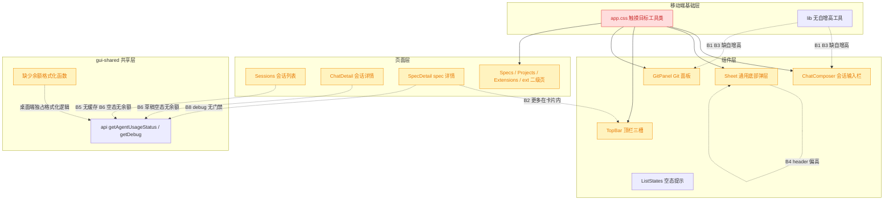
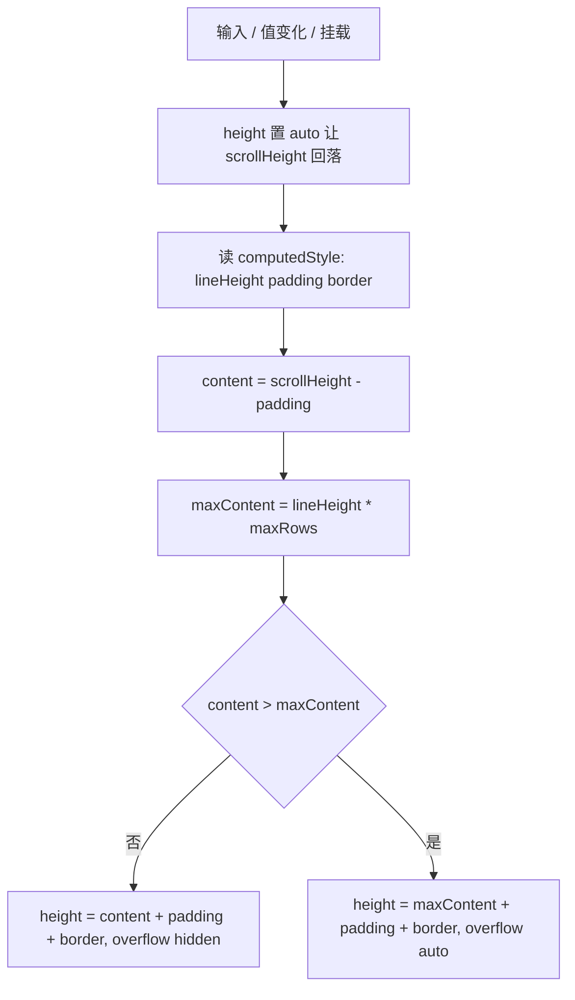
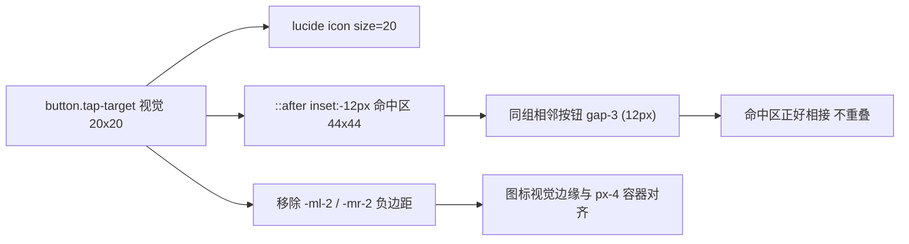
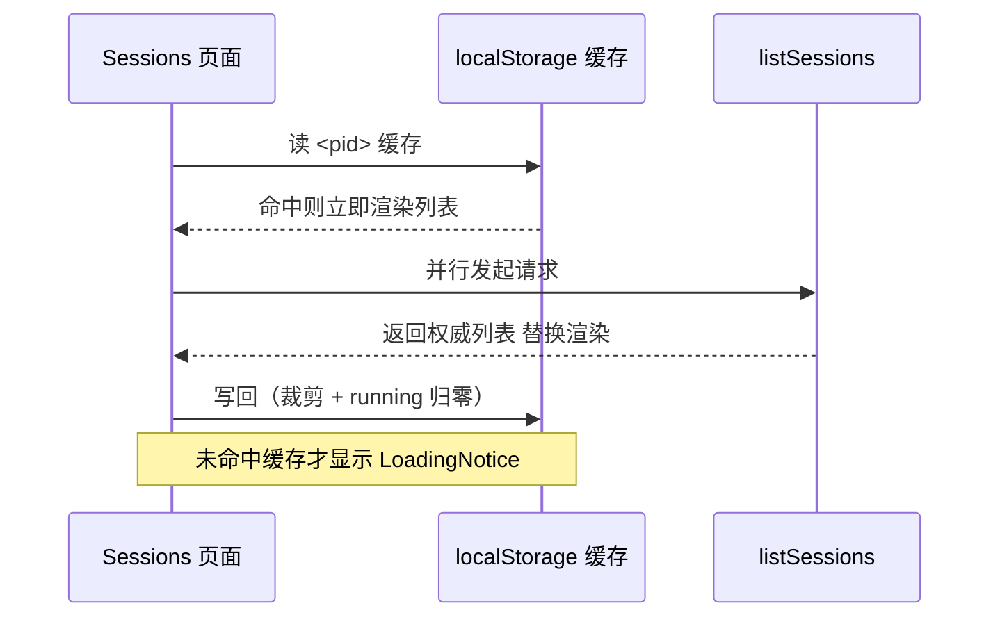
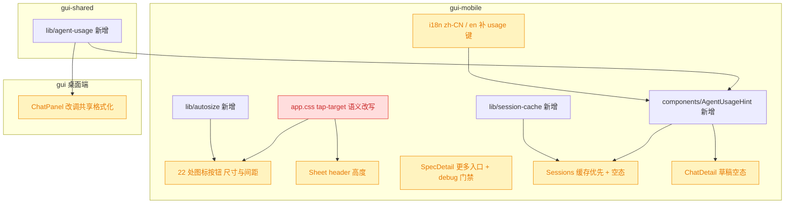

# 移动端体验缺陷批量修复

## 1. 背景

用户原始反馈（全部落在移动端 `src/gui-mobile`）：

> - session 输入框未超过最大行数之前，不应该存在滚动条
> - spec 详情页"更多"改成 ··· 放到顶部当行栏右侧
> - git 页面 输入框高度应该自适应高度，跟 session 详情页输入框一样，最多 5 行
> - 弹窗组件(如待确认问题) header 栏太高了，应该跟顶部导航 header 高度一致
> - session 列表优先使用缓存数据，fetch 到数据后再更新列表
> - session 空状态应该与 pc 保持一致，显示 Agent 余额
> - icon 尺寸太大了，当前 44x44，统一改为 20x20
> - spec 存在对应 debug 文档才在详情页展示对应入口

8 条都是移动端 GUI 的体验缺陷，彼此低耦合，可在一轮内一并修复；其中 B1/B3 共用同一个自增高实现，B4/B7 共用同一套图标按钮尺寸口径，合并处理反而比拆开更省。

## 2. 需求

- **B1 输入框无早现滚动条**：会话输入框在未达到 5 行上限之前，任何行数下都不出现滚动条；达到上限后才允许内部滚动。发送清空后高度回落到 1 行。
- **B2 spec 更多入口上移**：spec 详情页的「更多」从 meta 卡动作行移到顶栏右侧，呈现为 `···` 图标按钮，动作内容（复制 spec 路径）不变。
- **B3 git 提交框自增高**：Git 页面的提交信息输入框与会话输入框同口径——1 行起、随内容增高、最多 5 行，超出才滚动；预填与提交后清空都要同步高度。
- **B4 弹层 header 高度对齐**：`Sheet`（待确认项 / 追加任务 / 分支切换等共用）的 header 高度与顶部导航 `TopBar` 一致（48px 内容行）。
- **B5 会话列表缓存优先**：进入会话列表先渲染上次缓存的列表，网络数据返回后再替换；无缓存时才走加载态。切换项目各用各的缓存。
- **B6 空态显示 Agent 余额**：会话空态与桌面端口径一致，展示当前 Agent 的剩余用量摘要（含加载中 / 不支持 / 失败等分支文案）。
- **B7 图标按钮统一 20×20**：移动端图标按钮的视觉尺寸统一为 20×20，命中区不缩水（仍 ≥44×44）；同组相邻图标不因命中区扩展而互相抢点击。
- **B8 debug 入口条件渲染**：spec 详情页仅在该 spec 存在 `debug.md` 时才渲染 debug 入口，与桌面端 `SpecDetail` 的门禁一致。

## 3. 现状分析

### 3.1 缺陷分布与影响面

红 = 触摸目标工具类的语义要改写（`.tap-target` 从「撑大按钮盒子」变为「视觉 20×20 + 伪元素扩命中区」），所有图标按钮跟着变；黄 = 结构或数据流调整，对既有调用方兼容。

### 3.2 八个缺陷的成因

- **B1**：`autoResize` 把 `scrollHeight` 直接写进 `style.height`。Tailwind preflight 下 `box-sizing: border-box`，而 `scrollHeight` **不含 border**——写回去之后内容盒比实际内容矮 2px，任何行数都恒定溢出 2px，滚动条从第一行起就在。上限公式 `5 * 24 + 16` 也与实际内边距（`py-2.5` = 20px）对不上，5 行时再少 4px。另外 `overflow` 全程是 `auto`，未达上限时也允许滚动。
- **B2**：「更多」是 meta 卡动作行里的第四个文字按钮，与「追加任务 / debug / git」并排；`Page` 的 `actions` 槽在 spec 详情页是空的，顶栏右侧整块留白。
- **B3**：Git 面板的提交框是 `rows={1}` 的固定高文本域，既没有 `autoResize`，也没有上限；多行提交信息只能在一行高的框里滚动。
- **B4**：`Sheet` 的 header 用 `px-4 py-3` 包一个 `.tap-target`（min-height 44px）关闭按钮，实际高度 = 44 + 12×2 = 68px，比 `TopBar` 的 48px 高一截，视觉上"弹层比页面还重"。
- **B5**：`Sessions` 直接 `createResource(listSessions)`，`sessions.loading` 为真时整页是 `LoadingNotice`；PWA 冷启或切回前台都要空白等一次网络。
- **B6**：桌面端 `ChatPanel` 在「未选中会话」的空态里渲染 `usageSummary()`（`chat.usage*` 系列文案 + `api.getAgentUsageStatus`）；移动端两处空态（会话列表空、会话草稿空）都只有一行文字，且移动端 i18n 没有 `usage*` 键。
- **B7**：`.tap-target` 把按钮盒子撑成 44×44，图标（16–24px）居中，于是按压高亮块几乎填满 48px 高的顶栏；多处按钮还要靠 `-ml-2` / `-mr-2` 负边距把这个大盒子拉回视觉对齐位。
- **B8**：移动端 debug 按钮无条件渲染、点击弹「即将支持」；桌面端 `SpecDetail` 早已用 `api.getDebug()` 的 `exists` 做门禁。

精确层：关键代码位置与现状片段

- `src/gui-mobile/src/components/ChatComposer.tsx:36-39` `autoResize`：`el.style.height = Math.min(el.scrollHeight, 5 * 24 + 16) + 'px'`；`:112-121` textarea 类名 `min-h-11 … border px-3 py-2.5 text-base leading-6`，仅在 `onInput` 里调用 `autoResize`。
- `src/gui-mobile/src/components/GitPanel.tsx:416-428`：`<textarea rows={1} class="w-full resize-none … px-3 py-2">`，无 resize 逻辑；`:242-255` 提交成功后 `setMessage('')`；`:90-93` 预填 `initialMessage`。
- `src/gui-mobile/src/components/Sheet.tsx:37-47`：`<header class="flex shrink-0 items-center gap-2 border-b border-border px-4 py-3">` + `.tap-target -mr-2` 关闭按钮。
- `src/gui-mobile/src/components/TopBar.tsx:35-54`：`<header class="… px-safe pt-safe">
`，三槽布局，`actions` 在右槽。
- `src/gui-mobile/src/pages/SpecDetail.tsx:388-417`：meta 卡动作行的四个按钮（追加任务 / debug(`comingSoon`) / git / 更多）；`:497-502` `ActionSheet`（仅「复制 spec 路径」一项）。
- `src/gui-mobile/src/pages/Sessions.tsx:32-35` `createResource(activeProjectId, listSessions)`；`:75` `<Show when={!sessions.loading} fallback={<LoadingNotice />}>`；`:80` 空态 `Notice title={t('sessions.empty')}`。
- `src/gui-mobile/src/pages/ChatDetail.tsx:184-190`：空态 `sid() ? t('chat.empty') : t('chat.draftEmpty')`。
- `src/gui/src/components/ChatPanel.tsx:301-306` 余额 resource（仅 `!activeSid()` 时请求）、`:583-620` `formatUsageReset` / `formatUsageWindow` / `usageSummary`、`:980-987` 空态渲染。
- `src/gui/src/pages/SpecDetail.tsx:92-102, 439-445`：`getDebug` resource + `<Show when={debugDoc()?.exists}>`。
- `src/gui-mobile/src/app.css:132-139` `.tap-target { min-width: 2.75rem; min-height: 2.75rem }`，注释已写明约定「视觉尺寸可以更小，命中区不缩水」。
- `.tap-target` 现有 22 处调用：`ChatComposer`×3、`TopBar`、`Sheet`、`QuestionSheet`、`MermaidViewer`、`SelectionBar`、`GitPanel`×2、`ListStates`（文字按钮）、`Extensions`×2、`Sessions`、`Specs`、`Projects`×2、`SpecDetail`、`ChatDetail`、`ext/Scripts`、`ext/RunOutput`。
- `src/gui-shared/api/index.ts:244-272` `SessionInfo` / `AgentUsageStatus` / `AgentUsageWindow`；`:447-450` `getDebug`；`:560-561` `getAgentUsageStatus`。

## 4. 技术实现方案

### 4.1 文本域自增高工具（B1 / B3）

新增 `src/gui-mobile/src/lib/autosize.ts`，导出 `autoSizeTextarea(el, maxRows)`：从 `getComputedStyle` 现算 `lineHeight` / 上下 `padding` / 上下 `border`，而不是把 24/16 这类数字硬编码在调用点——两个输入框的 `py` 本来就不同（`py-2.5` vs `py-2`），硬编码必然再错一次。

要点：`height` 必须补回 border（`box-sizing: border-box` 下 `scrollHeight` 不含 border，少补就恒定溢出——这正是 B1 的根因）；未达上限时显式 `overflow-y: hidden`，达上限才切回 `auto`。

接入点：

- `ChatComposer`：保留 `onInput` 调用，另外用 `ref` + `createEffect(() => { props.value; autoSize(...) })` 覆盖「外部清空 / 首次挂载」两条路径（发送后 `value` 变空但高度不回落，属同一缺陷的另一半）。
- `GitPanel` 提交框：同样 `ref` + effect 跟 `message()` 走，预填与提交后清空都能同步高度；`maxRows` 同为 5。

### 4.2 图标按钮尺寸口径（B7 / B4）

`.tap-target` 的语义改写为「视觉 20×20 + 伪元素扩命中区」，新增到 `app.css` 的 utilities 层：

- 命中区靠 `::after { position:absolute; inset:-0.75rem }` 扩展到 44×44，符合 app.css 里已经写明的既有约定（视觉可小、命中区不缩水），无障碍不退步。
- 同组图标间距统一 `gap-3`（12px）：两侧各扩 12px 后命中区恰好相接、零重叠，既不互抢点击也不留死区。
- 负边距 `-ml-2` / `-mr-2` 是为 44px 大盒子做的对齐补偿，盒子缩到 20px 后必须删掉，否则图标会溢出到容器 padding 之外。删掉后图标视觉边缘落在 `px-4` 的 16px 处，与列表行 `ChevronRight` 的右对齐口径一致。
- 图标 `size` 统一取 20（现有 16/18/22/24 的图标按钮一并收敛）；非图标按钮（如 `ListStates` 的「重试」文字按钮、`GitPanel` 的勾选行）不套这套口径，改用显式 `min-h-11` 保持原有触摸区。
- `Sheet` header 随之改为 `flex h-12 items-center px-4`（与 `TopBar` 内容行同高 48px），关闭按钮不再撑高 header —— B4 因此与 B7 同解。

### 4.3 spec 详情顶栏动作与 debug 门禁（B2 / B8）

- 「更多」从 meta 卡动作行移出，作为 `Page` 的 `actions` 槽渲染 `MoreHorizontal`（`···`）图标按钮，`aria-label` 复用 `specDetail.more`；`ActionSheet` 的内容与开合状态照旧。
- 新增 `debugDoc` resource：`api.getDebug(pid, id)`，`catch` 兜底成 `{ exists: false }`（与桌面端同款容错），`<Show when={debugDoc()?.exists}>` 包住 debug 按钮。跟 `refreshTick` 同 key，spec 被 agent 改写后一起重取。

### 4.4 会话列表缓存优先（B5）

新增 `src/gui-mobile/src/lib/session-cache.ts`（`localStorage`，key 按项目分：`yorz.m.sessions.<pid>`）：

- 渲染源改为 `sessions.latest ?? cached()`；加载态门禁改成「无数据可渲染时才出 `LoadingNotice`」，错误态同理（有缓存就继续显示旧列表，不要用错误页盖掉可用内容）。
- 写缓存时 `running` 一律归零：它是瞬时状态，持久化会让冷启时闪一排假的「运行中」圆点；条数裁到 30，与服务端列表上限同量级，避免 localStorage 无限增长。
- 读缓存做结构校验（数组 + 必需字段齐全），任何异常一律当未命中——旧版本残留的格式不能把页面打崩。

### 4.5 空态展示 Agent 余额（B6）

余额摘要的格式化逻辑抽到 `src/gui-shared/lib/agent-usage.ts`（平台无关、纯函数），签名接受 `t` 与 `formatTime` 两个注入项，键名沿用桌面端已有的 `chat.usage*`；桌面端 `ChatPanel` 改为调用它，移动端 i18n 补齐同名键后共用同一份实现。这层正是 AGENTS.md 说的「平台无关逻辑层」，复制一份必然漂移。

移动端新增展示组件 `AgentUsageHint`（内含 `createResource(getAgentUsageStatus)`，仅在需要时挂载），接在两处空态下方：会话列表空态与会话草稿空态。两处都接是刻意的——桌面端"未选中会话"的语义在移动端被拆成了「列表空」与「草稿页」两个屏，只补一处必然漏掉用户实际看到的那个。

### 4.6 决策说明

> 决策：`icon 统一 20×20` 取「视觉 20×20 + 伪元素命中区 44×44」，不直接把命中区砍到 20×20。理由：`app.css` 既有注释已把「视觉尺寸可以更小，命中区不缩水」定为项目约定，砍命中区会同时违反 WCAG 2.5.8 与 iOS HIG。被否决的备选：整体缩到 20×20 命中区。

> 决策：`session 空状态显示余额` 同时覆盖「会话列表空态」与「会话草稿空态」。理由：桌面端该提示挂在「未选中会话」的聊天区，移动端没有等价单屏，两处都补是唯一能保证"与 pc 保持一致"的实现；代价仅是空态时多一次 `agent-usage` 请求。被否决的备选：只改其中一处（会漏掉用户实际看到的屏）。

> 决策：余额格式化抽进 `gui-shared` 并让桌面端改调它，而不是移动端复制一份。理由：文案分支（loading / unavailable / installHint / error / windows）共 6 条，复制必然漂移；抽取对桌面端是等价替换，无行为变化。被否决的备选：移动端复制一份格式化函数。

> 决策：B8 只做入口门禁，不在移动端实现 debug 详情页。理由：需求只说「存在才展示入口」，移动端 debug 查看页属于新功能，不在本次 fix 范围；点击仍走既有的「即将支持」降级口径。被否决的备选：顺手补一个移动端 debug 页面（超出 fix 边界）。

### 4.7 兼容性与影响范围

- 🔴 `.tap-target` 是全局工具类，语义改写会一次性影响全部 22 处调用；`ListStates` 的文字按钮与 `GitPanel` 的勾选行必须同步换成显式 `min-h-11`，否则触摸区反而变小。
- 🟡 桌面端只有 `ChatPanel` 的格式化函数被替换为共享实现，文案键与输出字符串保持不变。
- 🟡 后端零改动：`getDebug` / `getAgentUsageStatus` 都是既有端点。
- 验证口径：`pnpm typecheck` + `pnpm test`（若仓库已配置），外加 `pnpm build:gui-mobile` 确认移动端构建通过。

## 5. 待确认项

_暂无_

## 6. 任务清单

- [x] 新增 src/gui-mobile/src/lib/autosize.ts，导出 autoSizeTextarea(el, maxRows)，按 computedStyle 现算行高/内边距/边框并切换 overflow（验收：pnpm typecheck 通过）
- [x] ChatComposer 改用 autoSizeTextarea 并补 ref + createEffect 跟随 value（验收：1–5 行无滚动条、发送清空后回落 1 行）
- [x] GitPanel 提交框接入 autoSizeTextarea（maxRows=5）并跟随 message() 变化（验收：多行输入自增高、预填与提交清空后高度同步）
- [x] app.css 将 .tap-target 改写为「视觉 20×20 + ::after inset:-0.75rem 命中区 44×44」（验收：类定义含 position:relative 与 ::after，注释同步更新）
- [x] 全量改造图标按钮：去掉 -ml-2/-mr-2、图标 size 统一 20、同组间距 gap-3（验收：grep 无残留 `tap-target .*-m[lr]-2`）
- [x] 非图标按钮改用显式 min-h-11：ListStates 重试按钮与 GitPanel 勾选行（验收：grep 这两处不再套 .tap-target）
- [x] Sheet header 改为 flex h-12 items-center px-4，与 TopBar 内容行等高（验收：header 无 py-3，高度 48px）
- [x] SpecDetail「更多」移到 Page.actions 槽，渲染 MoreHorizontal 图标按钮（验收：meta 卡动作行不再有「更多」文字按钮，顶栏右侧可开 ActionSheet）
- [x] SpecDetail 新增 debugDoc resource 并用 exists 门禁 debug 入口（验收：无 debug.md 的 spec 详情页不渲染 debug 按钮）
- [x] 新增 src/gui-mobile/src/lib/session-cache.ts：按项目读写 localStorage、running 归零、条数裁到 30、读时结构校验（验收：pnpm typecheck 通过）
- [x] Sessions 改为缓存优先渲染：数据源取 latest ?? cached，仅无数据时出 LoadingNotice/ErrorNotice，fetch 成功写回缓存（验收：二次进入列表无加载态闪烁）
- [x] 新增 src/gui-shared/lib/agent-usage.ts 纯函数格式化余额摘要，并让桌面端 ChatPanel 改调它（验收：桌面端文案输出不变，pnpm typecheck 通过）
- [x] 移动端 i18n 补齐 chat.usage\* 键（zh-CN 与 en 同构）（验收：pnpm typecheck 通过，无缺键）
- [x] 新增 AgentUsageHint 组件并接入会话列表空态与会话草稿空态（验收：两处空态显示余额摘要，未选项目时不请求）
- [x] 运行 pnpm typecheck、pnpm test、pnpm build:gui-mobile 并记录结果（验收：三者均通过）

## 7. 执行记录

- **B1/B3 输入框自增高**：新增 `src/gui-mobile/src/lib/autosize.ts`（按 computedStyle 现算行高/内边距/边框，写回高度时补上 border，未封顶时 `overflow-y: hidden`）；`ChatComposer` 与 `GitPanel` 提交框接入，各自补 `createEffect` 跟随值变化（发送清空、预填回写、提交后清空都同步高度）。真机尺寸实测（Chromium 390×844）：3 行 `clientHeight=92 / scrollHeight=92 / overflow=hidden`（无滚动条），8 行封顶 `140px` 且切回 `auto`，删回单行落到 `44px`；Git 提交框 3 行 `88px / overflow=hidden`。
- **B7/B4 图标按钮口径**：`app.css` 的 `.tap-target` 改写为「视觉 20×20 + `::after inset:-0.75rem` 命中区 44×44」；22 处图标按钮去掉 `-ml-2 / -mr-2` 负边距、图标 `size` 统一 20、同组间距改 `gap-3`（命中区正好相接不重叠）；按压反馈从 `active:bg-accent`（会被同尺寸图标完全盖住）改为 `active:opacity-60`；发送/中断按钮的填色底与描边同理失效，改用主色/危险色区分语义。非图标按钮（`ListStates` 重试、`GitPanel` 勾选行）改用显式 `min-h-11 / size-11` 保住触摸区。实测：顶栏按钮盒 `20×20`，在视觉盒外 10px 处点击仍能触发。
- **B4 弹层 header**：`Sheet` header 改为 `flex h-12 items-center px-4`。实测 Sheet header `48px`、TopBar `49px`（含 1px 下边框），高度一致。
- **B2 更多入口**：`SpecDetail` 的「更多」移到 `Page.actions`，渲染 `MoreHorizontal` 图标按钮；meta 卡动作行只剩追加任务 / debug / git。
- **B8 debug 门禁**：`SpecDetail` 新增 `debugDoc` resource（`api.getDebug`，失败兜底为不存在，与 `refreshTick` 同 key），`<Show when={debugDoc()?.exists}>` 包住入口。实测：无 debug.md 的 spec 详情页不再渲染该按钮。
- **B5 会话列表缓存优先**：新增 `src/gui-mobile/src/lib/session-cache.ts`（按项目分键、`running` 归零、裁到 30 条、读时结构校验）；`Sessions` 渲染源改为独立信号，缓存先上、接口 `state === 'ready'` 后整份替换并写回，加载/错误态只在无数据可渲染时才顶上来。实测：断网重新加载仍渲染出完整列表，无加载态与错误页。
- **B6 空态显示 Agent 余额**：文案组装抽到 `src/gui-shared/lib/agent-usage.ts`，桌面端 `ChatPanel` 改调同一实现（删掉本地三个格式化函数，键名与输出不变）；移动端 i18n 补齐 `chat.usage*`（zh-CN / en 同构），新增 `AgentUsageHint` 组件接入会话列表空态与会话草稿空态。实测草稿页显示 `codex usage: Primary about 69% remaining (31% used, resets: …)`。
- **验证**：`pnpm typecheck` 通过；`pnpm build:gui-mobile` 通过（产物 CSS 内 `.tap-target` 与 `.tap-target:after` 两条规则均已输出）；`pnpm test` 791 通过 / 1 失败——失败项为 `src/service/__tests__/git-routes.test.ts` 的 git 报错文案断言，已用 `git stash` 在改动前复现，属既有失败，与本次改动无关。
- **收尾**：任务清单全部完成，`## 待确认项` 为 `_暂无_`、无 `！！！` 批注、无 `[open]` 追加任务，标记 `done`。
  </content>
  </invoke>
