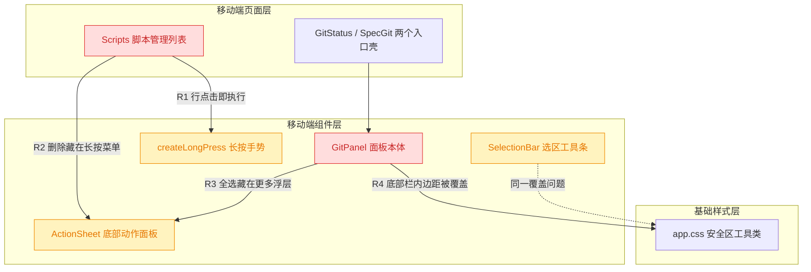
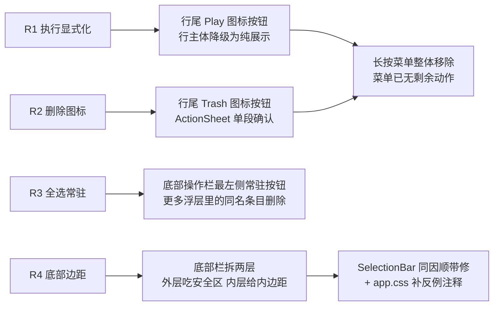
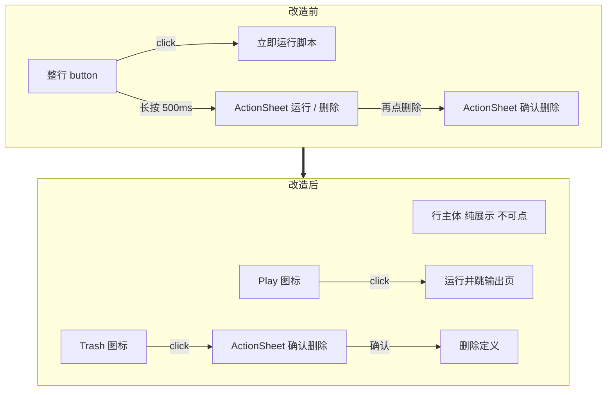
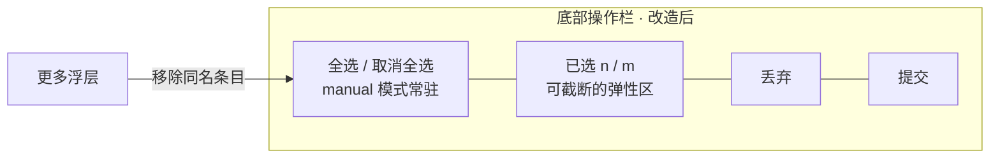
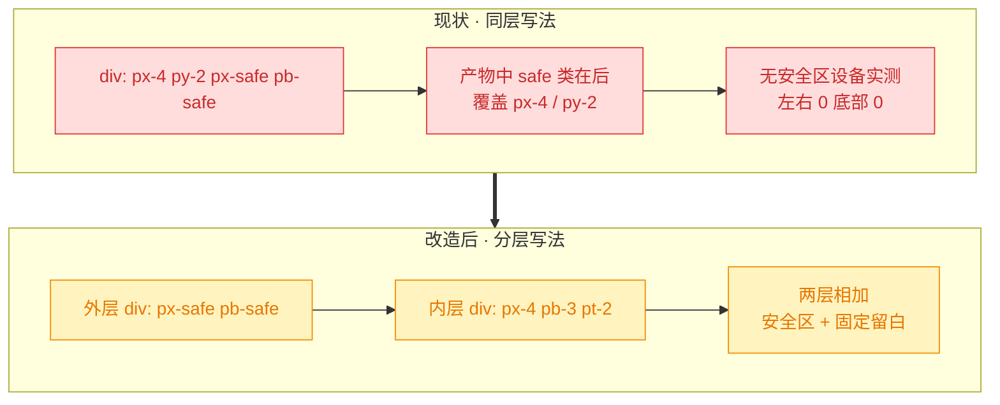
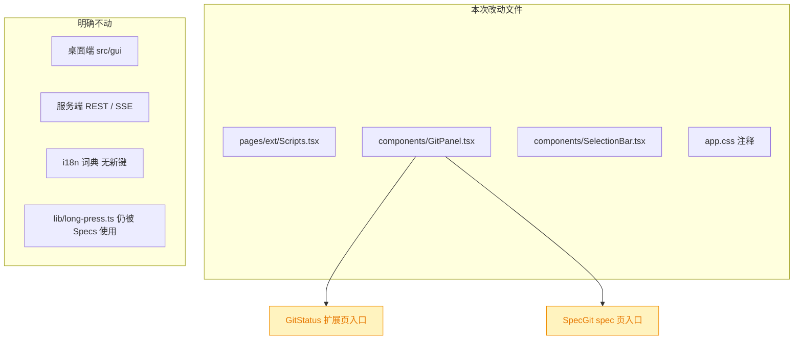

# 移动端脚本管理与 Git 页面体验重构

## 1. 背景

用户原始反馈（移动端 `src/gui-mobile`）：

> - 脚本管理，列表项新增 执行按钮 icon，点击才执行，避免点击列表项误触执行
> - 脚本管理需要删除 icon ，点击二次确认移除脚本
> - git 页面，"全选"功能改为常驻按钮，放到底部左侧
> - git 页面，底部模块（按钮、输入框）需要添加左右下边距

四条都是移动端 GUI 的交互与布局问题，落点集中在 `pages/ext/Scripts.tsx` 与 `components/GitPanel.tsx` 两个文件，互不耦合，可在一轮内一并处理。

## 2. 需求

- **R1 执行显式化**：脚本管理列表行不再"点哪都跑"，执行动作收敛到行尾一个独立的执行图标按钮，只有点它才运行脚本。
- **R2 删除图标 + 二次确认**：行尾同时提供删除图标按钮，点击后弹二次确认，确认才真正删除脚本定义。
- **R3 全选常驻**：git 页面的「全选 / 取消全选」从「更多」浮层里搬出来，作为常驻按钮固定在底部操作栏最左侧。
- **R4 底部栏边距**：git 页面底部模块（提交信息输入框、丢弃/提交按钮）与屏幕左、右、下三边之间要有可见留白，不再贴边。

## 3. 现状分析

### 3.1 涉及模块与影响面



红 = 交互语义被改写的模块；黄 = 结构/用法被调整但对既有调用方兼容。

### 3.2 四项现状与成因

- **R1**：脚本行整行就是一个 `<button>`，`createLongPress` 把 `onClick` 托管成"运行脚本"，长按才出菜单。于是"看一眼有哪些脚本"和"跑一个脚本"共用同一个命中区，误触的代价是真的起一个进程。
- **R2**：删除只存在于长按菜单的第二段确认里。长按是隐藏手势，新用户根本发现不了；R1 的执行图标一旦落地，长按菜单里就只剩"删除"一项，菜单本身失去存在价值。
- **R3**：`git.selectAll` 挂在顶栏「更多」`ActionSheet` 的 `moreItems()` 里，且只在 `manual` 模式且有改动时出现。全选是勾选文件的高频前置动作，却要"点更多 → 找条目 → 点"三步，还离底部的提交/丢弃按钮最远。
- **R4**：底部栏那一层同时写了 `px-4 py-2` 与 `px-safe pb-safe`。两组都是 `padding-*` 简写，命中同一属性；`.px-safe` / `.pb-safe` 在 `app.css` 的 `@layer utilities` 里定义，产物 CSS 中排在 Tailwind 原生 `.px-4` / `.py-2` **之后**，于是覆盖而非叠加。安全区在绝大多数设备上是 `0px`，最终左右与底部内边距实测为 **0**——输入框与按钮直接贴屏幕边。同一写法在 `SelectionBar` 上重复了一次（`px-2 py-2` 同样被吃掉）。

<details>
<summary>精确层：关键代码位置与实测依据</summary>

- `src/gui-mobile/src/pages/ext/Scripts.tsx:151-182`：`<ul>` 内每行是 `<button {...press}>`，`press = createLongPress({ onLongPress: 打开菜单, onClick: () => void run(def) })`（154-160 行）。
- `src/gui-mobile/src/pages/ext/Scripts.tsx:106-123`：`menuItems()` 两段式——第一段 `[运行, 删除]`，`confirmingDelete` 为真时换成单条 `确认删除`。
- `src/gui-mobile/src/pages/ext/Scripts.tsx:80-90`：`run()` 调 `api.runCommand` 后跳 `/ext/runs/:runId`；服务端对同一 `commandId` 已有 running 时幂等返回旧记录，所以"运行中再点一次"等价于"查看输出"。
- `src/gui-mobile/src/components/GitPanel.tsx:321-357`：`moreItems()` 首项即全选/取消全选，其后是 push / pull / mergeBranch。
- `src/gui-mobile/src/components/GitPanel.tsx:185-188`：`toggleAll()` 内含 `setMoreOpen(false)`——这行是"从浮层里点"才需要的。
- `src/gui-mobile/src/components/GitPanel.tsx:429-458`：底部行 `mt-2 flex items-center gap-2`，依次是文件计数 `<span>`、`ml-auto` 的丢弃按钮、提交按钮。
- `src/gui-mobile/src/components/GitPanel.tsx:380`：`class="shrink-0 border-t border-border bg-card px-4 py-2 px-safe pb-safe"`。
- `src/gui-mobile/src/app.css:92-106`：`.pt-safe/.pb-safe/.px-safe` 用 `max(env(...), 0px)`；注释写的是"保证最小内边距"，但兜底值取 0，实际没有任何最小值语义。
- 产物 CSS 字节偏移实测（`dist/gui-mobile/assets/index-*.css`）：`.px-4` @33974、`.py-2` @34304、`.pb-safe` @42492、`.px-safe` @42553——safe 类靠后，胜出。
- 全仓 `px-safe|pb-safe|pt-safe` 共 12 处：只有 `GitPanel.tsx:380` 与 `SelectionBar.tsx:27` 把 safe 类与 `p*` 内边距写在**同一元素**上；其余（TopBar / TabBar / Sheet / Page / Toast / ActionSheet / MermaidViewer）都是"外层吃安全区、内层给视觉内边距"的分层写法，不受影响。

</details>

## 4. 技术实现方案

### 4.1 总览



### 4.2 R1 + R2：脚本行改为「展示 + 两个显式图标」

行结构改成与扩展页「运行中脚本行」同构的三段式：左侧信息区、可选的运行中标记、右侧图标按钮组（执行 / 删除）。图标组沿用扩展页已经定型的对齐手法：按钮视觉就是 20×20 的图标本身、命中区由 `.tap-target` 的 `::after` 向外扩，组内 `gap-3` 让相邻命中区不互相吞并，最后一个图标的右边界天然落在行的 `px-4` 上。



三个决策说明：

> 决策记录：**行主体不再承担任何点击动作**（降级为 `<div>`）。理由：脚本没有详情页，行点击本就没有安全的去处；运行中脚本的输出入口已经有两条——扩展首页的运行中列表，以及本页的执行图标（`api.runCommand` 幂等，运行中再点直接返回既有 run 并跳输出页）。被否决的备选：行点击在"运行中"时跳输出页、否则无动作——同一个命中区时灵时不灵，比彻底不可点更难理解。

> 决策记录：**移除本页的 `createLongPress` 长按菜单**。理由：菜单里原本只有"运行"和"删除"两项，两项都被提升为常驻图标后，长按菜单不再有任何独占动作，留着就是两套入口、两份真相。`ActionSheet` 仍然保留，只承担删除的二次确认（与扩展页「终止脚本」确认同款）。`no-callout select-none` 保留在行上，避免 iOS 长按选中文本弹 callout。

> 决策记录：**删除确认走单段而非两段**。理由：入口本身就是"删除"图标，第一段的动作菜单没有信息量；照抄扩展页 B2 的做法——标题给脚本名、说明给 `scripts.deleteHint`（"只删除脚本定义，不会终止已在运行的进程"）、唯一动作项 destructive。

<details>
<summary>精确层：Scripts.tsx 改动点</summary>

- 图标：从 `lucide-solid` 增补 `Play`、`Trash2`（`Plus` 保留），尺寸 20，与扩展页行内图标一致。
- 删除 `createLongPress` 的 import 与 `press` 局部变量；`<li><button {...press}>…</button></li>` 换成 `<li class="no-callout flex select-none items-center gap-3 px-4 py-3">`。
- 状态收敛：`menuDef` / `confirmingDelete` 两个信号合并为 `const [deleteDef, setDeleteDef] = createSignal<CommandDef | null>(null)`；`closeMenu()` 相应变为 `setDeleteDef(null)`。
- `run(def)` 与 `remove(def)` 的函数体不变，仅把开头的 `closeMenu()` 改为 `setDeleteDef(null)`。
- 行尾结构（紧跟信息区之后）：

  ```
  <Show when={runningIds().has(def.id)}>
    <span class="shrink-0 text-xs text-success">{t('scripts.running')}</span>
  </Show>
  <span class="flex shrink-0 items-center gap-3">
    <button class="tap-target ..." aria-label={t('scripts.run')} onClick={() => void run(def)}><Play size={20} /></button>
    <button class="tap-target ... text-destructive" aria-label={t('scripts.delete')} onClick={() => setDeleteDef(def)}><Trash2 size={20} /></button>
  </span>
  ```

- 页面末尾的 `ActionSheet`：`open={deleteDef() !== null}`、`title={deleteDef()?.name}`、`description={t('scripts.deleteHint')}`、`items` 恒为单条 `{ label: t('scripts.deleteConfirm'), tone: 'destructive', onSelect: () => void remove(def) }`。
- 文案：`scripts.run` / `scripts.delete` / `scripts.deleteConfirm` / `scripts.deleteHint` 均已存在，**不新增 i18n 键**。

</details>

### 4.3 R3：全选改为底部常驻按钮

底部操作栏那一行从「计数 + 右侧两个按钮」变成「全选 + 计数 + 右侧两个按钮」四段，全选按钮在最左。`manual` 模式才渲染（agent 模式没有勾选列表，全选无对象），有改动且无动作在飞时才可点；标签仍随 `allSelected()` 在 `git.selectAll` / `git.deselectAll` 之间切换。同时把 `moreItems()` 里的同名条目删掉——保留两个入口只会让"更多"里多一条永远不会被点的项。

窄屏挤压由 flex 分配解决：全选按钮与两个操作按钮 `shrink-0`，中间的计数文本 `min-w-0 flex-1 truncate`（顺带替掉丢弃按钮上原来的 `ml-auto`）。



<details>
<summary>精确层：GitPanel.tsx 改动点</summary>

- `toggleAll()` 去掉 `setMoreOpen(false)`（不再从浮层触发）。
- `moreItems()` 删除开头那段 `if (mode() === 'manual' && changes().length > 0) items.push({ 全选 … })`，剩 push / pull / mergeBranch 三项；`allSelected` memo 依旧被新按钮使用，不删。
- 底部行改为：

  ```
  <div class="mt-2 flex items-center gap-2">
    <Show when={mode() === 'manual'}>
      <button class="min-h-11 shrink-0 rounded-lg px-3 text-sm active:bg-accent disabled:opacity-40"
              disabled={anyRunning() || changes().length === 0} onClick={toggleAll}>
        {allSelected() ? t('git.deselectAll') : t('git.selectAll')}
      </button>
    </Show>
    <span class="min-w-0 flex-1 truncate text-xs text-muted-foreground"> … 计数 … </span>
    <button …丢弃 class 去掉 ml-auto、补 shrink-0 />
    <button …提交 class 补 shrink-0 />
  </div>
  ```

- 文案：`git.selectAll` / `git.deselectAll` 已存在，**不新增 i18n 键**。

</details>

### 4.4 R4：底部栏内边距——按根因分层修

根因是「安全区工具类与 `p*` 内边距写在同一元素上会互相覆盖」，不是"少写了几个 padding"。修法取**分层**而非调大数值：外层只吃安全区（`px-safe pb-safe`），内层给视觉内边距（`px-4 pb-3 pt-2`）。两层的 padding 相加，有刘海/手势条的设备是"安全区 + 视觉留白"，没有的设备也稳定拿到 16px / 12px。这正是 TopBar、TabBar、Sheet 等其余 10 处已经在用的写法，本次只是把漏掉的两处补齐。



> 决策记录：**不改 `.px-safe` / `.pb-safe` 的定义**（例如把兜底从 `0px` 提到 `1rem`）。理由：这两个类被 12 处引用，其中 `Page` 的内容区、`TopBar`、`TabBar` 都依赖"没有安全区时为 0"——一旦给出非零兜底，列表行会在自带的 `px-4` 之上再缩进 16px，全局版式集体走样。被否决的备选：新增一组"安全区 + 固定值"的复合工具类（如 `.pb-safe-3`）——只有两个调用点，为此扩表不划算。改为在 `app.css` 的工具类注释里写清"不要与 `p*` 写在同一元素上，safe 类在产物中靠后会覆盖它们"，把这条隐式规则文档化。

> 决策记录：**`SelectionBar.tsx` 同因顺带修**。理由：它与 GitPanel 底部栏是同一个写法错误的两个实例（`px-2 py-2` 被整体吃掉），改动同为"拆一层"、零行为风险；只修一处会让下一个读代码的人以为这是允许的写法。

<details>
<summary>精确层：两处元素的前后写法</summary>

- `GitPanel.tsx:380`
  - 前：`<div class="shrink-0 border-t border-border bg-card px-4 py-2 px-safe pb-safe">…</div>`
  - 后：`<div class="shrink-0 border-t border-border bg-card px-safe pb-safe"><div class="px-4 pb-3 pt-2">…</div></div>`
  - 边框与背景留在外层：分隔线必须通条贯穿到屏幕边，留白由内层给。
- `SelectionBar.tsx:27`
  - 前：`… flex items-center gap-1 border-t … px-2 py-2 shadow-lg … px-safe pb-safe`
  - 后：外层保留 `fixed inset-x-0 bottom-0 z-50 border-t bg-card shadow-lg px-safe pb-safe`，内层 `<div class="flex items-center gap-3 px-2 py-2">…</div>`。
- `app.css:92-96` 注释补一句反例约定：安全区类只能写在"外层容器"，与 `p*` 同元素会被覆盖。

</details>

### 4.5 影响范围与验证



- 两个 git 入口共用 `GitPanel`，R3/R4 对它们同时生效；`SpecGit` 多出来的 agent 模式分段控件在外层不变，只是被内层的 `pt-2` 统一了上边距。
- `createLongPress` 本身不动：`Specs.tsx` 仍在用它，本次只是 `Scripts.tsx` 不再调用。
- 无新增 i18n 键，`zh-CN.ts` / `en.ts` 不动；无服务端与共享层改动，桌面端零影响。
- 验证：`pnpm typecheck`、`pnpm build:gui-mobile`（确认无未使用 import 等构建期错误）、`pnpm test`（回归，与本次无直接用例）。

## 5. 待确认项

_暂无_

## 6. 任务清单

- [x] Scripts.tsx 行主体降级为纯展示 `<div>`，移除 `createLongPress` 调用与 import（验收：点击行任何位置都不再触发 `api.runCommand`，`lib/long-press.ts` 本身不动且 Specs 页长按仍可用）
- [x] Scripts.tsx 行尾新增执行图标按钮（Play，20px，`.tap-target`）（验收：点击后调 `api.runCommand` 并跳 `/ext/runs/:runId`，aria-label 用 `scripts.run`）
- [x] Scripts.tsx 行尾新增删除图标按钮（Trash2，destructive 色）并把 `menuDef`/`confirmingDelete` 收敛为单个 `deleteDef` 信号（验收：点击只开确认面板、不发请求，aria-label 用 `scripts.delete`）
- [x] Scripts.tsx 的 ActionSheet 改为单段删除确认：标题=脚本名、说明=`scripts.deleteHint`、唯一 destructive 项=`scripts.deleteConfirm`（验收：确认后才调 `api.deleteCommand`，取消/遮罩关闭不发请求）
- [x] Scripts.tsx 图标组按扩展页当前手法对齐：`.tap-target` 已改成「视觉 20×20 + ::after 扩命中区」，组内用 `gap-3`、不再需要负边距（验收：删除图标右边界与行 `px-4` 齐平，两枚图标各自中心点命中自己）
- [x] GitPanel.tsx 底部操作栏最左侧新增常驻全选按钮，仅 manual 模式渲染、无改动或有动作在飞时禁用（验收：标签随 `allSelected()` 在 `git.selectAll`/`git.deselectAll` 间切换，点击等价于原浮层条目）
- [x] GitPanel.tsx 从 `moreItems()` 删除全选条目，并去掉 `toggleAll()` 里的 `setMoreOpen(false)`（验收：更多浮层仅剩推送/拉取/合并分支三项，全选功能不受影响）
- [x] GitPanel.tsx 底部行 flex 分配调整：计数 `min-w-0 flex-1 truncate`、三个按钮 `shrink-0`、丢弃按钮去掉 `ml-auto`（验收：窄屏下四段不换行不溢出，计数文本优先被截断）
- [x] GitPanel.tsx 底部栏拆成两层：外层 `px-safe pb-safe` + 边框背景，内层 `px-4 pb-3 pt-2`（验收：无安全区设备上输入框与按钮距左右 16px、距底 12px，分隔线仍通条贯穿）
- [x] SelectionBar.tsx 按同一分层写法修同因问题（验收：外层只留安全区与边框背景，内层承担 `px-2 pb-2 pt-2`）
- [x] app.css 安全区工具类注释补反例约定：不得与 `p*` 写在同一元素（验收：注释说明覆盖而非叠加的原因，且不改动类定义本身）
- [x] 运行 `pnpm typecheck`、`pnpm build:gui-mobile`、`pnpm test`（验收：前两者成功，测试无新增失败）

## 7. 执行记录

- **R1 + R2 脚本行改造**（`src/gui-mobile/src/pages/ext/Scripts.tsx`）：行主体从整行 `<button {...press}>` 降级为 `<li>` 纯展示，`createLongPress` 的调用与 import 一并移除（`lib/long-press.ts` 未动，Specs 页长按不受影响）；行尾加 Play / Trash2 两枚 `.tap-target` 图标按钮，`menuDef` + `confirmingDelete` 收敛成单个 `deleteDef` 信号，`ActionSheet` 改为单段删除确认（标题=脚本名、说明=`scripts.deleteHint`、唯一 destructive 项）。未新增任何 i18n 键。
- **实施期偏差：图标对齐手法改用新约定**。方案写的是"组内不留 gap + `-mr-[13px]` 负边距"，那是按当时的 `.tap-target`（盒子 44×44）推的。实施过程中该工具类被另一条并行改动重新定义为「视觉 20×20 + `::after` 向外扩 12px 做命中区，同组用 `gap-3`」，照原方案写出来的行里两枚按钮的 `::after` 完全重叠——真机点"运行"会被"删除"吃掉（Playwright `elementFromPoint` 实测：运行按钮中心命中的是删除按钮）。改按新约定落地：图标 20px、组内 `gap-3`、去掉负边距、行恢复 `px-4 py-3`，复测两枚图标各自中心命中自己，删除图标右边界落在距容器右 16px 处。
- **R3 全选常驻**（`src/gui-mobile/src/components/GitPanel.tsx`）：底部操作栏最左侧新增全选按钮（仅 `manual` 模式渲染，`anyRunning()` 或无改动时禁用），`moreItems()` 里的同名条目删除、`toggleAll()` 去掉 `setMoreOpen(false)`；底部行改为「全选 `shrink-0` + 计数 `min-w-0 flex-1 truncate` + 丢弃/提交 `shrink-0`」，丢弃按钮上的 `ml-auto` 由计数的 `flex-1` 取代。
- **R4 底部边距**（`GitPanel.tsx`、`components/SelectionBar.tsx`、`app.css`）：底部栏拆成两层，外层留 `px-safe pb-safe` 与边框底色、内层给 `px-4 pb-3 pt-2`；`SelectionBar` 按同一分层修同因问题；`app.css` 的安全区工具类注释补上"不得与 `p*` 写在同一元素"的反例约定。
- **验证**：`pnpm typecheck` 通过；`pnpm build:gui-mobile` 构建成功；`pnpm test` 791 passed / 1 failed，唯一失败是 `src/service/__tests__/git-routes.test.ts > POST /git/commit > surfaces the underlying git stderr on failure`——上一条 spec（`260906.fix.mobile-ui-and-i18n-fixes`）已记录为既有失败，且本次未触碰服务端代码。
- **真机链路验证**（本地起 `serve` + Playwright iPhone 13 视口，验证后已清理临时脚本与 `YORZ_HOME`）：
  - 脚本页——点行主体后 URL 仍停在 `/m/ext/scripts`（不再误触执行）；点删除图标弹出确认面板且显示"只删除脚本定义…"说明，取消后脚本仍在列表；点执行图标跳转到 `/m/ext/runs/<runId>`。
  - Git 页——「更多」浮层只剩 推送 / 拉取 / 合并分支；全选按钮在底部最左（左边距 16px），点击后计数 `已选 0 / 71 → 71 / 71` 且标签切到"取消全选"，再点回落。
  - 底部栏实测内边距 左右各 16px、下 12px、上 8px；提交按钮距屏幕右 16px、距底 12px；输入框左右各 16px（改动前这三项实测均为 0）。
- **收尾**：任务清单全部完成，无待确认项、无 `！！！` 批注、无 `## 追加任务` 的 `[open]` 条目，标记 `done`。
